# Linux／Linux运维／RHCE／红帽认证／云计算／Linux资料／Linux教程--2-5-搭建DNS服务器实现域名解析02 - P1：DNS递归转发主从配置02 - 学神科技 - BV12V41167Xo

我们做一个实战啊，使用这个DSD归查询和搭建DS转发服务器应该怎么样去实现啊？呃，如果你要做低归查询的话，我们应该怎么样配置呢？你看一下。就是刚才我讲了这个参数是吧，这个木业呢就是支持递归查询的。

我们本身的话就是已经开启它看到没有？来，我们来做一个配置。

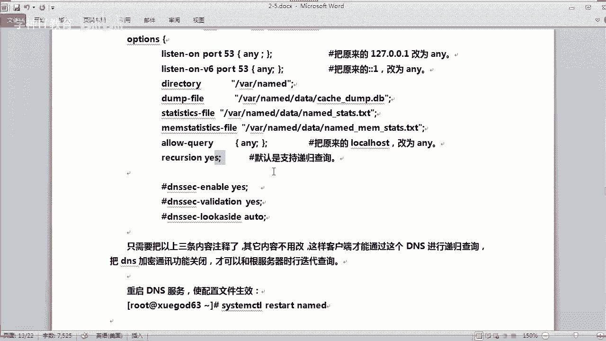

好。嗯，我应该把这个字体缩小一点啊。那上面这些的话我们都不用改啊，都不用改啊。我把这个行号显示一下。OK往下去看啊。这个看到没有？这个是这个参数是yes啊，就是默认，就是支持这个递归查询。

所以说有同学说，哎，为什么你刚才能够查到外网的这个这个解释是吧？它本身就支持一个递归的查询啊。然后嗯下面这些的话我们都可以把它关掉啊，这些的话都可以把它关掉啊，这些东西又是干什么用的呢？

这些都是比如一些加密通信功能啊等等啊，这些功能啊，我们可以把它全部关掉啊。Yeah。关掉就是我们直接干什么呀，注释掉它就可以了，对吧？啊，比如我们在这里使用这个这样。然后输入一个井号啊。O。

这样的话就是说我们把这几唉其实下面这个本身就是注释的是吧，就OK了啊。好，那你把这些注释掉了是吧啊，那么就相当于把那些什么加密通信呢，什么功能关闭了啊。

这样的话它可以和跟符器呢也可以进行一个迭代的一个查询OK。然后保存退出啊，重启服务。r打一下。那。Named。D是吧。看下重启它有没有报错，同学们啊，你看一下重启有没有报错。如果有报错的话。

那你就去排错，看一下他日志里面到底是说的是呃，什么意思，对吧？没有报错。那么这样的话就就可以了。

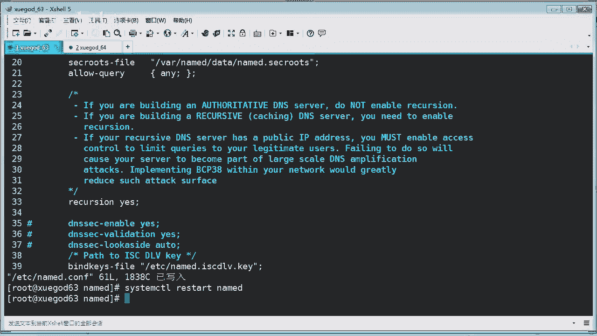

来我们看一下笔记啊，是吧，这样的话你你直接去测试的话，它就已经支持了。你看到没有？你直直接拼这个本身它的话就支持一个递归是吧？你要支持迭代的话，你把那些呃刚才讲到了那几个把它给关闭掉。

那么它的话就已经支持了。

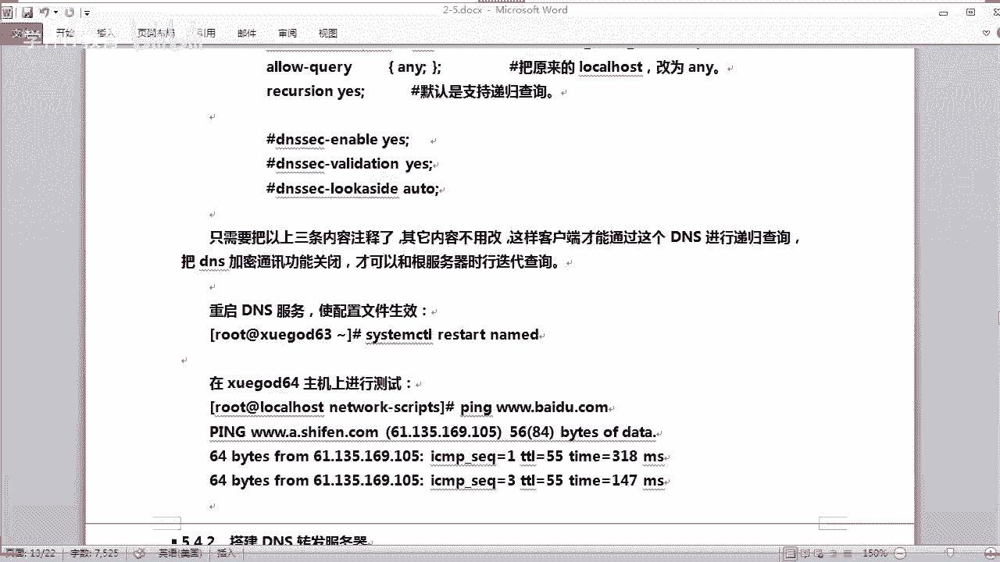

O。我们也可以直接拼一下，看一下啊，现在能不能查询。比如我们呃再找一个地址吧。什么地址？淘宝。对吧。是吧。他要有点时间啊。你看。那这个时候呢，他已经把它查出来了，对吧？就可以拼通了。如果你下次再拼的话。

他就马上就已经解释出来了。哎哦他又解到另外一个地址去了，你看没有？

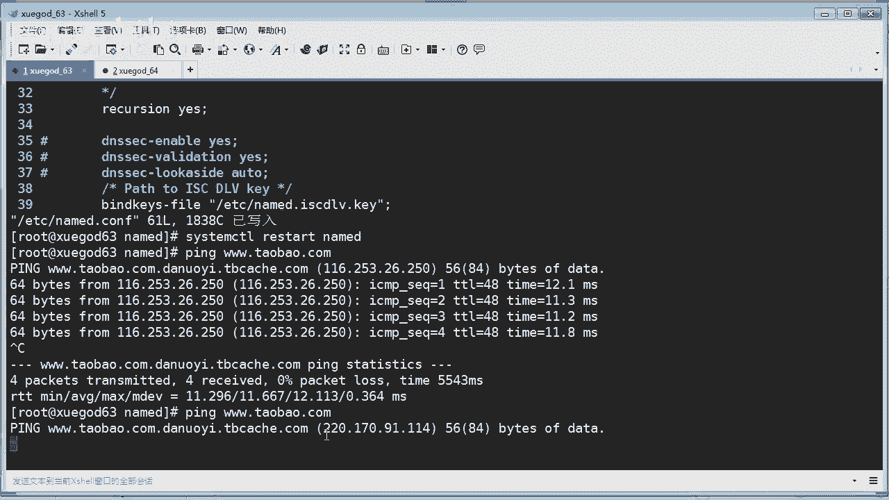

啊，他又截到另外一个地址，他又要把这个缓存。你看上面这个的话跟下面这个不一样，是不是？ok。那。如果一样的话，他马上缓存就可以马上拼通。如果没缓存的话，要点时间。O。好，那这个的话其实你把它配好之后呢。

他也就已经呃支持了，并没有什么。呃，其他的。ok。啊，然后转发应该是怎么配置呢？转发啊，转发的话呃，应该怎么配来看一下。有同学问具体是什么功能呢？前面开启这里又关掉啊，你说刚才。哪个这个这几个参数是吧？

就是它是一些啊比如加密通信的功能。嗯，你要每一个都说明一下吗？我这笔记没有写是吧？那这里讲一下，像这个表示什么呢？就比如啊像一个。这个功能叫DNS set这个功能，你要开启，就是y关闭这个功能的话。

你在后面的话不是有配的吗？这个下面这个呢就是呃这个什么呀，加密通信啊，加密加密通信。如果你上面你上面的话no的话，那你就不存在这个了。讲一次记不住，还不如写上去是吧？的确也是啊。

这个东西太周象的东西我讲一次，那这是加密通信的嘛。y就是开启加密通信的嘛。对吧然后后后面的话还有个什么lock lock lock side这自动是吧？这表示什么意思？这是说如果你把它设置case。

它呃就提供一个验证啊。比如呃一个在一个网络区域层啊，提供一个这样的方法验证，让它自动验证。懂吗？你说其实也。比较抽象啊，行吧，嗯，我等一下，后期我把它写上去啊，等一下把笔记整理一下，写上去啊。

因为这两个东西的话。可能配的还是比较少啊，所以笔记这里后前期是没有写上去啊。因为如果你把这个什么呀。他默言是支持递归嘛，对吧？你把它关了，是不是？他就可以进行什么呀啊，像这种啊嗯观缆就相当于什么。

只是有一个地柜的地柜查询本身就支持了嘛，因为这个是开启状态的，看到没有？明白没有？这个东西其实就是嗯比如在跟辅助的这个服务器进行啊，比如一些通信的时候呢，要用到比如一些什么加密通信的等等啊。

一句话说不明白啊，写上去吧，等一下啊。来，我们先把这个课程讲啊呃我们讲到这个DNS的一个转发服务器，转发应该是怎么做呢？啊，其实也很好理解啊，你看转发这个也是被注释掉了，对吧？呃，转发到底在这哪里做。

主要是在这个这里在这区域块这里去做，你看它是怎么样做的啊。

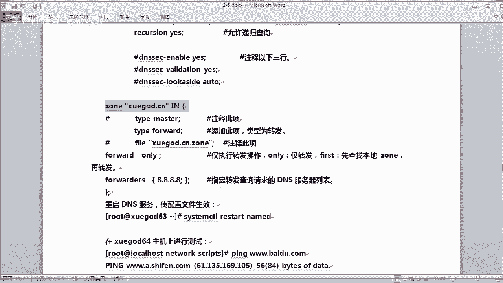

来。来，我们打开这个配置文件，然后配置一下如何转发，知道我说转发是什么意思吗？首先了解什么叫转发。就说我不解析，我可以转发到其他电子去帮我解释这个这个记录出来。明白没有？

那我应该也是啊把这个配置文件的话，你配置一下。那在哪里，你往下面去这里这个这个区域这里是吧？那我要怎么样去配呢啊？呃，你既然转发的话，那我们就不用什么呀，我们就要改这个了。类型就不是什么呀，主服器了。

对吧？那我就改成转发类型for word。对吧forward。那么你这台DS服务器呢就变成了一个转发了服务器。明白吗？那既然转发的话，你要告诉他你要转发到哪里去。是吧你转发到哪里去？

这里话啊这一条我们可以这样子啊。嗯，我先注释掉了吧，对吧？注释掉它。然后呢，我在这里的话，在这里再起一行，对吧？再起行。你要。🤧是。哎。嗯。有点感冒了。OK那么我这里要设置呢仅转发操作啊，比如。For。

what啊这样子。only啊仅转发对吧？然后呢。我要告诉他我到底要转发到哪里去，比如我转发到这个谷歌的电子去是吧，for。我。我。嗯，这里注意啊，这里的话这个forward和forward啊它有区别。

你看到没有？这个forwards的话是写什么？写你的服务器的一个列表。比如你要进行转发啊，比如在这里啊。对吧你要转发到哪里，转发到8。8。8。8，你写在这里就行了。啊，这个这个IP地址你应该很熟啊。

同学们是吧？😡，这是谷歌的DN对吧？谷歌的DN服务器，我把它转发这里去解析，对吧？哎，我自己嗯，我我我自己不解析，我可以转发给别人解释，对吧？啊，同学们有没有发现我这里有个错误？

有没有发现我这里有个错误回答我？刚才你们不说吗？注意什么呀？我这里有什么错误啊？两个错误嗯OK嗯。对。嗯，我跟你们说了，一定要你看这里的话，你写完的话，一样要有一个什么呀分号，里面都同样要哦。同学们。

然后外面这里也要。如果你不加这个分号，那你等一下重启的时候呢，就会报错。他会告诉你哎，你的哪一个是吧，第几行或者是哪个代码行有一个报错。懂吗？好，检查一遍啊。OK那么这个转发就是这样匹配。

然后要保存并退出。然后我们重启。对吧。看一下有没有报错，没有报错，恭喜你是吧，那就可以了是吧？那么这个时候呢，你看一下能不能正常解析，能，因为我们配置的转发了嘛，它重启也成功了，对吧？😊，好。

你看他先要进行转发是吧，转发给这个百这个什么呀，这个谷歌点子去解析，你看到没有？这个地址。我这个地址你们查一下。140215开头的是吧？哎，我们刚才查询好像不是这个开头的。14。215是不是？

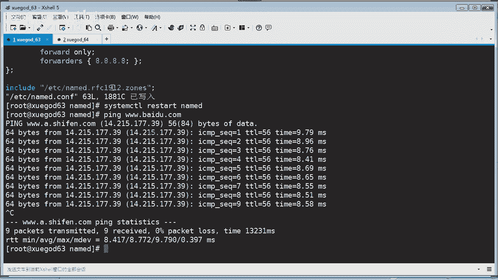

我我用我这一台台，我看一下啊。

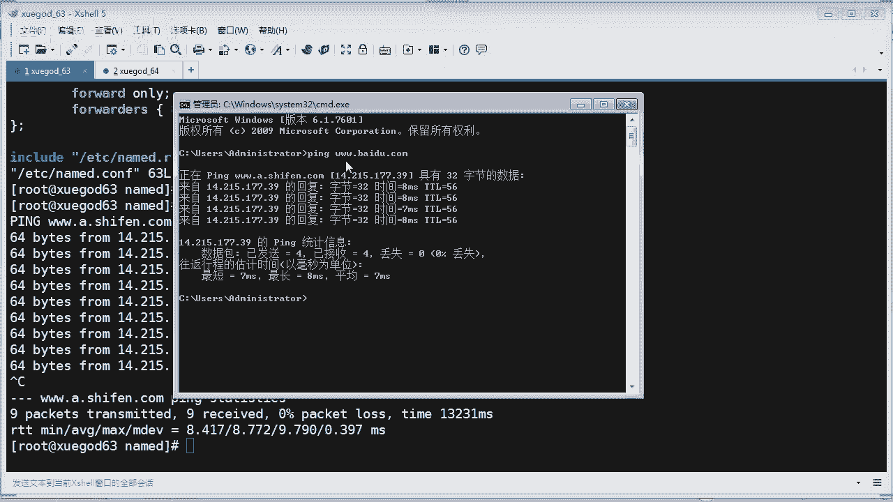

啊，要哎还真的是是吧，他转到这里了。跟这个地址一样。啊，O。好，那说明他成功啊，因为他转发之后呢，都能够拼通了，对吧？没有问题啊，OK。😊。

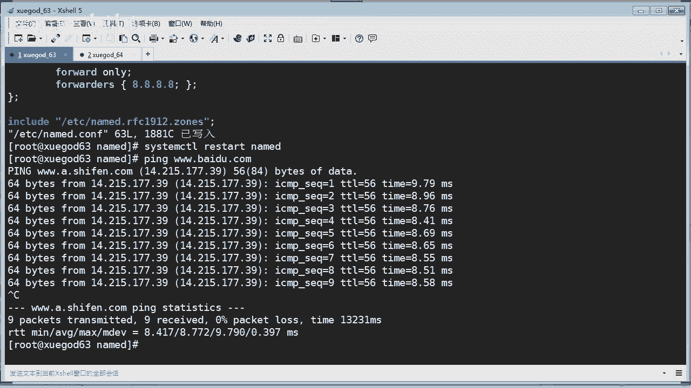

往下走啊。呃，那我们来配一台叫。叫啥？主从服务器哎主从服务器的话，那么就相当于什么呀？相当于一个冗于是吧，冗于就是我们有一个主从就要两台服务器的，对吧？需要两台电视服务器的啊，那就注意了。

我要再搭建一台电视服务器是吧？实现一个主从。嗯，以漏的拒绝干什么用？你说主从服务器干什么用是吗？OK这个问题问的好，主从服务器有什么用？那我给你看啊，就像这个。

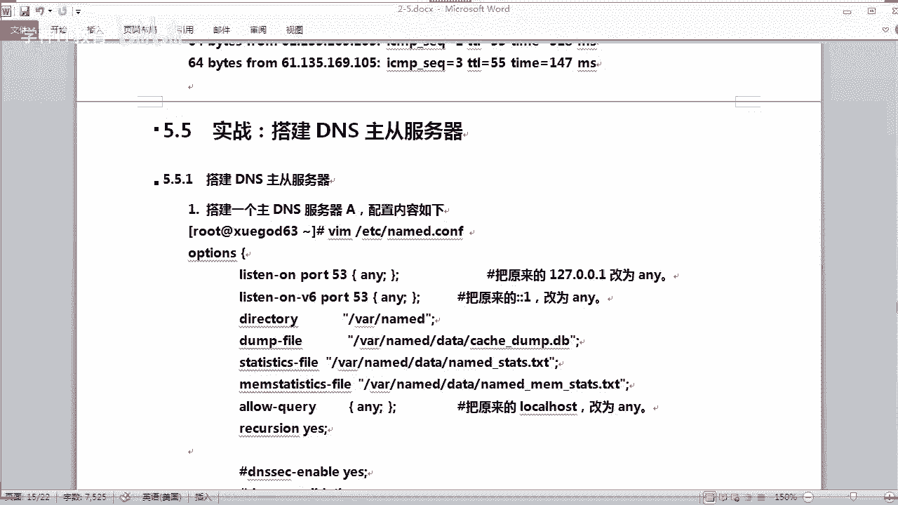

你肯定你肯定要很多台的一个备份服务器啊。

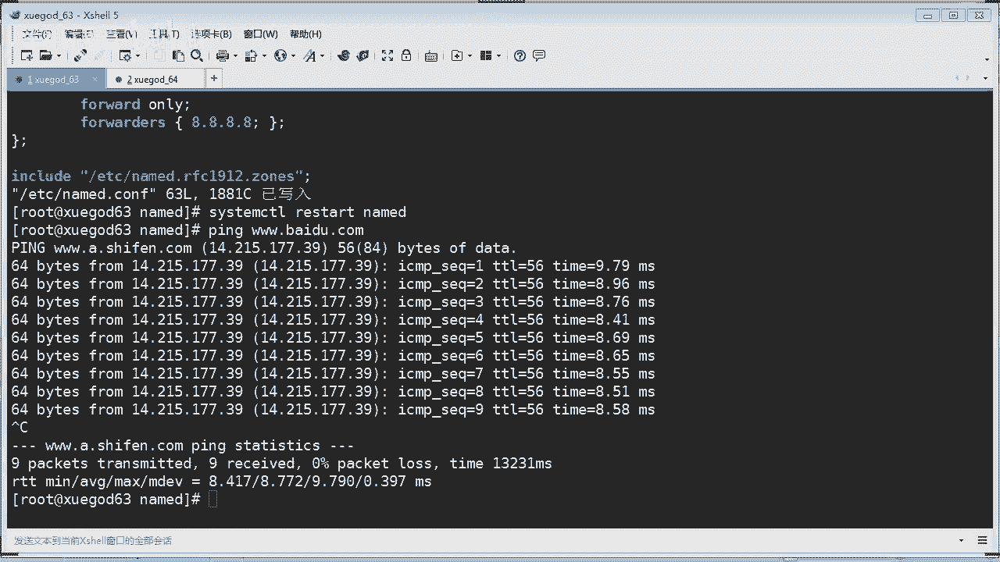

就像你我就拿百度跟你说吧，他也有备份的对吧？还有很多的这个什么呀很多的这个备份的一个1个DNS呢。你还解释出来他是不是有两台，你在这里只看到两台，你换一个DNS解释的话，他可能会看到更多台。是不是啊。

这是一台。呃，不是这个是一个地址，他还有可能还有其他的一个一个地址解释出来。你像那个嗯163的话也是。163应该有提供很多啊。对吧哎，我应该用那个那个什么来查DIG是吧？

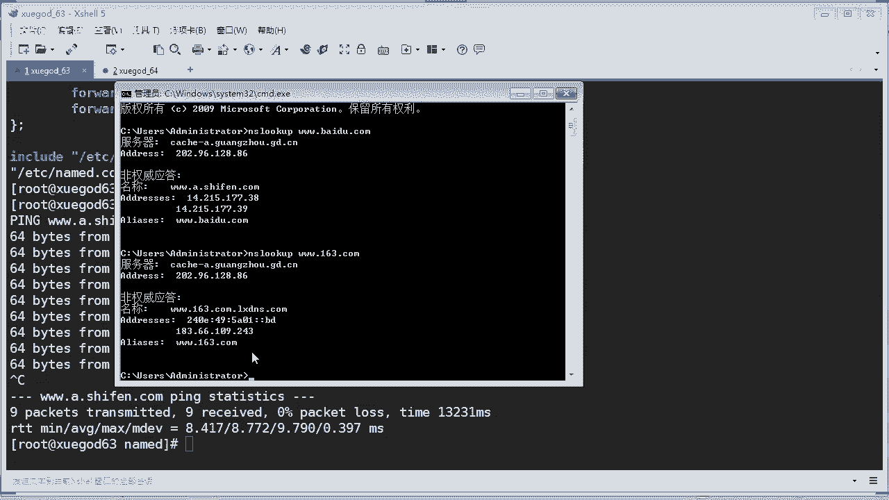

百度。你看。百度是不是提供了很多了这个什么呀？这个你看。啊，这个是什么东西啊？也就是说他有很多台的这个什么域名提供商给他做一个什么域名解析，你看。看懂了吗？其实都是他自己搞的对吧？是吧。看懂没有？

有很多啊是吧？😡，其实不止那么多啊，只是在这个区域块的话，可能他解释这么多，可能还有其他的，对不对？好，所以说主从服务器呢也有必要的是吧？来，我们来开始搭建一个主从服务器啊。首先搭建主充务器的话。

我们刚才不是搭建了一台主了吗？哦，主的被我们改了，我们改成转发了。这个时候呢我们要改一下啊，又来改啊啊name。c文件啊打开它啊。打开了之后的话，我们要改什么东西啊？😡，嗯，从头来改吧。从上往下啊。啊。

这些。对吧这些不用啊，然后递归查询啊，有是吧，然后这个还有什么？主要是这个区域这块的话，我们要改是吧？这里的话我们要改成什么呀？既然是主从，那你这一台肯定是master。是吧一台master。

一台slave嘛。master对吧？把这台雪盖63作为主服务器啊，主电ense服务器。对不对？OK然后这个的话你要启用它，我刚才注释掉了啊，做转发啊，启用掉啊，是吧？然后这个的话你就要干什么呀？

删掉了是吧，你不要做转发了。是不是啊？那这里话我们呃就既然做主充话，这里要注意一点啊，我们应该写这台是主的话，要我们这里应该啊指定一下，我们要允许哪一个网段，或是允许哪一台机作为重复务器呢？

在这里指定一下alough就是允许对吧？允许啊TRAANSFER啊这个。比如我们指定啊这台机对吧？啊，这台机当然不能用啊，我们用一台192。168。2。64这台机是吧？

或者你觉得如果你在这个网段有多台重复器，那。你可以配置一个网段，比如像这样。24。对吧也就说在这个2。0的网段的这些主机都可以做什么呀？做重复务器啊，做重复务器。OK就这个意思啊，好吧。😊，嗯。

然后呢来我们保存并退出啊，再来是重复性。然我们重启一下，看看有没有报错啊。没有报错那配置没有问题，对吧？OK。啊，注意啊，我如果我们做主充服务器的话，有一个关键点啊。

什么关键点就是你的这个时间一定要一致。你看现在北京时间2019年3月12号是吧，星期二22。08分09秒，我们看一下64对吧？64也是这个时间，而，我们的时间一致啊，如果你的时间不一致啊，在生产环境呢。

一般我们是怎么配呢？我们要配1个NTP之前我们是不是讲过NTP啊？你要保证你的服务器时间跟北京北京时间要对上的话，你可以配1个NTP，让它自动更新时间，对吧？比如配一个计划任务。

每15秒或每15分钟进行更新一次时间，保证它时间两台服务器时间是一致，对吧？要不然同步可能就会发生差异有问题啊。O。其实你在其他的一些服务的话，也是要需要时间一致，像数据库系统，对吧？

或者是像其他的一些we系统也要保持一致啊，时间这个东西很重要啊。OK那既然做一个叫什么重复务器啊，这台是学挂64。同学们，那我这里的话也需要安装什么呀？安装这个DS的这个。服务原件来，我们也装一下。好。

我们稍等一下他啊，他正在进行安装。这网络不给力啊是吧？这装的太慢了。是。哎呀，我想起来了，为什么呢？因为他这个DNS已经解析到这个这个63里面去了，还记得吗？😊，是吧我刚才应该把它改成。改成什么呀？

改成电信的DS。难怪这回安装慢了很多啊。好嘞，安装完成啊安装完成来我们做一个配置啊。嗯，我们先把这个拷贝一下吧，name co文件把它拷贝成name。诶y。ETC下面的namecom文件啊。

把它备份一下，对吧？然后呢，我们偷个懒啊，怎么偷懒呢？😊，你懂的啊，拷贝一个文件过来，我我懒得去配的，是吧？😡，啊，ETC下面的哪个文件？那c文件对吧，拷到哪里呀？😡，2。64里面去对吧？考了ETC啊。

这里面去啊。呃，是不是ETC没错啊，yes。😊，123456。好，拷贝过去了啊，我们只要稍微改动一下就可以了，是吧？偷个懒。😊，打开它啊，你看到没有？这次我拷贝过来是吧？好，上面不用改啊。

那我们哪些东西要进行啊改动呢？好，哪些要改动呢？那肯定是下面这个区域这一块的话，你要进行改动啊。比如这个里这里的话，因为你是重复性啊，你这个类型就要改。改叫slave。啊，斯夫啊，就是重复性啊。

然后这个文件这个文件本身就没有是吧，我们让他从这个什么呀，从这个master就是你的主合器去拉取过来，就是同步过来。你只要在里配置一下叫sve啊。这样sves啊，它就会去同步过来了。它生成啊这个文件。

我们重命名就改一个名称啊，叫fi啊，后面加多一个后缀区别出来嘛，对吧？那么这样的话，他会去你的ma里面去是吧？同步你的这个区域文件，就数据文件同步到本地。本地呢从命名为这样的一个文件，懂了吗？

放到我们的这个洼下，对吧？那里面去啊，就可以了。那然后这个下面的话也要改是吧？这里。那这里要改成什么呢？你要告诉他master你的主是谁呀，对吧？告诉他啊，你的主人是谁，看清楚你的主人是谁啊。

你要在这里写清楚啊，你的主人啊，你把它写在这里，比如是2。63。是吧你告诉他我的主服器是19201683，他就会去这里啊，去去这里这里去同步你的数据过来，对吧？同步那些记录过来好OK。😊，好嘞。

那这样的话就配置完成保存并退出啊。OK。注意啊，这些地方的话你要注意啊，有些地方你看像这个ss，这里是加S的是吧？这是mamas，看到没有？mas并不是master啊，有些是加S的啊，同学们啊要注意啊。

这个时候呢我们就可以启动。服了是吧，你可以重启啊name。好，看一下有没有问题啊，重启没有报错，那说明成功了。然后这个文件它是不是已经同步过来的呢？我们只要去找一下下的name下面有没有啊slave。

你看如果你发现有这个文件说明同步成功啊，对不对？因为这个文件本身我们就没有生成的，它之前这里就是空的。是吧他同步过来呢，他就写到这里面去了，就会生成这个文件，说明已经同步成功了。ok。

这样我们来组成同步就可以了。那你看一下，我刚才不是把这台机的DS改成了。653嘛，那我现在再改一下。我改成什么呢？我改成本机地址，你看能不能解释啊。我应该改成啊64。对吧。因为同64。

它也它就是一台DN服务器的，虽然它是重服务器是吧，但是它也能够正常解释了，是不是？O。没问题吧，我已经改了啊，改成6次了，就是本地地址。然后来我们看一下能不能正常的解释一个，比如淘宝。看啊，稍等一会。

你看出来了吧，是不是很明显是吧？你看这个他有多个地址啊。😊，啊，对已经解释出来了。而且是通过64这个DS服务器解释的。对不对？没问题了吧。啊，OK。😊，都可以的是吧，那相当于两这个主从服务器啊。

它都是什么呀，共享了这个这个数据，对不对啊，OK。那这样的话就可以了是吧？那么其实你有多台DS像这种主充的话，你还可以做一个呃，怎么说呢？做一个叫负载均衡。其实复用DS来做负载均头呢，其实作用并不大啊。

但是我这里跟你讲一下。什么负载均衡？比如你的像淘宝网站，它是不是有很多weber服务器，对吧？那肯定他要做负载均衡啊，是不是？但是它并不是用这个像我们这种简单的DS来做，是吧？他要做的话。

也是用CDN或者是智能啊智能的DNS来做啊，或者通过其他的一些高可用的原件来实现啊。那这里也讲一下啊，虽然这个作用并不是很大。呃，怎么样去通过DNS为一个网站呃做一个负载呢？

那也是在我们的这个区域文件里面去做啊，比如。我就拿这台主的来说吧。嗯， Russia夏的name。下面的什么呀学挂啊，有假如嗯打个比方啊。打个比方，学生的这个网站啊是吧？呃，他为了提高这个。

因为这个访问量很大是吧，所以呢他就部署了两台webo。那么两台web呢，你访问哪一台呢，看到的页面都是一模一样的，对不对？后面你会讲到这个什么呀，讲到集群是吧，比如集群是吧，那比如这个嗯我再写一条。

应该这样写。YYP。YYP对吧？我copy一条。这样你们应该看得懂啊。对吧比如这个解释解析到63，这个呢我把它解释到64。也就说有两台we博啊，对吧？😊，那么这个学程的网站，它有一台vivo是2。63。

有一台webo的话是2。64，它内容是一样的啊。那么无论你访问哪台是吧，就相当于负载。那你看到的内容都是一样的对吧？那这种方式就通过DS来进行一个呃复载。比如这里写一个。写个一。好，O。那这里也写一个。

一啊。这表示啥意思呢？就是说这个负载均衡它记录保存的是一秒是吧？表存了一秒啊，就说你访问这个悬挂啊W悬挂点CN的时候啊，那么它有可能是访问这台服务器，也有可能是访问这台服务器。

这种就是通过DNS的方式来做一个负载均衡。但实际当中的话这样做呢呃作用并不是太大啊，因为本身这个功能并不是很强大的啊，它不是专业做负载的。OK呃，现在不是有智能DS吗，对吧？智能DNS或者是CDN啊。

应该是通过CDNCDN的话就可以实现是吧？比如全世界分布式啊，全世界分布式这种方式的话是最好。但CDN你得花钱了，是吧？那肯定呢人家帮你干活，你不花钱怎么行？可以实现全全世界的一个分布啊，非常的。

非常的好是吧？ok。那。看懂了吗？像这样话。来然后我保存退出啊，然后重启一下啊。你看一下有没有报错啊呃，wes下 name。好，没有报错是吧？比如我现在解析给你看一下啊NS。Look。

对吧我解释一下这个网址，你会看到有两个，对吧？对不对？从2。63这个DS服务器解出来，解析这个学生的网站呢，它总共有两台服务器，一台是2。63，一台是2。64。

对吧就好像我们刚才解释淘宝啊、百度啊1631个道理，懂吗？ok。好嘞，那这样的话我们这个做完了是吧？然后我们来讲讲这个。

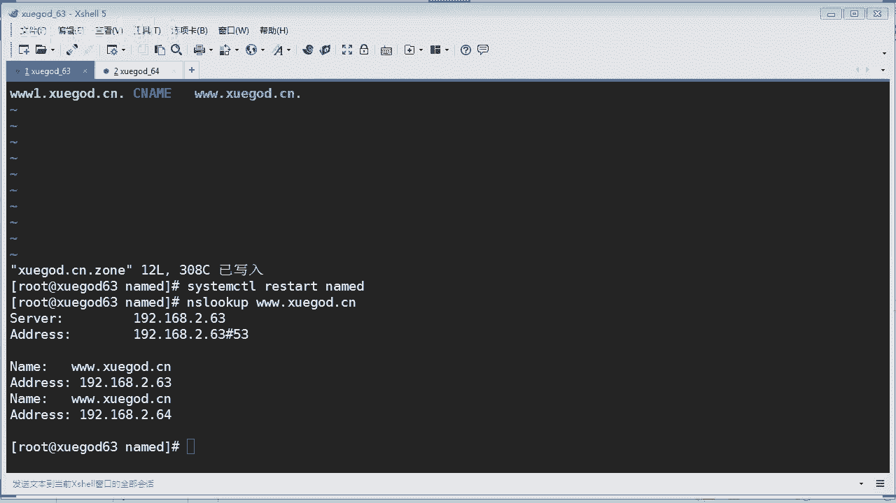

讲讲什么东西呢啊，往下去看。😊，讲讲这个叫主从密钥认证啊，我们刚才的话去什么呀？主从同步呢都是什么呀？这种主从同步是没有加密的啊，没有加密通讯的。所以呢如果你要实现加密通讯的方式进行一个数据同步的话。

我们应该加上这个密钥认证的方式啊。呃，这个其实什么呀？其实做DNS服务商啊，一般都会使用什么密钥认证啊，要保证数据安全嘛。这个应该是怎么样做呢？来，我们来做一下啊，如果你要实现主从两来服务器。

通过密钥验证的方式来进行什么通讯。就像你使用什么SH这个无密码是吧？密钥登录你的服务器一样的道理是吧？那这个时候呢我们应该创建一个什么呀，创建一个证书，对不对？

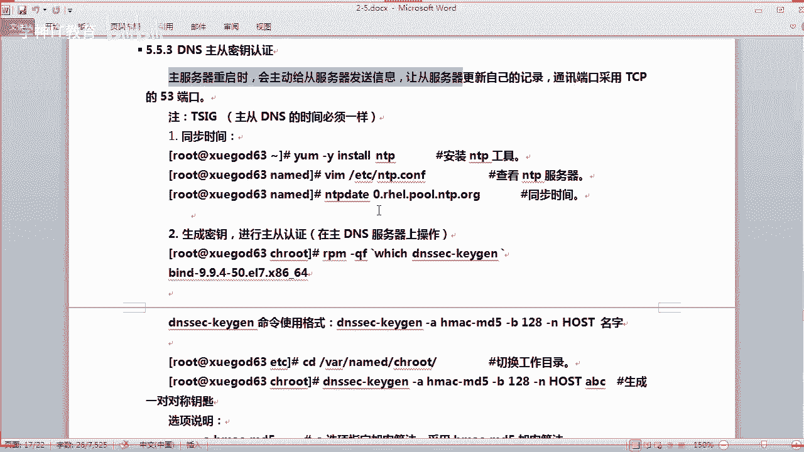

来。那63是主服务器，6四的话是重服务器啊。首先的话来，我们先生成一个什么呀，生成一个。证书。就是生成啊密钥嘛，是吧？怎么生成呢啊，其实它本身这个这个DN服务器呢，它就有什么呀相关的这个工具啊。

那这个我相信你们又想起这个命令了啊，这个命令刚才我们在注释的时候呢，有讲你看到没有？这个命令啊。哎，怎么tableable的不出来呢？哦，我打错了啊，DNS是吧。

1SEC你看能tableable的出来吧，这个是用干什么用的，知道了吗？就是加密通讯，对不对？加密通讯是吧？所以这个东西呢它可以生成一个什么东西呢呢？kid啊ki。点OK那然后我们来生成一个东西啊。嗯。

后面的话加上算法，杠A表示什么呀？指定加密算法。比如我们使用这个。MD5的算法。对吧使用MD5的算法，然后呢杠。B杠B的话指定什么？指定你的密钥长度。比如我们使用啊128位的是吧，128位128OK。

然后最后的话指定啊杠N就是指定你的密钥类型。比如是我们这种叫主机类型啊，所以我就写什么呀？写这个主机。比如主机类型就是horse啊，然后后面的话写上你的什么呀，写上你的名字就可以了。就是你生成密码。

密钥还有一个名字，我们就叫ABC吧。好不好啊，就这样。来申请一个。那么这里生成的话，它有点时间，因为它要有一些随机性的一个过程。所以我们这个时候呢应该创建一些随机的一个随便啊搞一些东西。

比如我要进行查找一个。这样的东西啥意思呢？这样有利于什么呀？有利于于它生成这个你看很快就生成。然后这个时候我们可以停止。就是说他有一些随机的事物啊，明白没有？你可以做一些什么东西动作啊。

让它产生一个随机的一个什么秘钥啊，就这样的意思。ok。那就可以拿是吧，生成了这个密钥对了，我们就可以看一下当前的这个目录。哎，是当前目录吧。你看在这里。当前目录是在。哦。我不应该把它生成到这里是吧？

我应该把它生成到那个啥。算了，我把它拷过去。啊，是考到考到哪里，考这个目录啊，CH rootot一般是放在这个目录的啊。K啊，那把这个。拷到当前目录的CH root里面去啊。OK那这样的话。

我们就进到这个CH里面去啊，看一下啊，就在这里是吧？啊，当前目录你看一下在哪里，你在这里啊哇下 thename，然后s里面去啊O。嗯，好，然后我们看一下他的这个密钥啊。K什么什么什么对吧，这个是。

PR什么什么啊，你看。是吧我们虽然看不懂啊，他这些东西，我们只要记住这个东西啊，这个是他的什么东西啊，这就是妙，我们要拷贝这个东西出来。对吧这东西有用啊，是吧？

ok或者是另外一个也可以看到啊那个kid你也可以看到是吧？kid啊，你看。😊，一模一样的对吧？这个跟这个key里面显示的是一模一样的啊，对吧？一模一样的啊。好，然后我们修改一下我们的这个DNS啊来。

修改电子服务的配置。namecom文件啊，把它配置成呃加密通讯是吧？呃，这个应该是怎么配呢？啊，来看一下啊，这既然你要加密通信的话，那你就要把这个这个注释啊。启用它。对不对？

要不然他怎么样进行加密通讯呢？你说对不对？OK知道这个东西有什么用了吗？OK然后的话我们在这个下面区域这里啊要改什么东西呢？啊，我们要在这里添加啊，在上面这里啊。注意我是在这里添加的啊。

在这个区域上面啊，你要添加什么东西啊，你要指定你的这个什么呀？这个key就是指定你的密钥一些东西。A you care。ABCK对吧？我们刚才创建了一个叫ABCK。对不对，一个一个一个一个密钥嘛，对吧？

好，OK然后我们应该啊。是他的算法是吧，算法这里要指定。那。嗯，算法是什么呀？HMAC。杠MD5啊，选MD5的算法，对吧？ok。然后还指定他了一个密钥啊是吧，密钥是什么？这个叫sly是吧？SCRET啊。

好，这个的话他要用场了，对吧？刚才我们拷贝了他的这个这个密室，对吧？这一串东西啊，对吧？把它拷过来。注意啊，这里有分号对吧？把它写完啊OK最后啊你这个的话要以这个结尾对吧，结尾。

OK那么这样的话就可以了，是吧？😊，好，也少了一个分号，我，差点忘了啊。好，我们这样的话就已经写完成了啊。下面还要配什么东西吗？这个区域。要的是吧。

因为他使用的是一个一个使用的是密钥的方式进行验证通讯啊。那么这里的话我们应该写上写上它的一个通信方式啊，通信方式就不是通过IP这种方式是通过TCP的方式直接啊，就通信的同步了，对吧？没有什么的保密性啊。

我们这里调整为K的。ABc。Kid。啊，使用这种方式进行一个通信OK。好，那这里就配这么多，然后保存退出。来，我们重启一下，看看有没有问题啊。哎，重启重启啊，算了，自己写。我打一下啊。好。

重启没有问题啊。OK然后我们去到这个重服务器这边啊，重服务器是学开64。这边的话你要注意也要配一下啊，配一下啊，使用它加密通信的方式。name co文件啊，打开它。嗯，我们还是从上面往下讲啊呃。

首先的话你要干什么呀，这里要取消，对吧？我们选用V模式啊，对吧？V模式。好，一次性把它删除啊。然后的话也要啊一样是啊，其实我们拷贝过来就行了，你觉得呢是不是更快？啊，算了。手工手工添加吧啊。

想偷个懒的不行。这里啊写上什么呀，写上你的key了。ABCK啊，对吧？是不是AVCK啊，然后。这个。嗯， ok这个。好，然后写上你的。算法。哎。HMAC。杠MD5MD5啊MD5的一个算法，对吧？ok。

然后这个的话是。C。s古励是吧，就是你的。这个密是吧，密码。O。好。那这个也要加上一个分号啊。对吧写上去啊，OK。好嘞啊，往下去看啊，我们这里还会什么样？这下面的话也一样啊。

把它改成那个那个它通讯方式是吧，改成使用key的方式啊。不过这里的话一样还要写上1个IP地址啊，只不过是加上什么呢？加上K的ABCK。OK就这样啊。😊，He1号ABCK啊。

使用这种方式进行啊一个通讯就可以了。好，要保存并退出。那然后我们重启一下啊，看看有没有问题。然后namedD。好，没有问题啊。那么没有问题的话，那说明你的配置是没有没有错的啊没有错的。

这个时候呢我们就要测试什么呢？测试。嗯，能不能同步成功，是不是能不能同成功？但这下面是不是有一个sve，下面是不是有个这样的文件？对吧那假如我把这个文件删除了，我再重启。如果他都能同步过来。

那么说明他就能同步成功，通过加密方式同步成功，你说对不对？是吧这个叫学尬点啊，我把这个文件删除掉啊，来我们再查询一下，现在是空的啊，这个目录是吧？来，我们再重启一下。好，我再查查看一下，发现没有？

这个文件已经被重新同步过来了。那说明他能够通过加密的方式通讯同步成功了，没有问题。对不对？OK能不能正常解释，你也可以随便解析一个地址就知道了，对吧？肯定可以的对吧？是吧。可以啊，没有问题啊。

第一次解释稍微慢一点啊。好，可以啊，没有问题啊。呃，那这样就成功了，是不是？啊。贵的啊。很方便，是不是？那么讲一下这个and slow2的话，你们会用吗？是吧？比如我要进行呃。比如是吧我要解释一个地址。

学告。对吧我要解释这个地址，他马上就解释出来了，你看到没有？对不对？他目前用的是什么呀？64的这个DN服务器进行解析这个斜挂点悬挂点CN对吧？那如果我要换1个换1个DS，我应该怎么搞？

你可以在这里直接输2。63，使用2。63这个DNS服务器呢去做一个什么做一个解析啊。来来，你看一下啊，学挂这个你应该应该懂吧，同学们对吧？那就切换到另外一台DNS服务器了。我是不是可以？

换到其他的这些DS进行解释呢也是可以的。这个只是NSLR的这个工具啊，比如我使用。这个202。96。134。133，这个是什么呀？中国电信的DNS是吧？那我使用这个单词来解释月文可以吗？

你看一下啊呃学尬。点先。你看没有？他马上解释出来，就是以这个开头的学改，这个才是真实的一个什么呀？IP地址就是我们学岗网站的IP地址，看到没有？它是通过这个电信的DS服务器解释出来，这才是真实的IP。

对不对啊，OK。😊，这个你们应该会啊。嗯，但呃，其实你装完了这个这个DS工具之后啊，它有个叫DIG的工具。这个你们用过吗？比如我用这个来解释学挂。点先，你看。他目前的话就会去干什么呀。

去调用你本地的DS进行解析是吧？所以解析出来的话，有两个地址，2。63和2。64。因为我们的这个缓存里面刚才配了，对吧？它就是指向了这两个地址，还记得吗？ok。😊，他的这个啊DNS对吧？

DNS的这个就是这台机啊。ok。DI句的话还是蛮好用的。比如你可以指定啊，比如你要解呃解析，就我就拿这个悬卡点。看我们来说吧啊，比如我要用一个叫其他的。怎么说呢？用8。8。8点对吧。8。

我用这个来解释可以吗？你看他解释出来地址呢，就是真实的1个IP地址。因为我让他指向到这个谷歌的DN进行解析这个域名。是吧你可以这用这种方式进行解析啊。这个嘛还是蛮好用的啊。

因为DIG的话嗯还是蛮好用的一个工具啊，用来做一个测试。O。好嘞。来看一看啊，今天的内容的话，我们就已经讲完了。同学们啊，我看看啊，今天我们讲的什么东西啊。😊。

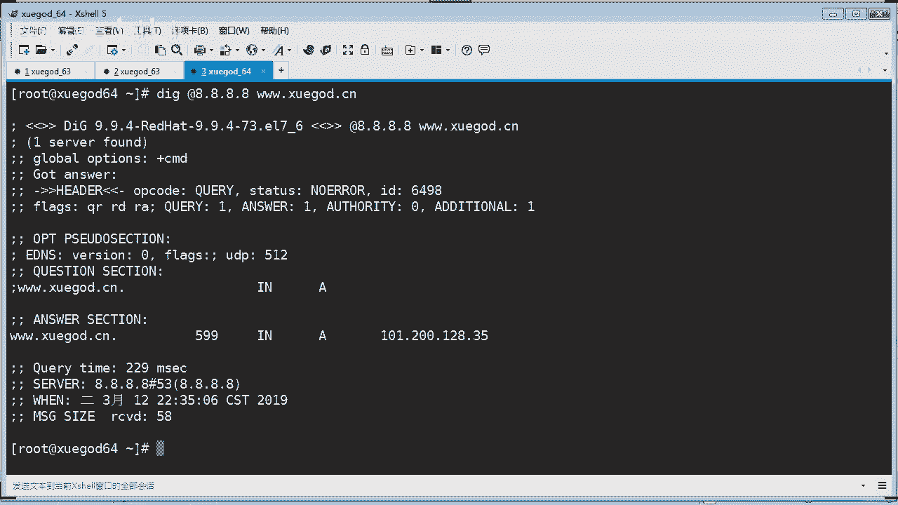

啊，讲了DNS是吧，什么是DN啊，怎么样去安装和配置。然后呢，我这边在内网搭建了1个DNS，对吧？然后还讲了递归查询，对吧？还有这个呃转发。转发啊，然后是什么呀？

搭建主从DS啊搭建主从DS啊OK主要是讲了这么多内容啊。现在是10点36啊，同学们啊呃OK行，那我们就下课吧，好不好啊，没有做实验的同学，明天好好的看视频再做一下啊。OK。

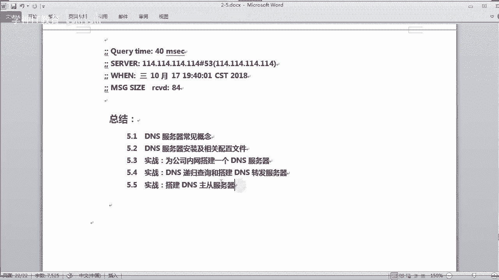