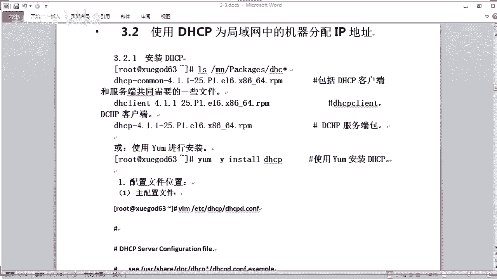
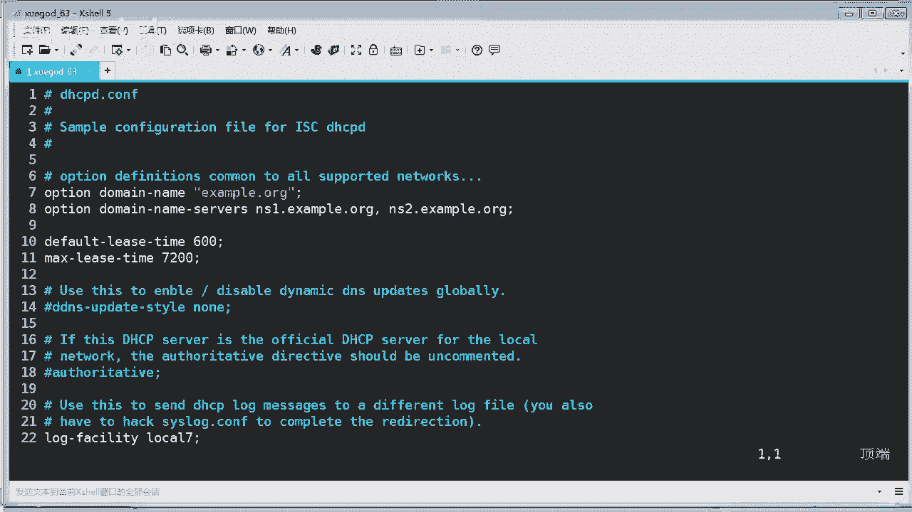
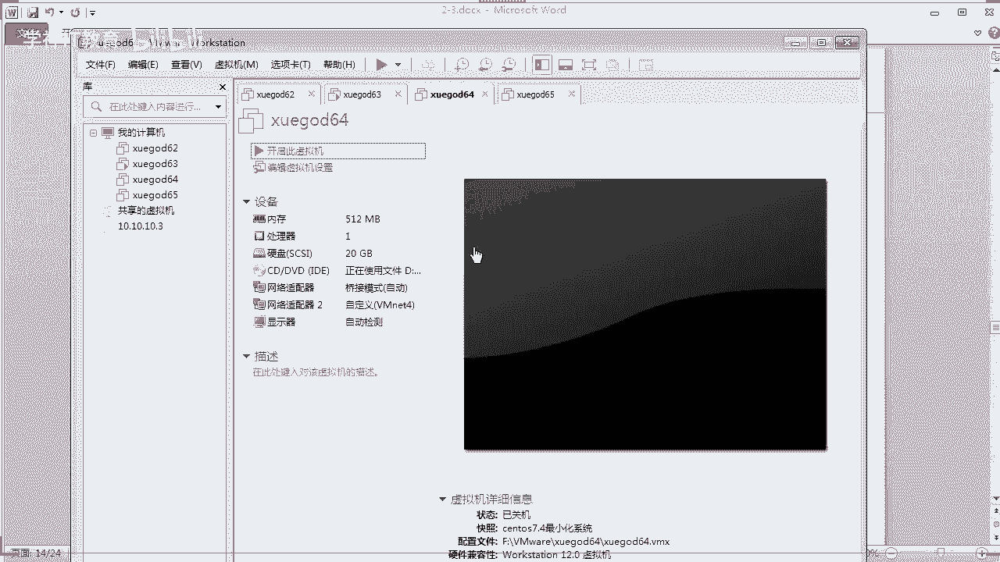

# Linux／Linux运维／RHCE／红帽认证／云计算／Linux资料／Linux教程--DHCP搭建及NTP同步时间 - P1：DHCP搭建及NTP同步时间 - 学神科技 - BV1pV41167iG

今天晚上的话是呃第二阶段的第三章啊，那么讲什么呢？讲DHCP是吧？DHCP是干什么呢？我相信很多同学都知道干什么用了，对吧？因为咱们身边啊，无论你你现在啊其实每个人都在接触，可以这样说，是不是？

因为你要你手机是不是要用wifi呀，是吧？啊，如果你没有电脑，你总有手机吧，人家都有手机手机你要获取wifi地址的话，它都是通过什么呀，通过DHCP服务器分配的1个IP地址，对不对？所以这个东西呢。

虽然是说我们是摸不着看不见，但是平时我们是非常常用的一个东西，是吧？对不对？只不过这些东西的话都是自动完成了啊，是不是？还有1个NDPNDP的话是时间同步啊，主要是讲一下DHCP服务。

我们会讲到DHCP啊这个工作原理是吧？怎么样使用DHP啊，DHCP为局域网中的机器啊分配IP地址。对对。怎么样使用DHP为服务器分配一个固定的IP地址的对吧？其实我们的路由器就能实现这样功能，对不对？

我们路由器它就可以实现分配固定的IP或者是动态的分配。对不对？最后再讲一下这个NDB啊同步时间的问题啊。那么今天的话我们需要准备啊两台试验机啊啊血个63和64啊OK。嗯。

讲讲啊这个DHCP服务器的工作原理啊。DCP啊叫动态主机配置协议啊，动态主机配置协议啊，它的对DHCP啊，它是一个什么呢？是一个局域网的网络协议啊，局域网的网络协议使用UDP协议工作。哎。

这一点要注意是吧？它使用的是UDP协议的工作啊，主要有两个用途啊，有什么用途呢？第一个给内部的网络啊，内部的网络或者是网络服务供应商自动分配IP地址。是吧。主机名。DNS服务器还有域名等等是吧？

包括你你现在不说你家里的路由器了，你家里的路由器。所以他要获得什么呀？如果他要获得这个比如像这个电信运营商的地址。那么很可能也是通过电信云上的DHCP分配过来的一个地址，对吧？

现在电信运营商他为了就是怎么说呢？也可以说是为了省钱是吧？有时候呢，他分配一个私有地址给你有没有有没有发生过这种情况的同学，我相信应该有是吧？真的我一到很多人啊都投诉电信，哎，怎么给我分配个私有地址。

毕竟。并不是一个动态的公网IP。对不对？有这种情况是吧？他这样的话就可以省钱，反正你就是要上能上网就行了，管你啥IP对吧？但是专业一点用户呢，他就不一样，哎，你必须给我一个动态的公网IP是吧？

动态你都不给，那动态的公网你都不给，那不行，是吧？咱们当当初签的协议就是要公网IP的，对不对？所以你这个你可以打电话投诉啊，他就会帮你重新分配一个动态的公网IP啊，对不对？要维护自己的合法权益嘛，对吧？

😊，第二个啊配合其他的服务实现一些集成化的管理功能是吧？像无人值守安装服务器。哎，这个里面有讲过吗？对吧？你要实现无人值守安装的话，是不是你得有一个什么动态分配是吧？就通过这个DHC动态分配这些机械。

因为无人值守安装完之后，你肯定要有IP地址啊，没IP地址，它怎么去下载啊，下载一些什么软件包等等。O。好，那DHCP的话是CS模式，对吧？C模式DHCP的服务端和客户端的话需要保持通讯啊。

DHCP是基于什么UDP协议啊，刚才讲了双方都有可能会主动向对方发起一个通讯，因此双方都什么呀？都需要监听端口啊，都需要监听端口，那么s端的话，它运行的是DHP的服务啊，对吧？监听端口是什么呀？

6767啊，那客户端的话它也要运行什么呀？HCP对吧？它监听端口的话是68。O。好，那么以前呢他其实叫做一个什么啊bosterPS这样的一个一个一个服务来的啊。现的话我们统称叫它为一个什么DSCP啊。

那他有一些哪些特点，你来看一下啊。自动分配IIP地址啊，这是它最大的一个特点是吧？方便管理啊，就是像你家里的这个路由器一样啊，无论你接上了电脑，只要把网线插上去，你的网卡它默认是自动分配的啊。

一接上去呢，它就有什么呀，它就会分配，自动分配1个IP地址，那么你就可以上网了，对吧？包括DNS啊域名啊这些东西什么都分配好了，非常的方便，一接上网线就可以上网，那么这个DSCP最大的一个好处啊。

D7DHCP不会同时租借相同的IP地址给两台主机是吧？这是它一个一个机制吧，对吧？不可能分为同1个IP给两台主机，那不是冲突了嘛，对吧？啊，如果你发生冲突呢，他是不是提示你啊，哎，网络当中是吧。

有一个冲突的IP地址跟你的主机名IP地址一样，对不对？DHCP管理员呢，它可以约束特定的计算机使用特定的IP地址。什么叫约束呢？就是说我可以。按照指定的条件给分配一个固定的IP地址。

给固定的这个什么呀这个主机也可以这样去实现是吧？可以为每1个DSCP作用域设置很多的选项，比如可以多个地址池啊，对吧？等等，多个网段等等是吧？那么客户机在不同的子网间移动时啊，不需要重新什么。

不需要重新设置IP地址，每次都自动获取IP地址就可以了。就比如你办公室是吧，如果你设置的是自动分配的，那这个同时呢它搬到另外的位置上去了，是吧？它要重新设设置IP地址吗？不需要是吧？它只要接上网线。

它就自动给你分配了，是不是很方便。但它有缺点呢？有什么缺点呢？当网络上存在多个服务器时，1个DHCP服务器不能查出已被其他服务器租出去的IP地址，这个就不好办了，是吧？如果多个啊。

一般你同个网站上有多个这DHCP那就乱套了。那曾经呃在咱们办公室也发生这种情况是吧？那么有些人呢他可能自己买一个路由器唉，也装上去。那么他这个路由器呢也有一个什么呀？也有1个DHCP的服务。

他就会向其他同事呢有可能也会分配IP地址。对不对？这就乱套了，对不对？这样的话就会导致一些冲突，会导致什么呀？如果网关一样的话，导致内网无法上网等等。这种情况有没有发生过？同学们应该有这种情况吧，对吧？

因为他。你他不能查出其他啊其已被其他服务器租出去来壁纸是吧？没办法啊。DHCP服务器呢不能夸路由器，一、客户及通讯啊，除非路由器允许什么这个boot。TP协议啊转发，如果他允许转发的话呢，就可以是吧？

嗯。那你看一下它的端口的话是工作在6768是吧？我们可以看到是什么DHCP啊，OK。刚才我讲到了啊DSCP协议啊，它以前的话是有什么这个boPTP啊协议。啊，这个协议发展而来的，以前是这样叫的，是吧？

对不对？后来的话呃慢慢发展是吧，开发了一个新的版本。最后的话啊最后变成了DHCP了啊，变成了DSP它以前是叫样用这个协议啊，这个协议啊，它可以让无盘工作站从一个中心服务器获得IP地址。

为局域网中的无盘工作站分配动态IP地址。并不需要每个用户去设置IP地址啊。对，这个是它的优点。啊，好。那么以前这个协议的话，它有一个缺点是什么呢？您在设定前啊，事先要获得客户端的一行件地址。

而且MS地址和IP地址对应是静态的。换换而言之的话，这个呃这个协议它非常缺乏动态性，又在有限的IP资源环境中啊，这个协议啊一对一对应会造成非常可观的一些浪费啊。以前的协议是有缺点的对吧？那DHCP呢。

它可以说是这个协议的一个增强版本啊，它分了两个部分，一个是服务端啊，另外一个是一个客户端。那么所有IP啊网络设定呢都是由什么由这个服务端来集中化管理，这样就好办多了，对不对？

并负责处理客户端的DHCP请求，啊客户端的话会使用从服务器分配下来的IP环境数据，就说你要设及什么IP啊域名啊DNS等等这些东西的话，都是由什么由中心服务器来集中管理啊。对吧它相对于这个来说的话啊。

DHCP它是有一个什么租约条件。对吧有效，而且是动态的分配客户端的TCPIP设定啊。而且作为兼用考虑的话，那么DSCP也完全兼顾了以前这种啊已程这种协议的需求是吧？所以现在一般我们都用DSCP了啊。

这个是它的一个运行的一个原理图是吧？首先客户端的话，你首先你要什么，你要广播，哎，我现在要请求啊，请求呃请求请求什么请求分配地址。那么他请求呢，他就发发送过去，反送发送的话，他就会干什么呀？

假如这里有多个DHCBC的话，那他会怎么办？是吧。你看。他啊，如果是有一个已经回应他的话，那么其他人的话他就不理了，明白没有？O。你看一下下面啊，我们看文字这里啊啊DSCP啊客户端的发现阶段。

什么叫发现阶段呢？你看一下啊，客户端寻找什么呀，寻找这个服务端的过程呢，对应于客户端发送什么，发送一个请求，就相当于一个广播了是吧？因为这个端的话，对应于客户端是未知的，是不是未知的，当然是未知的。

对不对？所以客户端的话发出的这个报文的话，是一个广播包啊，广播包，那就是假如你多个DCP服务器的话都会收到是吧？它原地址是什么0。000啊，那么这样就是所有是吧？

网络上所有支持这种这种啊TCPIP的主机的话，都会收到这个什么这个广播的一个报文。对不对？那么但是呢，只有什么呀？只有点这个s会响应报文啊，注意只有s端会响应报文。那如果有多个s端会怎么样，你说呢？

注意啊，客户端执行了这个广播之后呢，如果没有DSCP响应客户端的请求，那么客户端会随机使用什么？假如你的网络上是吧，你在你这网络上完全是没有DSCP响应的话。

它就会什么它就会填一个这样的一个网络地址进去，你们都有印象吧，是吧？是不是这个是windows呃专有的1个IP啊IP地址范围啊，如果找不到地址，他就给你分配一个啊。

那么这个的话它就会相当于你的本地链接打叹号了，对吧？打叹号这时候呢是不能上网了，因为它找不到这个DStable分配地址。是吧早期的linux呢是没有这一条路由的啊，它现在是为了和windows兼用的话。

也写上了这一条啊O。好，我们往下去看啊，查看客户端请求地址的系统日志啊。那么现在我们还没有装啊，装的话，你就会看到啊它是一个比如在广播的时候呢，它就会发送什么呀？发送广播的一个日志是吧？啊。

如果有响应的话，这里的话也会也会有一个日志，那无非就是说哎广播出去的，然后别人是不是分配地址回来，就这样的意思啊，这个root杠N的话是查看什么呀，查看你的网关，对吧？哎如果有分配成功的话。

你会看到网关，对不对？OK那么等一会啊我们来装一下啊。嗯。第二部分啊刚才是广播的一个阶段是吧？广播完之后呢，如果有s响应它对吧？有这个s，那么就是s提供阶段啊，响应了你的客户端的一个广播报文是吧？

那么他就会这什么？啊，他就会做出一个响应，怎么响应呢？比如我收到了哎，我马上响应。如果我想啊我就响应响应的话，我就从一个未出租的一个IP地址呢挑选一个分配给客户端，对不对？

像你的客向这个客户端发送一个包含出租IP地址和其他设置的什么呀DDHCBoffer提供信息，就像你去面试一样，如果你你发出一个面试的一个请求，对吧？如果面试通过了呢。

他就会发一个什么呀发一个offer给你什么offer，就面试通过他会发一个提供相关offer，比如让你去报道啊，什么要带上什么资料，对不对？那这样。就相当于这个原理啊。OK好。

把这个offer发发回来之后呢，那么客户端这边的话，他就干什么呀？他就会接收到啊，如果有多台的s端啊向他发offer，比如你们找工作不是海投海投这个简历吗？那如果有很多公司给你发这个什么呀。

发这个offer。是吧。如果你接到很多公司老访，你你就会挑选哎，我应该选选个工资高了。还是说哎我选一个待遇好了，选一个离家近的。对吧但DSCP呢他不是这样去选的，并不说要挑选工资什么的。

他会DSCP的话，他只接受第一个收到什么呀收到offer的。你看他还是挺忠诚的是吧？反正我就收到第一个给我发offer的人OK然后他就以广播的方式来回答一个什么回答一个请啊，回复请求是吧？哎。

告诉那我已经收到你的这个这个offer了，是不是？是吧。然后呢，他就会将什么呀？就会选择这台啊DHC分配的这个IP地址啊，IP地址，对不对？那最后的话DHCP还有一个确认的阶段啊，你看怎么确认是吧？😊。

DSCP确认阶段的话啊，他就收到什么收到这个客户机回答哎，好，你接受我的offer了。好，那么他就向这个客户机再发送一个什么包含IP地址和其他设置的什么，比如DNS等等一些确认信息，他要进行二次确认。

哎，我欠你真的是要来报道啊，是吧？如果你不来报道，那我怎么跟颜事部交代，所以我肯定要收到你确认，哎，你要接收我们公司的offer来我们公司上班，对吧？这样的话我才好啊。

为你办理什么入职啊等等相关手续通知这个啊颜事部，对吧？就告诉这个客户机，哎，你可以使用啊，我给你的这个地址了，就我提供给你的薪酬啊什么东西啊，是吧？这些东西啊，对吧？你可以用了是吧？

你可以按照我这个规定的，对吧？然后那么这个客户机的话，他就会干什么？哎O还要将相关的东西啊，是吧？绑定他。😊，之前已经大家商量好了这个IP地址，对吧？对不对？还有包括一些啊DNS啊等等这些东西，是不是？

O。好，那最后一个这样的一个阶段呢，其实到这里的话已经确认完成了是吧？后面的阶段呢就是什么，就是要呃登录网络去上网了，对吧？啊，这个时候呢，他呃只要你绑定IP地址呢，它就不会再发送什么这种广播信息了。

是吧？而是直接干什么呢？直接发送一些什么啊IP包啊IP包然后进行一个上网了，它就会按原来的这个路由啊，去跑这个这个数据。那么这样的话就可以实现一个上网了，明白吗？那么这里呢说了大量的这个呃什么呀？

大详细的一个语言啊，你们可以你们可以仔细的去看一下啊，好吧，这里还讲到一个。租约啊，那么DHCP呢，它有一个这样的一个租约啊，租约的这样的约束啊，什么叫租约？对吧哎，就像你是吧，我跟你签了一个劳动合同。

是不是你签那个劳动合同的话，是不是有个有个呃，合同到期啊，有个租约啊，比如一年三年还是5年啊，那总有过期嘛，对不对？那DSCP也是一样啊，注意过去之后呢，那么DHCP呢它就回收这个IP地址是吧？

是不是劳动如果劳动合同到期了，你是不是要续合同，你不续的话，那就解除合同。是吧就解雇了，就就哎，就是合同到期。是不是？那如果DS这个客户端啊想继续使用这个IP地址，也就是说你还想继续留在这里工作。

那你要重新续约是吧，必须更新这个租约啊。那么更新的方式的话，哎。他有一这样的一个一个。过程啊就说哎当我的租约啊，已经过了一半了之后呢，我就发送请求，哎，我要租约是吧，我要续租，对不对？OK。

OK啊刚才是不是没声音了是吧？好，没关系啊。😊，好，刚才讲到啊，如果你要什么续约是吧？续约续约的话，你肯定是要发请求啊，我要续约，对吧？你续约了，续约成功了，哎，你可以继续是吧？

继续租这个IP地址来使用。对不对？啊，没错，这原理一讲的话就通了，对吧？OK那么这里呢还举了一个例子啊，我就不讲了。他说这个DSCP啊，就相当于什么餐馆的客研等等等等啊，你们自己看一下这个例子啊。

我就不讲了，其实跟我刚才讲的一个是一样的意思啊。好吧，那么好，那么使用DSCP为局域网中的这个机器分配IP地址。首先啊你需要什么呀？安装DSCP对吧？那么安装DSCP的话。

我们直接呃用这个样么安装就可以了。样么安装就可以了。来，好来，我们打开这个。😊。

打开这个啊虚拟机啊。你看一下啊，首先在我们的这个光盘镜像里的话，应该啊也可以找到DHCP是吧？哦。搞错了啊，应看到啊有这么多是吧，你看。😊，这些的话就是DSP相关的一些包啊，是吧？包括一些依赖啊。

一个是客户端包啊，一个是什么服务端包OK当然你也可以通过网络云的方式呢进行一个安装。来，那么我们就以63为例啊，在这里。安装。那安装一下你的DHCP。OK啊，安装完成了是吧？安装完成啊，你来看一下。

咱们来看一下啊，在这个EDC下面呢，它就会有DHCP啊DHCP啊嗯DHCPD啊点com文件啊，这个的话就是DSP的配置文件。你看到这里的话是不是啥都没用。对吧。没有吧。没有东西是吧？他说请看这个什么呀。

请看这里有一个呃视例模板，对不对？只告诉你呢，这里有个视例模板，所以这里呢它是一个空的是吗？O。那么我们可以去找一下，是不是有这个模板呢，在USR。下面的这个共享目录下面。DSCP什么什么啊，对吧？

这个是4。2。对吧点5下面有个DSCP点Dcom，你看。是有这个啊。来，我们看一下这个东西。那这里的话它提供了一个模板，你看没有？这里有是吧。😡，像这种啊以什么呀？以这个点 in jump对吧？

点in jump结尾的话都是一个什么呢？同学们这一般的话都是模板啊，就模板样例是吧？模板或者是一个一个案例的一个文件啊，同学们要注意一下，以后包括你们学习其他的一些软件啊，都是这样子啊。

就是一个示例模板啊。好，那么这个时候的话我们这样子啊，我们把这个拷过来是吧？把这个。这个东西啊拷到哪里呢？考了ETC下面的DSCP是吧？要DSCP。点Dcom。好，我们就考到这里。

他说你是不是要覆盖它呢？好，我们就覆盖它吧。OK对吧。那这个时候呢我们试一下啊，这个有一个视例模板了，对不对？我们能不能够现在就能启动它呢？我们来测试一下。对吧。DHCPD。你看启动不了，它报错了吧。

对吧？因为你这里面的话嗯肯定是有什么错的地方，它就不给你启动。是不是启动会失败啊，启中失败的原因很简单啊，其实是这个配置的IP地址和默认的这个配置文件定义的IP地址不相同是吧？

那么在启用DSCP服务之前啊，你需要给什么？给这个DSCP配置1个静态的IP地址。对吧如果你不配置一个静态IP地址的话，它是没办法啊给你启用的啊。那现在的话我们先不用去观察，我们来看一下啊。😊。

我们先来看一下他这个这个什么呀。这个配置对吧？DH。DHCP对吧？好，那我打开这个示例模板啊啊，这里呢有很多的这个参数啊，我看一下。总共有多少？啊，总共有104行对吧？103行。

那么这里呢它配置了一些什么呀？它配置了一些模板啊，这些IP地址范围啊等等这些东西是吧？来。那现在的话我们首先说一下这个概念的东西啊，你看一下啊。首先最上面这里呢什么opation是吧。

然后配置的是一个什么呀？这是什么东西？域名是吧？😡，就是你的玉。域的名称啊，你看这里的话它都是用什么一个in ORG一个示例的一个一个域名写在这里的。看得懂吗？就是什么呀？你的玉。对不对？

来看笔记吧，这样讲的话可能有点。啊，笔记这里会讲啊呃。😊，DSCP的配置文件参数说明啊来讲讲啊。那么这里一个示例的文本文件的话啊，它包含了部分的参数、声明以及写项的用法，对吧？那么并以井号开头啊。

当一行内容结束之后呢，它都是什么以分号结束。你看一下是不是以分号结束，你看是吧？

是不是它这些配置啊有一些特点啊，你们注意啊，以后你配的时候呢，如果少了分号的话，哎发现有报错了。对不对？这一点同学们先注意一下。

O。好，那往下去看啊呃。😊，作用域啊可以分配IP范围啊，这个supnet啊，这是专门做一个什么作用域的一个一个什么呀？一个参数啊，还有什么呢？地址池啊，一般用这个什么range对吧？还有保留地址啊。

保留地址呢可以自己是吧？通过housese来配置啊租约啊，可以定一个IP地址的租约时间啊，那么配置事例文件啊，我们这里做一些部分的一些解释啊。来你看一下。啊。你看。我还是打开这个对一下啊。

这样的话会好一点啊嗯。把它拉拉一下啊这个。

那。这样你看得到吧，是吧，你看啊这边的话是什么呀，你看啊对应一下啊啊是吧，上面的话是配的是一个域是吧，域名啊，还有DNS对吧？还有这个是什么呀？超时对吧？600什么什么超时啊，然后呢接下来就是到嗯。

到什么呢？你往下去看啊，你看这里有什么呀，有subnet，就定一个什么一个网络啊，那么这个网络下面呢，它的子网是这个，那么中间这里的话可以配很多东西，你看一下这里应该有哈，是吧？它有很多事例啊。

这些都西是举例子的啊，然后上面还有一个日志级别是吧？啊，它使用的是四种一志啊，第七是吧？😊，OK然后你这里就有一个很好的例子，你看一下啊，首先我们定一个网段，是这个网段，然后它的子网页码是这个对吧？

那么的地址池呢是哪个呢？从这个10开头到20结束。看清楚是吧，要写两个地址，就开始的地址和结尾的地址。那就是说他的地址范围是多少？从这个10。254。239。10至10。254。239。20。明白吧？

这个呢就是他的一个地址池嘛。O。好，那下面的话就是什么呀配置他的一个呃路由地址。O。是吧你看如果我们要指定一个什么呀，指定一个固定的IP地址，应该怎么做呢？我看这里有没有例子啊。嗯，哦。

这里没有house的，有house的，然有这里应该有house的对吧？嗯，你看如果你要指定带housese的话，那是这样子来配啊，这些讲的都是举例子啊，一会我们手工会操作，先跟你讲啊。

你看比如他指定一个house啊，这个是什么呀？这个是定义的啊，定义的自定义的。然后呢，硬件地址呢就是什么呢？mac地址。你看。😡，麦克地址对吧？然后啊你要指定它的一个。什么这个名称fil name。

然后还有sever name啊这些东西指定其实就是给他什么呀，给他一个地址。是一样的，你看到没有？像这样。嗯。OK啊，这些都是一些事例啊，你看啊都是一些事例。来，我们来返回来这里啊。

刚才讲过这个的话是定义呃这个日志对吧？还有下面这个呢定指定网关是吧，指定网关嗯。😊，子网源码的配置呢，你看是吧，都是用这个net mask来定义的，对不对？net mask来定义的，看到没有？

如果子网中没有定义分配给客户端的DNS，那么但全局中有定义，那么子网则会继承什么？继承全局的DNS啊。如果子网已经定义DS呢，全局中也有定义，那么它会根据这个作用的范围小则生效，哪个范围小。

它就以哪个为主。注意啊，同学们是吧？通常每一个作用域呢，它是通过一个子网来定义的啊。你看这里它有就是一个例子嘛，是吧？啊，OK。😊，好，这个是有假如我要啊分配一个固定的IP地址，对吧？

指定分配固定就是这样去定义啊，对吧？我就可以分配一个地址啊，你这里直接写地址就行了啊，直接写地址就可以啊。嗯。那这个是一个什么搜索域啊，搜索域这个呢是一个全局DNS对吧？全局DNS当然我们也可以写什么？

我们也可以写成IP地址啊，IP地址啊，de什么list time的话是最小租约时间啊，单位为每秒啊，600最大就是最长的租约时间是吧？7200秒是吧？是不是一个小时啊。

啊，这个你可以改的啊，注意时间嗯。好，那我把这个拉大来，我们继续讲啊。那刚才我们讲到啊它的一个租约是吧？只有到它的租约期快到50%的时候呢，它才会广播啊，发出一个续约的要求，你看到没有？好。

发出一个续约要求。哎，我要续约了啊，要告诉这个什么呀服务端，我要续约。如果续约成功啊，就更新什么更新续新的一个续约地址，到期地址。如果续约不成功呢，到75%的时候呢，他又发起一个续约请求，对吧？

再次要求续约，是吧？这个如果续约成功，那就OK是吧？如果还是续约不成功呢，到87。5%的时候呢，他又第三次发出一个续约请求。那么如果第三次续约失败的话，他就会放弃什么放弃续约了。OK好。

他这样是这个原理，主要你们是记住这个东西啊。一半的时候续约7587。5对吧？总共有3次，三次不成啊，咱们就解除了是吧？解除这个租约了啊，OK。好啊，我看看啊，下面的话就是一个定义的。哎。

刚这个的话跟我们刚才讲的这个是差不多了，对吧？你看。嗯。声明的一个使用的话，使用这个subnet的话是定义什么网络号啊。net mask的话就是后面跟上的就是此网页码了，对吧？

一般我们是用来定义啊定义你的这个网络是吧？使用这个subnet关键字开头啊注意。rangerange的话是定义什么呀？地址池啊，有的同学说哎，你这个笔记怎么好多东西我看了眼花缭乱啊，不要紧张。我告诉你。

你听老师的思路来去做就可以了，是吧？range是做什么的啊，就是做地址池的对吧啊？😡，嗯，往下去看啊。租约啊，那么既然租约的话，肯定是有个合同，对吧？就好像你跟嗯你工作的肯定是有什么劳动合同啊。

你呃就是公司一份，你一份对吧？那我们这里啊有一个租约数据库文件，那么这个租约的数据库就是租约的合同到底放在哪里呢？它是放在这里啊，同学们告诉你啊。后期话你可以去查看，你可以用ca命令去查看。

就像TST文档一样去看一下。哎，它里面的一些书呃，日志是吧，就是租约的数据。啊，对不对？有没有续约成功啊等等，你都可以去查看一下这个文件啊。OK。😊，好，那么接下来我们就来进行一个实例了啊。

这才是重要了。只有讲实力实验的话啊，以后你才能弄得懂哎，这个东西是怎么来来龙去脉的，讲那么多抽象的东西没用，对吧？

好，那我先。

把这个放回来是吧？ok。那。我们怎么样搞一个呢啊，你看啊这个是模拟啊最真实的一个一个案例了。这个你们一看就懂是吧？像啊公司有60台计算机啊，那么IP地址呢呃，我们首先计划是192。168。1。

1到192。168。1。254。那么子网页码呢，不用说是25255，对吧？网关的话是1。1啊，那么这个192。168。1。2至1。30。这个网段呢，我把它保留给什么呀？服务器使用是吧？

我不让它自动分配出去啊，这个是保留那么客户端呢它可以使用什么从100到200啊，注意了，同学们。是吧就是说这个地址时，我把它设置自动分配的只有100到200。

你们有没有发现你们家路由都是从100开始分配的？是吧为什么呢？因为他可以设定你的这个地址时啊。你们可以调整里面的这个路由器，是不是？一般出厂默认的话，他地址是可能都是这个范围。

那么其余剩下的IP地址呢都是为保留地址，对吧？好，那么实验环境这里要讲一下啊，我们不建议在虚拟机使用桥接模式来操作实验。为什么？因为你的局域网当中有可能就有DSCP服务器。

就比如你家里的路由器就有DSCP服务，对吧？因此很难让客户端是从虚拟机搭建的DHCP服务或者IV地址。那么另外也可能造成公司局域网内其他机器，因为获得你的DSCP上不了网，对不对？所以你们做实验啊。

我要在公司啊连接到你们公司的这些调节网络去做，这样的话等一下出问题了，真的是出大问题了，是吧？就导致别人上不了网啊网关指向到你的这台P了，那就麻烦大了。那我们要怎么做呢？我们可以把它隔离开来是吧？

那么使用这个这个虚拟机的话就可以实现是吧？隔离开来，就自己建一个网段对吧？以现有的网站隔离，对吧？因此需要在DCP主机上添加一张网卡指定为V net4对吧？你看建一个网段叫V4的嘛，对吧？

客户端也是添加一张网卡，因为我们为了实现对吧？所以要。哪两台机，两台机都是要添加一下网卡啊，都指定到同一个网段去。这个网段呢。跟我们现在敲接的网络的话，它是有一个。隔离的啊有一个隔离的啊。好啊。

那么这样的话我们就可以了是吧？你看这个示例图就很明显了，是吧？物理PC啊，它是通过调节网络是吧，来连接到你这个学挂63和64的。就像我这里一样，我是不是通过物理机连接63是吧？然后呢我再连接1个64。

是吧都是通过调节网络，我的PC机通过调节网络连接了这两台机。

对吧然后呢我又在这两台机6364上再新建一张网卡，指定它一个网段叫Vn4。这个应该明白吧，如果不明白的话，可能你第一阶段没写好吧，是吧？那所以我们我们两台机上啊新增一块网卡啊，就相当于有双网卡，对吧？

怎么增加啊，同学这个也很简单吧，你们都有操作过吧。😊，那真实的服务器其实它也有什么，有多张网卡，一般服务器都有4张网卡，对吧？来，那么打开我的这个虚拟机看一下啊，那这里。

啊，63对吧？那么63这仪器的话，我们要进行干什么呢？添加网卡啊，那我这样子啊，我先把它关掉吧。

对对。啊，先停机啊。

好嘞。直接设计添加啊，可以的啊，那我就关掉来添加吧。那然后63的话我们要干什么呀？编局信拟机是吧？编局信息啊，啊，然后选中这个网络适配器，对吧？然后呢，我们干什么呢？我们点添加吧啊。

点添加啊网络适配器下一步，对吧？😊，那你这里要选择什么呀？同学们。😡，我们就使用一个自定义的网络，好不好？比如我们使用这个VNnet4啊，大家统一一下，你说你使用其他的可以吗？可以啊。

或者是你新建一些虚拟网络都可以的，对吧？就新建网段嘛，对不对？我就用VNn4吧，好不好？启动时连接啊。然后的话啊然后的话我们直接干什么呀？点完成。对吧他是不是有一个网络适配器2。

而且是在VM VMnet4的网断了。对吧看到没有？然后我们点确定。他就停在成功了。然后这个64呢，我们也是啊编辑。啊，编辑一下啊，然后啊添加。对吧要选中网络适配器，下一步啊自定义啊，我用这个Vnet4。

好吧。然后点完成好，然后点确定。好好，也添加成功了是吧？两个都已经添加成功。😊，O。添在成功之后呢，我们来启动它。

开机是吧，开机啊。好，那先等待它开机啊，等待它开机啊，开完机之后呢，我们再连接上去看一下啊，来配置一下。

这个会了是吧？添加上去之后的话啊。嗯，然后呢添加完之后呢，我们可以在主机上查看一下网卡的配置啊，看看有没有啊。如果没有话，我们就要干什么呀，我们就要添加IP地址是吧？其实这些步骤的话都很简单，对吧？

都很简单来。

那我来连接一下这个63。

哎，63连不了吗？

关下启动完成没有啊。嗯，诶。我看看263哎，63启动了呀。嗯，我看一下64能不能连接。

啊，6四能连接的是吧？然后我们看一下它是不是多了一张网卡，E34对吧？134啊OK呃。

有IP地址吗？没有对吧？哎，我看下63怎么回事啊，63是2。63。

好了，可以了是吧？😊，我们看一下啊，它有多了一个网卡叫ES34，对吧？这个32的话，它是原来的IP地址，对吧？34是刚刚我们新增的。对不对？我们新增了一个地址。那么现在的话。我们看看。

ETC下面的ss config对吧？net were。

是不是看一下下面的话呃，有什么东西，你看看啊，那只有一个网卡的IP地址啊，只有ES32的这个网卡的配置文件。但是34呢并没有，那怎么办？同学们。那如果没有的话，我们是不是要呃手工配一个？对吧有些同学说。

哎，你可以通过这个什么NMTUI这种方式来配，对吧？这种方式你们会配吗？嗯。对吧。那这里的话就有一个什么呀呃，叫。有线链接是吧。这个是不是没有什么都没有？对吧。你可以去编辑它，对吧？

然后把它这个IP地址的话呃，干什么呀？把它改名称，改成什么呀啊，E38不34啊，对吧？改成嗯34。是吧然后。你要配置IV地址。EN。34对吧。啊，是不是你可以照着他盖。那然后呢呃点这个确定是吧。

那它不就变成34了吗，是不是？是不是这样子啊啊，OK然后来我们直接返回。啊，对吧。好。你，启用链接吗？肯定是要启用的，两个都启用了，对吧？没有禁用的吧，是不是？OK呃好，我们就可以干嘛呀？😊，确定啊。

是吧就可以了。哎，那现在的话他有地址吗？也没有，只不是呃更新一下他的名称是吧？

但是那如果你要让他真正的呃有IP地址要怎么做啊？那我们自己配一个吧，好不好？😡，啊，我直接哎，刚才那个。这里是吧。啊，叫IFCF什么什么对吧？我们先看一下这个。是不是多了一个这样的配置？

是吧有1个34的，同学们，你看到没有？😡，OK我们copy一下，然后呢，编辑一下这个34。来打开大家看啊，你看到了没有？它上面这里的话只有什么呀？啊，mac地址对吧？然后一些相关啊。

唉你看这里它配成了DSCP的是吧？动态分配分配I地址。有没有看到？是吧。是吧还有什么UUID啊。啊，名称市燕子34。对吧那你这里要怎么做啊，同学们。我们把它配置一个静态的地址，好不好？啊，静态这个是吧？

来。如果配成静态的话，就是STATIC对吧？ok。那还有什么？没有吧。然后的话on board on board在哪里on board哎哦在这里是吧？是yes的，你肯定要启用它呀。如果你不启用它。

那肯定不行，对吧？然后往下去，我们就可以写IP地址了。啊，怎么写来。呃，来IPAADDR对吧？然后等于什么呀？IBADDR的话就是配IP地址，比如192。168。1。63。是吧。这样匹配，然后呢。

源码地址啊ned mask对吧？等于。255。255。255。0。对吧。🤧我咳。啊，我们先给他配一个啊先给他配一个静态的一个一个地址啊，是1。0的这个网段啊，对吧？如果你不配配，你不配套的话，呃。

等一下你。你你不配套的话，那你怎么启动呢是吧？包括你的DSP的话也不能启动。好，保存退出诶。我来保存退出，那么这个时候我保存退出应该怎么？直接对吧？一在而Z的话啊，两个大型一在就可以快捷的进行一个保存。

啊。那这个时候我们来重启一下网络啊。好，sCTL啊res大一下你的这个网络。好嘞，那然后我们看一下，唉，是不是有IP地址，1。63被我们配置成功了。对吧。ok配置成功了之后呢。

我们可以嗯if confi if confi也行，对吧？你也可以看到IP地址。啊，还有广播地址唉，这些东西他都帮你配上去了，是吧？OK就是这个样子，对吧？好。

然后呢我们来啊修改这个DHCP的配置文件啊来。DHCP啊，然后DHCPD啊，有个com文件。这刚才是我们拷过来的对吧？啊，拷贝过来的啊嗯这些东西的话，我们都可不要啊。我们刚才为了给你讲的话。

才需要这个模板啊，跟你讲啊，讲一些事例是吧？总共有100多行，还记得吗？😊，那我给你看一下啊。104行对吧？其实这些东西的话嗯就是一个模板啊，我们必不需要我们可以把它全部删除。啊，我问你啊。

我现在要整篇删除用什么快捷快捷键，哪位同学能回答我，我要将这里整篇删除，哎，回答非常快啊，第一个第加大写的句啊。好，没错，嗯，贵的啊。啊，好，那然后我要写什么呢？我就写一个自己定义的模板就可以了。你看。

😡，其实是也是照着他那个写一个啊。系咪有。这样就可以了啊，哎，我拷贝过来少了一个。是吧。啊，subnet啊这个的话啊就是定义一个。首先你这个网络对吧？1。0的网段，然后呢，子网页码是这个啊。

然后呢有一个中括号啊，中括号里面东西注意啊，每一条都要以分号结尾。注意啊，比如我这个配置什么东西啊，地址池，我们的要求是100到200可以动态分配，其他的保留地址。对不对？ok。

那么呃这个网关和这个什么呀？这个DN对吧？都是这个1。1啊，OK然后广播地址是1。255，对吧？啊，默言的话是600秒啊，这个最长租约时间是7200秒啊，这个东西你都可以改的是吧？都可以改啊。

OK那这个时候呢我们就可以了啊，然后保存退出啊。这个时候呢，你看一下我们能不能重启我们的这个DSCP呢？DHCPD啊，你看一下，哎，这个时候呢它没有报错来，对吧？因为它检测到啊有你的这个配置文件。

而且呢网卡呢也是属于这个网段OK那么这样的话就已经形成功了啊。来，我们看一下他是不是工作在什么端口呢。67对吧？这不是有个67DSCP啊，对吧？OK那你会看到有这样啊，说明它已经启动状态了啊。OK。啊。

已经在监听状态是吧？那么这个时候的话我们来啊，既然它可以分配啊。注意啊，它可以分配什么呀？从100分到200是吧？而且你这个服务已经启动了。来，我们来6四这里啊。64这里呢我们要做什么东西呢？

啊呃这样子啊，我们重启网络。为什么重启网络呢？啊。我们来看一下。好。这个we大一下你的这个网络看一下啊。好，然后呢我们来看一下IP地址。唉，你看到没有？同学们呢。

我们来对比一下这个ES34呢已经分配了1个1。100的IP地址，有没有发现？那么刚才他是有没有IP地址的，同学们，刚才他是没有的，来，我们再给你看一下刚才是不是没有。是吧刚才是空的，没有IP地址。

但是我们把这个服务端这边的DSCP服务器启动之后啊，这边的话因为它是同一个网络的，你看它就可以获取1个IP地址。看到没有？是不是从100开始啊？因为我们这个作用，我们这个地址池是吧。

就是从100到200。所以他获取第一个就是100。Good点啊。ok。JCP客户端是不是一样的啊是一样的啊。对吧。那么这样的话就可以了，是吧？是不是可以了啊？可以的话，那就你看一下网关啊，来。

我们看一下啊这个。网关。网关的话，你看你就看到啊，192。1681。1是吧？因为我们这里定义的就是什么呀？192。1621啊，为什么还有个2。1呢？2。1是第第一张网卡了，对吧？看。

ES32这张网卡的网关是2。1嘛，但是34的网卡是1。1嘛。没错是吧，没毛病吧，对不对？因为我有两张网卡，是不是他也没毛没毛病啊。OK那么我们也可以查看一下这个DNS的话是多少。你看那么DS的话。

它就分配有这几个了，你看到没有啊，一个是搜索域的是吧？搜索域的一个域名，你看它是不是使用这个。是吧然后呢，还有这个。😊，还有这个呢这个是什么呢？这个是我第一张网卡配的啊。😡。

第一张ES32配的1个DS对吧？他都把它添加啊，都在这里面了。同学们，OK你们成功了吗？可以了吗？😊，对不对？其实DSP的话还是不难，对吧？这个东西的话呃，做起来还是相当的。OK的是吧。好。

那刚才还说了啊呃，如果是吧这个东西启动，而且已经是吧，已经产生了一个什么一个租约客户了，对吧？就好像哎你找到新工作了哈，签了一个劳动合同了，对吧？他是不是有个劳动合同啊？刚才我们讲劳动合同在哪里？

还记得吗？😊，来，我们看一下啊，劳动合同哎，来是在来，我们看一下啊，看一下这个劳动合同日志。嗯，DHCP。D啊是吧，有个DHCPD点。啊，这个list。来打开看一下，这个就是他的儿子。

你会看到他是输出一个什么东西呢，对吧？他输出一个哦分配了一个这样的地址，对吧？然后呢，开始的时间哎，什么什么ands什么时间，对吧？结束时间啊，还有什么什么时间啊，绑定的一个是激活状态，你看到没有？

它这里显示的是一个绑定令激活的状态是吧？OK还有它的这个什么呀地址。哎，我们来看一下它的mac地址是不是这个啊呃，00开头EF66啊，来，我们看一下64这个IB地址这个。看到没有00开头EF66。

没错吧，就说他把这个地址呢租给了这个客户了。来，我反回给你看。没错吧。ok。是不是这呢就是它的一个租约数据库文件，也就是说日志吧，对吧？也就是日志。好，你们做成功了吗？同学们。😡。

应该没有多大问题啊。那么这个DSCP呢并不是很难，对吧？O。😊，那。行，那么我们现在先讲到这里对吧？先讲到这里，我们先课间休息一下啊，休息一下，我们回来再讲啊。现在是9点28，我们到9点3040吧。

再见。来，刚才的话我们讲了这个什么呀？测试了一个就是DHCP是吧？没有问题啊。然后接着往下去讲的话，我们来看一下啊，像咱么来使用这个DHCP为你的服务器分配固定的IP地址。

也就是呃为什么呀问你的一个客户端是吧？绑定一个固定的IP地址，那到底是怎么做呢？在这个DSCP的IP绑定啊，用以给客户端分配固定的IP制。那它需要啊比如你的服务器需要使用一个固定IP址，不能变，对吧？

不能变来变去，就可以使用什么IP地址绑定，通过MS地址以IP地址。的对应关系啊为指定的物理地址啊，计算机分配一个固定IP地址。在整个配置过程中呢，需要使用这个ho的声明，对吧？比如指定你的硬件啊。

硬件地址，还有什么IP地址参数这些啊。就是用这个house啊这个house来定义的啊，你看是怎么样来定义啊，是吧，只是这这几个这几个参数啊来。那我们就以刚才那个什么呀？刚才那个客户端来呃，示例是吧。

我们在下面的话再添加一段内容啊，添添加一段什么内容呢？啊，我们添加这一段对吧？这个什么hor等于等于什么什么呢这个。好不好。来，我们来打开我们的虚拟机啊，然后添加一段这个地址。

那。好。还是刚才啊那个。这个配置文件对吧？往下去看啊，那你这个的话要配置到哪里啊？同学们。肯定是要配置在这个中括号里面，对吧？你不能超过这个中括号是吧？你要在这里面去配，所以呢你要注意哈。

那这里的话嗯就是使用这个比如house。对吧来定义，然后它的一个我们定义的这个名称叫学钙点648，对吧？OK好，那么然后。😊，我们要写什么呀？也是用中括号对吗？中括号诶，中括号。O。啊。

然后下面的话我们再起一个中括号是吧，有一个回应嘛，是吧？OK。那在这里的话，我们要配什么东西呢？啊？来这里的话我们就配啊，首先指定它的一个硬件地址。对吧硬件地址啊呃。ETH。好，来。ETH是吧，ERN。

哎。怎么跳了呢？啊，没事啊，光标没在这里啊。O。这里的话就写上你的这个什么呀。你的网卡的麦克地址是不是这个啊，来，我们把它copy一下啊，这个是吧？copy一下过来，然后呢把它粘贴到这里啊。

这里啊注意啊，这里配置的这些选项啊，要以什么分号啊，分号对吧？分号结尾是吧？然后呢还要指定你要给它分配一个什么固定的地址。As。比如192。168。1。251，对吧？我就要他分配1个1。251的地址。

是吧那么这样的话他就会啊如果他检索到这个硬件地址的时候呢，他就给呢分配这个什么这个IP地址它。OK啊，注意就是这个house的话，你要放在这个subnet这个这个是这个子集当中啊，明白没有？

要放到这个这里面去啊。OK所以这里的话啊，这个我们应该把它放到这里是吧？那后面嗯好，这个的话放到这里是吧，这样就好看了，对吧？这个的话是对应上面这个中括号啊，那么上面上面你这个中括号的话是对应这个。

对吧？这样的话就整齐了，对不对？OK然后的话就可以了啊，然后保存并退出啊。来，我们重新重启一下我们这个服务啊。DHCPD对吧？重启一下啊。重启一下之后的话，那我们这个客户端也重启一下，对吧？

重启一下啊网络。嗯。network啊来重启一下啊。来我们看一下IP地址。😡，啊，诶，好像是没有变了。是不是？没有变化。那就没重启成功啊。对对？没有这个地址还是什么1。100啊，怎么回事呢？来。

我们再重启一看一下啊。神奇啊。系い。奇怪了，他地址还是没有成功，对吧？那这个没生效吗？😡，嗯，应该是没错啊。没有威利史吧。什么。应该没有错啊。对吧。释放一下，对吧？

IPIP他嗯可能他有时候就是没有释放成功，对吧？我干脆重启他。

这一块是吧。对不对？😊，啊，重启很快，租期没到啊，有些人说哎，你租期没到是吧？那那你想办法得呃，得什么，强制性把它重新续约，是不是应该是这样子，对不对？

或者是这个的话，可能是没有重启成功啊，是吧？哎，好使啊，我这边重启好使啊，它就已经变了啊。不是跟朱琦啊，跟朱琪是没有什么关系，只是他没有释放啊，他没有释放成功啊，有时候呢你就要把网卡禁用掉。

重新启动一下，对吧？啊，这种情况的话都是见惯不惯的，对不对？嗯，那么这样的话就是重启的话肯定是比较万的是吧？因为他肯定会重新去去找啊，重新去去什么去续约是吧，重新找他重新去找的时候呢，哎。

发现哎有这样的一个一个规则，要分配这个地址，那就搞定了是吧？这样的话就是分配一个固定的IP地址给他啊。OK。

拿来。还有什么啊，DSCP难不难，其实不难，对吧？同学们啊，OK。😊，注意啊，在生产啊这什么生存环境啊，这个生产环境啊，生产环境中使用DSCP服务啊，往往需要结合实际的网络环境来搭建啊。

在大多数的企业当中都是采用路由器的DSP来提供IP地址。没错啊，也就是说基本上要你搭建DSCP服务非常少，对不对？那么这节课呢，你最重要是懂得它的原理是吧？如果真的是要你搭建个DSCP服务器。

你应该懂得怎么样去搭建。那么有些同学啊有些公司的话，他可能就是自己自建什么自建路由啊，自建远路由是不是？那么他需要呃做一个什么呀DHCP呀，或者是搭建一个什么实验环境，测试环境可能就是要分配什么呀。

分配这个DHCP的，对不对？就会要用到啊对吧？比如你要做无人指使安装，是不是要用到DCB啊，对不对？O。好，那最后讲一下这个NTP对吧？NTP date啊加这个计划任务同步服务器时间啊。

NTP是什么东西呢？你们也听过，对吧？时间同步对不对？那不同的机器之间的时间同步，那为了避免时间这个什么呀主机时间，因为长期运作下导致的时间偏差，进行时间同步的工作是非常必要的啊这个。跟你说啊。

一般我们如果是生产环境的，这个东西真的很重要啊，为什么在这里讲？呃，无论你是什么ERP啊OA啊呃反正等等这些应用是吧？APP啊。那如果你的时间不准，会导致很多的问题，什么问题啊？比如更新不及时是吧？

用户的一些啊连接也反馈不支时等等啊版本呢啊还有涉及的一些呃像付款交易这些东西，如果你时间不准，那就搞大了是吧？这样就不好了，对不对？所以我们要保证我们的这个时间啊要呃视为啊正常的一个北京时间。啊。

明白没有？非常重要啊。在lin系统下呢，一般使用什么NTP服务器来同步不同的这个机器时间是吧？那么一台机器呢可以同时是NTP服务器，也可以和什么也可以是1个NTP客户机。

那么在网络当中推荐使用什么像DS服务器一样的分层时间服务器来同步时间啊。啊，一般你可以装一下这个什么NNTP带啊，把它装一下。

O。那来。这个很简单是吧？就安装1个NTP带的工具啊，OK那么有了这个东西之后呢，我们直接用来同步时间的话，就很方便了，直接敲这个命令啊呃写上你的这个什么时间服务器的服务器是吧？时间服务器的IP地址啊。

或者是域名。O。好，安装完成是吧？那比如啊我现在要进行一个时间同步，那我就可以敲这个NTP对吧？啊d写上你的IP地址就可以了，是吧？那我看一下我当前时间。当年时间是3月9号啊嗯9点57分对吧？03秒。

这个时间准吧，应该是准的，对不对？OK那如果你要同步的话，你要应该怎么样去同步啊？是吧如果你们公司有自建好这个NDP服务器的话，你可以直接敲他IP地址就可以了，对吧？如果没有的话，那你也可以用像这个。

阿里云的APP。对吧阿里阿里运对吧，阿里运对吧这个。我们可以像这样去同步他。啊。他就会同步这个阿里云呃这个NTB服务器是吧？看到没有哎，这里有一个偏差，你看没有？0点几秒的偏差啊。啊，没有一秒啊是吧。

没有一秒偏差，其实零点几是吧？你看多少的偏差他能给你输出来。那么现在他是不是已经帮我们就是已经纠正了呢，对吧？看没有？嗯，又看到有一个偏差啊，那么有了这个东西之后的话，我们可以直接把它写到什么。

写到这个正计划任务里面去。让它啊比如嗯一段时间之后呢，我们就让它自动同步啊，保证我们这个服务器的时间啊一定要准，对吧？我们可以写一个。嗯。写一个对吧？比如啊什么时间对吧？

比如定义每天12点整啊进行同步时间都可以啊，是吧？好那。Okay。比如执行你的这个哎，你这个NP在哪里啊？ER下面的SB下面的NTP是吧？NTP dead要写上你的这个地址啊，比如是NTP。

一阿里云的一其中一台对吧？其中一台NDP服务器啊。点com对吧？这样的话他就会啊定时定时的去做一个同步啊。好，保存并退出。那么这样就可以了，同学们。啊，这个很简单啊，这里讲一下关于这个NTP的问题啊。

来看一下笔记啊，同学们。

NTP服务同步硬件时间啊，这里讲了啊，它NTP默认呢只会同步系统时间啊。如果你想要NTP同时同步硬件时间，可以设置什么呀？可以设置这个ETC下面有个ssNTP date文件啊，在这文件当中。

你将这个配置啊，这个参数里面呢这个什么。这个SYNCHW clock这个将这个no改成yes啊，它就将什么硬件时间和系统时间一起同步了。对不对？那我们我们可以这样子啊，你可以看一下呃。

当前嗯你读出来一下你的硬件硬件时间。

对吧我先看一下我们的系统时间的话是多少啊。22点26。灭是吧，那我再读一下这个。啊，你看一下这个时间的话是多少。哎，这个的话是22点40秒。哎，说明我这个的话。还是比较接近的对吧？对不对。

我们我这个硬件时间是不是比较比较接近呢？你们看一下你的啊。看一下你的时间。啊。对不对？啊，你可以两个一起看看一下啊。哎，哦，不行了。我怎么样两看两个。对吧。好，我这样是不是可以看两个时间？呃。

两个时间其实。相差一秒是吧。其实哎可以说是同步的对吧？一秒的话其实差异不是很大啊，对不对？因为他执行命令的时候可能就有。啊，差不多是吧？那么现在的话，如果你想他嗯一致的话，你应该怎么做？啊。H W。

Cock。对吧然后呢，杠W杠W是说将你的系统时间啊同步到硬件时间，就写到硬硬件里面去。对吧。Okay。他这样的话，就像系统时间啊同步到那硬件时间去了。对吧那么这个时候呢，我们再来看一下啊。看一下是不是。

哎，其实还是有有一个相差一秒的这样子是吧？其实它是同步的对吧？哎，这个就没有什么关系了，是吧？因为基本上你执行只要不超过一秒，的话，0。9秒是吧，0。9啊，差异不大。O。时间就可以了。

这样的话就OK了啊。当然你这个的话也如果你要让你的这个什么呀，让你硬件时间跟你的这个系统时间一致的话，你可以将这个东西也可以做到什么做的这个业务计划里面去就可以了。OK明白了没有？

好，那其实今天的这个内容啊就已经讲完了是吧？还是挺早了。同学们现在才10点啊是吧？看一下同学们有一些什么问题啊，老师给你们解答一下啊，现在还没有到下课时间啊，同学们。😊。

