# Linux／Linux运维／RHCE／红帽认证／云计算／Linux资料／Linux教程--FTP_SSL配置及NFS配置_02 - P1：FTP_SSL配置及NFS配置_02 - 学神科技 - BV1G54y1q7vt

嗯，我看有同学说报错了是吧？你你的参数没写对吗？还有同学说哎，你能不能把这三个参数详细讲一讲是吧？来看一下啊，这三个参数我上面应该有吧，对吧？嗯，你看一下啊这个。同学看看这里啊。

这个CH listen等于yes表示什么呀？😡，其实它相当于激活激活了这个什么这个功能，对吧？就说启用限制这个用户的名单，是不是要激活它的意思？他说启用限制，其实这两条是相辅相成的。我这样说，你明白吗？

你既然启用了呃限制用户名单，那你肯定要有一个用户清单，对吧？懂我意思吧？😡，这个应该可以看得懂吧，对吧？你设置锁定用户的这个跟目录的列表。那么这里呢就包含你的用户名啊，在这个清单里面是吧。

上面已经启用嘛。懂吧。OK还有你讲到了呃，刚才我这个是没有启用的是吧，其实也可以启用它啊，我把它写到这里。这个是吧CH local user对不对？是不是有这样的一个，刚才我又写这个东西是吧？

有这个然后如果是等于y或者是你不启用它又是什么意思呢？这个呢就是说啊是否将这个用户网限制在主目录上的意思，明白没有？限制在主目录，yes呢就是启用no呢就是禁用。好，我写我这样写一下吧。那这就。

啊是否将这个用户啊限制在主目录？什么叫主目录啊？比如你上面定义的这个主目录就在这里哇3个W是吧？H那如果你yes的话，它只能就在这个目录了，是吧，也可以启用它。ok。看懂吗？O。嗯，好吧好。

我们继续往下去看啊呃来。我们刚才讲到啊是吧，我们已经配置了加密访问，加密访问呢，你觉得还是不够安全是吧？你怕别人劫包是吧？如果人家抓包或者劫包，会不会找到你一些有用的信息呢？是吧？

那么你们公司如果对这个信息传输非常的要求非常高，那你可以什么使用SIL证书加密传输。对不对？这样就可以实现是吧呃更高级别的这什么呀数据传输了。那么FDB呢以这个FDB1样啊，是吧？

默认状态下呢都是基于什么明文传输的。对不对？像你现在访问的这个这个weber服务啊，像网站对吧？包括百度啊，都是什么呀？都是使用HTPS对吧？都通过加密访问了。对不对？

那么我们也希望这个FTP的服务器啊，是吧？它能够像HDPS一样加密传输，对吧？这样会更安全啊，更加安全。那怎么样使用这个SL证书加密的来进行传输呢啊，那首先你肯定要生成一个证书了，对吧？那么这里的话。

我们使用这个open SL生成一个自签的证书来实现，对吧？看我们怎么样去把它配到我们的这个FTP里面去。好不好。

那么后面你们会学到怎么样使用这个比如阿帕奇呀eng等等这这种web服务怎样使用SSL加密传输啊，后面的课程也也会有讲的啊。ok。那首先的话我们使用它来生成一个一个什么呀证书先啊来。

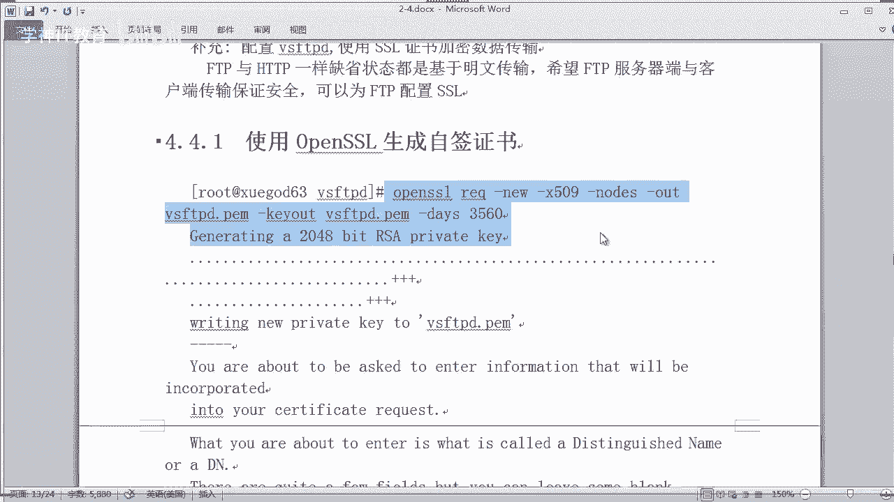

打开啊打开一下啊。来打开我们这个服务端这边啊，那生成一个一个这个证书，我们用的是open。SL啊，你看一下能不能tableable出来。那如果你这个的话嗯。我看一下这个版本是。哎，这个版本是多少来着？

这个版本是1。02。1。0。2K对吧？你们看一下你版本，唉，2017年的版本是吧，是不是有点旧也不算旧了是吧？如果你觉得这个版本旧的话，你可以这样子啊更新一下，对吧？杠Y，然后呢update一下。

这种命令会吧，对吧？open SSL。😊，哎，你可以让他更新一下，他会自动帮你更新。啊。16是吧，在16版，哎，你看现在更新完毕了吧。对不对？更新完毕，我们看一下上面那个本。本。我看不到是吧。

它是什么FTPS对吧？FIPS那么现在版本呢？应该也是一样的嘛。啊，没有看得出来是吧，只是更新了一些什么。更新的一个级别对吧？你看不出来，但实际是有更新的对吧？OK。😊，好，那其实你不更新也可以。

本身它就已经默认安装好了，对吧？啊，好，那么现在的话我们使用这个open SL来生成一个什么呀，生成一个证书啊来。怎么样去生成一个整书呢？那么open SL的这个用法可以有很多是吧？啊。

我们这里啊就不详细的讲它了，我们直接来生成啊，主要讲一些常务的一些就可以了。比如我们使用这个IEQ啊，REQ又表示什么东西，对吧？REQ呢它是一种什么呀证书签名请求的一个命令，对吧？你用这个的话可以啊。

就是生成一个什么呀，准备要生成证书是吧？然后呢呃杠。比如杠6-6表示要什么？我要新建证书，对吧？6就新建一个证书啊，然后使用。一些啊。一些什么东西呢？使用一些证书管理，你要使用哪一种呃，这种数字证书。

比如我们使用数据管理的证书啊，比如。X对吧，用X509啊，对吧？O。509啊，然后指定这个什么呀？Noodles。Noです。指定这个no又是个嘛意思呢？表示你这个C呢不加密是吧？如果你不指定这个的话。

等一下你要输入什么密码等等是吧？我们不要搞那么复杂，对吧？我们不需要一个一个输入C的那那种那种那种方式就可以了，对吧？啊，OK那然后话我们再往下去呃输入，比如。港 out。

out的表示从字义来解释的out的就是输出，对吧？就比如我们要输出一个这个证书，你要输出到哪里？对不对？输出哪里啊，我就输出当前路径就行了啊。你看我当前路径是在这个VSFTP的这个这个目录下面，对吧？

要输出我要起个名字给他叫VS。FTPD点啊，这个后缀的话，我们就用这个吧。PEM对吧？给我们生成一个一个一个这样的一个证书文件。ok。啊，还有那还有什么东西啊？😡，这个呢还有一个是嗯。干T。奥。啊。

这个杠K2是什么意思？同学们。😡，是吧跟前面这个奥有什么区别呢？T二呢是设置这个密钥的存储文件，注意密钥存储文件和你的这个什么呀，你的这个呃证书文件。那么证书文件呢和密钥存储文件我们可以放到一起。啊。

可以放到一起。如果放到一起的话，那就同一个文件喽，对不对？是可以的啊。那么这样话我们可以写同样的名称VSFTPD点PM啊，这样它会写到一起啊，OK要杠。对戴啊，这里就是这个很难理解是吧。

指定他这个进证书的有效期天数3560天，3560天，对吧？够长了没有啊，是不是OK？好，然后的话准备生成来，我们按一下回车。诶。😊，哦，我我打扫了这个SSL，你看没有？它就没有。

你看这少了命令SSL对吧？你你敲少了的话，它会输出哎，你这个什么呀这个参数不对，它会输出来。有没有看得懂，对吧？哎。你看好嘞，那么这个时候呢他要你一般我们生成住书啊。

像你们以前在windows有应该有做过是吧？比如说输入什么东西啊，他说你要输入国家名称是吧？他不是一级一级往下去吗？比如国家我随便输的是吧，比如中国对吧？GH啊，然后又是什么省是吧，什么省什么市。

对吧啊，等等等等这些东西啊，我们就随便写吧。😊，这个东西是吧，随便写啊。然后呢，还有本地。本地的一个名称，对吧啊。随便。啊，还有什么呀？组织名称对吧？哎呀，组织名称要写什么呀？随便啊。

这个就都可以自定义的嘛，对吧？然后这个还有组织机构什么名称，对吧？啊，一样算了。呃，接的是什么呢？这个又是你的一个。什么呀？这个是普通名称，对吧？应该叫一个域名是吧？

你看several house name，他就说一般使用你的several host name就行了。你看他有个建议是吧，我们随随便填一个吧。OK然后一mail地址啊，我们也是随便填一个。

随便填一个啊啊163点com嘛，对吧？好，这样的话就输务完成了，对吧？完成了之后，同学们，你看一下当前是不是生成了一个文件，注意这个。看到没有？看到这个文件吗？有这个VSFTP点PM对吧？

那这个文件你可以查看吗？VSFTP点PEM唉，你看没有？这里面的话你会看到有两个东西是吧？啊，一个呢是一个证书的一个文件，一个是什么呀，一个是私用的对吧？一个是私用的，看到没有？

我们都写到同一个文件里面去是吧这样就方便啊，对吧？O当然你可以生成分开不同的文件也是可以的，对吧？好，那这样的话就已经生成了一个证书了。然后我们嗯来。这个证书呢，我们把它放到一个特特定的目录去啊。

这样会方便后期你们进行一个维护和管理是吧？所以我们在当前目录上啊，你看我当前目录是在哪里。然后在这里呢创建一个目录啊。叫点SH哦，不是点SSLK啊，创业这个M目录。这个是隐藏的目录，你有S杠A。

你才能看得到，对吧？才能看到。OK好，然后我们把这个这个什么呀，这个证书啊，对吧？把它移过去VSVSFTB点PAEM对吧？移到哪里SLK下面去。移到这里面去啊OK你看移进去了吧。

这个目录是隐藏的啊OK要我们给他一个前限。400前线就可以了是吧？点SSIL下面的VS。啊啊，培养这个是吧。给他1个400权限。ok。好了，证书我们有了，现在我们就要修改我们的主配置文件。

让它实现支持SSL加密访问。对不对？来打开你的这个什么呀？VSFTP点com文件。打开它啊，那在这里的话我们应该怎么样去设置呢？啊，我们应该怎么设置呢？啊，你看一下，我们随便找一个地方啊，就在这里是吧？

在第117行这里啊，我们设置一些东西上去啊。嗯。来，我拷一些东西过来。支持这个什么。啊，这里先写一下啊。说明一下啊，我接下面的话要配置什么呢？要confi对吧？SSL啊，说明我要做这个工作，对吧？啊。

随便啊，你有这个东西说明我下面的配置是做什么SSL配置的对吧？就这样的意思啊。嗯，O。那这里的话啊好，我拷过来也要给你们讲解一下啊，你看就有这么多东西是吧？你看啊SSLE是吧。

等于yes就说启用SIL支持。看到没有？然后啊你这个每一项表示什么意思？你看启用呃这个什么呀？使用匿名SSLno啊，不允许对吧？不允许OK这里有force什么lock data。

force lock datains啊，d等等啊，这四项表示什么意思呢？这有说明是吧？上面四行这个force表示强制匿名用户使用什么呀？加密登录和数据传输，看到没有？必须是啊加密登录，并且是什么呀？

通过SA的方式进行传输是吧？然后下面就是指定你要支持哪种类型的这个加密传输，对吧？这有很多个版本，然V1V2V3，对吧？你都可以开启，比如我们只开启V1，你可以将它设成yes啊，其他你可以设置noO。

后面的是不重用SL绘画安全配置啊。还有S1这个什么HIGH允许用于加密S1连接的S1算法啊，这个是指定他的算法一个级别是吧？有这个大大提高什么安全性的一个参数啊，OK。后面就是指定什么。

指定你刚才那个证书文件和什么私幼的一个文件。因为我们这个证书文件和私有文件是同一个文件，所以我们这里看到这个目录是一致的。明白没有？定义SL证书和密钥文件的位置啊OK那我这里的话是什么呀？

我这里的话是呃那个。啊，我这里的话是注释掉了，我要怎么办？我这样子啊，因为这里的话对这个中文有时候知识不算很友好哈，所以的话我直接把这个中文注释的话给删掉啊，我干脆重新退出，重新再编辑是吧？OK然后。

嗯，我在中心重新啊，我在重庆这里的话，在。再来啊写上去，对吧？O。那我这里重新再写一份啊。那。我重新再写一份是没有带这个注中文注释的啊。有时候中文注释呢并不太友好，所以的话我把它删掉啊。

以防他有一些报错。OK是吧？刚才我为了让你们解释方便是吧？所以特意带上注释跟你们讲啊。好，那这个的话我这边就已经配好了，同学们OK这样就已经配好了啊，指定你的这个相关的一个密钥文件，对吧？在这里嗯OK。

😊，注意的是你这个配置呢不能放到什么呀？不能放到这个这这个配置的最后面啊，不能放到最后面啊，放到最后面呢，他也会报错啊，要注意。啊，你要放在稍微靠中间，靠后一点的就可以了，反正不要放在最后面啊。

然后保存并退出啊，保存并退出。好了，那你配置完成之后了啊，那么我们来重启一下，看他会不会报错。是不是？啊，restar一下你的什么呀VSFTPD。OK如果没有报错，那恭喜你说明你的配置是成功了。

没有问题。如果有报错呢，那你就要排错，看一下是什么报错，报错原因是吧？然后一步步去排错它OK。因为有时候啊如果你装了这个什么FTB版本呢，它可能是不支持这个证书的，就是不支持open SL的话。

那他也会报错。那你就要升级一下是吧？把这个FTP升级一下，还有把这个open SL也升级一下，到最新的版本，让它能够兼容啊，这个问题也提一下啊。好嘞，那么这个时候呢，你通过证书的方式的话。

你肯定通过这个客户端是没办法连接的。能连接吗？现在这个是连接上了，对吧？那我们找一个。重新连接的看一下行不行，你看严重错误。对吧严重错误，因为什么你没有证书，看到没有？

你不是通过证书连接的那肯定就不行了，对吧？不可以。

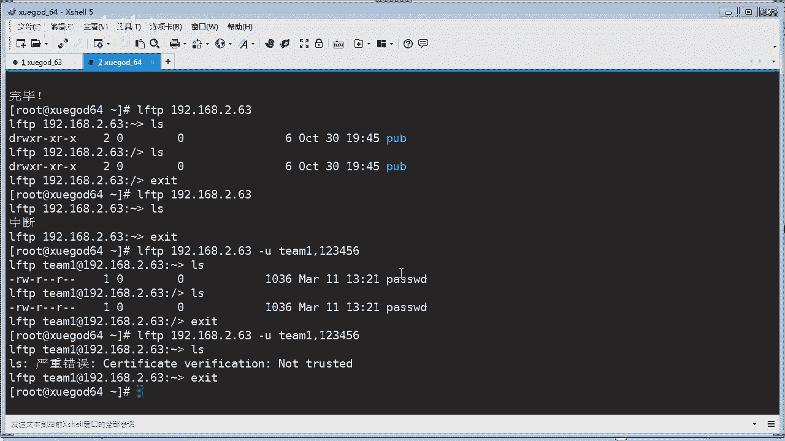

对不对？那肯定要通过证书的方式来连接。那老师提供了一个客户端给你们啊啊，你们打开一下，我看一下在哪里。

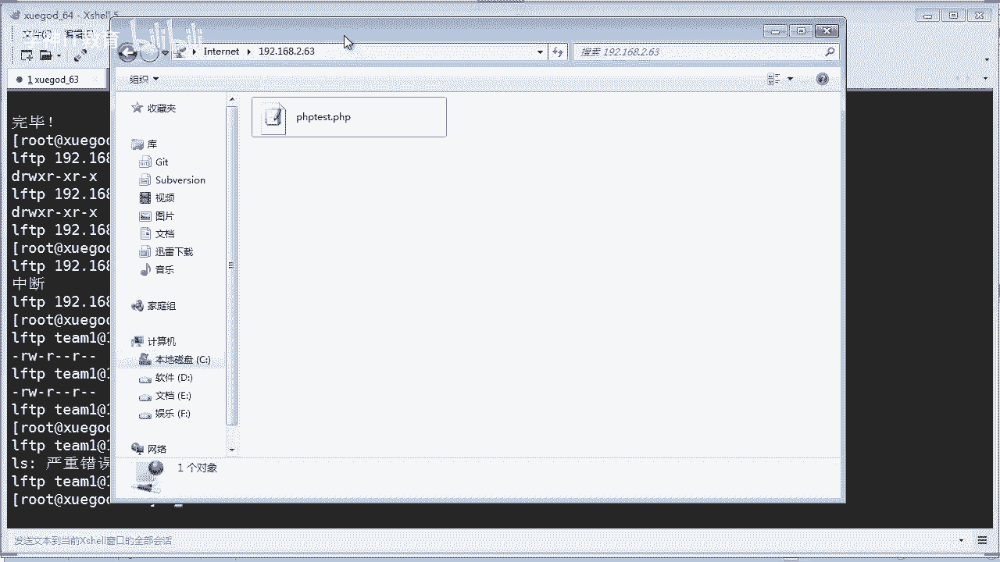

诶。我的。😔。

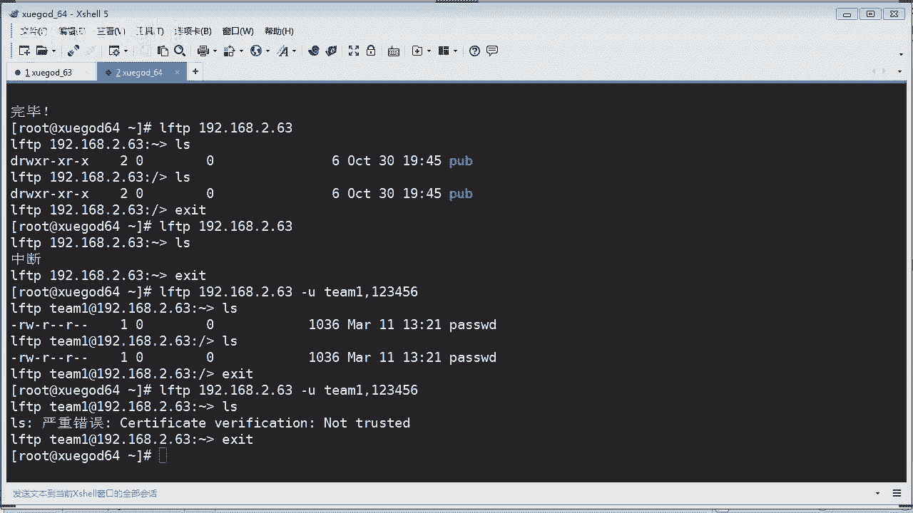

哪里去了？哦，在这个。啊，这里面啊有一个客户端。你看啊这个呢我们之前在上课的时候不是讲过嘛，是吧？有什么像同学说的这个什么fresh XP是吧？

这种客户端或者是其他的这也是啊是在windows下的呃FTP客户端啊，这个文件呢就我已经打包上传到群共享啊，你们可以去下载啊。来我打开一下。这些配置上在USSFTV帮助文件有吗？帮助文件一般有。

如果没有的话，我们可以找他的慢手册，明白没有？慢手册里面啊，慢手册其实也是帮助文件啊，对吧？OK你看没有？这个的话是一个windows下的FTP客户端，对吧？我把它缩小一点啊。看得到吗？看到啊。好。

那看得到我们来把这个移上去一点啊，这个的话移上来一点啊，移下来一点啊，这样看会清楚一点，对吧？那这个时候呢，如果我们要连接我们的这个linux下的这个FT服务器。因为它现在已经实现了SSL加密嘛。

你必须使用SI加密，对吧？如果你不使用SI加密的话，我不给你连接，对吧？OK然后我们新建一个站点对吧？新建站点啊，比如我们输入192。168点。2。63。对吧你看这里协议是吧，是什么协议呢？

FTP协议就可以了。加密，你看这里就有了是吧？我们要求这个显示的FTPTL对吧？你要选这个是不是？😊，然后呢，登录的话，你用正常类型就可以了，对吧？你不能匿名登录啊是吧？你要用用户名，用户名呢。

我们使用tM一密码的话是123456，对吧？那么这样的话我们来才能够连接啊，来，我们测试一下，看能不能正常啊。嘿，你看到没有？他会弹出这个东西说未知的证书对吧？有效期啊，我们刚才说的是多少。

好像是10年左右是吧？到2028年，你看没有？是吧？然后这个公钥的算法啊，还有签名什么什么的啊，一大堆，这是刚才我们写的东西是吧，随便填的啊，然后这个主机的IP啊端口啊，你看他协议TLS1。2版本对吧？

说明成功啊，对吧？然后我们这样子啊，为了每次连接的不要再提示，我们再可以在以后的绘画中始终信任该证书，对吧？这样的话，他下次那他就会自动信任这个证书了，就不是什么未知的对吧？好。

我们点一下确定哎O他说检查更新哎，这个不要更新了啊，版本更新不用管它啊，这是客户端对吧？你看没有？已登录啊，TLF建立成功，对吧？说明他没有问题啊，是吧？然后他列出了你这个你这个。服务器上有这个文件。

你看到没有？这个就是你看到的文服务器上的文件。是不是？没问题吧啊。那我们这里的话，我们可以呃，你可以搞一些东西上去啊，比如那个什么。对吧我们拉过来，我们看一下能不能上传，对吧？😊，来，我搞一个文件。

比如一些赛考文件啊，对吧？诶。😊，那可以吧，我随便拉一个过来，或者你也可以在这里操作啊。比如这个admin下面啊，你找一个什么文件，对吧？lockck下面啊，找一个什么文件啊，拉过来就可以了。

是不是很方便，对吧？O。啊，直接在这里往往往往这往这边拉就行了。你看比如我把这个文件啊拉过来，这边那它就已经上传成功了，上传了服页啊，这里有会有状态是吧？比如开始上传怎么这样传输成功啊，你看。😊，O了。

有没有问题？没问题啊。是不是能删除吗？你看我可以删除啊，呃点一下删除。对吧删除你看马上就删除完成了，对吧？还要把这个删除。嗯，OK非常方便啊，用客户端来操作我们的这个FTP啊方便多了是吧？可视化操作啊。

即点即所得啊，非常的方便啊OK。😊，好，那没有问题啊，同学们，你们做成功了吗？好。这样使用这个加密进行传输，我们也已经实现了，对吧？我们也已经实现了。

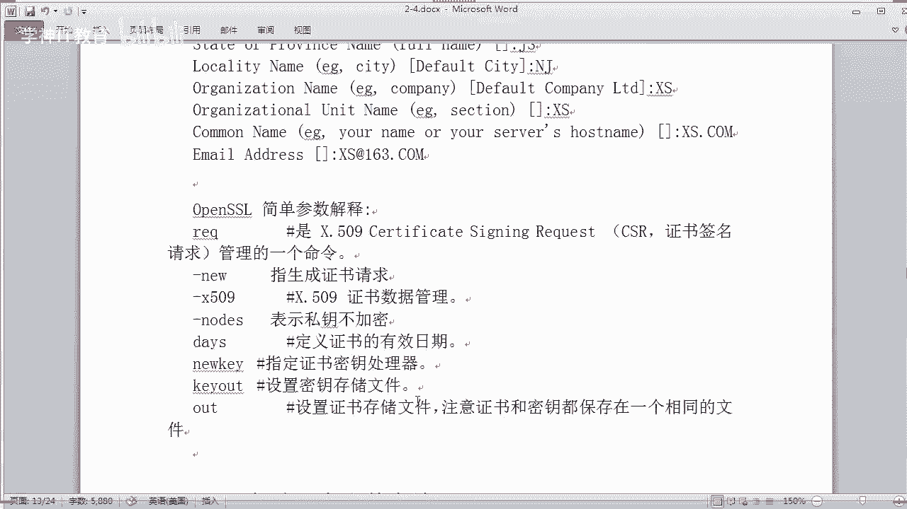

OK那接着我们往下去讲啊呃看一下啊。😊。

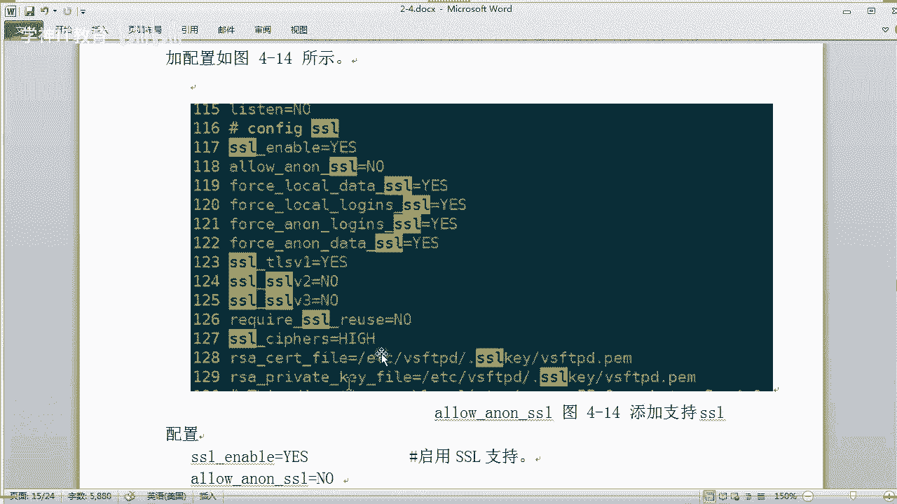

呃，这里有提到啊，注意啊，在工作当中的话，如果你是FTP建立在内网情况下的话，那你可以不用证书，对吧？咱们内网肯定安全了，对吧？如果FTP呢跑在公网啊，就是在外网，为了数据的安全，我们可以是吧？

配置一个证书加密传输，对不对？O。😊，好，那往下去讲一下啊，这个NFS啊，对吧？这是第2块的内容。NFS又是什么东西来看看啊NF啊它是什么？你看没有 system是吧简写就是网络文件系统对吧？

网络文件系统呢它是D支持的文件系统一种啊，它被称为NFNF呢允许一个系统在网络上以他人共享目录和文件通过NF呢我们的这个用户和程序啊，可以像访问本地文件一样访问远端的系统上文件。

其实在我们这个应用上也是非常常用的NF啊，你看你像这两台是吧？你看两个客户端你都可以连接上到这个访问这什么访问这个共享的目录。那么这样只也就是说相同的文件我们可以通过共享目录来实现。对不对？

比如一个我建立两个web站点，两个web站点内容都一样，我是不是要在两个站点都上传这个网站代码，其实有必要吗？我们可以通过共享目录来实现。也就说我们只要更新这个共享目录就可以了，对不对？

OK那el鉴定端口的话是2049啊，2049啊，它使用的是TCP的协议啊。你可以看一下啊，在service可以查到它的一个啊占用端口是2049啊。好，那首先我们先安装一下，对吧？安装一下这个NFS。呃。

这个RPCBIND这个啥意思呢？这个其实是它的一个依赖，因为它依赖这个东西啊，你你如果你不装这个，你直接装这个呢，它也会自动帮你把这个依赖解决安装上去的啊。有没有？好，你可以一遍把它装。

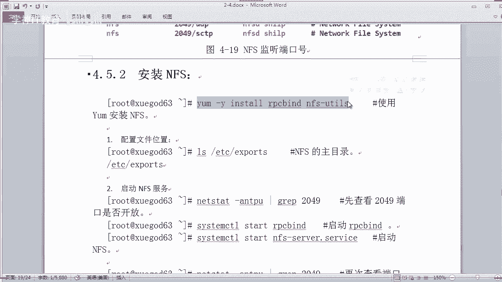

来，我们还是把这个学杠63啊，对吧？当做服务端啊来安装一个。NFS。那么其实客户端呢，我们也应该安装一下，因为它服务端和客户端呢都是一样的，都是都是使用同样的命令啊，我们直接把它安装一下。哦。

好多的包是吧，有32个这个相关的一些依赖。好，我们两边同时在装啊。好那，安装完成啊，我们把学改63做服务端啊，在这边的话你先看一下啊，我们怎样去配上配置一个共享的目录。其实它有一个配置文件啊。

非常简单的一个配置文件。这里的话。你看一下有1个EXpo这个文件，这个文件里面呢是。没有东西的，你看。空的是吧，啥都没用啊，你在这里配也是很简单的啊。NF啊啊，你启我们装完之后呢，应该启动一下它，对吧？

system CTTL啊，star一下这个什么呢？啊，您可以把这个依赖先启动一下。其实你不启动依赖，它也会自动帮你来启动的啊。OK然后再启动一下这个什么呀。啊，NFS大概你可以写NF这样。啊。

这种方式来启动也行，或者我直接不要杠7一样可以启动啊，都可以。嗯，第一次启动啊，稍等一会。好，启动完成，我们看一下它端口是不是已经啊已经在监听状态了啊。来过滤一下啊，2049对吧？嗯，没错。

20049啊已经在监听状态。OK说明服务已经启动，对吧？那这个时候呢我们添加一下到随机启动。对吧。随机系动。啊，这种方式就可以添加随机启动了，对吧？

或者你使用以前那种方式叫CH confi的方式来添加到随机启动也是可以的啊，它也是通用啊也可以用啊。好，那然后我们就可以看一下啊。那当前的话我们还没有共享，对吧？你们怎么样去查看它共享的一个目录呢？

你可以通过show mode是吧，show mode1杠1啊，比如当前目录当前的1个IP地址，本地。2。63看看有没有没有是吧，清单，这里的话暂时还没有共享目录。那么这个时候呢。

我们就应该先配置一个是吧？比如哎我看一下啊，我把哪个目录配置出出去好呢，共享出去呢，我把这个OPT吧，好不好？OPT下面是没有东西的，看到没有？同学们没有任何东西啊，那现在我要共享OPT这个目录出去。

啊，编辑一下这个文件，你在这里写怎么写呢？你直接。呃，编辑OPT。对吧然后写上什么呀，写上相关的权限呐啊读写权限等等啊，包括你可以限制网段啊，这些都可以啊。那我这里呢就比如。所有网段我用信号表示。啊。

那么他登录之后呢，都有读权限，也有写权限，就是RW。看懂吗？对吧就这样就可以了。要保存并退出。然我们再来收一下啊。哎，你发现没有？并没有查看到他共享清单怎么办？因为你没有重启。对吧你没有重启啊。

对吧咱们来重启一下，你看一下。那除了重启呢，我们还有另外一种方式啊，可以就是重载啊，这种重启也可以。还有一种另一种方式呢叫exexport。啊，然后是TFS。啊，然后杠RV这种方式那。也可以看到没有？

我们再来搜一下。这个时候呢我们就看到哎你已经进行了一个共享的一个目录OPT看到没有？OPT啊，看到了吧？啊。OK然后呢，我们。怎么样？怎么样去，比如你的客户端怎么样去把它挂载是吧？你共享出去了。

我总得要访问的是吧？在林0时上呢，一般我们把它挂载到本地来使用。那现在的话，这个OPT是没有任何东西的。没有任何东西。对不对？我我我我我我创建一个文件吧。好吧好。这个OPT下面的。嗯。A点TST好不。

随便写一些东西上去啊，对吧？嗯，我只是用来测试。哎，你看有文件了啊，好了，已经共享了，对吧？那这个时候呢我们要去客户端这边来挂载。先看一下啊，这边暂时的挂载是没有挂载上去的，对吧？那这边的话。

这边的OPT是没有东西的是吧，看清楚啊。然后我们怎么挂载，你很简单，其实用你们第一阶段写的知识就可以解决是吧？moote1杠T就指定挂载类型，比如NF是吧？我们这个文件系统是NF的文件系统。

要输入对方的IP。对不对？然后它共享的目录是OPT，然后呢，挂载的本机也是OPT啊，你这里的啊你想挂载到哪里也行啊，你可以挂载到MNT。或者是其他你自建的目录都可以是吧？我这里呢我就也挂了OPT吧。

好不好啊？😡，OPD啊来。你看成功了吧？来，我们再看一下这个挂载的情况，你会看到哎。对不对？有没有发现有1个2。63的这个服务端OPT已经挂载到当前的OPT。然后我们再查看一下OPT是不是有东西呢。

肯定有1个A点TC文档，对吧？它就会读取了你服务端的这个文件过来。对不对？成功了吧，同学们。NF的话其实很简单，对吧？OK那么当然了，这样子的话，如果我在这里呃建一个网站是吧？

建一个帕奇或者的一个web服务器，我是不是把它我可以我可以挂载到我的什么呀，挂载到我的这个网站该目录去，这样不就行了吗？那也就是说以后我更新代码，我只要在学63里面更新代码就可以了。他这个64的话。

读取的就是63的共享。那么它文件肯定一致的。你说对吗？是吧。O。那你有多个客户端挂进来的话，其实他读取都是一样的。OK当然如我们怎样配置它开机自动挂载这个NF的这个共享设备呢，对吧？这是你要关心的问题。

对不对？我们可以把它写到什么呀？把它写到ETC这个faest table，还记得吗？这个是什么呀？这个是在启动加载的一些设备信息的文件，对吧？就好像我们要启动加载一个这个光盘一样，还记得吗？

那如果我现在要加载这个NF4的一个设备，我应该怎么做？好，一样的道理是吧？我们可以把它写到上去啊，192。168。2。63对吧？写上去就行了。比如OPT对吧？然后呢嗯你要挂载到本机目录哪个目录。

我也挂到本机目录的OPT可以吗？没问题。文件系统是什么？IFS。嗯，后面的话就跟着写就行了，是吧，比如是什么the four。对吧造写。对吧0。0。就可以了。对不对？那这样的话它就会开机启动之后。

自动帮我们挂载这个什么NF的设备是吧？衍成了一个共享。好，保存并退出。就搞定了。是不是？好嘞，那我们现在进到这个OPT看一下啊。现在是挂载的啊，那我在这里能够创建文件吗？同学们。我现在是在客户端。

我挂载之后，我能够创建文件吗？我创建个B点TST文档，你发现无法创建B点TST权限不够。怎么办？😡，是吧。怎么办？有办法吗？有啊，这个是呢你要设置权限啊，要包括两部分，一个是服务本身的权限。

一个是目录访问的权限。你要知道我们返回一下服务端这边啊，你看一下这个。在这个我们安装完了，安装完这个NFS之后啊。他有生成一个用户。你看一下啊，有一个叫NS nobody看到没有？

NFS nobody的这个账号。其实这个账号呢它就是用来运行什么呀？你看。运行你的NFS的对吧？所以呢我们可以修改权限啊，当然你可以修改成777前线的话，也可以或者呢直接修改为NF nobody的权限。

对吧？你可以2选一啊。当然用使用这种方式的话，会安全一点啊。NF nobody点NFS nobody对吧？啊用个递归的方式啊，改一下改一下什么时象，改一下你共享的这个这个目录，对吧？OPT。好。

你看一下你的这个。修改成功了没有啊？OPD。该上功了是吧？😊，属主和。嗯，这个主别的都改了啊。然后呢，我们再来客户端啊，返回64这里，我们再来创建一个叫啊B点TST文档，看能不能创建成功。哎。

发现可以了，看到没有？我再创建一个。C1点的T视哎，也可以了。没问题吧，老铁。吓兄弟。没问题哦。都可以是吧？那你在客户端就可以直接进行读写文件啊，都没有问题啊OK。那讲到这里的话。

那么其实啊这个NF的安装搭建就成功了。下面就是讲一下它的一些呃什么呀参数啊。不过这些参数说虽说我笔记里面写的是常用参数，其实并不太常用啊。

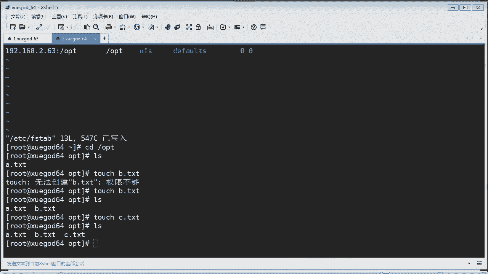

但是你了解一下吧，好不好？嗯，这里有很多的一些参数啊。这里讲到啊参数看到没有好多。嗯，我把他。标一下啊，看没有？IF共享的一些常用参数啊，你看有很多啊。是吧。比如你在共享的时候，你想想RO这个是只读嘛。

对吧？RW就是读写啊SYNC的话是什么呀？资料同步写入到内存和硬盘当中啊，对吧？那某些情况下有可能会用得上啊，不过基本上很少用得到啊，同学们所以说我觉得是不太常用啊。RSYNC啊，资料会先存到内存是吧？

而非直接写入硬盘是吧？如果用这种模式的话啊，OK要注意。我把它放到上面。OK啊，还有其他的，你像这个什么啊这个NF通过1024以下的安全TCB端口发送啊，如果加上这个参数，还有什么N4的什么什么啊。

这个通过以上，其实这些东西不太实用，对吧？是不是？还有这个read这个什么东西？如果多个用户写入NF目录，则归组写入默认啊。那我一个我就不一个个去介绍了，好不好？你们自己看一下。

这无非就是说你在在进行挂载的时候呢，加上一些什么呀，加上一些特殊的参数，实现一些特殊的功能而已。我直接举个例子给你吧，好不，你看一下啊。😡，选项使用方法的一个事例啊，这里举个例子。

比如我有一个这样的一目录啊，然后呢，我要写到这个配置文件里面去啊，注意。这个是我们的这个共享配置文件，对吧？假如这个目录要进行共享，然后呢，我可以这样写这个相关的参数权限，看清楚同学们。星号表示什么呀？

表示你要进行的一个网段，比如所有网段通用都可以访问那种星号。然后里面呢写RW，刚才我不是写过RW吗？RW是读写no这个什么这个什么意思呢？你看看。这里有说明。如果你加了这个参数呢。

表示root用户具有该目录完全管理访问权限。明白有。该目录完全有啊完全管理权限啊，对吧？那又比如。这个第二个例子是吧？比如这个目录呢，我可以这样去配。睁大眼镜看啊，我配成192。1680。024。

你要说明呢只有这个网段的客户机才能够进行访问。如果你的客户机来源IP不是这个网段，不好意思，你访问不了。对吧后面呢接上加上这个RW权限，还有啊SYNCRSYYC刚才讲了是吧，同时写到内存和硬盘是吧？

你可以加上一些参数实现一些特殊的功能，无非就是这个样子，看懂了吗？要懂得举一反三，同学们来，你看下面的话也是要实现一些其他什么功能。你看一下啊，这有很多的权限我就不一一介绍了，好不好？😊。

我知道你们都很聪明。我不一一介绍了啊。啊，这些东西的话其实都差不多，看到没有？就要实现特殊的功能。在里举了很多个例子啊。OK这里讲到啊注意啊，我们在发布共享目录格式当中，除了共享目录是必根的参数之外。

其他参数都是可选的啊。注意就后面这些参数呢都是可选的。对吧。我们不一定要写这么多的东西啊，NF能不能像FTPSSO那样实现加密传输呢？呃，这个就没有什么加密传输啊，这个就没有什么加密传输。

因为这个的话它是直接挂载的啊，直接挂载，把它演程端的话，直接挂到什么呀，挂到你本地人使用了。对吧其实他跟NFTP的话还是有区别的对吧？还是有区别的，把它挂到本地来使用啊。O。嗯，我看看啊，好。

这里还讲一下客户端挂载优化。嗯，哎，其实优化跟上面的这些也是一样的道理。比如我要加一些特殊的参数，也是一种优化，对不对？NF高并发环境下的服务端重要优化参数。你看一下啊，就是说我们在挂载的时候呢。

你应该怎么样加一些参数进行优化。比如我们可以实现异步同步啊，此参数会提高IO性能。是吧但会降低数据安全，除非对性能要求很高，对数据可靠性不要求的长合。一般的生产环境不推荐使用。

因为市场环境它肯定要同步啊，异步的话那它有时间的一个延时，对吧？有延时，那数据也不同步过来的话，会导致一些啊不可全测的问题存在。比如你访问的页面，哎，我怎么上传呢，一直刷不出来，对吧？

还有notote的话，这个有没有讲过，你们在意院这个呢就是取消你访问这个文件的一些什么记录时间。对吧Iud访问时间嘛。就访问时间我不要记录，对吧？这样也可以提升IO性能啊，其实。提升并不大啊啊。

虽然说他这里推荐使用啊，提升并不大。他只说不记录这个文件的访问时间而已，明白没有？OK还有其他比如取消呃更新文件系统的这个什么呀啊，目录的一个安的访问时间，高并发环境推荐显示啊。

提高性能OK还有中断不成功的挂载啊，还有什么读取写入啊，7块大小的设置。等等等等这些啊都可以进行细节的一些优化啊。所里讲一个例子。你看比如我在我的这个sst里面啊，你可以编辑一下这个参数。

这样的话你的内核啊linux内核它会什么读取这个缓存是吧？就会按照你这个这个你你手工编辑的这个内存。当然首先你要确保的是什么呢？你的服务器你肯定要有多余的内存，对吧？如果你内存很小，你把它设置那么大。

那不是扯淡吗？单位是字节。B啊字节啊，所以你要注意啊，同学们。是吧这个东西呢也是根据我们的这个内存来来编辑的是吧？每一个参数这里都写了，你看内核默认的读内存，内核默认的写内存对吧？每一个都有说明啊。

还有最大的一个读缓存啊，然后内核最大的写缓存。对不对？最后的话你把它这个配置成功之后的话，你再让它生效，执行一下这条命令，它就会生效了。就是你上面写这些东西要生效，先执行这个。OK生效完成之后呢。

它就输出嘛，输出这个结果跟你上面配的是一模样。是吧。看懂吗？这个。还要我去配一下吗？那我看一下啊。

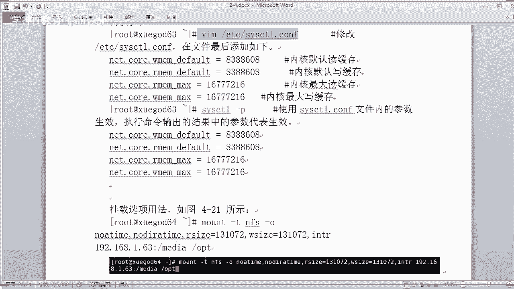

我这个内存应该很小。我的512内存对吧？512呀。你打开看一下啊，那么这里面呢，这些参数都完全是要你自己写的。同学们，你看我这里是没有包含这些参数的，是吧，你完全是要手工去写进来。比如我写到下面啊。

对吧。这样写进来，对不对？当然了，我这里可能是没有那么多的内存，对吧？你可以去嗯。按照实际生产环境的话，你内存肯定是比较大的啊。我这个实验机的话就比较小。对吧。我就告诉你们这样配嘛，对吧？要保存退出啊。

14S点CTL杠P。嗯，看到没有？他去读取你里面的参数，这样呢它就会生效啊。明白有。好，那么刚才讲了，你在挂载的时候呢，可以加一下优化的参数，对吧？比如啊来你看我写一个啊，挂载的时候，我现在已经挂载了。

对不对？是啊，已经挂的，我要先卸载它OPD。嗯，NFS4。系い。我不能卸载吗？you，然后哦他说设备繁忙是什么意思？就那你肯定是在使用当中了，对不对？使用当中。对吧所以呢对我们要退出这个目录。哎。

我干嘛退出。哦，太坑爹了是吧？来，我们再来执行一下啊。😊，OK好，我们已经啊退出了。然后我们再看一下挂载情况啊，我已经取消了这个。是吧已经卸载成功。然后我们比如我们加参数优化的情况下进行加载。

我们应该怎么样？比如杠T啊指定你的文件系统IF1杠OO的话里面就可以写很多参数了。比如说呃什么no呀n啊呃at啊等等啊。比如指定它上传下载的一些呃字结数啊等等等等等等。你看。我可以写很多的一些优化参数。

那么带了这些参数之后呢，他会按照你的意思去执行啊。这参数表示什么意思呢？其实我上面这里都有。

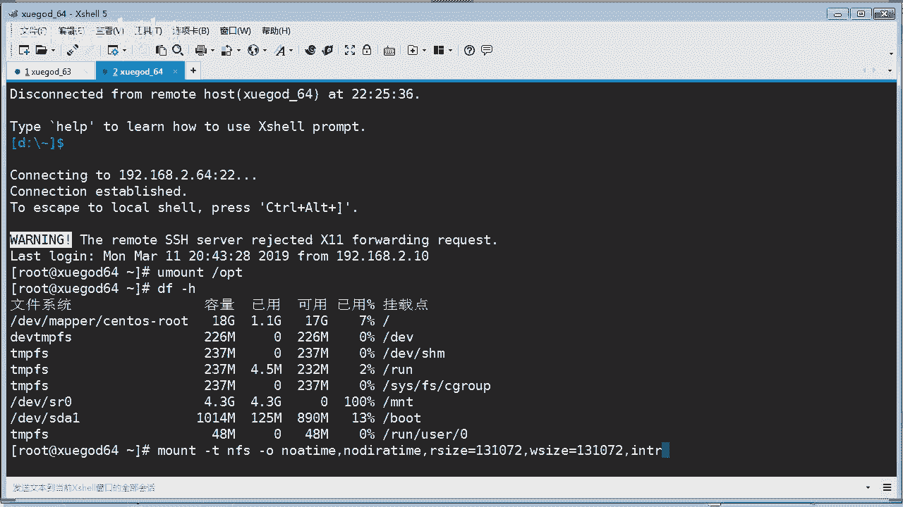

是吧比如这个可以中断不成功的挂材，可以，这个是读取血入的7块大小。你看。都可以指定是吧，读取区块大小。😡，啊，这个。你可以指定。然后最后面的话，你再写上你的实际的这个路径，对吧？

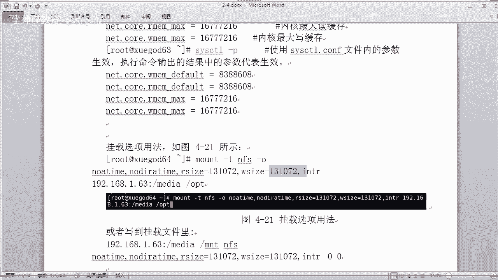

那这样去挂载的话，就按照你你定义好的一些参数来挂载。啊，无非就是这个样子啊。OPT是吧，要挂到当前的1个OPD。看到没有？那。我们再看一下。也是成功啊，没有问题啊，我们看一下OPD啊。

这个文件还是在这里，只是加了一些特殊参数，实现一个优化的挂载而已。OK当然这个东西你也可以写到哪里去，也可以写到你的这个faest table什么东西啊，这个ETC下面的。

开机啊开机挂载这个文件也可以写到里面去哦。是吧。怎么写？一样的，你写后面呃就可以了哎。啊，ETC下面的faest table，你看啊，这个是简单的挂载嘛。你如果要加参数的挂载，你直接干什么。

你直接写到啊，写上去啊，什么什么什么啊什么什么写到那个挂载文件就可以了。啊，NFS然后后面加上。应该写到这里。这里。怎么写啊，我把刚才那一段拷过来算了啊，懒得。这个是吧。好。我写要这里。系い。对吧。

这样的话，他就按照我们意思去挂在了。对吧。好，还有个零是吧。那。他就按照我们定好这些参数啊进行一个过载啊，无非就是这样子啊，没有什么嗯什么嗯nott是吧，什么什么的。NOATDIME对吧？

然后还有NODIRAATIME啊，对吧？看到没有？ok。好，就就这么多啊。就这样子啊ok。就可以了。有什么意义啊？嗯，你没看吗？就是做一些优化啊，比如你要实现一些这样的功能，对吧？

比如你不要记录它的一个时间啊，对吧？这里不是讲过吗，对吧？还有你要指定它读取和写入的7块大小啊是吧？来设置。因为这个的话影响客户端以服务端的传输缓冲这个量是吧？我们可以定义它的一个传输存输量。

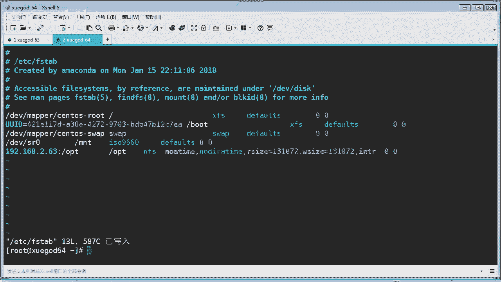

是吧。嗯。O。就告诉你有这么回事，其实呢真正生产环境用的比较少啊OK。好，那么来总结一下，今天我们讲了一个是VSFTP是吧，什么是lin下的这个FT服务器怎么样安装和配置，对吧？

啊我们实在使用匿名访问这个FTP还做了呃加密访问FTP是吧？我们还实现了什么呀？实现了这个SSO加密传输访问对吧？访问这个FTP最后还讲了FF这个NFF的一个文件共享服务器。

怎么样实现啊还有实现开机挂载啊，还加了一些它的一些优化参数啊，虽然说可能没有太大的一些作用，但是你知道这回事啊，OK那么今天的话我们主要讲了这些内容啊，O那么今天内容就全部讲完了，同学们。OK可以下课。

是吧。

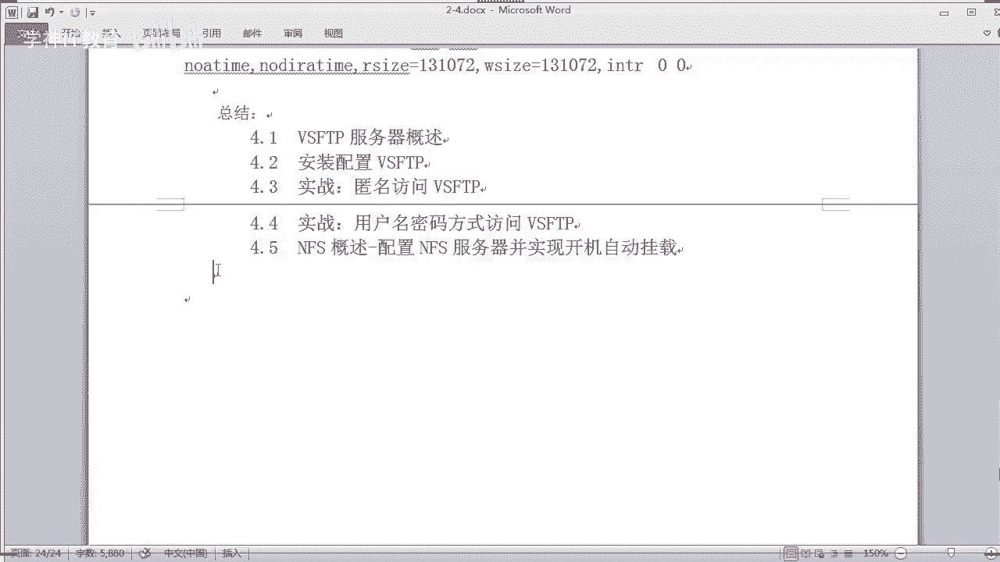