# Linux／Linux运维／RHCE／红帽认证／云计算／Linux资料／Linux教程--Mysql介绍和搭建LAMP环境01 - P1：Mysql介绍和搭建LAMP环境01 - 学神科技 - BV1TK4y1x7FB

对，有同学说是讲mycycl。那么今天其实的话是讲一下呃，用亚母的方式来搭建这个什么呀LAMP的一个环境啊，那么其中也涉及到这个mycycl啊OK。今天要跟着做实验吗？

当然你跟着上老师的节奏是最好不过的啊，最好不过的那如果你跟不上的话，那你就认真听啊。那么课后之后呢，你就做一下实验，好不好？声音比K老师的小是吧？嗯，应该不会呀啊，我把它声音已经调到最大最大了啊。

今天下午做过了是吧？好，来开始啊。那么今天我们会讲到什么东西呢啊？讲这个mycycl的一个概念的啊，然后还有这个mycycl服务器的安装，还有配置。

然后我们来实战怎么样去安装mycycl数据库并去除安全隐患，还有搭建这个LMP的环境啊，还有搭建一个个人网站这个Ucent啊，还有实战一下使用这个什么Ds攻击是吧？

刚才有同学说哎老师你是不是要代机带领我们攻击电商网站，不是啊，所以给你们讲一下，这里有一个攻击，其实它也是做一个什么测试，因为你对你的自己的网站进行一个ds攻击，也是对于你的网站做测试，对吧？

OK这我们不能做违法的事情啊O。好。首先讲讲啊，那么其实明天才是真正的是讲mycycl的东西啊。今天的话先认识一下来。mycyclcle是吧，其实你们都听过，那么咱们班的话也有很多的这个什么呀。

已经工作的这个学员，还有一些老学员是吧？mycyclco不用说，肯定都听过了，mycyclcle是什么？就是数据库是吧？那么你们听过很多啊，像oracle啊是吧？s啊DB two啊，对不对？等等啊。

这种数据库。所以我们今天先来学习一下这个mycycle，什么是mycycle？mycyclcle是一个关系型的数据库管理系统啊。刚才我讲了这么多，其实都是关系型的数据库。那你你给我讲讲哪一种数据库呢？

它不是关系型的，能不能说出一种。嗯。给我打出来。有没有同学知道？Excel read， O。good啊，no cycle啊。对对对，不错嘛，是吧？那么有经验同学大家就知道啊，哪些不是关系型的对吧？😡。

ok。那么mycyclco是由瑞典这个mycoAB公司开发的，目前的话它属于奥口公司，对吧？因为奥口公司已经把mysco收购了，是不是啊？mycyclco是最流行的关系型数据库管理系统，为什么最流行？

因为它开源免费啊，是吧？所以很多的公司都在使用这个mycycl啊。在这个weable应用方面，meq是最好的啊。RDBMS呢就是什么？关系型数据库管理系统的一个统称啊。

OK以人要问你什么是RDBMS你要知道啊，关系型数据库管理系统，就是RDBMS啊。OK是一种关系型的数据库管理系统啊，关系型数据库管理系统呢，是将数据保存在不同的表中是吧？

而不是将所有的数据呢都放在一个大仓库内啊，这样就增加了这个什么呢？增加了这个速度并提高了灵活性啊，因为它是什么啊分表分字段呢进行一个存储。mycyclcle所使用的这个scle语言呢。

是用以访问数据库最常用的标准化语言。注意啊，关键词这里有。什么叫标准化语言是吧？也就是你学会了一种scle语言。其实你去到其他的数据库的话，它大部分是通用的啊，同学们。知道没有啊。

mycyclcle软件采用双授权政策啊和双授权其实很好理解啊，一个就是哎说白了就是收费和免费吧是吧？它分为社区版和商业版啊。由于其体制小速度快啊，总体拥有成本低啊，尤其是开放源码这一特点啊。

一般中小型的网站啊的开发都选择mycyclq作为网站数据库啊，由于其社区版的性能卓越啊，搭配PHP和阿帕奇可组成良好的开发环境啊，双授权政策是吧？我们会看到这个是社区版是吧？什么啊，这个社区版本啊。

简称C版，还有一个是企业版本就是收费的了啊。嗯，讲到这种社区版免费版啊，你知道我们中国之前有提出一个计划叫TIOE计划，有听过吗？7L计划呃，什么是LOE是吧？IBMEMC是吧？

那么这三大这个什么这种IT巨条的公司，其实你们都听过是吧？7LE那么7LE的话，你肯定是要用其他数据库来代替。那么就是一个非常好的。但是现在my也是被已经收购了是吧？

所以呢它就会衍生有什么啊的话也是属于什么这个my的一个分支啊。EMC是做存储是吧？比较有名的IBM其实做存储也是非常有名啊。OK。😊，那这里讲到啊，如果一家公司的这个源代码都已经免费公开了是吧？

那么公司还能怎么样去生存，它靠什么这赚钱呢？是吧？你看麦cycl狗靠什么赚钱？你来看看它是怎么赚钱是吧，开源免费东西怎么赚钱。其实你们现在用的这个系统是不是红帽的系统，OS就是红帽的是吧？

红帽的社区版系统呢就是的一个系统啊，是吧？它是完全免费的，但同时呢也是不受任何保护的是吧？你自己玩，你懂技术你怎么玩都行，反正我不支持你是吧？反正我是不提供技术支持，而红帽的盈利部分呢。

在它的这个企业级软件啊，比如红帽的企业级软件像这个红帽系统对吧？简称为IHEL是吧？你看最近咱们不是有一个H1的一个班级嘛，是吧？你可以去考一个这样IHC的证是吧？那这个它也是收益。

这个呢也是作为它的一部分收入是吧？而且收入的话也是不低啊，你去考一个证多少钱。对不对？同学们。啊。ok。那么。这个由鸿茂的工程师从成千上万的应用中啊测试和筛选出来最稳定的一个精品是吧？

商业的东西的话肯定是比较。比较做的比较好，因为他提供收费嘛，收费的支持是吧？有偿支持啊。H1药的话，虽然是从理论上理论上它也是免费的，但是实际上呢你是无法免费得到了。因为。H1的这个销售模式呢是订阅啊。

就如同我们订阅报纸一样。如果你订阅报纸，那么你的报纸相当是免费送给你了，是吧？你订了一年，如果订阅年你不想再看那个报纸了，报纸箱啊可以不拆除啊，不拆除，但是不会再有新报纸。对不对？啊。

但是没有提供任何的一个支持啊。H1其实也是一样啊，对不对？你付一年的钱就会得到一年的这个技术支持，对不对？补丁啊和更新啊，系统更新啊，漏洞啊，它都会给你去啊提供啊，但是如果你不再交钱的话。

那就不能提供更新了是吧？但是它不会啊不会卸载卸载你的这个系统啊。Okay。不是说依靠买软件啊，才能挣钱是吧，而是通过为其开放源代码软件提供销售资源是吧？托管咨询等等。比如像这种考证啊，认证啊。

这种技术支持啊，这种来进行啊赚钱。很多同学说哎，一家公司开源免费的，他怎么赚钱是吧？你看现在很多这个在开元社区啊是吧？中国也有很多开元的社区啊，这些论坛，你上去看啊，很多软件都是开元免费，你使用的是吧？

特别是在出去的时候呢，他肯定是要招揽更多的人去使用他的软件。当一档有一定的规模之后呢，他就想想到有其他的一些方法来呃提供收费了，比如提供一些技术支持啊，或者是定制啊、定制开发、二次开发等等，是吧？

他就会进行收费了。O。好，那说那么多啊，接下来我们看一下msq服务器的安装配置是吧？其实今天晚上我们要搭建一个叫LAMP的一个架构。什么叫LMPLMP的话就是linux下呢。

你安装阿帕奇mco加PHP是吧？这种是非常经典的一种架构是吧？非常经典的。如果你出来工作，你是做运维啊，这个你肯定是接触过是不是？O。mycycl的官方网站你们看过了吗？😡，你等可以打开来看一下是吧？

现在被这个R口收购之后啊，收购之后。有什么变化？那。这个的话就是mycycl的官方网站啊啊，对啊，现在是被occle收购了。你看到很多地方都有orcle的这个logo啊，是吧？啊，你在哪里下载呢？

在这个don下面的话，可以去下载啊，这里有各种版本啊，你可以选择社区版啊，社区版里面这里提供很多的软件是吧，你看。啊，这个社区版sever。这里的话我们可以下载到什么呀？

比如RPM包的或者是什么源码包的都可以啊。那目前mq的版本是最新版本是多少啊？8。0对吧？8。0啊，其实8。0的话，在生产环境上是没有真正的商用，就是没有真正的使用起来啊。

那么目前其实在生产环境用的最多的呢是5。6啊，同学们跟你说啊，用的5。6是最多的啊，那5。7呢也有部分公司在使用了，包括啊我们公司也在使用这个macq5。7的，只是部分业务啊，部分使用5。7。O。

因为每样东西出来之后呢，切换都是要成本的啊。OK那这里的话你可以看到下载到的是mycyclcle社区版8。0的是吧？这个版本还是挺新的。如果你要下载这个源码包是吧？源码的的话。

你是通过这个s calling是吧？然后在这里选择就可以了。OK如果你要下载5。7的话，你点这里是吧，点这个5。7版本，它就会切换到5。7啊，要选择你的这个系统平台啊，对吧？就可以了。

OK那下载这方面的话，我们现在的话呃暂时不需要去下载啊，就告诉你从哪里可以下载。O。好，我们往下去看啊，那在3这个7。0啊，包括你现在用的7。5系统是吧？它已经使用什么呢？

使用这个meroralty B代替的这个mycycl数据库。为什么要这样做是吗？因为随着arle买了这个散公司，还有买下了这个mycyclco啊，对吧？那么早在09年啊。

考虑了ocle的名生以及入手之后有闭炎的可能性啊。那么mycycle支付啊这个。mesical支付啊，他就先行一步，以他女人的名字叫marly是吧？玛利亚是吧。

的名字开始了这个mesical另外一个衍生的版本叫marB啊，是吧？这个mycyclco的开发者他名声很好，很快追随者的话很快也是什么呀？也是跟上是吧？

主流的lins发行商基本上都开始转来支持mer币啊，以规避myxico不确定的一个闭缘风险。对不对？MLDB则被看作mycyclq的一个代理屏啊，原因很简单啦是吧？

mycyclmycyclcle呃它可以引导，因为毕竟它是开发啊，它是它相当相当于这个mycyclq的发明者，由他引导过去后很多人都会跟随是吧，很多人去跟随。所以的话mer的话现在发展势头也是相当的好啊。

自然在其主导下的这个mer也自然是很值得期待的啊。左手把mycycl卖掉了，挣了大笔银子啊，右手再创建飞支分支是吧？又不会丢掉你这些用户啊，是不是开启了新的一波啊，这边是技术强者的快延生啊，对吧？

你想想他把卖掉了是吧？赚了不少钱啊，是吧？O赚了不少钱，然后再创建个呃这个开源的分支，我们继续可以使用免费开源的什么免费开源的数据库。😊，对不对？这才是技术强者，真的是把钱收了是吧？再开源啊。

又不会得罪啊，所有人哈，对不对？所以说啊这里说到一壶浊酒喜相逢，多少IT是都笑谈中OK其实这个散海公司的话呃，他是以什么以啊，应该是以10亿的美元是吧，也是把这个散海公司收收购了啊，对不对？当年也是。

😊，O。没后对比前世今生啊，你看一下啊呃，09年是吧，09年迈克韦德纽斯是吧，创建新的这个merdyB规避这个myxico。避延风险啊，直到5。5版本一直按照cyclq版本进行发布啊。

使用者基本上不会感到和mecyclcle不同的地方。12年的时候呢，MLDB开始按照自己的节奏和版本发行啊，现在版本应该是10点几的吧，是吧？你们可以去看一下十0点几啊，对不对？以前的话是以这个m5。

5为做基础是吧，为做基础这个蓝本来开发的啊。同时合并呢mycyclq5。6的相关功能。其实你使用这个MDB啊跟使用mycyclq呢差异不大啊差异不大。

基本上你使用的这些什么这些cyclcle命令的话都通用啊都通用。啊，所以我们是很佩服他是吧？很佩服他，因为他左手把这个mes卖了，赚钱是吧？那么多年了，你说提供技术支持也赚了不少钱。

但是还不是赚的不够是吧？但是他一转手卖掉话赚了钱那可就多了，是吧？O。啊，这个是MDB是吧，10。3的一个版本啊。好。那么接下来我们使用IBN包的方式来安装这个LAMP啊。LNP的话。

我们通过亚母的方式，其实也是R标M包的方式进行安装。只不过是亚么的话，它会自动帮你解决依赖是吧？那我们安装应该安装什么东西呢？啊，用你通过亚么的方式来安装这个mycyclco，其实就是安装什么呀？

安装merB注意啊。因为啊因为你是用亚母安装，它会去检索你的亚母源。亚母源里面只有什么呢？只有merdy币。的源并没有什么没有mycycl。如果你想真正通过亚母的方式安装mycycl的话，也是可以是吧？

后面我们会讲到。来，我先打开我的插校。

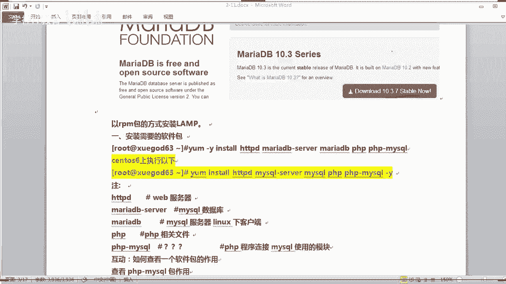

好。那。那首先的话，你们的虚拟机肯定是要配置好这个啊网络源，就是亚母源啊，包括本地源，对吧？那我这里的话。肯定是有已经有这个各种的源都已经配好了是吧？因为你安装好之后呢，基本上这些啊网络源都已经配好了。

还有这里配置的一个本地源是吧？local啊。然后的话我们来安装。其实今天晚上的实验，你完全可以跟得上老师的节奏啊，可以跟得上老师的节奏进行是吧，进行一个实验啊。那y杠Yint你要安装什么东西呢？

我们安装一个web服务，比如阿帕奇，阿帕奇是什么HTTB。D对吧？这是阿帕奇，然后呢是数据库，数据库呢就是meraryB。M B杠s啊，这个是m B several啊。

但然你还有包括安装它的客户端mly。对吧这个也要装上去。然后还有什么PHP啊。还有BHP呃，连接你的mycycl的一个驱动，对吧？这个也要装上。12345是吧，5个这样一键就可以把这些软件全部装好。啊。

前提是你要把这个源配好啊，你这个虚拟机的话肯定要能上网是吧？如果不能上网，它就从哪里啊，从你的本地源啊，从你本地源去检索这些阿标包进行安装。呃，我刚刚刚看到啊，有说老师老学员这边没有笔记。

老学员这边没有笔记吗？那个。助教同学，你是不有没有在那个老轩的那个那个班级上去啊，助教同学。他说上。那个班级的话是没有笔记啊，你传一下。OK好。😊，发过就可以啊。哦，好。我我好像也没有在老学员班前。

但是有同学已经发了是吧，可以啊，已经传上去就可以。来，那么这样的话，我们就通过亚母一键方式就已经安装完了是吧？安装完了这个LAMP的一个环境。

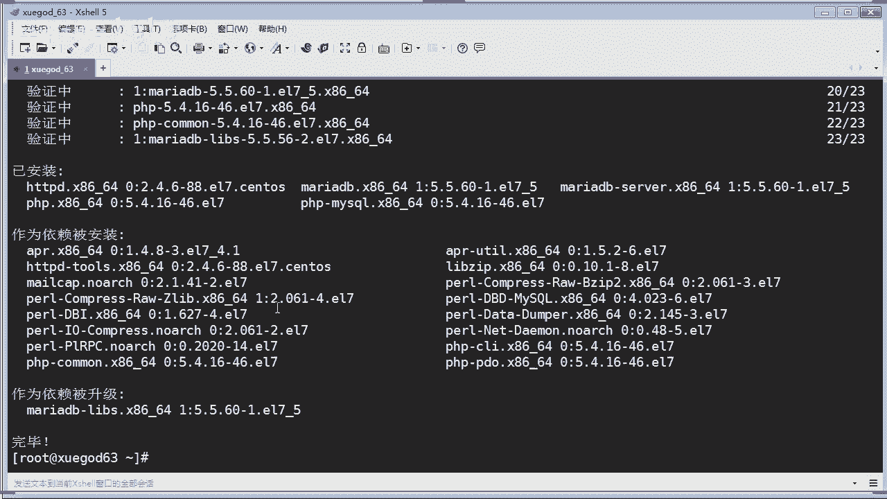

那你再看回来这个比例啊，呃如果你是在366的话，你应该是执行这个是吧？因为在6下面的系统的话，它还是使用什么呀？使用这个。什么呀mycycle这种方式，因为它在上面安装了，有可能是啊mycycl5。

5的版本，对不对？但是现在6的话，我们呃基本上。基本上是吧基本上讲课是不用了是吧？那讲一讲啊，我们刚才安装了几个软件，一个是奇就是服务啊，对吧？

的话是mycycl数据库啊这个呢就是客户端下的这个mycycl客户端是吧？还有P的话不用我们说是吧？这个的话就是一个什么啊HP语言啊，有它你才能正常的解释你的PHP言啊，HP杠cycl是什么东西是吧？

就是PP程序连接的一个模块啊，你可以叫它一个驱动是吧？驱动啊，O如果你要查看一个软件包的作用，你可以通过M杠PQI是吧？然后写上你的这个M包它就显示出来。

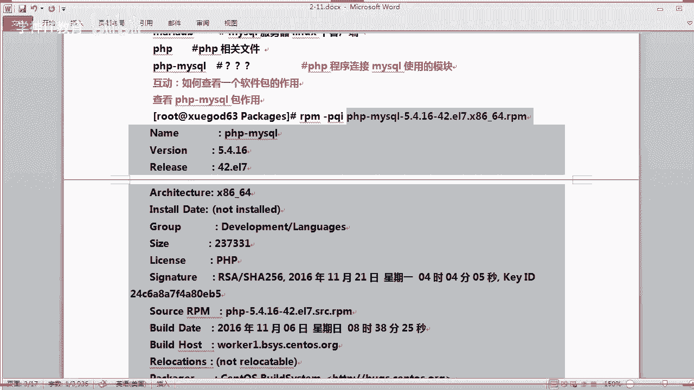

譬如我们这样子去查看啊RPM杠。P。PQI是吧？然后在我们的这个p下面的话，会有一个PHP杠mycycl这样的一个包是吧？通过这种方式呢，它就会列出来啊，这个东西是干什么用的，名称版本是吧？

然后等等一些相关的详细数据的话，它都会在这里会提示你呢最后面这里还有一个说明是吧？这个是什么东西？你可以把它copy到这个百度翻译去翻译一下啊，翻译一下，其实它就是一个模块对吧？模块啊，对不对？

用于连接mycycl数据库的一个模块，看到没有？这里是有说明的啊。O。还有。那我们安装完了这个mycyclcle啊，比如我们要查看。这个。mycyclcle的命令。对吧。

那马赛克命令的话是由什么啊由什么来进行安装的呢？得来的呢？我们可以通过IPM杠QF，然后用个反引号的方式。要被取一下mycyclcle啊，这样我们可以看到哦。

这个mycyclcle的命令它是由merB5。5是吧？这个包装完之后才产生了这个mycyclcle的命令。对不对？还有我们的阿帕奇，阿帕奇的话呃哦。这个是哎哦，我打少了是吧？HVD要加1个D是吧？

杠V可以查看什么东西呢？可以查看你的app帕ache版本啊，2。4。6是吧？这个版本的话也是蛮新的啊。那么mycycle的版本呢？就是medyB5。55。6是吧，5。5。6。好，我们刚才把原件已经装了。

但是呢并没有启动服务，是不是？我们怎么样启动是吧，使用这个sstem cTL对吧？要star一下你的什么呀？比如我们的阿帕奇，你把它启动一下。OK那还有这个什么？还有什么？还有mycyclcle。

我们是不是直接撬mycyclcle启动呢？你这样能启动吗？同学们。😡，这样是没有的，你看根本就找不到这个服务，对吧？你应该启动什么东西啊，启动的是mdy B。对吧你应该启动是这个。同学们注意啊。

后边我们再讲一下安装mycyclcle之后是吧，我们就应该是启动mycyclcle，它是有区别的啊。OK当然了，你还可以设置一下随机启动，怎么样设置随机动。我们通过亚某方式安装的这些软件包啊，对吧？

都可以通过这个sstance料来进行管理。是吧这个啊y是吧，进行啊设置它随机启动，对吧？包括啊那个阿帕奇，你也可以去设置一下。OK。那启动完成之后，我们是不是就可以登录mycyclcle呢？

现在的这个mycyclcle啊，其实它是mertyB啊，我们也可以认为它是mycycle啊。那么其实它就是mycyclcle啊。我这样直接敲麦口，它能登录吗？你看。咦，你看到没有？

它是能够登录的那说明你安装的这个MDB啊，它是空密码是吧？没有密码，对不对？这个时候他以root账号进行登录，是没有密码的方式登录到你的这个交互界面啊，mycycll的一个交互界面。O。

那如果你要看一下这里面的话，有哪些数据库，你可以通过show database的方式是吧？查看一下哦，这里面有一个什么information sma，还有mycyclcle。

还有performation s是吧？还有testask库。test库的话就是一个什么测试库。对不对？啊，对，MDB和my呢它都是一个呃都是一样的东西啊，只不过它是不同的分支，叫的名称不一样而已。

是不是MDB可以做进去吗？当然可以是吧？啊，虽然说现在mycyclco其实它是没有闭严的是吧？oracicle它也继续开源mycyclco，对不对？如果它闭严了，你说还有人用吗？哈，这个很难说是吧。

反正他收购之后到目前都没有闭延。对不对？O。好。那这样的话我们就已经把这个mycyclco啊，还有这个什么这个阿帕奇都已经装上了，对不对？装上了之后的话，我们来测试一下我们这个。

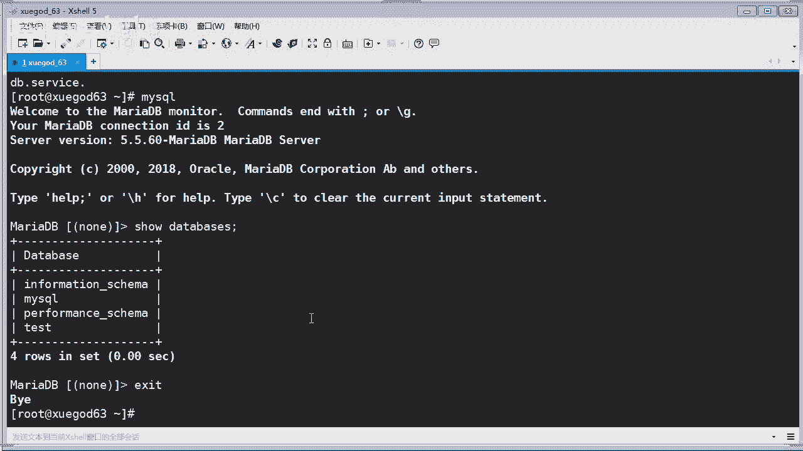

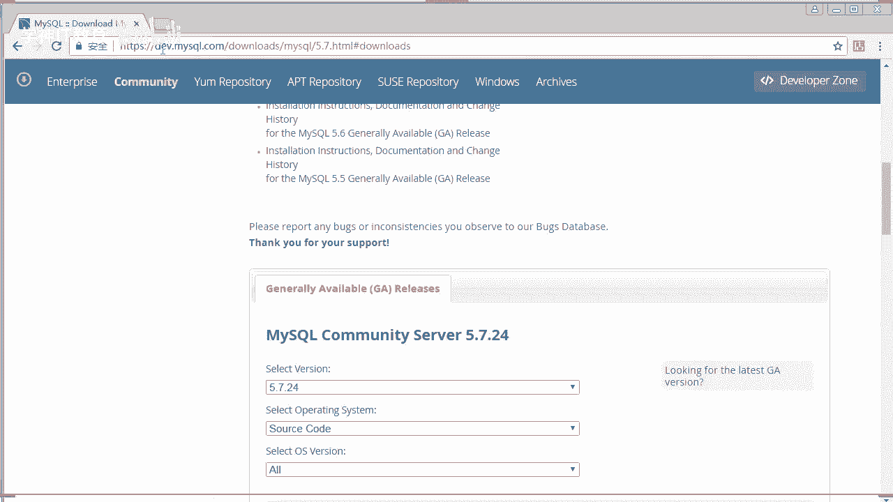

web页面能不能正常访问？对吧那同学们，如果你访问你的这个这个服务器是吧，输入IB地址，能看到这个欢迎界面是吧？什么啊texing123，这个其实就是一个测试页面嘛，对吧？OK如果你看到这个页面的话。

说明你什么，说明你的reble是正常运行的，正常运行的对吧？我们可以通过这个nt。啊，nest的方式你来看一下。你看到80端口没有？阿帕奇是吧，在监听状态。

listen监听状态还有什么33063306就是什么呀？就是mycyclcle啊，也就是MDB也是在监听状态的。OK。那如果啊如果你这个mycyclcle里面有这个有密码，那你应该是怎么样登录，对不对？

那么现在的话我们安装完这个MDB，它是没有密码，是不是没有密码。这样子啊，我们的话是先看一下，我们先做一个安全配置。做安全配置的同时呢，我们顺便设置一个这个密码，好不好？

怎么样对你的这个MDB进行一个安全配置呢，其实它已经提供了一个呃mycycl，你可以tableble一下，你看没有？你敲mycycl要tableble的话，你看到没有？有这么多以mycycl开头，对吧？

以mycycl前缀开头的这么多命令。是吧这么多命令可以使用的不，同学们。😊，OK那这里的话其中会有一个叫呃找一找my cycle那这个。这个的话就是可以用来做做什么呢？做这个mycyclcle初始化啊。

安全初始化的一个什么一个命令。SECU是吧，要什么instaltion是吧？来，我们敲一下这个命令。😡，好，你看它输出什么东西，它会输出一个交互的一个界面是吧？

他说什么enter possible for呃，什么，就是叫你输入root账号的密码。你现在root账号有没有密码？同学们不要认为是linuxlinux系统的root账号。

不是啊这个root是mycycl里面的一个账号，是mycycl数据库里面有一个root的用户啊，不是你这个操作系统里面的root啊，要搞清楚，现在它是没有密码了，对不对？我们直接按回车。直接按回车。

它提示什么东西呢？他说sd rootuter pass，他说你是否要对你的router要进行设置密码呢？当然我们要设置一个密码，我们输入这个Y就是yes嘛，对吧？yes，或者你直接按回车也是可以。

然后他就叫你输入一个新的密码，比如我输入123456。好，他教你再输一次。对啊，mycycl的管理人。对这个root呢就是mycycl的管理人，没错啊，123456，对吧？说了两遍之后呢。

他就已经设置成功了啊，我设置的密码是13456，这里会输出一个成功，对吧？然后他这里进行了一个重载前，就是刷新前限表，你们看得懂吗？是不是然后往下去还有交互的一个界面是吧？他说是否移除匿名账号。

匿名用户的意思，看得懂吗？V是吧？然后这个是什么匿名用户，当然我们不需要一些什么匿名用户，所以的话我们直接什么直接yes或者是直接按回车也一样啊，直接按回车就是相当于你输入y的意思啊，好，成功看见没有？

好，往后面去看的话，他说呃，是否允输，是否就是禁止掉这个什么root账号的远程登录。root账号呢，因为它权限比较高啊，它是属于什么mycyclq的一个超级管理员，对吧？所以这个这个账号是至关重要的。

所以说我们一般不允许远程登录。什么叫远程登录？比如你在另外一台机的客户端要登录我这台mecycl是吧，就是远程登录。对不对？一般的话我们不允许在远程录。那有些同学说奇怪，不允许远程录。

那我的应用怎么连接啊，你可以再创建一个什么普通用户啊，对不对？再创建个应用账号啊。😡，OK我们直接按回车，就是啊。对吧禁止。然后他还提示你说是否要移除测试库是吧？test database啊，还有。

移除它是吧，还有它的一些访问权限，但我们也是要移除掉这个task库。OK最后的话是说是否要重载一下你的前线表啊，当然我们要刷新一下前线表，让它立即生效。OK搞定是吧，成功是吧？啊。

它就会输出为什么thans for using me B啊，就感谢你使用mer BOK当你看到这个的话，大功告成啊，做这个安全初始化的话就已经大功告成。其实很简单啊，你可以看一下笔记。啊。

OK那么这个时候你在敲mysq能够登录吗？肯定是不能登录。为什么？因为你没有加上密码是吧？没有账号权限信息，它是不允许你登录的。对不对？那你这个时候要怎么样，杠U杠U就是指定你一个用户名。

然后杠P杠P呢就是叫输入你的这个什么密码。那我的密码是什么？123456。啊。那这种方式来通在本机啊是在本机来登录你的mycyclq数据库系统啊，只能这样去登录了。对不对？O。能隐藏吗？什么意思啊？

那我们来看一下啊，你看到没有？这里话你会看到一个叫呃，刚才我们不是看到有4个数据库吗？现在只剩下三个了。为什么刚才有个test库，就是测试库已经被我们做这个安全。呃，安全初始化的时候呢。

他会删除掉这个test库的，看到没有？这样就可以了。对吧当然你在登录时候呢，你可以不用使用这个铭文密码登录，你直接这样杠P，然后他叫你输入密码，123456。这个密码呢，它不会显示在屏幕上了，对吧？

你输完之后按回车就可以了。就跟你登录这个linuxux系统是一样的道理。远程登录不是禁止了吗？对我现在不是远程登录啊，同学啊，我不是远程登录啊，我是在本机登录啊，我们并没有禁止它本机登录啊。

O来我给你看一下mycycl，我们进到这个my的这个数据库是吧？那有些同学说呃我们搜一下这个tables给你看一下，这里话会有一个叫user的这个表是吧？嗯，来。给你看一下就明白了。

s user house是吧？from user来，同学们，你看看啊，我刚才是只是禁止掉了你这个什么root项远程登录，但是它允许本地登录。lockck house是不是本地，同学们当概是本地的对吧？

lockckhouse和127。0。01，你都可以通过这个root账号来登录，明白没有？在这里控制您的主机，哪些主机能够用这个账号来登录？看明白了吗？O。好。那那这个时候我们先退出一下。

然后往下去看啊往下去看，我们来测试一下，我们刚才不是安装了LAMP嘛，对吧？mycyclclePHP对不对？那我们看一下还有这个什么阿帕奇。我们看一下他这个我们的这个web网站能够是否支持PHP网站呢？

对不对？是否能支持，我们来测试一下。呃，我你们之前有装过阿帕奇吗？😡，中阿帕奇，你应该知道它的一个配置文件在这里。对吧。它配置文件是这个HTVD。点com文件看到没有？这个呢就是阿帕奇的主配置文件。啊。

不生疏吧，对不对？O。这个的话啊来你看看啊，我找一个叫。那我找一下这个这个的话一般的话啊，它是配置你的这个什么seven name，就是域名，对吧？一般它是注释掉的。如果啊如果你这个话不启用它啊。

在启动的时候呢，有时候它会什么有警告，虽然能够启动，但是它有可能会警告。所以一般我们这个的话都要进行配置一次。啊，你将这个配一下。比如我们这里的IP是192。168点。啊呃，2。63啊，这个配置一下。

O。这是这第一个配置啊。然后我们就直接保存退出啊保存退出。那么我们现要测试一下我们的这个阿帕奇能不能够啊打开PHP的页面是吧？怎么样去测试呢？我们来写一个什么写一个探针文件。

就写一个什么写1个PHP的一个啊代码文件。我们知道安装完这个阿帕之后呢，它的网站该目录是在这里，对吧？这里现在是空的，看到没有？同学们。这里是空的啊，那我们要自己写一个，我们写一个叫indexPP。

怎么写？😡，来。😊，你可以照着笔记敲就可以了。对不对？PHP in four啊。那有有工作经验同学，这个应该啊用的非常频繁了，是吧？都知道这个东西专门是用来做测试啊，测试这个PHP页面的是吧？

很简单的一个测试页面啊，来写完之后呢，保存退出啊。那么刚才我们写了一个测试A页面，并且修改了我们的主配置文件。当然我们需要重启一下什么呀，重启一下你的服务什么服务。但是阿帕奇。对不对？

重启一下你的阿帕奇OK重启完之后呢，再来我们来看一下能不能够访问这个PHP呢。

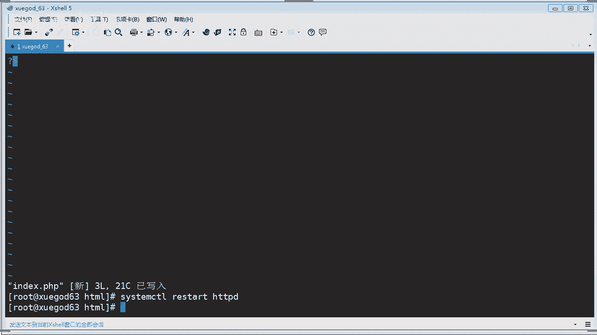

你看没有？恭喜你。如果你看到这个页面啊，说明你的阿帕奇能够正常解析什么PHP语言是吧？能够正常解析PHP了，对不对？那这里会输出相关的一些配置信息啊，对吧？包括这个什么啊mycycl数据库都有啊。

你拉下去就可以看得到了。

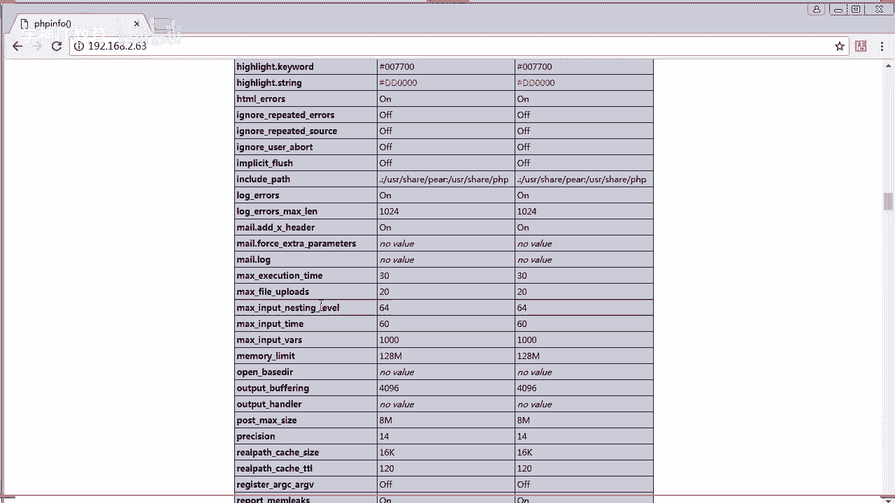

对不对？😡，Okay。很简单啊，其实我们做运维的话，这个是非常重要，肯定是要做测试，看一下成不成功。😊，对不对？亚么安装了PHP版本好低，对，那肯定是比较低的。因为亚么安装基本上是5。4啊。

后面我会教你们怎么样去安装高版本，比如5。6啊。是吧还有7。1啊，7。0啊，对不对？这没有什么难度啊。好嘞。😊，那么这样的话，我们就已经呃通过这个方式是吧，已经搭建成功了。

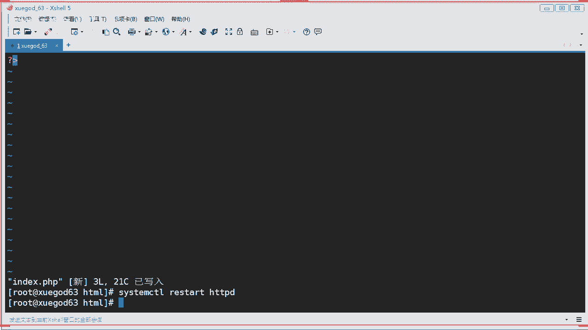

那定成功了是吧？😡，能够正常的什么正常的解析PHP里面看到这个页面了吗？你们成功了吗？其实完全可以跟上老师的节奏啊，今天的课程内容不难对吧？不难，对不对？无论对这个新老啊新老同学啊都不难啊，非常简单。

😊，O。那往下去讲的话，我们应该做什么东西呢？这里是实战搭建。基于这个LMP的环境，我们部署一个网站，部署一个网站。呃，不属什么网站，其实它这个是非常简单，就类似人人网啊。

就相当于个呃这个什么个人博客是吧？个人博客的一个这样的网站。好吧，那么相关的安装包的话，我已经上传到这个群共享，你们去这个群共享是吧，群文件里面去下载就可以了，有有总共有三个包是吧？

有一个是后面讲到了啊，其中有一个usent，还有个usent home啊，这两个。我们现在要讲的啊，讲这个东西的话，你应该看一下，现在演网好像也不太不太活跃了。你们现在还有人去上人网吗？

我记得以前就是啊很多这个大学生是吧，非常喜欢去到演讲网。😊，我现在我发现有好几年没有去过人人网了。对不对？是挂掉了哈，对不对？😊，我都不知道，对对，现在你们去的地方比较多的，应该是什么呃，什么。

叫什么微博是吧？😡，微博啊对不对？都是玩微博，玩微信，还要玩什么玩抖音对吧？玩快手。😡，啊，对不对？有没有人Y玩快手啊，玩抖音的啊，抖音非常火。😊，は。那讲到这个优条啊，我们来认识一下这个康盛创享是吧？

康盛创享呢，其实呃作为这个比较老拍的这个做论坛了是吧？以前他是非常牛逼的，对不对？做论坛啊，后面的话是应该是这个腾讯收购了，对不对？由生产用户中心啊，它可以实现用户统一登录登登登录登出是吧？

比如像一些什么积分兑话啊等等，用户管理啊等等啊，在这里的话都可以进行一个融合管理啊。有了这个东西，其实就是相当于一个什么用户管理后台。啊，还要讲一下这个disgu论坛是吧，这什么东西？百万站长的选择啊。

对不对？我相信很多年前啊，应该是很多年前啊，非常这个论坛非常火的那个年代啊。😊，对不对？以前我们经常去灌水啊，以前经常去灌水。那么首先你就要去各种论坛上去灌水啊。那么现在上论坛的。的时间啊比较少了。

对吧？比较少了。对，虽然说现在论坛的话也还存在啊还存在，但是没有以前那么火了。因为现在新的一些事物啊已经代替了是吧？太太多原行都是玩朋友圈了，是吧？啊，抖音啊等等。O。我们看一下啊这个。这个是论坛对吧？

那么现在这个的话应该是7。07。27。4，应该是7。2最新版本的是吧？而且更新的话升级好像也不再更新了，对不对？因为毕竟的话啊不太行啊，是不是？不过这个东西我的确我觉得还是蛮好用的啊。

作为一个个人分享这些论坛啊。好，U3的ho的话是个人家园，就是个人的一个前端展示页面啊，对吧？跟那个什么啊，就像跟你的QQ空间是一样的，对不对？啊，给社区的会员啊，可以一个安假的地方，是不是Q空具啊。

其实跟Q空间是一样的，可以写写什么写记录啊，写日志啊，写照片啊等等这些东西。教上里面现在是写博客啊，也相当于博客，对吧？啊，咱们班有没有学这个技术博客的，咱们班有没有？有同学说什么是灌水啊。

那么如果你不知道灌水，说明。😊，你很年轻。是吧你是不是想表示你很年轻啊？😡，00后是吧，你是不是00后，00后应该很少听过灌水啊，是吧？😊，OK那说明老师老了。😊，啊，咱老了啊，真的。对啊。

以前经常去踩空间，还记得吗？那个年代我们经常去踩空间啊。😊，哼。😊，嗯。ok。那刚才讲到啊，你们有同学是写技技术博客的是吧，写过大概十几篇的linux基础博客是吧？其实呃如果你是有一个这样的一个习惯。

坚持写技术博客，对你是有好处的啊，因为。因为以后啊你。包括你出来工作啊，你积累那么多年的这些技术博客这些文章啊，以后你想回来去找他是吧？哎，比如我遇到一些问题，我回来再找我这个相关的一些技术文章。

我找的话非常容易，而且我解决起来以话也非常的便捷，是不是？如果你不记录的话，有些东西你学学了之后呢，你就会忘掉了。对不对？叫查我们之前学的什么高数什么东西啊，都已经还给老师了。

有没有这样感觉都还给老师了啊嗯，别到时候慢老师教你们这些mycycl东西啊嗯，可能下个月你又还给老老师了，那就不好了是吧？所以我们学的东西的话，你可以记录一下，是吧？这也是你的这个成长过程。

记录下来有一句话说的好啊，好，记性不如烂笔头，对不对？好记性不如烂笔头，所以说记录下来的东西的话，印象更加深刻。😊，啊，对于以后你出来工作的话也是非常好。嗯，记录到有道云也是可以的啊。

以前也有老学员推荐过使用这个有道云啊，你们喜欢哪种方式都可以。O。好嗯，我们知道这个都是一个什么社区门户，对吧？社区门户啊。那这两个包的话，我已经上传了，这两个包的话，基本上是比较老的包了啊。

我们只是做一个实验，告诉你是吧，我们怎么样去部署。这个。这个叫晚什么的同学是吧？myical笔记已经80多页，接近3万字。你写了那么多的技术文章是吧？那不错哦啊，给你点个赞。

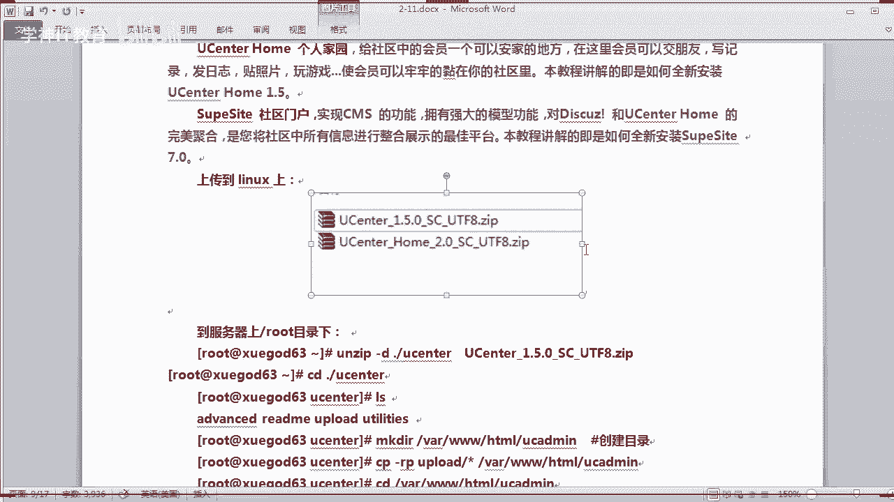

好，那。我先把这个传上去啊。我打开。我的压缩包。好嘞。那。上传成功啊呃，这里有一个叫优森的1。5。2的一个一个包，还有一个是优森的home是吧，看到没有？有两个包。

那么就我们就基于这两个包来进行安装一个呃，这种什么。个人网站是吧？就像QQ空间这样的一个。网站。

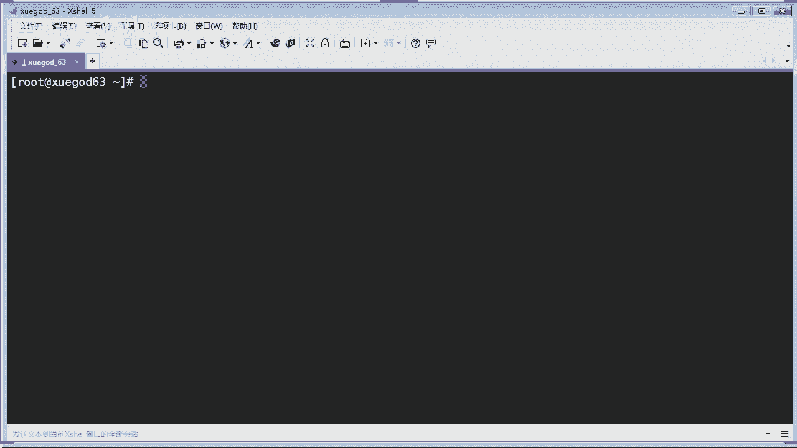

OK啊，你们可以跟上节奏啊，你把这个上传上去之后啊，我们要进行什么进行解压啊，解压。

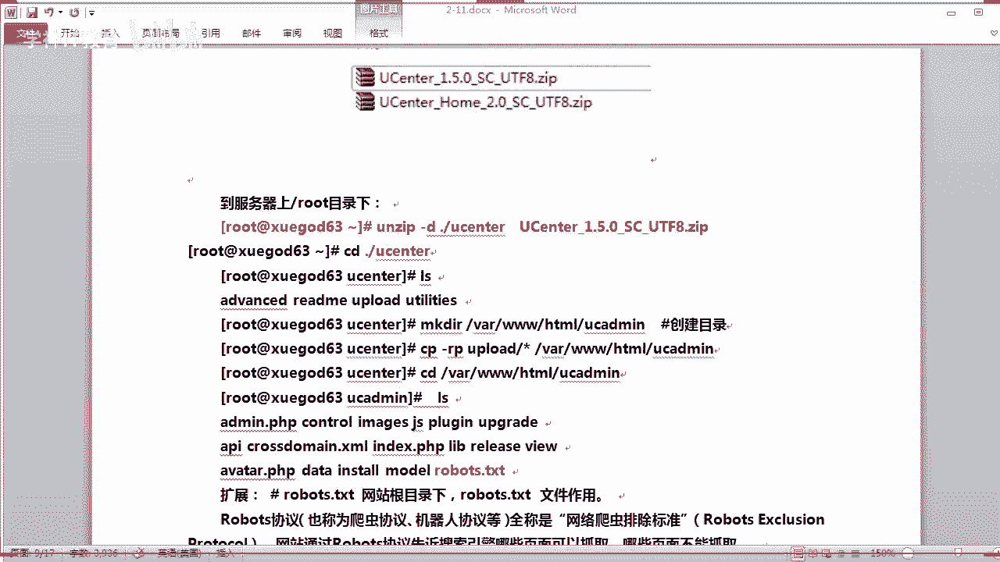

来。那么解压啊，那么这个的话它是什么？以这个ZIP这个扩展名结尾的这种压缩包应该使用什么工具来解压？这个是吧，对。使他来解压啊。那如果我要解压到指定路径，应该是怎么样杠D是吧？

比如我觉到这个当前路径下起个名称叫刘。centerenter。O。然后你要解压哪1个UCEN。1。5对吧，我把这个包解要到这个目录下，看得懂吗？嘿，你发现没有？我没有这个命令，没有这个命令怎么办？没有。

当然是安装了，对吧？啊，安装一下。OK好，我们再进行解压。好嘞，那么这个时候呢你会看到这里多了一个多了一个文件夹，就多了一个目录是吧？我们CD到这个目录下面去看啊。好，你看这里的话有几个目录。

其实我们主要呃用到的东西在这个什么？😊，这个upload是吧，upload这个这个这个里面去。OK这个才是我们真正想要的代码文件。对不对？真正代表文件就在这里啊。好嘞。

那么这个我们首先抓了这个是东西是什么呢？其实就是用户后台管理中心是吧？这个是用户后台管理中心的代码。那这样子啊呃我们把它这个代码其实我们上传之后应该传到哪里啊？上传到你的网站跟目录，对不对？

你们以前使用这个windows下的IS的时候，是不是经常通过FTP的方式啊上传这些网站代码，对吧？上传网站代码，上传到你的网站ga目。那么其实我们这里也是一样，要上传到哪里。

能上传到你的哇下的3个WHTM，对吧？上传到这里。那我为了做区别，我在这里呢再创建一个目录，为什么要区别呢？因为我这个是后台管理中心，一会啊我们再装一个前台是吧？前台页面。所以我在这里创建一个。

一个一个子目录。创了个什么路呢？叫UC amin。对吧创建一个这样的一个目录。注意呀，我是在这个网站该目下面创建的目录，对吧？然后我们把这个这里的东西拷贝过去。啊，用CP。

CP杠RP是老师用这个杠RP这个参数表示什么意思？有哪位同学能够回答我？那么你们在第一阶段有学过啊。杠阿RP表示什么意思？迅速的回答我。😡，递归。OK杠阿斯帝归是吗？杠P呢。😡，P是什么意思啊。

不错啊啊，你们很容易。😡，啊，对啊，批是包含它的前线属性都拷贝过去，就保留它原有的属性。注意啊，同学们保原保留它原有的属性就是用杠P是吧？杠P的话就是递归加保留属性的方式进行拷贝。对不对？

又学到东西了吧。不过你们之前就已经学过了是吧？😡，其实咱们学linux就是这样子啊，你在不断的去往下一个阶段学习的时候，你会你会知道啊前面的基础才是最终的。如果你前面基础没有学扎实。

后面你会感觉有点压力，是不是还有同学还还拓展了杠A对，没错。如果你用杠A的话是吧？杠A的话都不用再使用这个杠RP了。😡，对不对？😡，是不是这个道理？啊，学以致用啊，举一反三过的。好。

我们把这个这里面的什么呀，这里面的所有代码把拷到哪里去呢？拷到哇下的3个W下面。有一个什么HTM。HL的话有1个UC anymin这个目录下面去。你看我当前是在哪个目录啊。对不对？OK好。

我拷到这里之后，然后我进到这个目录下。对不对？进到这个目录下，这个是在哪里？这个是在你的网站跟目录下面的UCed这个目录下是吧？因为这些代码的话是用户管理后台的一些代码。所以。啊。

我进到这里给你们看一下啊。这里的话讲一下，这里有一个叫。robot这个是什么东西啊来。在笔记里跟你讲一下。

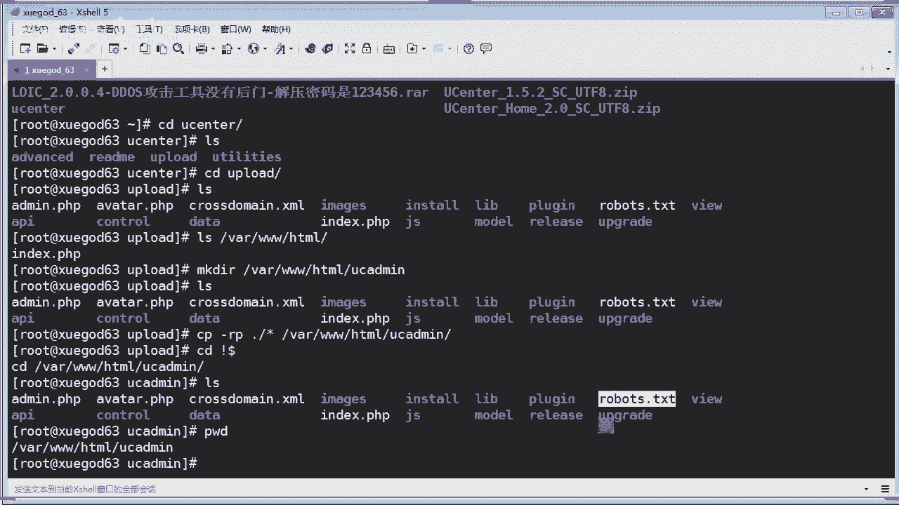

这里其中有一个这样的文件呢啊要进行啊跟你们拓展讲一下啊，这个的话它是什么东西呢？它简称为爬虫协议啊，也就是排他协议、机器人协议。啊，全称是网络盘中排除标准。对吧网站通过这个协议告诉搜索引擎啊。

哪些页面可以抓取，哪些页面不能够抓取。是吧有了这个文件，这个是一个文本文件啊，使用任何一个常见的文本编辑器，比如windows自带的这个什么记事本就可以啊创建和打开它，对不对？

它是一个相当一个通告协议一样，对吧？它不是一个命令啊，它只是告诉搜索引擎啊，哎，哪些文件你能够查看哪些不能查看，但其实你说搜索引擎会听它的吗。会不会听它？其实以前的话可能会听，他是现在的话。

现在什么各种爬虫啊，各种技术革新呢。因为这东西的话，你其实你存在这里的话，我一样可以要过你是吧？对不对？君子协议没错啊，林云凌云同学说的这个东西挺有道理。君子，如果你做君子，可能就是遵守是吧？啊。

如果你不做君子的话，我完全可以要过去。我想怕你的话，还不容易吗？对不对？其实技术手段是可以要过你这个东西的。😡，明白没有？只是告诉你有这个东西。是吧他不是防火墙，对吧？不能防得住他了，无法防得住的他了。

你说啊这个淘宝淘宝网站不是啊就不给这个百度百度进行一个爬虫嘛，是吧？百度支助的话，无法去爬取这个什么淘宝的这个什么这些数据，你你觉得他只是单纯使用这个协议，他就就不能爬，肯定不是的。那么阿里巴巴的话。

他肯定使用了非常高深的技术来进行排他标准啊，排除是吧？不是说你写了这个东西也能不爬你了。对吧。OK。好，那呃这里。

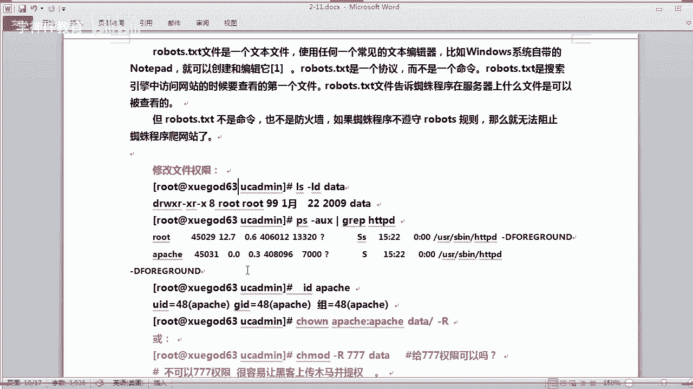

来再来看一下。那这里的话会有各种的这个什么PHP代码文件，对吧？还有date数据的目录，对不对？还有各种的库文件JS文件，对吧？

OK那其中这里的话我们要对这个啊这个什么这个date目录的话要进行一些授权。你看吗？为什么我用这个LR给你看啊，现在所有的权限就是root账号的。那么我们阿帕奇来对你的这个大二维码进行。

比如读操作的时候呢，它要用什么权限读啊，它是用阿帕奇的账号来读。是不是？那么阿帕奇账号能不能读啊，其实他是可以读的，但是写呢。写并没有，你看到这个第三方这个是吧，第三个对吧？阿的这个这个权限都有读权限。

但是写并没有写的话，我们要对一些写的目录文件要进行什么进行更改。所以说这个date目录的话，我们要进行什么进行修改。那我们这样子好了，我们先首先的话先打开一下呃，我们的这个安装界面啊。你来看一下。

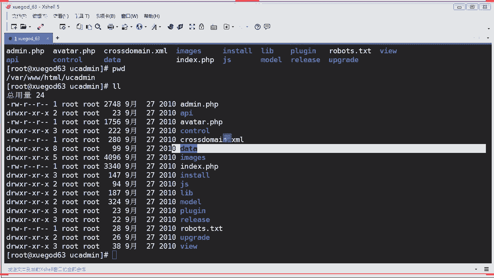

你看没有？这样的话，你你刷新的话，它是刷不出来的。为什么？因为我在这个网络干目下面有一个什么UCedmin这样的一个目录。😡，那。是吧然后我们点这个please点一下这个，它会跳转到这个什么安装页面。

然后它提示什么东西呢？啊？来，我们照着这个安装界面进行安装就可以了。来，他说对不起，请将PHP啊INI点NN这个什么。这个参数设置为2，就是开启。这个是什么东西呢？这个就是短标签，对吧？我们哎。

咱们班有没有有没有会PHP的呀，有没有？😡，有没有会PHP的啊，如果有会PHP的，你应该看得懂是吧？😡，有大老张老张是吧？😊，O。好嘞，那不错。是吧这个是短标签嘛，对吧？他要开启这个。

那么这个这个PHP的主配置文件在哪里呢？如果你是亚母安亚母方式进行安装的话，它应该是在ETC下面，对吧？

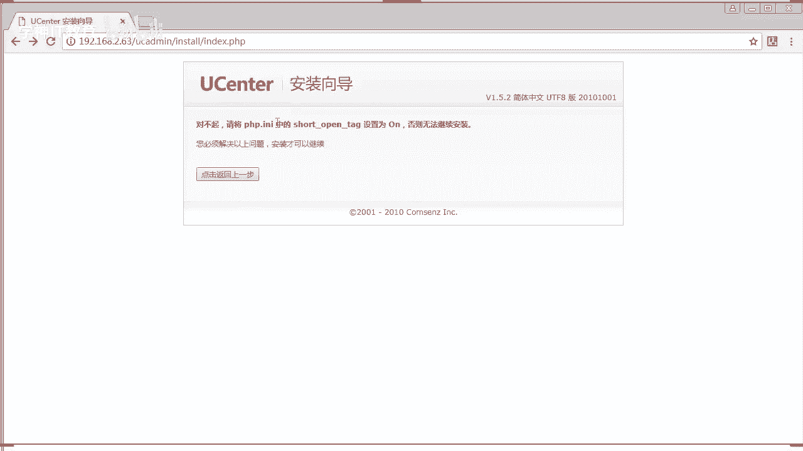

PHP点IN。打开它。😊，然后你要找到什么东西？哈。你要找一下这个来，我们拷贝一下这个。

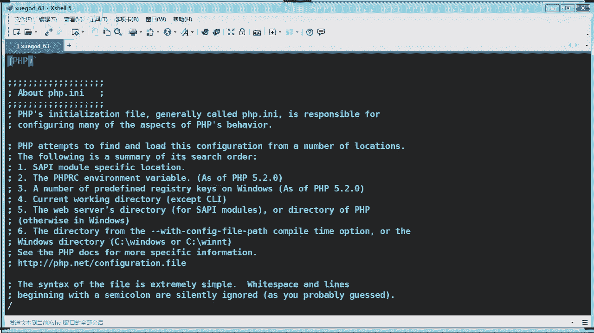

这个是吧。😡。

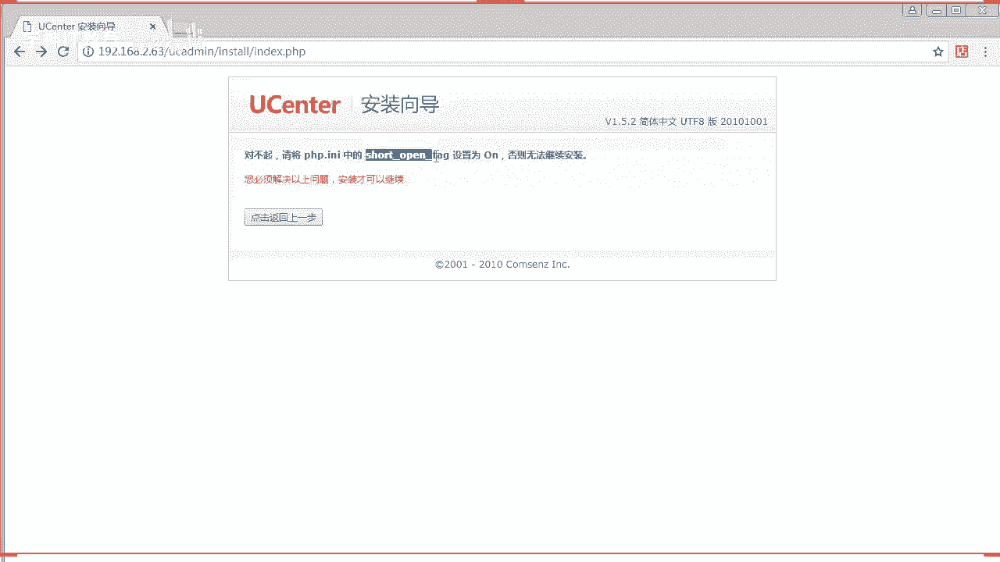

拷贝过去进行搜索。嗱。是这个吗？啊，这个看到没有？我把这个行号显示一下给你们看，在第211行啊，211行啊，注意啊，不是上面那个啊，是211行啊。然后的话你要将这个修改一下。将它改为on是吧，就开启。

然后呢保存退出啊保存退出保存退出之后呢。我们再刷新一下，看一看啊刷新。

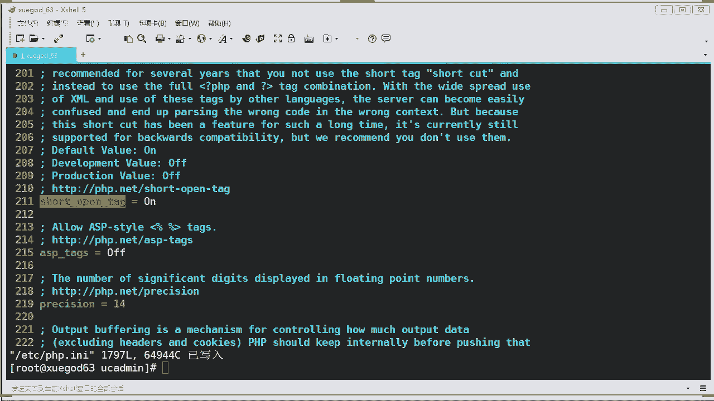

你看刷新好像没有任何的反应。为什么呢？因为你没有重启服务啊。对不对？你没有重启服务的话，他是什么呀，他是没有进行刷新的。我们要重启什么呢？

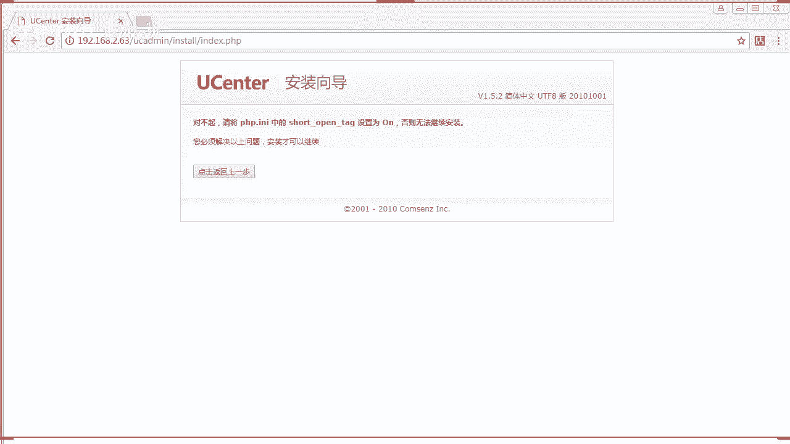

C条你可以重载也行，是吧？😡。

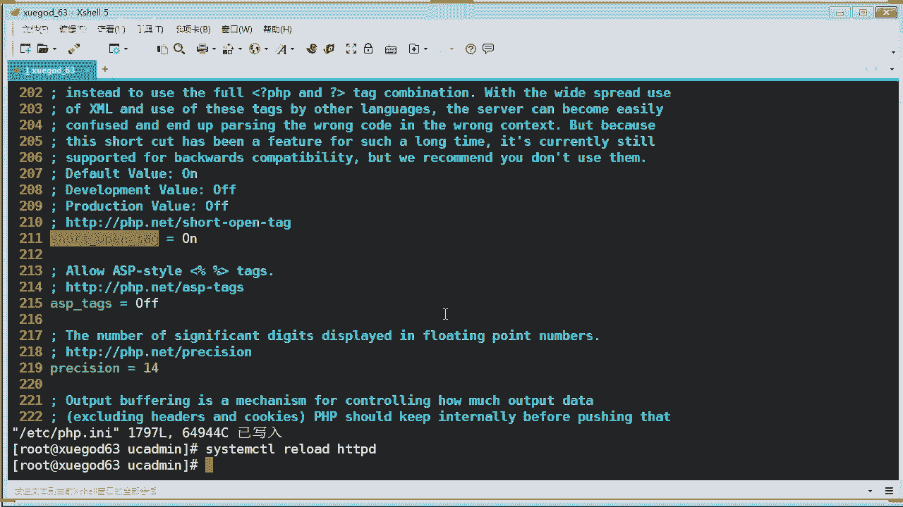

OK来，我们再刷新一下。你看吧一刷新它就已经消失掉了啊，说明它已经可以了是吧？OK然后我们点一下这个同意同意啊，然后就进入这个安装摄像头的开始安装第一个步骤是吧？它会对你的相关权限进行检查，你看没有？

这里话就是上面的环境也还是符合了，但是这里不符合。看到没有？这个date目录下面的相关文件啊，它需要什么呀？需要可写权限，所以说没有可写权限怎么办？

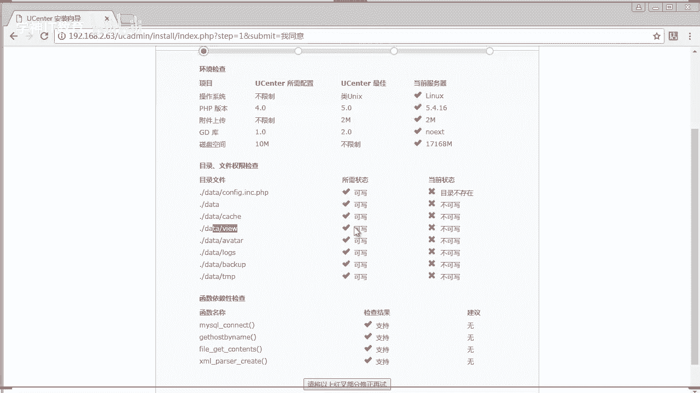

还是刚才那个我给你看一下是吧，这个date目录下面的话，它是没有可写权限的，所以所以怎么办？所以我们要给它一个可写权限。对不对？或者。看你是怎么样啊，我比如我直接给他什么，直接给这个阿帕权线。😡。

佳华阿帕奇就是不是就有权限了？阿帕奇date对吧？这个目录下我们要进行递归的方式进行授权，对吧？我们再来看一下啊，那这样这一个date目录下的话，它肯定有可写权性的，是吧？RWX对吧？

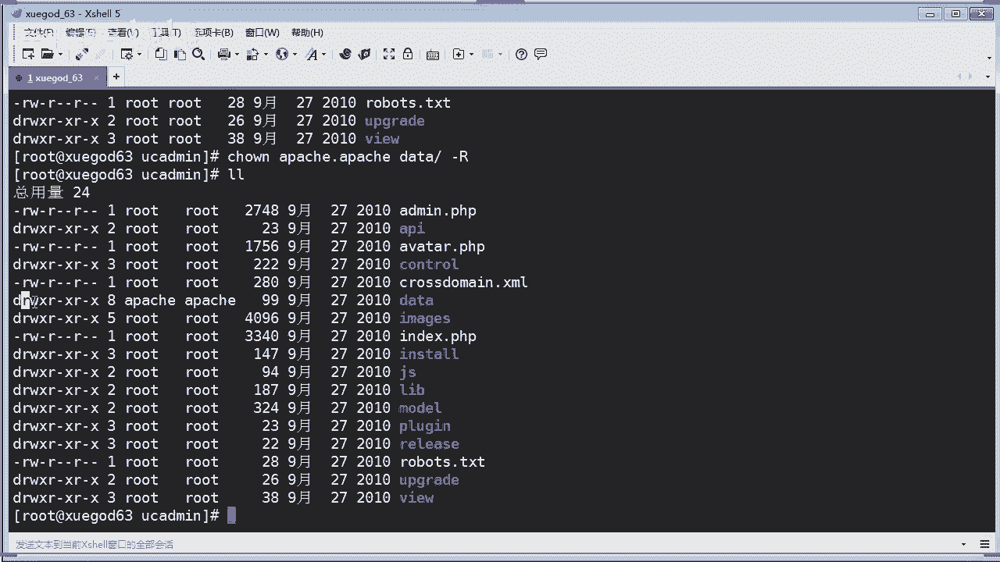

OK来我们再来看一下。😊，再刷新啊再刷新这个页面，你看到没有？这里马上就变了，变成绿色了，可写。ok。那有些同学说呃，我可以授权他为777前线。对，也是可以。但7前线的话就前线放的太宽了，是不是？

老师录屏了吗？肯定录屏了啊。OK。😊，老师讲的很有条理是吧？好，谢谢夸奖啊。😊，来。本身就是注重操作的啊OK那然后我们点击下一步啊，点击下一步啊，然后第二个步骤是安装数据库啊。

安装数据库就是要往你的数据库里面呢会创建一个什么创建一个库，并且在这个库下面呢会创建一些初始化的表，对不对？初始化的表，那这里呢它已经定义好了一些默认的名称，啊，数据库呢是哪一台呀？ house，没错。

对吧？我们就使用loc house就是它连接地址，然后数据库名称呢，它也帮我们定义好了，叫UcentO然后数据库用户名它默认使用root账号，对吧？那有些东西说如果是生产环境。

我是不是应该使用root账号还是用还是使用其他的账号呢。你可以使用其他的普通账号也是可以的。比如那如果你使用其他的账号，那你首先要去创建一个账号，对吧？你要去创建一个啊mycycl的这个账号。

再来这里填进去就可以了。当然我们这里做实验可以使用root账号就可以了，好不好？那密码是多少啊，123456啊，刚才我创建这个my的这个ot账号的时候呢，就是123456，你们的密码是多少。

就输入多少就可以。对吧数据表前缀啊，这个的话你保留就行了，是吧？以这个前缀就可以啊。然后这里还要填写管理员的这个创始人的密码，就是刘cent。等一下，比如你要登录这个后台管理中心。的密码啊。

我这里也使用123456吧。OK然后我们点下一步。😊，你看没有？他马上就帮我们建立一些啊就是初始化的表，对吧？OK成功了是吧？然后点点击这个安装用户中心成功，点击下一步，对吧？你看没有？

它就跳转到这个登录界面了是吧？那这个时候呢，我们就可以输入密码是吧？哎，你看到这里有个验证码是吧？验证码呢，你你已经看不到怎么办，我们要刷新啊，我们可以按按这个F5刷新刷新。看到没有？F5刷新是吧。

然后123456啊，然后再输入这个。EKMT是吧？没错啊，然后登录一下。那这样的话，我们的这个用户管理中心就已经安装完成了，是吧，并且能够登录成功了。看这个界面是不是感觉很熟悉啊？

同学们特别是有工作经验同学一看了哦，这个就是。啊，什么相当于论坛后台的管理中心。有没有印象？是吧。OK这个的话我们已经装完了，对不对？好，那这个装完之后呢，一会儿我们再来安装什么？安装前台页面啊。

那么现在话是9点35分哦，36分了是吧？我们先课间休息一下，咱们先喝杯水是吧？我们先休息10分钟啊，9点46我们再继续讲，好不好？

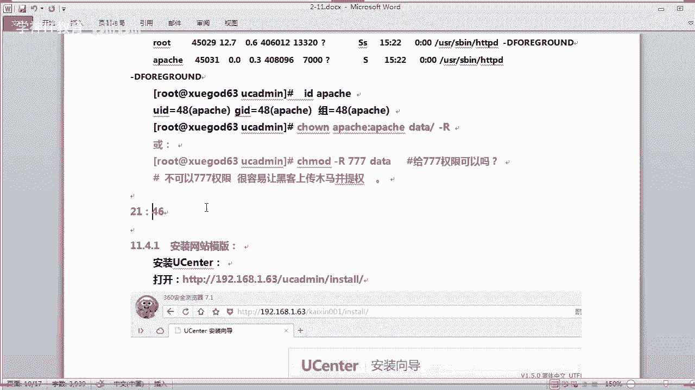