# Linux／Linux运维／RHCE／红帽认证／云计算／Linux资料／Linux教程--Mysql介绍和搭建LAMP环境02 - P1：Mysql介绍和搭建LAMP环境02 - 学神科技 - BV1uV411r7Ec

继续讲课。讲完老师再跟你唠，好不好？😡，好，刚才的话我们把这个用户后台管理中心已经装完了。对吧。呃，后台后台的已经装了，现在要装前台是吧，装前台同学们。啊，这个已经装完了啊，我们拉到下面去。好。

那接下来是安装前台页面了啊，就是这个us home。

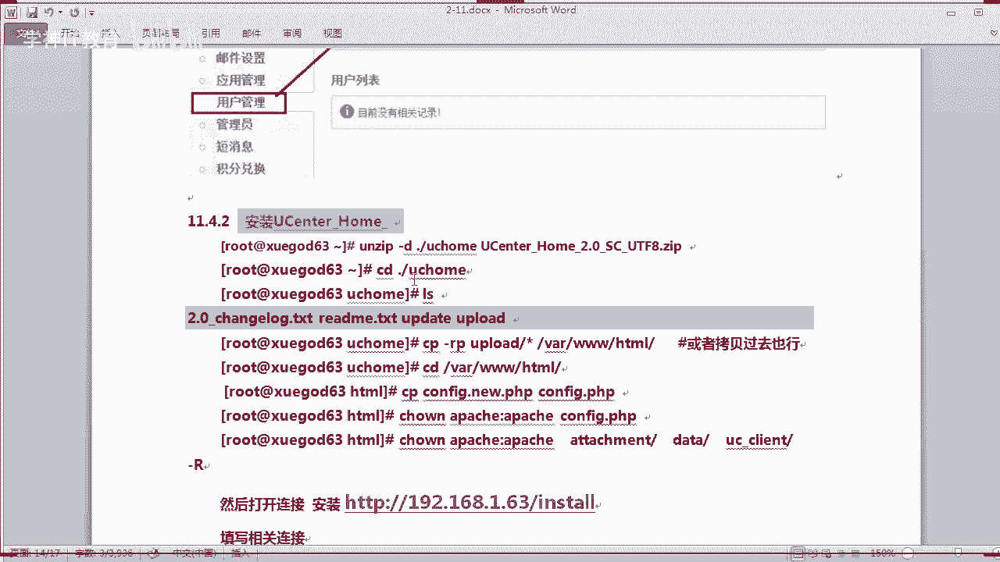

那我们先退出好。啊，我们把这个解压一下啊，把这个解压一下。那这个的话我也是截到当前路径啊，但是我起一个名称吧，要哦不是Uent了，应该是UC home吧。好吧，这样的话区分出来啊，然后将这个UC啊。

然后是home啊这个。就是将这个压缩包啊解到到这个目录下面去OK哦，我少了一个参数。看到没有？杠低是吧。OK你看到这里会多了一个目录。啊，多了一个目录。对，然后我们进到这个UC home的目录下面。

对吧？然后进到这个upload，就是这个上传的目录是吧？上传目录，这是它的相关啊这些源码。然后我们把这些。啊，一样的啊，把这些代码的话拷到哪里去，拷到我们的这个网站跟目跟目录里面去是吧？来，同学啊。

风叶伟同学，你看一下，我们这里就会用到啊，比如你杠。RP是吧，有同学我用杠A是吧？那么这回我们用杠A好不好？😊，那我们把这个考到哪里去呢？应该是考到这个你先不要考啊。我跟你说一下，你先看老师操作呃。

应该是考到这里去的是吧？但考到这里去呢，有没有发现我们刚才做测试的时候写了一个indexPHP的一个测试页面。然后你拷过去，这里呢又有一个什么indexPHP。那他是不是要覆盖这个东西啊？是不是？没错。

😡，他是要覆盖这个东西，你可以直接拷过去，也要提示叫你覆盖，或者是。你可以先把它删除掉。懂吗？😡，把这个干掉。O。是吧。好，那我们再把这个拷过去。那么这样唉你看没有？拷到这个目录下。对不对？

这样就可以了。然后我们呃进入到这个母项。看啊这样子的话就可以了。😊，好嘞。我们把它拷过去之后呢，我们再来啊，同学们呃，其实如果最好是重启一下你的阿帕奇。让他识别一下这些代码。对吧。好嘞。

那么现在我们打开啊咱们的这个链接啊，我在这里再起一个页面啊，192。168点，对吧？你看到没有？它马上就跳转到这个intall，就是安装页面。

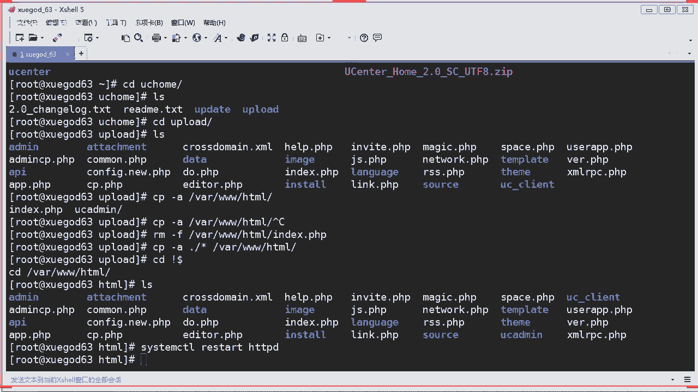

是什么？就是这个前端页面是么us home的一个程序安装，看到没有？这里有个提示说你需要将什么将你的程序跟目录下面的这个confi new什么PHP重命名为这个。有没有看到？人家叫你做什么。

你就照做就行了。

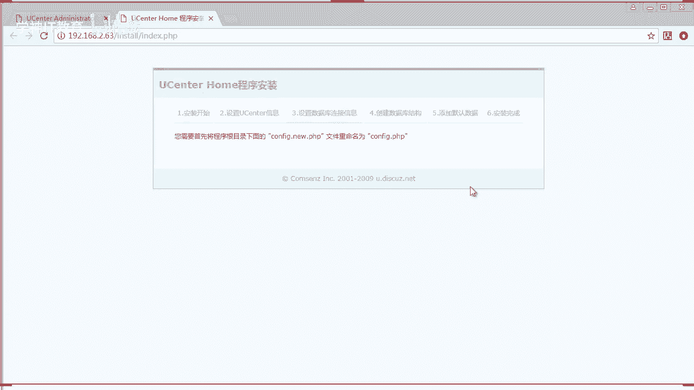

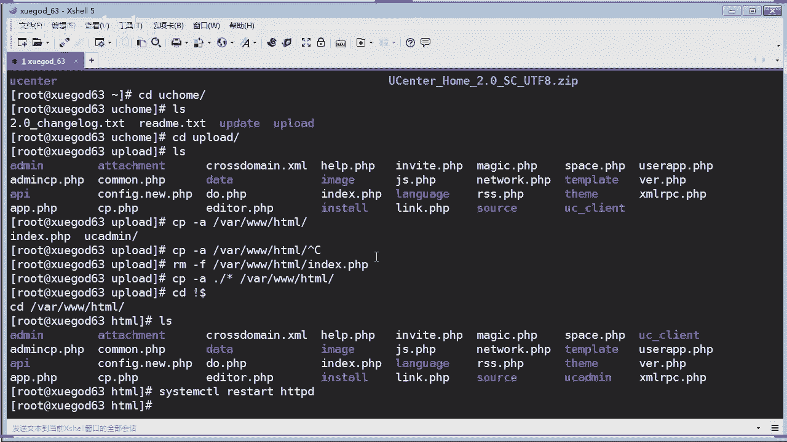

OK来。那么们来呃进行一个修改。在哪里呢？这个配置文件在哪里？confi哎，看没有？就这个。是吧将它重命名一下。咖off啡卡。啊，把它改成这个点PHP。就把中间的这个new什么new还有点去掉。

重命名一下。然后我们再来刷新。刷新啊，你看没有刷新，然后它提示什么呢？又提示下一个下一个警告了是吧？他说文件这个什么configPHP读写前限设置错误，请设置为可写再执行安装，对吧？好了。

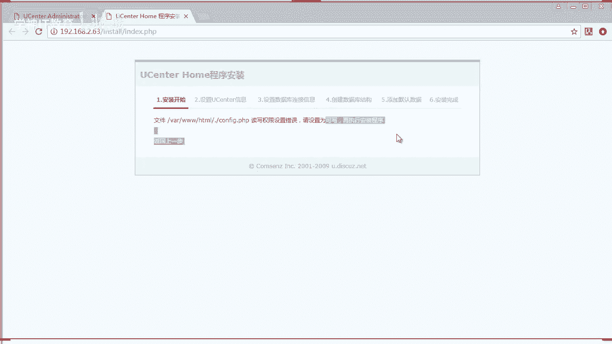

我们再来。那既然说到他没有可写可写权限是吧？来我们给你看一下啊，你会发现这里的那这么多的这些文件，它都是root账号，root用户是吧？虽然说阿帕奇的话有毒，但是有些啊有些文件它需要可写的嘛。

就像刚才这个confiHHP。所以呢我们要把这个改一下前线。但然你可以修改成什么777前线，但是那样的话，前限放的太大了，对不对？那将它改成啊这个阿帕奇能够读写。你看没有？他是不是也可以读写了？是不是？

好，我们再来看。

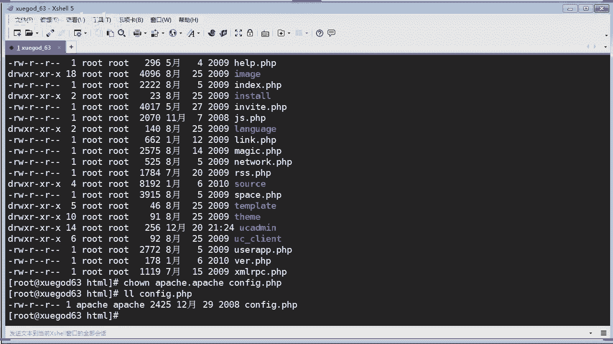

我在刷新。好嘞，看到没有？已经跳过去了，说明刚才我们已经OK了。但是往下去看呢，它这里又会提示一些警告。为什么？你看这里会说到啊，你这个权限的话要读写OK了，检测是OK的。但是下面这些呢检测是不OK的。

你看没有？失败失败，有三个失败，为什么？因为这些文件啊或者是这些目录啊，它需要什么权限啊，需要有读写三的权限所以说我们还得回去对这个权限进行什么进行修改。那总共有。

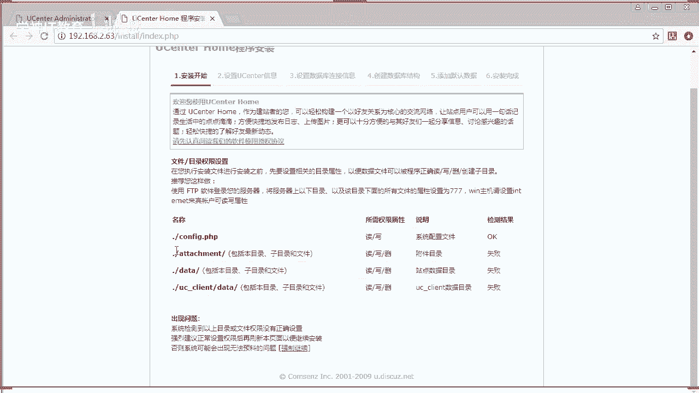

一个目录，两个目录，三个目录，对吧？那。啊，我还是想把它改成是吧，直接改成阿帕奇吧。哪个目录ATT什么什么的这个目录是吧？还有什么呢？date目录对吧？还有1个UC什么什么什么啊。

clean这个目录是吧？OK我们应该使用一个递归的方式啊，递归的方式进行对这个什么？对这些目录进行什么递归授权。O。

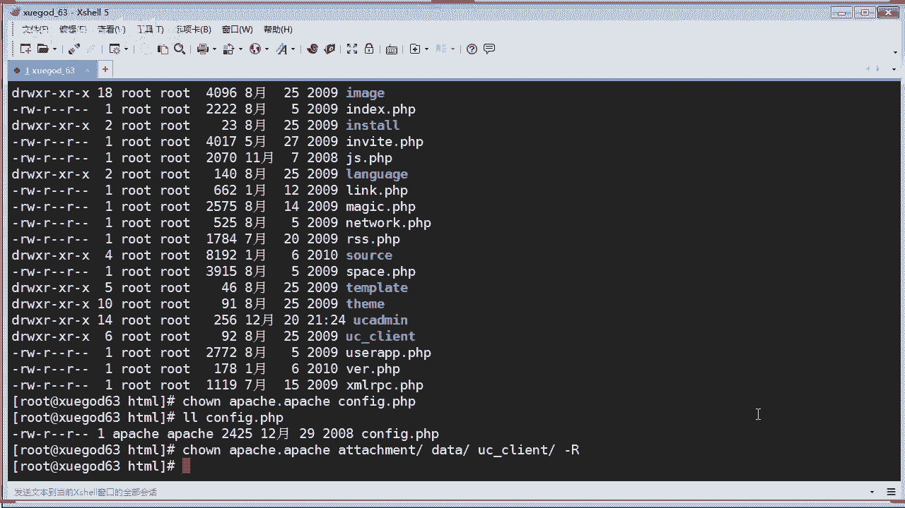

来，我们再刷新一下，看它显示OK还是失败呢？看到没有？这个时候呢全部显示okK啊，恭喜你可以点击下一步了。好，我们点接受协议是吧，开始安装used home。OK这里要输入usent相关参数。

其实啥意思呢？就是要输入你刚才的那个后台，就是用户后台管理中心的地址。懂吗？我们用户后台管理中心地址是哪个？就是这个是吧，我的是192。16802。63UC anymin你们你们用的是哪个地址。

哪个路径，你就选哪个啊，有可能你是跟老师不一样啊，注意你的链接地址。这个就是我的后台的一个地址。明白有？你可以通过把这个copy一下，在这里打开，你看看。哎哦，我应该是用这个。Hey。我打开给你看啊。

我没考到是吧？拷贝一下。这个就是我们的这个。后台地址哎，怎么回事啊？192。168点啊，就是这个嘛，对吧？这个就是我们的后台管理中心，你把这个地址拷过去就可以啊。好，他说输入这个usent创始人密码。

就是刚才我们那个用户后台管理中心那个密码123456啊。说完，然后点提交。OK注册成功是吧？然后点击下一步。好，设置数据库连接信息。啊，这个当然是本机了是吧？因为我们的数据库的话是本地的。

如果你是远城的数据库分离的，那你就写上他的啊远城的数据库IP地址。OK数据库用户名但是root了是吧，密码我们是123456啊。OK123456。数据库的字符集呢啊一般我们使用UTF杠8是吧？

UTF8的字符级，这种我是国际标准是吧？后面我们也会跟你讲mycyclq的字符集啊。数据库名呢数据库名的话，我们依然使用这个什么使用这个cent就可以了哈。我们把这它的这个什么。

把这这里面的这个表也写到这个库里面就行了。我们通过什么区分呢？通过这个表前缀就可以区分出来是吧？刚才是UC杠开头，这里是UCho杠开头，这样的话可以区分出哪些表是属于什么啊前端页面的一个表。

哪些属于后端的表，是不是我们放到同一个库下面就可以了，它本身就不多OK然后点设置完毕。😊，他要进行检测。好，检测完成啊。OK你看添加默认数据就会创建一些默认的表，已经完成。OK那这样的话就已经完成。

最后呢输入一个您在用户中心呃，这个用户名和密码，就是你可以创建一个新的账号，比如我创建一个man是吧？这样的用户，同时呢他会将你这个慢账号呢设置为管理员，就好像你论坛有很多个管理员。

那你是不是要分为好多个版主是吧？很多个版主呢进行管理你的论坛是一样的道理啊，来123456啊，随便然后我们点开通管理员空间啊，这样就可以了。恭喜你啊，这个U的home前端页面已经完成了。来。

我们打开一下前端页面给你看一下啊这里。是吧。这个就是我们装完之后的一个是吧，展示到前端的一页面，是不是类似我们的这个QQ空间啊，或者是博客啊。对不对？O。很方便是吧？那这里啊设置什么什么什么的啊，都有。

还有高级管理是吧？高级管理进入之后呢，它就是什么就是管理员的一些相关管理。你看我输完之后进入平台，你看没有？就相当于我也是管一个这个论坛的管理员是吧？我也可以进行对你的这个站点进行一个配置啊，是吧？

防灌水配置，什么什么配置啊，用户组啊，积分规则等等等等等等啊。OK这样的话就已经装完了，同学们搞定。是啊，想起了炎人网，对吧？炎人网其实跟这个页面就是一样的，对不对？就是一样的啊。对不对？O。学会了吗？

是比较老的页面的对吧？我们最重要的是把它搭建成功啊，这就是我们要干活。那么至于前端页面要给怎么优化好看呢，那个是什么UI和程序员的事情了，懂了吗？OK那接下来我们来讲一下。

就是我们通过阿帕奇来配置多台虚拟机的方式。啊，你们这个你们学过吗？😡，比如啊我就拿刚才我们搭建的这个U森的home来举例子啊，我要配置两个虚拟机，让它访问不同的页面。对不对？其以这个很简单啊来。😊。

我们打开。

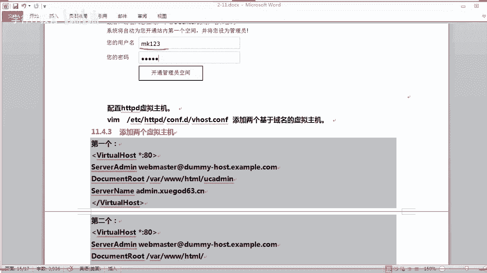

嗱。先退出一下啊。ok。呃，我们要添加一个虚拟机啊，一般的话我们是在哪里去添加？这个阿帕奇下面的话，它分别有呃，你看康f下面是主配置文件，对吧？是有个HVD康。那么这里有个cf点D的目录。

你们有没有观察得到这个cf点D的目录？那么这个目录呢，它一般是用来存放一些，比如像这个虚拟主机啊，还有一些像什么PHPc文件等等其他的一些配置文件可以写到这里。那这个写在这里的东西的话。

它是要通过你的主配置文件来进行调用的。比它要索引啊索引到你这里面的一些配置文件才能够去读出来。明白了吗？我先给你看一下啊呃，看一下这个cuff下面的。HBD。啊，切换到最后面。

你们有没有看到有一有一行这个东西？那有了这行东西的话，才能够索引什么呀？才能够去呃调用你这个目录下面所有以点com为结尾的这些配置文件。看懂了吗？是吧。就相当于它先首先的话。

阿帕奇他先读取的是你的主配置文件，读取主配置文件呢，它会读取你这个。读取这个呢，它就会哦嗷去检索，对吧？检索到哦在你的这个cuff点D下面这个目录，凡是以这个为结尾的是吧？这里有个星号通配付嘛，对吧？

这些所有的配置文件它都要进行读取。这样的话他就能读得到。比如我们现在要创建一个什么虚拟主机也是一样的道理。那么我们可以直接。啊，直接哎。Cve。点D下面啊，那么这里的话本身系统已经带一些木位了，对吧？

像这个欢迎界面啊，什么什么配置是吧，我们可以自己写一个，比如。只要你按照的规则来写就可以了。比如我们写一个Vho点comf。注意你一定要以点com为结尾就可以了，知道没有？同学们。

因为前面人家这里定义了以点com为结尾。那前面这个这个英文单词，你想怎么写，怎么定义都可以。ok。哦，我打错了。好，那这样的话我们来去写一个。吸引主机。学生兄有没有模板了？

其实你可以参考一下其他的一些配置文件的模板，对吧？其实这个很简单，比如我们写一个这个第一胎。第一台这个吸主机啊，然后我们定义它的一个目录。这才是重要啊。

这个呃document rootot主要是定义什么？定义这台信主机的什么呀的网站目录，它的网站目录是在哪里啊？你看我这里定义的是这个用户后台管理中心的目录，有没有看到并不是网站该目录。

前面这个是网那目录，它是在网站该目下面的一个目录，是不是？然后使用edimmin学个63。CN这个域名就能够访问我的后台。是不是很方便？对吧然后呢，我再写第二个信主机。对吧再写一个。

你copy一个改就可以了，是不是啊？然后这里呢我再写一个，这里呢就是访问我的阿帕奇网站该目录。那么使用什么呢？使用这个域名来访问啊，WW3个W点学个263点CN。如果你使用这个域名来访问。

它就是读取这个目录下的代码文件。如果你使用edmin学63来访问，它就是读取这个目录下面的代码文件。懂了吧？好，那。我们就可以保存退出啊，保存退出。然后呢，我们应该去重启一下。啊。

是吧重启一下重启一下你的帕奇啊，然后我们模拟一下，因为我们现在不是真实的这个域名嘛，对吧？你这个域名本身是没有通，没有是真正的域名啊，所以我们通过修改windows的house文件啊。

修改这个windows house文件，windows house文件在哪里啊？这个你们肯定知道是吧？有没有不知道的？

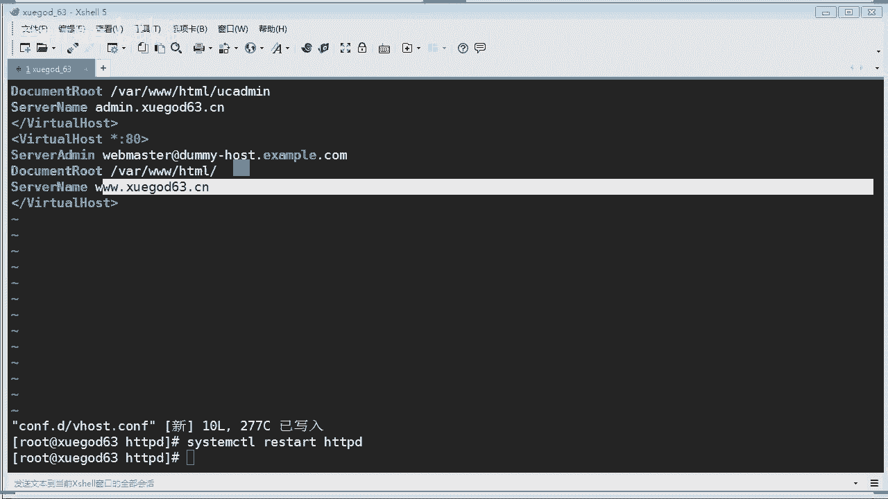

来。对，在C盘下面的windows。C边下面的windows哪里？哪里哪里哪里？好。system是吧，这个sstem32。3下面有一个这个是吧，driver就是这个什么驱动。是吧这个我们录像。

然后到ETCETC下面呢有这个有一个horse，对吧？那么你可以通过使用这个记事本来打开，或者使用其他的一些文本编辑软件也可以打开啊，你像老师这样使用一个编辑软件打开它，对吧？那么这里的话呃。

我就可以定义好什么，定义好什么东西呢？你看啊我就可以改一下啊，这里是之前做实验的，看到没有？

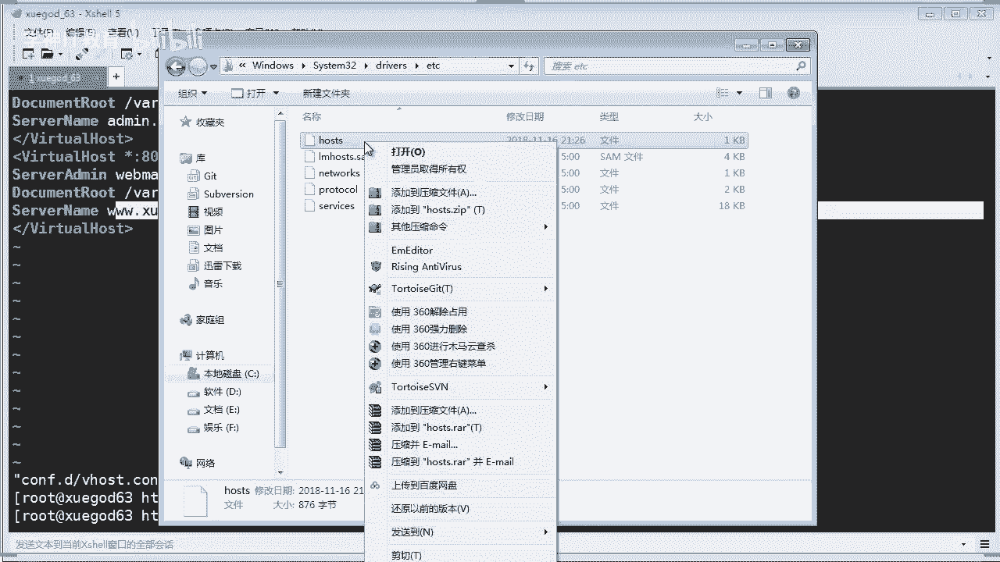

嚟可解嘅。改成edmin点呃，学个。柳三对吧？然后下面是。

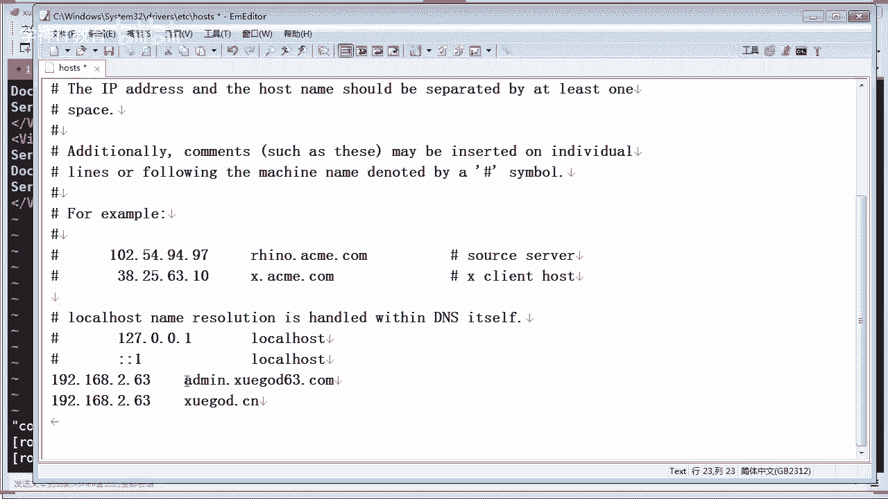

是点com吧，点com还是点CN来，我再看一下哦，是点CN啊，别写错了。

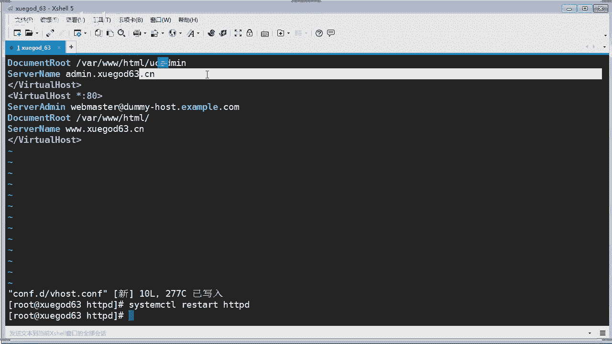

点先啊，O。然后这个也是柳3。但是这个的话，它前面是3个W啊，对不对？WW学高63点CN上面是edmin学63点CN，对吧？那同样都解释到同1个IP地址是吧？因为我们是在同一台机上配置两两个虚拟主机。

然后我们来保存啊保存一下啊，保存保存退休啊。

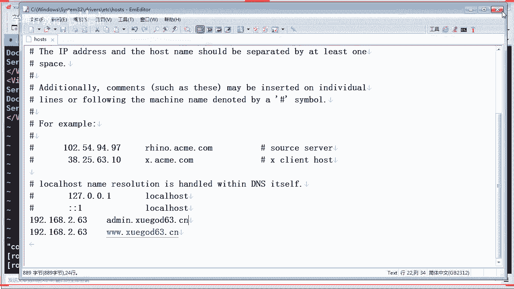

O。那现在就是要见证提子的时候，看能不能访问呢。

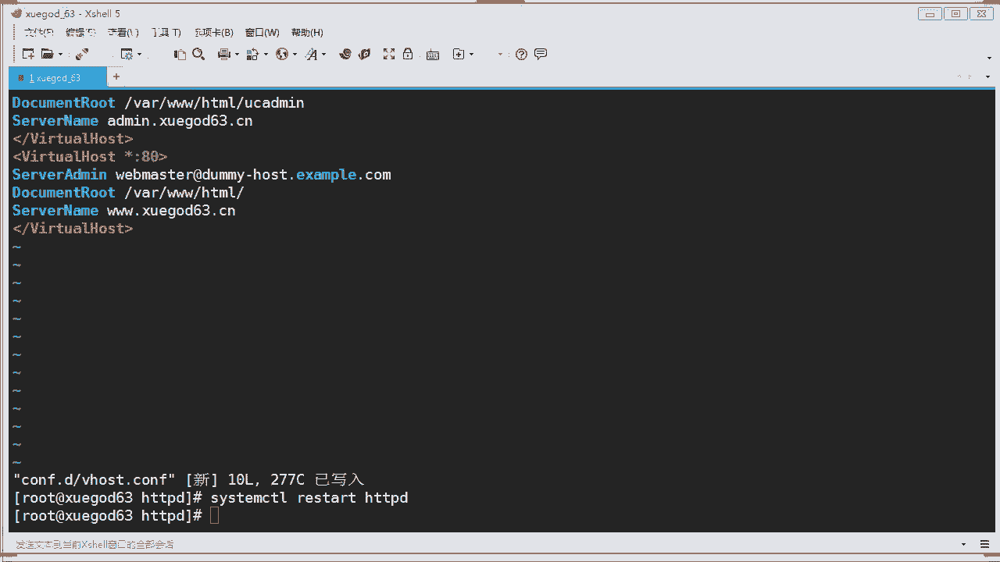

对吧。好，我先把这个这个关了是吧？现在通过域名的方式来访问edmin学高点63。你看没有？😡，大功告成是吧？当你访问an学杠63点CN，它就自动啊自动访问你的后台管理中心是吧？

那如果你访问的是WW点学挂。哎，WP点学个63点CN呢，它就是访问的是前台页面，看到没有？OK这是达到我们目的了吧。😊，一般你们去管理你们，你们公司的后台都是通过什么admin什么什么加上是吧？是不是？

这样的一个场景OK。这在就可以了。对不对？这个就是我们的后台管理中心啦。来登录试一下。这个是啊EVYX。好。有没有问题没有问题，这样我们就可以通过域名的方式来访问了。对吧。Okay， good。

是吧然后你前的页面就是通过3个W的方式进行访问。OK搞定。好，那这种是配置这个新主机是吧？有同学说我可以配置三个新主机吗？可以啊，是吧？那么讲到虚拟主机其实还有很多种配置方法。

之前我不知道你们有没有讲过，比如这里是基于什么基于域名的方式来配置两台讯局。如果要基于端口呢，不同端口可以吗？我们还可以基于什么？基于不同的IP。是吧。基于。这异议。啊，域名这里是域名嘛，对吧？

域名还有什么，还有端口啊，还有什么？IP对吧？可以基于这三种方式来去配你的信息主机，是不是？老师都喜欢用五笔啊，肯定用5笔，5笔打字快呀，是吧？😡，啊，哈哈。😊，O。O。好的。

那么最后的话来讲最后一个这个实验啊，这个是干什么用的啊？其实这个是新增加的一个知识点，就是我们通过这个LYC啊，对你这个新搭建的这个网站进行D的攻击，其实就相当于做一个测试。

那么后面我们还教同学怎么样使用这个比如像ABAB压力测试工具啊，还有这个等压力测试工具啊，是吧？后面还跟你分享其他的一些测试工具啊，这里主要讲一下这个这个东西呢是现成的啊，这个东西不难啊，是吧？

以前其实我们刚才以前啊我们呃刚入行做IT的时候呢，经常喜欢去搞一些什么小黑客的工具呢，去专门去测试一下，攻击别人的网站是吧，看有没有问题是吧？好，显得自己特别牛逼的样子是吧？我觉得呃很多年前。

我有这样的一个做法。对啊，不用说话，老师已经心领了啊。很多年前你是不是呃玩过这Ddos的工具啊？是不是以前我们还用那个那个QQ的年代是吧？当然现在也用QQ啊，就以前好像类似于这个ICQ的那种是吧？

比较刚出来那时候。😊，那个时候呢，我就去浏览那些什么黑客网站啊，去找那些相关的工具。哎，找出来呢哎测试一下，对吧？玩玩一下别人的网站，看一下哎会怎么样子啊，但是我也感觉好像不出来有什么变化。😊。

OK那么这个东西呢，我们主要是用来做什么东西呢？那样这里的话我已经解压出来了啊，解压出来了。嗯，我看看我这个在哪里啊。C盘。应该在这里。啊，我这里有一个。我解压出来呢，它就是这个目录，你们看到吗？😡。

你们可以去这个工具我已经上传给你们了啊，你们去群共享一下载，然后解压出来就行了。我去这个里还有个MK的QQ。我去。啊。是吧MK的QQ都在这里啊。😊，那。好，那么我们用这个工具来玩一玩，好不好？

那你直接它这个是一个绿色的一个软件是吧？直接打开它。

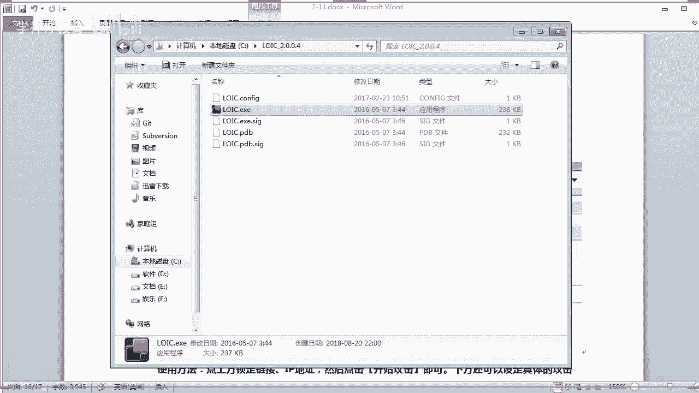

你看打开之后呢，你就会看到这样的一个页面是吧？有没有一点黑客的感觉啊。那这里的话你直接写上呃这个网址就可以进行工具啊。那这里的话会相关的一些参数，你也可以进行调整一下，是吧？O。😊，好。

比如我们这里就通过IP的方式吧啊，IP也行啊，域名也也行是吧？都可以啊，192。168。点2。63。是不是啊？那如果攻击的话，我我如果我现在攻击，我怕等一下课堂的断掉，为什么呢？

因为我这个虚拟机是本地的啊，是吧？我应该找一台远程的虚拟机来攻击的话，会好一点啊，应该不会吧，还能扛得住吧。我们小一点是吧，小范围攻击看一下啊，来我对它这个现态狙。呃，这里讲一下。

这里说啊这个是进行一个什么锁定是吧？比如把这个就是锁定要攻击这个192。1682。63，对不对？然后呢，我们可以攻击的话，这里也可以调整。比如什么协议，比如你TCP协议或者是HTP协议。

你这里可以调的啊，哪个端口但是80端口的是吧？是不是？然后这里的话有一个县城，这个是不是县城，你看得懂吗？你要用几个线程，比如我们用2十个县场，20个线城。😡，来进行攻击。好不好？O。来，我们来试试啊。

是吧他可以对这个比如啊端口啊、协议啊，还有线程啊、攻击的速度啊等等这些进行一个什么呀一个一个参数调整是吧？你在这里可以调整，然后你旦点这个开始了哇，同学们一点这个就开始。来，我试一下啊呃，我这样子啊。

😊，嗯，我看怎么看。呃，这样子啊。し。啊，这里我给你看一下啊，然后我开始来进行攻击。好，已经在攻击了。同学们看看这里。你看有没有这个系统的相关的这个数据马上就上来了，你们有没有看到？

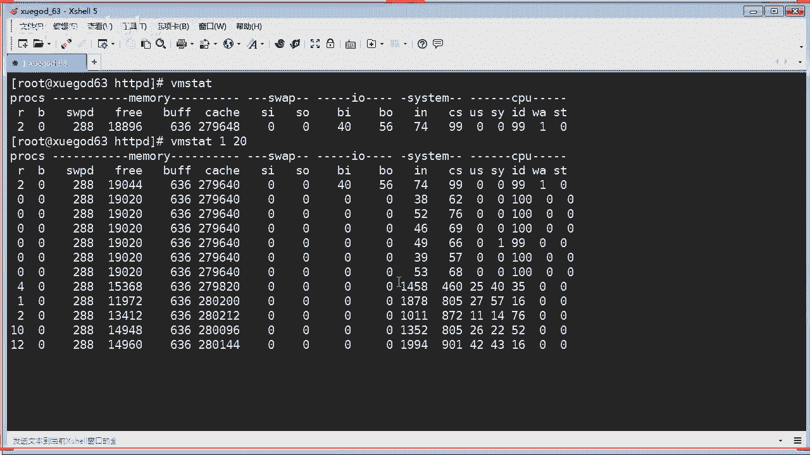

是吧啊，我这里的话是显示二十行而已是吧，我再显示多一点。你看因为现在的话他还在进行一个啊攻击的一个一个一个一个状态。你看现在还是在攻击啊，同学们看到没有？这里会有一个什么进行攻击的一个数据显示。

那么这里的话会看到这个压力非常的大啊，虽然说这个工具可能也没还没用是吧，后面会给你们讲的啊，呃，当然你可以通过呃什么呀？这个netnet。是吧进行一个查看。啊，过滤一下。比如过滤一下80端口是吧。

进行一个，你看有多少。80。哎，这么少。ANT。好，我用这个来进行一个。哎，这里现在这么少吗？哦，现在已经。😊，还在攻击啊。但是我看到的这个现场还是这么少，奇怪啊。你看有很多的一些建立链接是吧。

看到没有？很多建立链接。是不是？看没有？808080啊，它是通过什么呀？其实都是通过你这个客户端随机端口，然后来对你的这个80端口进行一个什么一个访问。但是他进行访问呢，D dos的原理是什么？

D dos他就是那个三次握手啊，他进行访问，但是呢他又不回应。那么导致他有很多的现程进行什么进行访问，那其他真正的客户端就不能访问进来。对不对？这样的话网站就会挂掉。真正想访问的人呢访问不了。

其实他的原理就是这样子是吧？O。因为我们这里用了1个20个现程，你看到没有？这里有没有20个现程，有吧。是不是？O。啊，我现在用20个线程的话，这里还没有断掉。如果我我怕用大一点的话，有可能断掉。

你们来测试一下好不好？没看到IP怎么没看到IP这个不是吗？这就是我的windows客户端的IP啊。是吧。用50个现程，我怕等一下课堂就断开了。同学。是吧。啊，所以我不敢用太大，你们的话里们可以试试啊。

对不对？你可以搞大一点。ok。这个工具还算延迟是吧？算是对，其实我教你们这个工具呢就是用来做压力测试的，不是用来攻击别人啊。你要知道这个工具的确是可以攻击别人的D dos的话，你一旦把它贴上去的话，呃。

他会对这个网站进行一个是吧？D dos攻击，这样的话会导致别人的服务器可能会荡掉。如果他的配置不是很高，或者是他没有防御的情况下，明白吗？

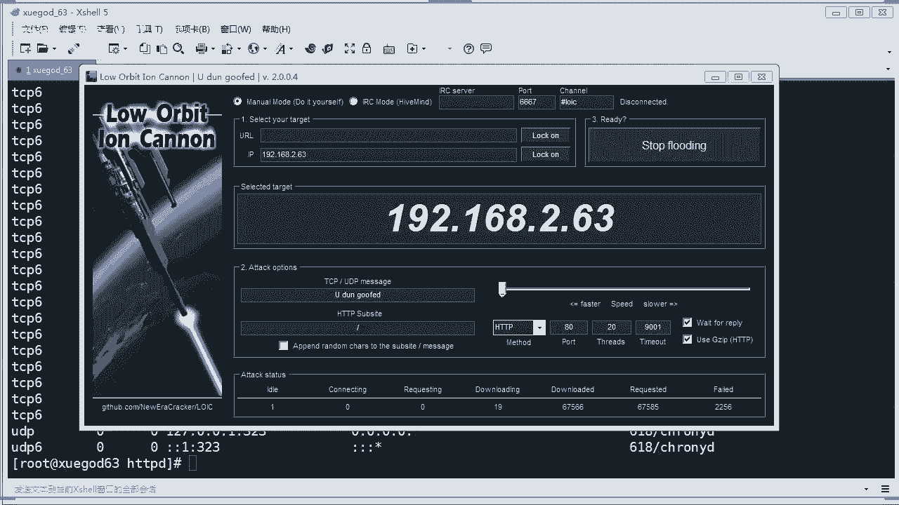

咱们不要做这种犯法的事情是吧？对不对？这可是犯法的啊，所以说。啊，小范围测试下没问题是吧？有同学说我攻击百度，你说可不可以？😡，可以，你觉得你攻击百度能攻得下吗？百度的反也非常牛逼啊。

你想对他进行攻击是吧？其实没那么容易。是吧比如你用。啊。我用大一点。是吧。你你说你攻击的话，现在百度能正常访问吗？肯定能正常访问啊，你没那么容易能够把百度攻下来的啊，放心好了，是不是你看没问题吧。

是不是OK。

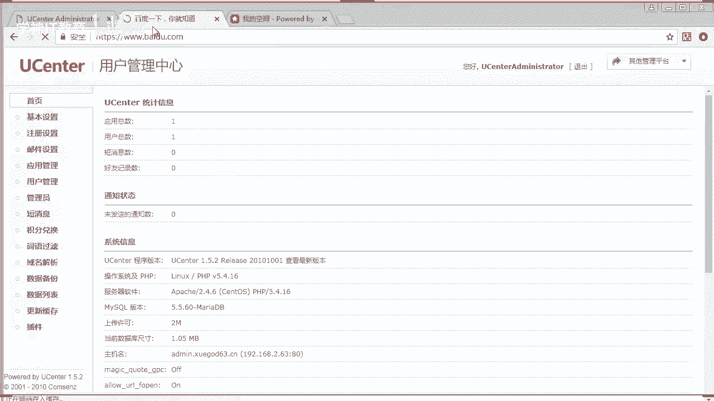

那这个小这么小的一些些D倒死攻击对他完全不在话下啊，是不是？

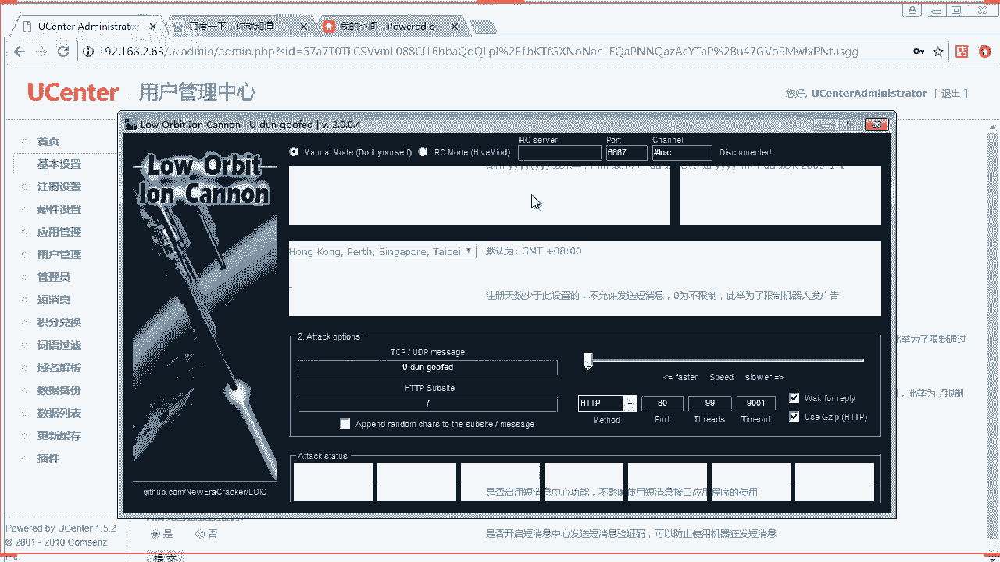

O。明天麦老师就备起喝茶了，是吧？😊，嗯。我们只是做一个简单的测试啊。好。你看我这里的话呃，进息攻击，这里的话使用的这个资源也是非常高的。你们有没有看到？能看到我这个任务管理器吗？你看没有？

这个时候呢有可能就卡掉了。我不知道你们现在听我的声音有没有卡掉。啊，接近要卡要崩的情况了。明白吧。OK我还是赶紧赶紧把它停掉吧。因为我使用太多的线程了，你看到没有？因为它不单只是要耗用你呃对端是吧。

还耗耗用你本机的线程。因为你要创建那么多的模拟客户端进行一个攻击啊。

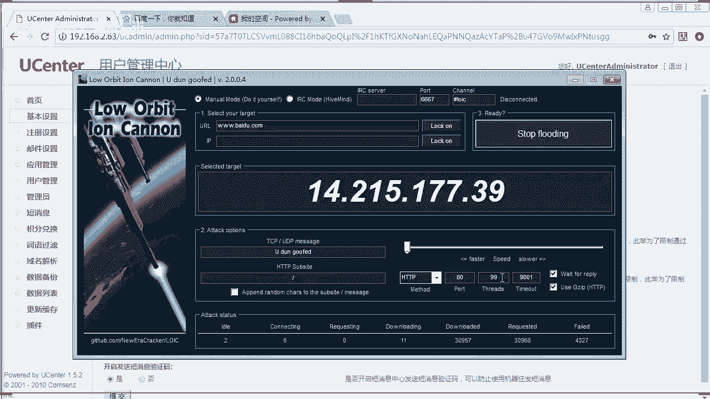

是吧。ok 先。啊，我把它关掉了啊，要不然就卡死掉了啊。来，我们再回到笔记，这里给你讲一讲啊。😊。

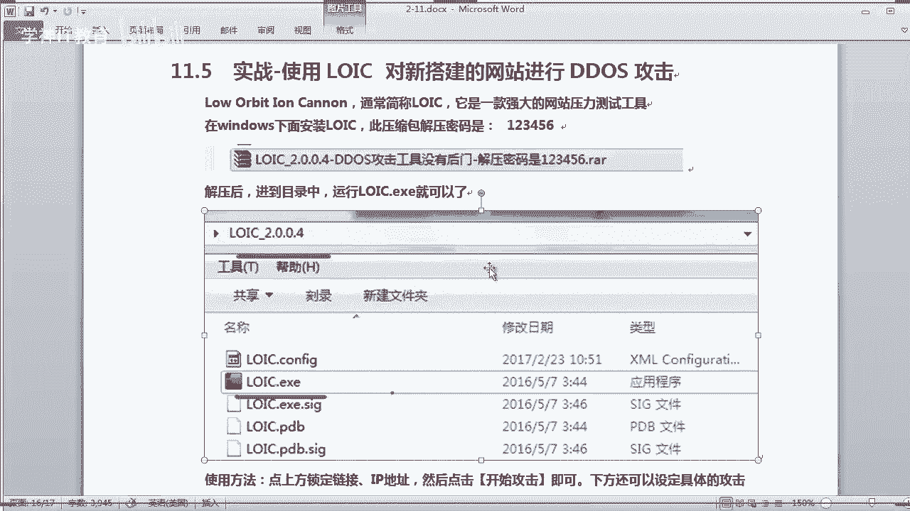

呃，我们用这个东西最大的作用是什么呢？可以测试你新安装好的这个网站到底能去到多大的一个压力是吧？你可以逐渐的对你的这个这个这个攻击的数量进行增加，要进行测试，看能不能扛得住是吧？

要看你这个CPU的占用资源，比如我这里使用你当然你可以使用这个top的命令，可以看一下你CPU能不能扛得住是吧？比如这里攻击使用99%的线程进行攻击的话，哎，你看这个还是可以扛得住是吧？

还是可以扛得住CPU使用大概是24%还不是很高是吧？那么这么说明你的配置还是蛮高。如果你配置低的话，有可能扛不住就死掉了。

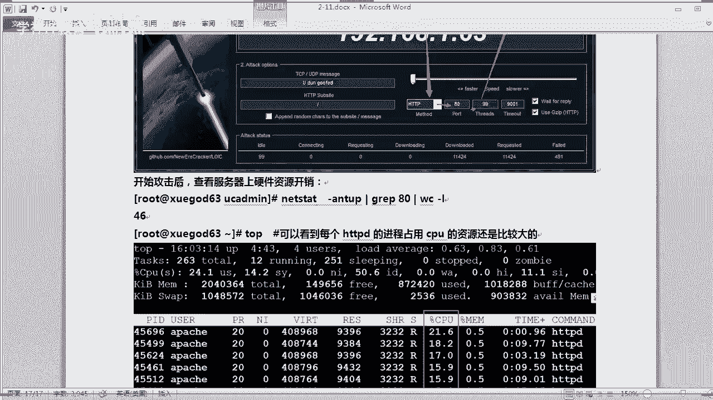

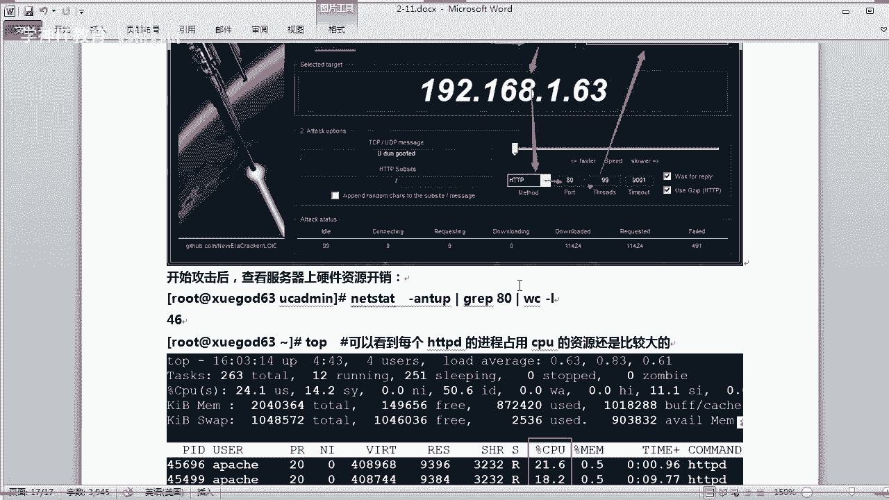

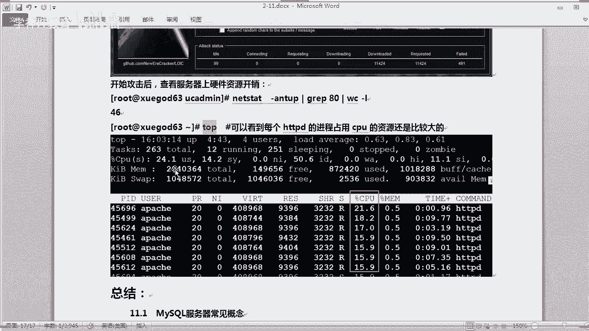

对不对？我们只是做这个测试来呃看一下你的网站的压力能够到达呃什么样的一个地步。

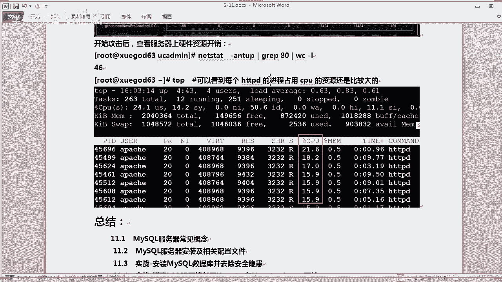

OK。啊，后面的话我们还会给你讲，像这个ABAB工具，你们用过吗？是吧，AB工具。还有其他的一些啊网站测试工具啊，后面我们也讲一下。好吧。OK你的黑的是吧啊。😊，你们能听到吗？肯定能听到是吧？

不会卡掉了吧，同学们。😡，有同学说别人的没有功效，把自己的电脑搞挂了。😊，😀哈。😊，听不见了吗？能听见的同学给我敲个一，我看一下。不会吧。正常是吧，那说明我这边呢我已经挂掉了，不不是我我不是我挂掉。😡。

说错了啊，我这边是正常的啦。😊，我已经停掉了那个攻击攻击了啊，我已经停止掉了啊，把进程都已经干掉了啊。😊，啊。嗯，还是那么有磁性啊好O好，那么今天的内容的话，我们就讲到这里啊，给你们做一个总结啊。

今天我们讲了什么东西呢？认识了什么是mycyclco对吧？mycycl的一些最基本的一些配置，是吧？然后我们怎么样使用s这个安全初始化，然后搭建了一个叫我们叫什么环境是吧？也叫LAMP的环境。

然后部署了这个什么个研网站，个研网站，最后还讲了使用这个工具是吧？这个Ddos的工具进行一个攻击的压力测试。😊。

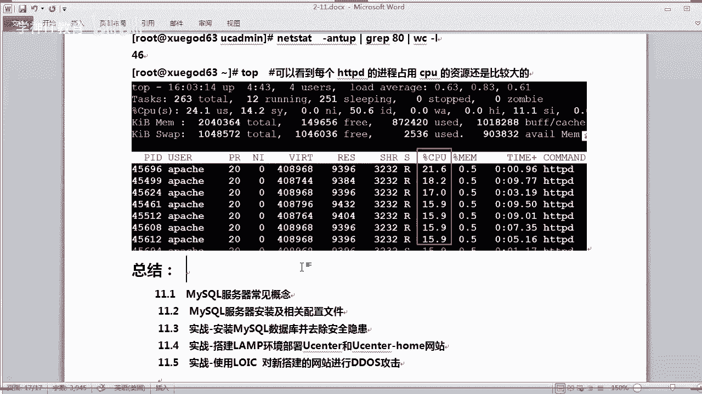

ok。😊，那今天的话主要是讲了这些内容啊。很简单是吧，很简单。对啊，那么明天啊先跟你们预告一下，明天的话我们就开始来真正的进入讲这个。My cycle。啊，真正的是讲mycycle啊。

那么明天你要准备什么呢？一样式啊，准备一台啊最小化安装的一个系统啊，干净的系统，你要配置好什么呢？配置好网络亚母源啊，本地源这些东西都要配好，听清楚啊。我现在就跟你先打好预防针啊。

这样的话你后期跟老师的课程呢，你有可能就可以跟着上课堂是吧？敲敲命令。因为mycycl这个东西的话，你要多敲命令啊，多敲命令你才能记得住。明天会先讲什么东西，明天会给你们先讲mycycl的最基础的东西。

就是基础语句。啊，明天会讲这个mycyclcle的基础语句是吧？先来验识一下我们一些最常用基础的一些cyclcle。O。然后。后天的话啊这里再预告一下。后天的话我们要讲什么呢？

后天我们就是在你这个基础上是吧，再进行进阶是吧？升级一下，把这个语句升级一下，再升又讲。是吧那么总共讲mycyclcle的话应该是有。

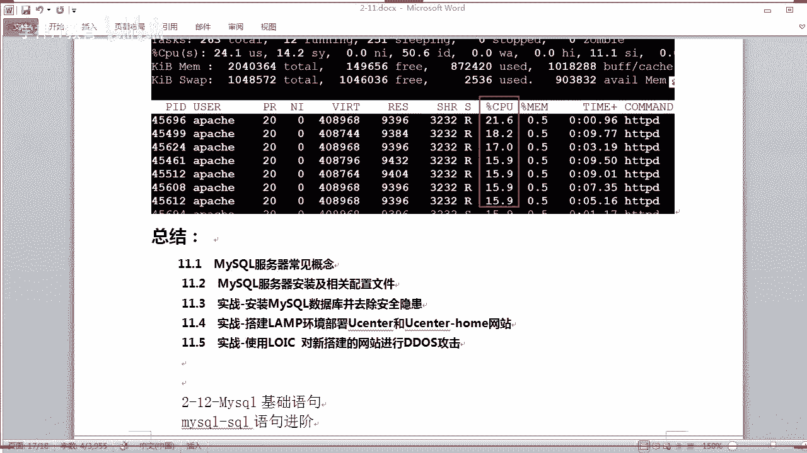

我看一下有有有多少节课。还是蛮多的哦。

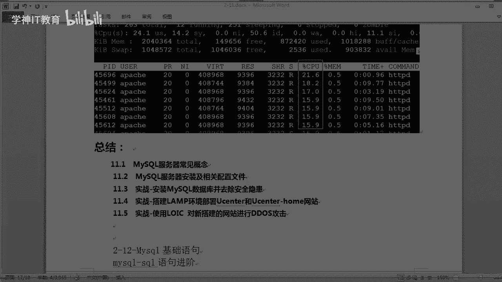

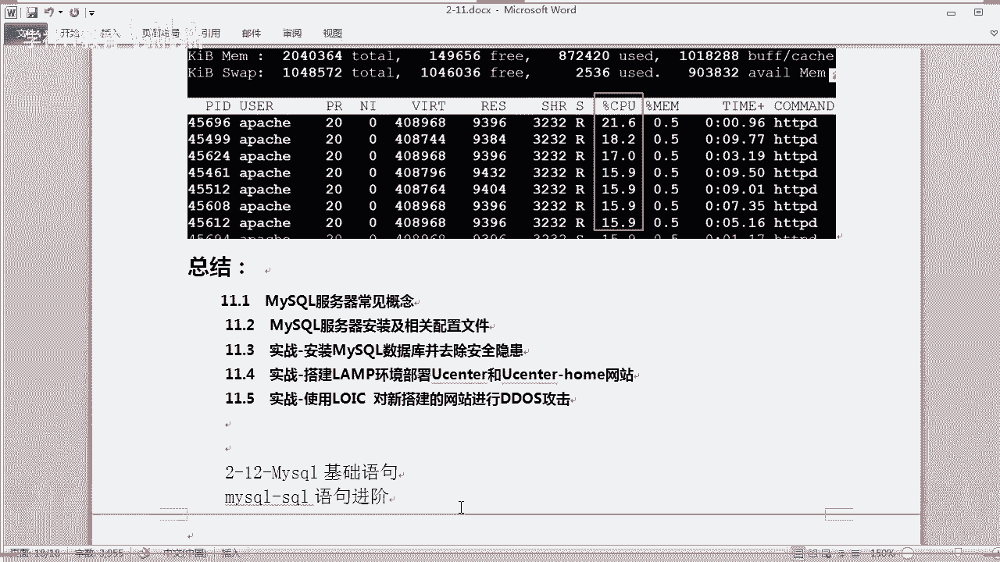

那。你看。你们要讲的这个mas课程是吧？1234567891011。啊，十1啊还有后面的原码变译啊，单单讲my的话，就有讲十一节课啊，所以你们好好认真听。如果你真的是要把mycyclcle学好啊。

你就好好啊听啊，好好听啊，接下来的十几节课好不好？把mycle写好是非常有用的啊。呃，mycycl学好呢，你以后的话，不单只说你要去你去做一个运维工程师。那如果你以后想这个往数据库的方向发展也是可以的。

比如专门做数据库的运维，做DBA是吧？当然做DBA的话，你学完这些东西呢，其实还是不够的，是吧？你还要自己再深化一下，才可以真正的做1个DBA。但是你学完这里的这些my课程之后呢。

你基本上做一个数据库的基本维护运维是没有问题的。ok。是吧这才是第二阶段了是吧？第三阶段还没还还更多呢哈是吧？😊，唉。okK行，那么你们准备一下啊。那么明天我们讲课的话，我看看啊。

明天讲课我要跟教你们怎么样去安装一个mycycle。😊，安装一个mycycle。5。7的版本啊，你可以装5。7。24的版本啊。O。😊，这样子安装的过程的话啊呃，我先把这个安装过程。发出来给你们。

让你们来自行安装一下，好不好？让你们看一下我的这个其实很简单啊。啊。怎么样去安装这个m5。7啊？你你明天啊同学们明天上课之前把这个m5。7。24版本装好。为什么接下来的课程我都是要基于m5。

7的版本作为基础来讲我们的这些me。所以你要把这个安装好好不好？啊，那么今天你安装了这个merB的话，你把它卸载掉，卸载到旧版本的merB安装上m5。7。怎么安装啊，这里有。啊，这里有。那我就不细讲了。

我让你们来自己尝试一下安装，看一下碰到一些什么问题。碰到问题的话，你可以看一下怎么样去解决，好不好？其实很简单。已经安装好是吧，老学员肯定没有问题啊，老学员肯定没问题，安装这个东西还是蛮简单的。😊。

对不对？好，那今天的课程的话，我们就讲到这里啊，十0点半刚刚好啊，没有拖堂是吧？那么后面的话讲mycyclcle的内容就比较多了，可能就会存在拖堂。先给你们打个预防针啊啊，别怪老师拖堂。

因为知识点太多了，给你们讲多点东西啊，不要怪我好不好？啊，所以跟你们说一下啊，因为以前有些班级有些同学他不愿意拖堂的啊，是吧？所以我这里的话先给你们说一下啊。😊，O。哎。啊。

咱们班爱学习的同学还是蛮多的是吧？不错不错啊，我最喜欢这样的学生，因为老师讲的多，其实你们学的就多，真的啊，你老师讲多一点知识点给你们不好吗？其实非常好嗯，不错啊，多学点东西肯定是有好处的。

你们现在就是要好好多学OK。😊，啊，有班上，其实老师也有班上啊，所以大家都辛苦是吧？我也不想拖疼啊。好，那。10点32分啊，同学们咱们就可以下课了，好不好？

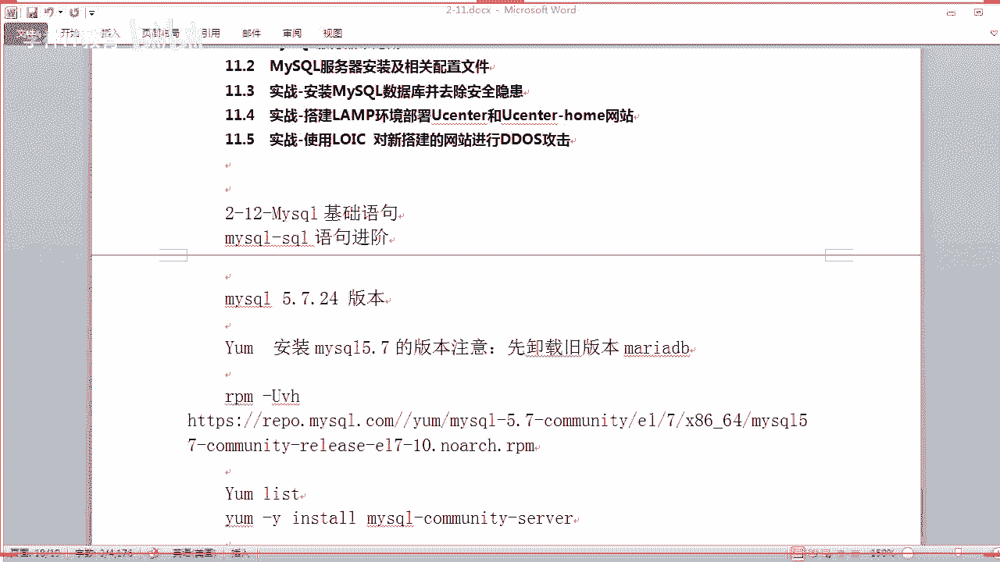