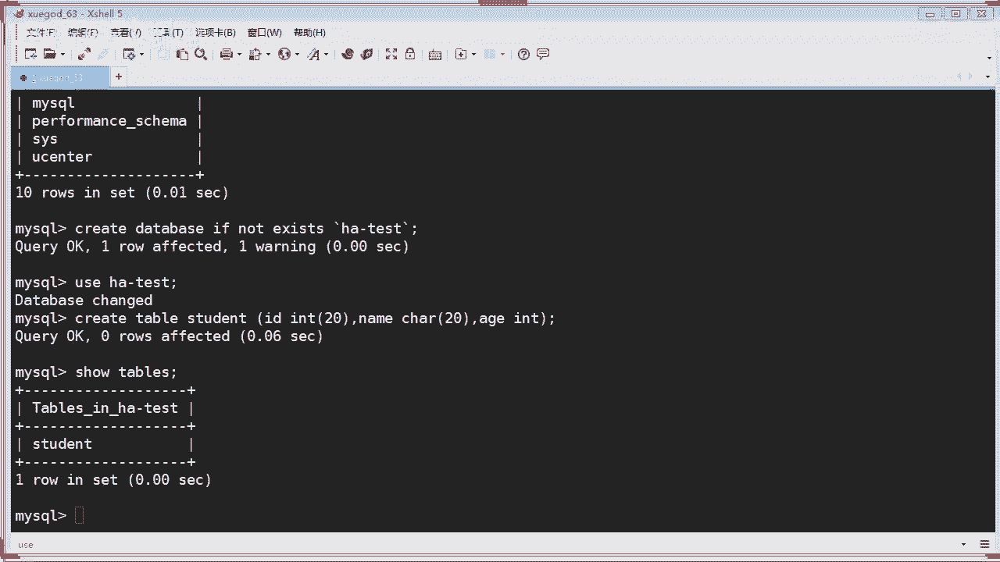
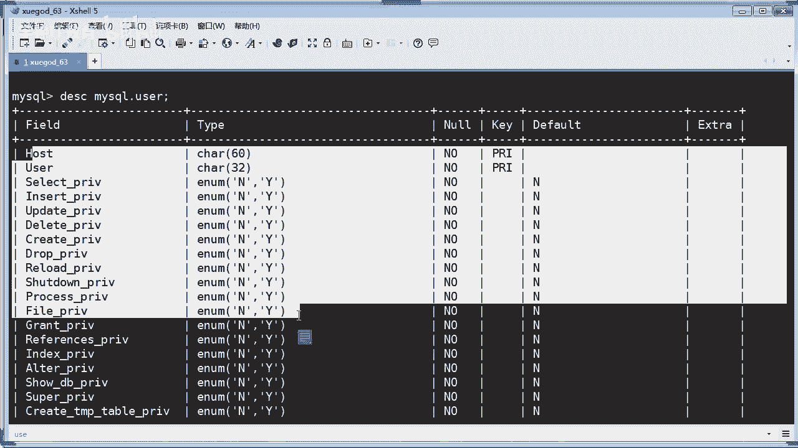
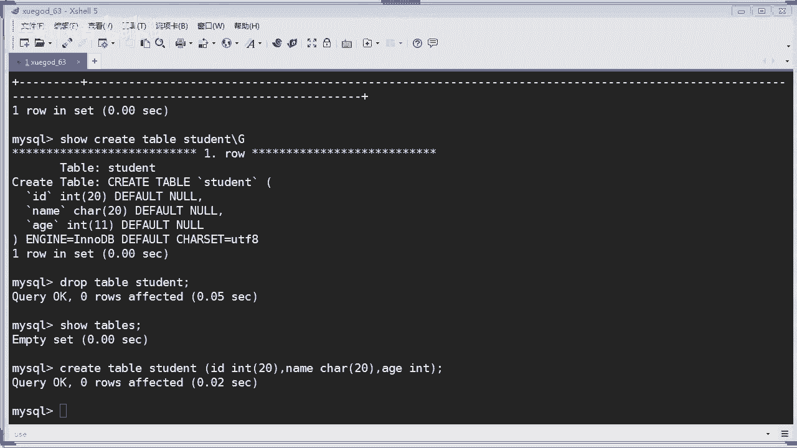

# Linux／Linux运维／RHCE／红帽认证／云计算／Linux资料／Linux教程--Mysql基础语句01 - P1：Mysql基础语句01 - 学神科技 - BV1jt4y1X7qq

我讲什么呢啊？首先的话是讲mycycl的基础啊，讲基础的东西来，首先我们会讲到这个cyclcle啊，什么是cyclcle是吧？那么scle语句的结构啊，还有mycyclcle的一些常用语句啊，啊。

还有实战讲这个mycycl升级到5。7的版本。其实这个的话，昨天我已经发给你们了是吧？怎么样去安装1个5。7的版本啊，这后面的话也会讲一下，但是你们肯定要你们提前装好啊，提前装好。

你才能跟得上我的这个节奏啊O。😊，那么讲到数据库呢，其实我们最常用就是我们能够触摸得到的最最啊最接地气的东西是什么？是cyclcle是吧？就是scle语句，你们要写scle语句，对不对？

那首先我们看一下scle是什么东西啊。结构化查询语言看到没有？结构化查询语言啊，它简称为scle啊，你可以看一下，这个是它的全拼，对吧？它是一种特殊目的的编程语言啊。

同学们不要以为你写PHP你写java，你写python是吧？这些才是什么才是一种语言啊，scle它也是一种编程语言，同学们注意啊是吧？那么有数据库的开发工程师啊，也有什么各种语言的开发工程师啊。

那么scle就是一种重要的是吧？数据库的啊开发语言。啊，scle是一种啊数据库查询和程序设计的语言，看到没有？查询和程序设计的语言啊，那它是相对数据库来设计来说的啊。

用于存储数据以及查询更新和管理关系型数据库系统，同时也是数据库啊脚本文件的扩展名，对吧？一般我们写一个scle文件。那么的扩展名。一般我们是以点scle为结尾，是吧？好，从上可以看出来。

我们这个数据库相关的工作啊岗位大概有两种啊。一般的话我们有DBD是吧？DBA和DBDDBA的话，你们肯定听得多了，是吧？DBA就是数据库管理员啊，数据库管理员。

那么DBA的话肯定是对于数据库是非常的比较啊，不能说很精通，但是相对来说是比较精通的对吧？DBD是什么东西？DBD是数据库开发人员啊。那么如果是一个比较完善的公司的话，它应该会有有什么呀？

有这个哔哩B是吧，还有DBA。对不对？他会有数据库开发人员啊。那么很多的公司的话，比如像一些中小企业的可能的话，就是呃所有的这些cyclcle啊，都是由什么由程序开发啊，由程序开发已经代劳了。

就说你你会写程序，你也要会写cyclcle。对不对？是吧。OK那么scle的话是1986年10月，由美国国家标准局啊通过数据库语言啊，美国看到没有？它是美国标准啊。

接着国际标准化组织ISO颁布了scle的正式国际标准。也就是说scle的话，它是由什么是由美国来制定这个标准的。你想想，如果你要制定一个行业的标准是吧？由某个国家来制定是吧？比如他出大头。

那基本上都是他来主导了，是不是？那没办法，咱们中国嗯总的这个技术来说的话，是以前是比别人落后个几十年的，是不是？那么现在的话我们慢慢才赶上来。是不是啊？所以说你像现在的华为5G。

如果是由我们中国华为来制定的话那我们就有话语权了，是不是以后你就要给我们中国交专利费了，是不是？OK好，扯眼了是吧？1989年4月ISO提出了具有完整性特征的scle89标准。

啊92年10月呢又公布了scle92标准，听见吗？是吧。基本上是由美国佬来主导制定这个scle的标准啊，那么常见的数据库软件名称啊，包括DB two啊 orle啊是吧？还有这个mycycl啊。

cyclcle cycle啊等等啊，其实数据库有很多是吧？数据库有很多，包括阿里云现在也是开发一些它特定的一些呃数据库，像什么Hb啊等等是吧？啊，还有啊这个基于各种的数据库开发的这个RDS的等等啊。

那么讲到scle的话，常见的scle语句有哪些啊？是nn的话就是查询是吧？也就是我们的读操作的这种语句，sniner呢就是插入啊delete就是删除啊，up date就更新啊，其实最常用的话就是。

增三改茶，你们常听到的，别人说曾三改茶是吧，增三改茶啊，对，增三改茶都在这里了。啊，录屏了啊，那么呃数据库啊它是一个有组织啊，具体呃根据具体的这个标准分类的一个数据集合，也所谓的数据库数据库。

那肯定里面要存数据的，是吧？有了庞大的数据呢，它我们才叫它一个库，什么库，它是一个仓库，只不过是是一个数据的仓库。对不对？那就比如像你的档案库档档案柜一样是吧？档案柜就相于相当于什么？

相当于数据库的服务器啊，数据服务器呢，它就是硬件了，对吧？抽屉呢就相当于数据库，那么文件呢就像就相当于表，对吧？因为文件你要放在抽屉里面的嘛，对不对？那表是不是要放在数据库里面，对不对？

文件中啊文件里面的内容就是每条信息啊，那些记录的内容是吧？就相当于你数据库里面的这些啊记录行是吧？行记录。OK。其实很好理解啊。来，我们看一下这个scle语句的结构啊，你首先你要学好这个。数据库网。

你首先要了解scle的这个结构到底它是怎么样去组成的。有哪些语言啊，同学们这个面试的话会问到你啊，面试的时候呢会问到你是吧？啊，面试官会问你啊，什么是呃这个数据查询语言。你能说出一种数据查询语言来吗？

啊，snide就是查询语言，对不对？能不能说出来啊，来，我们看一下有几大分类啊，12。3456是吧，来，我们看一下啊。那首先第一个是数据查询语言啊，也叫DQL是吧？DQL啊。

那其雨句呢也称为数据检索语句啊，用于从表中获得数据，确定数据库怎样在这个应用程序里面去啊展示出来。保留的这个字关键字是sn啊，是DQ1啊，也就是DQ语言啊，是吧？

也是所有cyclcle用的最多的一个动词啊。是不是室内？那么其他的DQL常用的保留关键字，还有一些其他什么像we啊这个or bary等等啊，这些的话都属于什么，都属于啊DQL言就是数据查询语言。注意啊。

同学们面试的问你啊，什么叫数据查询语言，你能回答吗？那你举例哪些是属于数据查询言，你起码能说得出sn是吧？增三改查啊，查询对不对？OK那么这个查询语言呢，它一般会以其他类型的scle语句一起使用是吧？

会跟其他的一些啊语言一起使用啊。那第二种语言就是数据操作语言啊，数据操作语言呢，我们简称它为DML啊DM语言，看清楚啊，DM语言是吧？这个是它的一个全称啊，其语句包括动词，像什么呀？

N third updateate delete是吧。其实很难理解，这个是插入啊，这是更新啊，这是删除是吧？就是什么呀？增删改对吧？增删改啊，他们分别用于添加修改和删除表中的行。

也就是删除表中的一些记录或者是添加记录啊，添加内容是不是也称作为动作查询语言啊，OK。一般啊我们叫DM的语言啊，数据操作语啊，看一下。第三种的话是事物处理语言。事物处理语言呢。

它其实跟这个笑的有点类似啊，它是由多条的scle语句组成的一个整体啊，比如你要写一个事物是吧？啊，写一个一个呃比如存储过程等等啊，它的语句啊它的语句能够确保被DM语句影响的表所有的行及时得以更新啊。

什么叫被DMD是什么？数据操作语言是吧？就是它要被这些数据操作的语句影响的表得以更新是吧？就是数据事物处理语言啊OK。啊，我们叫TPLTPL其实这种的话啊，可能作为呃这个面试考点的话，可能问的比较少。

一般的话问你DM语言是吧？DM语言。啊，还有这个呃数据查询人。O。那有哪些呢？像这个begin是吧啊，comit robot等等这些语句啊，就是属于事物处理言啊。后面我们也会讲到关于事物啊存储过程啊。

第四种是数据控制源DCL的。数据控制源是什么东西呢？你首先看一下哪些语句，这样有便于你啊这个记忆啊。那么它语句可以通过像这个grade啊，这个revo获得许可或者是回收许可，其实是授权。

有没有发现授权是吧？确定单个用户和用户组啊对数据库对象的一个访问。某些RDBMS还记得什么叫RDBMS吗数据库管理系统是吧？关系型数据库管理系统还记不记得可用于啊这样这个gradeade是吧，revo。

这种控制对表或者单列的一些访问权限啊。一些数据语言的话，你可以理解为它就是一些比如授权啊、控制啊等等这些操作的依据啊。啊，第五个是数据定义语言DDL，我们叫DDL啊，其语句包括动词，像这个c。

那么这个可是重点啊，我给你们划重点啊，一般言考的重点是什么呢？数据查询语言。明白没有？还有呢数据操作语言啊，然后呢还有这个数据定义言啊，这些是重点啊。DDLDDL它会用什么呀？像c。

readly是什么呀？创建是吧，还有job。😡，停我们是用的还是蛮多的，像snsn下来之后呢，估计就话这种就用的比较多了。要创建是吧？创建数据定义嘛，在数据库中创建新表或者是删除表。

你就会用到什么呀create table是吧？还有jock table。对不对？那么比如为表去修改一些东西啊，外表加入索引呢或者是修改字段呢，你就可能会也会用到。啊，DD1的话包括许多蚁言啊。

以这个数据库目录中所获得的数据有关的保留啊，保留关键字它也是啊动作查询的一部分啊。OK那最后一个话是第六第六个啊指针控制源。这个的话，一般啊如果你是做一个数据库开发的话，那么这个的话你肯定要掌握了是吧？

像这种啊它可以像这个develop是吧？这fsh into啊update啊，还有这等等这些是用来定义一些比如声明变量啊，游标啊等等这些操作就会用到这种啊指针控制语言。好吧。好，那。

我们说了那么多的这个关于这个cyclcle语句的结构是吧？它包含有6个部分。O。有人问老师，我这些东西要死记硬背吗？不用啊，你千万不要去死记硬背。你也首先要理解它，把它理解什么叫数据控制源就可以了。

对吧？你说出来哪些数据控源啊，要这样去记。如果你死记它的话，你可能过几天就会忘了，不要这样去做啊。咱们教你去学这个mys，千万不要去死记。你最重要是理解什么，理解它的原理，怎么样去操作是吧？

它是怎么样来龙去脉，这才是重点啊OK。好，往下去看啊。mycycl的语句啊，那这里会讲到一些啊。😊，比较常用的一些语句啊。比如我们查看数据库是用什么？查看数据库是使用这个show database。啊。

昨天我们也用过是吧？OK。嗯，这里的话笔记这里显示是MB的啊，那我们是基于mac5。7来啊授课啊，这个的话你不用不用关心它啊，看到没有？这里只是告诉你们啊，这个是看出来啊，看得出来。

如果你是通过亚么安装的情况下呢，它实时是安装什么呀，安装MB是吧？MB三装是其中自带的MDB版本是5。5。56啊，是基于m5。5的版本开发的啊，OK。查看数据库。

就说你可以查看一下当前这个实例下面有多少个库啊，比如这个informki，还有mycyclical是吧？还有这个usent，这是昨天我们的啊，但是昨天那个我已经抹掉了啊，OK。那么MDB的话。

它有一个好处是你又到某个库下的，他可以看到它有一个什么中括号括起来，就说正在操作这个数据库，你们有没有发现它有这样的一个，其实它也算是一个优点，知道你正在操作哪个数据库。对不对？

但是mycyclcle呢，它并没有，是不是mycycl呢，它并没有。因为我发现是吧，那如果你要在mysq里面查看我正在操作哪个数据库，用什么命令呢？😡。

来，我先登录我的这个插校。

好，那呃我这个是恢复快照的啊。我也是装了这个5。7的啊。密码密码是13456。OK你看没有我这个是安装的是5。7。23的一个版本是吧，也是蛮新的一个版本啊。OK那我们看一下当前有哪些数据库啊。

你搜一下abbase可以看得到啊，目前的话哎，我这里也有看到没有？我这里也有，对吧？那么这个还有其他的是吧，这个我应该是之前实验创建的一些数据库啊，是吧。

OK那么其中系统库的话是这个information schema，还有一什么，还有mycyclcle，还有performation，还有这个ss。同学们有没有发现啊，在这个myac5。7的版本的话。

它会多了一个sist的这个系统库，是吧？你是在那个MDB呢是没有发现那个数据库的对吧？只有新版本才发现多了这样的一个系统库啊，其他的话是我们创建的数据库。O。那昨天比如我们要use到某个数据库啊。

比如我现在要对这个mycycl数据库进行操作，我是不是要use到就进入到这个数据库里面，对吧？如果你是MDB的话，它这这里话会有个。括号。会括起来。

你就是说你已经进入到这个什么mycyclcle的这个数据库，就相当于进到了目录一样。但是mycyclcle是没有的那如果你要查看它是如果你不知道啊。你说我现在要查看一下我当前正在操作哪个数据库。

用什么命令。知道吗？是在样的。Daabase。对吧。那么这样的话，我们就可以查看我正在操作，就是正在作用于啊mycyclcle数据库。是不是？那有股我现在重新登录给你看啊。😡，对吧。

我在呃这个sn base，你看一下啊，你会看到这里是n。因为你还没有进用某一个数据库。是不是？只有当你进入到一个某个数据库的情况下的时候，是吧？他才会。那。是吧他这会有显示你当前正在操作哪个数据库。啊。

别急啊OK。怎么样切换数据库呢？啊，有同学说，比如我现在的话要切换到另外一个数据库一样的啊，这个很简单。对吧我现在是不是正在这个mycycl数据故下，我直接use。对吧直接use就可以切换了。同学们。

比如我us到这个UCENTER这个数据库，你看。我就已经切换过去了，同学们。看没有？这样的话就可以直接切换了啊，使用这个us命令的话，就可以切换您要进入的目标数据库。O。😊，好。讲讲啊。

因为我们是基于m5。7的是吧？那这里的话会有呃几个数据库。来，我们在笔迪这里给你讲讲。

讲一下这些系统库，它分别在这里的一些啊含义是什么东西。那。information这个数据库的话是吧，它是一个默认库，这个数据库保存了mysq服务器所有数据库的信息。比如数据库名数据库表。

还有表栏的一些数据类型啊，还有一些不访问的一些权限等等。O第二个呢是performation是吧？它是从啊myq5。5开始新增的一个数据库，那么这个数据库呢主用用于收集数据库服务器性能参数，注意啊。

它主要是存储一些服务器性能参数，并且库里表的存储引擎均为什么呢？啊，这种是吧？这种啊而用户是不能创建存储引擎为这种的表啊，这是它默认的一些啊默认的一些啊存储引擎表啊，是保存在这里。

O那第三个呢就是mycycl库了。my库呢其实是最重要的一个数据库。库它是系统库里面保存的账户信息前线信息。你想想它多重要是吧？没有的这些前线信息吧，你就无法去登录了，是不是第四个库呢就是从5。

7之后才增加的一个库叫ss对吧？ss也是系统数据库啊，通过这个库呢可以快速的了解系统的原数据信息啊，原数据，它会把一些原数据信息保存在这里原数据是什么东西是吧？原数据是关于数据库信息的一些数据。

比如数据库名或表明还有列的数据类型或者是访问前限的，它也是保存到这个ss系统库里面O它是从5。7之后才增加的一个系统库啊O。有同学问老师怎么改root用户的密码啊，别急是吧？你先听着老师的节奏来是吧？

你问了一些问题，后面我们都会讲到的是吧？😡，啊，今天怎么不骚动，说明大家都很认真听啊。好，那s database base的话是可以查看什么，查看你当前的数据库，对不对？当然呢。

我们刚才查看的数据库的话，我们用的是一个结束方式分号。

呃，你知道为什么要用分号吗？它本来就是默认结束符，就是分号是吧？那也可以用其他的一些什么结束符号，比如杠大G。这个斜杠大大写的G的话，它是什么意思呢？它表示啊以行的方式来显示您的结果，明白没有？

比如你看这里就是一行一行是吧？

第一行是什么？第二行是什么，对吧？😡，跟刚才你的那个那个加分号的是有明显的区别。如果是用分号的话，它是以列的方式来显示。是不是如果你像他，你如果你想让他以行的方式显示呢。

你用这种结束符就可以实现以行的方式的显示。O。那么我们在登录数据库的时候呢，我们是这样子的方式登录的是吧？我mycycl然后杠U就是指定您的用户杠P就是指定密码。

当然这个密码我们可以不明文的方式写到这个屏幕，对吧？还有呢，如果你要登录一个远程的数据库，应该是还有杠H。对吧该取的比如你指定呃指定哪个指定远程数据库，像这台数据库是192。1682点。你说我能登录吗？

如果用这个192。168。2。63能不能登录，你看没有？是不能登录，为什么呢？因为我们对这个这个root账号权限是有限制的，是吧？他允许他不允许你通过这种啊。

就相当于远程IP是不是那如果我用这个127的回款口IP地址能登录吗？你看他是能够登录的是吧？假如你要登录一台远程的主机的话，也是通过这种方式登录。但是前提是你这个账号必须有远程登录的权限才可以。O。啊。

明白吧，OK。好，有些同学说我使用loc house，那你使用loc house的话，就是本机的，你没必要加这个东西的。本来就是这样的话就是使用loc house登录了。明白有？OK。

那如果我要登录这个数据库的时候呢，就马上要进入到某个数据库下面，我就可以在登录的时候呢，直接把这个数据库名写在后面。你说可以吗？比如我想写一个mycycle。😡，你看。注意同学们注意啊。

这里是前面写的一些前线信息，后面又加了一个myec表示什么意思？同学们，你看啊。来，我sn一下dabbase给你看。也就是说在登录的一瞬间，顺便帮我进入到某个数据库下。明白了吗？

OK当然你可以写其他的UCENTER对吧？那这样的话，它就直接进到进到这个Ucent的数据库下面去了。ok。对不对？那我们要查看某个数据库下面有哪些表，所有的表是吧？我们可以通过show tables。

注意啊。s table的话不能显示全部，还有个SS是复数啊，你们写个英文是吧？如果你读过初中应该都懂啊，那么这个的话就是复数，就是将所有的这个表列出来，你看没有？这里会提示有97行是吧？

也就是说有97张表。对吧。ok。好，那我们再退出啊，其实在登录这里的话有很多东西可以玩是吧？啊，刚才说了，你可以直接的对进入到某个数据库下，或者是我直接进行一些操作。那比如改一。杠一表示什么意思呢？

这个参数表示我要执行某些s考命令。比如我直接登录完这个数据库，其实我是登录吗？你看一下啊。啊，S database。对吧。你说我现在执行，它会显示什么东西，你看。其实他并没有去去干什么。

他并没有去登录到这个mycycl的交互界面，你看没有？依然是什么在你的linux系统下的对吧？OK那这种方式呢。它就可以直接执行什么，执行你的scle命令，是不是很方便？

不用去登录到你的这个mycyclcle数据库下，就可以是吧？执行一些cyclcle语句了。是不是能补全吗？有同学说嗯，不能补全是吧，这样的话是不能补全的啊，同学们。你在meco下面的话，也不能补全。

如果你真的是要补全的话，你要真要加这个插件才能实现啊。OK。是吧那有些同学说哎，我能不能。😡，呃，比如我要收tables，你说收 tables能执行吗？有两位同学回答我，我用s tables能执行吗？

😡，不能。啊，对，为什么呀？因为你没有执行进入到某个数据库下，他不知道你到底要收哪个库下的tables是吧？你要我去查看表，那到底查哪个库下的表呢？😡，是不是啊？

那也就是说我是不是可以在这这里面加一个呃，比如这个mycycl这。这样可以查吗？😡，也是不行。是吧哼。😊，不能这样去啊进行查询OK。但是如果你想进行这样子查询啊。A比啊ned。嗨，我把这个放到上面吧。

sn新 from对吧？然后哦这样不好，这样太多了，us sir。啊，右还有hor from。啊，mycycl点user好，你说我这样能执行吗？你看。他是可以的。ok。灵活应用是吧？你看我这样执行的话。

比如我要查询这个m user这张表，注意啊，前面是库名，后面是表名，对吧？查这个表里面的两个字段，就是这个用户字段和这个ho的字段，它就能查查得出来。有没有问题，没问题是吧？O。好，那讲了这些查询啊来。

那。首先说数据库数据库，我们肯定首先最基本的东西，我怎么样去创建一个数据库是吧？来了啊，这个创建数据库的话，我们应该是用什么命令去创建数据库来，我进入到这个交互界面来操作啊。那首先创建事故的话。

我们用的是cd。对吧c累的。Cate database啊。就是创建数据库playre database也后写上你的这数据库名称啊。比如你要现在要创建一个数据库，叫叫什么查水表啊啊，水表是吧？O。啊。来。

那我们比如我们要创建一个叫啊HA对吧？HA的一个数据库。对吧，那么这样的话，你把这个表这个库名写上去，那就可以创建完成。其实创建数据库呢，其实可以还可以写啊比较复杂一点。

比如你要加上一些啊存储引擎啊、字符集啊等等都可以。那么我们先讲啊这种比较简便的创建方式。那这样就创建成功了。对不对？O。我们再来看一下。那你搜一下看见没有？

有一个发现里面会多了一个数据库叫HA就是刚才我们创建的。其实他创建这个H库，它在后台到底是怎么样执行呢？同学们，你来看一下。

你可以通过s meaning show play database把你上面这行拷贝下来啊啊，我直接写吧。HA。来给你看看，其实他在数据后台是这样执行的。看懂了没有？是这样执行的。

也就是说你虽然执行的是cre database HA对吧？但是呢它只实是这样子执行的，它指定了啊c database。然后呢，这个HA它会用反引ho来引起来，看没有？

然后后面的话还加上一些什么de什么什么东西是吧？这个是什么字符集，它还定义了你这个数据库的字符集是什么呀？是UTF8的一个啊这种字符集是吧？一般我们用UF8是比较多的，它支持中英文混合对吧？

中英文混合啊，ok。好，有些同学说，哎，为什么我的是拉丁拉丁文啊？我看老张同学对你安装完成之后呢，它默认就是拉丁文，这个叫拉丁一，对吧？拉丁一啊OK。没错的啊，为什么老是的是UTF干嘛呢？

因为我对这个数据库做过优化，比如我在这个mycraft主配置文件里面去设置过是吧，设置过。明白没有？你默认安装好的话啊，mycyclq默认的字符集就是拉丁文啊，拉丁音O。好，别急啊。

其实这个改了我后面也会讲啊，是吧？😊，那么我们创建这个数据库其实很简单是吧？你看似很简单啊，就把这个这个库名是吧，写上去就好了。那如果你创建一个特别的库名呢，比如老板说哎，你给我创1个HAt的数据库。

你说这样我能够创建成功吗？啊，我这样能创建成功吗？同学们。😡，能不能串联成功？来，我回车给你看他会报错是吧，为什么会报错？因为你有特殊符号，你看这里有一杠。对吧有一杠。那老板还是比较纠结。

他说我就要创建以这个名称HA杠test的数据库，你怎么办？你是不是想抽老抽老板两巴掌？😡，呃，你当然你不能这样做是吧，我们还是有办法了是吧？老板这么奇葩的要求，我们还是要干什么呀？还是要啊完成他的要求。

是可以通过加上一个反引号。是不是？对不对？有的人说使用于括号啊，还有一个什么下划线是吧？对，老板说我不管你怎么搞，你只要给我达到目的就可以了，是不是老板他不懂技术啊，是不是？😡，呵。

那么其实该我为什么给你看这个东西？那是因为在数据库后台执实行的语据，它是这样子的。你看无论你在前面，虽然你写不写这个反引号，它里面都会给你加上这个反引号，有没有发现？是吧。

OK那我这样给你创建一个叫HA test的数据库，你看能不能创建成功呢？你看没有？没有问题。😡，是吧没有问题。好，我们收一下，你看到没有？这里会看到有1个HA杠test的数据库被我们创建成功。O。

我们只是举例子啊。不要纠结好吗？OK让你知道在我们创建数据库的时候呢，它有一些什么特殊的要求。也就说你要遵循这个约束条件才能够创建成功。明白没有？老师姐举个例子啊，是吧？

那比如你要创建一些其他一些特殊符号是吧？你懂的啊。有些人说我用这个下划线，你用下划线，如果你不加这个，你能创然成功吗？😡，一样不成功是吧？哎，这个成功了，我去啊这个成功了。因为它这个下划线的话。

它不认为是一种特殊的符号，所以它就成功了。OK这个是成功的。😡。

来，那这里话会讲到啊呃我们要遵循什么样的一些约束条件。为什么我们用一个呃斜杠它不成功啊，这里呢就遵循到linux系统的一些啊规则啊。

在文件系统当中mycycl的数据啊数据存储区将以目录方式表示这个mycycl的数据库，因此，上面的命令，比如我们使用到那个一杠是吧？这个数据库必须以操作系统约束的这个目录名称一致。

例如你不允许啊这个文件或者目录名有这种东西，像这种啊，这样的像什么向右斜杠向左斜杠或者是冒号啊，星号啊，这个问号等等是吧？还包括这个什么呀嗯小一号大一号是吧，等等。还有这个什么啊一杠这种是吧？

像这个管道的这种符号。那么这些符号呢在my数据库名字中这些。呃，字母的话都会自动被剔除啊，这就是遵循目录的约束。是不是遵循目录约束，你是不能随便使用这种符号去创建。那数据库的名字不能啊超过64个字符啊。

这也是第一个约束条件。注意啊。有你们公司老板说，哎，要创建一个非常长的一个数据库名称是吧？超过64个字符，哎，不行是吧？不允许超过64个字符啊，注意。包含特殊字符的名字呢，或者是全部由数字。

或者是保留过保留字组成的名字，必须用反引号啊，反引号把它什么呀，把它包起来。什么意思？

举个例子。那我这也不用特殊放，但是我使用这个c。你说我创建一个叫c的数据库能成功吗？不能成功，为什么呀？you这个这个名称它属于属于mycyclql的保留关键字。那如果你老板说还是要创建怎么办。

我们就可以通过引号把它引起来。是不是？明白了吗？那这样的话就可以创建成功了。OK看懂了吗？看到没有啊，在这里的话，他就能够被成功创建。Hao。那包括其他一些保留关键字也是啊是吧？像glate啊。

像什么db啊等等这些保留关键啊，sn啊等等这些啊，是吧？你都不能是直接去写，这样的话是不成功的。O。那我们刚才说了，其实他要遵循linux这种目录的原则来，我们退出给你看一下。在我们的这个数据库里面。

他到底是怎么样去呈现的呢？我们看一下物理文件是吧，你就看到啊这个什么HAt的这个数据Q名称。其实它的目录呢展示是这样子的，你看到没有？在这里并不是表示HA杠t。对吧并不是HA杠test的方式进行展示。

而是什么HA add002D什么test。看到没有？他是这样去保存的。对不对？你要注意啊，这个的话其实就是啊等于这个HA杠t是吧？这就是这个数据库啊，我们可以看到这个数据库创创建之后的话。比如。那。诶。

啊，我进到随便一个吧，比如HA库啊，下面是吧？它里面的话，如果你要会啊比如你要有一些啊生成的一些表，它会有更多。那我们给你看一下这个。mycyclcle看到没有？这里呢就是它会通过它的算法是吧。

组合成了一些什么数据库的表啊，数据库的表，你虽然是看不懂。但是你知道它这里的话有很多的各种表都存在这里面啊，你像这个user表。你看一个us势表里面它有三个文件，你看这里有个什么us势点FIM是吧。

还有myYD是吧？啊，这个还有MYI是吧等等。😊，O。我们看一下就好啊。好。这个就是mycycl的这个相关的物理文件是吧，它到底是怎么样的方式呈现啊，存储到这个系统里面的呢？来。

我们再登录一下这个数据库。好了，那么像这种特殊的这种带有特殊符号的数据库，如果你要use到里面去的话，我应该什么use。我是不是可以直接写这个像HA杠test。哎，你说我这样能够use下去吗？

因为我这个已经创建成功了，能够use进到这个HA杠test里面吗？😡，可以。对吧。他能够识别。对呀，但是在创建的时候呢，你要注意。那我们操作看一下啊n。Daeleb。是吧已经进入到这个数据库上。

这个数据库呢，它现在是没有表是吧？你看s table box里面是空的，没有表。O。好，那刚才讲了我们创建数据库是吧？那么如果你要删除数据库呢，是吧？我之前看到有同学说哎。

从什么学数据库就是从从三库开始学习是吧？从三库到跑路是吧？ok。那么在生产环境你可不能这样做是吧？你要知道删数据库的话是很危险的动作啊，我们现在学习肯定要学会怎么样去删除呢？就要使用到这个jo命令。

对吧？jo命令呢，它是用来删除啊dabbase。比如我们要把这个HA，你说我这样能够删除吗？HA杠test。能不能删除成功？来，我执行给你看是不成功的啊。无论你是创建特殊带特殊符号的数据库。

还是删除带特殊符号的这种数据库，你都要用这个反引号。把它引起来。是吧。好，比如我们39这个HA。杠test这样的话我们才能够删除成功。那如果你要删除一个没有特殊符号呢，你可以直接敲，对吧？

像这样直接就可以把这个HQ给删除掉。就可以了。注意啊，因为数据库一旦你删除的话，这个数据库下面的所有表，所有数据都全部消失，都全部消失。啊，啊，三库到跑路是吧，你看到没有？那么这里的话。

你会看到刚才那个HA杠t那库也没有了，还有HA库也没有了，有没有发现？是吧都没有了。易栏你删除，你连物理文件都找不到了，所以很危险啊，是不是删库，那可不是随便删啊。判几年是吧。啊，不是几年。

如果你还要损失比较严重的话，要赔偿。不单只是说你判几年坐个牢就完事了，是吧？为什么是银行受影响？因为他没有受影响啊，对吧？O。好，我们接着的话会继续往下想。那既然三库这么这么重要是吧？这么。

不能随便去算，是不是？所以啊它里面有一个这样的一个判断语句啊，比如你要删除某个数据库，我们可以这样子啊对它做一个判断。是不是比如jo。Daelebase。然后啊我们可以加一个条件F。says。

这表示啥意思呢？啊，其实你们应该看得懂ifS呢你可以翻译一下就知道了，是吧？FSS是如果存在是吧？😊，如果他存在。是不是。如果他存在，我们就进行一个。删除比如。啊，像这个HA杠t。看到没有？

我这删除数据库的时候呢，加了一个判断条件。如果这个HAT杠t存在呢，则进行删除掉。你看到没有？它这个时候呢是不会有报错的。那如果你不加这个。他会报错报什么错啊，因为你根本就没有这个数据库，你是吧？

这个数据库不存在，人家也提示你了，对不对？但是如果我加了这个判断条件呢，它并不会报错。看到没有？并不会跳报错。O。也就说了，如果存在，那就删除啊啊，不存在，我就不不管它呗，是不是？

所以有了这个判断条件呢是非常好。特别是在执行一些cyclcle语句的时候呢，一旦报错的话，可能接着下来他就无法去往下去跑了。但是有了这种判断的话，他还可以继续往下去跑。对，而且的话也是比较安全。啊。

比较安全。那么既然有这个如果存在，那如果不存在呢，我们是不是可以这样的判断，比如叫if not exist。if not表示什么意思啊？来翻译一下。if analysis的话就是表示如果不存在这个删除。

哎，这个这个是一个病句啊，是吧，是不是一个病句，如果不是。这这这不符合逻辑，你这样执行的话是不符合逻辑，什么意思？如果不存在则删除，很家讲不通是吧？你这样执行的话，肯定是报错的。

是吧这个逻辑这个并记得嘛？但是如果你可以用到其他的一些依据，比如创建数据库。是吧因为你本身这个HA杠t这个数据库不存在的对吧？你说如果它不存不存在就删除，那不符合逻辑嘛，对不对？

那但是我用c database它就不一样了，对吧？c表示创建。就说如果这个HA杠t这个数据库不存在则创建这个库，那这样就行得通了。😡，你看这样就不会有报错了吧。这样的这样有什么好处啊？

这样的话他不会直接报错。对不对？那如果我再执行一次，我给你看一下啊，show database。你会看到啊这个HA杠t已经被我们创成成功了，是吧？来，我再执行这个语句。😡，If it。

if not is如果他不存在则创建是吧？你看它会报错吗？不会创建，也不会对你已经存在的这个数据库造成影响。为什么？因为我这里判断的是，如果它不存在，我才创建。那如果他存在呢，我肯定不不干活了是吧？

如果他存在了，我就不动它了，什么也不干。😡，这样就不会影响到你现有同名的数据库。ok。学会了吗？所以你在三库或者创建库的时候呢，一定要写的比较严谨一点啊。如果你是做一个数据库开发啊，就是BDP是吧？

数据库开发人员，那他会写写的这些scle句就写的很严谨的，不会我们写的非常简单，直接加上H库就这么简单，它会加上一些判断语句是吧？假如你这个库不存在则创建。如果存在的话，那我就不再创建了。

这样的话就不会覆覆盖掉别人的库或者是进行报错是吧？如果你看一些像一些开发员写出来啊。咱们发译有开发语是吧？如果你写了一些呃scle语器里面写的不够远谨，你拿到这个数据库里面去执行，它有可能就会报错是吧？

所以我们要写严谨一点，如果存在，如果不存在，或者是写还要把这个注释啊，这些东西啊啊，你要写的呃写的比较清楚一点，让别人一看知道啊这个字段表示什么意，这个字段是记录什么的。对不对？O。好。

我们接着往下讲啊，学到东西了吧，是吧？特别是对于零基础的同学啊，这个东西很实用啊。😊，O。那创建库创建呃删除库啊，我们都讲了，还要加上一个判断条件。是吧加上一个判断条件啊来，那接下来我们去来看看。嗯。

什么呢？那。创建表啊，讲一下创建表。那创建表，你首先要进到某个库项，你才能创建表是吧？你不能凭空捏造，你不到某个库项，你怎么创建表？比如我进入到这个叫HA。港。Test。那这个数据库下面对吧？

你得进到某个库下面，你才能创建一张表。是不是？所以比如我们进入这个库下面，然要使用play。啊，注意了创建表是用什么呀？使用c tables对吧？

c table就是创建表其实很好记创建库的话就是cre创建表呢就是c table对吧？那以后我们在到创建视图呢就是那以后我们学习到创建存组过程呢就是c等等等等等等是吧？其实可以举一反三呢。

你要照这个思路是吧？所以你学同西的话要有一个思路东西会更快不要死记硬背啊它都是有一些逻辑性的啊有一些规律的可存的啊O那么cc table的话就是表是吧？比我创建一个协生表啊tudent吧？

dent表啊后这个表这个是表明是吧？那么这个表明里面有哪些字段对吧？你创建个表表里面肯定要有字？你要记录东西进去的比我创建这里有个I的字段啊I的字段然这个I字段呢，我们要给它一个数据。类型啊别慌啊。

后面我们会跟你讲字段啊类型数据类型是什么东西？为什么要有这个数据类型？好，我先给你创上件啊。比如这个NT的这个整形，我们给他1个20个长度。OK然后呢，我再创建第一个字段叫name是吧？有ID有姓名。

对吧？然后呢再给他一个数据类型，比如像啊叉型或者是V叉型。对吧后面括号给他一个长度，比如也是20个长度吧，对吧？要再给他第三个字段。啊，第三个字段是H就是年龄是吧？有ID有姓名，有年龄啊，学生表嘛。

对不对？然后我们一样哦，这个还没有定义它的字段，也定义它为这个INT啊数据类型是吧？那这个的话我可以不给他一个字段长度都可以。O好，这个表呢我们已经创建完成了，然后回车创建成功，看到没有？

已经创建成功了。然后我们再来搜一下table。你看没有？你会发现在这个HA test库下面多了一张表，叫student表，是吧？协商表。对不对？

OK那么这里的话跟你们讲讲啊，我们在创建表的时候呢，它是怎么样的一个顺序啊。那我们创建表，你看这里有个语法，注意了啊，cre create table，然后呢写上表明，对啊，表明跟上。

然后括号括起来括号里面呢会写上什么呢？写上字段，那字段呢你可以有多个字段啊，比如第一个字段，对吧？这个是字段一。对吧字段一它字段一的类型是什么？对吧？你写完之后呢，用一个逗号隔开，这个呢是字段2。

对吧这证2。啊，字段2它字段二的类型是什么？当然你还可以跟上长度啊，就是你定义这个字段的类型的长度能够有多长啊，然后字段3。啊，还有它类型，包括长度啊，那么它这就是创建表的一个语法啊。

语法OK你看没有啊，它这里虽然是use到这个学杠的数据库是吧？啊，这个都无所谓啊。比如我们啊use到某个库下，然要创建这样的一个学生表啊，OK创建完成，然后我们来看一下啊，这就是tu表啊。

tudent表。然后我们看一下这个表结构。

我们如何查看一个表的结构呢？我们可以通过这个DESA对吧？然后写上你的表名。写上你的表名就可以了。注意啊，前提是你在这个库项啊，你在你正在操作的这个库项，你才能通过DSC的话方式直接写表明的方式是吧？

那这个表明我们可以啊这个表的一个结构，这个就是它的表结构什么叫表结构，就是你的表里面的字段到理啊，它的类型啊长度啊，还有一些约束条件分别是什么？这个就是相当于你的表熟性是一个道理。表熟性一个道理是吧？

表结构就是属性啊，你看啊，比如它有一个字段叫ID是吧？这个字段呢它的类型叫啊，你可以叫int或者是NT是吧？它长度是20个长度。20个字节上录，然后还有这个nund kidde对吧？等等。

这些都是一些啊约束条件，包括索引。后面我们会跟你讲是吧？比如它这里是允许为空的哈，yes就是允许为浪值，对吧？还有name name的话是第一个字段啊，我们给定义它的数据类型是差型。啊，差型啊。

后面我们会讲跟你讲什么叫数据类型啊，数据类型是非常重要的啊，还有AG。是NT是吧，你有没有发觉像这种呃ID一般是数据类型是吧？我们都给他一种INT那样的话都是一些比如字符串，你像中文啊或者是英文名字啊。

是吧，它就属于字符串嘛，所以我们给它一个叉型或者V叉型。对不对？这个长度呢我们可以是定义。同学们有没有发现啊，我最后的这个IT我在创建的时候呢，并没有给它长度。如果你这个IT并默认没有给他长度。

它默认就是一个长度，看到没有？如果你给他长度的话，他默认就是你指定的长度。O。好。那就是这样的话，我们就可以创建一个简单的表了，是不是是不是很简单？那查看表结构通过这个命令来查看。那有的同学说。

如果要夸嗯，比如查看。我要查看另外一个数据库的呃呃另外一个数据库下的某张表的结构怎么办？不要查看这个mycyclq下面的user这个表的一个表结构。是不是可以？我就可以通过这样的方式写上它的库名。

然后用一个点，对吧？然后后面写上你的表名，这样的话就可以夸库进行查询啊。夸库查询啊，这个夸库下面的这个表的结构，你看没有？这个是user的user表，你要知道这个user表非常重要。

它里面是保存所有的你mycycl的账号权限信息，你看这里面字段有多少45个字段，对吧？有45行啊。

啊，定义了很多东西。你看这个这个。

这个数据类型有很多种，看见没有？还有一些其他的一些约束条件啊等等等等。表示数字就是长度啊，长度明白没有？字截幅的长度啊。OK好，我们接着往下去讲。😊。

那么这里呢还讲到啊，我们查看这个表结构，其实还有其他的方法，但是其他这种方法呢比较不常用啊，这里也给你讲一下吧，也给你讲一下啊，比如。

EX啊。那通过这个命令的话，你也可以去进行一个啊查询。比如我查询这个tudent表的一个表结构。你看没有，你发现它显示是一模一样的。你看没有两个对比。你使用这个命令，使用这个命令。

它呈现的结果是不是一样呢？是吧。那还有其他人呢，像这种s。From。这个 still。Then。你看到没有？这样也可以查看表结构，但是这样你写的这个语句就比较长了。

所以说我们最常用的使用这种啊是最常用的。方法是不是很多，你看这样也可以哦。😊，是不是？OK还有什么？你看。From a student。好，咦，你看下这样也可以啊。

有这么多种方式可以查看你的什么你的这个表结构。是不是？OK啊，你要汇一总就行了啊，汇一总就可以。O。那么刚才我们在创建数据库的时候啊，我们给你看啊它在后台执行创建数据库及时它是怎么样创建的对吧？

那么表也是啊，比如我你刚才创建的这个啊tudent表，那到底它在这个my数据后台，它到底是怎么样执行命令呢？你想不想看一下，那我们可以通过show命令啊play show gray。

这个table对吧a student。这样方式。你看一下，其实他在后台这样执行的啊。Play。table student，你看他也是用引号把它引起来，然后括号是吧，括号。然后第一个字段也是引起来。

然后是数据类型长度，还有一些啊约束条件啊，de。这种就是他的默样创建的一种。啊，这个后台执行的命令，你看到它还加上什么存储引擎啊，这个any是inB的存储引擎是吧？还包括它的一个字符集。

也就是你建这张表的时候呢，它到底默认使用什么字符集，你看看你们是不是拉丁文。你们的应该是拉丁门吧。如果我没说错的话啊，因为你装完之后呢，默认就是拉丁门，这个没有关系。对不对？我这里的话，因为已经优化过。

他默认的话就是UTF8。O。感觉用A笑更方便。啊，为啥设计这么多方式？其实数据库关系型数据库的话，它肯定是什么呀？它肯定是可以做的比excel更好。因为它能够实现更加复杂的一些逻辑。O。

我们还可以通过以这个行的方式来显示，对吧？那这样看起来的话，你是不是感觉更舒服，对吧？以行的方式给你显示。那。O。那创建表也要查看表结构，还要查看它啊在后台执行是怎么样执行的是吧？有创建表。

我们就应该有删除表。那么删除表呢其实也是一样啊，使用这个joraw命令。joaw命令呢，可以删除库，也可以删除表是吧？那刚才删除库呢是jo啊dabbase，那删除表呢就是jo table对吧？

jorop table写上你的表明啊，哪个表tudent。是吧student这个表。就可以了。你写上这个表明的话，他就给你删除成功。你看这样的话就已经删除成功了。那咱们来搜一下这个table。看到没有。

已经被我们清空了。没有了。对不对？那我再创建一下吧，因会我要用上这个。这个表对吧？再创建一次。ok。来啊，同学们。怎样找回来，你删除掉了就没办法找回来了啊。没办法找回来，除非你有备份啊，除非你有备份。

好吧。

OK那删除表创建表啊，这些都已经讲了。同学们是不是？那接下来的话我们就呃先课间休息一下，好不好？课间休息一下。

就6。