# Linux／Linux运维／RHCE／红帽认证／云计算／Linux资料／Linux教程--Mysql基础语句02 - P1：Mysql基础语句02 - 学神科技 - BV1654y1S7sC

的话我们讲了这个啊创建表啊删除表，对吧？创建表删除表。好，往下去讲啊，那么往下去讲的话，就会讲一下怎么修改表啊等等这些。再往下去讲，这里的话，再给你们讲一下。如果我们在登录数据库的时候呢。

你看到我切换数据库啊，像这个啊比如mycycl。😊，你会发现他这里有一长串的一些啊这个叫易读表信息啊，易读表信息是吧？易读表信息会有这样的提示。那如果你想不想要这个提示的话，你应该是怎么办呢？

你在登录的时候呢，你可以加上一个呃。这样子杠A。那我们来再us到这个mycycl，你看一下，你看没有？这个时候呢，直接就会切换到这个库小，并没有易读表信息的提示是吧？没有这个过程，有没有发现？

HA杠test啊，这个跟你们讲一下啊。好，那往下去讲啊。然后我们刚才说了啊。创业表删除表啊，还有查看表也表的一个结构，对不对？那这里的话我刚才应该还有一张表在这里吧。好，stu表啊。

那如果我要修改表的这个名称。怎么修改？是吧啊，老板说哎这个这个表名称是吧，我要改一下是吧，不喜欢叫这个名字了，是吧？不喜欢叫这名字，那他要说要改表名称啊，老板就叫你去去做，那怎么办啊？

那我们这里的话就会用到一个叫。alto对呀，aler这个这个是什么语言，同学回答我。刚才我跟你们讲了，就是。嗯。什么数据控制源呐是吧？DDL源呐，是不是alto它属于什么语言呢？开发与。嗯。

我是说它属于啊这个scle结构啊，哪一种语言？忘了吗？你看。

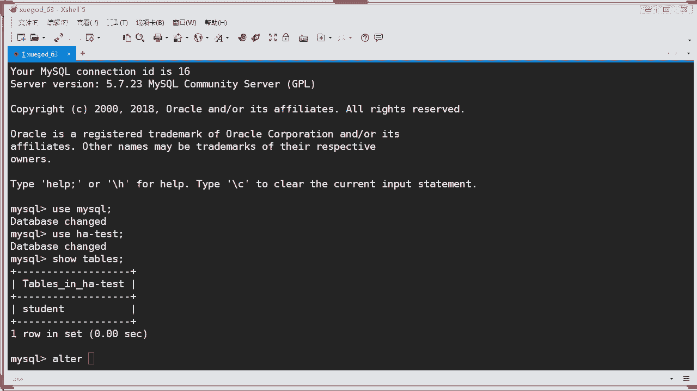

刚刚讲完。aler auto它是属于什么？它会对你的表进行一些修改啊，什么什么，我再拉上去给你看啊，这里会讲到。啊，你像inser啊upate啊，这些是什么DM语言，对不对？

但是你像那种aler要进行一个修改的。他属于什么原？操作语言。O。是什么语言啊？DDL对啊，你看老张同学啊有点经验，我看你是吧，他属于DDL是数据定义员，为什么这样说呢？

因为它会对你的这个表啊字段重新定义，对吧？重新定义。O。有些到东西的吧。好，我们继续往下去讲。

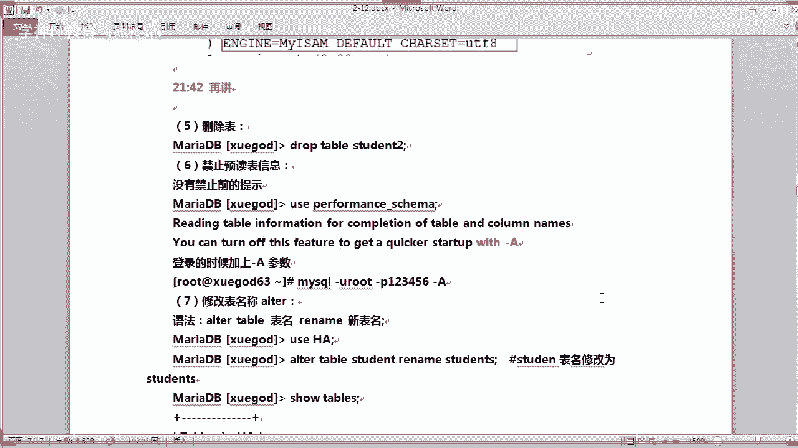

那alto的话，它就可以用来修改你的这个表啊，重重新定义你这个表是吧？比如我要修改你表的名称啊，al table。Student。是吧那刚才的名称叫叫什么呀？😡，叫student。它的表明。

那我需要重命名是吧？重命名就是用这个啊Vname。mename就是重命名，其实很好理解是吧？比如我把它重命名为students啊，加一个S是吧？刚才这个学生表没有S的，现在加多一个S students。

ok。是吧。这样去那修改成功。我们再来看一下，上面是没有S的，下面多了一个S，对吧？那你修改了它名称，它的表结构会有发发生变化吗？肯定是没有发生变化的。对不对？肯定是没有发生变化的。OK要注意啊。

没有发生变化，只是你的你这个表的名称被修改掉了。那老板又说了啊，哎，我要我要这样子是吧，我要修改这个表里面的字段啊，有没有发觉老板的要求真多是吧？没办法，谁叫你是打工的呢，是不是？那那现在的话。

我要对这个表中的字段类型要进行一个修改。对不对？那我要对这个表字段哪个字段啊是吧？假如我现在要对这个呃某个字段嘛，比如就拿这个ID字段。ID字段的话，它的类型是INT是吧？然后呢，它是20个长度哈。哎。

老板说这个长度不够啊，你给我改一改啊，把这个字段的长度改成40。怎么改？😡，是吧我要它改成40这个长度是吧？来了啊，那么我们依然是用到什么呀out table，然后是student。哎。

这个时候你不能用student了，因为你的表名已经改了，应该叫students，对吧？对不对？然后呢，我们要用到一个这样的一个关键词。注意啊，这些东西你就是要记得啊，modifymodify。对。

像这个aler是吧，这个什么modify这些单词啊，你要记住它啊，你要记住它到底是它是什么作用呢。这个modify呢它可以对这个表的字段进行一个修改。比如这个类型，这个长度啊，modify IDD啊。

比如我要对这个ID字段的这个长度啊，它的是什么数据类型的NT的数据类型，好，老板说这个长度不够啊，对吧？你要改成40个长度，它本来是20的，我是要改成2040个长度。看没有。

这样的话我就可以modify啊，注意这个是关键字啊。对某个字段ID字段啊，它原来的长度是什么？20，我要改成40。OK修改成功。来，我们再看一下它表结构做一个对比，你看到没有？这里是40啊。

上面这个是20。那现在呢已经已经变化了是吧，已经变成事实了。OK学会了吗？😊，是吧modify啊这个这个关键字可以对可以对什么对你表里面的字段进行修改。进行一个修改。是不是？啊，老板又有提要求了是吧？

哎，他说你这个。这个字段是吧，这个名名称我也要改怎么办？😡，是吧老板要求增多是吧？比如像这个这个这个name啊，老板说不叫name了，比如我叫ST name，对吧？要把这个字段名字也改也也也改变。

怎么办？😊，是吧。好，我们又要用到这个aler啊，aler非常强大是吧？是不是？非常强大outto table那要对你的这个表students。这个表啊注意了，那这个时候呢，你用的这个关键字呢就。

不一样了，用什么关键字，这里呢使用到一个change。change changege的话，它翻译成中文就是改变的意思，对吧？改变啊变化change改变什么东西，比如这个named啊，老板不喜欢是吧？😡。

哎，他不能叫name是吧？我要改成名字叫ST name。啊，叫ST name对吧？OK然后老板说这个这个类型也要改掉啊，它是叉型，你要给给我改一个类型，叫V叉型是吧？要求增多啊是吧？还包括什么。

包括它的这个长度，你也改掉，比如我改成30。你看。我把你这个字段名称改成ST name，同时这个类型我也改掉它长度也改掉它。当然你不改它的类型和长度也可以是吧？OK咱们来看一下表结构。😊。

你会发现这个name变成了ST name，它本来是差型，现在变成了V叉型。然后它长度是原来是20个长度，现在变成30个长度。OK老板就是事多，肯定是这样的。以后你们。呃。

做像做开发的同时就非常有这样非常理解我说的话是吧？天天产品经理会提要求是吧？你是不是想很想打产品经理是吧？很想揍他一顿，老是提要求哈，老是提各种bug。😊，是很想打他一顿是吧，那没办法，你做你干这个活。

你在这个岗位，那你就要干这个活是吧？😡，Okay。看懂了吗？嗨你们公司就是这样是吧，不单只是你们公司啊，其他公司也是。也也是这样啊，对吧？哪家公司不是这样的，特别是如果是比较大的公司企业也好。

因为他分工比较明细嘛，各司其职。那么这样咱们做起来也轻松，像一些中小型公司，那你就非常累了，是吧？你又要当爹又当妈，你懂我的意思吗？是吧？啥都要写，改带码。

休 back写写cyclcle哎反正啥都要找你，你懂的啊。OK好，刚才我们学了一个modify，然后学了一个change。

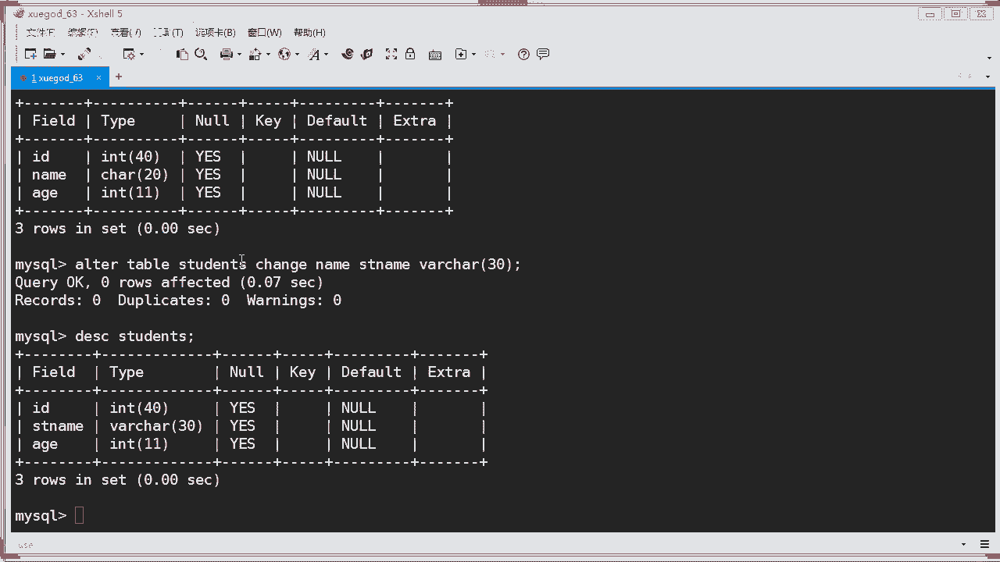

对吧change。来，我们来做一个对比一下啊，这里做一个啊小总结，就说这个change跟modify的区别是吧？change呢可以对列进行重命名和更改列的类型，对吧？需给。是给定什么？

你要给出旧的这个列的名称和新的名称。注意啊，这个chan你要给出啊，比如你原来的名称和新的名称，对吧？还有当前的类型。那modify呢modify可以改变这个列的一个类型。啊，还有包括它的一个长度啊。

那这这个modify呢它不不需要用来重命名，因为它不需要是做重命名的OK所以它不会要不用给出一个新的一个列名称啊，要注意它的区别，使用区别啊。

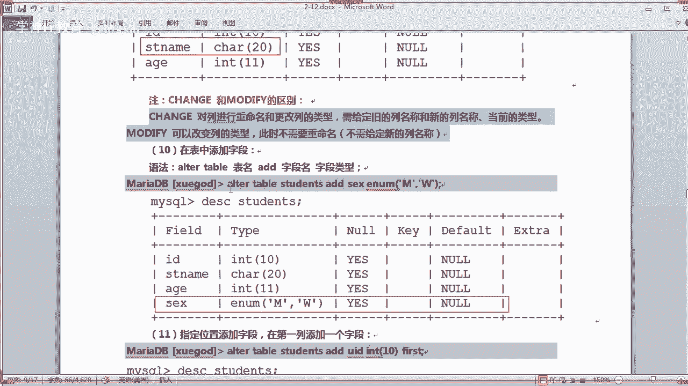

OK老板又提需求了来是吧，好奇葩，也其实也不是奇葩。其实这就现实生产环境啊，真正我们遇到的情况，其实就是这个样子的对吧？不断的去改这个需求。啥啊。这才能体现你价值啊，不然你在那里干啥是吧？

老板说我要在这个表当中啊，这个student表要增加一个字段是吧？你这个字段呢有什么ID啊，有姓名呀，有年龄是吧？老板他不满足，他说要加多一个性别。加了一个性别，有年龄啊，你学生肯定就有男有有女的是吧？

好，我们又要用到这个aler，所以这个aler是话挺强大的是吧？很多东西都可以搞。autotable，然后student。students对吧？那我要增加字段用哪个关键字呢？同学们啊，注意。

这个你要记住啊是吧？ADD是吧？ADD呢就是增加对吧？增加要增加字段啊，现在是目前是三个字段，我要增加一个叫性别字段啊，那这个字段名称你是可以自定义的。比如我这里就叫ss吧，是吧？size。性别。

然后他给他一个数据类型啊，有的人说有些有些公司可能是用数据类型是用啊用零表示女的一表示男的是吧？零和一。但然你可以这用这种表达方式也行，是吧？我这里面用另外一种这个数据类型叫E numberumb。

这种话是叫这种数据类型呢叫枚举啊枚举啊。来，那这里的话，既然是枚举的话，你要写出你的枚举的一个一个一个什么一个值，枚举值是什么东西呢？比如我这里要定义了啊，同学们。好。首先如果是一个啊男的。

我比如我就用这个M表示是吧？man啊曼老师是吧？man man啊是吧？如果是女的话，我就用啊W表示啊，woman嘛是吧？woman就是女的是不是OK啊，我就用这个来表示啊，那这样呢表示啥意思？

就是说我创建了一个这样的一个字段，就增加了一个字段叫sas字段啊，性别字段，然后它的类型叫e numberumb，然后它里面只能选这个枚举里面的值。如果他不是男的，就是女的，难道他还有人妖，不男不女。

是不是除非他去了泰国是吧？😡，开玩笑啊，OK。😊，啊，无非是这种嘛。那如果你有人要的话，或者是有其他，你可以增加第三种这种这种这种状态进去是吧？OK好了，老板的要求挺多是吧？来，我们看一下啊。

我们增加了一个字段，我们再来看一下它的这个表结构，你看没有？你会发现在这个字段最后面的话增加了一个ss段是吧？按照我们的要求把它增加到里面去了。😊，枚举是什么意思还不知道吗？就选择题，那你选择的话。

你要在我这个括号里面选是吧，1234，你是男的，就是你想啊性别无非就是男女嘛？难道你还有。😡，第三种性别吗。啊，你可以根据你的这个字段类型来定义他来的这个什么这个类型是吧，你字段的要求来定义的嘛。

金星是吧。OK。好，那。我们就我们就已经增加了1个sS字段了，对吧？ok。好了，老板现在又提需求了啊，他说我现在又要增加字段，但是我现在给你增，我要你增加字段呢，不能排在最后面是吧？

他说你要增加一个字段呢，要放在最前面，放在第一列。😊，咋办是吧？这老板真是奇葩是吧？你看我们现在默认增加的一些字段，呢都是排在后面的是吧，都是排在你前面的字段的后面的。老板说你要增加一个字段。

排在最前面了，咋整啊？😡，来是吧他这个要求我们也一样是可以满足他的，对不对？那当然ADD是增加是吧，比如我再增加1个UID是吧？UID这个字段啊，那么它的类型呢是NT啊，以后给他一个长度。

当然你不给他也行是吧？不给就是1一个长度，你给他的话，就是按你的长度啊，比如我们给他一个十的长度是吧？老板说要增加到最前面去是吧？how。第一嘛是吧。😡，第二名。OK那么这样子的话。

我们就可以把这个字段UID放到这个ID的前面了，是不是这样子呢？来我们看一下，你看一下。是不是这个UID的话就排在最前面了。😡，按我们的要求增加成功。没有问题吧。O。是吧现在老板又提需求了。

他说你再给我增加字段，我现在要增加一个字段呢，我要指定它放到某个字段的中间啊，是很奇葩。比如。😡，啊他要增加一个叫呃。地址是吧，协商表里面有家庭住址的嘛，对吧？还有要增加一个地址的字段呢。

你把它放到这个年龄的后面。然后呢，这个性别的前面，也就是说介于这两者之间。是吧。老板说哎。这个这要这样做是吧？行是吧，咱们来再增加啊，就是插入某个字段到某个指定位置去，是不是OK好那。

那家庭住址我们就用这个ags，对吧？s然后给他一个数据类型啊，V叉型叉型都行啊。啊。注意啊，一般我们写家庭住址的话，都是在中国来说，基本上是中文，而且地址的话是比较长的。

所以你一般你给这个长度你要给长一点。如果不够长的话，它保存下去，那不就。那就保存不全了嘛，是不是？所以我们给他长度要一般我们可以给他，你可以给他1个120个长度或者是更长的长度，对不对？

比如我这里给60个长度。O。那这里呢就要满足他要求，说他要把这个ads这个字段的话增加到这个年龄的后面是吧，性别的前面。那我应该怎么写？啊，after。after是什么意思？啊，A句。啥意思呢？

就是说他会排列到这个A举的后面去是吧，这个是。after就是排在他的后面嘛。是不是？O。然，我们增加成功。来，我们再看一下它到底是不是增加到这里呢，你看。按照我们的要求，把它增加到这个A的背后。对吧。

满足老板的要求吧。满足OK是吧？小伙子干的不错是吧？明年给你加工资啊，对不对？老板就非常欣赏你这种小伙子。😊，O。😊，好。那个是吧我们学了这么多东西啊，是吧，对这个表的操作，你是不是写了很多东西啊。

增加字段，删除字段修改表类型啊，修改表的这个类型长度等等等等等等等啊，很多东西啊，是不是？😊，老板还有什么特别的要求吗？有是吧，要求挺多的是吧啊。😊，老板现在又提要求了是吧？

他说我要删除这个表当中的某个字段，注意啊，不是删除整张表，而是删除这个表里面的某个字段。怎么办？对吧好，alto又派上用场了，对吧？aler哎，我还是用刚才那个吧。哪来打那么多是吧？

al table要students，对吧？那删除某个字段用什么呢？用jo命令，注意了啊，这个jo的话不是写在最前面的啊，写在这里outtable students然后是加上这个jo命令jo命令的话。

如果你后面加上字段名称，就是要指定删除它的意思了。比如我要删除呃，就刚才那个地址吧，ADDRESS这个agdress。要删除这个地址的地址的这个字段。那么这样如果你执行的话，这个地址字段就删除掉。

同学们要注意，如果你执行的这条命令，这个地址字段，如果它里面有内容，就是有记录行是吧，有数据在里面，那么这个所有的地址都会被清空。都会消失掉啊，一定要注意啊，数据就会全部没了啊，全不是数据全部没了。

是这个字段下的数据全部没了。啊，其他的数据呢还是保留的其他字段项。O。来，我们看一下，你看没有达到要求了吧，是吧，这个address的话已经被我们干掉了。😡，ok。那。是不是啊这样就可以了。好。

删除字段我们也学习了是吧？往下去讲，我们就是来讲讲啊这个比如插入字段。我们要插入一些记录。对你的这个字段是吧，你要查入数据了，怎么样去插入呢？这个时候呢我们就要用到ins色的啊in色的。

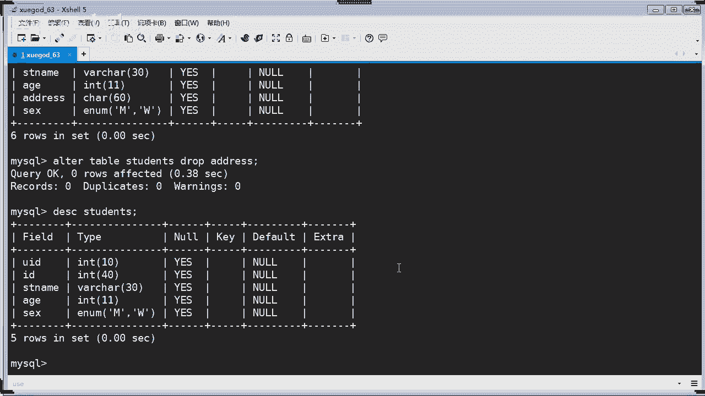

那讲音色的下话，我先给你讲一讲它的语法啊，语法啊，在这里。那他务字段语法呢，你看这里。inser into啊写上表明啊wall对这里有个关键字叫walls。然后这些的话你要会啊，in的它是怎么样拼写的。

是吧？iner into呢就是要对你的这个表要进行插入数据的。写上表明，然后这里有个wis啊ws，然后呢写上字段值一就是第一个字段的数数值。第一个字段呢这个数值啊，第三个字段以此类推。

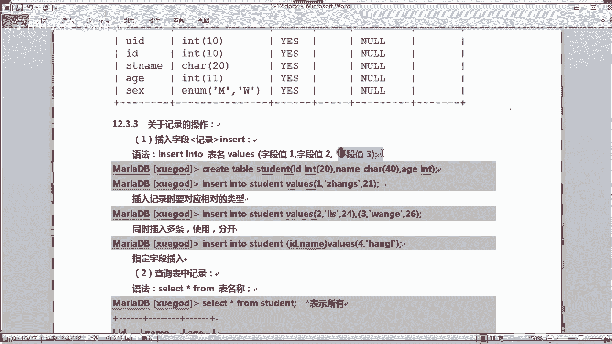

OK这就是他的一个语法。好，我们还是拿刚才的这个表。嗯，我看看啊，这里太多了，我再删除一个字段。UID。对吧。OK我就保留还是啊四个字段就可以了，对不对？那要对这个张表进行插入数据，我要用个什么命令呢？

iner in啊这个命令啊，使用这个cyclcle啊，然后写上你的表明啊，students啊s studentsdents后面加上value。OK。那这里的话加上你的这个插入的值。注意啊。

你现在这里的话有12344个字段。那我现在是所有字段来后进行插入。那你要根据它的类型来插入，为什么呢？因为不同类型，你插入的时候呢，要有特别的格式，像这个IT它属于IT的类型，那么就是数据类型，对吧？

好，我就插入，比如数据类型，我就先用一个一吧。那ST呢呢它是字符串类型，你要用引号把它引起来，同学们注意。对吧引号把它引起来啊，嗯，因为它是V叉型嘛，V叉型的字符串。比如像这个MX啊。

我刚刚看到你啊MX同学是吧？我把他这位同学，他叫MX啊，然后MX你年龄是多少啊？18岁，对吧？是不是18岁啊，啊，啊，然后呃因为这个也是IT嘛，对不对？所以我们不需要用引号，然后这个MX他是男的是女的。

我相信你应该是男同学啊，是吧？OK我这个的话也要引起来，那你就是d man是吧？你是男人啊，O。看到没有？我们就可以通过这样的来进行对你的这个表进行插入数据。O。才有成功是吧？来，我们进行查询一下。

sn新 from是吧，要 studentdent。啊，来看一下看到没有？这个MX同学的话是吧，已经被我们记录到这个表里面去了，是吧？他的ID号为一，姓名叫MX，今年18岁啊，他是男人。对吧中文可以吗？

来。😡，有同学说唉中文可以吗，对吧？那。呃，老张是吧。老张。你是你应该不是18岁，看你就不像28吧。对吧。来，我们再看一下啊，老张，那么你看。那么这样的话我们就可以插入进去了。对不对？肯定支持了。

因为我们这个表啊，包括我们这个数据库啊，它都是什么UTF8的字符集。UTF8的话，它是可以支持中英混合输入的。对不对？所以没有问题。有些人说我的拉丁文可以吗？其实拉丁文它也是可以的。

只要你保证它的数据一致，它字符就一致，你不信你进行插入看一下。如果有报错的情况下呢，那你就要改动你的字符级了。明白没有？有可能是他无法支持。O。

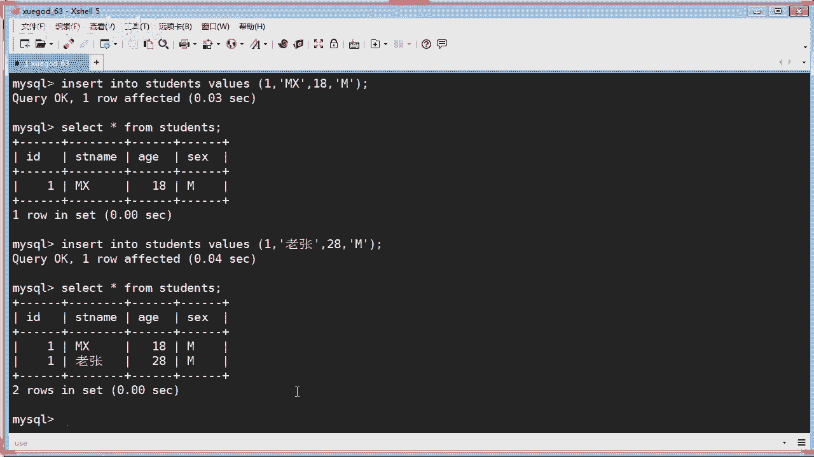

好，你看老张同学这个插异呢就是字符级的问题。为什么呢？因为你看看你的这个这个叫你的自符级问题是不是。不符合要求。

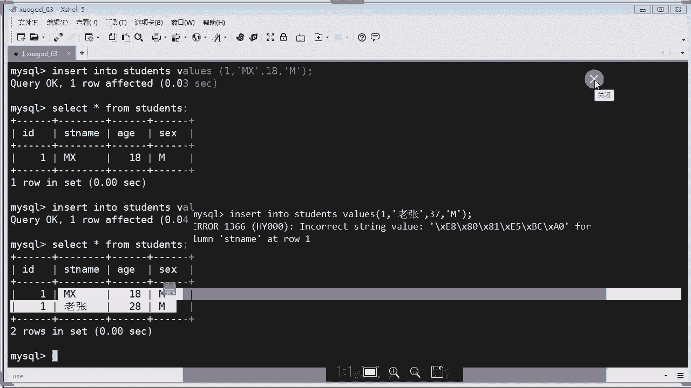

那我们收一下。佢lay。Table。是吧Stdent。你看到没有？我的字符级呢是UTF港8，然后还包括我的这个。Daabbase。啊，我这个是什么库？HA杠task库。对吧。不要把它引号引起来。

那我这个呢也是UTF杠8。你的对得上吗？如果你对不上的话，你要去改你的字符型啊，你最好改成UTF8UUUF8它对中英文混合支持是最好的。拉丁文呢在某种情况下它也是可以的。

但是有些情况它可能是支持不够油耗。比如像一些可能这个跟数据库的版本呢是有关系的。那这里干脆就给你们讲一下吧。那这里的话，在这个你的这个mycyclmy con就是这个mycycl主配置文件。

你看我这里加了什么东西。这个。哦，即噶。那你把这一行添加到你的mic come文件里面去，也后重启你的这个。mexico啊，那么这样的话，你整个数据库以后在创建库也好，创建表也好。

它都默认使用UTF8的字符器给你创建了，这样就方便很多了。要不然你手工你创建的时候，手工指定UTF杠8也是可以的啊，同学也是可以的。ok。好。那刚才的话我们进行插入这个呃插入数据写到笔记里。

这个东西后面也还会讲的啊，写到笔记也行是吧，其后面也会有。是吧因为每节课的内容它不一样是吧？你现在学的东西就先写把这个东西写好啊。呃，inser into values要写上你的这个什么呀。

写上你要插入的值就可以了，对不对？好，OK那如果你要插入更多的这个这个这个。比如。这个是3对吧？啊，这个随便写吧啊。啊，老K啊要38对吧？要比如我要写要拆，同时一下子才有更多的这个数值怎么办？

是吧才有更多的这个数值怎么办啊，我可以写到后面。对呀，你这个时候呢这个逗号是英文状态下的逗号，要不然等一下错了，是不是？那比如我插入更多行是吧，当然你还可以写第三行、第四行第五行啊。

我这里就比如我插入两行数据啊。回车啊，让我们来看一下。好，tudent。啊，看看啊，那么这样的话我们就可以插入，同时插入多行数据。你看。是不是两行你还可以写三行、四行、五行都可以啊，对不对？

同时还有多条，你使用这个逗号隔开就可以了。ok。懂了吗？那如果我要拆的时候呢。呃，要指定啊指定某指定什么指定你的这个某个字段怎么采用。搞死人是吧，两个一，因为我们这里呢没有定义这个ID是一个主件约束。

所以呢它可以查入重复的值啊，后面我们会讲啊，后面我们会讲。三和改呢是吧？嗯，有同学说三和改呢。嗯。这样子啊，那如果。我要对这个字段。啊，这个字段。我现在等一下再教你三是吧，比如我只要这个插入。姓名。

姓名是什么？ST name是吧？那对这个字段进行插用，你要怎么插用？是吧。我为什么讲这个东西呢？一会跟你们讲讲啊那。这个是ST name对吧？我引号引起来，因为它是V叉型字符串，对吧？

比如我才有1个MK。你看他也更能够插进去。我们再来查询给你看你有没有发现我插入这一行，我只对了这个ST name这个字段插入了1个MK。这个值而其他的字段，你像这个什么ID字段啊，年龄字段啊。

还有这个性别字段啊，他都没有插入，它就会插入一个什么nt，这个n表示空的是吧？空值。那了没有数值。对不对？那么实际在生产环境当中呢，这种情况是基本上是不会出现的。因为我们会对这个表做一些约束条件。

但是这里呢我并没有任何的约束条件，你看。我再给你看结合这个东西啊，给你看你就懂了。看表结构，它是允许为n，你看到没有？这个n这个约束条件它是yesyes yes，也如这四个字段呢都允许插入空指。

就说不用插入任何东西。明白没有？那后期如果你对他做一些约束条件呢，你就不能随随便便的这样去插入了。对不对？ok。是吧。好，那n啊，那如果你要进行查看这个ST name字段是吧？

我们可以单独去查询某一列是吧？其他的列我们不显示出来也是可以的呀，对吧？当然可以了。比如我们有只显示啊ID和ST name，那么就只显示什么两列数据就可以了，其他不需不需要显示。

无论是查询还是插入也是可以实现的啊，对吧？你可以指定你要显示的列或者指定你要插入的列，当然你要满足它约束条件才能插入O。会了吗？这些增三改的东西啊，其实还是。不难，对不对？同学们是不是不难？OK啊。

刚才同学说怎么样去删除它是吧？删除数据啊，注意啊，不是删除表啊，不是删除你的表结构，而是删除这个表里面的数据。我们应该用什么命令来删除呢？啊。好，这个命令就上来了。delete。

这个的话应该是你们肯定知道了是吧？deiveve fromdeiveve from就是你要对某个表是吧，比如still。Student。对吧。你要对这个表进行删除，注意啊，如果你只写完了这个表。

就用分号结束，直接的话，他就全部删除掉了。非常危险啊。那老板肯定要求不是叫你清除清空整个整张表的数据是吧？老板说哎，你要给我删除啊，把这个谁呀？啊，把这个ID为4是吧，这个man是吧？曼老师这个。

要把它删除掉这一行记录，你给我删除掉，那你应该加上条件啊，如果没不加上条件啊，非常危险。同学们要注意啊，加上wherere条件啊，来了，where尔表示什么呀？

where尔就是当什么什么满足什么条件的时候才购执行删除。比如当ID等于什么呢？ID等于。4。对吧。这样就满足这条件吗？我这个你看我是排在第四行嘛，对吧？我就要求啊你要删除这行数据ID等于4啦。

这条记录麻烦给我删除掉。那。我们再来给你看是不是第四行的数据就已经被我删除了，但是其他数据并不受影响啊，并不受影响。对不对？好了，老板现在给你一个要求，他说要删除这个ID为n。怎么删除？来，哪位同学会。

对ID为烂怎么删除？是吧。咋删除呢？好，有同学说ID等于一个空是吧？用引号引起来。那到底是不是这样子呢？啊，实验得真知对吧？实验才有得真知。所以说我们来试试啊嗯ID等于啊，我会把它引号引引起来空是吧？

哎，他说这样子能删除吗？执行成功，但是他有没有删除呢？我给你看一下，并没有删除。你看。我们总共就只有四行，这一行还是存在的。对不对？是吧所以像删除这种n应该是怎么办啊？应该是re IDDS，对吧？

那这种方式进行删除来我们执行一下。OK我们再来看你看没有？那么这样的话，第四行啊，MK的这一行的话就已经被删除掉了。OK看懂了吗？😊，哈对。is啊就可以啊is等于什么？

它is思就是说这个ID它属于n值的，就给我执行删除。学会了吗？ok。好，那。还有其他，比如呃。你可以加其他条条件是吧？加其他条件删除的时候呢，并不是说一定要一个条件。比如当ID呃等于什么呀？

等ID等于3是吧，还有and我可以加多个条件呢，是吧？还有这个啊年龄。等于什么？等于38。同学看清楚啊，我这里写的条件的话是两个条件，对吧？按点呢就是要两边成立是吧？就ID等于3和他年龄等于38了。

这一行给我删除掉。那如果他不满足条件，他会删除吗？比如。48。你看啊。并没有删除。因为他不满足这个条件是吧，ID等于3，他是满足了。没错，但是年龄等于48的并没有。因为我们的记录行里面并没有48岁的。

对不对？你看他是执行完成了。没有影响是吧，没有行影响。对不对。那如果同学们啊如果删学的时候呢，用这个命令al。或者啊或者。如果是用或者的话，那他会不会删除成功呢？只要满足一个条件，它就能算除成功，对吧？

说ID等于3或者年龄等于4是吧？都可以。因为前面这个条件成立，那么他就会把这一行给干掉，你说是不是？那我们仔行看一下。你看没有？那么第三行老K就已经被干掉了。因为他满足条件呢，他只要满足一个条件。

那么它跟那个and条件的话是不一样的，and的话是两边的条件必须重时成立，是不是？看懂了吗？OK好，删除啊，其实删除的话还有很多是吧？行慢慢讲，然后我们讲一下怎么样去进行一个更新啊。

更新的话我们就会用到update。Ud。update啊update就是进行更新啊，什么叫更新呢？其实也是相当于改你的数据是吧？改你的数据。No对。啊。

 studentsdents啊 studentsdent协上的表明，然后 said。s表示呢要对你的某个字段是吧，某个字段的值要进行修改。那当然你要也要加上这个条件啊，比如这个老张是吧？这个老的啊。

我要把他的这个这个这个性别改成女的，怎么改？啊，s这个ss。等一是吧。改成。W。啊，改成女的啊，当然你要加上条件了，要不然的话全部都改了，不单止老张，还有包括这个MX同学也改了，是吧？

所以我们还是要加上这个。条件。什么条件？那这里同学们他的ID号是都是一。那ID号都是一，你能用ID作为条件吗？不能然后如果你用ID都等于一的话，两个都被改了，是不是？那我们就换一个条件。😡，年龄是吧。

年龄等于428岁的。对不对？这样的话才能改出来。同学们，你要注意啊，你改东西的话，你最好是查看表的数据是吧？如果你一旦改错了，那就真的是很难逆转。所以说我们在进行一些增删改的时候呢，我们一般会先做备份。

对你这个表先做备份。对不对？我对你的表做备份，一会，如果万一错了，我还可以恢复啊，要不然老板就找你算账了，你觉得是吗？OK那update students said这个ss啊，由这个M是吧。

由男人改成女人啊，是吧，where age等于28岁。这个修改来，我们再来看一下，你看没有？老张又改成了W是吧？OK这种呢就是update啊，update就是更新记录嘛啊，update更新记录啊。

OK那如果你后面的话不写上这个V条件的话，那是相当严重。不写上违条件来，你执行一下。如果这样执行的话，所有整列都已经被修改。你看是吧？所有啊这个列下面所有的这个都被改成了W。很危险啊。

所以说我们做增山改的时候呢，一定要注意后面的条件啊，条件要写的比较精准。我也是啥，就是条件呢，指定条件。那如果两个人都28岁怎么办啊，那你就要找一个能够区别出来的特征，是吧？那不然怎么办呢？是吧。O。

他肯定是有一些嗯不一样的啊特征是吧？其实在现实的生产环境中肯定是有不一样的。比如这个ID对吧？只有我们在我们这种情况下，因为它允许为重复嘛，一般在生产环境的话，这个ID是不允许重复的，对不对？

你想想ID号都能重复的话，那还得了，就像你的身份证号码一样，全国都没有重复的身份证号码，对吧？都是唯一性的。对不对？后面我们会给你讲组件约束啊，组件约束。OK。呃，好啊，后面的话就是查询啊。

查询这些的话，其实我们已经讲了这些可以快速的讲一下啊，sn是吧，n新 from什么什么什么，哎，这个都已经讲了是吧？我们可以啊，比如我们只要查ID是吧？还有这个ST name。

这样种方式来显示啊就是指定某些显示字段。当然我们还可以气重显示查询。气重显示查询的话，这个这个可能会。比如现在他2个ID号不是唯一嘛。对不对？比如我们进行一个驱重啊，这个叫disstrict。

Dstrict。啊，哪个字段呢？比如ID。是吧你看。ID字段，那么它就只显示一。是不是只显示一。那如果。啊，这里的话如果进行两个去重呢，你看一下啊，比如这个ST name。开票。那么它会两个都显示出来。

并没有气虫，为什么呀？这个等于相当合并气虫。合并气虫呢，它相当于把这两个当做整体，你懂我的意思吗？把它当做一个整体是吧？有同学哎，它不是气虫嘛？这个命明是气虫是吧？但七虫其实用的还是比较少。

就有相同数据的时候呢，你可能就会用得上啊七重啊。O。这种是合并器重啊，当然你可以写更多的一种合并器从，像这种加上A句，对吧？那这样的话他就会呃。干什么更多的这个气虫是吧？好，那我们接着往下去讲啊。

刚才讲了and all啊，and all你们会了吧。😊，啊，and all，那我们这里讲比如sn新 from，加上这个条件啊，比如什么条件呢啊re。条件啊，比如ID。是吧ID呃，比如等于一是吧。

and呃这个A举呃，比如A举呢，我又给一个条件啊，A举大于20岁。对吧条件完全可以自由发挥啊，比如ID等于，而且年龄大于20岁的给我展示出来。那么只有老张满足这个条件是吧？满足这个条件。

他才能会显示这些就是一些过滤条件。看懂了吗？啊，你可以使用各种等于符号，大于呀等于呀等等，或者是不等于。哎，不等于是用什么符号？啊。我们可以用一个叹号等于号是吧，不等于20岁。

那么不等于20岁的条件的话都满足啊，是吧？所以它就会进行一个啊全部显示。对吧是不是还有这个呃。这种也是不等于对吧？那用这种叫小于号加大于号的方式呢，给你使用叹号等于号呢，也表示不等于的意思啊。

结果是一样的。对吧这些东西我们要灵活运用啊，是吧，逻辑的一个一个关系。啊，NON大于等于小于啊等等等等啊。好，那么我们再往下去啊。嗯。哎，我应该去插出一些数据来做一个对比啊，inser into啊。

然后students啊，然后values啊。呃，还有条R对吧？然后是。字符串啊。比如。Men。好。呃，年龄啊，比如啊。35是吧。然后。Men。OK好，那我接下来讲的是查询的时候呢。

我们可以通过区分大小写或者是不区分大小写进行一个查询啊。比如啊n新 from students rare条件啊，比如这个name。等于什么呢？等于这个。你要把它括起来是吧，比如它字符卷，它等于man。

嘿。哦，打错了，因为我是ST name，对吧？ST name等于man这个慢的话才显示。对不对？那如果这样敲啊。如果这个SC name等于MX，你说它能显示吗？明明这个MX的话它是大写的。

但是我在查询的时候呢，用小写字母，它一样是能显示的，有没有发现？也就是说，木业的查询它是不区分字母的大小写的。对不对？那如果你想让他区分大小写怎么办？有办法啊，你可以加上一个转换的条件啊，什么条件呢？

在这里指定一下啊。这个是。bin啊ARY你看。你看我这样去查询这个MX的同学，他是不会显示出来。你看查出的数据是空的是吧？没有，为什么我指定他查出来必须是小写的MX，对吧？所以说他没有查不到。

不满足条件。如果我把它写成大写的，你看它能不能显示呢？这样的话就能显示。加了这个关键字之后呢，他就对你查询条件进行了锁定，一定要大写，一定要小写。看懂了没有？

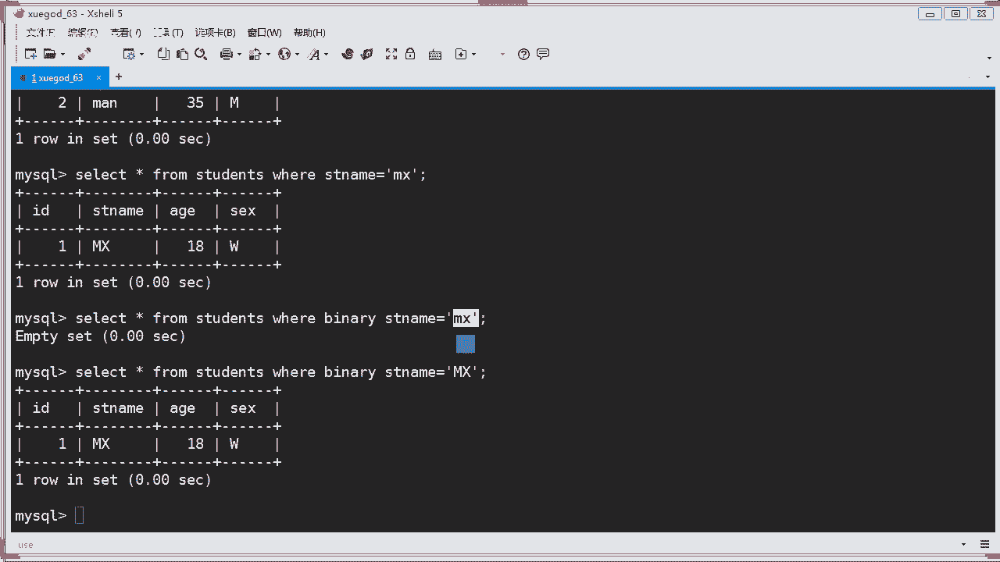

OK这个的话是呃我拉下来给你看一下啊。嗯。大小写啊，这个是干什么用的？它可以对你的这段类型进行啊转换运算符啊，用来强制它后面的字符串为一个二进制的字符串，可以理解为在字符串比较的时候呢，区分大小写。

对吧区分大小限。

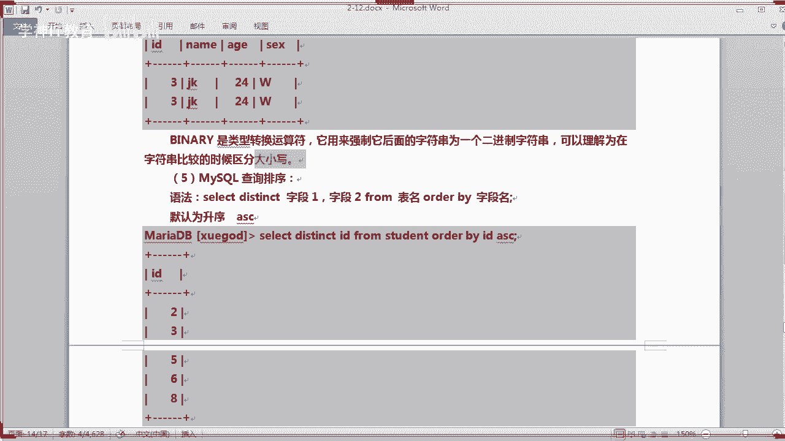

O。好，那我们接着讲啊呃，刚才讲了区分大条线是吧？然后我们讲一下呃，这个什么呢？进行1个ID排列，比如students啊呃我们进行一个order。out byout by是干什么用的是吧？

out buy呢它可以进行，比如对某个字段，比如ID吧，ID字段进行一个排序。啊，什么叫排序？这个你应该懂是吧？那这种升序的方式的话，它默认就是升序的对吧？如果要降序呢？你看没有，它就会从大到小。

刚才是112，现在变成211。看懂了吗？是吧。我要对某某个字段进行一个排序啊，你可以使用几个out buy进行一个排序啊。ASC的话，它本身就是默认的就是声序DESC的话就默认的就是什么呀？是一个降序。

很好理解啊。对吧。懂了吗？其实我们写这个的时候呢，也可以不写这个什么。那我直接不写后面的这个ASA，你看他默认也是程序是吧，其实你写不写这个，他默认都是程序。对不对？但是你要这上去的时候呢。

你这个必须要写了。对不对？是吧那比如我们要对对ID排序，我们对年龄排序好不好？比如H。进行一个降序培序是吧啊，谁的年龄最大，他就排在去上面。O。老师，我感觉该杀咋了是吧？好。该杀的是吧？

你是不是感觉今天讲的内容特别多，你怕。😊，记不了那么多，消化不过来是吧？

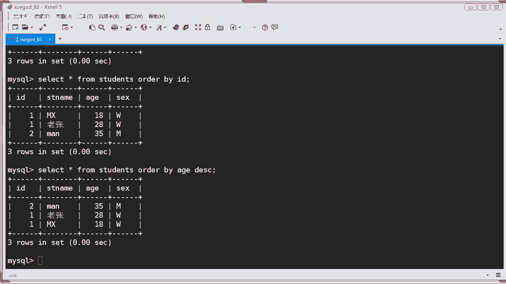

ok。好，拉闸是吧？诶先。那。那这里再讲一下，关于这个my命令啊，其实我如果你不懂这个命令到底它有什么意义，怎么样去使用这些语法，你可以通过这个帮助文件是吧？啊，慢老师慢老师慢手册，你们之前听过吧。

第一阶段，那你可以借助慢手册帮助手册。所以你可以通过这个help啊，help那你知道有刚才不是有同学说哎这个so啊，这个n这个这个呃等等这些东西到底它有什么区别，怎么样用法。

语法有哪些是不是老师你还没讲全，肯定东西我不可能全部都讲到全的？有些。

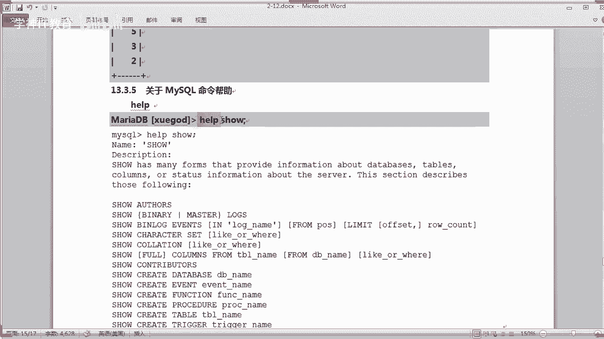

不常用的我不会讲是吧？那如果你要非常深用的去研究它，那你可以通过这个ha命令，你看。那么这样的话，整个so你看到没有？它的一个用法，还有它的一些那通过这个help命令要加上so。

就说我要查询这个s命令到底它能怎么样去使用，有哪些语法，哎，你都可以通过这个帮助文件是吧？慢手册的方式进行查看是吧？搜各种东西搜搜搜搜搜搜，你看。是帮助很大。但你也可以通过们这个man是吧呃收入。

查看哦，这个不行。啊，这个不行，那你就用hap的方式进行查看。啊。对不对？help比如这个snide对吧，就就说这个最简单的吧，snide它是一个查询语言是吧？哎，你不知道这个snide能干啥东西。

你看这里东西可多了。😡，是不是啊？是不是很多，当然它是英文，英文你不懂，你可不可以翻译啊，对吧？它能够使用的一些语法学会了吗？这种是一种辅助学习啊，有助于哎比如我要查某个命令。

它到底的使用语法是怎么样子，你可以通过这种方式进行一个查询啊，OK。那么最后的话讲一下这个啊什么呢？就是升级mycyclq这个5。7版本是吧？

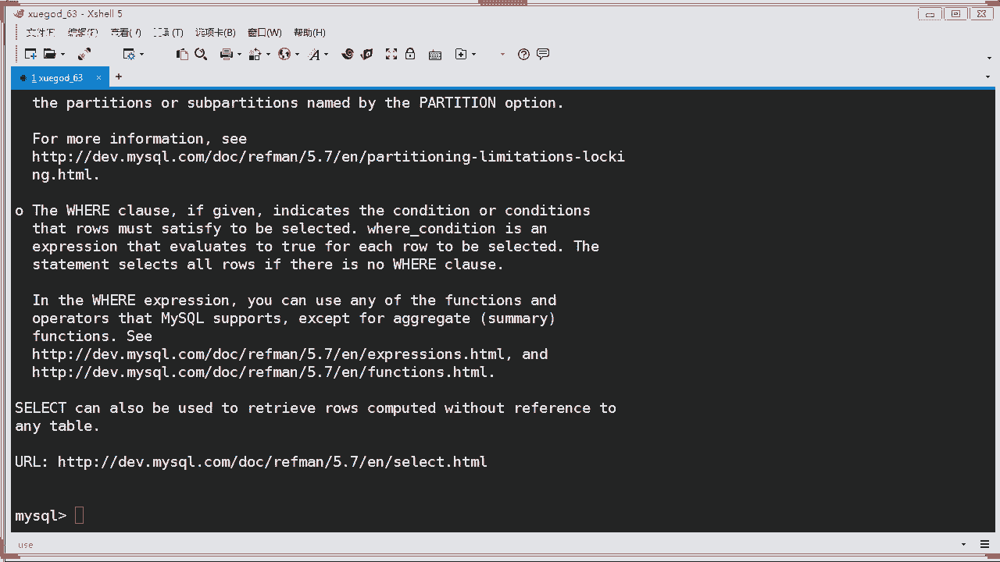

这个的话其实我昨天就已经写到笔记里面了。还用讲吗？是吧你先把这个旧版本的删除掉啊，删除掉啊，只不过这里呢多了一个叫迁移数据啊，迁移数据表示什么意思呢？你可以通过m的方式啊，m的方式把它备份出来。

备份出来之后呢，我们再把这个什么？假如我原来就是什么是情况下，我首先通过的方式啊，把我的数据库导出来啊，导出来啊，通过这种方式导出来导出来之后呢，我再删除这个数据库。我导出来就是做了备份。

我做了备份我就不怕了是吧？我就把你这个数据库软件删除，然后安装新的版本myac5。7。对吧。这个你们都会了吧，你们都已经安装完了，有没有同学安装不成功的？啊，安装不成功。如果你发生问题了。

你可以来问老师或者是同学啊，我相信很多同学都已经装完了，对吧？那其中这里呢要跟你讲一下，你们在安装完之后呢，是不是有一个临时密码？还记得吗？对吧。有了临时密码登录完之后呢。啊。

有些同学这个临时密码老是写进去的不能登录，为什么呢？因为临时密码它有一些特殊符号，你要用引号把它引起来。对不对？注意啊。你要用引号，你看我这里第一次登录的时候呢，这个密码我是用引号引起来的。有没有发解？

那注意啊。就是在这里，很多同学就栽在这里了，对吧？所里跟你讲一下。😡，如果你新装了一个mac5。7，你第一次登录呢，你要去找那个临时密码，临时密码呢它生成到日志里面去。我看看我这台机。

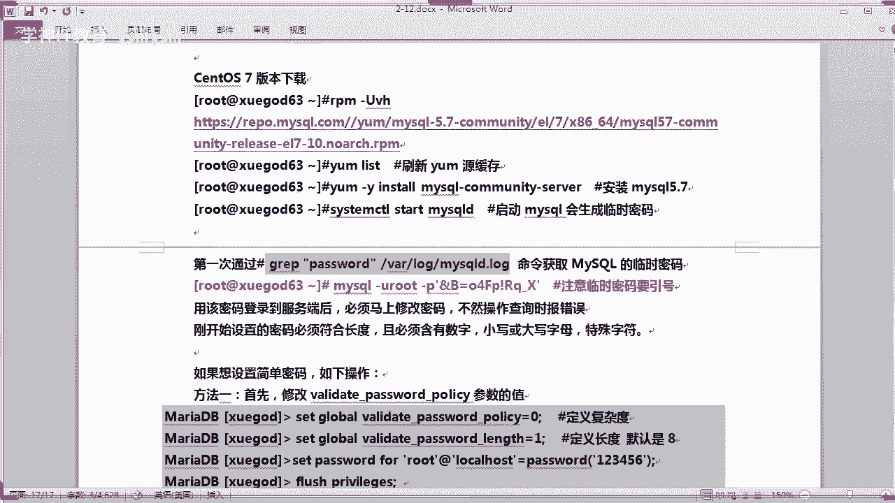

给你找找看。

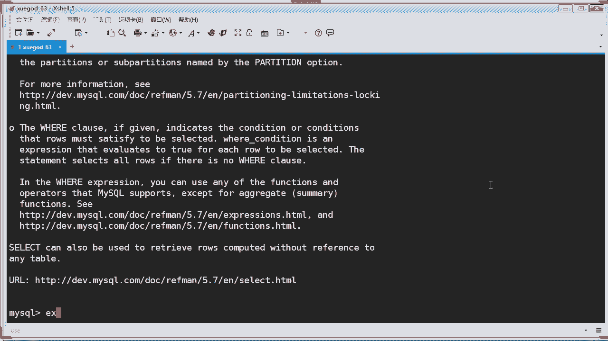

那这里你会看到有很多因为我自行操作很多，其实它也刚开始初始化的时候呢，它有一个临时密码，就是这里你查看第一个。这个就是临时密码，这个临时密码是不是有一些特殊符号啊，什么一杠啊啊，也有分号等等。

所以你如果你直接啊注意啊，有的同学直接这样去敲啊，把这个临时密码这样拷到后面，你说这样能够登录吗，肯定是不能登录了。因为它这里有特殊符号，所以你要把这个临时密码把它引号引起来啊，两边把它引起来。追意啊。

啊，把它引起来这种方式。才能够正常登录啊，这是你第一次安装的时候要注意的点啊，注意的点，老师提醒你了啊。O。当你登录完之后呢，你发现啊比如你要执行什么收命令啊，什么好像执行它都会有报错，会有提示。

为什么呢？因为他要这样他要说你首次登录一定要修改密码，修改完密码，他才给你操作一些scle语句。有没有发现？有吧，对不对？你没有发现这个问题吧。那然后你在修改密码的时候呢。

他还有个要求说哎你的这个密码不符合复杂程度，有没有这样提示？有吧你要有大写小写，还有特殊字符加数字，对吧？非常的操蛋对吧？哎，要这么复杂的密码，其实在生产环境它就是要写复非常复杂的密码，这样才安全。

对不对？才接近生产环境呢。但是我们做实验呢，就把这个密码设置为123456简单就好了，对吧？那我应该怎么样能够修改成123456呢，怎么办？有两种方法，那第一种方法呢。

就是啊修改它的这个复杂度把它降低啊，将你的这个复杂程度降低，你可以通过执行这条命令。定义了负载值6啊，把它等于0是吧？然后呢将这个长度设置为一，它默认长度是8的，你改成一呢，它就变成4个长度了。

123456的话就是有6个长度了嘛，对吧？完全符合要求，然后最后的话再来设置密码啊，这就是设置密码。那s pass for密码，你看这路？然后它本身是lock house的对吧？密码。

我改成123456修改成功之后，然后fresh，然后刷新一下你的权线表，然后再退出，你就可以通过简单的123456密码进行登录了。是不是？当然这种密码的话呃，这种配置是比较稍微复杂一点。

第二种方法呢是怎么做呢？直接把这个密码安全审核插件关掉它。其实之所以他要你修改一个复杂的密码，就是因为它maic5。7啊，它有一个东西在起作用啊，有一个插件啊，这个插件叫啊密码强度审核插件。对。

你可以把这个插件呢把它给干掉，怎么干掉，直接在你的这个配置文件，哪个配置文件在你的my配置文件里面去是吧，配置什么呢？将这个配置上去，那我打开我来给你看一下。

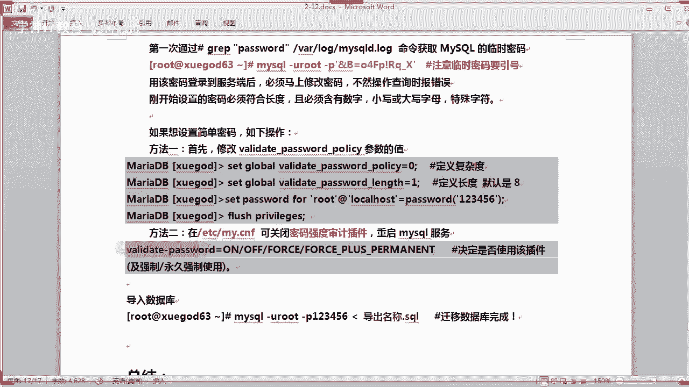

你看没有，我这里是不是有一行这个。有没有看票有？里面的没有吧，是不是没有没有你可以把这个配置啊，这个是啥意思呢？这个就是密码安全审核插件，你把它off掉off就是关闭的意思嘛，对不对？

如果你想把它开启的话，它默认是开启的。当然你也可以配置为on就是开启on开启的话，那么大一启动你的miccycl，它就自带了这个密码审核插件是吧？当然你配了这个东西之后关掉了。

你要重启你的miccyclq数据库，它才能够生效，注意啊，只要你在这个mic主配置文件改了任何东西，你要它生效，必须立即重启你的mic，它才能够生效。

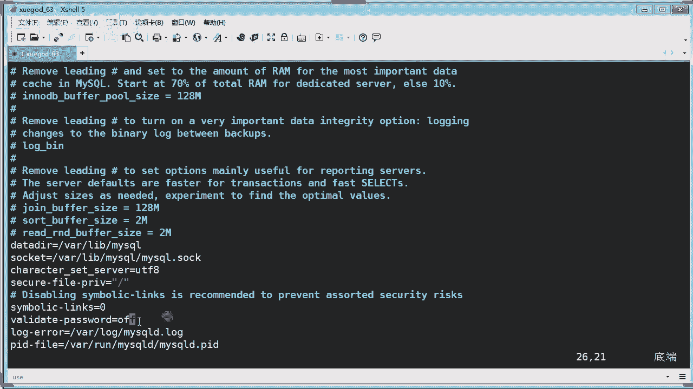

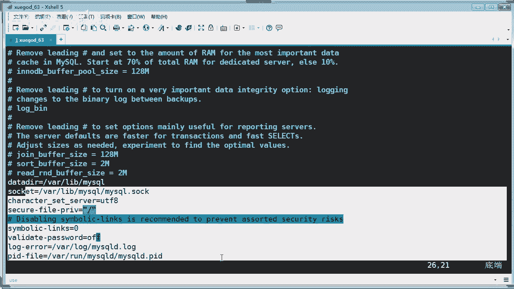

懂了吧？ok。学会了吗？那当然它还有一些其他的状态是吧？比如呃强制性永久强制使用，对吧？你也可以写成其他状态，一般我们on off就可以了。OK那最后的话你再把你之前呃LDB下面导出来数据是吧。

重新再导入就可以了。当然关于这个数据的导出导入哈哈备份，这个后面我们还会讲，所以我这里先粗略的过一遍啊，粗略的过一遍，好不好？OK那么今天的话讲了cyclcle啊，其实内容的话还是挺多的是吧？

主要是一些cyclcle啊，关键这个语句的用法啊，还有语句结构啊，mycyclcle语句常用啊，还有最后的话是怎么样去在安装my5。7要注意的地方啊，给你们提一提啊。OK今天的话就讲这么多，同学们啊。

辛苦了。各位。

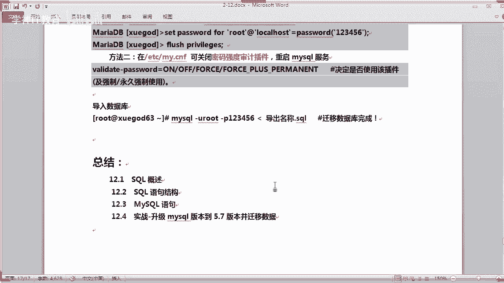