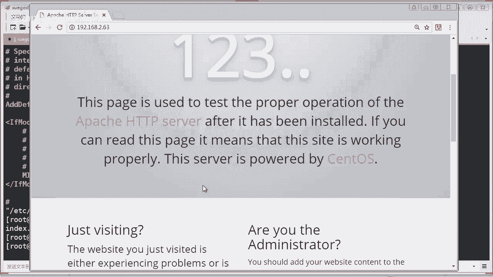

# Linux／Linux运维／RHCE／红帽认证／云计算／Linux资料／Linux教程--apache安装配置 - P1：apache安装配置01 - 学神科技 - BV1aC4y1h7cR

同学们，今天晚上的话是你们第二阶段的第六章啊，也就是第六节课啊，讲什么呢？讲使用阿帕奇搭建一个weber服务啊weber的网站服务器啊。

我们会涉及到讲阿帕奇的理论还有怎么样去配置这个weber服务器是吧？要搭建一个叫LMP环境啊啊也也可以叫叫l环境是吧？环境，那么这个环境呢其实是最常用的一个什么呀一个一个环境的啊。

那么修改这个we网站的这个相关的一些配置，比如像该目录啊配置别名啊虚拟目录等等啊，这些一系列我们等一下会教大家啊，就实现一个阿帕奇是吧？打开远链接的功能啊，还有一些其他一些禁止类的啊。

比如使用用户认证啊等等这些功能的实现啊，都是比较基础类啊，还有讲一下这个虚拟机是吧？虚虚拟计划其实我们可以基于IPG端口是吧？还有基于域名三种啊三种方式来实现。

其实这些东西在我们工作当中都是非常啊非常什么呀，非常实用的东西，对不对？所以同学们听好啊，这一节课啊，好好学一下。稍等，老师啥意思？不是这个吗？你搞错了吧，但我我这边显示的是这个哦。

你看我这个课堂显示的是这个是不是。嗯。你这是哪里的呀？你看网盘吗？你打开链接看一下。你说老师是不是讲讲错了这个课程，对吧？你打开一下啊。为什么我这边显示的是讲这个第六章？等等啊。应该改了吧。是这个来。

我给你看一下啊。

嗯，这个。对吧。那3月14号对吧？就是今天晚上讲的是阿帕奇，没错啊。对吧明天呢啊不是明天，应该下嗯后天是吧？星呃，星期六我们在讲那个无缘值守安装。对不对？啊，我是按你这个你这个最新的这个这个课程表。

1812班对吧？你们最近不是购买了这个两分钱的链接吗？所以这个链接的话应该是最新的是吧？O。啊，所以我们按这个课表来讲啊。都没有问题是吧？反正啊后天就讲这个了嘛。😊，嗯，好的，你看的是之前的是吧？OK。

😊。

好嗯。那该讲了啊，我们主要讲啊以下五点内容，对吧？啊，这里的话啊跟同学们先打个招呼啊，注意啊，本节课呢是用RPM包来搭建这个浪环境啊，就是LAMP环境。

主要是让同学们初步了解一下相关的概念和LAMP环境的功能。后期呢会大家用源码编译的方式来精讲LAMP和LN呃这个LMMP环境啊。两个都会精讲是吧？包后面啊后面包括呃现在第二阶段，第三阶段对吧。

都还会讲这个对吧？都还会涉及这方面的内容啊。因为在咱们工作当中，这个东西用的最多嘛，对吧？包括环境搭建啊，调优等等啊，后面都会讲啊，今天有同学说，哎这个东西以后还会被细讲会的啊，会的啊。好。

那今天的话我们准备一下啊，两台虚拟机就可以了啊。呃，讲到webo的话，其实大家同学们都知道是吧？呃，最早前我们用的是windows下的weber是吧，是什么呀？IIS对吧？IIS对不对？

那么其实在linux下的这个web呢呃更为强大啊吧，更为强大，那web服务器呢它称为什么呀？😊，万维网是吧，叫呃ru right web是吧，这个。就三个33个W啊叫万维网服务器是吧？

那主要功能呢就是提供网上信息浏览服务。OK那么长见的vivo服务器呢，以前我们用的是IS，你看我这里啊，这里有是吧？以前vidows用IS对吧？O。那么现在基本上的话都使用什么呀啊。

在linux建立的weber服务，像这个阿帕奇呀engs啊，还有tonkey啊等等，对吧？当然还有一些啊收费类型的那种商业web软件啊，对吧？那么讲到weber软件呢，你肯定要有客户端啊。

客户端就是浏览器了对吧？那么浏览器现在五花八门啊像IE浏览器啊，火狐啊，谷歌啊啊360啊啊是吧？搜狗啊等等各种浏览器层出不穷是吧？多的是啊，O。那么今天我们的主角呢主要讲这个LAMP啊。

就是在linux下搭建一个阿帕奇的weber服务。还有呢我们再装一个mycycl服务器是吧？然后再把这个PHP啊PHP的这个东西，这个语言是吧？装上去啊，就装1个PHP环境嘛啊，OK。

以后人边别人问你话LMP环境是什么东西呢？基本上你可以这样讲，对吧？但是呢他也还可以这样讲啊，比如linux下的阿帕奇加mycycl mycycl或者是啊，都可以是吧？或者是PHPpython等等。

是吧？但基本上呢是以这这啊这三种帕奇和mycycl和PHP为主。O。那。那这个LMP的话是一组用来搭建动态网站或者是服务器的开源软件啊。你看这些都是开源软件。对吧本身都是各自独立的程序啊。

但是呢因为常被放在一起使用啊，真的他们都相互关联对吧？啊，拥有了越来越高的一个兼容度，共同组成了一个强大的应用程序平台啊。

随着开源潮流的蓬勃发展开源开放的源代码的MP已经和这个J to e和啊这个当代的商个软件形成三组鼎立啊，三组鼎立的知识啊，并且啊该软件开发的项目在软件方面的投资成本非常低。

的确是啊啊毕竟开源的软件的话啊成本非常低，对吧？你像这些收费的软件的话呢有收费比较成本比较高啊，因此受到整个ITJ的关注啊，从网站流量来说，50%以上的访问量都是从LMP啊LMP这个环境来提供的啊。

所以LMP的话是最强大的网站解决方案。当然后面我们还讲到什么呀？LNMP对吧？也是非常强大的啊。那什么是阿帕奇呢？阿帕奇呢？它就是一个什么呀？就是一个weber服务软件啊，对吧？

阿帕奇啊hP啊sever简称为阿帕奇是什么呀？是阿帕奇软件基金会啊，你要知道阿帕奇软件机会它是一个非常庞大机会它不单只是做一个we服务它还做很多你像是啊啊这种大数据的软件都是他做的啊。

后面你还会接到很多很多的像这个SVN啊对吧等等啊，都是阿帕奇软件机会旗下的一些软件啊，O所以它是一个什么开源的啊网页服务器可以在大多数的这个计算机操作系统中运行。由于其多平台和安全性被广泛使用。

是最流行的weber服务器软件之一啊那它快速可靠并且通过简单的这种扩展啊，将什么on等等解释啊，包括这个什么P解释编译到服务器当中。啊，那么阿帕奇服务器呢是一个模块化的服务器。

各个功能呢是用模块化进行插拔，对吧？就相当于唉你我要装什么东西呢？我可以加一个这个模块上去，哎，它就支持了，对吧？哎，你要支持PHP是吧？我把BHP搞进去编译进去，哎，它就可以支持啊。

目前支持windowslinux还有unix等等平台啊，多平台是吧，跨平台就可以嗯。同学们记住啊，这个阿帕奇软件机费是非常庞大的一个组织啊，专门运作一些开源软件啊，是吧？所以我们要感谢阿帕奇啊。

OK它是一个非营利性的组织啊。那么这个开源软件项目呢，就是阿帕奇的一个项目。那么我们的这个HTB啊，就是现在讲的这个阿帕奇也是阿帕奇远这个开源项目之一啊。OK那讲到开业项目呢，其实有很多啊。

多的数都数不清啊，这里只是举个例子是吧？像HDPC啊，这个antDB啊，对吧？还有等等等等啊。你看堂K啊哈杜op啊等等，这些的话都是开源文件啊。

那最有名的就是我们现在讲的这个阿帕奇啊HGTBs的一个服务原件啊。好，你看一下阿帕奇的官方网站是这个，你们打开看一下啊。看一下啦。那这个就是阿帕奇的官方啊官方网站啊，你看到没有？虽然是全英文的。

看不懂是吧？没关系是吧？那他有很多的软件啊，对吧？多的数不清的开源软件。真的现在来说啊你看有HVD啊，对吧？各种各样的啊。都有啊，还有像堂K啊，对吧？那当派的话，你看这里啊啊通k这样的话。

你就可以打开这个通派的官方网站了啊。啊，有点慢。好，那这个软件的话，我们知道它的官方网站就可以了，是吧？以后的话你可以上去下载一些什么，包括MBM包啊、源码包等等各种的软件包。

你可以到上面去下载就可以啊。你看这个是啊奇软件基基金会旗下的一个通通也是非常非常强大的一个什么呀，非常强大一个we啊。后后期的话我们也会讲这个东西啊啊OK嗯。什么是mycycl是吧？

mycycl呢是一个关系型的数据库管理系统啊，它是由瑞典myqB公司开发啊，目前属于acle旗下。你们知道oracle已经收购了mycycl吧。有没有同学不知道的，应该知都知道啊。

它也是最流行的关系型数据库管理系统啊，特别是在we应用方面啊，是不是关系型数据这种，它通过数据关系对数据的约束三者组成的数据模型来存放和管理数据啊，你也可以看一下这个mycycl官方网站。嗯。

my官方网站啊。像这些呃，我们以后的话还会细讲哦。你可以打开看一下啊。啊，现在的话它属于什么呀？属于这个。or口啊or口的旗下啊，属or口公司的，对不对？嗯，那在oracle的领导下的话。

他也推出了很多一些像cster rot等等啊，各种的中间件啊都有啊。当然他也不断的强大。虽然说这个东西的话，他现他本来就是开源的嘛，对吧？卖给了这个orle公司之后呢，目前也是在开源。

但是呢他也提供了一些有偿的服务，对吧？我们知道现在不是有第三有有分支嘛，MDB对吧？也是什么呀？也是mycyclco的这个这个发明者，是发明者，对不对？来做了一个创建的一个分支啊。

OK我们先了解一下了基础啊，后后面我们再讲啊什么是PHP啊，来看一下PHP的话是一个什么呀超文本易处理啊，其实它就是一种语言是吧？是一种通用的开源脚本语言，看见没有？开源的啊语法吸收了C语言java啊。

还有的特点啊，有利于学习使用也是非常广泛的啊，主要适用于web开发领域啊，对吧？咱们班有没有有没有做这个PHP开发的呀，有没有？PHP独特的语法啦混合了这种啊C语言java啊。

还有这个p以及PHP自制自创的一些语法。有是吧？乐生勿仇同学啊，你是做PHP开发的，对不对？那不错啊啊，那其实你做开发的话来学运维其实啊也是蛮轻松的啊。因为对语言的东西的话，语法规则对吧？

这些东西你是非常了解啊，对吧？那它可以比这个CGI或者是p更快速的执行动态的一些啊网页，用PHP做出的动态页面，以其他的编程语言相比，PHP是将程序嵌入到这个什么呀H啊H文档中去执行呢。

执行效率呢完全生成H标记啊。要高很多啊，也就是比那种啊直接这H level写的代码的话，要这个效率高很多啊。PHP呢还可以执行什么？编译后的代码啊，编译可以达到加密和优化代码运行啊，使代码运行更快啊。

老师，我看回放什么意思啊？你看什么回放。啊，简单来说啊，PHP就是一个脚本解释器啊，其实它不但是一个什么呀语言的解释环境。同时呢它也是一啊一门语言，对吧？啊，官方网站里面自己看一下就可以了。好吧。

PHP服务器安装之后呢，升级且注意不要盲目升级，因为它会废弃很多啊低效的一些语法啊。你升级的时候，你要首先了解一下它这个版本的话，到底支持什么，放弃了一些什么，对吧？要去了解一下啊。来看一下啊。

咱们这个LMP啊，它是怎么样工作的是吧？我们把这什么app帕奇啊，mycycl啊PHP联合起来，它到底是怎么样工作的啊。比如你一个客户端，就像我这台PC啊，我要访问一个页面，对吧？我就会发送一个请求。

那么发送请求他是发到哪里啊，就交给你的weber服务。那么这里weber服务呢，比如假如是一台阿帕奇的weber服务，对吧？假如你访问的是PHP的页面，对不对？那么呢它对于PHP的文件呢。

它就使用这个模块是吧，进行解析，看到没有？解析后的H量的文件呢，它又返回给阿帕奇。阿帕奇呢最终的话再返回到您的PC客户端。那么这个时候呢，你就会看到什么？看到非常漂亮的网页了，对不对？

是这样的一个过程啊，过程。OK。我们知道啊基本上我们的我们学习的这种web服务啊啊，一般默认端口都是80端口，对吧？80端口啊，还有这个443是吧，就是HTPS是吧？这种加密访问的端口啊，两个端口为主。

现在目前网上大部分都应该都加密访问了吧，包括百度163是吧？腾讯啊，都应该都是加密访问了哈。OK好，那么安装这个阿帕机很简单是吧？使用这个ym杠Yint HUD就可以安装了，非常简单。啊。

有同学说8080也也是比较常用是吧？其实8080的话不是很常用。8080一般啊是那个tonca的默认端口，对吧？啊，一般你对外的话啊都会改成80端扣啊。内部使用的话，可能会使用8080啊。OK来。

那我们来看一下啊，安装一下这个阿帕奇啊，安装阿帕奇的话它会涉及啊几个依赖包是吧？包括它的主程序包啊，这个就是它的主程序包，对吧？嗯，目前是2。4。6的版本了啊，还是蛮新的，还有它的什么开发程序包啊。

也是它的一个依赖，还有什么啊阿帕奇相关手册，这个包，也是包含应该还有一个叫工具包，对吧？这里哎，这里没有写是吧？还有一个HBt的一个工具包，它也会给你安装上去的啊，O。好。嗯。

那么现在的话我们先通过IBM包来来安装啊，后期再教同学们怎么样去编译安装，好吧嗯。好，来，我先装一下。

那我就拿63这边的话做一个服务端，对吧？哎，当然了你要配置好你的什么呀样母源啊，样么源，你才能快速的使用样母方式进行安装，对吧？HTTPD啊这样子。同学们，我们已经看到啊是吧，它总共有5个包。

你看啊嗯唉不止512345，哎，正是5个是吧？他刚才讲了HTB toolss这个这个是工具包，他也帮你装上了，还有它一些依赖啊API对吧？API库啊，还有一些其他的也帮你装了，对吧？都是一些依赖。

他也帮你装上去了啊，OK。好，装完了之后呢啊我们再把这个什么呀，装一个浏览器。linux下的这个什么呀字符界面的浏览器啊，比如像这个ellink这个。对吧。这个安装也是非常快啊，安装一下这个。

啊，字符界面下的浏览器客户端啊，ellinkux啊，这个有什么用呢？方便我们做测试嘛，对吧？比如你去到机房里面是吧？没有一台PC电脑，没有windows，只有服务器。那你怎么样测试网页呢？

你可以通过这个ellinks啊，来进行测试你的这个网站看它访问正不正常，对吧？OK。那这个的话安装完之后呢，你会看到这个目录下啊，有一个阿帕奇主配置文件啊。

ETC下面的HTPD下面的com文件有个HTPD点com文件，这个就是阿帕奇的主配置文件啊，也是核心的配置文件啊。来，我们装完之后呢，我们就可以启动它。

啊，你star一下HPD啊，这样子就可以启动了。那第一次启动的话，要稍等一下。好，启动完成之后呢，我们来看一下它的一个监听端口是吧，是不是80端口啊？80。对吧。HPD啊正在啊监听80。对不对？

没有问题啊，OK吧。那现在的话我们就可以测试一下我们这个网页能不能访问呢？是吧？刚才我们装了一个elink啊，比如啊你当前的这个地址是多少？192。168。2。63。啊，OK你看到没有？

我们就可以看到哎，这个的话是什么东西啊？这个就是阿帕奇的一个测试页面，对吧？也是欢迎界面啊。同学说有同学说来晚了一点点，今晚讲什么讲阿帕奇，其实你并没有来晚啊，我们刚刚开始讲呢，对吧？不晚啊，OK。

是不是你看啊这样子的话，我就可以在linux字符字符界面下啊进行测试我的这个什么呀网站是不是通的，有没有问题，对不对？那当然了，如果你是用这个windows客户端来测试的话，肯定是啊。

很方便了，你直接输入IP地址。对吧2。63啊，你会看到这个tening是吧，测试的一个页面，看到没有？你装完阿帕t之后呢，它会有这样的一个测试页面，对吧？不同版本呢，它可能显示测试页面有点区别啊，对吧？

我们现在是2。4。6的版本。对不对？OK那如果你配好域名之后呢，将你的域名是吧，映射到这个IP地址。你输入域名呢，就可以看到这个页面了。对不对？O。好嘞。那测试没有问题了是吧？

我们使用这个elink测试也是OK的啊。那么接下来我们就来讲一讲啊，关于这个主配置文件的一些介绍。主主配置文件就是说我们来了解一下主配置文件啊有哪些东西我们应该要关心的参数。好吧。

来。HPD下面的话有个comf对吧？comf下面呢还有1个HPDcom文件，你看到没有？这个的话就是它阿帕7的主配置文件啊，然后把这个行号来显示一下。那么这里的话呃它的配置项还是蛮多的是吧？

来啊这里s就是什么呀？它的一个什么软件目录啊，软件运行目录的话，安装完之后，它本身就是在ETC下里面的这个HB这些东西的话，我们都不用再去配置它了，是吧？我们看一下下面我们主要讲一些实用的参数。

像这个listen是什么呀？监听端口，看到没有？第42行，这个东西就重要了，对吧？比如你要改它的监听端口，你在这里改，比如你要改成8080，那你就改成输8080，它就监端口就变成了8080是吧？

重重启之后呢，它会变，对不对？一般的话我们都不用改是80端口即可。嗯，OK。好，往下去看啊，嗯这个呢是一些啊加载模块的什么呀配置文件，对吧？这个呢我们一般都不用改的，默认就行了。然后这里呢运行用户啊。

他使用的是阿帕奇运行用户。没错啊，他安装完之后呢，会在你的系统里面创建阿帕奇的用户，包括组对吧？用户组都是阿帕奇。那么这些东西我们都不用改啊，如果是野码编译呢，可能你就要改了，对吧？嗯。

啊还有这个管理管理邮箱啊，管理者邮箱的话，我们也不用管他，对吧？嗯，看看啊，哎，这里有一个这样的东西啊，sever name啊，这个东西我们要管它了，对吧？这个东西干什么去呢？

它是做服务器的主机名的对吧？那目前呢他是注释掉了，你看没有？我们呢应该把它启用，然后呢填上我们的主机名或者是IP地址，知道吗？假如你有真实的页面，你可以填真实的页名，对吧？

或者干脆就写他的这个什么呀IP地址。那写你本机的IV地址是吧？它的端口肯定也是80端口，对不对？O。那这样啊这个就是什么呀？主服务器的主机名啊，你可以填域名啊。OK下面的话就是一些啊配置的模块啊。

各种模块的。比如这个模块区域是干什么啊，这样子，比如指定你的该目录是吧，怎样怎样啊，你看这里呢这个要讲一下119行啊，document root，这个是什么呀？网站跟目录，什么叫网站跟目录啊。同学们。

他就是在你的网你的网站放你的网站这个页面代码的目录，对吧？也就是说我们放一些程序代码的，就是放到哪个目录啊，就是放在这个目录。那么这个目录我们可以改嘛？当然可以改了是吧？这个只是它啊出厂默认的一个目录。

对吧？一般的话你可以改，也可以不改，这个没有问题，对吧？或者是我我可以啊新加一块硬盘，把它挂载了这个目录不就完了嘛，对吧？都可以啊，O。那如果改的话，你要注意前线了是吧？你要用阿帕奇的前线能够运行啊。

OK。那么接下来这里的话主要是对什么？对你目录做一些前线的东西是吧？前线的东西来，我们看一下呃，他做了哪些什么东西。你看啊，首先他对这个目录啊。做哪些东西呢？你看啊。😡，这个。

那像这个什么opation啊 in this，然后flowow什么 Sy links这个这是干什么用的啊，来这些的话我应该跟你们讲一讲啊，呃，这些就是有用的，主要它是做什么呢？啊。

比如开放这个目录浏览啊，目录浏览还有呢这个支持啊，用这个什么呀，远链接可以呢用链接啊。符号链接或远链接，就这两个参数。如果你的服务器你不想人家浏览到你的目录，那你可以把这个什么，把这个参数给删掉。

对吧去掉它。如果你不想呃实现一些功能，就是比如呃像链接功能，对吧？远链接功能，那你可以把这个参数对吧？去掉，对不对？一般默认的话，我们需要保留它啊，需要保留它OK。啊，有同学说哎。你的笔记什么看笔记啊。

什么意思啊？

你说我笔记我讲的东西可能跟笔记里有点不一样，是吗？哦，那有有些参数它排序可能不一样嘛。你看我刚才讲了80端口啊啊。PID这些没有讲是吧？其实这些都很难理解啊，也可以照着他来讲嘛，是吧？😊。

这个没有关系的啊，同学们。

那你可以搜索啊像呃什么PID有没有？PID啊，他没有这个东西，对吧？有这个的话，那你就他就是设置什么PID的嘛，对吧？啊，PID啊，这个是设置PID。啊，这里都没有没有配置，因为他默认的话。

出厂这些已经帮我们配好了就可以了啊。time out啊，来我搜一下，哎，time out的话也没有，你看没有？其实的话很多东很多参数的话，它没有写上去啊，是不是没有写上去啊，像这个ke。life。

我看一下有没有啊。哎，这个也没有，其实很多参数的话，它还在这里省略了。我这样子吧，拿这个笔记给你讲一下啊。

因为这些东西哦，我们后期我们可以自己写上去了。因为你要看官方文档的话，你就要去查很久了，对吧？比如如果你可以指定它的PID是吧？指定PID运行在哪个目录下也是可以的啊，对吧？啊O还有这个超时时间啊。

这个的话我们也可以配上去。比如超时时间啊，多少秒没有反应就超时，对吧？还有这个ke live的话表示什么呢？允许允许是否允许一个永久链接啊，设置为off的时候呢？不能保持什么呀？

不能保持连接功能传输效率低，一般设置为20，那么可以提高服务器的传输效率啊，建议开启它你看我们这里的话。他默认出厂就是用亚麻安装，默认出厂就没有这个参数是吧，他也没有写上去。O。还有其他这些参数啊。

像这个marske life啊，什么wecus啊，这个等于100表示什么呀？只有你上面这个设置为off的时候呢，它就有效了啊。设置客户端每次连接允许请求的最大文件数量啊，比如。

你一个客户只能允许请求最大100个文件书。对不对？这些我们都可以做一些限制写上去啊，还有这个超时时间啊，同一个客户端的一个请求。比如你设置15秒，如果你还没收到的话，那就超时对吧？超时就就连接就断了啊。

监听端口啊，OK还有这个。star service8啊，这个是说其中8个县程，对吧？其实这些东西的话很多没有配上去的啊，对不对？后期比如我们做一些优化的话，我们可以啊你再可以通过慢手册去查找一些参数。

或者是通过官方文档去看。哎，我有些东西我可以写上去，对不对？呃，有点不理解，保持一个链接不断的话，不是浪费资源吗？为啥建议开启？你说哪一个？来。你说这个吗？😡，是否允许一个永久链接设置为off。

因为你这个章就设置完之后呢，下面还有参数来控制它啊，还有很多参数控制。并不是说你把这个这里呢只是说功能开启，开启之后呢，我还要做一些细化的的配置的嘛？这位同学。对吧有很多的啊。嗯，OK没关系。

因为这个东西的话，你们刚开始接触的话，还有很多疑问，对吧？嗯。那很多了，你看见没有是吧？最小空闲5个进程，最大空闲20个进程，对吧？啊，其实这些东西你说你问老师，你说这些东西我要死记硬昧吗？不要啊。

千万不要我告诉你现就是现在你学完之后呢，一个都记不住都不怕，无所谓。你下次再来记住，你你去配的时候呢，你要知道哦，这个阿帕奇里面呢有很多限制参数。虽然我不懂，我可以找官方文档来是吧？把它加上去就可以了。

明白没有啊，学东西要活灵活用啊，千万不要死记硬背啊，同学们。啊，很多的限制参数的对不对？这里呢只是跟你讲一讲啊。那重要一些东西呢，我会教你啊，你要记一下啊。呃，像这个的话，比如可能还是比较常配置的对吧？

比如说设置它的一个什么呀，你要你要禁掉它的什么呀，禁掉的目录浏览，一般在生产环境呢都不允许目录浏览。什么叫目录浏览呢？来，我举个例子给你看啊。啊，这个哎阿里云的这个。阿里云的样目源是是多少来呀？

阿里云我看一下啊。找一下他的地址。阿li云。哦，我找到了这个。😊，那。是吧哦，这个的话它都没有显示，哎，我应该找1个163元。对吧。算了。他就显示目录嘛，你向哎自己敲吧。哎，163对吧？哎，你看。😊。

是吧就可以访问目录的嘛，对不对？看懂吗？是吧？那你这个目录下有什么东西，对吧？我们可以点进去看啊，就这样的意思。那这个不就是目录嘛？目录列表对吧？那如果你想别人看不到你的网站目录，对吧？

就不知道这里有什么。文件目录，那你可以把这个禁用掉，哪个禁用掉，把这个indice这个把它去掉就可以了。对不对啊，是的，记一下工作中常用的就好了。很多参数的，你不要去记它啊。OK那如果你要做一些啊。

比如链接啊，链接怎么说呢？等一下我们再讲吧，链接就说我可以指定一个虚拟啊，其实跟这个别名差不多，懂吗？原链接差不多啊，原链接，就像我创建一个一个符号链接，指向的是另外一个路径的啊，对不对？

我就要用到这个功能呢，我一般把它开启，对吧？啊，就这样的意思啊，alload这个的话设置一般是忽略什么头文件对吧？忽略头文件啊，比如我写一些什么重定向，法而写到这里啊，O。嗯，这些的话还是不太常用啊。

还有这个加载库的话，还有模块的话，也是基本上你不用管了，对吧？啊。com唉，这个要讲一下，同学们，这个一般在哪里呢？啊？在你的这个配置文件的最后面，我我拉下去给你看啊，你看到没有？

一般在你的这个这个配置文件最后啊，你看第353行会有这个它会进行加载这个什么什么什么，你看没有？它会加载这个c点第下面的这些配置文件，它也会进行读取，然后加载懂吗？下面应该还有像加载模块呀啊。

它也会写要这里啊，我看一下啊。

加载模块啊，你看哎，不是这个是一些执行的脚本哪等等，对吧？哦，加载模块应该在上面。哎，我刚才已经讲过，对吧？加载模块的那个。啊，你看这个是吧，这个也是第56行，你看。

比如他要加载这个目录下面的一些配置文件，对吧？有的人说哎这些配这些目录到底在哪里呢？这里带大家同学们来认识一下啊，哎，我应该保存一下先啊，对吧？我进到这个ETC下面的HPD，给你看一下整个目录。

你看没有？这个目录下是不是有这个有个子的目录，对吧？这个子目录下面呢就是放各种模块的配置文件的，来，我们看一下啊，f下面的这个什么mods对吧？你看有各种的这个模块配置文件。还有还有什么呀？

还有我们讲的这个cf点D下面这里的话也存放了各种。比如像虚各种虚拟主机啊等等一些配置文件。就是你写一些网站配置，也可以放到这里的哇，对吧？也可以放到这里的吧。当然呢。

如果你想读取这个这个子幕下的配置文件的话，那么刚才你那个主配置文件，你就要把这个开启是吧？你这个不能注释掉。对吧这个如果注释掉的话，它就不能加载这个啊这个模块的配置了。所以同学们要注意。

是不是有些同西说哎，我编译了个模块上去呢，为什么一直都不生效呢？因为你的主配置文件并没有启用引用索引这些目录，对吧？还有刚才讲了，如果你配了一些新主机是吧，是放在这个这个目录下的。你要去读取它。

你这里肯定是要启用了。如果你把这一行注释掉了，那就等于。什么呀，等于他不不会读取，因为他这个这个什么呀，这个阿帕奇它启动时候呢，首先是读取你这个主配置文件的，同学们要注意啊。一般的话。

他这里默认的话都是去什么去加载的啊。OK这一点的话要注意啊。所以说老师给你讲重点的东西，你记一下就好啊，明白没有？

嗯，啊，还有什么看一下啊，这个我们讲了是吧，这个是它的运行用户嘛，是吧，使用阿帕奇啊，这个是管理员邮箱也讲了document rootot的话，就是网站跟目录啊，就是你网站放代码的目录啊。

是最重要的一个目录了，对吧？O。嗯，那还有这个刚才也已经讲了，对吧？啊，还这个也讲。懂了吗？是不是啊？啊，还有这个什么other low的话，就是一个排序的一个什么呀，一个前限啊，后者这里默认后者生效。

也就是d奈生效。就说这里就是什么呀，拒绝允许对吧？他先拒绝掉再允许。但是后面呢有一个什么alload of from of的话，这里表明什么允许所有啊，允许所有老师麻烦把重要的标红属实太多了。啊。

你说参数太多了，对吧？不是属实太多了OK。可以呀，那。O。啊，这里呢也要标红。因为以后我们讲这源码编译的时候呢，这个也是非常重要参数。因为如果你不配合它的运行用户的话，那你怎么运行呢？对吧？啊。

这个要注意。好。有些参数没有注释。啊，咩意思？有些参数没有出示。没有注释的，肯定就是启用了嘛，对吧？😡，啊， ok。呃，来我这里的话再拿这里来讲一下啊，上面。

嗯。参数很多啊，对吧？你听我讲的这些就可以了。呃，来看一下这里刚才我们讲的是这个是吧。😊，OK那往下去看啊啊。😊，那讲一下这个。这个是做什么东西呢？他是他是一个什么呀？一个默认就首页文件对吧？首页文件。

什么叫首页文件啊？就是说咱们访问这个web服务的时候呢，它首先要读取哪一个第一个代码文件，这种叫就是默认的一个首页文件。比如我这个第一个代码文件呢就叫indice hTM。对吧他就会先读取这个明白没有？

那当然如果你有PHP呢，那你应该怎么办？对吧那你可以在这里添加index点PHP是吧？如果没有这个呢，它就读取这个，它会按这个顺序是吧，去读取它，对不对？那你也可以把这个indexPHP放到前面。

放到这个的前面下也是可以的。有没有问题？那么这种情况如果有这个呢，他就优先读这个。是吧。这个就是配置它的一个默认啊默认页面啊，默认的一个首页文件啊OK。注意啊，这个这个的话你也会用得到啊，是不是？

所以啊这个。

当然了，我们可以配像嗯其他的。那首页是吧。SS file name啊，这个是一个头文件，可以定义伪静态防盗链，这个的话啊不太常用啊，你知道有这个东西就可以了啊呃。支持的语言编码默认的话都是UTF8啊。

没错啊，这个东西基本上你也不用配啊，它出厂的话就是UTF8配置文件最后是虚拟主机的字段。其中你大部分字段做个了解即可，用到时候呢再去查，你看这里有讲到，看到没有？不要每个去记它啊，把重要记就行了啊。呃。

来我看一下下面讲什么。样么方式哎，这个我们已经。对，刚才我们是把这个ap帕奇装了，但是mycycl啊，还有什么PHP的话并没有安装。那接下来呢它这里就是要求啊把这个什么呀，把整个环境所有软件都装上去。

OK。这里值得注意的是啊，在我们sos6系统的时候呢，它依然使用的是什么myq5。1的一个版本，所以是装mecyclcle和me several啊。那么sos7的系统以上呢，它就切换到md B了。

为什么切换了喵DB呢？其实有很多的原因是吧？因为mexico毕竟已经被收购了嘛，对吧？那有可能呢这个mexico它可能有闭源的风险，什么叫闭源，有开源就有闭源嘛，对吧？

如果他把原代码啊不开放了以后新的版本怎么办，对吧？那么这个什么呀？这个开发者发明者，他创建了一个新的分支，对吧？新的分支的命名呢就以他女儿命名叫merly啊是吧？所以我们听到这个mer对吧？

他就是命名的一个新的分支啊，其实他也是mycycl，明白没有？他也是mycycl啊，这是客户端啊，这个是服务端啊，对吧？注意啊，同学们，这是一点区别啊，跟你们讲啊，如果你是用亚母在三6子器上是一种装呢。

应如果你要装mycycle，应该是写上这两个就代表装mycycle了。O。后面那个PHP杠mycycl的话是什么意思是吧？问的非常好。这个的前面这个PHP就是把我们的这个PHP的环境对吧？原装上去。

那么后面这个东西干什么呢？它就是一个连接模块。所以说你的PHP你要连接你的数据库mycycle，你是不是得有一个什么呀？有一个有一个驱动程序啊，就想你要打印打印啊一篇文章，那你就要打印机。

打印机是不是有打印驱动是吧？OK它就相当于一个驱动是吧？O呃。有些参数没有。老师执行这个ellinkux的时候出来上面的截图，但是物理机用浏览器访问。访问不了。现机使用的是调接模式。

桥接模式你肯定能访问的。你这个问题其实超简单的对吧？你要不去排摄的话，超简单。首先你你的PC机能不能拼通它，你像我这里。

我能拼成我这台虚拟机吧。你看一下他是通的。对不对？还有你如果通了说话，只通只是表示什么呀？ICMP通是吧，就是这个这个协议通。但是你的80端口，你要他通，他走的是什么？走的是TCP协议啊。

这些一些基础的网络知识啊，同学们TCP协议的话，那么也是TCPIP协议呃，访问80端口，对不对？那他有可能是你的这个信主机，比如你的防火墙限制掉了，你的Slin限制掉，不给他访问，有这个可能。

那你也可以通过像这种挑内的方式来检测，是吧？比如我现在访问网页是不是80端口，那我就检测我这个IP地址，它的80端口是不是通的？是不是这样检测，你看我的80端口是通的吗？如果你看到这个界面什么都没有的。

表示它通的。明白没有？看懂了吗？

对啊，还有防火墙，你肯定要啊，他肯定是要要什么呀，要关闭的，对不对？嗯，后面我们再教同学们怎么样去安装配置防火墙嘛，是吧，还有讲到的啊。啊，这些一些啊基础知识啊来呃OK。那我们把这个环境装上去好不好？

那。啊，来。

我就执行安装啊。好，保存一下，对吧？那执行通过亚方式安装。唉，这个其实我们已经装了是吧？我们在写在这里呢就多余了，对吧？也无所谓，反正它会过滤掉，帮我们过滤掉啊。然后呢再装上md客户端。

也就是mycycl客户端，再装上md，也就是mycycl看懂了吧？装上PHP啊，装上PHP连接这个mycycl的这个什么样模块，也就是驱动是吧？把它装上去。好，那稍等一下啊。装这个东西还是蛮快。

因为我们使用的是亚母方式进行安装啊。你看装完了吧，对吧？装完了之后的话啊，来看一下啊，它装了这个版本到底是什么呢？MDB的话是。5。5的是吧，5。5。6看没有？PHP的话是5。4啊，OK5。4啊。

我们可以看到啊。好嘞，那你可以输入这个PHP杠V看一下，对吧？看到没有是5。4的对吧？OK然后mycycle杠V看一下啊，my杠V它输出的是什么呀？5。5。6的MDB版本啊，OK就可以查看它的版本啊。

好。那么整个环境这些东西我们已经装上去了，装上去之后呢，我们应该干什么呀？阿帕行里是启动了，对吧？但是mycyclco你并没有启动，这里呢是什么呀？这里是M B对吧？我们应该启动的是。Mly。DB对吧。

是这个啊OK那我们启动一下。好，第一次启动啊，稍等一会啊。那还有呢我启动完成，我们应该把它。如果生产环境的话呢，你应该还把它开启。对吧。对不对？把它开就随机随机系统啊，把它也也设置一下啊。OK。好嘞。

那现在mycyclq能够登录吗？来，我们测试一下，哎，它是可以登录的，你看见没有？直接敲mycycle，它就登录了，对吧？那我们看一下这里面的话有没有数据呢？是吧？show database的话。

我们可以看一下它总共有4个数据库，一个是什么information schema，还有mycycleperformation sche，还有test库，对吧？啊，总共有那上面这三个呢其实都是系统库是吧？

系统库呢是非常重要的，你不能删除它啊，不要去动它。是吧，就相当你的windows的注册表样非常重要，懂吗？task库的话是用来测试的，你就可以干掉它，对吧？这个无所谓啊。O。好，那你你装完之后呢。

其实我们可以做一些呃安全优化。做安全优化呢应该是执行什么呢？比如现在mycyclq没有密码是吧，直接敲就可以登录了，非常不安全。来，我们给个给他配一些密码，还有删除一下这个测试库啊。

还有不允许这个root账号隐程登录等等一些安全。那你可以用这个mycycl。这个什么呀？有一个安全配置的一个命令啊，你看。啊，这个的话是做啊也是相当于做什么呀初始化安全初始化的一个一个什么呀？

一个动作来，我们看一下执行一下它，它就提示你啊，比如做什么东西呢？他说输入root账号的密码。同学们，这个root账号呢并不是你linux系统里面的root账号。

而是mycyclqq的超级管理员账号也用也是什么呀？也叫root，要，注意啊，那你的root账号有密码吗？你现在是没有，那你直接按回车。好，按完回这之后呢，既然你没密码。

他问你要不要给你的root账号设置密码，注意这里的root就是mycyclq的账户啊。要不要要的话，你可以直接按回车或者是按一个Y是吧？好，你既然要密码的话，那请输入新密码是吧？

newpass word啊，那我就输入一个简单的密码啊。因为我们是做实验而已啊，123456。生产环境你肯定要配置一个复杂一点的密码。好，再输一次。OK输完之后呢，它提示什么呀？你的密码更新成功是吧。

成功看到没有？然后接下来他又问你什么东西呢，是吧？一大堆啊，你不用操心，这里提示的是是否移除匿名账号匿名用户啊，是吧？匿名的这些用户，我们肯定不需要，假如你的系统里面你的ms里面存在一些匿名中。

我应该把它删掉，对吧？干掉它安全嘛，对吧？好，接下来他说是否就是。什么呀。关掉这个root账号的远程登录，就禁止root账号远程登录。为什么要禁止rooter账号远程登啊？一般来说它是什么呀？

myq的超级管理员，它的权限相当的大，一般我们都不允许远程登录，只能在本地登录，明白吧？在本地登录是没有问题的，但是不能通过远程远程登录，你可以再创建个账号嘛，对吧？OK好，我们禁止掉它对吧？

直接按回车或者数据Y都可以啊。好，往下去看呢，这里这句话表示什么意思呢？是否要移除这个测试的数据库。对吧。移植测试库对吧？那我们就移除掉它是吧？也要刷新一下我们的这个权线表啊，OK。喂hy。

OK那这样的话他又移除掉了啊。好，往下去看，他说是否刷新前限表。好，我们也要刷新一下权线表，对吧？因为我们刚才又删了东西，又改了东西，现在就要刷新了。刷新完成搞定是吧。

thanks for youMDB啊，感谢您使用这个什么呀MDB数据库啊，这样就配置完成了。那这个时候呢同学们，你直接敲mysq还能登录吗？肯定不能登录。因为你刚才设置的密码是123456。

那你应该怎么登录mycycl杠U是吧？rootot使用root账号杠P密码是123456啊，注意是这样才能登录了，看到没有？那我们再看一下，现在登录成功，我们看到只有三个数据库啊，刚才是4个的。

那么有一个task库呢，就被我们移除掉了，删除掉了，对吧？就没有了。O。看到没有就可以了。好，那这个的话是什么呀？是啊mycycl啊，对吧？好嘞，我们mys的话呃，现在也已经是吧安装好了。

测试也没有问题了啊。来，我们看一下这个什么呀？阿帕奇啊，阿帕奇，他不信你不是把PHP装上去了吗？对吧？我们来测试一下PHP的页面能不能正常解析啊，能不能正常解析，我们就可以啊进到这个。😊。

哇下载3个W下面的HDM下面啊，你看到没有？这里这个是网站跟目录啊，同学们网站跟目录里面没有任何的这个呃网页代码。那我们自己写一个网页代码好不好？为了测试这个PHP。正不正常？那我们应该写个什么呀？

写1个PHP的代码，对吧？我们写1个PHP的测试的一个页面代码，好不好？就叫indexPHPO。啊，写一个简单的。那PHP是吧，然后呢，PHP in。这个呢是一个探针啊，就是可以检测是否支持PHP。那。

就这么简单啊这么简单啊，保存并退出啊保存并退出。然后呢，重启一下你的这个阿帕奇。那。

对吧重启完成来，我们测试一下，同学们打开你的浏览器啊，然后输入你的这个新主机的IP。那如果哎如果你看到这个页面，恭喜你，你的阿帕奇已经能够正常解析PHP代码了，是吧？恭喜你啊，你看到它会输据详细的信息。

包括你的linux内核啊、版本啊啊等等，支持的一些模块呀，哇，很多东西都很多常用的一些信息都在这里，对吧？反正你看到这个页面说明。你的阿帕奇能够正常是吧，正常解析PHP的页面啊，正常解析PHP代码了。

好吧，OK。你们做成功了吗？锤实的话。不难对吧？真的不难啊，来，我们看一下笔记啊，是否支持这个PHP我们已经测试成功了，没有问题，对吧？这个就是PHP的一个探针测试。什么叫探真是吧？来看一下啊。

1个PH编写的文件可以实时查看服务器，比如将这个磁盘资源啊，内存占用网卡流量系统负载等等这些信息是吧？并且定时刷新啊，包括浏览呃服务器的IP呀，环境检测啊等等些信息都在这个页面可以看得到OK。

我们也叫他一个叫PHP探证的一个页面，也可以叫一个测试页面啊。一般做运维的话，你肯定是要什么呀，都会写到这个页面的啊。都会写到这个页面做来做什么？做你做的这个PHP页面的测试，好吧。注意啊，同学们。

这个你做原维肯定要会写这个很简单吧，OK。好。啊，往下去看啊，来我们来实战几例啊。比如我们搭建了一台webo服务了是吧？现在呢我们要做一些配置来实现一些限制功能，看一下怎么样做，对吧？

比如像这个这里举了一个案例，对吧？我们搭建好了这个web啊，首页呢要采用什么index h channel没问题，对吧？啊，管理员改成这个也没问题是吧？网页代码改成这个对吧？

然后网站该目录本来就是在这里啊，我们都不用改啊，来，那我们来设置一下。

OK那么这节这节课的话是非常轻松的对吗？啊，不过有一些重要的参数，你要记一下就可以了啊。来，我们打开一下这个。😊，主配置文件啊。com文件下面的HBTcom啊，打开它还是它，对吧？还是它啊。

那如果你要设置它的阿帕奇跟目录，我们刚才这个东西本来就是好的呀。这个是什么呀？阿帕奇的运行目录，注意啊。对吧一般的话我们都不要改它了，对吧？鉴定端口80啊已经都好了，没有问题了。那这个。

还有什么运行用户我们也已经改了是吧？那这个是什么呀？管理员的这个。这个这个这个这个邮箱哎，他说按照他笔记的话，你也可以改掉他，对吧？比如cad。爱的。😡，学挂点C对吧？OK我们就按它来做吧啊。

然后设置web主机名监听端那个seven name对吧？这个。是吧如果你要把它设置成啊，我就是2。63嘛，这个我已经设置好了，都不用动它，对吧？然后还有那个那个默认首页文档，对吧？

默认首页文档其实我们也已经设置好了，对吧？还有这个document root，就是网站的跟目录啊，我们也设置好了，本身就是这个嘛，对吧？我们都不用改它啊，OK。嗯。那还有什么东西呢？😡，看一下啊。

对吧网站跟目录是inexH加码啊，这个不是这个默认首页啊，对吧？还有这个。UTF8就说设置它的一个什么呀，默认编码。默认编码在哪里啊？同学们。啊。默认编码来，我搜一下，如果有这个参数选项。

我就不用再搞了啊，叫CHAR。对吧sad。哎，有你看没有？在这里。ADD default，然后叉s啊，它默言的话就是UTF杠8，对吧？那字符编码已经设置好了，我们也不用管它。搞掂了哇。

没有毛病啊没有问题，就这几项的话，我们都搞定了，对吧？OK那么我们现在的话再来。😊，做一些其他的一些啊限制。啊，我先保存退出，对吧？那同学们，你们知道啊。

如果我们刚才没有编辑那个什么没有编辑这个NPHP页面的话，那假如啊我把它移掉NSPHP是吧？我移到OPT下面去，对不对？那你在访问页面呢，它还有吗？它就变成欢迎界面了。

那有同学说我要我不喜欢这个欢迎界面，你能不能取消到这个阿帕奇的欢迎界面呢？可以，那怎么办呢？

来在哪里去取消呢？啊，这样子啊。在这个ETT下面的HP下面有个什么comf点D下面啊，你看这里有很多文件，其中就有一个叫什么呀？welcome come啊，这个就是欢迎界面的配置文件。你打开它啊。

如果你不想它显示出来，那你就把什么呀？把这四行注释掉它就可以了。O。这里。那你使用这个是吧多行注释。那。这样啊你把这个注释掉。然后呢呃你再重启一下你的阿帕奇就可以了。HBD好，重启一下它。

没有报错，对吧？有报错，你要去解决报错，对吧？来，我们再打开这个欢迎界面，刷新一下，你看它变成什么就变成这个样子了，对吧？indice of什么什么？就像刚才我们看那个什么呀。

看那个那个亚母原是一样的对吧？因为我们现在开放的是什么呀？开放的可以显示这个目录列表。虽然说没有目录，它就是空的。

对不对？这样的话就没有欢迎界面了啊。嗯，OK。好，那如果我们写一个欢迎界面啊，呃比如我们就在这里写吧，写个inex点HTL对吧？我们自己写1个HC的一个页面代码文件，看一下啊，我们写什么东西呢？😊。

Welcome to。学啊雪崖。啊点先。这样可以吗？我们就写到这里啊。

好，保存并退出。来，我们来刷新一下页面啊。你看。是吧我们就看到我们写的这个什么呀，这个页面了，对吧？内容都可以看到了OK。😊。

看懂了吗？这其实没有什么难啊。ok。那好嗯，我们先讲到这里，好吧好，先讲到这里啊，先休息一下。我们课前休息10分钟，然后回来我们再跟同学们继续讲啊，继续讲什么来？讲we博的一些其他的一些设置，对吧？

比如像什么别名啊，虚拟目录啊等等。

O。😊，9点43吧，再讲。

