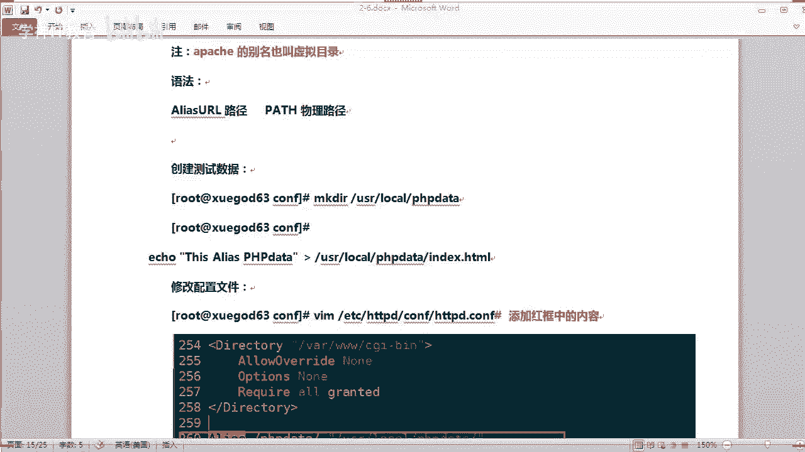
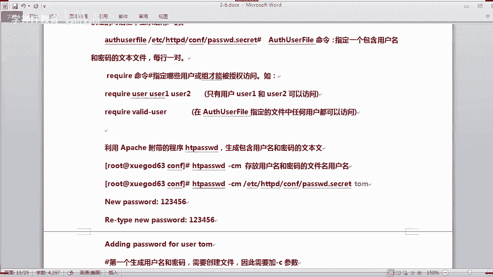
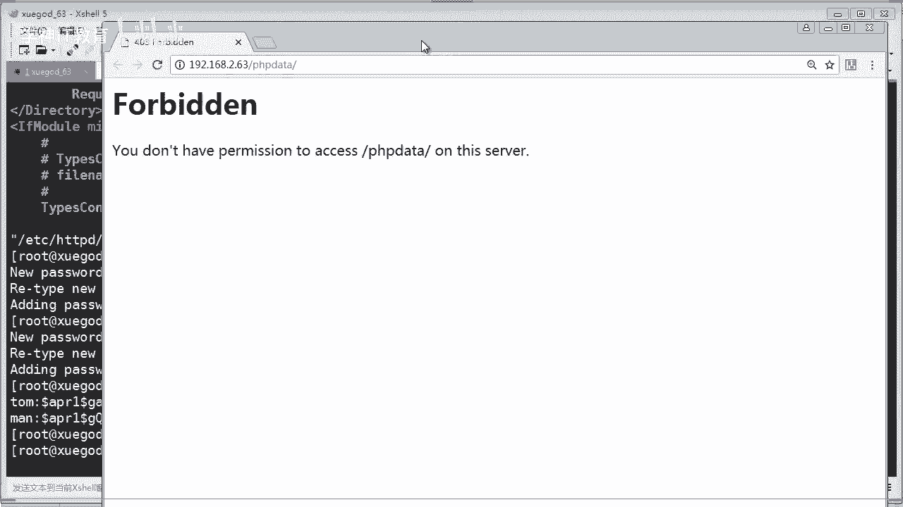

# Linux／Linux运维／RHCE／红帽认证／云计算／Linux资料／Linux教程--apache安装配置 - P2：apache配置功能限制虚拟主机等02 - 学神科技 - BV1aC4y1h7cR

接下来我们讲一下啊，怎样去修改这个相关的配置，实现一些啊怎么样。想别名啊虚拟目录啊。OK哎，刚才那位同学搞定了吗？其实你那问题应该很好解决是吧？😊，端口不通，那你看一下防火墙啊。

Slinux啊等等这些东西啊，对不对？就可以了啊，问题不大啊。那么这个la环境的话呃，几种不同的安全访问机制实现，我们应该怎么样去设置一些权限呢？是吧？来，我们看一下怎么样去设置啊。

比如这里的话修改网站默认的一个根目录，对吧？你可以修改它。

那。像这个对吧？只要我们来往那个目录，你要修改成其他的目录，那你就可以呃在上面去修改啊，但是要注意一下相关权限也要配置一下就可以了啊。来，我们看一下啊。

是哪一个配置文件呢？啊，还是这个主配置文件，对吧？IHDPcom文件对吧？那我们从上面开始啊，首先你的网站跟目录应该是什么root这个什么什么的对吧？docom rootot啊O。在这里对吧，在第。

119行对吧？119行啊，那么我们可以在上面的话，比如你要改成。改成。你要的这个什么网那个目录就可以了。比如改成BBS对吧？或者是这个目录下，或者是其他的这个目录也可以啊，都可以改啊，都可以改。

没有问题啊。ok。好，那哎好。来，我们再看一下这个。

那。对吧我们笔记里话是改成哇下的3个WH天龙BBS啊，当然你也可以改成其他的目录都可以啊。这样的话就是你的这个网站的目录就已经变成变更成这个目录了，看到没有？OK。然后呢。

我们要对这个目录呢做一些访问的控制啊，访问的控制。那我要做一些什么样的控制呢？你来看一下啊，我应该做一些什么样的控制啊，OK。

来打开我们的这个对吧？首先我们已经定义它了是这个BBS的这个目录，对吧？那我现在话要对这个目录控制的话，首先你要看下面这个。这里呢有一个什么呀目录，对吧？我们应该也是对这个目录进行一个控制。

我们直接改它也可以。那比如在这里是吧，我们也改成baBS。哦打错了是吧，PB对吧？那我要对这个子目录进行控制的话。我要写上一些什么参数呢？像这种对吧？比如我不允许他这个目录浏览。对不对？那我就把什么呀。

我就应该把这个删掉。这样的话他就不会列出我的目录列表给别人看了，对吧？别人就无法偷窥我的这个目录有什么东西，有哪些目录啊，对不对？那这个链接的话，我们保留它对吧？链接保留它啊，那还有哪些权限呢？对吧？

像这个alloadover right这个什么东西啊？这个是可以什么呀？这个的话可以啊，比如你要使用一些啊啊什么重写功能啊是吧，这些配置。那这个的话我们可以先不配它啊。然后往下去看啊。

往下去看的话是什么呢？这里没有了，对吧？那么其实很多参数刚才说了，你我们可以通过看慢手册去去编辑它就行了。比如我们写上一个啊。你还记得吗？比如像alder。哦。就是对吧。然后lo。是吧允许，然后呢，d。

对吧这个。OK那么你配了这个这个的话，你要记得啊是吧？那接下来我们应该配一些东西的话，你要允许你不然的话，他就是默认就拒绝掉。那你这个网站你就访问不了了。对不对？比如你要配一个al。

对吧允许允许哪些哪些来源啊，比如我允许192。168。2。0的来源啊，比如这个网段的来源，那么也就是说只有这个网段的这些啊来源才能够访问我的网站，对吧？

那么其他的那些就这个之外的那些IP地址都没有办法访问。对不对？这个就可以限制从哪里来，允许从哪里来，对吧？当然你也可以去配一个，比如像丁net。对吧并奈的。d那什么呢？d from。

对吧date from的话就是拒绝从哪以来。😡，比如我要拒绝从这个这个IP啊，这个网段。是吧。那这样的话，这个网段来访问的话，他就是被拒绝的，没有办法去访问。对不对？这个看得懂吗？来。

当然我没有这个网段，我是举例子给你听，对吧？来，我把它注释掉啊，注释掉OK我们还可以配一些呃，比如像这种啊。不单只是说IP地址啊，你可以配一些域名，比如allo是吧，允许允许从哪里来，比如这个点百度。

他说允许从百度点com来源的一个访问，我们是允许你你们经常会去百度搜索一些内容是吧？搜索完之后呢，你直接点那个搜索，然后呢它就会跳转。跳转呢这个时候呢就是来源百度。对不对？你只有配了这个东西来源百度。

它才能来源。但然你不配它，它本本身也是来。那如果我这里写成d奈呢？就说从百度来源来访问，他就被拒绝掉了，你说对不对？可以这样去设置啊。O。😊，注意的是这个这个allow定的话啊，它的一些用法啊。

你看一下啊，这里别记有注明到啊那个allow定的话，它就会读取啊。如果有冲突的话和未说明的时候呢，会按照什么呀？按照all这个选项逗号后面为准，什么叫逗号，就是后面这个为准。

来，我把这个标示一下啊。就以从从后啊从右往左吧，就说他顺序啊，从后面这个首先他是干什么呀，拒绝掉了。明白没有？但是下面你又有一个指向啊，是吧，我这里设置了允许对吧？上面的如果你没有，就说下面没有配置的。

那么我就拒绝掉了，对不对？那有配置呢，我就按你配置来来去执行啊。OK那谁写到后面呢，谁的优先级就高啊，注意啊，这一点。

好吧，那我这里可以配一个嗯，给咱们测试一下啊，比如像这个。这里。如果写成D类的话，你说会有什么效果？第n是吧。我就不允许这个网段访问，然后保存退出。然后咱面来看一下啊。啊，HBD。哎，应该会报错啊。

我想到也会报错，知道为什么会报错吗？因为我们刚才改了网站该目录，但是呢并没有创建是吧？这个目录上没有BBS，对不对？那你应该make创这个BBS对不对？这样的话才行啊，然后我们再来重启一下啊。嗯。

OK这样的话就会报错了啊。同学们，然后我们看一下，刚才我已经写了季节了，对吧？那这个时候他还能访问吗？你看forbiityforbiity就是被拒绝掉了，看到没有？你是没有权限来访问这个sble。😊。

O。发给你。OK不能访问，因为我拒拒绝掉的，它就显示这个东西啊，是不是你可以拒绝你的来源看清楚了吗？OK好的，那么接下来我们再把这个开启一下，对吧？嗯，OK。😊。

hello，哎，写前面去啊。ok。好嗯，这样的话它就可以了，对吧？就可以了。当然了呃，我们一并把其他的一些测试一下，比如我们创建一个啊测试的页面，因为我们现在已经改了嘛，对吧？改了这个测试页面了。

对不对？我们应该进到BBS。哎，算了，我把这个移移进去也行，或者是拷贝多一份也行，是吧？CP index到VBS里面去，对吧？这样的话，你的BBS里面呢就多了一个什么呀首页文件啊，首页文件啊。

我把这个拷进去的啊。呃，考进去之后。啊，来，我们刚才已经配置了一些。呃。什么呀？就是对你的这个页面把这个目录。对不对？然后呢，我也已经允许了这个什么，允许了这个网段。这个时候呢，我应该再重启一下，对吧？

重启一下。

好，你看一下能能不能够访问呢？好，咱们刷新。可以吧，好吧，这个就是index hTM的一个什么页面的内容啊，没有问题啊。刚才我们写的啊OK。

现在可以了吧。那以其他的IP的话嗯，你没有写到这里的话，他就是被拒绝掉了。老师，这是基于什么原理限制访问的呀？如果存在scle注入的话，这边配置呃限制访问的话，可以防止scle住用吗？

scle注入呢是注用你到你的数据库啊，然后呢，你还要跟你的代码有关系。同学读步红尘同学啊，并不是你你这里限制呢，当然来源于这种IP的都不能访问啊，来源于这种IP的都不能访问。看到没有？这里设置的是来源。

O。呃，怎么限定除了某个网段？怎么限定，除了某个网站只能访问，其他网站都不能访问，这里不就是吗？嗯。我这里不就设置了吗？你看丁内的话是排在后面的，都是被拒绝的呀。是吧。那你用其他网段能够访问吗？对不对？

这不就已经限定了吗？嗯。OK好，我们接着是。嗯。你想指定某个网站不能访问，你可以再加上这个d奈的，看到没有？点net的。是吧或者你还可以强制这样子配啊，啊是吧，这个东西的话，千变万化是吧，你可以把这个。

点呢。把它配置什么呀？哦。那这样的话，这里就表示什么呀？所有的被拒绝了，对吧？来我们来测试一下。

好，那这个时候我还能够反问吗？那我刷新一下forbiity哎，forbiity呃，就是这个排第一了。

不允许访问了。已经被拒绝了。看见没有？为什么我的还是可以访问呢？不可能啊。是吧不可能啊OK。来，那这个时候呢我们可以这样子调整一下啊，你我们将这个al放到后面，你看一下啊。啊。D ENT。保存。

然后我们来再重启一下。来刷新一下啊，那样这样就可以了吗？

看懂了吗？啊，这个东西的话，你可以按照您的需求去配它就可以了，好吧啊。

嗯，多试几次啊，你们多试一下，就把这东西搞懂了啊，其实没有什么，对不对？ok。当然还有其他的东西啊，你可以往下下这个什么VQ什么什么or啊，g这个表示什么意思呢？允许所有的一个访问控制啊。

如果是丁丁net，就是拒绝所有的这个访问控制啊。这里也是啊，这个只是认证的一个一个一个控制啊，这里有一个。

什么认证呢？比如后面我们讲啊。来往下去看。啊，这个刚才我们已经配了啊。O。对啊。啊，允许是吧。啊，我们本身配的就是这个啊，如果你拒绝的话，是用这个啊。嗯。啊，注意的是这里有一些语法啊，在这个什么呀？

比如在2。2版中内写法，在2。4是不支持的啊，你要注意啊。嗯，看一下啊，现在目前的话都是最新版本啊，这里可以允许某个用户，你看没有？比如啊对，是登录验证对吧？登录认证，比如我要允许某些特定的用户，对吧？

你写上他的us IDD，那么他的话就可以干什么呀，可以进行啊，比如访问登录你的这台服务器是吧，还可以允许特定的用户组，你看到没有？这里呢还可以配置成有效用户啊。

这个是针对你要进行控制用户登录的时候啊的一个配置啊。这个叫什么有效用户？什么叫有效用户？有效就说在我的这个系统或者是我配置这个里面有一些什么我配好的用户，对吧？你才能或者是我允许列表里面的用户。

你才能进行访问，懂吗？好，这里还可以配置允许IP的网段，你看到没有？这样去配也是可以的，对吧？有多种的一些方法进行一个限定啊，你们可以自行测试一下，同学们OK。嗯。

等一下我再讲一个就是使用这个验证用户的啊，我们先讲一下使用别名引用网站该目录以外路径。其实刚才我讲的这个叫什么呀，链接是吧，远链接啊，别名也讲一下是吧？将这个这个目录下啊，目录通过虚拟目录功能是吧？

添加到网站该目录，当访问这个目录的时候呢，它就显示什么呀？显示这个目录下的内容，对吧？看懂吗？也就是说虚拟目录，对吧？这个就是虚拟目录。懂不懂就可以访问了，对吧？那其实呢别名也叫虚拟目录。对呀。

别名也叫虚拟目录，其实很难理解啊，就指定一个什么虚拟的一个名称是吧？然后指定一个物理的路径，就这个意思嘛，对不对？来，我们就按照他的这个这个实验要求给你测试一下啊来。

那首先的话我们需要创建一个。一个什么物理真实的路径是吧？make user lock下面的PHV data这个目录，对吧？然后呢，我们写一些东西到这个这个里面去，对吧？比如我写一个。

ac下是吧this啊什么PHP data就是一个什么物理路径，对吧？然后写一个页面写到这里看得懂啊，知道我在干什么，对吧？嗯，然后我再来去配什么呀，再配我的这个配置文件，对吧？打开我的这个哎。

我这个时候呢要做一个什么别名，看我是怎么做。嗯，这里我应该怎么做呢？我应该写到哪里呢是吧？一般你写你不要你不要写在最后面这里就可以了，对吧？我把这个行号显示一下，对吧？你看我的笔记里面呢是放在啊哪里啊？

200多行对吧？放在这里是吧？其实不一定说一定要放在这里啊，明白没有，你只要放在上面那刚才我配的那个目录下面自己再定一个也是可以的啊。ok。😊，这个没有关系的啊，你看你你不能写说沿家这个是一个区块。

对吧？那你就不能在这这里面去写，不能在这里面去写，明白没有？那你要自己外面去取一个，比如你在这里刻空的对吧？那你在这里啊，在写一个，比如我定一个一个别名，对吧？其实这个的话都有来，我搜索一个吧。

A LIAS。你看是不是搜索出来？是吧哎那这里就有一个模板啊，模板看到没有？看得懂吗？他启动了有一个模板是吧？然后是这样去配的。对不对？看得懂吧？ok。其实就是这个意思啊啊好，那我自己在这里的话。

我也写一个吧。嗯。那。ALIAS。ALISS对吧？定义它的一个别名，比如它它的一个虚拟的名称叫PHPd对吧？这样的一个目录啊，然后指定它的物理路径啊，后面跟上它真实的路径嘛，对吧？真实路径是什么呀？

USR下面的lock下面lock下面有个PHPd。这个路径。明白吧，是吧前面是一个虚拟的一个路径，后面呢是一个真实的路径啊。对不对？很好理解，对吧？那最后的话，你要对这个路径做一些什么限制。

那你可以按照上面人家这样抄来写就行了，我可以抄一个。要改一改就完了是吧？就是其实上面很多都是模板嘛，对吧？然后呢，把这个改成上面的这个路径USR下面的lock，下面的HPd。对吧。

这样我就可以对这个路径进行什么呀进行一个嗯什么呢？哦，我应该把这里先做一个什么呀？回还对吧？啊，他也会带一个什么。DR就是目录的话，这个每一个区域模块的话，它都是这样的一个一个完整的模块啊。

你不能说少了是吧？少了这个标签就不行是吧？你肯定是你有这个开头的标签，那你就有这个这个是吧，有这个回应他的一个标签看懂了没有？OK那然后中间的话，我就可以写什么呀，写权限限制了，什么权限限制啊。

比如像刚才那些啊。什么呢？op patient什么什么啊，对吧？这个比如我要允许他什么呀，允许目录浏览，那我就把这个indes的话。写上去。是不是？啊，允许目录浏览，然后允许这个链接。

我就把这个也写上去，叫foow。什么。ss links是吧。SYM links啊，这个想去对吧？很能理解吧啊，照着原料模板，比如我要对它做一些啊其他的一些啊，比如呃什么。啊，照这个写吧，笔记写啊。

hello。A。对吧这个我们也写上去吧。OK还有哪些呢？嗯，比如允许认证啊，或者是你刚才什么订那些，你也可以写是吧？OK。当我这里的话直接那个我就不写了，我直接写一个用户认证是吧，允许。哦。哦。

是允许所有用户嘛，对吧？O。这样去写啊。好吧，那你写完了，你可以啊把这个空行的啊删掉它对吧？那么这样的话这个就写完了。对不对？首先你要定义出来，然后对你的这个目进行一些权限设置啊，设置完成啊，就这样子。

看懂了吗？不难吧，同学们是吧啊，来，我们测试一下啊，保存并退出。然后我们重启一下啊，那重启一下你的这个阿帕奇。重启没有报错，那咱们就可以来测试了啊。要知道我们刚才的话呃，已经做了一个什么呀。呃。

这个叫PHP的一个目录，对吧？然后访问的是这个路径下，这个路径下的话，我们刚才已经拷了一个写了一个什么呀，写了一个测试页面。来，我给你看一下啊。是吧有1个indPHP来我们就访问这个。

那。这里的话加上你的什么虚拟的一个路径，对吧？看到没有？好，写多了一个斜杠啊，没关系啊，都可以。已经可以访问到了吧。对不对？那。是吧这个呢就是什么呀？别名也可以叫虚拟的目录。你访问这个的时候呢。

其实它你看到这个内容是哪里提供的呀？是这个物理路径这个下面的一个内容，对吧？

O。有些同学说这个东西有什么用呢？虚拟目录其实是有用的。比如你有些东西的话，放在不同的目录上，但是你又不不用去变更或者拷贝它，你可以使用虚拟目录的方式来实现它。对吧就可以了啊。ok。好。

然后我们测试的话没有问题啊，同学们对不对？😊，啊，然后哎我刚才说了呃。我们来当一个目录没有默认首页时，它就会有什么呀？它就会显示目录，显示这个什么呀显示的列表。现在它有有默认首页文件啊，对吧？

它就显示默认首页文件。如果没有这首页文件，它就会显示目录到底是不是这样呢？来我们测试一下啊，我们把这个。

对吧我记到这个目录下，然后呢，删除掉什么呀，我可以删除掉这个或者移走他吧。嗯，删除。inice对吧？那么我们再创建一个目录make。太目录好吧，你看一下啊。那这个时候呢，他会显示这个目录列表。

是不是因为我们允许嘛，来刷新一下，你看是不是看到ts的目录啊。

因为我们加了一什么呀，加了这个参数在里面，所以才能够显示。如果你把它去掉的话，就看不到你的目录列表了，就这个意思啊，看懂了吗？OK。好，然后我们呢我们再讲一下这个远链接是吧？这个。对不对？

那我们先去除掉它，你看一下呃，我们做一些限制看一下啊。嗯，来我们还是打开我们的这个配置文件啊，还是到这里，对吧？那如果我这里的话，我不需要是吧？我我我禁止显示目录列表，对吧？对不对？我就可以把它删掉啊。

那这样的话你保存退出的话，就显示什么for啊等等那些了啊。ok。来，我们再讲一下远链接，嗯，然后还有用户认证，对吧？我们怎么样实现一些远链接功能和用户认证呢？对吧？比如你要输用户名密码。

你才能访问我的页面。就比如你们登录你们公司OA啊，什么什么，像这种系统都是要验证的，对不对？那其实在阿帕奇也可以实现啊，对吧？那应该怎么样去配呢啊，来，那我们就结合这个东西来讲一讲啊。

我们就拿这个来做实验啊，呃，首先你要定义认证。啊这里的话呃加一个验证来。那我就拿这这里开始写吧。比如我们加入验证的这些参数啊啊os ustable什么是吧，写个啊基本验证啊，基本验证这个是基本验证啊。

然后啊，你要不要写验证注释，就验证说明对吧？然后是os name啊，验证说明的话，你可以写啊，比如你写一些什么提示信息是吧？my。啊，stateate什么什么的啊，随便写这个可以定义的。

然后的话嗯还有什么呢？你要写什么呀？比如认证的一些相关权限，像密码啊什么什么的对吧？好，那你要写嘞，你要这里要定义好它。啊，osus对吧？osus然后fill啊就是验证文件嘛，对吧？放在哪里呢？啊。

你要定义它的目录啊，比如放在ETC下面的HPD。D下面对吧？cf下面啊，你自己要创建一个，比如叫password什么什么什么密码文件，对吧？都可以啊，我就叫这个吧，对吧？

或者后面加hold缀pir也可以啊，这个都无所谓了，好吗？啊OK。ok 啊。然后你要允许有效用户，你看这里这里我就不写了，我直接为什么不写，因为这里本身就有一个了嘛，对吧？这里说所有允许所有用户。

那就跟上面的话相冲突了嘛。你既然要验证，就允许所有用户，那肯定不行了，我要改成有效用户才能验证，对吧？什么叫有效用户。就是我上面的这个。是吧这个文件配置有的才能够认证，对吧？那我应该怎么写？

有效用VALID是吧？杠user啊，这就表明是有效用户啊，有效用户才能进行验证OK。就是这个意思对吧？然后呢，我们这个目录浏览也去掉了，对吧？OK可以了没有？那这表示什么意思呢？啊，讲一下。

我先保存退出。

啊，来。每一个表示什么意思，对吧？呃，这里讲一讲。我这有参数一些说明啊，拉下来呢这个呢就是什么呀？验证类型啊，那验证类型我写的是基本类型，对吧？那有哪些类型呢？你也可以去百度搜索或者是用漫手册。

他也会告诉你有哪些类型，对吧？这是验证的一些提示信息，对吧？没有什么好的啊，然后认证文件啊，验证文件就是包含用户名和密码的一个文件啊，每行有一对啊？后面的话就指呃指定哪些用户有能够授权访问。

比如我这里指定的是授权用户，你也可以指定什么呀，user一user2是吧，指定哪些用户这样也可以不，你看到没有？对吧我们就不用用这种啊，我们直接使用有效用户，也要写到这里，对吧？就可以了OK。然后呢。

我们使用这个app帕奇附带的一个程序啊，叫H password word生成什么呀？生成用户名和密码的文本生成到这里。这个就是刚才我们创建目录啊，虽然我没有这个后缀啊，没关系，你这个名称可以随意起的啊。

随意起这个用户名就是这个这个叫比如叫汤姆。啊，汤姆是吧？汤姆汤姆啊，来，这个是汤姆，对吧？OK来，我们来试一下啊。

好吧。啊，我先重启一下，哎，你先重启，应该他会报错吧。因为你这里文件都还没生成，对吧？那我们先不要重启，对不对？我们先不要重启，我们先生成这个这个这个什么呀？这个文件对吧？这样的话比较理想啊。

那使用这个。HTpasword，你看到没有？你可以table的出来这个命令啊，然后杠什么呀？第一次使用呢，你要带上C是吧，CM啊，然后写上什么呢？写上你的路径啊，就是这个路径。如果你怕写错的话。

你可以copy下来，对吧？保证万无一失啊，对吧？对吧这样子要写上，比如我使用一个tom，这个用户叫tm，对吧？那然后他叫你输密码，我随便输啊，123456。对吧再输一次，123456。对不对？

那这样的话就他又添加这个用户和密码成功了，对不对？没有问题啊，是不是？那第一次生成这用户名密网了，一定要加上这个杠C的参数啊。那你第二次再用的时候呢，就没有必要了啊，比如我再创建一个。嗯。

那这个时候你不要杠C了，杠M是要的，但是C你要把它清除掉，不然的话它有可能就会覆盖掉了啊。比如我再创建一个叫阿曼老师，对吧？曼。OK123456。123456OK是吧？这样的话我可以创又创建两个来。

我给你看一下这个文件，很有意思啊。你创建他会写到这里面去的啊。你看没有？他写进去呢，前面是用户名，冒号后面呢是密码。虽然我输的是123456，但是他经过了加密也是看不到的是吧？一串乱嘛。

其实他的密码就是123456是吧？经过算法加密了，对吧？OK那这个时候呢，我们就可以重启我们的这个阿帕奇服务。好嗯，重启之后呢，我们来测试一下，同学们看啊看能不能见证旗帜啊。来，我们现在刷新它。

你看到没有？它就提示你要你登录了吧。因为如果你现在没有用户名的话，不好意思，你连看内容都看不了，对吧？看内容都看不了是吧？那我们来再起一个页面给你看啊。那。是不是叫你登录？对吧。这里登录了。

如果你不输入用户名就没法看到内容。那你也可以输啊，比如我现在刚才有个慢的对吧？密码123456，对吧？输对。系フビリ。为什么是forbi？那说明呃没有权限啊。U灯什么什么pass access什么什么。

为什么没有啊？同学。这个哪位同学，你可以给我解释一下吗？我看你你们能不能排错。😡，为什么我显示forbiing？有没有经验的同学？知不知道什么为什么显示forbiing？前线嗯是前线。对你只说对了。

只能说。一点点吧。是吧。

有没有干看？看我刚才的配置来，我再给你看一下啊。我拉上去给你看。嗯，你只要看我这这么多东西。来判断一下为什么forbiing。看完你应该知道了。

这个IP段被禁止了吧，没有啊。

我是通过有效用户的呀。

不是。这我都是要有效用户，而且我输入的是有效用户啊。我这个刚才曼老师创建一个慢的账号啊，你看到没有？这不是有吗？慢的账号，对吧？😡，这个账号我是创创建的，我使用这套登录，为什么我显示forbiing？

嗯。能判断出来吗？pass我，我的密码是对的，我可以保证啊，我说的是123456啊，没有错的。对吧。好，你们没有，你们不知道是什么原因呢。来。我给你看一下这个。那。看到没有？知道没有？

有没有同学知道他为什么显的是forbi，我当前路径是在这个路径哦。还没有人知道。好吧。我再copy一个文件过来。😊，In this。

刷新。你看。😡，这回你们知道什么什么意思了吧？😡，不要告诉我。啊。😮，是什么原因？我为什么刚才显示forbiing？😡。

你们没有认真听呢？因为我在创建这个这个目录的时候是吧，我把那个index去掉了，对吧？indice去掉呢，它就不能显示目录的。所以它有个t目录，对吧？因为如果他没有默认首页文件的话，它是显示什么呀？

就是显示forbiity。那我添加了一个默认的一个首页文件的话，它就能够正常显示了。明白没有？我刚才已经讲过这个了，只是你们可能。啊，是吧没有注意这个问题。所以他就显示forb例禁止掉了，知道没有？

看到没有？我这里的话没有了index了。如果我把这个加上去的话，即使我没有这个index这个首页文件或者是H文件，它都不会显示for，而是显示什么呀？显示啊，目录对吧？显示你的目录列表。

所以同学们要注意啊，我这里同时禁止的目录显示是吧？嗯，就是这个问题啊。ok。没有问题了是吧？可以的啊。Good的啊。这个学会了吗？是吧其是可以通过验证啊的方式来实现了啊。Haoide。😔，嗯，好，那。

有同人学说你为什么要加一个indexPHP呢？你加一个你你你加一个indexH7楼不可以吗？当然可以来，我把这个删掉给你看。嗯，in是吧，我删掉他，你再访问他肯定也是forbiing。对吧。

那如果我添加一个一个一个inex。H天龙。是吧写一个学随便写一个东西是吧？比如写这个写什么呢？随便对吧？学。好，就写。学生对吧，IT教育。O。保存并退出对吧？来，我们看一下啊。

我刷新给你看看吧，学生IT教育。

可以吧。也可以的啊，那你这个默认水有文件能够乱写吗？不能乱写，为什么呀？是在哪个文件控制了？刚才我有讲过啊。来，我打开给你看。诶。对吧啊，inice找到给你看，在这里对吧？

人家的首页首页文件已经定好了文件名了，对吧？那你写其他的，它识别不了啊，对吧？如果你想写其他的也可以啊，是吧？你说我不喜欢inice啊，对吧？inice太low了，那我可以写个什么呀？写。

比如写个top啊，比如我设计里。对吧写一个top点HTL可以吗？当然可以了，那你就要加上你要写这种默认所谓文件就可以了，或者写这个反正你写到字上面的，他都支持对吧？他都能减索得到啊。就这样的意思。

明白没有？O。啊，这个是比较基础的东西，特别是对邻居同学啊，这个东西听的是非常有用的，是吧？有基础，有工作经验同学听了这个东西就特哎呀，这太简单了，是吧？你怎么跟我讲这些东西呢，是吧？啊。

咱们要我们是一个班级是吧？咱们班的话有零基础的，也有工作经验的，也有啊有相当的一些实施运维经验的，对吧？什么人都有啊，大家要相互体谅，咱们是一个是一个team是吧？要相互照应啊。

因为我最近听到有些同学不是填对曼老师满意度调查吗？有些同学哎呀，老师讲一些东西。太简单了，太low了。有些同学说哎呀讲的很好。有些同学说，哎呀，怎么不讲一些深度的原理啊什么什么的啊。

这个东西其实我要兼顾大家同学啊，所以同学们我在这里跟大家讲一下啊，要兼顾一下啊，好不好？咱们是一个team。😊，好，保存退出。O。

嗯，来，我们往下去讲。老师汤克跟这个具体有啥区别？那？通k呢它主要用来解析这个java语言，明白没有？通开是解析java的语言PHP这个什么呀？这个阿帕奇呢，它可以解释什么？解析这种HTM啊是吧？

PHP啊等等这些语言都没有问题的。只要他装上模块就支持了。按通的话一般是针对java的语言啊，java的代码，明白没有？那么通快的配置的话有通快的一些写法啊，后面会讲别急。好，往下去讲啊。

然后嗯阿帕奇基于主机IP基于什么呀？GIP及端口三种啊。这三个啊我把它标示一下。重点啊GIP基于域名机端口。就说基这三种模式来实现什么呢？实现虚拟主机。那么什么又是虚拟主机呢？

就说我在一台这个阿帕奇的服务器上我可以建立什么呀，建立多个网站，对吧？比如老板有个要求啊，他说哎，咱们公司啊，为了呃开源节流是吧？你在这台这台服务器上啊，给我搭建啊10个网站怎么样是吧，是吧？小王。

如何你怎么样去搭建？那你就说老板，你这个他怎么这么抠啊，是吧？😡，大家不不能这样说是吧，咱们应该说哎，可以是吧？但是这样的话，你的这个什么呀，如果你10个网站都在一起运行，那你的配置就要相当高啊。

要不然的话可能就当掉了，对吧？是不是？😊，不是说做不掉是吧，一般我们是专机专用啊，那如果要基于IP啊，是吧，怎么样去搭建一个虚拟主机呢？去域名又怎么搭建，去端口怎么搭建，来看一下啊。啊。

比如这里讲到是吧，配置一台阿帕奇是吧，实现一台服务器运行多个网站，就这个意思啊，对吧？比如我们要实现啊呃通过不同的IP部署不同多多个网站。这是一种方法，通过不同的域名部署多个网站，这是第二种方法。

然后呢，通过不同的端口配置多个网站，这是一种方法。但是要根据实际情况，我们到底用哪个是吧？如果老板说哎，你通过端口来实现，哎，他不同意啊，他说用个端口太别扭了，是吧？不行，咋整？

那就是IP呗老板又说这个买公网IP太贵了是吧？公司没钱是吧？好吧，那就买个域米，买域米也要钱啊，我去域米便宜点呗，是吧？嘿，他就同意了，是吧？只是举个例子啊，对吧？就看你啊。

实际情况我们到底使用哪一种啊，对不对？那方法一啊，我们以每一种叫啊，首先通过不同的IP怎么样去怎么样去配置多个网站呢，你看一下啊，来。😡，比如啊就拿这个63来说啊，我们再增加1个IP地址是吧？

你就把它当做公网IP吧是吧，也可以，反正我们是用内网来做实验而已啊来。

假如我要啊配置成通过不同的IP是吧，就可以解释什么，解释不同的网站出来，我应该是怎么样做呢？对不对？好，那当前的话我们这里的话只有一张网卡，那只有1个IP地址，就是192。168。2。63是吧？

那我再增加一个吧，我我随便。就。这里啊临时增加一个是吧，临时增加一个地址。一什么哎，不是ENS啊，对吧？你的网卡名称是ES32啊，看清楚啊。笔记的话是ETH0是吧？你不要盲目跟风去copy笔记。

要懂得举一反三，活灵活用啊。比如我们在创这个ES32冒号一是吧，然后呢再给他建一个。IP192。2。嗯，这个叫什么呢？63是吧？我就叫36啊，好吧，调换过来一下啊。36啊，然后n mask就是子网验码。

对吧是多少？25。25。25。0O我临时给大家加一个啊一个一个1个IP地址啊。ok好后我们再看一下这个时候呢我们就看到一张网卡上有绑定2个IP，就像你的windows网卡上也可以也可以配置多IP啊。

对吧？你看我一个是63，一个是36啊，没毛病啊，老铁是吧？好嘞，那么我们来看一下啊。嗯，怎么样去测试呢？我们还是拿这个来看一下啊，这个的话是。嗯。这个PHPd。一个网卡最多能配多少个IP呢？呃。

你百度一下吧，可以配很多个啊啊，这个没有什么。不是什么滋身的问题是吧？呃，来。那这个时候。我现在在当前摸啊，我先进到这个USR不对下的3个WH线容啊。对吧这本来是我们网站跟目录的，后来被我们改了，对吧？

被我们改了。然后的话我们来创建1个BBSBS已已经创建，对吧？我看一下这个BBS里面的这个文件。有什么BBS下面有个index，下面有个welcome to学点CN，对吧？那我去改一下吧。对吧把他。

删掉。改成什么呢？BB。ABS。啊，学杠点C对吧？让他等一下就能只能看到这个内容，对吧？这样好分辨嘛，是不是OK那么好了。O。然后的话我们进唉我们当前目录的话也有一个index是吧？

我看一下这个index是什么东西。这个index呢就是welcome to学概念C对吧？看清楚啊，跟BBS里面的那个内容不一样啊，就是为了区分出来O然后我们去写什么呢？写这个虚拟主机配置文件了啊。

虚拟主机配置文件应该在哪里呢啊，在ETC下面的HBD然后点D注意啊，点D下面啊，你看没有？这里有很多配置文件，包括我们刚才配置的这个wecome welcomecom对吧？那现在我们自己写一个好吧。

我们写个BBS点注意你这个后缀呢要与点com结尾啊，前面你爱写什么啊，你自己定义就可以了。对吧为什么呀？因为我们配置文件有强制性定好了这个是吧，它才能够检索啊，对吧？好。

这里的话我们就可以写虚拟机的配置文件了啊。😊，O。这里啊我写一下，那这两个的话就是心理两个心理主金看见没有？这里分两个区域啊，第一块区域的话就是第一台新主机。第2块的话就是第二台啊，很好理解。

然后把这个IP改一下啊，这个IP跟我的不一样。2。什么呀？2。63是吧，还有一个是。什么呀？2。36是吧，这样不就是据不同的IP实现的吗？它80端口都是80端口。

但是呢嗯我可以实现你不同IP访问不同的网站内容，看清楚，上面访问的是这个网站根目录像的内容。对吧。网站该目录下的内容啊。OK然后呢，下面这个呢访问的是这个。对吧。ok。😊，这个看得懂啊。没毛病吗。

同学们。OK好，然后呢，我们来测试一下啊。😊，保存并退出啊保存并退出。然后哎我好像有些东西忘了盖。什么东西呢？嗯，应该没有了吧。改了是吧。来，然后我重启一下啊，来，我重启一下测试一下。

看一下有没有问题就知道了，对吧？restar一下你的HVBD啊。好，重启没有问题。那这个时候我们就来测试了啊，睁大眼睛看啊。那首先访问2。63，它应该显示什么呀？显示welcome to学点C对吧？

那如果我访问36呢？

它就显示BBS学个对吧？没毛病啊，这样就可以基于什么？基于不同的IP访问不同的网站。对不对？那老板的要求我们就实现了是吧？一台服务器搞多个网站是吧？那呃小伙子干的不错啊，接下来可以加工资了。

你说对不对啊，就这样的意思啊。😊。

OK这个我们学会了是吧？第二个模式，如果要基于不同的域名，怎么样去实现访问不同的网站呢？嗯，其实这里的话我们改一下就可以了，对吧？怎么改？😡，那还是拿这两个来做例子，对吧？那你要实现不同的域名。

那么这里的话就有一个seven name，看到没有？seven name啊，是不是比如我们把这个改一下名称。啊。不同域名的话，那你要写不同的域名，比如学挂点仙啊，对不对？哦，学挂点com吧。啊。

学科点com这个的话访问的是这个目录下的内容。没问题吧，老铁。是不是？OK啊，这些上面你也可以自定义它的日志啊，就说你想它的错误日志的话，重新定一下名称，你也可以写成学干的。我这里不写了啊。

这个没有关系啊，重点是域名这一块，对吧？OK然后这边的话我们就可以改成相同的IP了。对吧因为我们是基于域名的区别啊。好，这里的话我们也改一下。不同的域名。那这个的话我们应改成什么呢？改成BBS点学杠。

点都com。看到没有？那这样的话就不同意了，对吧？两个不同的域域名是吧，这个是BBS开头的，这个是W开头的对吧？O。有同学问一定要用二级域苗，不一定，你可以写个其他的，比如写个什么163点com的都行。

但是你等一下要做好什么，做好耗时的月笔解析就可以了嘛。对不对？OK那我们就以这个为准，对吧？好，然后保存并退出OK那这个时候的话，你就要去重启。重启之后呢，咱们要做一个最重要的东一个工作啊。

就是改变你计算机的这个houses文件。你的计算机house文件在哪里啊？同学们。

来打开你的windows啊。windows啊，你的windows嗯。首先你还有一个问题是什么呢？你的house在哪里？ETC吗？不是。这个吗？然后然后呢。这个是吧。然后这个是吧。然后这个是吧。对吧。

这个你要改吧。因为因为。对吧就这个啊也要打开它。打开的啊，用这个编辑软件打开的啊嗯那2。63。我这个改一下。WWW点学杠点com对吧？然后下面是。BBS点学杠。点com啊。对不对？嘿い。啊。

我老是喜欢用这个编辑器也以为是保存的，对吧？应该点这里保存，对吧？😊，O。36我为什么要36啊，我都说基于不同的域名访问了，我就不要搞36了。

我刚才那个多出的IP就是多余的那个IP是为了测试前一个模式的，好不好？😡，2。63没错啊，没有错啊，我就要赔偿2。63。同学保存啊保存，然后退出啊。嗯。

那然后我们这里啊也应该做一个housese的一个一个映射。因为你本机的这个house的话，你应该也做一个映射啊。

对吧。这个应该懂吧。没毛病啊，老铁。是吧。192。168点。2。63对吧？然后是WW学杠点comM。对吧192。168。2。63啊，BBS学杠点com。保存并退休啊，搞定来，我们来测试一下同学们。

那有我现在就可以输IP了，对吧？啊，学杠。点comM。那么在访问的是这个页面啊，睁大眼睛看对吧？看没有？我输的是学挂点com啊，如果我把这个改成BBS呢，BBS那它访问的是BBS。没毛病啊，老老铁是吧？

搞定了啊，这样不就实现了基于不同的域名访问不同的网站了吗？是吧？那老板的要求我们又实现了，对吧？OK。

搞定了啊，那最后呢再讲一下，基于不同的端口来配置这个虚拟机。这个的话嗯改端口就可以了。超简单是吧，还用我讲吗？这个其实不用讲了吧。😡，改装口就是你直接在上面啊把这个配置文件，对吧？这个呢80。

这改成81。对吧。那这样不就基于不同端口了吗？当你访问8一的时候呢，他就访问BBS下面的内容。访问80呢，他就访问这个是吧，HHTL下面的内容就是这么简单。好吧，这个就留给你们测试一下了啊。

这个太简单了，是吧？但是基于端口一般比较少人用是吧？在啊公司内部的话可能就会使用的也比较多。对于外网访问呢，一般使用80是吧，或者是基域名的方式访问比较好一点。端口有限制吗？呃，当然有限制啊。

你不可能使用一个已经占用的端口，明白吗？你不能使用一个已经占用的端口啊，就可以了。嗯。O。行的吗？没毛病啊，你看这样的话就可以实现了，是吧？老板这么多要求我们都搞定了，对吧？

好的。啊，机端口了，你们就可以自己测试一下啊，没毛病。好，总结一下今天我们讲的内容啊，今天我们讲了阿帕奇是吧，什么是阿帕奇啊，怎么样去安装它，怎么去搭建1个LAMP环境，对不对？啊。

然后修改网这个we的一些相关配置，实现一些不同的功能，包括一些权限限制等等，对吧？然后还讲了呃这个禁止目录浏览啊，还有原链接功能。原链接其实就是刚才讲了这个什么呀？啊，像别名是吧？啊。

还有这个用户验证对吧？还有这个我们基于不同的这个什么呀IP或者是域名或者是端口实现什么实现访问多多个网站OK。搞定啊，今天的内容我们就讲到这里啊，同学们可以下课了啊。😊。

