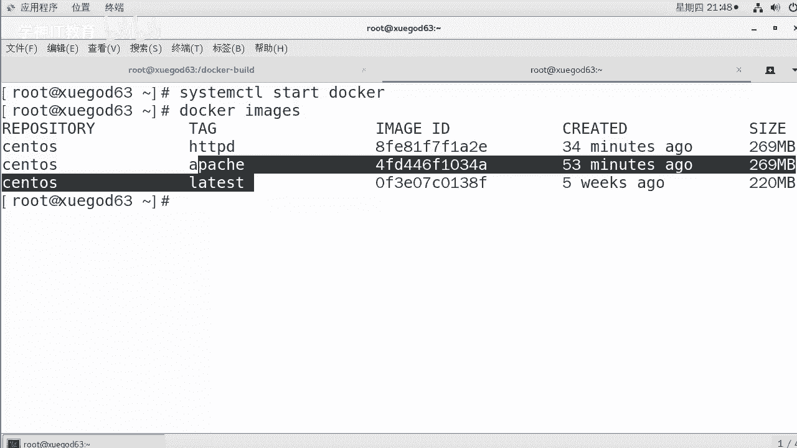
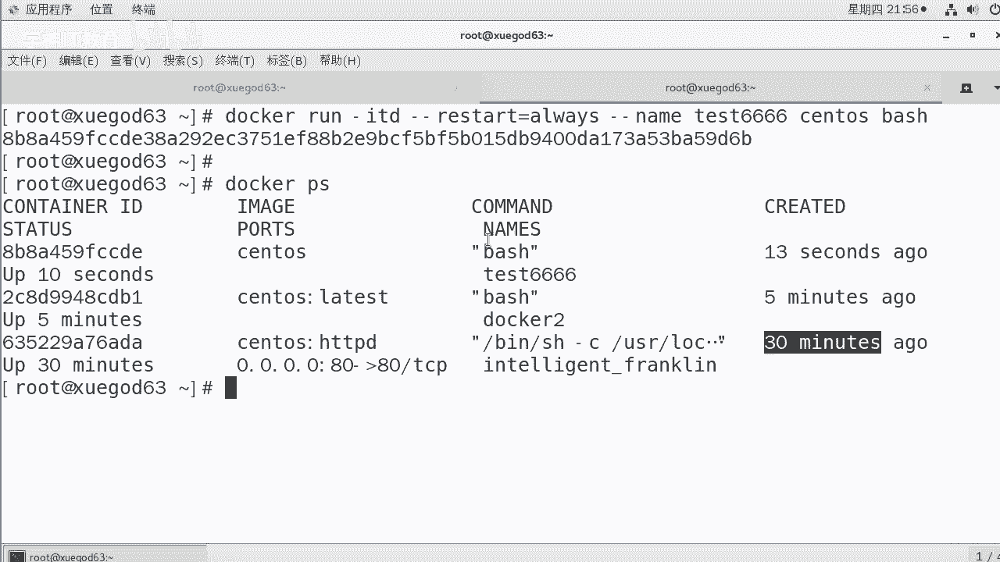
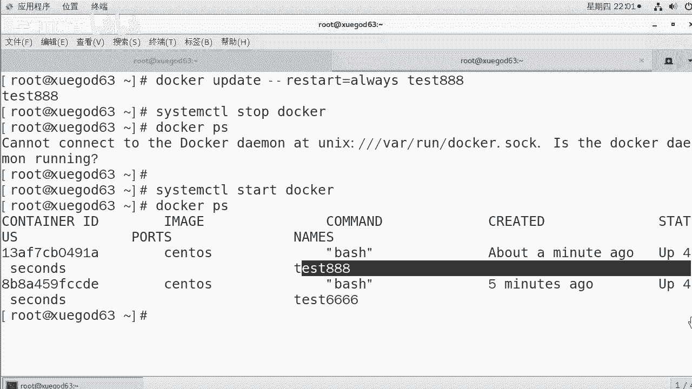

# Linux／Linux运维／RHCE／红帽认证／云计算／Linux资料／Linux教程--docker容器命名和资源配额控制 - P1：1-docker容器命名和重命名-创建docker容器实例时指定主机名 - 学神科技 - BV1Rt4y1S7ph

大家好，我是学生IT讲的是MK。接下来MK呢我是跟大家分享一下docker容器的命名和资源配额这块的东西。那么这块从命名和重域名到下边这些东西，更多的都是一些docker的基本命令。

所以在这个时候需要大家用心的去记。

真的啊，那么想要做这个实验之前，你应该先恢复到已安装好刀cker这个状态，我已经提前安装好了。

我们可以看一下。C team start docker。🤢，O。docker images我当前有哪些镜像呢？也让大家看一下。我有三个镜像，分别是HTTPD阿帕奇和拉提斯。好，有了这些镜像以后。

我们先告第一个之前我们没有说这个docker的名字，很多同学说那个名字起的乱七八糟，你能不能给我起一个好一点的名字，那当然是可以了。在这里docker run杠D。

好不好？杠杠name容器实力的名字，然后跟上镜像的名字，跟上要执行的命令。这样的话，我们可以怎么样？对我们可以起。啊，起一个就是运行完了以后，这个docker容器的实力就有名字了。你想跟他重命名。

那就是其实一个参数杠杠name。相对以往来说，加了个杠号name。那么re name就是旧的名字到新的名字。

那来我们来看一下啊。我们来先跑着嘛，你等会考转，这个时候还ATD。有有同学说，老师，你为什么把IT和D都跑上？😡，嗯，如果我不写D的话，马上就退出了。他就实时看不到了，看到啊，假如我不写D杠到内幕。

因为我这个是没有后台执行的，我叫刀cker一好了，我就我叫个AAA吧。好吧，用的是soneS。如果我用那个。Lan。Tasist。但我如果是这样去执行。好不好？对我们这样回程，回完去以后。😊。

你可以看一下啊，你还得跑到这儿再打开一个终端去查看。刀ckerPSPS的时候，你可以看到有一个叫name叫AAA的抛起来。啊，我还得是吧来回的去切。懂我意思吧？你想让他跑到后台，那可以吗？可以。

想让他加他跑到后台，可以加个D。这样的话他就跑到后台。当然我这个名字已经重了啊，所以你不能起一样的那我就起一个叫做。docker一的名字。回车。回完车以后，你再次去dockerPS去查看。

这里就有一个叫docker一。大家大家有时候看的可能不太怎么样。对你这样看的时候就很清楚了。coner IDD是这个image是这个。执行命令是bash。是吧几几分钟之前几秒钟之前创建的啊。

运行了3秒钟端口有没有做映射，没有，然后呢，名字叫docker一，这就不是这种乱七八糟的名字了。好不好？把它放大了，大家也要习惯于去看啊。docker name对应的是这一块。好吧。

command对应的是这个这个对应关系上你要能看得清啊。那我想给他重命名一下，重命名很简单，那就用这个命令。Do口re name。用心的去记啊，做为一个好学生。你想在同样两个小时内比别人学的更多怎么办？

记下来。如果我讲完这两个小时以后，这些docker这些东西你都记得住了，你就是咱们班的学霸。😡，如果我讲完以后，你一脸懵逼，就看了我敲了敲几个命令。那你的学习学习质量太差。

好吧，你你要把课上的时间时间是吧，利用起来。

不要想着是吧，我先浏览一遍错，你这个时候就拿个本，拿个笔把这个命令写出来，写的时候只写docker rename docker一 docker2，你也能跟上我的速度。😡。

这样下完课以后，你再去回想。这种效率是最高的。

啊，我希望一节课你要把课上的时间利用起来，不要总想着课下所时间。

聪明的同学在课上就把这些东西全都记住了。你就是这个聪明的同学。好不好？拿个本拿个笔，现在就把它记下来。等我一讲完课，你把视频已关。好，照着我这个本哇，这几个命令我都记住了，你的收获感非常的强。😡。

清楚了吧，也就是成就感也很强。啊，为什么搞IT的人搞了一辈子IT是吧？技术天天更新，这些人却不烦呢？😡，因为因为能不停的给你满足感。真的打游戏可能打一段时间，打通关了以后是吧？就没劲了。

是吧王者荣耀一样是吧？那么多英雄是吧？都换换个遍都玩玩过玩了一个遍是吧？没啥意义。但是技术这个词儿就是一辈子是吧？都有意义，因为它不停的变。😡，那么接下来我们创建一下docker的实例。

来指定一下容器的主机名，主机名也能执行。是的，docker。run name name杠H可以指定一项主机名，后面跟上镜像，跟上be。O。😊，那么在这个地方我们来看一下啊。

你想做的时候就是docker run。刚IT为什么这次没压D呢？我我想正常看一下。Ne。大家是不是以前没见过，以前你的主机名是一串序列号啊，我看我上面就是你的主机名就是。😡，cont那 ID的前几位。

知道了吧，以前的主机名是这样的。那我们来跑一个run name name，后面我们叫做doer3。写的稍微长一点，刚完H。刀口63怎么样可以吗？可以点C使用sowS。哎，我这次没有写这个。有问题吗？

没有写late冒号late有问题吗？没问题。清楚了吧，他会默认用的是拉提。啊，那么在这里。当考PS的时候。也没有问题，其实他默认用的是就是这个lati的这个。好吧，我这边已经创建成功了。

你可以看到我的主机名是叫雪干的63，通过杠H有指定啊。刀cker。63点0。这就是指定主机名。这个倒还好说是吧。我们如果这个刀cker能开机启动吗？各位。大家想想，假如我这上面跑了好多道坎。

你是不是希望我能开机启动？对吧可以吗？可以docker run杠杠restar等于office一直重启杠IDT name镜像。啊，容器的名字镜像。但lash。能看得懂吗？

restar always是做在容器退出时总重新启动容器。那么开机以后是吧，如果我发现我这个容器是关闭的状态，我就能自动把它给启动起来。就这意思。好，我们来看一下啊。嗯，接着往下继续，还是重新写吧。

doer run杠IT。让他跑后啊，跑前台运行也行，跑后台也可以啊。让他跑后台吧，好吧，docker run。杠ITD然后呢，杠杠restar等于。Als。OK。name等于一个叫做t的666。好不好。

采用stoS镜像。好。这样的话我们就已经启动成功了。启动成功怎么证明这个实验是对的呢？可以这样啊，刀口PS。我们当会PS回车以后，你发现有几个。这一个镜像，有一个是13秒。好，刚启动13秒。

还有一个是启动5分钟，还有30分钟，这三个是吧，实力都在运行中。那么当我们去执行s team。

我也不用什么，我就restar一下刀坎就行，也不用费reboot啊，你reboot也行。😡，那样浪费时间，你就restardocker一下。我们把刀号重新启动以后，我们看看这三个里面还有谁。

你感觉还有谁？在坚持运行。你看这一次就稍微慢一点，重启的时候，因为他把服务关了以后，他还要不再把什么，再把实力给你起刀口。PS。

是不是已经有一个这个叫test666，依然坚挺着。对，这样的话就是退出以后我就能。因为你从你把服务关的时候，docker肯定要怎么样。

服务都关了，刀口肯定要关一下。那么当刀口起来以后，它就能自动开机，自动启动了。好，这是第9个。第二个。好不，re start等于always。😡，那也只有这几个策略吗？其实刀cker有好几个策略啊。😡。

什么几个策略呢？我们把这个当口容器重启策略默认的话是no。就是reard等于什么nono的话就是退出就退出了，不会重启。那么在这里还有一个on什么un failureun failure是什么意思啊？

昂是在在飞非料是什么意思？是失败的意思？就是在容器非正常推出的时候，推出的状态是非零才会重启。其实这个策略也是挺不错的。那么还有一个昂菲了冒号3，就是容器非正常推出去，我连续重启几次啊，重启三次。

如果三次还不行。那我就不再重启了。还有一个是office，就是一直重启。其实我觉得这个策略要更好一些，是吧？否则你也许是你自己本身程序有问题，你不停的那那重启重启重启。😡，你浪费一点资源。对吧。

还有online stop是什么意思呢？在容器退出时。是要在容启退出时总是重启重启，但不考虑docker守护进程启动时你已经停止了的，这个也有用。然后我开机的时候。好，开机的。

你看这个地方不考虑在容器守护进程已经启动了以后停止的。那其实这个策略也可以是，假如说我刀坎现在已经开着呢，我手动把这个什么，我想手动把这个666给关一下。😡，是不是也挺好？对我关了你我还没关你。

你马马上又起来了，那能行吗？😡。

那有同学说，那我这个能更改更改吗？可以更改。😡，这个策略也可以更改，怎么更改呢？我们可以通过dockerupate。就是你能想到的那个事儿，刀cker里面都能干。好吧。

donupdate restart start等你通过update这个参数可以去重置这个alwayice，大家也可以重置其他的参数。好不好？

就像思Q语句里面一样是吧？我们更新一下它。😊，试一下啊，当er run IDD。这次咱们就写短一点，我特意把内容写上，是因为方便区分啊。S B。启动一个test888的这样一个东西。完事以后。

可以怎么样呢？docker up默认它是no嘛up。😡，Date。刚等restar啊，不是。是啊瑞斯。do等于。always always后面跟上test888。这样就行。你就给他更新了。C。Team。

Stop。当考完了以后，我们当考PS吗？😡，没有好，没有的话，s team。激动一下。启动完了以后，你可以看一下它的状态。那这个时候我们在。看看的时候，你可以看到test8完OK了。

这说明我们更新他的状态，更新对了。能看出来这个效果吗？

对你可以通过update尝试去更新它，记到脑子里痒。

好，稍后我们来聊聊其他的内容。