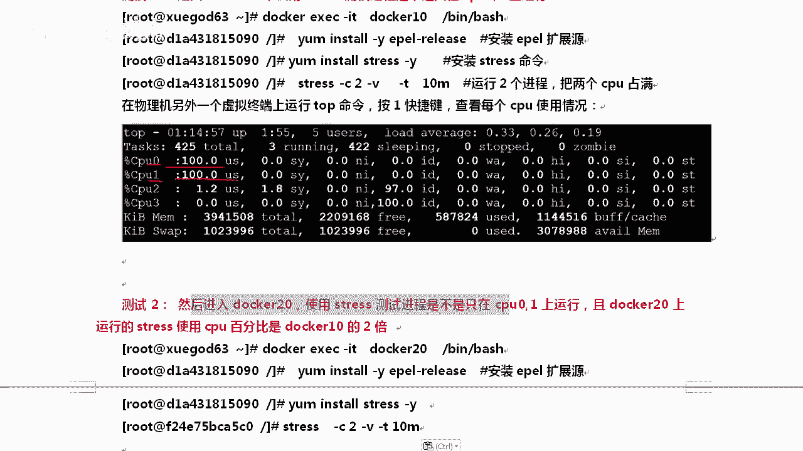
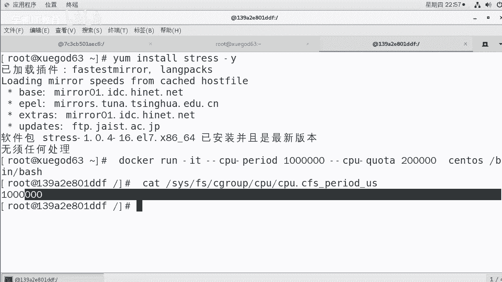

# Linux／Linux运维／RHCE／红帽认证／云计算／Linux资料／Linux教程--docker容器命名和资源配额控制 - P2：2-docker容器资源配额控制之cpu - 学神科技 - BV1Rt4y1S7ph

接下来我们分享一下刀坎容器资源配额控制之CPU。关于资源配额控制这一块CPU的内容是先看一下。docker是通过C group来控制资源的，那么可以控制CPU内存和磁盘，基本覆盖了常见的这些东西。

C group是conl controll group的缩写，那么它是linux内核提供的一个机制，可以什么？限制程序使用的这个物理资源。这个限制比。我说到CPU限制，大家会想到什么东西。

比如说限制你用一盒还是两盒的CPU。是不是被刀坎。ok。被docker等项目用来实现资源的控制s group可以将进程进行分组化控制，非常的好啊。OK我们来看一下。😊，当我说到这个。

首先为什么要做这个硬件配额呢？这个大家知道吗？说到CPU控制这一块。大家都。会想到什，比如说一个刀口实力只能用1个CPU。好，我们有时候我们叫VCPU是吧？对啊，你可以用两个VCPU就就仅仅是这样的吗？

你知道CPU还可以做哪些控制吗？他还可以做很多的控制。所以我这就是为什么。我这个人就愿意学习，就是越学，你会脑子越开朗。真的。因为接下来我讲的这个CPU控制，大家可能想都没想过。

原来CPU还可以这样控制，因为在你们接触的都是像wareware这一块，你可以用1个CPU，它可以用2个CPU。颈桌就到这儿了。你看我这为什么要进行资源配额？因为当多个容器运行的时候。

防止某一个容器把所有的音件都占掉。这样肯定不行了。比如说一台被黑的容器，那他可能把所有资源都占掉了。😡，家人就是扯。那我们在这里我们来看一下。docker分配的这个远远比那个分的更细。

我们在docker可以怎么样指定docker容器，可以使用CPU的份额。哎，这是什么意思？可以给容器分配512权重的CPU。什么意思？你要不知道一个选项的时候，因为刀坎这个命令它确实有好多选项。

假如说docker run里面有什么docker本身。杠杠help是可以看很多帮助的。那么除了这个以外，你看。刀坎可以接s刀口可以接run，run也是一个。好吧。

那么docker run后面又可以接什么参数呢？你可以杠杠have继续have。那docker这里面就是docker run的黑盘，这里面有一个就是关于CPU。S。😔，那么在这里你可以看到加一个小C。

或者直接写杠杠CPU shares，后面跟上一个整数，它代表CPU的什么？权重。我们聊聊这个权重这事吧。很有意思啊。看到docker run这个地方在创建容器的时候，可以指定容器所使用CPU的份额。

那么CPU shares的值不能怎么样，对它不能保证可以获得1个CPU或者多少G赫兹的CPU。他是个弹性质。也同然这有什么用是吧？😡，这有什么用？就是你你看他说既不能确定你只能获得一个或者几个CPU。

也不能确定你能获得多少G赫兹的CPU。😡，你说他有什么用？对他有一个用好不好？他能这种弹性值能让你的每一个docker。怎么样在资源空闲的时候，能最大化的利用空间。其实这个也很有用，你看一下啊。

默认每个刀口的CPU份额是1024。那么同1个CPU核心商同时运行多个容器的时候，这个加权的效果才能体现出来。哎，这个有点突然间让我想起来有点像。像什么我们的进程优先级是吧，也有加权。也可以修改他的。

对不对？好，我们来举两个例子啊。O。每个人的份额是1024，假如说其中有一个的。权重是1000，另一个是500，你猜这个时候会怎么样？我的印象有两个。好两个实例，一个是A，一个是B，A的是1000。

B的是500。你说这个结果会怎么样？嗯。按第一种。最简单的一种想法就是AB都正常的时候。都正常正常运行。那么CPU进行时间怎么样啊，进行时间片分配的时候，容器A会比B多一倍的机会获得CPU时间片。

这个好理解吧。OK他是按照这个比的啊，不一定你这非写1024，5这非写。512啊，不一定啊，你就写个1510是没问题的。好，那除此以外呢，那如果是吧。A。怎么样？假如说A是空闲的状态。

就是没干活这个东西。是吧B呢跑了阿帕奇是吧，已经不停的运行，不停的运行，还是A比B多一倍吗？明显那样。是不是有点不魄力？分配的结果取决于当时容器的状态。如果容器A是空闲的。

那么B可以获得比A更多的CPU。虽然你的权重比我大，因为你闲着呢。所以你不能占着茅坑不拉屎。好，比如主机上只运运行了一个容器。好，再比如。即便我的CPU份额只有50，我也可以独占整个CPU资源。

我不能让CPU资源浪费了。其实这就是linux经常说的，我可以把所有的内存都用下。最大化的利用内存，最大化的利用资源。只要我在利用的时候，你不崩溃就行。好，这个思想也挺好的啊。

那么C group只有怎么样？两个容器共同争1个CPU的时候才行。啊，这个配额才会生效，无法单纯的根据某个份额来确定给他分配多少。OK我们来给大家做一下那个事啊。😊，你想跑的时候。

比如说我想跟容器分配512权重的CPU，你可以写CPU shares512就行了。加了一个参数。单纯我给到你，你单纯看到这个。给容器就是当容器运行的时候，给他分配512权重的CPU。看到这个参数。

你心里有数吗？你知道这一条命令该怎么写吗？就是docker run这一条命令。嗯。如果你脑子里一片空白，就是说明你前面。说的那些东西你都没有记得住。所以我跟大家强调一下，想学好docker，拿个本。

拿个笔先记下来，回到你第一次学linux基本命令的那个状态。好不好？😊，那么最起码docker run后面你应该立马想到，比如说IT或者ITD。要有这个参数，要有这个想法，那就够了啊。

那就说明你还是可以的啊。所以我们在这里啊就是docker run嘛。😊，至少我说我说要创建一个docker的时候，你应该想到docker run。好不好？docker runIT然后呢。

你不是写CPU这个吗？我们写个杠C或者写这也行，我就写全了，这样方便我去读它，我写512，后面跟上镜像。Blash。都是这样啊，都是跟上镜像be士。这个最后那这样我就启动了一个docker。

那这个docker你可以看一下，我怎么知道你是512呢，你看这个参数就行。this下有个FSFS下有个C groupC group下有CP group可以控制很多啊。😊，这里有关于内存的是吧。

关于网络的相关的，关于CPU相关的都可以。那单纯的关于CPU的空额。又有多少呢？单纯的关于CPU就有这么多。哦，比如说CPU shares，这就是我们想看的task亲和力这一块呢。

OK还有CPU什么cota pure周期。很多啊，我们来看一下CPU这个shares。如果那个值是512，说明你配置生效了。好吧，因为默认这个值操作系统里有啊，默认操作系统上的这个没修改是51024的。

对吧好，那这个地方我们就看出来。那看出来有同学说你给我测一个效果，看一下，我现在没效果，因为只有我一个人在用它。😊，好吧，你得多启动几个才行。所以稍后我们多启几个。好不好？多起几个啊，稍后多起几个看看。

啊，是不是只能用512的分割，单独一个看不出来。我得让他竞争一下。你想让他竞争有个问题。你得能跟他绑到一起，他才能竞争吧。大家说是不是比如说我的刀cker，我一共有16个的CPU。

你用一个你的刀cker里的进程只是单进程。😡，单线一个进程里面只有一个县程，你只能用一个核心。你又不是多县城多进程的。所以你也没法给我竞争。所以接下来MK教大家一个叫CPU的核心控制。好。

通过CPU side可以绑定CPU对于多核的CPU来说，docker还可以控制容器运行，限定用哪些CPU和内存节点。那么这个时候我们可以通过CPUs杠CP还有内存这一块。

一般我们就绑绑CPU内存这块就不绑了啊。那么对于具有。什么NUMA。什么叫NUMA具有多CPU多内存节点的服务器尤其有用。好吧，可以思么呀？可以对需要高性能计算的容器进行最优化的配置。

如如果服务器只有一个内存节点。这个基本上没有什么效果，但是CPU绑定这个还是有效果的。这个有个问题，什么叫做NUMA？S。有没有人知道？所以我跟你说，我说学运维挺好的。软的硬的你都能学什么服务器架构。

什么操作系统，什么sel脚本，你都能搞一搞。能把lininux运维学好了以后，你你就打了一个很扎实的基础。😡，你后面学什么东西都轻松了。好不好？服务器的架构一般分为SMP是吧？NUMAMPP。

你们现在用的PC服务器是属于哪个架构的？啊。从系统架构来说，商用服务器分三大类，第一类叫做多处理多处理器结构SMP。比如说你的叉86服务器和双路或者四路，这都叫做对称。好，多处理器结构。

那么什么叫做非对称呢？对，非对称的话就是非遗制。这个缩写就是非遗制存储访问结构。比如说IBM的小型机这一类的，就是小型机这一类的。那么MPP。好吧，MPP叫做海量并行处理结构。比如说大面积。

所以小型机上也可以跑什么，包括大型机上也可以跑刀坎，他们是可以跑刀坎的。IBM的Z14。跑几个跑200万个刀口，好像是我记得。还有还有印象吗？对IBM的Z14那台机器可以跑200万个刀口。

京东我记得之前打说自己有50万个docker，这一台大印机就可以干200万个docker。强不抢。确实挺强。好吧？好，我们来看一下。那么接下来说到这个CPU绑定这块的时候。

大家应该有个印象叫做task set命令。😊，这个task set命令，它就能绑定CPU亲和力。因为大家对CPU亲和力这个东西不太。比较陌生。所以我我把那个task set命令给大家讲一下。

让大家感受一下CPU的亲和力。然后我们再去讲道cker，你会理解的更爽。task set来设定一下CPU的亲和力。task set能够将一个或多个进程绑定到一个或多个处理器上。用的主要参数是C和P。

P是PIDC是CPU列表，以列表的格式显示指定的CPU。好，那么我们来聊一聊，比如说什么呢？设置只在CPUID是一和2的CPU上运行。运行什么？对。在它上面运行SSHD这个。第1个CPU的ID是什么？

对，第1个CPU的ID是0啊，我怕大家不知道，所以我在这里给大家列了一下。😊，OK那这个参数是怎么做的呢？首先你是四核的才行。MK我是四核的CPU。好不好？topop摁下数字一。运0怎么呀？0123吗？

能看得见吗？好，能看见他了以后。那我们来执行一下PS杠UX默认是随便来回的都能跑啊。那可以看一下我当前的这个ID。好吧，你看他那个也运行了是吧？😊，突然间我看到了这个现象。

你看SSHD这个命令后面也加了个杠D参数，就有点像阿帕奇那。脚本后面加那钢地参数一样。好，那我们来看一下啊，在这里。他的ID是1089。啊，1089。那我们可以task that。开口。

CP两个参数一起记。如果你记不住的话，你就CP两个参数一起记就行。杠12只说我们只能在12上跑。然后呢，粘到这儿。回车回上车以后呢，他会告诉你PID这个地方当前的新和力。是什么？是。0到3。

afinity这个单词啊。affinity是亲和力的意思。好吧，它是0到3，然后呢现在已经变成1到2，0到3也就是4个CPU随便跑。现在你只能在一和2ID上面跑。真真是这样吗？真是这样。

一会我们可以看一下。比如说我想看看你到底只能在哪个上跑。PSS去查查完以后，t3CP12。加ID我想看ID唯一的进程CPU在哪，它是在哪个CPU跑的？正好我们看看默认是在哪个上面。Task。s好吧。

杠好CP如果你不写。是吧不写这个列表，那就代表只查。就查的时候，你可以看到他是在0到3上的，偏D为一的是谁？突然间想问一下你。啊，是你匿吗？PID是一是我们操作系统进程里面PID。一叫什么名字？

知道不知道？不知道的话，我教你啊PS tree。好吧。PS是去。其实我们是CTMD啊，我是知道的啊。但是你不知道，我就跟你讲一下PS tree。😡，回去。回安去以后呢，那只显只显示的是么？

进程没有显示ID，那你可以这样。杠屁他能看AD。好，这样呢你能看到每一个进程后面的是吧，进只是个显示进程数，在进程数的最上边哇，好长呀。这么长的话，你剪下个帽吧。

那在这里我们可以看到st teamD是一号进程。好不好？对你能看得到呢。O。😊，每个是不一样的啊。对。

tcentCPE可以看到它是在0到3上IHsom S7PID一是sstemDsto S6的PID是init，它是不一样的。这个叫做查看进程数。这个命令挺好用的啊。后期如果你的机器。

如果你的服务器被中毒了。我想知道什么，我这个木马程序它的副经程是谁？那你可以通过进程数去查看一下。对查看竞证书。嗯。对，也可以怎么样，也可以查看。木马的附近城。因为他能看到那个京城关详。好。

万一有一天你的机器什么要副务进程？对你的进程被黑了是吧，删完紫禁城以后又出来了，删完一个程序，又出一个程序。那就说明你没有找到他的附禁程。好，那知道我们来看一下啊。😊，呃。

当然有同学为什么要绑一下CPU呢？😮，想问这个问题吗？你想想。我们在学NG调优的时候也讲过CPU是吧，把NG的每1个work尔卡进行程绑到独立的CPU上。为什么要绑一下？绑一下就快了是吧？对。

绑一下确实快了。CPU数量很多的时候绑才有效，你别就一盒两盒是吧，四盒绑一绑你的进程，你们公司那个服务器是32核心的或者64核心的，绑一绑。清楚了吧？CPU数量很多的时候，你绑到的上。

这样可以减少CPU上下文的切换，节约时间。这个上下文就有就有点像CPU的缓存。CPU1级缓存，二级缓存存什么？😊，不就是纯数据吗？对不对？你想想，如果你有64个核心。或者说32个吧。好吧。

32个CPU你想想。嗯，内核出来一是吧，出来一个进程。一个进程。出来一个进程，这个进程我应该找你哪个核心。第一次是吧，找的是CPU11CPU。CPUE吧。对吧接下来第二个就蹦到CPU是呀？CPU28啊。

是吧然后下面过因为它是分时的嘛，后面又变成CPU6了。它那个上下文好不容易存到它的缓存上，然后接下来又跑到这边了，就是他们来回读的时候不停的去刷什么，刷那个缓存。当然这个缓存并不仅仅是一级缓存。

二级缓存CPU还有一些什么？还有一些叫做寄存器的东西，那个东西。那个东西得实时的跟进。好吧，CPU寄存器寄存器去读什么读缓存什么一级缓存，二级缓存。是吧，然后呢。

所那么通常我们的上下文切换的那些消息就在寄存期，这是最。啊，这样的话减少点开销啊。好，我们知道了这个。那么接下来假设MK是吧？我有16个核心创建的容器只能在0123个上跑。这个时候怎么办？

用CPUs上去给它指定一下就行。Doockcker run。杠AT。好吧，杠杠内容叫CPU几啊，CPUE。杠杠CPU。你记不住的话，你摁摁按table也补不补不了啊，你只能查看帮助啊，哎，可以补。好吧。

可以补啊，按 table可以补齐CPUs杠CPUS。好吧，0到2。镜像belash。回撤这样的话，MK老师运行了一个。叫名字叫CPUE的。然后呢。0到2。OK。😊，怎么看呢？还是这个CFS。好吧。

C group去查看。C group的查看的时候，CPUs。啊，那么在CPUs里面有个CPUs。实在记不住这个参数的话，端几次tableable啊，他也能补出来。卡的。默认它是什吧？

你看假如说这是我那个docker里做了配置了。如果我物理机上没做配置的时候，它是0到3。好不好？对他是0导3，而且我们去你忘了吗？task setCP。什么CPE。pa是什么？对他不是0导3。

他是0导2，说明我们配置确实成功了。那对于我当前这个我看有没有PS群啊。没有这个命令是吧，只有PS命令。好，那么。我当前这个刀坎谁是一号进场？刀尔实例里面。PS杠为UX。好吧，这样一批。过滤一下。

也别过滤了，因为他没有几个啊。直接回去。docker实例里面没有运行几个，好吧，PS查看的时候，你会发现PIDV一的是besh，这也就是大家知道为什么你推出的时候要用这个。因为你本来就是办事。

办事推出的就是一案3T。😡，明白了吗？这也就告诉大家，为什么。你要在这里面起服务的时候，你别想用什么service，根本就没有service这一说。除非你那个刀坎里。本身就支持或者说包里面就有。好。

这是我们来总结一下啊。那么16个核心01到2用的这个参数是什么呢？是这个CPUs。杠CPS01到2。查的时候是么？你也能看到。OK当前刀cker实例中偏离唯一的是办事。好，说了这么多是吧？说点什么。对。

那么我们现在会权重了，也会什么绑CPU了。那接下来我们来把它参数混合用一下。混合用的时候是吧，你看当上面的参数中CPU shares是控制至发生，它是怎么样？shalls权重这块。

它控制只发生在同一容器，容器怎么样，共同竞争1个CPU片的时候才有效。所以我得把容器绑到怎么样？如果我们通过CPUsCPUS指定容器A用CPU0容器B只用CPUE。

那么主机上只有这两个容器使用内核的情况下，各占全部资源，没有效果。因为因为你俩没有冲突，各玩各的。怎么才能看到效果？让你俩竞争一下，把你俩绑定到一起。对不对？

容器A跟容器B上的CPUshas的值都绑定到同1个CPU上。好唔好。OK让他们共同讲就可以了，这不叫CPU shares啊，应该是CPU set。对我们将你们上面这个值是吧，绑定到同一个上就可以了。

好，那么在这里我们可以给以把它绑起来，绑起来以后有个问题。什么怎么能把CPU跑满？嗯。😊，对，怎么能把CPU什么？跑马。这个跑满大家能能理解我说的意思吗？对，就是跑了。有同学老师运行个for循环。

运行一个wheres循环是吧？就行了吗？嗯，你查过没有，他能不能把你这个运行一个where的死循环？能不能把你捧完？能。运行一个能跑完吗？显然不是。好吧，有时候因为这个死循环有时候跑到百分之百。

有时候跑到90%，有时候跑到70%。好吧，这个显然是不不准确的，怎么才能做这个事呢？我告诉你个好东西。😡，好不好？我们可以这样呢，我们可以这样去做这个事。😊，测试CPU shares好吧。

你需要一个压力测试工具叫str。这才是能把CPU抛完的。清楚了吧。对，那么同样同样知道这个以后，如何把CPU跑满，如何把四核中的第一核第三行跑满。如果是物理计的话，那你可以怎么样呢？对。

可以可以怎么样可以运行什么运行stress。然后呢。对运行stress，然后。呃，使用。Tsask set。是吧。绑定一下CPU。啊，这样的话就可以跑慢了，这是个题案化。我们如果是物理机的话。

我们是这样去做的。但是如果我们是刀卡的话，就就不用这个了。😊，好吧，docker我们可以使用上边这个CPU side来绑。O在这里我们来看一下啊。

linux的系统压力测试工具叫做strstr可以把你的CPU内存I Odes全都为你绑完。😊，我看这是他的官方页面，非常好。非常好用啊。好，那么当然这个地方他也在一炮源里面，好不？其实今天内容不难。好。

回去大家多练习一下啊，我们可以做这个事吗？可以啊。😊，Yum in store。E破。Release。Yo明store E release。快速安装一下。Young in store。Surpris。

好，这边让他自己去安装着啊。那么在安装的过程中，我们来把stres的几个参数是吧给大家聊一聊。对。它这个参数是这样的啊，yinstore drive安装，安装完了以后有几个常见的参数。

杠C是产生N个进程，每个进程不停反复的计算随机数的平方根。这样的话比循环来的效率更高一些，它能瞬间让你的CPU跑到百分之百。这是最折腾CPU的，就是算随机数的平方根。如果算一个大数的平方根。

那更折腾CPU。好唔好。那么杠A的话是产生N个进程。所以如果你想折腾你们公司的服务器，你你就天天在上班时候跑个strs。好吧，然后再通过。啊，再通过roookie的把这个stress进程给它隐藏掉。

那这样的话，你们的运运维就很头疼。CPU是吧，已经被占到百分之百了，但是就找不出来谁占百分之百了。是不是？啊，那刚A这个地方每个进程刚开是干嘛时呢？进程反复的调用SNC同步，它能干嘛？

他能将内存上的东西写到磁盘上是写字。测磁盘呢。M的话是产生的是mylock。 my lock这个函数本来就是用来是，就是是就是什么。分配内存的啊分配内存的。如果你会C语元的话。

C语元里面会有个melock函数free的话是释放内存。我要比如我要分一G的内存，我要释放一G的内存是吧？看看内存的这个速度。OK那么单位的话时间的话是秒分时，好不好？文件的话是大小是KMG好。

那最简单比如说。最简单我来产生2个CPU2个I5是吧？20秒后停止运行。那这个时候可以怎么做呢？可以这样去做啊。写的时候，如果你不会的话，你就照着上面的参数来搞啊strs。对吧。杠C22个CPU进程。

然后呢，杠I2。2个IO的。对你让他跑多长时间呢？可以通过杠V的方式去显。好，robers是显示详细的信息，然后time可以指定时间，我们来看一下啊。还没执行完呢。啊，马上安装完了啊。好。

str安装成功了，我们来看一下啊。假如说在这儿我要执行执行的时候运行上top摁下大写的P，这样可以按照CPU进行版分CPU排序吗？排序的时候，我们回撤str回安车以后，你看。看到了吗？两个百分之百。

剩下这两个是写磁盘，写磁盘其实也挺好CPU的。是吧99%分之百就是他很准，能理解了吗？😡，对他测的是非常非常的准能。下面这两个通常会少一点，为什么呢？现在我已经运行完了。OK。😊，好。

那这个能看出来效果吧。对我们是能看得出来的啊，下面写资弹，他也会好死PU，尤其IO等待这一块的时候。那看到这个以后呢。

看这儿。好吧，最后说一下，我们测试一下CPUs和CPU share混合使用的效果，你需要压力测试工具sstress把容器CPU跑满。当跑满以后。

我们看看会不会占其他的CPU如果不会占其他的CPU说明我们的限制功能是有效的。所以呢稍后呢MK老师会搭建两个容器，刀口10和2010和20只能在CPU0和CPUE上跑。我们使劲的把零和一给跑满。

好吧，如果没有限制的时候，他可能是要在023上也可以。因为。是吧自动给你分配到23上会让你串个串一下CPU我们现在限制一下，他512份额，他1024，我们都让他在零和一上跑。看一下效果。看看他们的分。

比如说他们的比是1比2嘛，正常应该你用33%，他用66%。好不好？我们来跑一下那个实例。瞪大眼睛啊，年轻人。出结果啊，包括runID。杠杠 name。我叫当考10。好不好？然后呢，杠杠CPUs。

杠CPUS。我只能在零和一上跑。OK接下来还有杠杠CPU什么shas。好吧，CPU摄，我这个是500以2啊。然后用在s头S上bsh。哎呀，看到这啊。好。这样的话就OK了吗？好，除此以外。😊，哎，抱歉啊。

写错了啊，我们改一下啊。内幕这个地方docker10是已经运行了，我天呐。杀了他吗。我啥时候运行了个队呀？给删了啊。删完以后呢，我们重新是吧，创建。docker runname叫10，好吧。

01上sell512回撤。那么再往下运行一个叫20的。回车。好，现在我们就都都跑起来，跑起来，我们进进到它里边进去怎么进呢？我们可以这样啊。咱们是不是现在得进去啊？因为现在有效果吗？现在没什么效果。

两个都是什么空空荡荡的，因为两个上面都没有跑真实的程序，运行两个docker容器。好不好？OK刀号20只能在它和它上运行，我比你多一倍，多一倍以后，现在是没有什么效果。

所以我们要进入到10里面去跑一个stres。好不好？啊，我们来跑一下啊。那我们现在是吧已经运行了，运行了，我们来跑进去啊，你想登录上这个怎么登录呢？我们进入一下啊，我们通过刀号10快速的进一下。

docker EXEIT docker10啪进来进来以后，你需要做的第一件事是安装一下Eport releasease。好吧，同样除了进了他以外，你还需要再把20也进一下。我们来crl C一下啊。好。

我们来看一下，在这里好不好？我们要进入一下20。我们登录上上去，登上去以后，同样我这边也需要安装一下Eport releasease。安装装完了以后呢，那么在这边啊，两边让它快速的去安装一下。

安装完以后两边都要安装一下strs，因为两边一会儿都要跑这个str。我们等等他啊。那我这边安装完了以后，把stress再装上，这边也把stress装一下啊。应该快了。对。

先把Eport releasease安装上。这边安装一下stresss啊。两头都装一下strs。都装完以后，我们需要怎么办？对，笔记整理到这里。都安装完了以后，我们在先在刀cker10上好吧。

我们跑两个进程，把CPU给占满，然后在物理机上，我们怎么样？我们现在两个刀口都跑了的嘛？我们在另一个终端上看top，你看看CPU的状态。OK那么现阶段只有刀cker10跑了两个进程，你感觉状态是多少？

对他的状态应该是百分之百。因为虽然我是512的份额。但是没人给我抢，大家能理解吗？画一张图让大家看到啊。对，因为没人给你抢，你知道吧？好，因为我的20还是空闲状态，所以你可以用我的啊，你可以用百分之百。

清楚了吧？你可以用到百分之百，我们来跑一个，让大家看一下。一样。怎么显示没有匹配上呢？重新安装一下啊。因为我们刚才在外边还能匹配上的对吧？所以说这个就不一样了啊，各位同学怎么就不一样了呢？

我们在外边这一条命令是可以的，因为我们用的是生屠S8的镜像啊。😊，看来son到Y8这个命令又变了，你看在7上strs是完全OK的啊。好，那我跟大家说一下啊，这个八里面还没有这个stress这个命令。

它更新了啊，更新了那这个时候怎么办呢？我们有一个办法，还记得MK老师跟大家说的吗？对我在这里给大家提供了一个什么。😊，你需要把这个包啊传到你那里面去跑一下。知道了吧？我在这里给大家提供了一个插包。

把这个塌包下载下来就行了。😊，O。😊，好，那么下载下来以后呢，你你去跑的时候是吧，如果只有一个是百分之百。如果我们是第二个，假如我在第二个。测试的时候，docker2，我们的str也跑了起来。

跑了起来以后，你去运行的时候，你是能看到它是它的两倍的。

也就是说这个时候如果我的stres。好吧，这边也跑起来，跑完以后，MK已经给你截好图了。

截好图的时候，大家可以看到。旨在了你看CPU0和CPU1已经跑到了百分之百。CPU2和CPU3都是00，都很空闲。好吧，而且你可以看到两个，一共是4个吗？一个是66，一个是33。

说明两个容器只在刀坎10。只带CPU零和异响跑了，说明我的绑定是绑成功了，因为他没有侵占别人的，而20是10的什么两倍，说明这个限制资源也成功了。啊，这个是没有任何问题的，刀号那个技术也很成熟了。😊。

好，这叫CPU的这个限制啊。

这个挺有用，还有一个小参数没什么用。大家在这儿了解一下好吧，叫CPU周期的控制。什么叫CPU周期呢？就是docker提供了一个叫CPUP的，是周期的意思。还有一个叫co。好吧。

康塔是说在比如说在这个周期内，我能分配多少。几秒钟。是吧几秒钟的这个CPU我能用几秒CPUP啊用来指定是吧？是一个绝对的，就是多长时间做一次分配，指的是周期。康ta是说在这个周期内。

我有多少个时间片可以用来跑容器。OK那么跟他 share不一样，这两个是绝对值，没有弹性。好吧，定义多少就是土壤OK那么CPUP2这个还有cata，它们单位都是微秒，这微秒是多少？

一秒等于1000毫秒1毫秒等于。对，1000微秒，所以划分的这个单位还是非常厉害的。那么怎么做呢？我们来看一下，假如说我想设置docker。啊，刀cker的实力每一秒内只能用0。2秒的CPU。好吧。

那你设置的时候，CPUP2周期一后面650，这叫一秒。好他这个地方只能用0。2秒，那2后面5个0。我们设置的时候就是这样去设置就行。这就是一个绝对值啊，这个大家了解一下就行。

dockerrunITCPUP2的。是吧16025个0。回车就行了。回原去以后，你怎么知道它配置成功了还是没成功啊？很简单，这个也别测了，你就直接看它那个值了。😊，好，C group里边那个值就行了。

O。😊，如果没有你像我们的物理机上这个没有做限制的事吗啊？给大家看一下。如果没有做限制的时候，你可以看到啊，他也是他是一后面5个0。好吧，是0我们这个是一后面650。说明也修改成功了。

好，这是这个内容啊。

