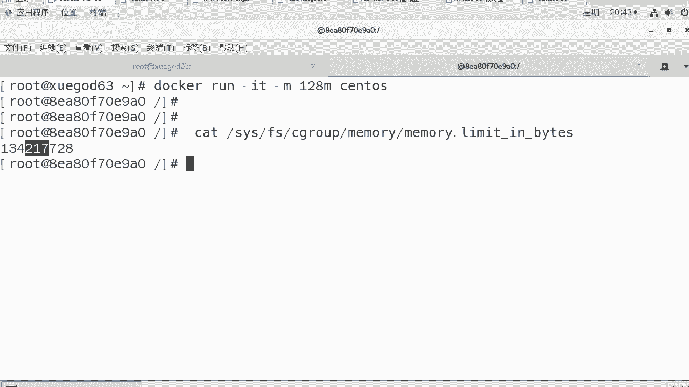

# Linux／Linux运维／RHCE／红帽认证／云计算／Linux资料／Linux教程--docker容器命名和资源配额控制 - P3：3-docker内存控制-数据映射-容器资源配额控制之IO - 学神科技 - BV1Rt4y1S7ph

好，接下来我们来分享一下什么呢？就是doockcker这个案例，这案例叫做docker容器实力运行结束后自动释放资源。

什么叫运行实力后自动释放资源呢？我们来看一下docker run help。😡，对吧然后你去看一下RM这个参数，IM这个参数，你看这下面写的很清楚，自动移除容器。当它退出的时候，那这样的作用有什么作用？

😡，在当容器命令运行结束以后，它能自动删除容器，自动释放资源。比如说什么？其实这种情况下做压力测试或者做各种测试的时候很很有用。比如说在某些环境下，我需要创建大量的docker实例。

仅仅运行个几分钟或者是几秒钟啊，运行完了以后，我需要让它自动删除。比如说做单元测试或者弹性的什么云计算的一些东西。比如说我要模拟双十一的一些压力，我要快速创建1万个docker实例。

每个docker实例里面去跑AB命令，拼命的去访问天猫的首页，运行一小时后自动删除。那这个时候大家可以看到就就非常的方便了。😊，知道吧如果没有刀cker的话，你想想你做的时候。

在每一台机箱跑一个lo runner。😡，是吧。你肯定得批量的去执行吗？你只能是吧批量的去执行。所以我们可以使用这样的方式，让一个云平台对另一个云平台做一下压力测试。

对吧好，我们来执行一下。之前的时候是。你刀坎转。IT好不好？然后呢，杠杠刚M参数。杠杠IM，然后杠杠。起名字吧，咱们叫namename叫做MK。我们基于salOS这个系统跑一下啊。好，snoS完了以后。

正常以前我们都写什么，写个blash命令，这样的话一直会执行。这次我不写belash了，我写了什么，我写个sleep。😊，sleep几啊sleep5，大家知道什么意思吗？😡，好，我们来跑一下。呃。

当然这边在跑的过程中是吧？我们应该先怎么样？先去这儿查一下。登网卡PS我们现在看一下啊，当前只有有1个HTTP这样的一个。实力接下来回车，回完车以后，你来这里好不好去看多少卡PS。😊，在当开PS的时候。

我们看一下这里。已经跑了。I p forward是吧，已经被禁用了是吧？网络服务将不能被工作。那这个时候大家应该把把什么。

把刀口的这个服务开一下啊。好，在这里啊。😊，你没看到这个效果是吧？好，我们把这个开一下。这样我们把docker服务器cut POC上size net MPV4。下的IP像划线符号的。

所以大家有时候你看到这个。你也注意一下，它是零了。啊，我就直接给他改了啊。我先不改不改之前呢，我们s。重启一下docker服务试一下啊。再重启一下那个当号服。中间刀cker服务。

我们再看一下能不能自动把它改成一样。其实我们在安装刀cker的时候，已经。已经把它默认是吧，给他配置成一了是吧？当然他。看到了吗？当你去重启docker的时候，他能帮你这个参数给你改成一。

看到了吧？OK好，知道这个我们接着跑我们这个。😊，来，我们跑这个让他运行5分钟后自动退出啊。回车回完车以后，现在他已经在运行了，那你赶紧到会PS看一下。

好，你可以看到有1个MK吗？

好吧，可以看到吧，这里我们当前有1个MK，然后55秒钟好吧，因为sleep5秒钟以后，我们来看一下再看。😊，没有了，这样的话就是自动怎么样删除了刀了PS没有了。以前。😡。

以前我们只是不运行了，那么你在杠A的时候，你去看的时候，这里面也没有一个什么，没有一个name叫MK的。😡，所以你你是能看到这个效果是很明显。

好，这个大家知道一下啊，这是docker runIT，然后dockerPS杠MK好，自动删除自动删除完了以后，我们来聊聊内存控制这块的东西。内存控制就是你允许用它让它与允许docker使用多大的内存。

那么可以通过杠M参数来限制容器使用的量。

比如说我就想羡慕你怎么样，我就限制你只能使用128兆。😡，那怎么做啊？很简单，好不好？down run杠什么杠AT，然后杠M128兆s头OS。好不好？导卡让IT杠M128兆s透S，这就齐了，这就起了。

你你测的时候，你也可以通过str进行测试。😡，好，尝试安装一下这个str命令进行测试，我就不测了你。这个限制是有效的啊，你只要看一下这个。six group下memory啊limit看一下这个值就行。

这就是128兆B。清楚了吧，后面几个零，后面6位数。好不好？😡，对你能看得出来吧。😡，这就是限制内存。

哎，我们给起大家写一下啊。那我们把上面的参数跟这个参数是吧联合起一下。看到啊，对你可以也可以使用stress，然后尝试分配啊，我们就不做这个测试啊，它这个功能是没有任何问题的。

接下来创建一个docker，只允许使用，只能使用什么2个CPU核心，只能使用128兆内存，这个时候限制一下。

啊，我只能比如说你只能在零和一上跑。联合起写一下啊。参考着这个那。dockerIT你让他跑的时候是吧，杠杠CPUs杠什么CPUS。只能在零和一逗号啊。对，零和一这个CP网跑，然后呢。

杠M128兆内存是这么点。OK。😊，跑一个送到S。这样的话我们就跑起来它，你没有写b时，默认他也是个b室啊。😡，退出。好，这是关于数据内存这块的操作。

好，知道了这些以后呢，我们还有一个也挺重要的，就是关于什么。数据。好吧，下面说前面说了CPU说了内存这块是吧？那么关于数据这块。😡，我怎么用这个数据？啊，那么在docker里，你想用这个数据的时候。

我们主要用哪个参数呢？是这个参数dockerrunID好不好，杠V后面是圆，然后DST。是吧是目标OKsS写上镜像，然后b一定要把镜像写到最后。因为这样的话不会报错。啊，刚没。用来指定挂在目录冒号前。

这个是什么？对，这个是物理级的，后面是容器的。将物理机某个目录映射到容器上。这个有用吗？

这个参数。很有用啊。你比如说在把物理机上的word下3WHTL映射到docker的这个下面。那这样的话，当docker坏了，那数据还在物理机上。好吧，我们使用阿帕奇的镜像再起一个docker示1。

数据不丢失，否则docker一换数据就丢了。😊，是不是这个道理啊？那我们来试一下这个操作啊。

嗯，MKDR我们先杠匹创建一下啊，word一下3W点儿HTL。创建完了以后呢，导口run好不？杠IT对不对？然后杠杠内 name选择一下，比如说我的名字叫web一吧，然后杠一我们将。将什么呢？

将这一块3WHTM。哎哎。不好意思啊，我敲了好多回车啊。name叫外E。刚币参数往下3W。杠HTML。将它映射到什么另一个。这是映射到我们容器这里面了啊。关键是你容器下有这个吗？没有的话怎么样？

没有的话也没关系啊，它会自动创建。好。sto S像我现在这个默认sto S镜箱里肯定没有我们ba一下。😡，哎呀看住C啊。我这个键盘离得有点远啊，敲的时候所以老敲错啊，web一已经有名字了啊。

我们重新起个we11啊。看得出来吧，说coner web一 is already吗？😡，回车回下车以后呢，我们在这里比如说写点东西，好吧，ancle AAA到哪呢？到。

我尔想3WATM这个东西有点indexed，像NFS1样。index点HTML那么我们在这里去用的时候，你可以看一下啊。没问题吧，这里面是有值的那你同样上到物理机上，你去看那个。物理上也会有这个这样。

这个有问题吗？😡，大家觉得。没有任何问题，知道吧？因为本身他们就对不对一条啊，一个机器上的，或者都在一个物理机上的。😡，好，这样的话，我们在物理上查看也是没有问题的。一个刚飞参数。

很简单，好不？前面物理机的，后面是容剂的。

这就可以了。你比如说后期我们讲。讲什么呢？讲持有仓库。

好，docker私有仓库的时候，我们总不能把所有的docker镜像都放到一个什么。

对，一个刀口里面啊，这样的话它还沉下。所以我我们会把私有仓库的东西放到物理机上。O。这是这个。接下来还有一个是什么呢？数据这个大家也知道了，还有docker容器。容器资源控制制IOIO是什么意思？

读写硬盘的是吧？那常用的两个参数，我给大家写到这啊，那我们接着往下继续啊，docker run刚刚help好不好？JREP去过滤过滤什么过滤我们什么？比如说我们我想关于什么，关于写相关的一些东西。

dice什么right BPS加上无有值。😡，啊，那么这个干嘛呢？limit限制写的频率的。好，我们限制此设备上的写速单位是K。赵臂啊GB。还有一个是device read读限制上面的读的输入。

这个我觉得挺好的。你where where上。😡，你有限制是个读写吗？😡，大家是不是没有限制？有没有想过这个事？对，确实没有啊。还有一还有一个就是你如果去看阿里云的时候，阿里云上有一些普通的云盘。

它的IOIO才多少才1000IOPS非常小。实际上我们。真的啊，阿里云那个地方是吧，除了CPU共用以外，大家会发现是吧？它的磁盘IO那个地方其实挺小的这也就为什么它挺便宜。

它因为一块硬盘上一T的是假如说。😡，啊，600G的数据或者说1T的数据是吧，它一个盘上他可能跑了好几个云数机。知道吧？对不对？你比如说一太存储可以给2000台机器使用。

我就要防止某一台机器把你的IO都吃光。因为你一个人卡了，整个在那台机箱那个硬盘上跑的机器就都卡，所以我肯定得限制一下。同样咱们这个也一样限制是吧？你想一台机箱不可能只跑一个刀口。😡。

对吧那么如果我要跑好多道坎这书怎么办？我们可以限制容器对磁盘读写的速度，比如说设置成一兆比。听不长。好，我们我们限制一下这个。来用什么呢？用device先做一下这个参数。

那么限制的时候是吧，我们来快速的限制一下，你你还需要用个这个可以将主机上的设备添加到容器，这是什么意思？

因为默认上你是没有的啊。一会儿我给大家起一下，看一下，咱们在这里刚才已经创建了现有现成的这个东西啊，我们已经创建了word下3WHTL是吧？直径有这个了，我们重新映射一下，好吧。

其实就基于这个来映射一下就行。😡，算了，重新写吧。docker run杠I对吧？杠V将word下的什么3W啊HTML。哦，映射到了什么呢？word想。稍等啊。word下3W点HTML。好，除此以外。

还有一个是杠杠dice。如果不认识这个设备，你是没法用物理机上的这个设备的啊。😡，啊，OK。device设备。好吧，dice后面同样将DV下的SDA将物理机的SDA映射到DV下的什么呢？

第一V下的SDA。也跟他映射一下。除此以外，我们来限制一下写速度。好吧，dice写对谁么呢？对SDA这个设备去一写的时候只有一兆B。看到了吧？你不映射哪来的SD。😡，是没有的，除非你开了特权模式。

你才能看到SDA，否则你两个特你是看不到SDA的。因为普通情况下，我们没有以特权模式开放好，我们拜回车。😡，回原车以后呢，咱们做一下测试啊。好，这个地方OK了是吧，怎么做测试？😊。

大家都是通过滴D的方式是吧？是可以，我这也可以做滴D。我写的这个DD跟你们写的不一样。😡，好不好？稍微扩展一下啊，time dDDD if等于DV下SD好吧？

of等于one向3WHTL下的test输出到这里。然后呢，BS等于一绕B绕B完了以后，countt等于50，好不好？现在步啊，对，A50次，也就是写50兆。😡，你要看看你如果这一条命令是什么呀。

我们在普通机器上执行一下啊，在真机上执行。😡，啊，这是这边我也开了一个docker是吧？好，我就。😡，我就在你看这是我做了device映射这个。我如果没有做dice映射的时候。

第一V下他就根本没有SDA啊。😡，大家发现没有？DV项你去SD根本就没有。😡，所以你得做一下映射。如果我们不做映射，他也是。实行不了能理解我意思吗？😡，退出一下啊。EXI。如果我们能限制成功的话。

那就没问题了。算了，准备好了没有开始了啊。😊，How。数着吧。是吧数个50秒就够了。好，他在这慢慢执行的时候，我来教你两个参数啊。

因为平常大家坐滴滴的时候，从来没有用到这两个参数是吧？

device这个地方创建创建完了以后，记得杠V映射一下目录啊，映射完目录，顺便把这个磁盘也映射一下。因为后期我要对这个磁盘进行读写。OK然后if等于SDA这个地方输出到哪都要说最重要的是后面这个。

什么对of flag什么of flag这个是标签啊，或者说标标志。第一个我们来看一下啊，这个参数direct和no block non blockdirect这个是读写数据，采用直接IO方式。不走缓存。

直接从内存中去写到磁盘上。看到了吧？对不对？😡，O。好，那么再一个就是什么numb block好不好？这个是什么？读写数据采用非IO阻塞模式直接写磁盘，就说明什么？

就是我们因为我们的磁盘上也有一些缓存啊，内存有时候也会缓存一部分数据。😡，把那些数据缓存到什么缓存在一起，然后一起怎么样写。如果还有一个是非阻塞的方式，这个大家能看懂吗？读写数据采用直接I不走缓存。

就不要往缓存里放了，直接从内存读到此栏上。😡。

有时候我们在写的时候，大家要知道一个事啊。其实也比较好理解。你假如说是吧？我们这是我们的内存，这是我们的磁盘。内存的话，假如说我的内存是16GB的，我就写了一个字节。😡，好不好，一 beat。😡，一位。

有可能吗？有可能啊或者我就写了一个一个字节，有没有可能也有可能。难道我写一个字节也得，因为从内存里的写完以后是吧，要把数据写到磁盘上嘛，才算真正的写。😡，一位就写一次吗是吧，一B就写一次嘛。

这是不是有点什么？😡，太频繁了。这样的话势必会导致就是说我们很多开销都在这上面，而且写一位写一位来回的寻址也挺浪费时间的。😡，对不对？所以我们的内存一般会会把你合并一下。

比如说我们一共写到修改了大概4兆B的数据的时候，是吧，我们往磁盘上是吧，给它同步一次，没有的，没有没有的话，那就怎么样，那就在内存里保存着。这就为什么供生产环境下。

有时候大家那个lininux服务器怎么样？😡，卡住了，有同学直接重启一下吧，重启完了以后，那机器完蛋了，起不来了。😡，因为有些数据在此内存里面是吧，并没有写到此文上。好。

但那种情况下一般都是你文件系统坏了，才会出现这种情况。但一般情况下，大家直接硬关机都没问题。比如说是吧你是正常关机了，正常关机reboot的时候，他也会把内存里的数据都往磁盘写一下。

就是我们的磁盘一定会有时候会给你们组个对是吧？你们四兆是吧，写一次或者5兆写一次，这就是这个。而这种情况下不走缓存，直接写磁盘。😡。

啊，就证明我们。是吧没有走缓存，因为走缓存，有时候瞬间就。就这么啊，就。

就就就就写进去了，就跟我们尤其大家应该有还有一种这样的经历，就是U盘用过吗？假如我们在U盘里，我要往U盘上是吧，windows尤其是这样的啊，我要往U盘里拷两个G的数据，两个G数据的时候什么？

可能前一前多少，前500兆老快了，前500兆速度唰就是吧？就写上去了。😡，但是再往后越来越慢，越来越慢。所以前500兆他有可能直接给你写到缓存里面了。😡。

知道吧？那什么叫做非前面这个能理解了吧，不走缓存，直接写。什么叫做非组裁式呢？😡，假如说这个地方是这样的。

因为我们在写数据的时候，有时候也有优先级别。好吧，假如说我这个时候就跟我们的进程一样，不可中断的进程。假如说我刚才执行的地利。😡，好不好？我的DD可能优先级不是很高，因为晋程都有优先级。

然后我这边还有一个程序是吧，人家的优先级比较高，人家也在读，也在怎么样，也在写硬盘。那这个时候会让你的DD往后排一下，因为你的优先级不高。😡，OK当然我这个时候测的时候无所谓，因为因为什么？

因为当前写硬盘只有我一个弟弟。😡。

好不好？清楚了吧，这就是为什么后来越来越慢，因为那个时候就是真正的从内存里往硬盘上写。😡。

O。对，前面缓存的话会非常快。啊，先给你写U盘的时候，就是前面瞬间比如说有可能不是啊500兆啊，就是你会发现总会发现是吧？比如说前100兆200兆的时候会快越往后是吧就越来越慢了。

那个时候缓存已经被你占满了。😡，它只能从硬盘里面使吧，只能从内存里一点点往磁盘上去写啊，那个时候才是真正的这个速度啊。好，通过这两个参数就能正常的发现了。那么们在这里我们等来以后。

你会发现这个确实是一秒钟。

看到了？确实是这样的啊。如果对如果你在真机上的话，那可不可不是一秒钟就秒描写。你看。😡，滴滴的时候。是吧他就很速度就给你写了，你看30多张。30多兆完事以后再写。你看就变成40兆了，中间就差了10兆。

这就是因为有缓存。好，我们知道了啊。那么拿到这些缓存在哪呃，其实大家也能看得到吧。😊，有一些他会提前写到caash或者是吧。8法里面这不是有缓存一个多G呢，这里面也许只有我的那个数据。😡。

而我们这种方式就很准确，就能测出来，你就是一。

好，这是关于资源分配这一块的东西啊。

那么通过这一节目，我们知道了重命名创建了docker主机名CPU内存数据映射，你也会配置了。好，我们先到这儿。

