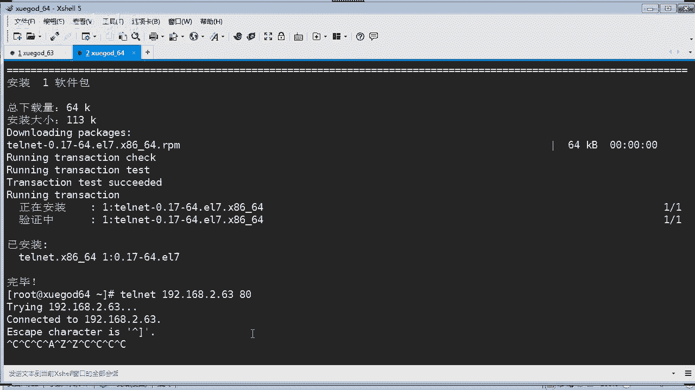
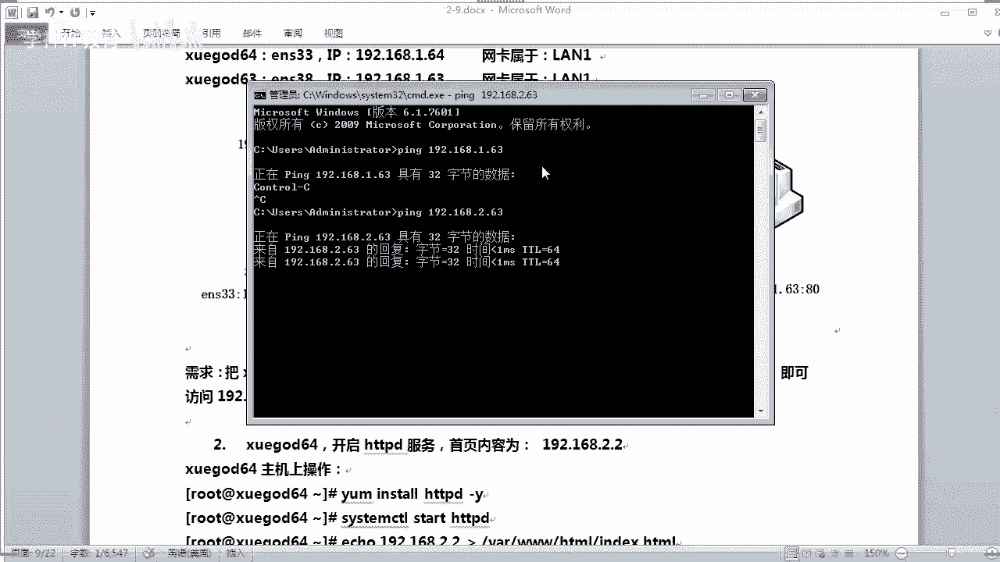
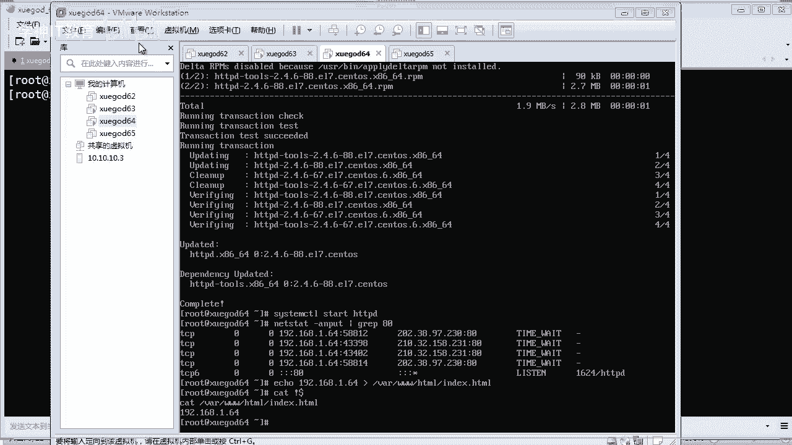

# Linux／Linux运维／RHCE／红帽认证／云计算／Linux资料／Linux教程--firewalld配置 - P1：iptables配置举例01 - 学神科技 - BV12A411e7XD

那么前天的话讲防火墙，今天接着讲啊，今天的话是第二阶段的第九章是吧？第九节课啊，我们去讲这个IP tables，然后呢再讲一下这个forword是吧？最后讲一下这个Slin啊。OK啊。

那前天的话我们做了一个举例子是吧，讲这个。啊，FTP如果是我要开启防火墙的情况下，我应该怎么样放行这个FTP对不对？怎么样放行FTP啊。对不对？那么FTP我们是有装过的，对不对？我们知道FTP的话。

它是什么呀？它的端口是21，它还有一个数据端口呢是20，对不对？是20，那么所以而且它它有主动模式和被动模式啊啊，前面我们也讲了，主动模式下是吧？它是通过什么呀？通过这个20的端口是吧？

向客户端请求一个数据传输的，那么被动的话，它是什么呀？它会通过一个随机端口啊，一个高位的随机端口连接什么，连接这个客户端的一个呃一个随机端口进行一个数据传输了。

那么这里就会涉及到你要开放了端口是2021，对吧？那么还包括22啊，你要通过SH连接是吧？那么如果你有这个什么呀？80端口啊，就是we也要把80一起开放啊，还要开放这个回环口，对吧？源口的话一定要开放。

因为大部分的服务的话要跟回源口通讯的同学们注意啊这个。啊，有很多同学就是因为没有开放回源口导致一些服务啊是吧？哎，怎么老是有问题，对吧？如果你开着防火枪，记得啊把这个放心啊，这个很重要啊。

OK那还有是吧，我们还要开启这个拼包啊，如果你要P你的服务器是吧？那你要开启这个什么ICMP协议，要允许它可以拼，对吧？允许他可以拼，这样的话，别人才能拼拼你的呃机器检测一下网络通不通，对吧？

OK还要把这个什么呀状态是吧？由由什么由上面这些产生的这些什么以链接啊，衍生态啊等等，这些对吧？都要给我放行啊，都要给放行，对不对？😊，Okay。啊，最后的话设置一个默认的一个规则，是jo的。

就是禁止对吧？拒绝掉所有。那么他先上跑上面的这些规则是吧？最后的话才匹配这个规则的嘛，对不对？这是一个默认规则啊，OK。那这个的话我们已经讲了是吧？呃，我这里就不重复了啊，主要是配。这几样东西是吧？嗯。

好，那么我们来看一下啊，往下去看呢，就是呃讲是吧配置这个weable如果。我这台服务器是一个we服务器啊，我又要开启防火墙，我应该是怎么样去做，对吧？OK那这里呢有一个top扑图是吧？

那如果是有硬件防火墙的话，你们假如你们公司有硬件防火墙是不是你们都会在硬件防火墙去配置一些相关的这个限制，对不对？比如这个数据流量的出和入的话，你们都可以做限制硬件防火墙的话，它它的功能非常强大是吧？

可以设置的非常细化，对不对？设计的非常细化，其实IP的话也是非常细化的了，对不对？它功能也是非常强大了。但是现在大部分的公司呢都喜欢用硬件防火墙，因为硬件防火墙来说的话，它更加的稳定，对吧？更加稳定。

而且啊它是独立啊独立的一个什么独立的资源运作是吧？那这里的话它有什么有它的CPU有它的内存进行一个运作是吧？完全独立的啊，它不受你服务器的一个额外的一些啊影响，对不对？😊，好。

你看啊呃我们来看一下它是配的什么东西。其实这里我们一看就知道它配的什么东西啊，呃，他配，你看肯定要放行这个22和80，对吧？如果你是做weber服务的情况下呢，你要放行这个2280啊。

这肯定要还要回环口，对吧？😊，注意啊，这个回源口的话，我们一定要放心的啊，一定要放心。很多同学不知道为什么，这个是因为我们很多远件啊，他都要跟回函口通讯，知道没有啊，所以要放心啊。呃。

那这个是import的啊，这个是这是啊，这个是分开来配置，看到没有？这里我们是分开来配置。那么上面这条呢就是一次性是吧？配置多端口这个mm的话就是可以实现多端口一次性配置就可以了。

一条命令你相当于你下面执行两条命令。O。还有放行它的这个什么呀啊，由由由上面这些产生的一些啊链接状态啊，也要放行，对吧？也要放行啊，OK。啊，最后的话啊，你把这个默认规则啊会配置为job。

就是不允许放行，对吧？他首先去匹配你的这些规则，匹配完最后都匹配不到呢，才能匹配这条规则。对吧O。嗯。哦，这里他说做一个测试，对吧？FTP肯定不不不能访问了，因为本身就不通，对吗？来，我们来测试一下吧。

那。安装这个HTBD啊。啊，有点慢了这个。好，安装这个东西之后呢嗯你可以启动它。对吧启动他。啊，你也可以把这个VSFTP的话也可以干嘛？也可以啊装一下，然后我们做一个测试。然后的话我们也来启动一下它。

是吧。ESFTPD啊，你也可以启动它啊。那么现在的话我们可以看到啊，它现在监听的端口的话应该有80对吧？80端口看到没有？有2121的话就是FTP的端口。对不对？O。好，那我们可以在这里测试一下。

我看一下有没有ellink啊，这边装有ellink啊，192。168。2。63，能不能访问呢？

不能访问吗？哎，好像是不能访问，对吧？他说没有到主机的路由啊，来我看一下啊。首先我们要看一下，我现在好像没有什么限制吧，有没有限制啊？

我们首先要看一下啊，我看一下能不能拼通。还拼是通的对吧？拼是通的那80端口的话，它是干什么呀？还不能访问是吧？那咱们来这样测试啊，我们打开一个网页。稍等啊。哎い。192。168。2。63，对吧？

啊，打开一个页面。好，那现在我们打开这个页面的话，是无法访问的，对不对？那80端口的话我们。

刚才看到了对吧？是有监听状态的啊，有监听状态，对不对？

不能访问。是不是拼的话是通的呃，不影响啊，拼的话是通。然后这个的话就不能访问。

ok。那咱们来看一下这个。ipP tables哎，我上我前天配的什么东西啊？嗯，杠L杠N看一下啊，我们做了一个。我看啊。看详细一点。NV对吧。嚟。呃，你看这里放些什么东西啊，input啊。

然后这个啊状态了放行对吧？然后可以拼包放行，对吧？回函口放行对吧？TCP22放行对吧？然后这个是什么呀？这个的话是1个ICMP的那个啊，这个也话也也是放啊，这个这个我们不用管它啊，这个不用管了。

还有下面下面这个for链是转发链，转发这个的话呃。也没有什么，对吧？对于我们这个没有关系，主要是我们是input啊，input是进来的嘛，对吧？但是我们这里呢并没有放行这个叫80端口。但我们默认的话。

它是什么呀？它是允许的，但它就是不能够访问。啊，好奇怪，那来我们把它清空一下啊。😊，好，你我清空了，他肯定是可以访问的，对不对？

这个毋庸置疑对吧？你清空了它，他肯定是可以访问的。嗯，还不能访问。难道我的IP错了吗？😡。

2。64啊，不是。我怎么搞这里了？😡，是吧搞错了啊，应该是这一台。我勒个去。80端口是有是吧，IP tables哎，我看看看错了是吧，这点这台14啊3，我们先看一下IP地址。没错啊，这个是2。63。

对吧？然后IP tables。看一下啊，看一下有什么啊NVL哈，查看一下，对吧？那么这个跟刚才你看到那个是一样的，对吧？来我先把它清空啊。😊，那然后的话我们来再测试一下啊，看能不能访问了是吧？可以。

没有问题，对吧？看见没有？清空之后呢，它就可以了，对吧？那理论上呢它是允许的，对不对？因为你在这里的话匹配不了规则的情况下呢，它会来这里匹配呀，是不是？后来这里匹配他应该是可以的对吧？

但是呢可能他这个这个的话是初始化的配置，我不知道为什么它还是不行，是吧？嗯，第五条拒绝了。第五条拒绝了吗？😡，你是说咱们的这个Vje拒绝了是吗？V站是什么意思啊？😡，没有问题啊，你看是吧，都都OK的。

😡，哦，不是这个。来。好，有同学说是VJ这条的话进行拒绝了，对吧？VJ是什么意思？VJ也是拒绝的意思，对吧？那么这一条表示什么意思啊？你看它是在这个input链上，对吧？input链上呃。

对这个什么呀ICMP pro这个是吧，进行一个拒绝。那么这个是什么意思呢？我给你看一下这条。这条是什么？这条是什么呀？拒绝端口，对吧？拒绝端口啊。

什么VJ withICMP house pro什么什么端口的这个。那应该有可能是这一条啊，因为这个是出厂默认了对吧？哦，这这台机应该是恢复了那个叫什么呀？呃，快照了，对吧？我记得上前天的话。

我们做了配了那个什么啊FTP的FTP的。好，那来。

我们照的这个配一项，我们主要是测试一下这个啊HTP和什么呀FTP看一下啊，那么现在的话它是可以访问了，对吧？没有问题。然后的话我们测试。测试什么呢？哦，我们先把这个。把这把这个什么呀。😡。

先把这个规则建立起来。

那。来，我们先执行一下啊。63啊是在63这台机进行一个操作。啊，这个是干什么用的呀？回汉口对吧？回汉口啊。嗯。哎，我应该清空一下，对吧？清空一下先。Happy tables。杠F对吧？

那现在是应该没有了啊。看一下啊，好，现在已经被我清空了啊，来清空了之后呢，我们再来执行这个那先放行你的这个回环口，对吧？然后呢呃多端口放行80和什么呀？放行80和22对吧？

可以通过这个多端口的方式来配置啊，mport对吧？然后杠杠depo写上2280啊放行。O。那然后呢我们还要放行，由它产生的一些衍生态啊，或者是已链接状态的，都要给我放行，对吧？这种也要放行啊。OK来。

我们看一下它现在的一个啊规则啊，你看到没有？总共这里的话有3条规则，回汉口是吧，还有80和22是放行的啊，还有由它产生的这种衍生态或者是已链接状态的，都要放行。OK那么我们可以看到。这个21对吧？

21端口是在监听的，对不对？然后80端口的话也是在监听的，是不是？那么理论上的话呃，现在80是可以访问的对吧？没问题，对不对？来，我们试一下啊，我打开那刷新一下，可以没有问题，对吧？没有问题啊。

我们还可以在这个64这边做一个测试elink，我看一下elink有没有对吧？那也可以访问是吧？这个就是它的一个欢迎界面嘛，对吧？欢迎界面啊，OK没有问题啊。

嗯，那么我也启动了这个FTPFTP可以吗？FTP应该不可以，对吧？是不是？因为你的FTP的话是没有什么呀？没有放行，所以的话它就不行啊。那你可以测试或者是用telllnet。

我看一下这里有没有跳net啊，我没有要杠ins。挑net啊，把这个客户端装一下。啊，192。168。是吧，2。63。那我们可以先测试一下8080挑量一下，它看通不通呢，通了，看见没有？

这样的话你看到它就是通了啊，然后的话呃。喂。这个。退出比较麻烦，你看到没有？它一直停止不了。嗯，这个好烦是吧？来，我们断开一它。

重新连吧，那然后呢我们再挑那一下这个21端口，你看它通不通。

哎，貌似也有反馈回来哦，是不是我没有放行21呀，那到底能不能？😡，打开21呢，来我打开我的这个我的电脑，对吧？

看一下啊来。然后。FTP对吧，这个2。63，你看看能不能访问。系い。可以的哇，默认是允许的吧，对吧？没有问题，对吧？啊，默认是允许的对，是吧，没有问题，对吧？那看到没有？

我们再来看我们的规则是吧？默认的规则里面呢，虽然你没有配置21，对吧？但是呢你不我说规则里面是没有配置21端口，也没有20端口。但是我们有个叫默认规则在这里是吧，它是生效的，对不对？

所以的话他就是能够访问的那你要配什么呀？除非你把这个你添加多一条规则，就叫那个jo掉，或者是你修改这个默认规则也是可以的对吧？我们用杠P的方式，然后修改这个默认规则啊，在这个哪个链呢input的链上啊。

比如你要 drop掉它啊，这样子的话那它就不行了，对吧？你看这个时候的话，你还可以吗？啊，这个退出比较麻烦。

对吧来再给你测试啊，我打开我的这个这个是吧？还还可以吗？同学们刷新。不行了，对吧？你看没有？在转了转了转。😊，是吧转不动了。

对不对？也是不行了。那这边的话我重新给你测试一下，对吧？嗯，这个21啊你看没有？正在尝试连接21端口，一直都连不通了，对吧？因为我们已经 drop掉它了，对吧？然后你看我这边的话。

这个通过这个什么呀呃这个文件资源管理器打开也是打开不了了，是吧？超时文件错误。那是因为我们把21端口给什么呀，给 drop掉了啊，OK。

那这个的话肯定也是不行的了啊。好，他是配完之后呢，是马上生效啊马上生效。OK。没问题啊。啊，你也或者是你可以通过F这里也有有LFTP吧，我看一下没有。啊啊，算了，反正我们测试是可以的对吧？那就可以了。

对吧嗯。😊，好，那现在的话就是总共有123。4相当于四个规则是吧？一个默认规则啊，三条这个放行80和22端口的规则。ok。啊。嗯，当然我们还可以这种方式去查看，比如你不用前面这个NV对吧？杠L杠L的话。

它可以它会这样子，你看没有？它显示的效果不一样啊，显示要比如这个原地址，它使用anyway的是吧？目标地址也是用anyway啊，对吧？然后呢，这个端口的话，它用什么呀？用SH就是代表什么呢？

你的22的端口，然后呢。这个。HTTP代表的是80，你说它为什么能够这样显示呢？😡，为什么他能够调用这个这个名称来显示呢？是什么在其作用呢？并不是所有的都能显示。我告诉你是什么在其作用。

是在ETC下面的service有有这个文件哎service。你们知道这个文件吧？😡，这个service里面呢定义了是吧，哪些服务用哪些端口。你们不知道吧，那比如80端口，它对应的就是啊这么多。哇是吧。

算了，我这样啊呃，比如21。哇靠。嗯，HVD哈，这样的话看比较精准一点，对吧？巴连。哇，你看。他就会查到啊，你这个80就是HTB，对吧？😡，懂我意思吗？他是通过这个文件是吧，能够把它翻译成你的服务名称。

对吧包括这个SH。是不是它也能翻译成SH啊，你的22端口就是SH啊。ok。好。😊。

那。这个没有问题啊，都还是蛮简单啊。然后往下去看啊，我们配1个SNT啊，SNT呢就像这种模式呢，就像跟我们家里的路由器一样啊。比如我们现在家里装了一个路由器。我现在IP地址是192。168。2。63。

这个是我的私网地址，对吧？那我要通过的路由上网的话，比如我发送一个数据包是吧？从我这个2。63，它会经过路由，路由的话，它会将什么呀？将我的IP转换转换成公网IP地址，对不对？公网的IP地址，然后呢。

它才会发送到外网去，对不对？这样的过程就是什么呀？就是相当于1个SNT啊，对吧？进行一个转换。看到没有？这个就相当于路由器是吧？你这里内网的PC机的话，全部要上网，都要经过路由器进行一个地址转换。

对不对？那么通过这个NAT功能就可以实现啊就可以实现了。O。好，嗯，来他这里讲到呃来。他有准备了。两台客户端对吧？哇，两台机啊，然后这个的话就模拟一个什么在你的网内内网啊，然后另外一台机器的话。

模拟的是一个路由器是吧？这个是外网。来，我们来实现一下啊，那么使64通过63能够上网，对不对？那我们应该这样去配置啊，比如。嗯，添加两个网卡配置为桥接。那么这个。38为L方式。OK那可以啊。

我们首先在这个。这个什么？这个路由器上啊添加多一个网卡，为什么呢？因为因为ED我们要通过插销来进行连接它，对吧？第二，我们要通过第二个网卡跟我内网的这个什么呀客户端进行一个连接。是不是？

所以的话我们模拟的话就要在你路由器啊，比如我要写两个网卡是吧？对不对？一个是公网服务的，一个是内网服务的，相当于这样的意思，对不对？OK那同时我们也要启用这个转发功能是吧？路由转发功能来。

我们先配置一下啊，63对吧？

6三的话，你要先那个什么呀？你要先把它停机吧。

停机啊。来打开你的微vo啊。那这个时候呢你看到啊有一个是桥接的对吧？桥接的话，它本身就可以上网，是不是？那我们再给它配一个什么呢？我们在它给它配多一张网卡啊，配置多一张网卡。

那添加网络适配器啊，下一步。那这个时候这个的话，我们可以使用把它这个配为呃L一，对吧？嗯，啊这里先随便选啊，然后。完成，然后呢，你在这里选个网段，比如L区段。就相当于把它配置成另外一段。

或者呢你用这个虚拟特定网络也可以。比如是什么VMnet4啊，对吧？我这里配成一个一个一个区分出来的一个lan的区段，好吧，叫lan区段一OK这个啊。好，然后确定它对吧？你看它在L区段看到没有？

在L区段啊，然后64这边呢我也要把它改一下啊，我先把它停机吧，反正停机好一点啊。

好。

啊，64这台机的话，咱们来直接啊改一下它的这个什么呀网络模式就可以了。我直接将它改成是吧？这个。燃气段一。是吧把它改了。OK是吧？然后呢那注意啊，这里这个学挂六4的这个这个网卡，对吧？

它跟咱们63的这个网卡2它是相通的。因为它在同一个网段嘛，对吧？同一个网段同一个网络上是不是？OK所以的话它好，我们把这两台机开启，然后呢，我们要实现目的是什么呢？64通过63来上网。

64就相当于内网对吧？私网，然后通过你这台6363呢，我就当做一个路由器是吧？那么数据会经过63，然后转出去上网。

O。

那首先的话我们先把这个啊什么呀，相关网络先配置好啊，稍等看一下开启完成没有。

稍等一下啊。Haime。启动完成啊。

哎，应该启动完成了是吧？来，我们通过这个控制台来登录看一下。okK然后我们看到这个的话，首先第一张网卡是烟子32的这个网卡名称，对吧？是不是这个网卡名称，然后是2。63，那么第二张网卡是新增加了，对吧？

它是没有没有IP地址，啥都没有是吧？

好，那这个应该是可以连上啊，对吧？可以连上了啊，我们用这个来看一下是吧，一样的效果。那么首先的话我们要配什么东西呢？啊，我们注意啊，你首先要配一张网卡，要把它配好，对吧？你这个网段呢你要配好，对不对？

比如呃我们可以通过NMTUI哎，这个是不是可以配啊，是吧？

好，我们把这个配成一个叫ES。34对吧？照着下面那个写就可以了，对吧？O。好，我们把这个确定啊是吧，启用一下它对不对？ok。好，我们返回对吧？返回，然后呢然后退出。退出。

ok。退出之后呢，我们来直接啊对这个这个ES34啊，ES34的话配1个网网络是吧，配1个IP地址。好，打开你的网卡配置文件啊。IFCF1N34对吧？第二张网卡一是34啊。OK那么我们要写IP地址啊。

你可以在后面这里写就可以了，是吧？IPADDR。等于多少？这这个网段你可以随便配点，对吧？你只要跟你的那个不冲突就可以了。😡，比如我配成192。168。好，打错了。对吧1。63。佢可。没问题吧，是不是？

😡，是不是啊？然后是muss喂。Mス。对吧。这个要配吧，是不是？啊。255。255。25。0啊，对，net mask啊写少了net啊，然后往下。网关你要配吗？😡，嗯。网关的话，你也可以呃配也行是吧？

其实这个配不配都可以是吧？不用是吧，来，那我们就不配他了是吧，然后保存并退出啊，退保存退出啊。OK然后我们重启一下。嗯。CCNC2net work对吧？重启一下啊。从启当中是吧？啊，有点慢。我去。来。

我们看一下啊，从我们从控制台看一下它重启成功了没有啊，对吧？

好像没有成功是吧，你看没有？这边的话没有看到IP地址啊，对吧？没看到IP地址，对不对？

哦，DHCP为啊呀对你看。

我们又又我们又我们又改少了一个东西是吧？对啊。这个。你既然配成静态的，那你应该把这个改掉，对吧？没错。啊，忘了这一步。保存并退出来。是吧你看这个时候就快了嘛，对吧？他马上就可配置成功了啊。

然后我们看一下IP地址，哎，还是没有吗？😊，34你看依然没有啊，没有地址，没有成功啊。对不对？为什么呀？啊。你看没有，我这里还是看不到IP地址。😡，哎，现在可以了是吧？😊，我去怎么这。是吧。嗯，好。

可以了是吧？😊，他要等一会啊，等了一会啊，这个IP地址就出来是吧？1。63。好嘞，那现在的话我们知道啊这个的话我们现在是这样子啊，2。63是可以上网了，对吧？1。63肯定是不能上网的，对不对？😊。

那那等一下六4的话，六4他要求先跟这个1。63通讯的，对不对？是吧然后呢，再到这个2。63。他才能够访问外网是吧？那所以这里呢有两个网卡，我们要涉及到这个数据流的转发。对不对？那1。63和2。

63是不是涉及两个网络卡数据转发？是不是那有数据转发的话，我们现在要把这个呃数据转发要开启。怎么开始的？嗯。你可以。啊。编辑一下这个啊直接ecle一个一吧，对吧？要写到这个哪里去呢？PROC下面的ss。

Ne。net个IPV4。有一个什么IP for word，这个你要自己写啊，对吧？IP for word看到没有这个。好，这样的话它是临时生效，对吧？当然你也可以让它永久生效。永久生效的方式呢。

就是编辑这个EDs cTLcom文件。看复文件啊。看到没有？如果你想这里永久生效，你要自己写一条啊，写一条规则叫netIPV4对吧？点IP。然后IP forward。我word的啊。哎，打错了。

这个word啊，这个叫ARD啊，word，然后是什么呀？等于一啊，那么这样的话就表示什么？永久要进行啊这个转发路由转发，对吧？要保存对出啊，如果你要让它马上生效的话，你应该sist点CT1杠P，对吧？

对啊，他会索引一下你的这个配置文件，让它生效。ok。😊，好，那么这个时候呢我们看一下啊，我们的这个IP tables现在是什么个状态，对吧？嗯，刚才我们是配了哎，我清空了吗？哦，对我刚才配置完之后呢。

并没有清空，只不过是重启了，没保存。对，没有保存。然后重启了这个这个主机，对吧？重启了，所以的话你看到这里的话，啥都没有了，对吧？没关系啊，我们知道是怎么回事就可以了。呃。

然后的话啊知就相当我本来就是要现在做实验，我本来就要清空掉啊，清空掉这个规则是吧？ok。好，那这样子啊，我们清空掉了所有的规则啊，我们这个时候呢我们就来配置这个什么NATT的，对吧？

配置NNT怎么样实现啊这个1。63能够是吧能够上外网呢，对不对？是吧就反正1。0的网段，它怎么样能够出外网呢？是不是你现在2。64，这个是连不上的呀，对不对？不可能连得上的呀，对吧？

它的网段的话现在都跟我们现在是不通的，对不对？我们先把它配一下happy tables。杠TNATT哈，注意啊，你远要进行呃，这个数据NATT转换的话，就在这什么在NATT表里面配。杠H表示添加啊。

然后是pose。rooutin对吧？哎，这个要大写，同学们，这个要大写啊POS。T啊roing啊，对吧？然后。原地址杠S，我们就用网段了啊，192。168点什么1。0的网段。注意啊。

这个跟笔记有点不一样。我因为我这里用的是什么呀？我的我的外网的话就是说我能上网的地址段是2。0的网段，而我不能上网呢，网段呢是1。0网段是吧？刚好跟笔记这个网段反过来。注意是吧。那这个网段的话。

我要进行什么呀？进行一个动作杠J就是进行1个S。NAT的一个动作是吧？然后to让它进行个什么呢？进行把它转换到192。168。2。63。注意啊，我要它转化到2。只要从这个网段过来的数据是吧？

转化到这个这个这个IP地址，因为这个IP地址是能够上网了。对不对？是吧那路由器里面，你可以把它这个当成一个公网IP地址是吧？模拟啊模拟。ok。😊。

这样的话我们就可以看到啊呃哎这样的话你看不到我们要查看这个什么表NT表，对吧？这样你看到看到没有？有这条记录啊，是吧？所有端口看见没有？😡，进行什么呀？进行SNAT的动作，对吗？ok。😊，啊。

原地址就这个网段来来源啊，然后去往任何地址是吧？去往任何目标地址，然后转化成这个转化成这个IP地址，它就能够上网。当然你还可以用另外一种方式来进行啊配置，还记得我们前面讲嘛，有一个叫伪装，对吧？

伪装啊伪装的话就可以啊比如。把它是吧从哪个出口，这个是什么呀out的出口是吧？你要走哪个出口，全部让他走什么呀，全部让他走这个N3啊，这里就不是33了啊，对吧？😡。

就是说所有来源于这个网段的所有数据包是吧，让它往这个往这个网卡处对吧？往这个网卡处啊，进行一个伪装是吧？伪装然后转化出去，就完全不管。当然呢，我们刚才已经配置了一条SNT的。

那我们就没有必要再配置多一条了，对吧？这条我们就可以备了，你只选其一就可以了，是吧？只选其一就可以。啊，对。1。0网段嗯提醒我了，说明你们很认真呐，对吧？很认真是吧？我们应该是把一点，我这里是1。

0网段转化出去啊。嗯。好了，我们64你现在肯定是连不上了，不可能连上啊，我们只能在控制台这边操作。

好，这个64对吧？64虽然我之前配的IP地址是2。64，但是没有用，对吧？你现在肯定是不能上网。那我现在拼一下给你看啊，拼一下这个百度。肯定是不通通不了的啦，是吧？为什么呀？

因为因为它在不同的一个网段上，是不是它不是调节模式啊，对不对？怎么办？对吧？我们在这里配一下，让他能够上网，是通过我们的这个63进行SNAT的方式进行上网，对不对？好，那我们来配一下。网卡配置文件啊。

Ne。What。嗯。我们对这张网卡啊做一个配置。那这里要改什么呢？啊，同学们看啊，首先你的IP肯定要改改成同一个网段。是吧。是不是？这个要改成一吧。是不是啊？然后你的这个网关的话呃，网关改成2。1。

还是不改改吧。这个它有的话，我们都要改。是不是？然后还有什么呀？DNS我们可以不管它，对吧？它保留这个就行了啊，只要它网络能够通，它就能够访问这个DNS。对不对？ok。可以吧。2。631。63。啊。

指量指向到1。6层，对吧？应该是要指向到1。63，是不是？为什么？😡，因为你的网关就是呃，通过你的1。63出去的啊，没错。是吧。来6。63A。63对吧。O。好。可以了是吧。然后我们这个也是调成什么呀。

也是静态，对吧？啊，最后的话我们来保存退出啊保存退出重启一下啊，重启一下啊。嗯。哎。VS大一侠，你的网卡。好，我们看一下IP地址，现在IP地址是1。64，对吧？它能不能上网呢？来我们见证一下啊。

可以的吧，对不对？没有问题了啊。是不是？你刚才拼百度都是通的，说明是OK的对吧？没有问题了，是不是？这样的话他就是通过什么呀？通过SNAT的方式出去了，是吧？他走的是什么呀？走63对吧？走63。

然后才到什么呀？才到外网去。ok。😊，嗯。OK那。好，你们你们你们呃实验成功了吗？😡，有没有问题？啊。有没有问题？有同学问我，你怎么知道他是从63出去呢？嗯。怎么知道他是从63出去？

因为我这个配的是同一个网段，对吧？同一个网段。啊，或者是这样子吧，不是有一个叫那个啥啊，路由追踪嘛？诶，路由追踪的命令是哪个来，我试一下啊。路由最终是TRAACETroot对吧？啊，对。

是这个为什么敲不出来呢？T r a c。Yi。😔，没错吧，TR。ACE。是吧。嗯，那就是没装啦。是不是？应该是没有装这个东西，所以的话你就没有这条啊命令，对吧？来我们装一下。我们来做一个路由追踪。啊。

install一下TRAAC对吧？一 row是不是这个是这个啊，来我装一下啊。咱们又拓展一些东西啊。😊，因为他现在能上网，对吧？他可以通过我们这个网络源啊，本地云也有是吧，就可以上网了，对吧？啊。

TRAAC对吧？road那可以敲了是吧？那我们可以追踪啊，比如。追踪什么呢？啊追踪百度。你看啊，同学们看这里啊，呃你看没有？我们可以通过啊，追踪的时候呢，它首先跑的是什么呀？它跑的是到你的这个网关。

对吧？1。63是吧？多少毫秒是吧？后面那些我们可以不要了，先停止它是吧？我们只要看一下这个路由它是怎么走的，对不对？好，先到63之后呢，然后呢到2。1看到没有？2。1呢就是我家里的路由器是吧？2。2。

1啊，然后我的路由器呢就会到这个什么呀？这个电信的一个网关113。71。208。1看到没有？然后每一条路由的出去，最终的话再到达什么呀？到达你这个呃百度的地址对吧？百度的地址，这样的话。

我们就可以看到啊，你这台机器斜挂64就是通过什么呢？通过63上网的，看清楚没有？对吧这个是路由跟踪的一个命令啊，可以测试一下，是不是？当然你可以测试呃，其他的一些都可以啊。比如我们测试一个已知的网络。

8。8。8点。啊。对吧他也会走这个1。63是吧，一样的啊，看没有？那每一个每一层级的路由，它都很明显可以看得到，对吧？嗯，非常详细啊。好，那。那你看走了好多路有是吧？哦哟，我要去。

有些这些的话你看不到的啊，是吧？那最后的话他走到谷歌的一个Ds服务器8。88。8是吧？通过21毫秒，哎，其实也蛮快的是吧？21毫秒，虽然看那个时间很长，那么解释这个过程的话，它其实还是蛮快的啊。好，嗯。

这个没问题吧。

O。好，讲了SNAT之后呢，我们继续来讲这个叫。DNATT啊。DNT又干什么用？😡，对吧DNT跟什么呀？跟你SD杠反过来嘛，是吧？一个是原地址转换，一个是目标地址转换。哎，那我们可以这样子啊。

比如把内网的一个weber服务器端口映射到路由的外网去。那么这样你通过外网来访问你内部的一个weber服务就可以直接访问了，对吧？有了DNDNAT的话，是不是就很方便了。是不是？OK啊，64的话是哎。

我们就拿这个来做吧。比如我们现在是啊1。63，对吧？没错啊，是吧，这个的话有一个叫。这个63啊，这个网法是2。1的对吧？好，那我们如果要访问啊访问这个内网64的这个是吧，我这里应该是叫1。63，对吧？

ok。好，网关的话是哦64。我又搞错了是吧？5。63。对吧我的是应该是这样子的啊。对不对？那如果我要访问什么呢？啊，访问你的这台机。怎么办？访问啊64的weber服务是吧？

那我先将这个呃80端口映射到63啊63的80端口。那么后端访问1。63的80和即可访问2。20的80端口的意思，对吧？是不是啊？访问1。63，它就能够什么呀？它就能够。他就能够干什么？访问这个哎。

我应该是这样子啊。我跟我这里的话有点不一样啊，访问1。64。对吧。它就可以映射嘛，是吧？那但我这里能够拼通1。63吗？同学们。我这台机能够平成1。63吗？

我问你啊。我这个能拼通1。63吗？192。168。1。63。能拼通吗？不行是吧，为什么？因为我没有转发，那我应该怎么配，我应该配2。63是吧？配2。63是可以通的那我这里应该怎么做？

那我应该这里的话，我就直接干什么呀？把2。63的80端口对吧？直接映射到1。64的80端口。可以吗？同学们，那我这样做行不行？因为我2。63本身的话就可以上网是吧？我只要访问2。6380端口。

让它跳转到另外一台机的80端口。是吧那我就这样做啊，你看我是怎么做。

嗯，首先的话我们拿这个。哦，64上你要装上哎这个HDVD对吧？来64的话，你只能干什么呀？你只能通过这种方式啊，对不对？通过。

通过控制台对吧？打开HTPD装一下啊。我做完这个实验之后啊，我给你们一个一个作业。好不好，你们怎么样能够实现通过我现在插效啊，就这种这种这种状态下，能够访问连接这个64，你应该懂啊。

是吧我做完这个DNT之后呢，我相信你们应该知道怎么做。OK好，那现在的话我们一样啊。😊，先启动一下HPD。启动完成，我们先看一下它有没有这个80端口，对吧？看到没有？80端口的话，它是在监听的对吧？嗯。

没有问题，对不对？那服务已经起来了是吧？那现在的话我们就要做一个测试吧，写点我写个内容吧，对不对？写点内容进去，要不然的话嗯。看不出来对吧，我们就写他是。192。168点是吧，2点不是。这台机是1。

64是吧，写到哪里呢？写到Y下的3个W下面啊，HT啊有个index。我们写到这里。好不好。嗯，让我们看一下这个。看到没有，那这个现在你访问这个的话，你看到的它就是什么呀？1。64的。如果访问这个。

这个什么呀？1。64的时候，它就显示这个内容，对吧？我们特意就要这样搞的，对不对？然后我们来做一个测试了，对不对？嗯，我们可以在63上先测试。

633有没有elinks啊哦，没有装。我先装这个东西是为了测试的啊。并没有什么。好，我通过这个63上的这个ellinkux啊，这个是字符界面的浏览器来访问192。168。1。64，看一下有没有问题。

没有问题是吧，你看没有？可以看到这个内容吧。是吧可以看到这个1。64的内容。OK说明没有问题啊，是不是？OK哎，我们可以这样子啊嗯。😊。

但。是吧这样不就可以了嘛，对吧？这样就可以测试了啊，很方便啊，是吧？没有问题。好嘞，那这个时候呢我们要配一个东西了是吧？能够实现通过什么？通过我们浏览器是吧，能够访问什么呢？当我访问2。63的时候。

它就跳转。

跳转访问什么呀？跳转访问啊，咱们的这个。叫1。64的内容是不是？那这里的话我看一下啊，先把这个看一下。

就。我这里好像也装有20哦，对吧？你看我的80的话是没有启动的啊，我的80，我就我这台机的这个HVP啊是没有启动的啊，注意。😡，要不然等一下搞得有点冲突了，对吧？好嘞。

那看一下我们IP tables里面的规则。gang。NV L。里面的话呃O。没有什么东西，只要我们的这个NIT有东西是吧？NIT里面有东西哎。NNT因为它有一条叫SNT的一一条规则而已啊，并没有啊。

这个是我们现要做DNNT对吧？DNNT啊，来，我们开始了啊。怎么做？😡，嗯。IP tables对吧？杠T啊，然后在你的NIT里面做没错，对吧？所有做数据转发的都是在这里啊，是吧？然后是什么呀？

是outing了是吧，不是roing了，对吧？嗯，然后是PREroing对吧？TING啊，然后这要做什么东西呢啊，那你可以指定指定啊指定什么东西啊，指定访问这个。这个网段或者是这个IP地址。

这个80端口的，然后进行一个目标地址转换，对吧？比如你要访问192。168。2。63，这个IP它的协议是TCP的。对吧而且端口是什么呀？端口是80的。那么你就给我做一个什么做1个DNT转换啊。

后面跟上动作DMAT。对吧要后看看to。好，把它转到哪里去呢？转到192。168。1。64冒号。80。对不对？😡，这个没有问题吧。😡，这条看得懂吗？是吧？就说你要访问2。63的80端口。

我就把它跳转到这个另外一台机的1。64的80端口去，什吧，那我们执行。执行完成之后呢，你们来看一下是吧？那么呃嘿。没看到吗？😡，NATT里面。我这么没有啊，在这里，对吧？😡，看到没有？在这里啊。😊，O。

😊，看到没有？在这里，然后我们来测试一下啊。打开网页。

刷新。你看没有？😡，我们就可以看到1。64项的内容了吧。没问题吧。是不是？那刷新刷新没问题啊。这样的话就可以了。对不对？这样的话就可以相当于什么呢？相当于访问你这个路由器的公网地址。

但是他访问80端口时候呢，他就帮我转到内网一台什么web服务器去了。O。是吧当然还有另外一种配置方法啊，另外一种配置方法是怎么样子呢？😡。

啊，另外一种配置方法的话，你可以直接使用网卡的方式是吧？不用指定IP比如啊什么呀。杠II是什么意思？I和OI是进是吧？进网卡，比如进网卡是ENS这个什么呀？32。从这个网卡进来，对吧？

并且访问他的是TCP协议，并且他是什么呀？并且是80端口低泡。是不是我们就进行一个动作杠接什么动作呢？DNAT啊DNAT的动作对吧？然后杠杠tto啊，然后转发到192。168。1。64的80。好。

这样子也行了啊，同学们。这样去配也行，对吧？OK那当然了，你这两条规则你只选其一配就行了啊，不要配那么多啊。你看我这里把两条都配上去了，一条就可以了，是吧？😡，啊，你其实你你你配一条就可以了。😡。

有的同学，你说哪一条好呢？😡，其实第二条的话有一个好处。什么好处呢？我是指定的是网卡，就说我无论你这个网卡变什么IP地址是吧？我都不影响访问我内网这台的webo。是不是有这样的好处？

但是你上面这条呢是指定IP的，看见没有？只有访问2。63。那如果我这个公网IP变了呢？你是不是的话，你又得改这条规则是不是要改这条规则，没错吧？但是我用下面条规则的话，你的公网IP变了，无所谓了，好吗？

无所谓，是不是？因为我指定是网卡，只要你从过这个网卡的数据包进来，我就可以把它跳转是吧？啊，各有好处啊，是不是？😡，明白了吧？好，那OK没有问题是吧？我们测试的话呃都没有问题啊。😊。

当然那如果是像你们嗯如果你在这台机装了装了有一个什么PPOE拨号的话，也可以实现，对吧？PPOE拨号的话，无非就是将什么呀？将这个这个网卡改成什么PPOE的这个接口地址就可以了。比如PPP。是吧0。

就OK了是吧？当然了你也可以实现，比如访问不一定是80端口是吧，其他端口也行啊，8一或者什么端口进行转发，对吧？OK都没有停，不一定说一定要80转发到80，你可以8一转发到80或者是80转发到81都行。

是吧？只要你你这个东西你配好就行了。😡，O。好，嗯，来我们总结一下这个IP tables。

IBd的命令啊，总结一下啊，我们有用到input链 output练for啊，for还是比较少是吧？其实是input是最多oppo几乎是用不上，对吧？出口的话，我们一般不用管它，只管进来的是吧？对不对？

你进你能进来肯定你是安全的是吧？我所以我们只管入口，不管出口，是不是O嗯for转发嘛，这个的话是做什么呀？也是做这个N对吧？做我们这个DN然后这个做SNT啊，所有表明必须小写注意啊。

表N表mangle表对吧？其实呃mangle表其实还是蛮少的，对吧？我们很少用啊，只是NAT和的话就会比较多用一点啊，动作的话要大写是吧？对不对？照SNT啊等等等等啊，伪装啊是吧？允许等等啊。

所有匹配呢要小写是吧？比如杠S来源杠D呢是目标地址杠M的话指定是么？端口是吧，或者是模块模块的名称杠P的话，指定这个协议，比如TCP啊、UDP啊等等啊。OK是吧SNT如果你想看它更多的区别。

你可以看一下这个地址是吧？其实SNT呢就是原地址转换目这个DNNT呢就是目标地址转换，其实我们一看就知道了是吧？你要原地址转换什么地址，或者是目标地址转换到什么地址，就这样的意思O。😊，行啊。

我们先课间休息一下。接下来我们再讲一下这个啊forword和S news好不？我们先休息啊，休息一下啊。

