# Linux／Linux运维／RHCE／红帽认证／云计算／Linux资料／Linux教程--firewalld配置 - P2：firewalld配置02 - 学神科技 - BV12A411e7XD

好，那咱们讲一下这个。S一linux啊Slinux它又是一个什么东西，我相信你们应该都知道Slin，但是呢实际我们都没有用它，对吧？因为它这个东西安全级别太高了，是吧？

这个东西我们只要了解一下它就可以了。没有必要去啊使用它。基本上我告诉你在生产环境的话，都是把它关掉的啊，都是把它关掉来看一下什么是Slinux啊。OKS list的话，它是安全性增强的一个能力士啊。

它是由美国国家安全局NSA啊开发的。看下，美国老开发的一个什么呀，美国老开发的一个什么呀一个安全工具。嗯，他为了构建和这个内核，构建在这个内核之上啊，拥有灵活的强制性访问控制结构。

主要用在提高这个linux的安全性，提供强健的安全保障，可以防疫位置的一些工具啊，根据相当于什么B1级军事安全性能，嗯，对吧？B1级的军事技能啊，你要B级是到到底是哪个级别呢来看一下是吧？它有一个。

一个什么安全的一个标准啊，看到没有？

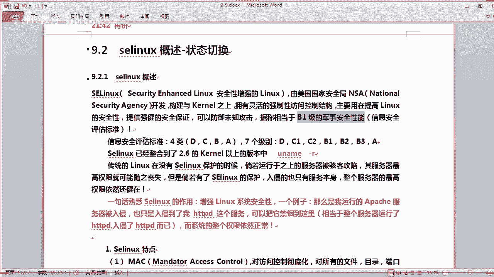

那么信息安全评估标准分为四类啊，有DCBA是吧？那么有7个级别，有D，有C1C2、B1B2B3，还有A类。那这个这个S呢就是在B一类。那B就是在这个级别。看到没？他所处的一个安全级别在B一类，看到没有？

所以他的这个级别是非常高了，对吧？S list呢它是已经整合到这个内核里面去了，是吧？你可以查看啊，2。6以上的内核都有啊，你可以通过U name杠R来查看你的内核。我们现在目前内核应该是3点。

301吧。对不对？

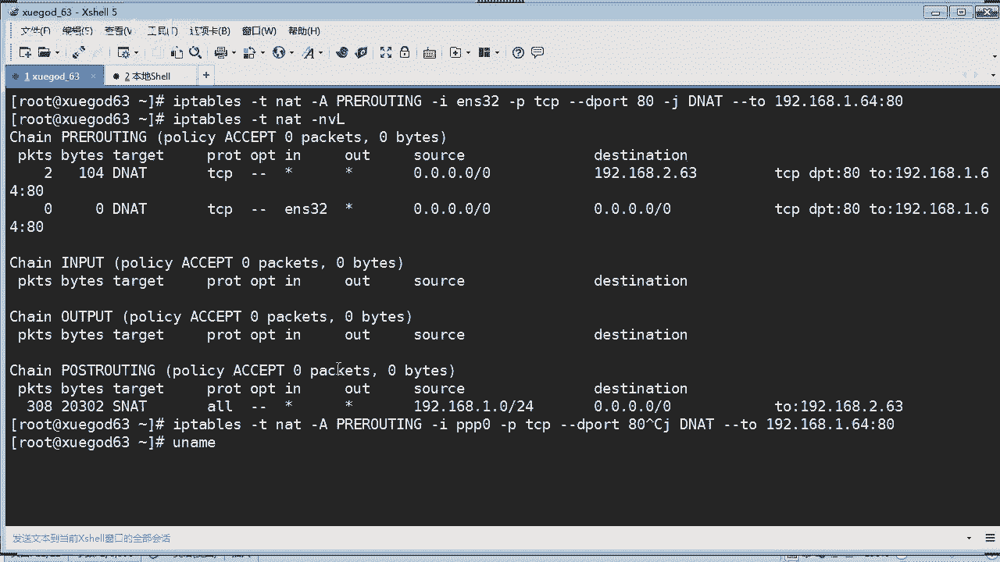

你看没有？3。10是吧？OK它肯定是整合了。那么传统的linux呢在没有Slink保护的时候啊，倘若运行之上的服务器被这个骇客攻攻线是吧？其服务器最高前限就可能啊丧失。倘若有了S links保护呢。

入侵也只有服务本身。整个服务器的最高前限依然健在啊。一句话来熟悉，S links作用呢就是增强咱们这个S links的系统安全。啊。比如一个例子。啊，比如我们运行这个阿帕奇的服务，假如被入侵了是吧？

如果你开启这个S呢，也是只入侵了我的这个阿帕奇的服务，可以把它进锢到这个服务里面。相当于整个服务器运行了HP入侵了这个HB而已并没有啊整个系统能够啊操作是吧？整个系统权限还是依然正常啊。

OK就这样的意思，那么S有哪些特特点呢？你看一下啊。第1个MACC啊访问控制彻底化，这是第一个特点。那对所有的文件目录端口的访问都是基于策略设定的。其实说白了，他就是有一个数据库是吧？哎。

其实根据IDP tables呢，原理差不多。那么你哪些规则能不能访问呢？都是在他数据库存着啊，每一个东西要进行一个什么呀，你要进行活动。哎，那我就看一下在我的书上有没有允许你是吧？能不能活动，不能活动。

不好意思是吧？你必须禁锢在这里，对不对？那么这些策略呢都是由管理员设定的。一般用户呢是没有权限去管理和更改的啊，第二个特点是RBAC什么意思？对用户只赋予最小权限啊，就最小化原则。那么对用户来说的话。

被划分了一些角色啊，对吧？即使是root用户的话，你要是不在这个这个它的配置这个里啊，你也是不能运行这个什么呀这个管理操作的是吧？就是root你也可能不是最高的权限去能够搞它啊。第三个特点是TE啊。

对进程赋予最小权限啊，最小的运行权限TE的概念呢，在S历中啊，非常重要。它的特点是对文件赋予一个叫什么类型啊标签啊，标签类型是吧？那么对于这个进程赋予一个叫什么demo的一个标签。

可以规定某个标签进程只能执行某类文件。OK比如啊像这个进程VIM对吧？比如它只可以读标签为T的这种文件。如果你这个A点TST，它是T的标签是吧？那么这个VM呢可以是吗？可以读出来，是不是？

但是如果是T2的标签呢，不好意思。你就不能读了。😡，所以呢他在这个这个里面呢，如果打了标签是吧，允许你啊，标签其实就是一种分类嘛，对吧？比如你是帅哥，那你就被划分划分为帅哥这个这个类别了，懂吗？

你是美女，那你就属于美女这个行列是吧？那如果不属于你这个类别，你要去访问的话，他不给你访问啊，就打标签。啊，S list呢它有三种模式，其实我们都知道，一般我们把它关闭的对吧？

一般我们都把它关闭december，对吧？OK还有这个。啊，这个的话是什么呀？强制模式，也就是开启的对吧？第二种模式呢就是警告模式是吧？你可以执行，但是全程呢会做一个记录，记录在案对吧？警告模式啊OK。

那这个是的工作原理图，你来看一下，给你解释一下啊。首先啊比如你有一个一个一个一个进程是吧？这个进程你要干嘛呢？你肯定要经过S呢你这个进程，比如你要发出一些动作要干什么对吧？

全部都是在监控下假如开启的是吧？对吧？它就会去查这个S数据库啊，这里有个dabbase看到没有？查这个数据库数据库里面啊，说明你是什么呀？比如你是一个白名单或者是你是可以正常运行的是吧？安全可以运行的。

它才会放行你是吧？才会放行你如果数据库找不到你哎，不好意思是吧？我不给你运行，对不对？那其实它眼里跟我们I是差不多的对吧？我有这个规则，我就匹配你没有规则那就拒绝你。对不对？啊，OK之后呢。

他就会放心你，你就可以运行了是吧？就是这样的意思啊。😊，O。你可以查看一下这个SD的话有这么多的依赖包，对吧？咱们装完之后，哎，其实它默认就是已经装有了，对吧？默认就是已经装有了，你看一下啊。

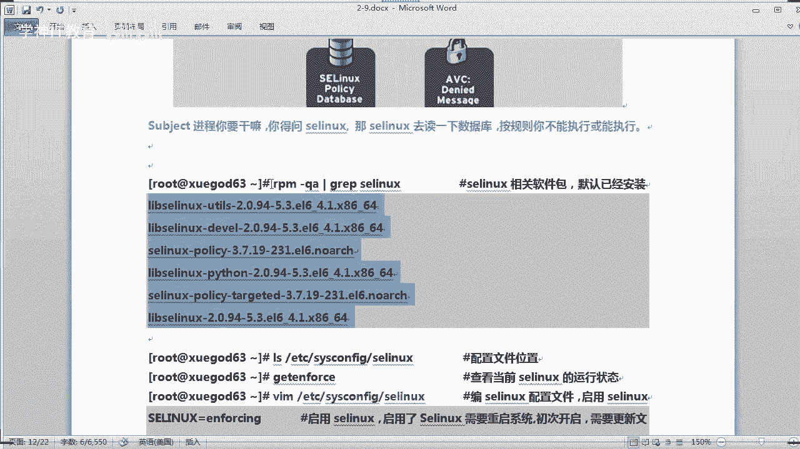

是吧那么总共的话有123455个一赖包组成安装这个S links的啊，同学们。

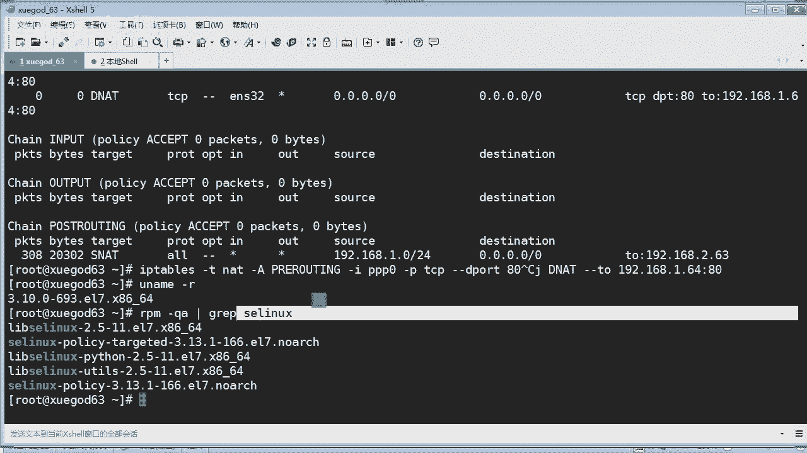

配置文件啊，其实这个我们都知道，在ETC下面的sfi里面是吧？当然你可以通过这个这个来查看它现在目前的一个状态，对吧？啊，getge是吧，get forth，然后看一下它的状态，这个什么是什么状态。

还有一个叫。

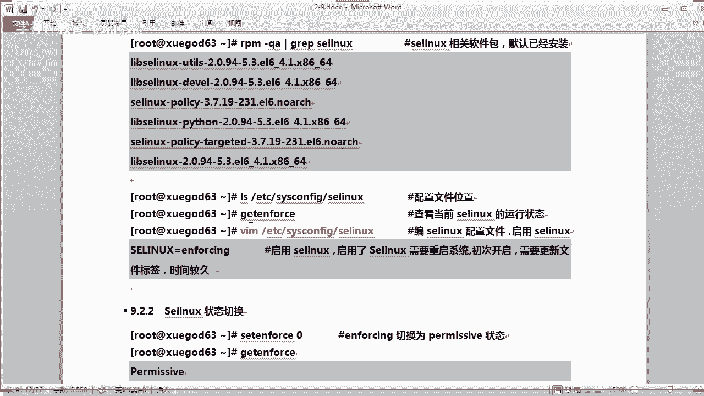

这个也应该可以。看到没有？这个叫。SESSEstar对吧？这个也可以看啊，同学们。😊，你们应该很少超过这个面令吧。对吧这样也可以查看你的S地址是什么状态。OK好的啊，当然了，一般呢我们都是把它关闭的啊。

因为这个东西太前限太高了，你要配起来的话也不容易不好搞啊。大部分可以说99。9%的生产环境啊都是关闭S的OK。

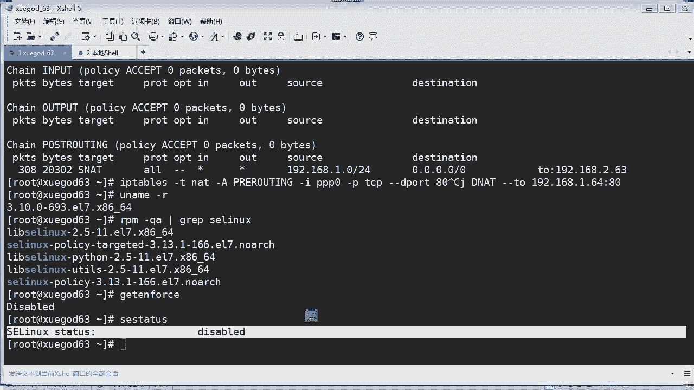

你可以通过这条命令的话，切换它的状态，比如set是吧，set这个 force force以后进行什么呢？进行把它设置成啊零，它就变成一个警告模式，对吧？警告模式，然后你再获取下它的状态就变成警告模式了。

对不对？你把它设置成一。就是什么呀？开启状态明白没有？那SD呢我们不会详呃详详细的给你讲的非常细致。因为这个东西的话本身不常用。没有？没有什么太大的一个作用，对于我们来说，它前限太高了。

你既然把它开的话，你很多服务运行起来都会有问题啊，比如一些异常的报错啊，是吧？等等。你要去排查的话还比较麻烦。嗯，O我们认识一下它就可以了，好吗？

那接下来我们讲一下这个forwardforward的话是在37以后出来之后呢，它就将这个防火墙啊，是吧？重新啊重新封装了，叫做forward对吧？它它跟我们这个。IPtables呢有什么区别呢？来。

我们来学习一下它。forward是什么东西，你来看一下，它提供啊这个支持网络防火墙区域定义网络连接以及接口安全级别动态防火墙管理工具。说白了它就是一个防火墙，对吧？就是防火墙的一个工具。

为什么叫for呢？是吧？那么其实它提供了一个更呃呃有别于IIP tables来管理这个什么管理这个这个内核是吧？管理这个内核防火墙的一种一种新的一种机制。是什么意思呢？说的还是有点抽象。

咱们来学习一下啊。它叫动态防火墙是吧？首先我们要弄明白第一个问题是到底什么叫动态防火墙。为了解答这个问题，我们先回忆一下ip table service管理防火墙规则的模式。

那么用户呢你使用命令添加防火墙规则。如果想让它规则永久保存，你还需要干什么？执行这个serviceip tables呃，应该是什么呀？永久保存应该是safe，对吧？vload的话，应该是重载，对不对？

对吧使变更的规则保存到配置文件里面啊，对不对？这种方式它也可以保存规则里面确啊，或者是s也可以啊。那么在整个过程背后呢，这个ip service的话会对防火箱的规则列表全部读重读一次加载到内核。

这个是ips的这个啊。那如果我们把这种哪怕只修改一条规则，也要进行所有规则，重新载入到这个什么呀。载右的这个模式称为静态防火墙的话，那么forward呢所提供的模式呢就可以叫动态方向。

其实它跟这个IP呢就反过来是吧？IP你把这些东西你配置完成之后呢，它并没有呃马上保存到你的配置文件里面去的，对不对？for它是动态它的出现就是为了解决这个问题。

任何规则的变更都不需要对整个防火墙列表进行重新加载啊，只需要将变更部分保存并更新到运行中的IP即可。是吧啊，这个是他的跟ip一点区别吧。OK那么它两者又有什么关系呢？对吧？

为什么有ip还搞个forward出来呢，是吧？有什么作用啊？那这里有必要说明一下他们两者之间的关系啊，forward的话提供了一个叫demo是吧？后台运行是吧，和这个服务。😊，还有什么呀？

还有命令行和图形工具配置的工具啊，当然我们这里没有安装一个图形界面工具啊，它仅仅是代替了ipP tables service的部分啊，其底层呢还是使用什么呀？

还是使用IP tables作为防火墙规则管理接口，只不过在这个上层是吧？在写了写了一个优化，给你去做一些相关配置的时候呢，更加好像是简简单简便一点，对吧？比如提供什么呀？提供图形化界面给你去配防火墙。

看到没有？是不是增加了这样的东西，就不是将它改成更加好像更加容易管理，对不对？其实我个人并不觉得更容易啊，你往下去看啊，forward自身呢并不具备防火墙功能啊，其实它是一个外壳工具，对吧？

而是和和ip一样啊，需要通过内核的这个net filter来实现。也就是说forward和ip一样的啊，它们的作用呢都是用一个什么呀？维护规则，说白了它就是一个搭桥工具是吧？搭桥工具。

那最终呢还是用由由这个net file来实现对吧？内核的net file实现，而真正使用规则干活的还是net file对吧？只不过forward和iplip结构呢以及使用方法不一样而已。

也就是说你可以这样去理解啊，这个forward。吧forward啊和这个IP tables啊，它都是一个什么是一个外壳的工具啊，这个工具操作完成之后呢，所有东西呢是交给谁啊。

交给这个net filter来进行什么进行一个啊执行，明白没有？他都像一像那一个工具啊。OK。讲这个for呢，你要认识一下什么叫区域了是吧？这个叫什么john，对吧？区域它是干什么用呢？这个就是。

这个forward的一些啊配置配置的话，它是按一个区域。然后区域里面呢呃你可以在这个区域里面配相关的服务进去啊。你看一下啊，一个区域就是一套过滤规则，数据包，必须要经过某个某个区域才能入站或者出站。

不同的区域呢，它规则的这个力度粗细，安全强度都不尽相同啊，你可以将这个区域看作是一个出站，或者是入站必须经过的安检门啊，有严格的有宽松的对吧？有检查试机的有粗略的，就像你去做高铁。

那么坐高铁呢做高铁是比较严的是吧？就它有很多安检的安检的入口，但是有些入口呢更加严格是吧？啊，要你把什么把外套也脱了进行检查或者怎样怎样。但是有些入口呢，它检查的话，可能就没那么严格。

只是拿个扫描一给你扫一下，哎，没有问题，就像你过了。是吧？你可以这样去去理解啊，就像安检门，有些是严格的安检，有些是宽松。重按键啊OK那for word它将网卡对应不同的这个区域啊是吧？

有不同的这个比如相当于有9个安检门啊，你可以这样去理解9个安检门都在这里啊，同学们看一下啊，9个安键门啊，这个blockDM is that job等等等等啊，你看。是吧9个99个安检门。

每一个安检局门的他的这个这个什么呀，它的这个检查的细腻度啊，安这个级别的高低啊都有所不同是吧？那不同区不同区域的这个之间的差异，对这个数据包的默认行为的不同，对吧？因本身它可能放松一点啊。

那你有些规则它就可以跑啊，根据区域名称我们可以很直观的知道该区域的特征啊，那么在37的系统当中啊，默认区域呢是这个公共是吧，公共区域啊，可以这样去理解，这个是公共区域是吧？来，我们说一下这个9个区域啊。

9个区域它的级别到底。区别在哪里啊？做这个的话是任何接收网络数据包都会被丢弃，没有任何的回复，仅能有发送出去的网络连接。哎，如果你配置成jo的话，毋庸置疑，谁都进不来，是吧？谁都进不来。

block的话就是接收任何啊任何接收网络连接都被IPV4的这个这个什么这个信息和IPV6的这个信息所拒绝，就样是这两个对吧？如还有一个公共公共区域，就是目前它默认的一个区域啊，公共区域的话。

就是不能相信网络内其他计算机不会对您的进行造成伤害，只能接收经过选取的链接，什么叫选取，就是我规则里面能够放行的，说白了就是在我白名单了，对吧？你就可以进来啊。O还有外部区域外部区域。

特别是路由器启用了伪装功能的外部网，你不能信来自网络其他。计算不能相信他们不会对你的计算机造成危害，只能接收经过选择的链接。它这个也是经过啊选择链接啊，外部还有均啊非军事对吧？非军事。

这种话用于非军事的电脑，其区域可以啊可公开访问，可以有限的进入你的内部网络，对吧？就是非军事啊，O还有work工作的这个区域用于工作区啊，O这个呢就是基本相信网内的其他电脑不会危害电脑。

如果你配成这种区域的话，对吧？还有家庭区域啊，家庭区域的话就是信任了是吧？信网内的所有计算机不会危害你啊，O啊也是用于内网啊，还有这个什么啊这个信任啊，就接受所有网络链接的一个区域啊。OK。呃。

简单来讲的话就是为用户预先准备了几套规则集合。说完了这些所谓区域呢，它都已经写好了一些规则集合在里面了，是吧？不同区域它就有不同的规则集合。我们可以根据场景不同，使用合适的规则集合。

就说你可以配置成不同的区域就可以了，是吧？但是现这样其实也并不能满足我们的一些细化要求啊，所以我们还要通过手工去域修改，对吧？默认，比如是现在这个是公共区域啊，公共区域。讲完区域之后呢，再讲服务啊。

它有一个服务的概念啊，这个forward服务又是干什么用的？同学们来看一下啊。你安装完这个forward之后啊，本身就装了啊，在这个USR label项目forward service目录当中啊。

它保存了另外一类配置文件啊，每个文件对应一项具体的网络服务，比如SH啊这种就是服务嘛，所谓服务呢就是各种软件，对吧？各种软件。已知对应的配置文件呢记录了各项服务所需要的这些TCP或者UDP的端口啊。

在最新的版本fo窝呢默认已经定义了70多种服务供我们显示。70多种也并不多啊，是吧？所谓70多种可能一些常用的服务，比如像阿帕奇呀、SH呀呃FTP啊，像这种常用服务呢，它可能集成到这个服务了，对吧？

当然你也可以去手工添加一些服务。手工也可以写服务啊，比如你们公司开发出来一个什么呀新的软件是吧？你在这个这个默认默认文件里面肯定没有这个服务，你可以自己写一个服务配置文件是吧？😊，对不对？

那么当默认提供的服务不够用，或者是需要自定义某项服务端口时，我们需要对将什么？将这个service配置文件放置在什么呢？在ETC下面的forward service里面啊，就说你可以自定义这个服务对吧？

可以自己写。就像我刚才讲的，你自己开发了ERP那我要放心，我这个ERP我是不是可以写一个服务放到里面。假如你是开启防火墙的情况下啊，同学们。😊，默认就是说出厂默认的话，他是放在下面这个这个什么呀？

这个路径呢对吧？如果你手工添加了，一般是放在这个路径，注意这两个路径呢放的都是什么呀？都是你的字你的服务，只不过这是出厂默认的服务，上面的是你手工添加的一些服务啊OK。

当然你也可以将啊出厂默认的这些服务的话，把它copy到这个什么手工目录里面，然后再改也是可以的啊。为什么这样做呢？因为这样的话，你可以保证啊你不要直接去改默认出厂了。因为一旦你改的话，以后出什么问题。

你不好搞，除非你做一个备份，对不对？OK。😡，那这里比如啊假如SS的这服务默认运行在22端口。如果你的SA服务运行在220端口啊，那就不是默认端口了，对不对？那么此时需要放行220端口怎么办？

那你就要你可以将什么呢？将这个出厂默认里面有一个叫什么？SH点XML的这个服务配置文件，把它拷贝到ETC下面的forword service里面，然后呢修改它的端口为220。对不对？

这样去改呢就比较安全了，是不是？这样就不用改掉我们这个什么呀，不用改掉我们出厂默认的这个服务配置文件，不用动它。我们直接把它搞拷出来放到另外一个目录是吧？改完也是可以用的啊。好。servvicice啊。

其实这里讲到服务，对吧？你们看到哈，刚才有个区域是吧？区域呢只是配了一些规则级。如果你在区域，你在区域里面呃，这里面出厂默认的这个这些服务啊是吧？不够你使用。那你就要自己写了，对吧？

比如我我这里写一个是吧，自己写一个service啊，写一个服务配置的意思啊。第一，你可以通过服务名字来管理规则，更加人性化。第二，通过服务来组织端口分组的模式更加高效啊。如果一个服务呢使用了很多个端口。

那么服务配置文件就相当于提供了这些端口的规则管理批量操作方式的快捷方式。说的是有点抽象，对吧？但是这样子的啊，他意思是说呢。你一个服务，比如啊假如你的这个SH服务，你是不是你可以配置多个监听端口啊。

对吧？我不但可以有220，我还可以有330440550对吧？我可以监听多个端口都可以啊，是不是那其实用来管理呢，它就显易见有个好处说哎我可以把所有的一个服务多端口是吧？写到一起。

它并不像你要你要多端口是吧？行，那你要增加一条规则。那你增加完了，下次如果你还发现还要增加端口呢，你是不是再写一条规则命令呢，但是在里面的话就不用这样搞，而是打开你这个服务配置文件是吧？直接是吧？

直接修改它就可以了。懂了吗？这是可能是他最大的一个优点嘛个人阶段。😊，O。好，那每加载一项这个服务配置意味就开放对应的端口啊。来我们看一下啊，这个符务合当前的这个区域啊。

你比如当前区域到底加载了哪些服务，我们也可以查看一下啊。当前区域哎，我们打开一下我们的这个叫叫什么呀？

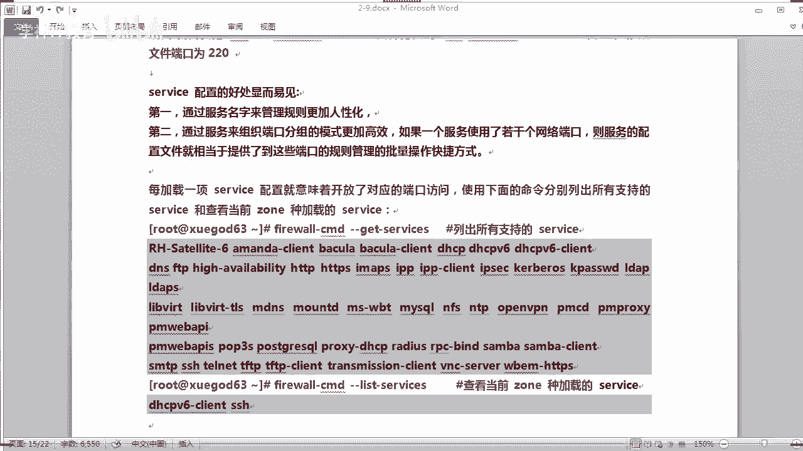

来我这来机的话。嗯，咱们先这样子啊，我这个应该是没有开启，没开启应该也是可以查询的啊。for word对吧？然后杠CMD啊，对吧？然后杠杠list这是干什么用呢？

这个是查看我们当前使用的区域就是默认区域，默认区域就是什么呀，公共区域对吧？啊，list service CES就查看你个公共区到底是提供了哦，他说没有在运行是吧？来，我们启动一下它，对吧？

我们再来查看啊，这个时候我们可以看到啊。你这个当前公共区域里面呢提供的有两个服务是开放了，一个是SH，一个是DSCPV6克的对吧？那这里的话我们可以看到当前这个区域只加载了两个服务，看到没有？

这公共区域哦，公共区域只加载两个服是吧？看到没有啊，现在它目前是运行状态啊，刚才我已经启动了啊OK。😊，那这样子啊，我们先把这个IP tables的话先嗯关掉吧。

IP tables on IP tables。对吧停掉它啊，我们把这个呃这个启动了是吧？好啊，来我们看一下，比如。forward这个可以做很多东西啊，CMD啊CMD啊，你要比如查看版本是怎么看呢啊。

visson，然后查看一下啊，它是0。444的一个版本是吧？你查看帮助的话，你就用help。对吧这样的话你可以看到哎所有操作命令都在这里是吧？好多哦是吧？咱们这个先不管它啊，来呃，查看这个状态。状态啊。

它是运行状态是吧，winning啊winning啊，然后就是运行状态啊。那你要查看现在这个区域的信息怎么看呢啊，那应该是get。激活状态是吧ITIVE啊，然后驱障。好吧。看到没有？

就是说你现在目前是在公共区域是吧？然后公共区域呢，它已经接管了两张网卡，就从这两张网卡进的这些相关流量啊，它都会管控着，这个是接口的意思，看到没有？接口有哪个接口有两个接口。因为我这里的话有两张网卡嘛。

是吧？32和34两张网卡，它都是接管的，看到没有？当然你也可以单独去查看啊，打查看某一个是吧？查看某一个接口的话，那你就加上什么呢？嗯杠off。是吧杠，然后这个interface这个。是吧。

interface啊。off。是吧只要你要查看啊，是ES32的这个接口是吧？ES32哎，没有吗？ES3啊，我没有打错吧。好，这个get状，然后是of the interface yes32，没错啊。好。

不用这个。好。是吧就可以查看哎，你这个网卡的话是在公共区域是吧，使用的是公共区域。那公共区域呢总共里面有两个什么两个服务。对，两个服务是吧？那他服务这么少的话，其实我们肯定是不够用的。

是不是肯定是不够用的。O。是吧。不够用的。所以的话我们为什么会存在要加很多东西上去，是不是加很多东西上去啊，OK。那。还有这个命令啊，这个叫PANIC。啊哦，这个要注意啊，这个是拒绝所有包，看到没有？

如果有配置它，你看。一旦我配置拒绝所有爆发，那我都断开了。操作不了了，看什么都没用了。你看我断开再连接，你也连不上了，怎么办？只能到数主机里面去操作是吧？在你的控制台里面去操作了。

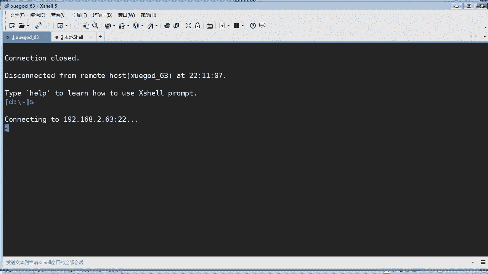

对不对？这个时候呢你要刚才的他现在的话已经拒绝到所有的包了，是不是你要取消拒绝，取消拒绝怎么办？forword杠CMD是吧？然后杠杠PINICPANIC啊。然后把它关闭啊，是吧？

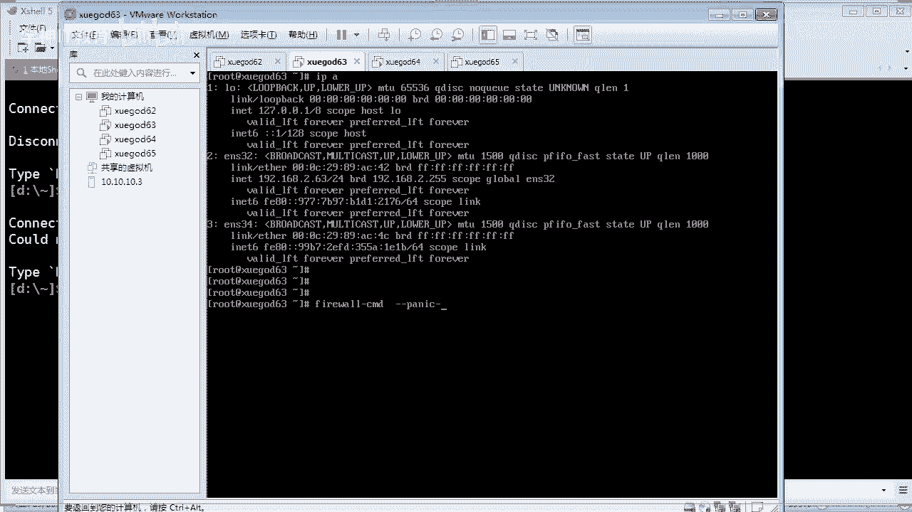

那成功是吧，成功的话，我们这边的话才能够连接。

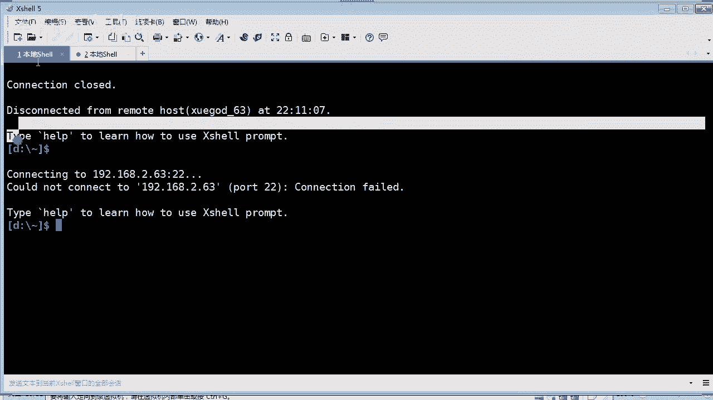

看到没有？O。那我们可以查看它唉哦，这里命令的话，我们怎么样去查看它。forward cMD啊，查看的话是可。QUEY。杠是吧PAIPAMIC啊，你看一下他现在目前是哎，我打错了吗？CMD哦少了一个杠。

对吧。现在是nono就是什么呀，关闭状态的对吧？对不对？是不是？没问题吧。嗯， ok。那如果我们配置完这个规则，里面还有一个叫重载的命令是吧？welow是吧，这个就是更新了，其实就是更新的意思，对吧？

更新的意思啊，还有个命令也可以啊，就叫。Come。Play。plate是吧这个。below啊这个。

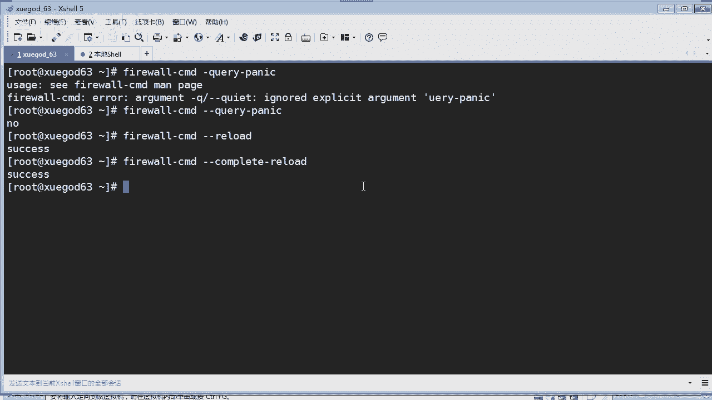

这也是重载，但是这两个的话有点区别啊，两个都是重摆，但是有点区别。你看一下啊。

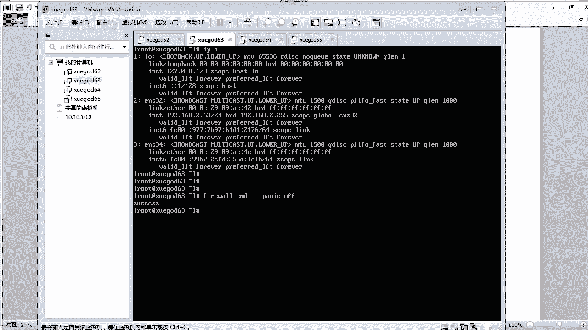

有什么区别呢？你看啊这两者有什么区别，你看看啊这两者。有什么区别？一个呢第一个就是无需断开连接，注意没有断开连接啊，就是forward的特性之一啊，动态加载规则它并没有什么，并不是重启是吧。

并不是重启啊，第二个的话就要断开链接了，是吧？就类似重启服务，所以要注意啊。那你比如你现生产业务的话，不能断开，那你只能用重载是吧？OK。好，那往下去看啊，我们用下面的命令可以列出所有是吧。

这个区域和查看当前默认的区域是吧？刚才这个其实我们已经看了。

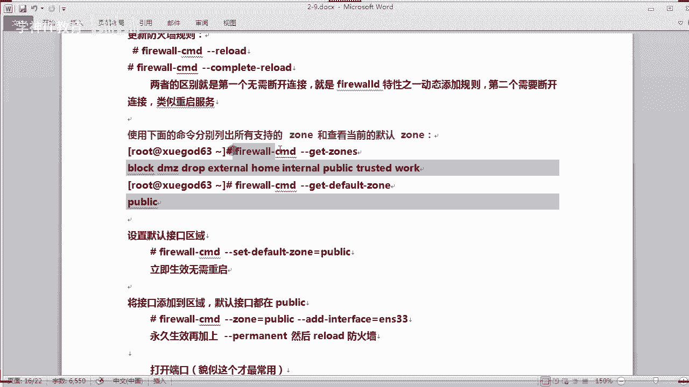

这个。啊，获取获取啊获取什么意思？就获取区域是吧？它总共呢有9个区域，就相当于有9个安检门，明白吗？就是他支持他们本身出厂就带了9个安检门了，每个安检门里面呢都配好了一些什么规则局，就是配置了一些服务。

对不对？然后呢，我们可以查看当前我到底配了哪一个。这个安键门是吧，你可以查get default。对不对？然后看一下你当前默认的哦，打错了。啊。哎い。Get。啲。DFAULT对吧？啊，后面的话不用S。

因为我们不是查看一个一个一个什么一个所有的安检门啊。对，这样的话我们可以看啊，目前我们默认配置的这个什么呀？这个这个。这个区域你也可以说是安检门，对吧？就是公共啊公共。OK那这个可以改吗？

当案可以改是吧？改的话，那就是嗯是吧，改的话是这样改，将这个get改成set。是不是很了是吧，改成side default。对不对？然后后面的话你用一个等号，比如你要改成那个其他的一些区域是吧？

改成什么呀？我们就改成还是这个吧PUBLIC是吧？这个呢就比如我改成其他的，就这样的意思，对吧？警告他说你这个本来就是这个了是吧，还改他干嘛呢，是吧，就可以了。O。这个的话你改了区域呢也是不用重启的啊。

它是立即生效啊。立即生效啊，OK那大部分呢我们都不用去管它这个区域了是吧？我们就要用这个公共区域，然后通过这公共区域呢，我们自己去添加一些服务啊等等这些东西就可以了。是不是？好啊。

来我们来搞搞些其他的东西啊。啊，比如查看所有打开的端口啊，那就是撞是吧？这里要查看某个区域，比如DM以这个区域到底开放是吧，打开哪个端口啊，list。Pa。Pas。没有是吧。没有哎。

那我们看一下这个公共区域的。U那些PUBLIC。哎，也没有看到没有？他这里的话并没有，对吧？看没有？那如果我要加入一个端口的区域里面去，又该怎么样做呢？比如啊我们就拿这个来啊用这个ADD。

ADD啊ADD杠portd。等于8080对吧？是TCP协议啊，你可以把这个端口加到这个什么呀，我们这个区域里面去。OK看到没有？然后呢，我们再来查看一下。

是不是看到有个8080TCP被加入到这个区域里面去啊。是不是？OK这样的话就可以加上去啊，明白没有？OK当然你也可以增加一个一个服务啊。比如你用这个ADDADD炮的话是是端口了。

那我ADD service呢？是吧。比如啊SMTP。对吧也可以把它增加上去是吧？看懂吗？那我这里能不能查看这个service呢？啊，也是可以，对吧？你看没有？比如我查看你的服务清单，哎。

我已经增加了一个叫SMTP的一个服务进去，对吧？他他也会帮我们啊增加进去，就这样的意思。是吧那我如果要移除掉这个服呢，我要从这个区域里面去移除是吧？移除的话，那你就是啊这里啊注意用这个V墨。

对吧要serv。其实还是蛮好操作的对吧？然后SMTP啊把它移除啊。然后我们来看一下这个清单。是不是已经移除了，对吧？就这样意思啊，OK。😊，嗯。好嘞。啊。那我们也可以通过这个。什么呀？

如果我这里不指定区域，你说它会显示什么东西？它就会显示当前是吧，当前区域的服务看到没有？其实我这里如果不指定区域名称，它就显示当前区域的这些服务会显示出来，对吧？那如果我这里是list，不是显示服务。

是list all。他写示什么东西呢？啊，他是输出是吧，输出你的这个这个整这个什么呀，在区域里面所有的东西都输出来。什么东西呢？包括一些呃什么特性是吧？包括他现在能接管了哪哪些网卡，对吧？啊。

开有哪些服务，还有端口。对不对？一目了然是吧，又把这个区域的所有信息列出来的意思了，就所有是吧，显示你这个这个公共区域的所有信息啊，OK。对吧这个是显示默认公共。但如果你要显示其他区域的话。

你也可以指定。比如jo。是吧要等于什么呢？比如我显示work的这个区域的所有信息，他也会将这个区域的所有信息是吧？你看没有？他这个区域的话也只是有两个符是吧？啊，但并没有开放其他端口。

我们上面的话有一个叫8080的，把它加上去了，是吧？O。啊。好，哎。刚才我们还看了这个叫活动区域是吧？活动区域。活动区域是公共的嘛啊，我们现在活动区域是公共啊。O。那往下去看啊，我们来看一下笔记。

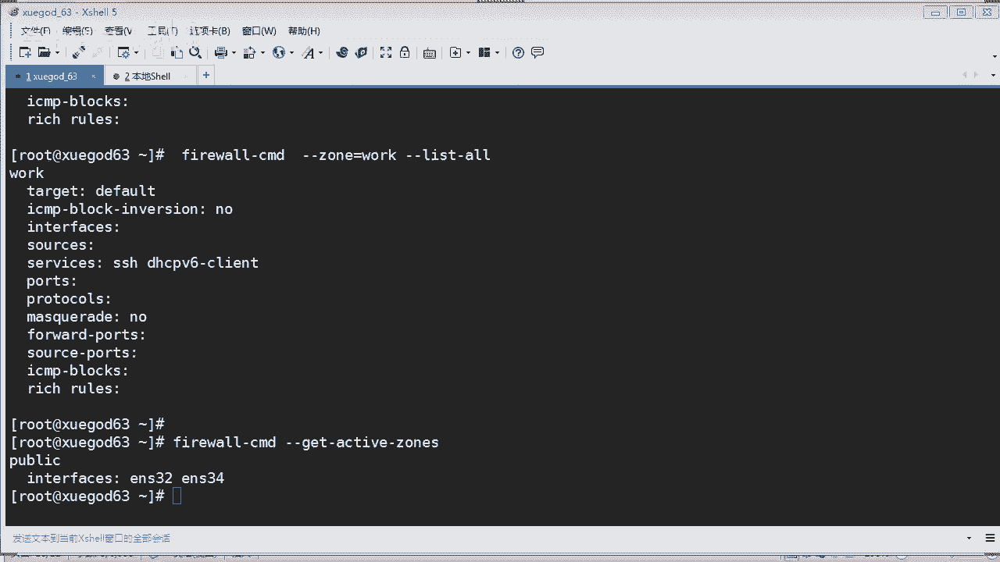

嗯，看哪里呢啊。那我们来看一下这里啊，他这里举了一个例子啊呃叫。内置防火墙。啊，不是。嗯。我们先来往下去看这里啊。比如添增加端口是吧，看到没有？这里是增加端口，对不对？增加端口的话。

我们是通过这个来改就可以了，改它它就会给我们是吧？干什么呀？比如我们要刚才我不是增加了1个8080嘛，你也可以增加一个，比如像这个是吧，写上去就可以增加了啊。我看下上面这里有没有讲啊。这个影讲是吧。

就刚才讲了，这个是拒绝是吧，就相当于我们IP table有一个什么有个默认规则的意思，这个就相当默认规则，把它什么呀，把它开启，就是拒绝所有，这样的话很危险是吧？那这里呢off就是关掉了是吧？

还有一个应急模呃，查看到底是什么模式也可以这样去看啊。那我们现在通过配置文件来使用这个forword啊，看怎么样区配。啊，注意啊，这里是默认规则是吧？就默认出厂了，我们不用动它，我们不用动它这里啊。

我们在另外一个目录里面去增加就可以了，好吧。当然你也可以去看一下啊，这个默认规则里面到底它写了有很多的哪些服务上去呢？刚才不是说了吗？他写的有70种服务。

也相当于有70种原件被他加入到这个for沃里面去了。是不是这样的意思？那我们来看一下是不是有70多种。

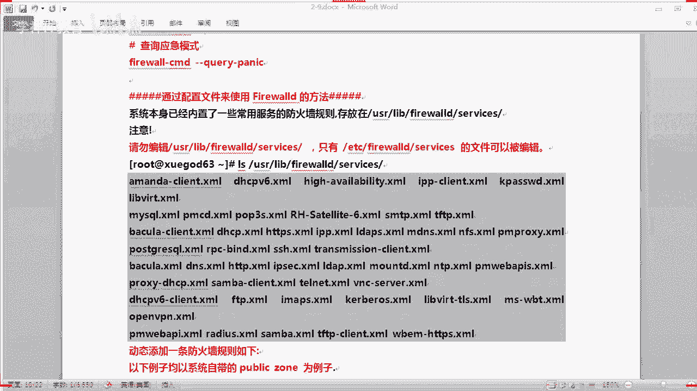

啊，出厂默认的服务在哪里呢？在USR labelbel下面啊，label下面的forward。forward，然后下面有一个什么service。啊，这里是有70种吗？我看一下啊。怎么样去查看有多少个啊。

是杠LH。看下有没有啊。哦，这里有总量，哎，我怎么样去统计它有多少个啊？好像没有统计是吧。WC是吧。WC的话，那我就是要通过管道是吧？WC嗯杠L。哦，107。喂，这么多。😡，同学们。107个。

那挺多了是吧？嗯，所以他这个版本又更新了是吧？有没有这么多啊啊，笔记里面说有70种啊，什么DHCP是吧？还有safe啊，好多啊，是吧？有没有你们看到熟悉的软件。😊，VNC是吧。呃，还是有的是吧？啊。

还有dog那。😊，啊，APP。对吧。NTNTP啊。哇，有107种服务啊，已经被添加上去了，对不对？有客人的赛博是吧？😊，嗯，有重复的吗？呃，可能是有些重复的啊。对，可能有些重复的配，不是他也不叫重复啊。

他可能呃一个服务配多一点多一点配置吧，也不叫重复啊。比如这个是吧，他有col的，有本地的，他会就写两个配置嘛，是吧？同一个服务配置他可能会写两个配置啊，它为了区分出来是吧，区分出来。对，分好几类。没错。

你可以这样去理解他。ok k。有107啊，以前是70啊，它不断的升减啊，现在是0。44的是吧？的版本是不对？OK那么我们来示范一下，比如我们呃。要添加对吧？刚才说添加端口时。直接。行forward啊。

来forward。降声啲。杠杠ADD对吧？然后杠。这个pod。这种是手工呃，什么呀，添加端孔啊，比如1222。啊。你要指定是什么协议啊，TCP协议对吧？OK。他就会把你的这个什么呀。

把你的这个端口添加到当前区域里面去了，对不对？那我们来看一下啊。打开ETC下面的。forword是吧，有装。壮士PU。はい。你在这里的话会看到只有两个是吧？有SH。有DHCP什么claiman的。

对不对？你刚才添加那一端口呢，并没有写到这个服配置文件里面去。注意是吧，并没有写到这个配置公共这个配置文件里面去啊，对吧？没有吧。如果你要相当把它写到这个配置文件里面去又怎么办呢？也有办法啊。

你可以加一个命令，加一个。加一个参数啊，强制性把它写到配置文件PERmanENT。好，已经进下去了。我们再来看一下，你又看了多了一条这条看到没有？它强制性啊把我们刚才添加的这个122端口是吧。

写到你的这个这个配置文件里面去了。是不是？OK如果你没写的话，你等一下重启或者干嘛，他不是就没有了嘛，对吧？😡，这样的话是写到配置文件里面去了。O。好嗯。呃，防火墙配置文件啊，你也可以去手工啊。

比如这个的话，你也可以手工在这里改也行啊，没有没有必要去敲命令，直接编辑这里的话也可以的。编辑完之后呢，重载这个也会生效的啊，也会生效啊。好，那么下面我们来呃示范一下使用forward怎么样去配置。

假如我们就拿80端口吧，是吧？80端口是我们最常用的一个web端口。所以我们要开放80端口供外网访问，对不对？那我们可以这样去做。啊，我们可以将这个有1个HTP的一个服务配置文件。

把它拷到这个forward service下面去啊。这个。刚才那107种服务里面去，我们找一个。找一个有点类似的对吧？找一个service里面是不是有个HUVT呢你看。有吧，还还有1个HDDS的。

你有没有看到？😡，那这种就是服务配置文件。我们把这个文件啊拷贝一份放到ETC下面的forward。对吧为什么拷贝到这个目标目录呢？因为这个是我们手工配置的目录是吧？一般我们拷贝这里呢会好一点。

对吧这个呢就留着你的默认配置，我们不用动它。我们只要改我们拷过来这个配置文件就可以了，对吧？那我们来修改。啊，首先修改一下。ETC下面的forward啊。

forward下面的话你会看到啊呃service。啊，服务的是放在serv下面的对吧？O。这个应该懂啊。那我们的这个区域配置文件呢是放在哪里啊？放在这个区域这个目录下，注意啊，区域配置文件只有一个。O。

看清楚啊，这两者的关系。明白了？然后先编辑这个区域配置文件，这个区域文件呢，我要把它就说我让它能够索引我子目录下的这个什么呀，就是我service这个目录下面的一些服务，我就可以在这里去添加。

就把我刚才那个HCPE的服务添加进来。那我可以照着这个写。比如我就拿这个吧。比如是哎我可以copy一条对吧？YYP啊YYP哎copy一条是吧？然后修改一下就可以用了，很方便啊。

你知道我这样配的话是什么意思吗？😡，好，这样表示什么意思啊？它就会去索引到service下面的HTP点XM那个配置文件了。懂没有？有了这条东西，它就是检索这个目录下面名称前缀为HTTP的那个配置文件。

明白没有？它就会检索这个配置文件。O。这个就是在在你的区域啊区域配置文件里面去配的。OK好，我们保存并退出。O。好了，刚才说了，我们可以重载，对吧？重在。哎，我现在不重在，我看一下啊。

我这个是不是已经开启。嗯。我们看一下端口，哎，80端口是没有开学，对吧？没有启动了啊。来，我们启动一下这个我们再来看一下80端口有没有。OK80端口是有的是吧？那我们现在能够访问吗？

我现在是还没有重载啊，还没有重载。

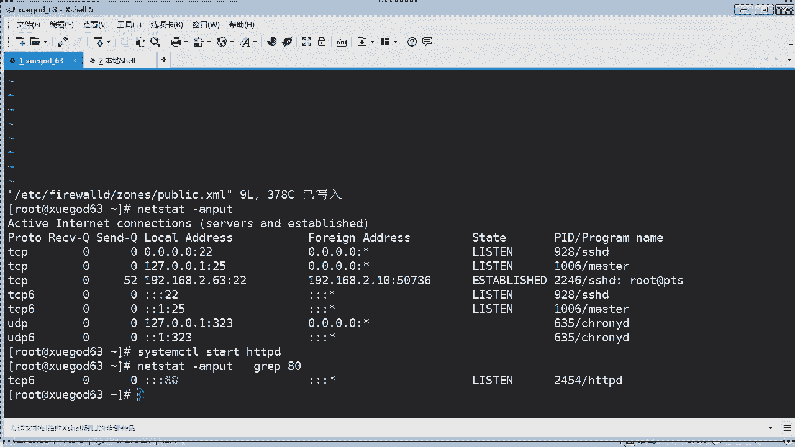

不能访问，对吧？不能访问。是吧一直在搂啊一直在搂，你看没有？好，那我们现呃重载一下我们的防火墙。

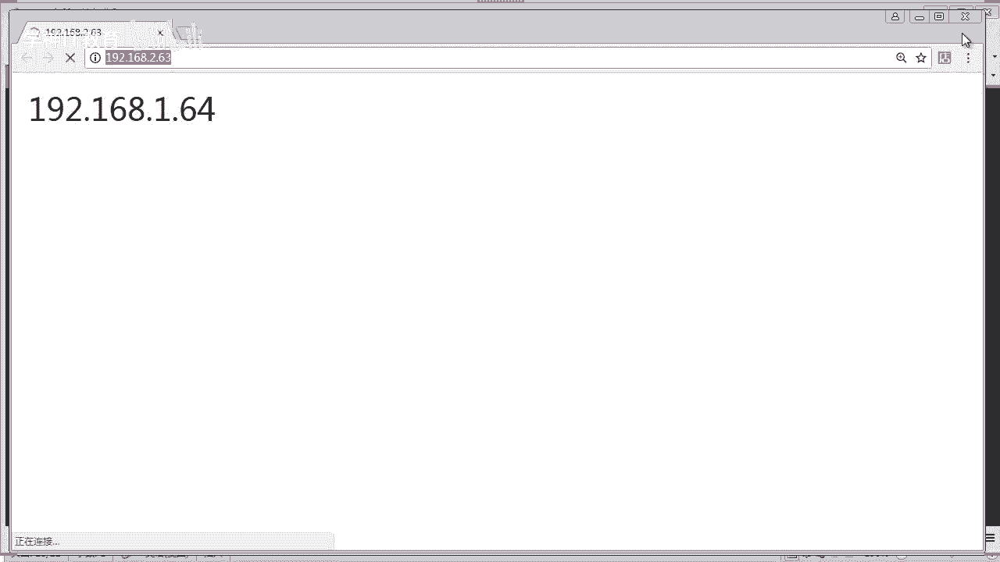

重仔。因为我们修改的是配置文件啊，不是敲命令，所以呢我们需要重载beow，对吧？

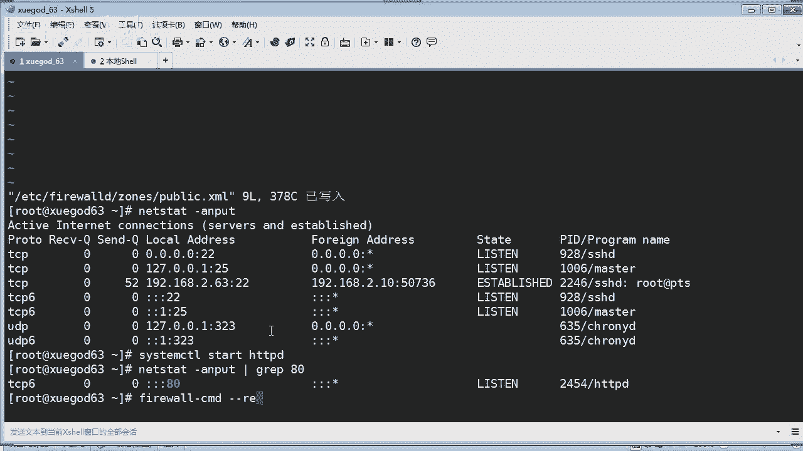

重载重载成功之后呢，咱们来看一看啊，哎，可以了是吧？😊。

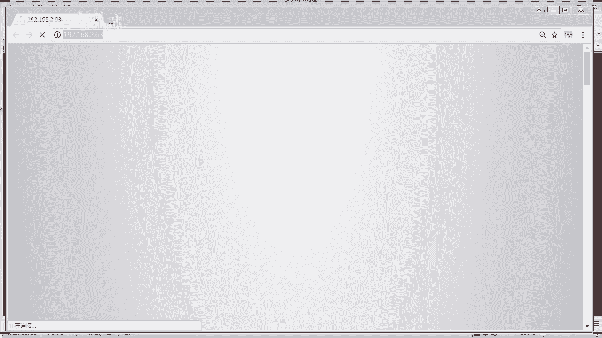

听到没有？这样就可以了啊，重改成功之后呢，它就可以访问了。是吧重载成功呢，它就会索引什么呀？索引你这个HP的配置文件。😡，啊，就是说他去检索这个文件，这个文件呢就是要放行HDPT的。懂了吗？😡。

你你我们配置到这里的话，你有没有感觉咱们这个for word跟我们Iip的一些配置上的区别，有没有感觉？😡，是吧。就是你可以在你的服务这个目录下来可以写很多服务。然后在你这个区域里面呢。

把这个服务名称添加上去啊，它就可以了，是吧？😊，就是说他以是以主别的方式来管理防火墙的，有没有感觉他就是以主的方式是吧？比如我以这个文件的方式是吧？来管理你的服务。那如果你这个HP有很多端口。

我是不是只要在这个service下面的HP点XM这文件添加多端口就可以了。它一样可以什么呀，一样可以放行的，我们就没有必要去敲命令哎，我又放行81端口是吧？8080端口，那是不是这种方式呢。

在我们IP呢就是比较常见的对吧？但是在窝里面呢，你完全没有必要我们直接干什么呀？我们直接可以编辑我们的这个这个叫。这个文件对吧？来。我们直接我打开给你看啊。假如你要加端多端口，是不是？

这里面就刚刚我们考过来的这个是吧，在这里去写就行了。你看没有？你可以在这里增加端口，比如是吧818283848088都可以。对不对？他是以这种啊组别的方式来进行一个管理，不方便是吗？那咱们学到这里。

你有没有感觉到底是IP table的管理防火墙方便，还是用forward管理防火墙方便？也实各有所长，看你们习惯吧。毕竟我个人好像不太习惯这种方式啊，我觉得还是敲一条命令。

就解决掉我的需求还是快一点是吧？一针见血啊。对不对？啊，各有所长啊。嗯，那假如啊嗯我们就来改一下，假如我们改端口啊。😊，嗯。来，我们先把这个SH的这个什么呀？假如我们拷贝一下啊。

我拷贝一下这个SH的服务配置，拷到这个手工修改目录里面去啊。然后。我要改他的这个什么呀，改他的默认端口。他默认端口SH的默认端口是22嘛，对不对？没毛病啊，那我要改掉它。对，因为22口，我们防止什么？

防止人家这个暴力破解啊，或者是异常的一些连接是吧？我就可以将这个端口改掉，把它改成什么呢？比如改成1222。是吧。呃，4个2吧啊。12222对吧？改成这个样的一个端口，是不是？改制的端口的话。

他就只能干什么呀？他就是要放行的是这个端口了，对不对？那如果同学们如果我重载之后，你说我现在这个插效会不会断开？来，同学们。想一想。如果重载这个防火墙会不会断开？会啊。看一下啊，我们来我们我们来是吧。

来见证一下到底会不会呢？杠杠V楼。我们还能操作吗？诶，好像还可以，那我退出哎。我再连一下啊。还能连接吗？OK那结果出来是吧，它是会断开的是吧？只不过是时间的问题，对不对？刚才的话，你等久一点。

它一样会断开是吧？那你现在再连的话，连不上去了。

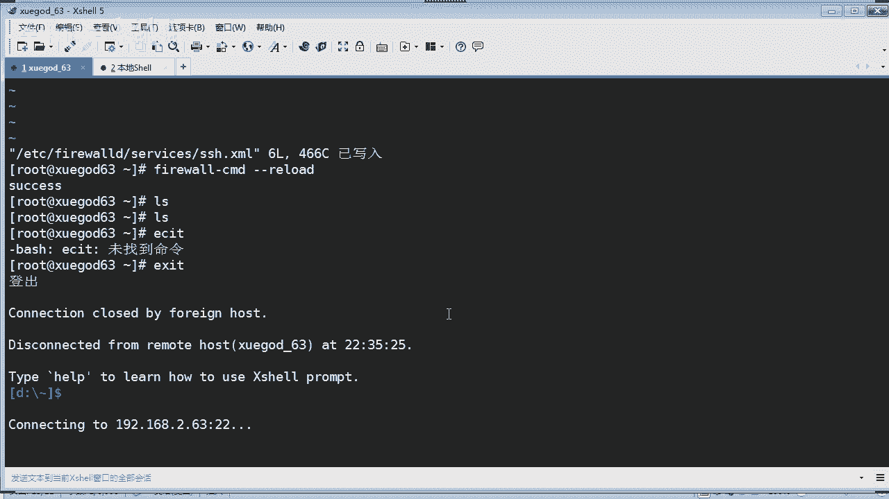

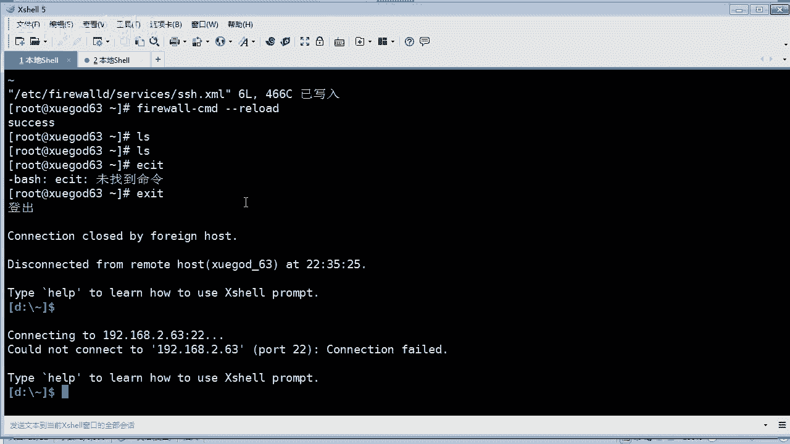

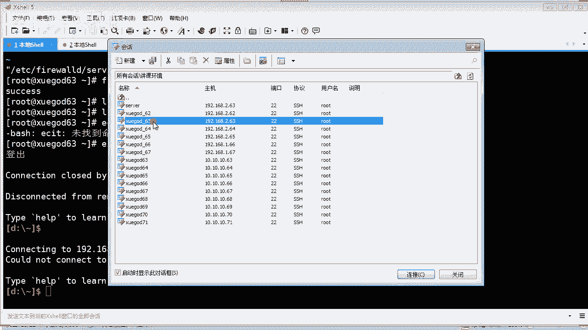

OK它是会的是吧？他是会阻断你这个SH连接的，对不对？怎么办？又来到控制台了，你你只能是吧，只能跑跑到这个控制台里面来操作了，对不对？然后我们要该怎么办？既然你把这个改成了1222的端口。

是不是这SH那你应该也将什么呀？也要修改掉你的你的这个监听端口？

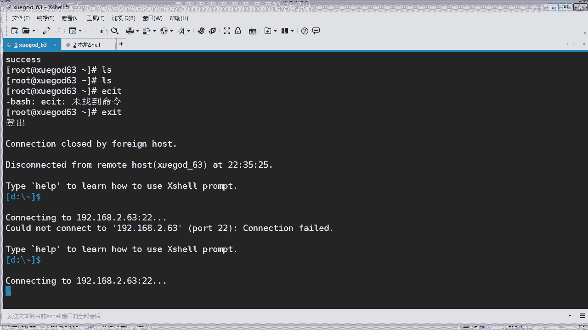

对不对？如果你不修改鉴定端口的话，它一样是会荡掉。哎，我们的这个部分端口是多少？22。SH。SH点D下面有个confi是吧？这里。是吧你要改成。1123诶。这样是吧，4条2。看清楚啊，要保存并退出。

要呢重载重启一下你的服务。对吧然后你看一下你的接听端口。😊，还到没有？就变成14条2，看到没有？

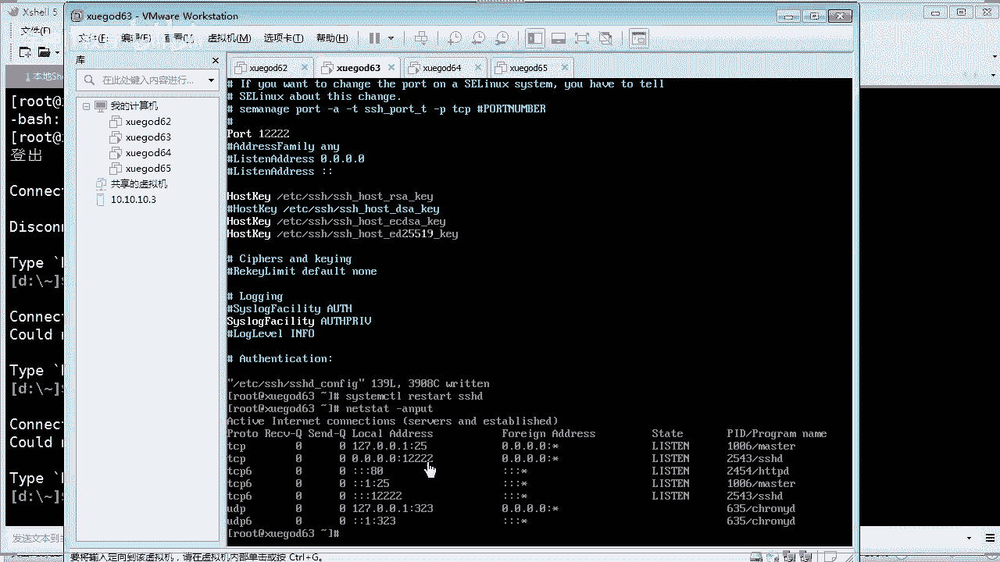

这个时候呢你要想连接，那你就可能要改你的什么呀。

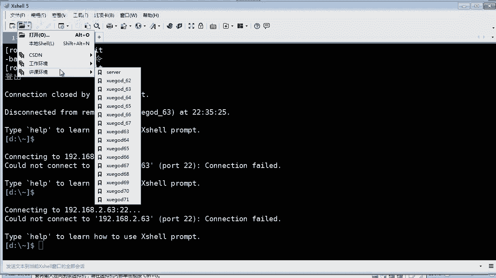

改你的这个配置了，比如这个是吧，你要刚将你的这个端口号改成12224条2是吧？然后确定一下来，我们再连接。

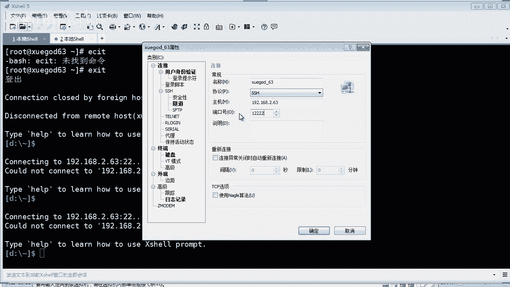

那还有当你连接新主机一样了，对吧？好，保存一下。那这个时候呢我们就可以连接我们的SH了。我们也可以看一下啊。😊，是吧现在你的ISH监听端口已经变成是吧？12222了。对不对？

那这样就可以防止一些像暴力破解。因为我根本就没有22端口啊，对不对？你访问不了我的22端口，我的默认端口都改掉了，是不是安全多了，是吧？OK那接下来我们来学习一下我们如何添加自定义的服务呢？

什么叫自定服务？比如我们公司开开发自己研发1个ERP系统是吧，或者是任何一个东西吧，我们只举个例子，对不对？我们要增加一个新的服务进去啊，比如添加一个新文件叫。😊，ETC下面的forward是吧。

service下面啊，比如增加1个8080点是吧。哎XML啊，你要以这个后缀结尾就可以了。好，你完全要自己可以写啊，你把这些东西加加上去就可以了。OK来我们写一个。😊，其实你也可以去拷一个模板出来。

对吧？拷一个模板哎。啊，我把这个删了啊。对吧你看我就可以把这个添加上去了啊。😊，啊。然后你看这个模板呢，其实我也是。从从什么，从另外一个地方是吧？模拟的是吧，这里是此处为文字说明啊，你可以写一些东西啊。

写这里，然后写上你的端口是吧？你这个符务叫8080ts是吧？这个是我也是我们定义的啊。有哪个协议啊，TCP协议啊，8080端口对吧？就这样去写就行了。OK然后我们保存一下。O。然后你要记得啊。

要在你的区域里面去把这个8080添加。这样他才能够索引的到，对吧？然后这个状这个状下面有一个什么这个公共区域，注意你当前是哪个区域，你就编辑哪个区域是吧？它当前是公共区域，那我就该在这里添加是吧？

YYP copypy一条啊，然后在这里添加8080。是吧。懂吗？这种就是手工啊，手工啊，你就写前缀就可以了啊。同学们，你写前缀写8080就可以，它就会去检索到你的那个8080点XML的文件了。O。

明白没有？然后的话你就保存啊并退出，让它重载是吧？重载你的这个防火枪。依然你修改配置文件的方式，你都要重载啊。如果你通过命令添加端口的时候呢，它是立即生效，并不用重载，是吧？那这样就重来成功了。

OK是吧。就这样去添加服务的啊，后期如果你们像你们公司是吧，开启了一个新的服务啊，假如不是常用的服务，我们所说的常用服务就是什么HT啊SH啊FFTP啊，这叫常用的是吧？你们公司搞了1个8080啊。

这个名称完全是你可以自定义去起的，是吧？你爱起什么名称都可以，没有问题啊，是不是有些哎我不想写服务啊，我只想写端口行不行也可以，那你直接在这个公共区域这个配置文件直接写端口就行了。

这样写什么协议什么端口是吧？这种呢就相当于单个是吧？临时比如临时放某个端口也可以。懂我意思吗？对吧？当然如果你是通过一个服务的方式来管理防火墙，是更加的。😡，好像是方便管理是吧，按照他的说法。

他理论说方便管理。就比如你在这个配置里面，你爱加多少个端口都行，是吧？他都可以放行啊。好啊，那。

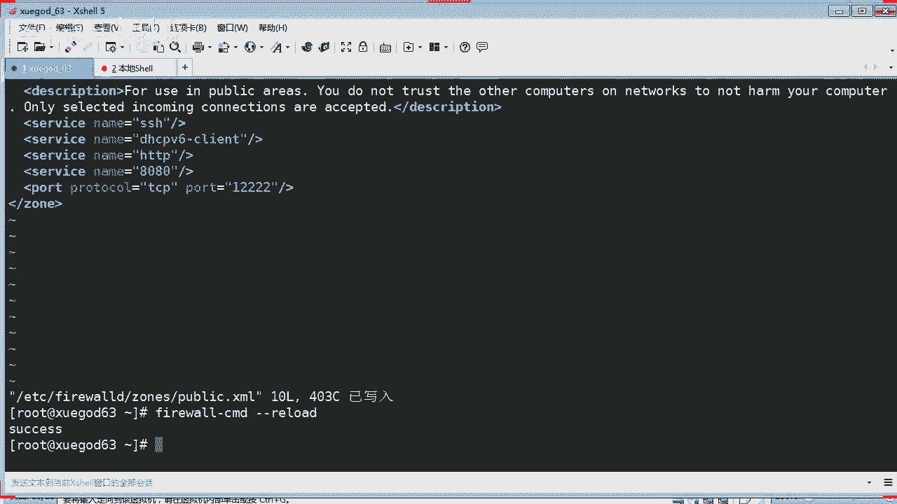

这个就是forward防火墙啊的一个配置方法是吧？那这里再讲一下，如果我要用这个forward来配置，像这个什么SNAT啊，DNT啊应该是怎么做呢？你看。也可以啊，是吧？它只不过是前面这里的话不一样。

看到没有？这里要加这么长的一些啊酱是吧？forward是吧？然后进行强制性更新到配置文件啊，然后什么啊写上这个参数对吧？IPV4，它要直接IPV4对吧？然后最后面这些呢这条呢跟你的就是一样了。

这个跟我们使用IP table时那个配置一样，只是前面的不一样。OK那当然了，这些东西你不用紧张说，哎，我以后我不会配，我要配其他怎么办？没关系，你可以通过帮助文件调出来。是吧。调出来告他会告诉你。

你要做哪些动作的时候呢，需要用哪些参数？明白吧？这个不需要考模板吗？这个不用啊。这你可以不用考模板了，对吧？因为SNT的话跟你那种服务是不一样的嘛。我们刚才放行的那些端口的话，都是某种服务的端口。

比如HP的端口是吧？你做DNTSNT你哪来的什么服务啊？有同学说fo物的命令太繁琐了是吧？确实的话是比那个I繁琐一点，而且它命令也比较多，对吧？命令也比较多啊。O。但是他在管理这个服务配置那一块的话。

就比较可能是嗯比较方便一点嘛。就是他写一个服务配置文件啊，你只要往这个复务文件去加多少端口啊，什么什么都可以，是吧？都不用管。哎哎没有必要，像ipad时候，你要再协调命令开放另外一个端口，对吧？

就没有必要。OK就这样的意思啊。好吧，DNT的话，你看一下，你可以参考一下就可以了是吧？好，这里也有个链接给你做一个参考啊。那么forward其实我们用的我个人啊，我跟你们说吧啊。

其实在实际生产环境呢使用for呢，少之又少啊，一般我如果要用的话，也用ip taps配置ip tables在生产环境用得上吗？用得上啊。那么目前像老师的公式的话。

我配置一些像做一些啊VIVPN呢或者是SNT等等一些东西呢，我都是用IP taps来配的啊，简单快捷，一一针见血啊。😊，好吧，OK这个就是forward啊。😊，学完了服务和IP应你们应该大概了解是吧。

哪个适合你们使用啊。好了啊，来总结一下啊，今天我们讲了啊包括IP的一些呃实例是吧？举了一些例子，还有Slin对吧？Slin到底是干什么用的，对不对？😊，然后再讲了这个for沃防火墙的一些详细配置。

OK那么今天的话我们就讲这么多啊，好不好？😊。

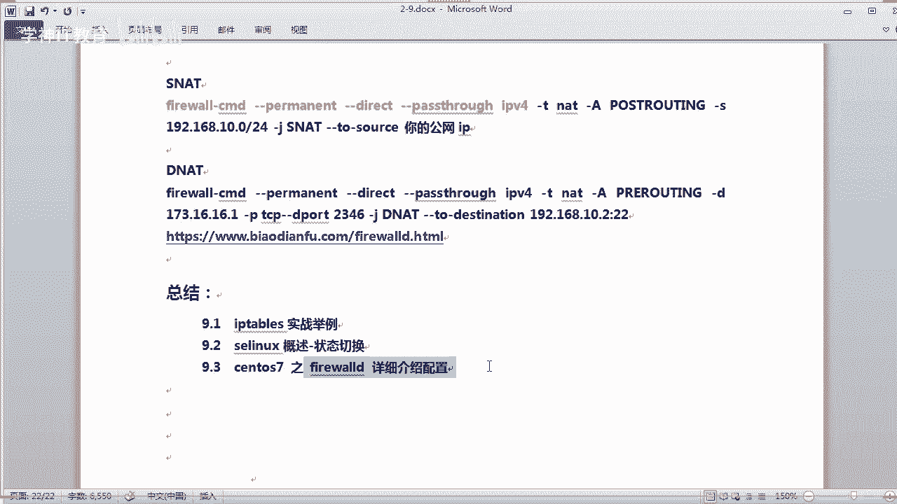

我。