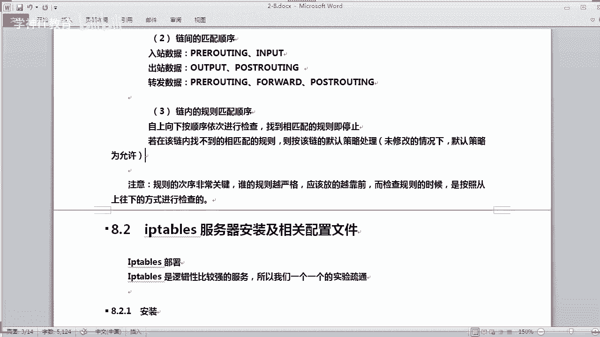
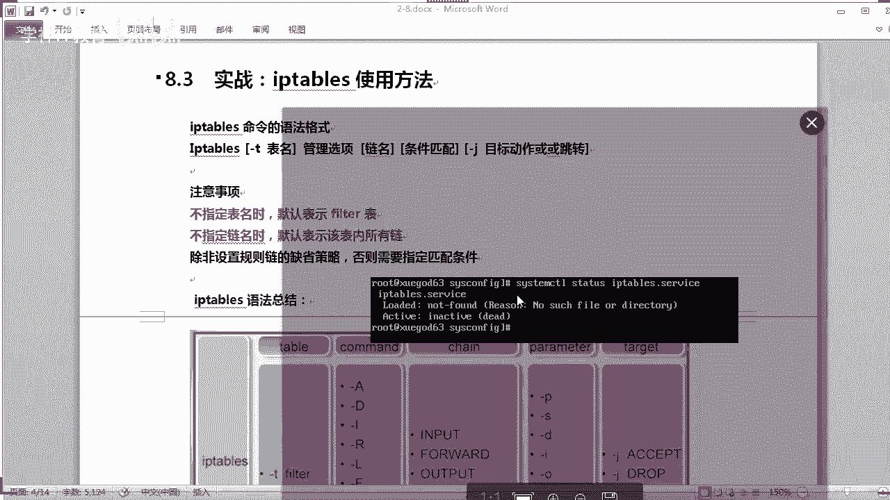
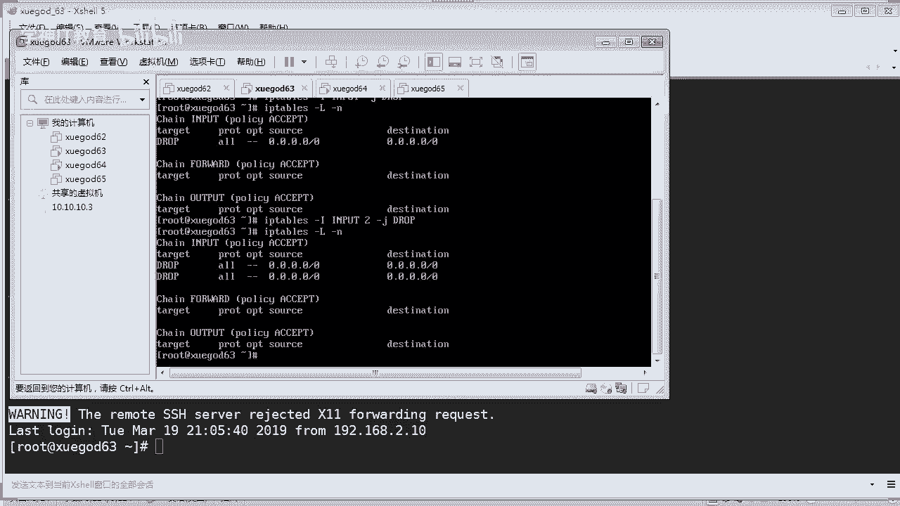

# Linux／Linux运维／RHCE／红帽认证／云计算／Linux资料／Linux教程--iptables理论及配置 - P1：iptables理论知识01 - 学神科技 - BV1KV411r7yk

好，今天晚上的话是第二阶段的第八章啊，第八节课啊，主要是讲这个防火墙。那么咱们的课表里面显示呃显示的是配置这个什么呀for word防火墙增强是吧？其实的话我们先讲一下IP tables啊。

然后的话明天我们再跟你讲一下这个新版的for word是吧？OK这两个啊我们都要去了解和配置啊，都懂得怎么样去搞它啊。因为新版本的话，它呃可能不不是用I tables来配置的。但是ips的话是最常用啊。

而且也是支持的啊，在新版本的话也是支持的啊。来啊看一下。今晚上我们讲到这个Iad tables的理论是吧？然后IPs服务器安装和相关配置文件啊，怎么样去用Iadds来配置这个防火墙啊。

那么这里有讲到上课之前啊，因为327。0啊的系统开始的话，系统自带的这个防火墙叫forward是吧？这个但是呢也同样支持IP tables啊。

本节课我们仍然使用这个IP tables来作为防火墙啊做主讲。后面我们也会给大家详细讲解啊这个forward这个常用的配置啊，它两者有什么区别啊，都是防火墙到底它有什么区别呢？是吧？O。学完了之后。

你就知道哎，其实用哪个更好呢？你就会心中有数了啊。好，那咱们的话主要是准备两台是吧？首先我们来了解一下啊，讲讲这个防火墙的话，防火墙你要认识一下啊呃，什么是IP tables来看一下啊。

这个lateter filter啊IP tables。IP信息包过滤系统，它实际上呢是由两个组件啊，这个net filter和IP tables组成啊，呃，为什么后面就变成叫IP。

不叫net filter呢？你往下去看啊，net filter和I和这个IP tables关系，你看一下啊。net组件呢它称为内核空间啊，内核空间是内核的一个部分啊，是由一些信息包过滤表组成啊。

这些表包含内核用来控制信息包过滤处理的一些规则级啊规则级就是很多的规则了，是吧？iptable组件呢是一种工具，也称为用户空间，它是插入修改和除去信息包过滤表中的规则，变得容易啊呃。

这个net filter和ip tables后期被简称为iptables。是吧没有人说啊，late一般都叫它IP tables，对不对？IP tables是基于内核的防火墙。功能非常强大。

i believe内置的这个什么呀filter NAT啊，这个mongo3张表啊，所有的规则其实它不止三张表是吧？我们说什么呀？三表五练对吧？所有规则配置后呢，立志生效，不需要重启服务注意啊。

这句话你要注意一下IP labels所有规则，一旦你把命令敲完回车之后呢，立即生效，不需要重启服务啊，O。那看一下三表啊，什么三表啊，讲ip你会遇到三表这个filter负责过滤数据包啊。

那么包括规则链啊，它有什么链呢？有input outputput forward对吧？还有其实你们应该有接触啊是吧？因为I它是转换，你像咱们路由器是不是啊，对吧？的话它是涉及涉及什么？涉及网络地址转换。

那么它里面呢这张表也有什么呀？有几个链，你看一下啊，这个 protein是吧？这个post protein啊，还有这个output啊，还有man这张表的话主要是用在修改数据包的内容上用来做流量整形啊。

这张表话可能你们用的比较少，给数标给这个数据打标签的啊，默认规则呢它有这么多个链啊，是吧有这么多O。来，那我们刚才说了有3张表啊，那每张表呢它有有不同的链，对吧？你看每每个表上它有不同链。

而且每张表的话链的话有可能是有重复的，你看没有是吧？那input。input的这个链呢它是做什么用的呢？你看一下匹配目标IP是本机的数据包。input呢其实input你翻译下来就是in的话就是进是吧？

对吧匹配目标IP是本机数据包，它就匹配。哎，你是不是包是发送给我的对吧？发送给本地的。对不对？所以进入的话，你首先是用inport这链是吧？oppo呢就是出口的数据包，一般的话不在此链做限制。

op布的话一般我们不做限制，对吧？出去的，我们觉得它就是安全的，一般我们会做什么，我们不会做什么啊，限制在这个oper链上啊，对吧？那么这个forward呢是匹配流金本地的数据包啊。

你也可以说是转发了对吧？转发了一个数据包是吧？这个propro的话是用来修改目的地址的啊，做比如将这个目标地址转换对吧？DNAT啊，比如把内网的80端口映射到路由外网去啊，对吧？

pro protein的话是用来修改原地址的，也是做什么SNT的啊，比如将内网通过路由的NATT转换以后呢实现上网，就像我们路由器呢，其实它用的原理就是这个是吧？SI对吧？OK。

那这个呢就是12345对吧？有5个链。那么每个五个链的话，你首先大概了解一下它是干什么用的，是吧？那这里有一张表啊，我们是我们经常说IPd有三表五列啊，其实它它是有四表五列的，对吧？你看1234。

为什么我们说三表五列呢啊，一会跟你讲，那其中有一个第四个表呢，这个是ro表。ro表里面的话它也有列了，对吧？是吧还有很多的这个链在这里啊，那man个表的话刚才已经讲了是吧？也有12345个链啊。

NATT的话有123是吧？那fad表的话也有是吧？input forward output链等等啊，那每个表上的话，它有不同的链啊是吧？奶油每个链上的话，它你可以去配一些规则。那为什么说我们说三标五练。

不说四标五练，你来看一下啊，这个ro表的话我们是不常用的啊，它主要是用于处理一些异常啊，包括规则链，有这个bro啊，有这个output，一般使用不到，看见没有？使用波道。那这个ro的话。

在这个整个防火墙体系优先级最高。那如果启动这个ro表的话，数据将会跳过什么呀？跳过连接跟踪的机制啊。所以说一般这个表的话，我们都不常用是吧？所以我们常常说唉只有三表五链。

因为我们应用到的这一般是三表五练啊。O。那我们查看一个表中的内容啊，无论你是查按这个ro表或者是什么呀，或者是这个go表NT表或者表的话，都是啊你可以通过这条命令ip杠T杠T表示指定你的表明T是什么呀？

table table是什么呀？就是表是吧？那简写为杠T是不是很好理解，你这样记的话，非常比如我要配置某个表，我首先杠T也要写上来表明对吧？你到底是哪张表写上后面杠L的话，就是列清单了，是吧？

比如你要列出来这个这个链这个表里面有什么东西配置的规则。那你可以通过这种方式，那这种方式去操作来我们来看一下啊。

呃。对吧那这样的话我们可以看到哎，这个里面是空的，是吧？没有什么的一些规则，啥都没有，当然没有了。因为我们本身防火墙都是关闭的，什么也没有配置，对吧？还记得吗？

一般我们这种我们之前做好这个什么环境都是没有任何配置的对吧？

O你看一下啊这个ip过滤的封包流程啊，就是表链到规则，它的一个什么就相当于一个生产过程是吧？它一个流程是怎么样子的呢？比如你一个数据标是吧，一个数据包，你要流经你的本机的话，它是怎样子的，对不对？

首先啊到你这个表，它就会匹配这个表下面的链，这个链下面有哪些规则看到没有？是这样去匹配的啊，如果是转发包的话，它是不会经过本机的，它直接走这个forword啊，走这个forward就出去了对吧？

它只是一个转发啊，这个pro的话，你可以看到啊啊，还有这个啊还有AT对吧？你看一下是到底他是要走哪个表，如果是走NATT，他就走NNATT里面是了链这个链里面呢再去配这个规则。知道吗？再配这个规则啊。

如果规则允许，你就可以进去，不允许，那你就被什么呀当掉了啊。OK。好，往下去看。那么这样子啊，来我们看一下它的这个呃整体数据包啊，整体数据包它这里到底是怎么样的啊。

比如发给防火墙本身的数据包和需要经过防火墙数据包，它先先讲这两类啊，一般的话我们的包括分两类，一个是这个是直走的话，是不经本地的啊。如果你往下这里走的话，那就是经经过本机啊，这个locker的话。

你相你本机啊，是吧？一般分为两类啊。第一，当一个数据包进入网卡的时候呢，它首先进入什么pro这个proin链啊，那么内核根据数据包这个目的的IP判断是否要转出去，看到没有？

到这里呢到底是不是要转发出去的，是吧？如果数据包进入本机的它就会沿着这个图是吧？往下移动。到达这个input链哦，你是要来找我了是吧？那你肯定要经过我这个大门，我是input啊。

所有进来呢你要经过input对吧？经过input数据包到了input后呢，任何进程都会收到它任何进程都会收到它这里的话它肯定有规则，到底允不允许你进来是吧？允许进来呢你才能进来啊。

那么本机上运行的程序呢可以发送数据包，那么这些数据包呢会经过output链，如果是比如你本机上有很多的进程是吧？你像什么，你运行是吧？你要发送出去呢，都会经过这个output对吧？

要出就会经过output链然后到达这个里面去输出啊，去输出啊，最后的话才能传出去啊。所以说我们一般说这个表链规则处理顺序呢是怎样子的呢？你看啊呃当然了，刚才说的最高级别是ro表。

但是ro表的话我们不常用一般的话我们不用配置它是吧？我们就可以从这个mon表有NAT对吧？三表这个优先顺序来处理，那么链之间的配备顺序又是怎么样子的呢？是吧？首先入站数据的话。

它会经过什么这个proing是吧？proing这个还有这个input啊，这个inputin out。这个叫in out对吧？然后这个出站的话是outputpro roing是吧？

然后转发的话就会其中中间是经过forward的这个链啊，注意。O。看清楚没有？是这样子的啊。好，你先看啊，首先我们表的顺序是这样子啊，它是这样的一个数据流啊，流向，对吗？那么链的数据流呢。

它分为各种的一个方向，比如入站方向、出站方向和转发方向，是不是笔记有问题？嗯，笔记有问题吗？有什么问题提出来。OK那么这个呢是这个链接的一个匹配的顺序啊。那链内的匹配顺序的话，你看一下啊呃。

链内的规则匹配顺序应该是这样说是吧？链内的匹这个这个什么链内的规则，应该这样说，对不对？那么自上向下的按顺序依次进行一个检查，找到相关匹配的规则呢，它就会停止。比如有些规则是不允许你继续跑了。

它就会停止掉了，不应该是in什么什么意思？对啊，你说这个打错了是吧？😡，是不是我看一下上面有没有错啊。嗯，我上面这里没有错。对。啊，是的啊。O。嗯，这个是打错了啊，打错了单词。好，来，我们继续啊。

链内的规则匹配顺序，这里应该这样讲。规则。对吧列内的规则匹配顺序它是怎样呢？它是从上往下去匹配的啊。比如最上面一条规则呢，它如果是jo掉你的话，就是静止掉的话，那么下面规则它就不会去跑了，明白吗？

它就会停止掉了啊。如果第一条匹配哎，匹配是可以通行，它就一直往下去看，对吧？OK那么在什么呀？又在该链内找到什么呀相匹配的规则贼。则按该链的默认这个什么呀？如果是找不到啊找不到默认匹配的规则。

那要他要怎么办呢？它有一个叫默认的规则，也是默认策略处理。默认规则呢，其实我们在这里可以看到你像这个的话，它默认规则是什么呀？

就是允许是吧，允许。所以的话如果你这个这个这个什么呀，你的这个里面的话没有任何的规则，它就是走默样的规则是吧？允许放行你就这样的意思啊，OK。

我们没有修改情况下呢，默认都是为允许的啊，默认都是允许的。注意啊，那么规则的这个顺序非常关键。那么谁的规则要严格，应该是放在越靠前是吧？而检查规则的时候呢，是按照从上往下嗯。

注意从上往下的方式进行检查的。ok。看一下啊，其实我们这个ip6默认的话应该是安装好的啊。如果你们把相关的包装上去，应该是装好的啊。那么今天我们先不讲这个forward啊。

所以这个for的话我们先停止掉，这个也它默认也是装好的，这个应该我们是应该是什么呀？应该是停止掉了，对吧？来我我我看一下我这台机啊。

呃，我们看一下它的状态啊。嗯。For world。对吧。看到没有？这个的话是什么呀？关闭状态对不对？现在的话是关闭状态的OK。所以那你记住啊，先把它关闭啊，今天我们先讲一下IP tables。

那么然后你把IP tables装上去，其实我们是已经装了，对不对？检查一下你的机，看一下是否已经安装了什么呀IP tables好吗。看一下啊。看一下我这台装了没有。好。

你看本身的话我这个就是已经装有了对吧？一般的话默认是装了，不过你们最好还是检查一下，如果没有装上去呢，执行一下用亚母亚母的方式安装一下这个IP table好吗？OK我的是已经装上的啊。

只不过我应该是没有开启，对吧？我看一下啊。IP tables对吧？看一下，你看这台的话，防火墙它也是关闭的啊，都是关闭的。没错啊。好。啊。我们如果你装上去之后呢，你来看一下它的这个配置文件在哪里呢？

ETC下面的ss。confit IP tables哎，你看一下有没有这个。有。对吧。来，打开看一下啊，他这里的话就是出厂默认的一些配置是吧，基本上是全部放行了啊他看到没有？是吧。放心啊放心放心是吧？

input放心，forward是放心，opput也是放心，看懂了吗？然后呢。他还配了一些啊常用的一些规则，你没有发现这是什么东西啊？基于状态的啊，等一下我们再讲啊呃，还要放行22端口，对吧？

这个相当重要。因为我们默认的这个SH连接的话是什么呢？22端口是吧，它默认的话是放行的。OK好，这是它一些默认的规则来看一下啊。来，我们先把它启动，好不好？😡，嗯，刚才不是说嘛，他是没有。

没有启动了对吧？那我们启动它就是直接。大项。OK那我们再看一下它状态。那这个时候呢你会看到啊你的ipPlip它是在运行状态的。对吧是在运行状态的啊。OK。那如果我们把防火墙开启了之后是吧。

你看我当前的这个SH的话是没有断开的。为什么呀？因为我本身全部默认就是放行，而且我的这个规则里面有包含是吧？你连接这个SH的话，也是允许的。对不对？

好，那来下面就是实这样了是吧，我们怎么样去使用IP来做一些配置呢？对吧？呃，它的一个语法格式，刚才讲过杠T的话，T就是table那指定表明的对吧？后面的话就加上你的管理选项。

你也可你也可以说是动作选项啊，动作选项要做什么什么的啊，那么然后加上你的什么呀，练名，后面的话就写写规则，写条件是吧，条件或者规则。OK杠J的话就是也是指定动作或者是跳转。ok。

那如果我们这里不使用杠T的情况下，它默认的话，就是对什么呀？对这个filelter表看到，注意啊，如果你不使用杠T参数，它默认就是对这个filelter表的话进行操作了。

就说你设定的规则将会设置到这个表里面去啊，同学们要注意。那么如果不指定列名时，默认表示该表内所有链。对。如果你不指定列名，他表示你配的规则就会配置到该表的所有链啊。这两句话同学们要谨记一下啊。

ok。嗯，这位同学，你这里是。什么呀哦。呃，ip什么没有发现。你的这个服务吗？为什么呢？😡，呃，哎，不可能吧，你的这个没有安装成功吧。那这样子。

你应该这样子装一下啊，我看一下啊。有些同学可能是因为i话它有多个依赖吧。对，不是这个不是s来，我发给你们吧。OK你把这个IW service的话，这个装一下啊，同学。

这个装一下啊。

它有多个有两个依赖的啊，好装一下啊。m。O。😊，那有可能是你们最小化安装的时候呢，呃相关的这些包没有装完整啊，没关系，那没有的话那，你装上去就可以了啊。好，那来装上去之后，我们来看啊。呃。

除非设置规则链的切省这个什么呀配策略，否则需要指定匹配条件啊。如果你设置的东西的话嗯，不指定匹配条件的话，那他就会干什么呀？他就会报错了。除非你设置的是规则链的一些默认策略啊。嗯，看一下I语法总结。

这里一张表讲的非常全，你看到没有？首先Is啊敲这个这个命令啊，然后呢指定表就是杠T啊table嘛，对吧？哪个表表NIT表markel表啊，你要对哪个表操作，你就指定哪个表。

然后呢就是你要执行的参数选项就就是命令的嘛？杠A的话表示添加是吧？注意啊，这里全部是大写的字母杠D是干什么呀。删除是吧，来，我们一个个讲吧，对吧？这下面呢会有啊，你看没有杠A表示添加规则，看清楚没有？

就匹配你上面这杠A表示添加规则，对吧？那你要添加什么规则呢？到底要在哪个链上添加规则，你在后面写上，比如你在input链上，你选input链上添加什么规则是吧？就这样的意思。很让我理解吧。O那么。啊。

包括杠D杠P杠F杠I是吧？杠I的话就是插入规则。I就是in色的对吧？比如插U什么什么的东西啊，就差U规则。啊，把当前规则插入为第几条，对吧？你要写上，比如我要将这我真我要将这个规则插入到第三条。

那我就配配置到第三，对吧？杠D表示删除，明确指定删除第几条规则，杠D后面的话，你要跟上数字，比如你有4条规则，你要删除第三条，那你要指定这个number数字是第三，它就删除第三条规则啊。

杠D就是delete嘛，对吧？就删除杠P就设置默认规则，一般默认规则这种的话，我们都是一次性设定号了，对吧？杠F的话就清空规则啊，可能这几样的东西可能就比较常用。比杠A和杠D和杠F估计是比较常用的啊。

因为清空规则对吧？就相当于把所有的规则清空掉。OK注意这个清空规则的话，并不会清空你的默认规则啊，要搞清楚啊，来看一下。还有我刚才说干L的话是列出就是列出清单，对吧？列出你的规则表啊，就是你的规则。

杠N的话是以数字格式呃，显示IP和端口需要配合这个杠L大写的L使用。最意下面是大写的L，下面是小写的NN的话，它是干什么用的？你看这里啊，因为为了显示IPO这个端口啊，让我们看的更加清晰啊，对吧？

嗯啊杠V的话就是显示相相当于显示过程了，对吧？显示详细的信息啊，记录。一般我们之前不是讲过像那个解压，对吧？杠V的话都是显示一个过程啊。O。那来我们来先来举个例子。

比如我们要对这个fter链的话进行一个添加，不fter表是吧？然后你对这个表里面的input链做什么动作啊，做job动作是吧？拒绝所有人访问服务器，如果这样去操作的话，那么马上就会断开。

对这个job的话，它是什么呀？拒绝。因为你在这个filter量设置一个什么呀，设置一个这个input inputput就是入站入站数据嘛，对吧？那如果入站数据所有数据的话，你的jo掉就是down掉的话。

那么。他就会什么呀，我们就访问不了服务器了，谁都访问不了服务器了。

对不对？来，我们来试一下。是吧现在是没有问题啊，来我们测测试一下，你看。那现在还能访问吗？哎，还能访问是吧？😊，照掉。没有问题啊。那我断开再连接，你看一下。还是能是吧？为什么？

下。拒绝所有人访问服务器。在这个f表里面的inport链追加一条规则，作为最后一条规则，匹配访问本机IP的数据包，匹配到了就会丢弃。你默认是接受的。默认的是接受的是吧？

对我默认肯定是接受的，没错啊。呃，IP labels1杠N杠。L啊。啊，我们本身的话，他不是有这些规则吗？同学们忘了吗？看清楚啊，龙杰同学对啊，这条规则的话，他默认的话是追加到最后面的。对啊。

为什么他没有做掉呢？本来这规则是做掉了，对吧？它是直于上面的，而是我们上面有东西在生效。明有没有。刚才有同学说你默认规则是允许，但是首先它是要跑你里面的规则，跑跑这些规则，你知道没有？跑完这些规则再去。

如果这些规则匹配不成功，最后才会跑这个规则。注意啊，同学们，它的顺序是这样子的啊。那匹配顺序从这个规则里面的最上面一条往下一条条匹配。看清楚，那么它匹配的这一条OK已连接状态的呢，它会保持链接是吧？

这个是放行什么拼包，对吧？这个是放行所有什么什么，对吧？所有的对吧？这里没有任何的限制啊，你看到没有？然后这里呢是放行22端口。那么这条的话我们就允许了。对不对。这个看得懂吗？那我们这样子啊。

如果我杠D。降低是什么东西啊，删除是吧？如果我把这条规则删除，你说我还能访问吗？可不可以访问？你们来试一下。好，有同学说啊，不能访问是吧？来。我们来试一下。杠低，然后是第几条啊，123。4对吧？

那我们应该输入4，对不对？第四条他说你的这个规则不存在。没错吧。fa表杠D要写上4啊，1234A。没有成功吗？我看一下啊呃。哦，我打错了。杠低是吧。杠低删除，然后呢直接对你的这个inport。

input的链。然后呢删除。那。😡，是不是这样子？啊，是这样子写吗？ok。然后我还能访问吗？我看一下啊，然后我们再看一下这条呃规则里面。L。杠N看一下规则还在不在啊，这条规则是被我们删除掉了。

你看到没有？没有了。注意啊，已经被我们干掉了，是不是？那么现在我们能不能访问呢？我退出，然后再连接。

看没有？不行了吧。对不对？因为你把这条规则删除了，它不允许22端口连接了，是不是？然后下面有一条jot这个东西在起了作用，对吧？它匹配这一条，所以的话你一直就会连不上了，怎么办？如果发生这种情况的话。

同学们要注意啊，是一所以说如果你是远程远程主机的话，那你就。

那你就头大了是吧？你得跑去机房了是吧？是不是？所以说一般我们会做一些呃默认的规则。就是说比如15分钟呢会进行一个添加，帮我们添加自动放行22端口的一个一个什么计划任务，对吧？你们有没有想到这个问题。

对吧？那么这个情况当然了，我们是这个虚拟机，我们可以直接打开我们vivo这里是吧？然后进行操作，然后重新把它放行就可以了？😊。

123456，这个问题你没有想到吗？对不对？ok。那现在话你除非你把这个放行是吧，或者是把那个规则给删除掉啊，我们来看一下。IP table。杠N对吧。那我们只要把这条呃。规则删掉就可以了，对吧？

或者是添加都可以啊。那么杠D是吧，然后这个什么呀？我们说了，如果你不指定表，其实它就是对什么filter表进行操作。所以我们这里不用杠T filterter都可以。明白我意思吗？😡。

是吧input的然后呢。你要删除哪这个链上input链上第几条规则，12345对吧？是第五，那你说五就可以了。来，我们再来看一下啊，那么这个规则呢是不是已经没有了？那我拉下来给你看啊。没有了吧。

没有之后呢，那这个时候呢，我们这个插销就能连接上了，对吧？还不懂为什么删除22规则。就不能访问其他规则不符合吗？呃，其他规则没有符合呀。是吧。哎，我为什么还连接不上呢？😡。

来，我看看啊。嗯。我是放行的呀，你看到没有？这里有一条呃，我看一下啊，放行嗯。没有。放行的规则是被我删了，但是呢禁止的规则也被我删除了。对不对？然后的话我现在是连不上，你看没有，我看一下啊。😡。

嗯。😊。

那就不行了。连系不上了是吧？那怎么办？😡，你可以添加这条规则上去或者最快的方法。对吧你可以清空规则。

来，我再来连一下啊。😊，好，可以的是吧？对啊，我刚才把这条啊，就是拒绝的规则的话，拒绝规则删除了，他还是不行。因为它匹配不了规则是吧，匹配不了有任何能够放行22端口的规则。所以的话他也不给我放心。

那奇怪啊。

来，等一下我们再看啊，来你看啊，我们看先看笔记啊，呃，刚才讲了啊，在哪个表上，那你要指定某个表，对吧？然后呢，你要在这个链上要进行哪些操作，比如添加就用杠A是吧？ADD嘛是吧？

APPA片这种方式就是添加，然后杠J的话就是进行一个jo掉啊，OK这样的添加的话，直接是将什么呢？将这个规则把它添追加到最后一条规则。注意啊，最后那么如果里面空这个规则是空的情况下的话。

我现在是不是空的。

现在是空的啊，同学们，那我如果增加这条规则，那理论上我这个SH的话就马上会干什么呀，会断掉。你看没有？真的是断掉了。对，匹配不到，应该是走默认啊。你看到没有我现在已经断开了，你以为还在连吗？

你看我我现在敲键盘什么都没有反应呢，真的啊。😡，你再等一点时间的话，你连这个它就会自动给你断开，你看没有？是不是它就自动给我断开掉了。你想再连上的话，也是不可能连上了。O。好，这条规则的呢。

其实它就是添加到什么呀？添加我们了到我们的这个input的链，而且是作为第一条了。

是不是第一条？是吧。就是相当于照掉所有啊，你看照掉所有啊这个。

那怎么办是吧？我们先把规则清空啊，然后的话我们再来啊这个值示范给你看。

ok。好，我们把那个默认规则清空掉来，做时间更好啊。来，那往下去看啊，杠I的话是做什么作用的呢？大写的I注意啊，它是inser了，就是插入啊插入条规则。那插入规则它是怎么样子呢？

你看啊在fieldeld表里面的input链插入条规则插成第一条注意。你用插入的方式呢，它会怎么样？它会插入到第一条。但是你用添加的方式的话，你看添加的方式的话，它是干什么呀？它会添加到最后一条。

所以啊这个东西的话，你要注意啊，你用哪个参数呢，可能它的这个这个方向就不一样是吧？它插到里面的东西，这个条数第几条就不一样。OK那ip杠I啊，比如对这个链的im进行插入到这个什么呀？第三条。

就是说我要把这个杠jo这条是吧，拒绝的拒绝的这个命令的话，我要把它插入第三条。那你怎么那你为什么要插到第三条？你首先要查看一下里面的这个规则清单是吧？我到底要插到哪一条去会更好，要不然的话会导致什么呀？

导致一些不可不可抗拒的因素。像刚才一样，你就直接断掉你的服务器了，是吧？比如你前面的话有允许这个22端口的，我抄到第三条，那我就不会断开嘛。对不对？所以同学们要注意啊。ok。好，那。

这个的话默认是插成第一条了嘛，对不对？那如果我要把这个插成D，我看一下啊。啊，对，这个是第一条。我这个的话是第三条啊。好，我等一下写多点规则，我们再来把这个什么呀插入多一点啊。呃，刚才讲了杠Tfe的话。

你可以不写，不写的话，默认就是对这个feter表进行操作啊，这些都是默认对这个feter表进行操作OK。好呃，杠I的话，后面跟上什么呢？这个列名如果不写这个规则的话，它默认就是第一条啊。OK。好。

那杠2楼这个大写啊，后面话也跟数字这个表示什么意思呢？替换就修改规则，修改规则啊，修改规则。就是说哎我刚才已经差这个规则到第三条了，对吧？那么现在我要对这个第三条规则进行修改，对吧？进行修改。

所以的话你就会出啊。用这个什么杠2楼是吧，进行一个修改，替换修改就是这个这个啊。

但还是在这边实操一下吧。

不然的话，你看了有点。我现在里面的话没有任何的规则是吧？拿来我们来创建一些规则吧。比如啊。添加一条。IP哎，我怎么敲不了？Happy table。对吧然后比如你要如果你不指定这个表的话，就表明是什么呀。

啊，表明的话我也是对felter标啊。input比如杠J啊杠Z是啊进行做掉。啊，这样的话是采用到什么呀？他默认就是第一条，对不对？那如果我要进行啊，这个input，我要采用到第二条。好吧。

第二啊呃这个是。好，我再给你看啊，那我是不是两有两条，两条都是照掉的，看见没有？两条都是一样的啊。那如果我现在要修改。

我要修改的话，要怎么样操作呢？啊，那如果我不对，不指定这个表明的话，我直接可以杠阿对吧？杠r，然后直接写上inpro啊，也是对这个链啊。那么比如我要对第二条或者是这个什么呀，第一条吧，好不好？

第一条修改规则，那我应该怎么写？是这个吗？input一是吧？那修改成什么呢？比如我修改成ACCCEPT。はい。哦，打错了是吧？啊，EPT对吧？哎，修改不成功吗？对这个我看一下第二条。第二条规则。嗯。哦。

这样的话，后面的话是。就没有什么动作之类的。在后面你看没有？我删除掉它IP table。降低。然后input。第二条。O。对我少了杠J。是吧所以导致我那个识变成空的了，来我再添加一条嗯。

我比如我我就将第一条吧。😡，第一条如果你要修改啊。O。好，看到没有？它就变了。看到没有这个啊。这个它就变成什么呀，变成允许了是吧？刚才的话它是照掉的啊，刚才他是照掉的OK。好，那现在是所有允许是吧。

我看能不能连接上啊。

可以对吧。O。这个就是什么呀啊，添加插入和修改，还有删除，对吧？

OK。好，往下去看啊。呃，按这个这个已经讲过了，对吧？这个已经讲过了，嗯，就是删除嘛，杠D的话就删除。有的人说为什么你不指定表明，因为我们默认不指定表明，它默认就是对这个filter表。

filelter表的下面这个input量进行一个删除啊。OK注意啊。嗯，往下去看。那还可以这样去删除。你看比如它杠低，然后对这个input链啊，比如删除这条内容，也就说他不写第几条内容。

他直接写上什么呀，把内容列出来是吧？也就说我要删除这一条啊，这条内容那你把内容跟在后面啊，删除表input链中的内容为这个的规则是吧，直接把内容写上去是吧？这个是什么呀？原地址 drop掉，说来源于0。

1的地址呢要进行什么呀？就是禁止禁止它访问的意思，看到没有？他说要把这一条是吧，干掉它。OK这样去匹配的话，就不管你位置在哪里，明白没有？不管你的位置排在第几条，只要匹配这一条，对吧？它就会干什么呢？

就会删掉。那这里的话如果有多条相同规则，它会怎么样呢？它会按内容匹配，只删除序号最小的一条，注意了。那序号最小的一条，那肯定是最上面的，最靠上的一条，对吧？按号码匹配删除时。

确保这个规则号码呢要什么等于或小于已有的规则，否则会报错。那如果你没有这个规则，这个数量，比如你你有两条，但是你要删除第三条，那不可能嘛，是吧？第三条规则都没有，你肯定是删除不了的。

按内容匹配删除时确保规则存在。如果这个规则不存在，就说这条规则如果没有，他也会报错啊。还要注意他只会删除是吧，序号最小的这一条。刚才不是也有这条规则吗？刚才为什么不行，什么意思？好，你说这条是吧？对。

所以我刚才也是疑惑，为什么我匹配的匹配有这条规则，为什么我的22端口也不行是吧？因为他我的默认规则它是放行的，我里面匹配的规则的话呃，他虽然没有匹配22端口，那他就会去匹配默认的规则。

那应该理论上它是干什么？理论上它是可以放行的啊。刚才你删除22端口那条规则时候，老师能解释一下吗？呃，我删除那条规则。我刚什么意思？😡，刚才不是已经讲了吗？他是可以的。

对吧但是有时候可能是他还没刷新过来，导致呢他连不进去。知道没有风同学。ok。来往下去看啊，杠大写的P表示什么意思呢？就是设置默认规则啊，默认规则是干什么用呢？

其实默认规则就是如果你的所有规则里面的话都匹配不成功，匹配不了，他就会去找这个默认规则。就好像我们现在看到的默认规则就是这个。允许是吧。OKACCCEPT看到没有？这个的话就是默认规则，你可以去改它。

对意啊，同学们，如果我们把这个默认规则改的话，它会变成什么样？改的话，无非是拒绝或者允许，对吧？OK同学们无非是拒绝或者允许啊。如果你改成照的话，他就表示默认规则就是照掉。

那么里面你的这个什么呀im破链的就重要了。如果in破链里都匹配不了的那全部都被照掉了，都进不来了，是不是？所以这一条的话，同学们要注意啊。注意啊，当数据包没有被规则列表里面任何规则匹配到时。

就会按此默认规则处理。动作前面不能加这个杠J。注意啊，你看刚才我写规则的时候修改的时候忘了这个加这个杠J，但是这里呢就强制性不能写杠J这个什么呀？这个参数。这也是唯一一种啊匹配动作不加杠J的这个情况。

O。F的话是清空规则，刚才我已经用了很多次了是吧？清空规则就是把你里面的所有的话，这个规则，这列里面的规则的话全部清空掉啊，重新再来，对吧？OK。好，那来我们这个举个例子啊，例如是吧。

比如我们对这个啊这个刚才我们也讲过是吧，要后清空规则是吧，它又可以了啊，都不用举例子啊。这个刚才已经操作过了，对吧？清除felter表所有链上的规则。ok。😊，然后如果你是要指定某个表上要清空的话。

如果是这种清空啊，就代表什么呀？代表只清空这个NAT表注意啊。子星空NT表对吧？OK还有你可以清空NATT表中的某个链啊，可以这样子方式啊。

比如清空这个NATT表里面的一个什么proin的这个链上的规则，可以这样子方式去清空啊OK。那么这个杠F啊，刚才我也讲过这个清空啊，杠F啊，它并不会什么呀，它并不会改变这个默认的一个规则。注意啊。

你杠F的话。他也不会改变你这个默认规则，这个默认规则呢只有手工去改，它才会改变啊。你清空是清空不了的这一条要注意啊。嗯。O。如果你设置了这个默认规则是照掉啊，使用杠F的时候呢，一定要小心啊。

因为你一旦使用杠F清空的所有规则呢，那么就相当于所有都是被拒绝了。是吧是很很恐怖啊，那么在生产环境当中呢，使用这个杠Pjo的这条规则一定要小心设置之前最好匹配一下下面两个任务计划。你看刚才老师有讲到了。

对吧？因为以防万一你连不上，你远程主机是吧？如果。你离机房近还可以离机房远的话，那你就可就可悲了是吧？那这条这条计划M目有什么用呢？他就说15分钟啊，它就会进行设置一下什么呀？设置一下我们的默认规则。

默认是允许啊，对不对？还有这个默认是清空贵则，这种情况的话就可以帮你干什么呢？帮你实现啊那个。15分钟之后你还能连连上，对吧？连连上你的远程主机啊，但是呢也要视情况而设定。O。如果不写恋名。

默认清空某表里所有链里的所有规则啊，一般我们没有写恋名的话，都是清空这个表里所有链的啊。好，还有一个叫封包计数器归零啊，这个是什么意思呢？这个技术去归零是啥意思呢？就是我们呃做了很多一些规则之后。

它肯定有一个记录啊，它有一个记录啊。

那我们我们清零的话就是使用这个ex。比如你要对这个input这个链上进行一个清空。比如刚才你操作过的所有记录呢，它都会进行啊一个清零就是。

OK一般这个的话还是比较少用啊。杠L的话，我们用的比较多是吧？列出你的规则清单啊，杠V的话就是。包括每条规则匹配包这个数量和字节数啊，X的话也比较少用。在V的基础上呢，禁止自动这个单位换算啊。

N的话我们常用显示IP地址和端口号。不显示玉的名称啊，玉的这个服务名称啊OK。好，这张话都是用来查看的了，对吧？啊，你也可以去啊试一下，比如嗯。

LN是吧，LNV。NV是吧，那。是吧你可以这样子就可以啊查看什么东西啊，L是清单是吧？

那N的话是什么呀？刚才已经讲了。N对吧。显示IP地址和端口号码啊，IP地址和端口号码它就会呃同时显示出来。

还没有？IP地址。那端口号。这里表示or的话是所有端口啊。那如果你指定端口的话，它这里就显示你指定的一个端口啊。O。好。嗯。好，有同学说你是用NVL对吧？来，你看一下。嗯，NVL对吧？NVL也可以。

那如果我我能直接写LN吗？哦，这个是小写，我这样可以不可以？不行是吧。他执行不成功啊，他这样写的话，你要隔开是吧？对不对？这样写的话，你要隔开啊，同学们。嗯。好，那我们继续看一下啊。

匹配条件什么叫匹配条件呢？流入流出的接口啊，杠I啊杠OI的话就是in in的接口。比如啊流入的一个网卡，对吧？什么叫接口，就是网卡，对吧？网卡，I的话，比如要指定你流入，就是从从哪个网卡进行数据流入。

那你就这样去指定杠I指定这个网卡，那从哪个网卡流出呢？那你可以用杠O。O的话是out的嘛，对吧？out就是出对吧？来源的话我们使用S啊，目标的话就是杠低啊，这个也很好理解啊。协议的话无非是什么呢？

啊UDP啊TCP啊等等，是吧？😊，就使用杠P来指定你的协议来源的话，比如呃来源端口，我们使用Sport啊。如果是目标端口呢，我们使用Dport。O。那按网络接口来匹配啊，刚才讲了。

比如我要匹配这个从啊您的数据从这个网卡进来，那么我又指定杠I是吧？可以更加详细的一些什么一些规则规则匹配。对吧匹配是否从这个网络接口烟子33这个网卡进来的数据包可以降去匹配啊。

还可以匹配像这个PPOPPP0这个什么东西啊？就比如你们家里现在ADS要拨号的是吧？虚拟对吧？虚拟的一个链接，它也是一个接口啊，虚拟一个链接接口叫PPO1对吧？那么这种的话，它也可以匹配啊。明白吗？

OK杠O的话就是出啊数据流。比如你要从这个网卡出的，我要进行干什么，对吧？又可以进行一个练。规则链的一个匹配啊，一样的意思啊。呃，匹配来源地址。刚才讲了S是匹配来源地址啊，来源地址。我们还是举个例子来。

来看一下嘛。

嗯。那比如啊刚才讲了杠P啊，杠S啊、杠O啊、杠A啊等等啊。那比如我们要匹配一个叫什么呢？happy tables对吧？你要带哪个表啊？😡，如果你不指定表的话，他是什么呀？不指定表就表示。

什么就是filter，对吧？如果指定的话，那你就写对吧？😡，这个明白吗？比如你要指定杠T的话，就是NAT啊，或者是filter或者是mon表，对吧？1杠A。啊。大写的A大写A表示添加对吧？啊，比如in。

对吧？你在这个链上要做一些什么动作，对不对？那你就可以在这里去写。啊，比如我要匹配杠。当批是什么，还记得吗？😡，比如TCP。对吧。那么TCP有什么端口啊，我们还可以指定它的端口。比如这个叫啊。

什么呀deport。是。啊，比如53人单口。对不对？然后呢，你要进行什么动作？啊，那你可以写在后面。价表是什么意思啊？同学们。意思说我要在这个NAT里面是吧，这个input里面的话要进行匹配啊。

如果他协议是TCITCP的，然后匹配他目标端口是53的，然要进行干什么呀，比如jo掉，对吧？是不是这样的意思。The energy table is not。是用杠造的，我打错了吗？我看一下啊。

杠AL input杠PTCP杠Dport53。然后是。jo的。😡，啊，我用我看一下啊，input。嗯。NATT没有。对。哎呀。汪跟你们讲这个的。那我再举一个例子吧，比如啊一个叫把这个删了。

那NATT里面的话，NT有什么有什么链，三表五链，你放一下上面。NT有什么练有post吧，这个链。😡，对不对？POSTROU。TING啊这个pro手艇这个链是有吧，对吧？啊。

比如我要将呃一个内网地址是吧，修改一下。是吧进行1个NAT转换。因为NAT它主要是做数据地址转换的，对不对？嗯，比如杠S来源啊，192。168点是吧？嗯，我这样子，比如把某个网段。某个网站。啊。

这个网段是吧来源于这个网段的是吧，数据包进行一个。杠J要后做什么动作呢？进行1个SNAT转换。对吧那转换的话，你后面你可以要转换到哪里去呢？你to杠t转换到比如转换到呃。这个192。168点是吧，2。

什么呀1上去。可以吗？O。OK这样的表示什么意思呢？表示将内网啊，就是这个网断，当然这个也是私网地址是吧？将它转换啊转换了这个。O。那。O。好吧。这个呢就是说将你这个NAT这个表里面，对吧？

这个链在这个链下添加一条规则，什么规则呢？这个。将这个这个网段的来源啊，所有来源数据包都进行转换，转换to到这个2。1上去。明白吗？这就是什么呀啊，原地址转换对吧？原地址转换哎。

其实像你们这个你上你上网是不是这种形式，你家里路由器是不是这样这种形式啊？对吧。

OK这个应该看得懂吧？