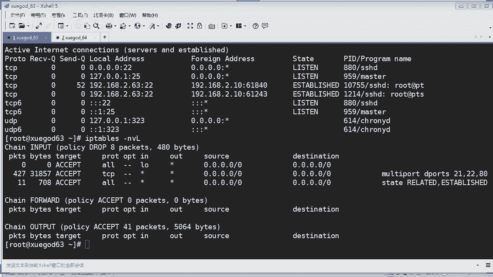

# Linux／Linux运维／RHCE／红帽认证／云计算／Linux资料／Linux教程--iptables理论及配置 - P2：iptables配置02 - 学神科技 - BV1KV411r7yk

来，我们来一条条来配吧，我看一下啊。嗯。匹配这个网络接口的对吧？

网络接口呢就是指定某个网络接口，我们还是拿这个来。如果是指定某个网络接口呢，我这里应该改成什么？对吧。比如g。A是吧，那我这个网卡应该是ENS32吧。是不是这样子？我看一下啊，I。IP。

ES32没有错啊。从这个数据流ES32的，然后匹配到转换。这样可以吗？这样不行是吧？我不能这样匹配吗？

来，我看一下啊。杠A。ES33，我是ES32啊，要匹配他留哦，留有的。对我现在是指定的是什么？NAT表对吧？NAT表里面的pro，然后我指定了这个ES32，这样不行啊。来，我还是照着这个来吧。

S是匹配来源地址啊，然后IP网段域名也可以为空啊，这样子吧，我先把这个规则讲完，我们再做实验，好不好？嗯，S的话，比如你可以匹配这个IP，就单条IP或者是一个网段，对吧？杠D的话是匹配这个目的地址啊。

你也可以是IP网段或者域名，也可以为空啊，也可以为空啊。然后按协议的话是杠P啊，比如TCP啊、UDP啊、ICMP啊等等啊，OK。那么比如杠PTCPUDP啊，SMP是什么东西？同学们这个是拼包的对吧？

拼包啊，OK按来源地址的话是杠杠。哎，注意啊，这个按来源地址的话，它是有两个杠，注意两横，对吧？杠杠Sport匹配云端口注意啊这个。然后的话你可以是个别端口，也可以是个端口范围。什么叫端口范围呢？啊。

比如啊1000到3000，那你可以这样去啊包含啊这个什么呀，1000和3000。OK这个呢就是端口一个范围。O。那还可以这样举啊，匹配端口是1000以上的端口，哎，这种就大了啊。

这样的话就匹配1000以上的端口。OK这个是一个范围啊，还有匹配呢呃比如3000以下端口呢用这种方式啊这种方式啊OK。嗯，然后匹配这个目标端口，可以是个别。哎，这个用法呢跟上面其实是一样的啊。O。

这个跟上面是一样的啊。无论是你是原地址的端口匹配或者是目标端口和地址匹配，它呢这后面的这个用法啊，这端口范围的用法呢是一样的啊。

OK注意的是这个杠Sport和这个Dport必须结合杠P参数使用杠P参数指定什么呀？指定协议的，是TCP协议还是UDP对吧？你要指定它的协议。ok。匹配应用举例啊，比如你要指定这个。协议是UDP。

你就杠P，然后UDP。啊，然后指定它是什么端口，比如杠Dport53端口，我就指定53端口啊，这样写。OK意思是说匹配网络中目标端口是53的这个UTP协议端口。O。如果要指定这个地址的匹配呢。

那你是原地址还是目标地址？指定地址的匹配呢？一般我们使用什么原地址是杠S，你可以输入一个网段，或者直接写1个IP也可以。如果是指定目标地址呢，那就是杠D是吧？

我要指定访问到目标哪个地址的IP要进行规则匹配的意思啊，对吧？比如匹配来自于这个这个网段的去网这个网段的所有数据包，就这样的意思。ok。这个是。地址匹配啊，刚才是端口匹配。

那么端口和地址联合匹配又是怎样子呢？那你看这条规则，比如杠S就指定什么呀，指定来源于这个地址，注意啊，这个只是单个地址，不是一个呃不是一个网段，对吧？然后呢指定这个。来源于这个0。1是吧。

然后去往哪里呢？去往这个ABC点com注意啊，去往这个3个WABC点com。的什么端口80端口，什么协议TCP协议啊，那么这样的话，这规则是非常细了，对吧？如果你写了这个规则呢，那。什么意思啊？

就说只有这个来源啊，只有这台机能够什么呀，能够去访问这个ABC点com，而且是协议是TCP端口是80的数据包。你看这规则太细了是吧？如果你有一条不符合都不行，是吧？你的原地址不是0。1的啊，不好意思。

是吧。O。那这里有一个图啊，就是比如你一个源端口啊，231个随机端口啊，对吧？随机端口然后呢，你去访问目标地址的80端口是吧？就其实就这个意思啊。刚才讲了这个杠杠Sport和Dport的话。

必须联合杠P使用啊，必须指定协议类型，一定要指定它是什么协议协议，是UDP还是啊TCP啊，条件写的越多，匹配的越细致。注意匹配的范围的话就会越小。同学们。你看这个写的特别长的情况下的话。

就它的规则是非常小是吧？非常小。这样的话匹配的话，那就非常严格啊。OK动作的话有什么呀？ACCEPT是吧，还有jorought，还有这个什么呀SNT还有DNATT。😊，这什么意思？上面是放行这是什么。

就是拒绝。然后的话是原地址转换，这个是目标地址转换，还有呢这个是什么呀？这个是无论你是什么，他都进行全部转换，这种是相当于叫啊。不论你是指定所有的啊所有的它都会进行转换，就就相当于这个。这两个了啊。

杠J的话啊，后面就跟上动作，对吧？就可以使用这些啊动作。上面的动作的话，你就可以用杠J啊，然后进行执行啊OK。啊，其实这个的话，我们刚才都已经啊举过例子了，对吧？嗯，这里又举个例子哦。

这个刚才我也举了例子是吗？比如在这个。啊，NAT里面的pro的话进行一个原地址转换啊，就相当于我们的路由器一个道理啊。比如我们路由器现在不就是丝网网段吗？丝网网段的话，你要出去，你要做什么呀。

它就会做一个地址转换是吧？转换到你的网关，假如你的网关是192。168。1。1。那么所有这个地址的，它就会转换到这个地址，然后出去对吧？或者是你的呃你的公网IP地址。

对吧比如把你这个网段里面的所有数据包转换到公网公网地址啊，假如这个是公网地址的情况下，对不对？就模拟了一个路由器上网的一个情况。ok。😊，那这种方式还可以这样子操作啊，这种方式表示什么意思呢？

它写一个网段，你看没有？后面转换成功的这个目标啊是吧？就是NAT转换之后啊，它可以写一个网段，这个有什么用处呢？我跟你们说啊，假如你们公司有有3个公网IP对吧？有些公司肯定有多个公网IP，对不对？

那我就可以实现啦，将我内网的所有数据包进行转换到我3个IP上，对不对。就说无论他留向哪个公网IP都可以出去，明白吗？这种的话就可以将你的原地址转换多个是吧？转换到多个的这个公网IP上去。

就可以这种方式去写啊。OK就相当一个地址池一样啊。嗯。目标地址转换啊，看看目标地址转换呃，啥意思啊？就是比如我要将什么呀？那比如我要将这个啊来源于啊这个网卡对吧？TCP协议。啊，然后是80端口的。

然后进行转换转换到什么呢？转换到这个IP上去，看没有？这种就是目标地址转换。什么叫目标地址转换？通俗来说，就是你要从这个网卡进来是吧？从这个网卡进来访问80端口的，我全部呢都把它转到另外一台机上去。

就这个意思。是吧。明白我意思吗？把从一啊，这个应该写错了。你看没有？ENSENS然后是33，对吧？把从ES33这个网卡进来啊，而且是访问这个80端口的数据包地址全部呢是吧，进行改为这个什么呀。

改为192。168。0。1。这啥意思啊？就比如你的这个内网啊，你这个内网里面的话干什么呀？有一台web服务器是吧？web服务器。那么这个web服务器呢，它的IP地址就是192。168。0。1，对吧？

那我将所有访问这这个web呢，web的这个什么呀，这个请求全部转发给他。这就是目标地址转换。那你就可以看到网页了嘛，对不对？比如我里面有个一个庞大的一个we集群一样OK。对。OK这个明白吧？😡，好吧。

那你来执行一下啊，看有没有什么问题啊。那我这个网卡你如果执行33的话，他就肯定会报错，对吧？你看我执行哎，他竟然没有报错。那但是这样的话，他这个规则永远是没有匹配成功的，为什么？因为我都没有这个网卡。

对吧我只有32。是不是？周月，同学们。那你这个里的话，假如你没有这个网卡的话，你匹配的话是不成功的对吧？你规则是写进去了，但是没有用。是不是？O。那这里是吧呃，所有地址。转换哦，我应该查看。查看什么呀？

查看我的这个NATT表，同学们注意啊，我查看我的这个NIT表就可以看到详细的啊。是吧。以我刚才那条规则是干什么用的，看到没有？这里。是啊。我写了两条规则啊，我应该写这条才对的，对吧？啊。

比如要从这个这里有个in，同学们，这里有个inin，表示说进来的网卡对吧？从这个ES32进来的网卡对吧？那么它的这个数据包啊，而且是TCP协议的，注意啊，TCP协议的。然后呢。

然后访问的是80端口的全部转是吧？转发到这什么呢？这个192。1680。1上OK。是吧这样才对，因为我们只有这个网卡，它从这个数据流从这个这个进来了才有啊。ok。😊，DNATT可以理解为数据转发吗？

你可以那样去理解，但是这个跟转发呢还不是一个意思，他这个是什么意思啊，是转换转换到目标的地址上去啊，你也可以理解它是要转发吧。OK。转发有很多层意思啊。对吧。O。

好，那这个的话是转发来，我们再看一下啊。这就是说对方访问本地80端口，且数据包被烟s网卡接收的时候才会改IP。啊，数据包从就是从什么呀？从这个NS33的网卡流进来是吧？而且是访问TCP协议80端口的。

我就把它转发到什么呢？转发到192。1680。1上去。对的啊。那如果我要转发到81的端口上去呢。那你在后面加上端口号就可以了。这个懂吗？比如我加上这一条规则，还是刚才那条吧。

对吧比如转发到这个0。1的这个81端口上去啊，那你就可以加上这一条，对吧？这样的话你就可以看到哦，哎转发到8一的。是吧8一端口唉，这里虽然没有那么长是吧？我把它显示小一点就会看清楚了啊。看没有？我。

这样显示啊啊，这条看这条规则啊，看到没有？他转发的过程中呢是访问80端口的，他又同时发给了内网的另外一台机的81端口。那么这种有什么好处呢？同学们，你们有没有想到，如果这条规则在什么场景下可以用得上？

对，这位同学问你好，这个策略到底干嘛用呢？比如啊比如假如我内网有有一个weber集群，我这个weow集群呢是由10台的这个机器都安装了weber服务，对吧？提供一个负载均衡是吧？假如。

我每个每一台机呢可能我都我不一定要用80端口啊，对吧？比如我有一台机是用81端口的对吧？我就可以通过这条规则去匹配了，我是不是可以转发到我内网的其中一台机器的81端口上？你说对不对？有没有用处是吧？

但是这种的话还是比较少这种情况，对不对？这个懂吗？😡，OK这是一个应用场景啊。好。

那往下去看啊。外部不会知道真正的服务器。对啊，外部的话是他是不会知道真正的服务器的。为什么呀？因为它完全是无感知的，这个东西完全是由什么呀？由IP tables来完成，明白没有？那么对外的话。

它只是访问这个这个网卡上IP地址，假如这个网卡上的IP地址呢呃是。对吧是192点。168点是吧，2。1是吧，无论是什么都行，对吧？他外面访问的永远都是访问这个对吧？但是呢经过这个IP tape时候呢。

他已经转发到内网去了是吧？就这个意思啊，OK。好，表达式3，你看一下啊，比如从这个网卡进来的，要访问80端口数据标地址改为一个网段。那刚才讲了，如果你是一个web集群是吧？你不可能转发一台机啊，对吧？

我可以将它访问80端口的，把它转发到一个网段上去，你说对不对？那这条是这条就可以实现我们的要求了。看懂了吗？是吧？

那看见没有？我要把从这个网卡进来的对吧？然后是访问80端口的进行一个转发，对吧？转发到这个网段上去，假如我这里有10台机，0。1到10对吧？是不是10台机器啊，对吧？他就会转发到这10台机器上去。

无论他转发哪一台，都可以正常访问，你说对不对？啊，可以配一个网段，也可以单单独的去配置一台机器。O。😊，看到没有？那这样的话配置是是不是比较细化，对吧？非常细化，可以指定。

那有些同学说你不就只有一个网卡吗？为什么要指定网卡呢？那你就错了。真正的生产服务器呢是至少有4张物理网卡，对吧？😡，那我就可以指定呢每张网卡都配一个公网IP是不是每个网卡都有一个公网IP的情况下。

我要指定从哪个网卡进来的流量，就要访问后端的是吧，后端的哪一台哪些服务器上去，是不是可以这样去实现同学们。😡，对吧。感觉用不到。嗯。做了负载均衡都是自动轮声的。没错啊，如果你做自动负这个什么呀？

负载均衡，它肯定是可以实现人声，对吧？那实现的方法呢千万条对吧？就说条条大路通罗马是吧？😊，但是你看是某些场景的话，他还是要用得上的嘛，对吧？可能我们做we博用不上，但是可以做其他的一些应用啊，对不对？

是用得上的嘛，对不对？地址池是轮孙的吗？地址池的话它是随机的啊，随机这里就会随机。它跟你这种负载均衡的算法就不一样。这里的话就随机。

O。那么刚才讲啊，这个呢是什么呀？这个的话是动态原地址转换，它就是动态的对吧？它它不是说SNT或者是DNATT的，它就是动态的一个原地址转换，就是伪装啊，应该叫伪装是吧？伪装动态原地址转换啊。

动态IP情况下使用。什么叫动态IP就是你不确定啊，因为你的IP是可变数的情况下。就会用到。啊，假如哪种场景呢？我说一个，比如VPN吧。你看这条规则啊，如果是用这个。这个表示什么意思啊？将原地址啊。

这个网断了，对吧？数据包进行一个地址伪装啊，地址伪装转换成什么呢？转换成出口到这个烟子33，对吧？烟子33上的这个IP地址。所以。进行什么呀？比如ES33的话，它是一个路由器的外网啊。

像我们的路由啊NAT也可以用这种啊也可以用这种这条规则来匹配。或者是啊你搭建这个VPN也可以用这个。对吧因为VPN里面的话，你内网肯定有很多台服务器，也可以通过这种方式来配置。请教下，如果做了转发。

我本地的机器给对方回报的报文里面里带的IP是转发后的那个IP还是对方访问的IP转发后，那你要清楚我们所有的转发的话，刘金这里呢出去的话，他就已经换掉了。同学们注意啊，你到达最终的IP地址是多少。

那么他目标的客户端接收到了就是多少。明白吗？独步红尘。就说你的数据包在我们这个路由器呢，它会进行重新打标签，它就会转发到内网。内网再出去呢，它又会重新打标签。

你收到的包呢是真正你跟你做数据交流的这个IP地址。那你内网的所有东西你都是看不到的。O。啊，地址伪装是啥意思？明白了吗？因为你这个是相当一个一个动态的，比如你这个网段是不是有好几百个一个一个一个地址啊。

对吧？就你这个网段里面的，无论哪个地址是吧，我都进行一个全全方位的伪装，把它转换成这个网卡上的IP地址。对吧。或者你写写上什么呢？写上这个这个什么呀，不用网凯也行，你写写上他的这个公网，就是IP地址。

目标地址也行，是吧？OK。那么附加模块啊，这种的话还有一些更加细化了啊，比如状态匹配啊，状态匹配呢啥意思呢？来源地址匹配，还有包速率匹配啊，其实这个的话可能用的比较少一点，状态匹配呢就会多。

比如我已连接的已发生链接的，已已建立链接的，我要保持链接，这种的话就是状态是吧？匹配已经在链接的情况下，你不能给我断开是吧？要通行，要放行它的数据包，就叫状态匹配来源地址的这个很好理解啊，对吧？

按你的mac地址就是MS地址进行匹配。啊，这个的话更加细化。其实这种用用的还是比较少啊，对吧？非常严格的公司的可能会用得上，对不对？按包速率匹配的话，就是指定你的包速率其实也比较少用啊，什么比较少用的。

比如你要指定它这个传输的这个包的速率都要指定的话，我也是醉的啊，对吧？比较少一点，多端口匹配的话，呃一般情况下可能用到吧。比如我要匹配多端口啊。按包状态的话有哪些状态呢？是吧？

new你看这个什么已连接或者什么什么啊那几个状态这里讲一下啊，new的话就是有别TCP的SYN啊，如果我们发送一个流的初始化包状态就会在op链上被设置为new当我们收到回应的包时。

状态就会在这个这个什么out这个链里面设置为已连接是吧？这种方式，如果第一个包不是本地产生的那就会在这个链上设置为new的状态有点out口是吧？其实这个东西的话，呃好像不太明白。

但是呢不要纠结于它它其实呢就是在我们链接中的一一种状态啊，一种状态啊，这种是已连接状态，这个呢就是区于没有连接的是吧？还有是衍生态，什么叫衍生态呢？由你这个状态出来啊发生的第三种连接状态。

比如它这个什么意思呢？像FTP就是。FTP为什么呢？它可以衍生啊一个什么呀随机端口。是吧随机端口，然后再跟你的客户端进行建链接，就会产生一个什么这种衍生衍生态的情况上发生是吧？

就它由这种已连接状态也要产生的这个第三方连接。就叫演伸带。ok。不能被识别属于哪个链接或没有任何状态。这种啊这种的话一般是什么呀？一般的话就是呃已经已经什吧，已经断开的状态已经断开的状态啊。ok。

那你可以看啊，像我们执行这个net。对吧这个你不是看到吗？是吧，这个是不是已连接状态呀？😡，是吧。已连接上啊，上面的话是监听状态，对吧？这个是已连接状态。看得懂吗？就就就这种意思啊，是吧？各种状态的话。

会在这里显示，你可以通过netNT的方式来。那么IPw呢，它也可以根据这个状态来匹配，就这样的意思。懂吗？他可以根据这个状态的方式来匹配这条你这个数据包是否放行啊。

ok。是吧那每个状态的话，我就不细讲了啊，你们自己看一下就行了。因为这些东西的话并不是太重要的东西。好吧，你可以看一下啊。嗯，这里有很详细的一些啊文字说明，对吧？啊，好，我们往下去看。

按来源来源的话就是mac地址啊，这个是什么呀？你的网卡物理地址，对吧？这种其实还是也比较少的。刚大家讲啊，按来源地址，这里讲的来源地址不是IP地址，是这个什么呀？MS地址是吧。😡。

M地址啊就是更高级的一个物理地址了，是吧？如果这样去配的话，嗯，它就要指定什么呀？指定你的MS多少啊，你这样去配的话要写的更细。你首先的话要去找到它什么呀，找他的MS地址出来是吧？copy出来。

然后再去进行一个匹配是吧？还是这个的话匹配起来的话，稍微有点麻烦，对吧？有点麻烦，比如他这里配到这个for word链。那刚才同学们说转发转发，那for窝链呢才是真正的一个转发对吧？这个转发呢。

它其实是对什么呢？假如匹配MA地址是这个的来源地址的，是这个的，它进行什么呀？jog掉。掉就是不给你哈，不给你转发，对吧？阻断来自于某MS地址的数据包，通过本机是吧？不能通过本机进行一个转发。O。

报围经过路由后啊，数据包中原有MS地址呢会被替换掉。所以在路由后的Ilips中使用MSD模块是没有意义的。有没有听清楚这句话？啊。因为假如。假如你我们现在用路路由器啊是吧，你通过通过路由器之后。

它是不是已经转换掉了？对吧所以这个东西其实我们用起来的话并没有太多的一个作用啊。那按速率来匹配呢速率匹配的话嗯，其实也没太大的一个呃作用意义啊。

因为一般我们不会限定它的一个一个匹配速率去做一个什么做一个规则匹配啊，是吧？虽然说有这个东西啊，你们看一下就可以了。我为什么要限它网速呢？没有必要啊，是吧？所以现在话基本上线这个东西的话基本上是用不上。

主要是匹配刚才像我们那种什么啊放行或者是不放行的规则比较多啊，是吧？比如要匹配访问目标地址是0。1的啊，然后进行一个什么呢？进行一个数据包数立匹配。你看没有？释放行没错，是放行，对吧？但是呢。如果。

它这里是什么呀？每秒50个对吧？只能传输50每秒只能传输50个数据包，对吧？如果大于这个数据包呢，直接照掉了。这个呢你要配两条规则才能啊生效。为什么呀？一条是放行的规则，一条是照掉的规则。

对吧前面这条规则呢，如果你满足这条规则的话，它就放行是吧？如果你大一这规则，它匹配不成功，它就往下匹配，往下匹配就是这条规则了，对吧？它就会 drop掉。OK。有同学说用来限速。

免得销售部天天上网看电影。OK好吧啊，你想到一个用处是吧？但是实际上呢，现在的话嗯，我们限速并都很少使用这种方式去现了，对吧？😊，我们直接是过滤掉所有这种什么呀，这种。

比如电影类的音乐类的新闻类的股票类的网站，我们可以通过上网行为来控制，对吧？所以这个的话应也是蛮少的啊。哼。O。😊，注意啊，这个limit呃1以上是限制的意思，但实际上只是按照一定的速率去匹配啊。

这个每秒50表示一秒钟中转50个数据包。注意是说数据包而不是50K，也不是50兆，而是数据包，就说你的数据包只能每秒呃传输50个而已啊。如果你要想限制的话，你要有两条规则，一条是jo掉的是吧？

一条是指定啊，指定数据包量的啊。好，往下去看是多端口。多端口啊多端口的话呃，我们偶尔还是用得上，比如一次性匹配多个端口啊，你看这里比如你在这个input的链上啊，也后指定多端口。

多端口呢就是mautymautypo啊，这个单词mauyport，然后呢depo就是目标端口。那这里写了很多端口，你看到没有？21222580110。看到没有？那么所有在这个链上是吧。

然后是TCP协议的，要访问的这些端口，我们的全部进行放行。那么多端口有什么用处呢？比如我我。假如我这台机是什么呀？假如我这台机呢呃安装了FTP安装了阿帕奇是吧？还有呃还有这个什么呀。

我们还要放行我们的这个SH。

对不对？那我就可以一次性的放行呢。😡，对。我就可以一次性把多端口的话放行掉，是不是一条命令就可以搞定了，对不对？IPt杠A然后我指定这个端口啊，凡是访问目标端口是21、22、25啊，包括邮件端口啊啊。

这个we博服务器端口啊，对不对？全部一次性给我放行。就可以了。对不对？这样一条就已经解决了什么呀，解决了你所有的这个这个这个东西啊，我们不应该是看这个filter啊，我们应该是看。看所有吧，对不对？

看所有或者是看我们不应该看LT啊，我们应该看filter里面啊，或者是所有。那么这里就有了嘛，对吧？那这样的话就多端口，看到没有？这条规则里面有多条是吧？

凡是匹配21、22、2580110的端口全部放行就搞定了。那我就没有没有必要写那么多规则啊，多端口还是蛮实用。

O。当然你要指定这个一般我们就是TCP的协议，对吧？那如果你这里的端口呢还涉及到放行UDP协议，那你就要再加一条规则，再加一条规则。OK要注意啊。嗯，最后的话是这个什么呀，保存规则。

我们保存规则的话是保存到哪里？刚才我们讲过啊，它的这个什么呀，它的配置文件是在哪里，还记得吗？ETC下面的ss configurefiI tables对吧？但是如果你不把这个规则保存的话。

它有可能就会丢失掉。

我看一下啊。好，ETC下面的says confi i tables对吧？你看这里啊，这里话就是刚才我们配哎，不是，这个是它默认的呃这个规则，对吧？我们刚才配了很多东西，它都没有保存到这里。是不是？

没有是吧。那如果你要把这个所有东西要保存到这里怎么办？那你就要进行呃Iip进行一个保存。当然了，你可以用这个service的方式进行。其实我们在3到26的这个这种执行执什么命令的话。

他也是可以也可以的对吧？sfe呢是吧，这样的话就可以进行啊保存了。然后我们再来看一下。你是不是看到有很多的规则在里面，对不对？这个就是刚刚我们保存进去的是吧？对不对？没错吧。OK那这样的话。

他才能够保存到你的这个文件里面去，是吧？以防你下次重载或或者重启之后呢，哎这个东西就没有了啊。以前只知道能限制一些IP访问一些端口啊，现在你知道吗？I话可以对什么呀？对IP地址，对端口啊，对状态。

对这个mac地址好，有对这个速率做限制是吧？啊，还可以做对这个多端口做限制等等啊。一般的话我们对什么呀？对IP和端口做限制的比较常用。那么其他的话可能就没有那么常用一点。ok。

那么一般的话我们要放行哪些端口呢？我们比较常用的是像啊刚才讲到2280是吧？21还有110啊，邮件端口啊，是不是？你看这些端口的话是比较常用的，我们都要放行，对吧？我们要把这个规则写上去。对不对？

为啥这么强大功能实际用那么少呢？那是因为呃现在目前呢呃怎么说呢？我们的这个系统啊越来越强大是吧？我们会进步的嘛，对不对嗯嗯？你想想现在的这个硬件防火墙，还有软件防火墙层出不穷是吧？

都可以覆盖掉啊这个IP tables的功能了，对不对？还有包括你像那些什么负载，负载均衡啊，对不对？F5啊，对不对？这些东西的话都可以实现很多的功能，对不对？所以IP tables的话。

其实在我们的用当中是吧慢慢被弱化掉了，是不是？但是它还是一个非常好用的一个工具啊，如果你你公司又为了省钱是吧？又没有太多的投用嘛，硬件防火墙型况，那么IP tables是一个非常恰当的东西啊。

你可以把它用上。I可以防击这个D dos吗？I话并不能有效的防呃这个呃D dos，我们应该配合其他的一些什么啊其他的一些工具来实现Ddos。因为你知道D dos的话，它是千变万化的这个IP的嘛，对不对？

嗯。比如你们哎，你们有讲过f to back吗？fel bay有没有讲过？😡，他就被还没讲是吧？应该是明天看一下有没有可以讲一下啊。禁止所有哎你禁止所有人的访问，那那你自己也访问不了啊，对吧？

那你正常的一个提供weber服务的，你肯定要正常访问的嘛，对吧？你不能禁止所有人访问，那就不现实了嘛，对吧？你要提供这个生产服务的情况下，必须啊必须要对外的。😡，对吧。

O。做禁止所有的拼包。你禁止所有拼包有什么用？是吧禁止拼包并没有什么作用啊。D dos的话，它不是拼的问题是吧？D dos的话，它是一个洪水工具是吧？洪水工具的话，它会产生。

比如全世界范围不同的这种模拟动态的IP不断的去访问你的什么呀。访问你的这个weber服务，导致你的资源全部耗损掉。对吧。对呀，D到s你完全不能区别是否为正常的链接，你都不知道他是不是正常来访问呢。

还是呃公击的访问，这就有点那个啥了，对吧？

啊。来，我们这样子啊，还有点时间给同学们举一举一些啊嗯。这个IP tables。那假如啊我再来服务气的话。是啊。我把规则清空先啊。对吧同学们，如果我把规则清空了，我在这个文件里面的规则会不会清空啊？

还是有的对吧？是不是？注意啊，我的规则里面是清空了啊。对，但是你在这里是看不到了。那如果。这些的话操作一下给你们看啊。如果我重启呢。好，我再来看一下。嗯，我的又回来是吧。

他就会取读取你的这个默认配置文件。😡，看懂了没有？同学们。如果你将你的规则保存到文件了，你重启呢，它会去读你的默认配置文件。明白有？这样你就不怕你清空之后，我辛辛苦苦配了那么多规则是吧？哎呀。

我要重新配了，是不是很狼狈，不担心是吧？😡，我就可以直接重启一下，它就会去重载你之前保存那些啊所有的那些规则里面是吧？同学们是吧？OK那我现在把它清空啊，那假如我这台服务器的话，装了1个FTP啊。

FTP。forward会冲突吗？呃，如果你配的东西的话，我不建议你把这两个东西同时开启啊，同学们。IP tips和这个forword不建议呃同时开启啊，你是可以同时开启的。但是呢如果你开启的话。

会有一些不可。预告的问题，比如你这边要做限制，那边又写规则会乱啊。所以明天我们会讲一下这个for word啊，假如我这台机是1个FTP服务器，我应该要放行什么东西啊？要考虑放行什么东西，同学们。

IP tables对吧？那你要考虑的是放行。好，在你的input你进来之后呢，你要指定什么呀？啊，TCP对吧？然后端口是21端口。21端口是不是FTP的对吧？😡，你要进行一个放行，对吧？

ACCEPT你要放行，对吧？还有什么放行，20端口也要放行，对吧？20端口呢是数据端口，21的话是啊监听端口，对吧？那么这两个话你都要进行放行。对不对？是吧我们就可以这样去配吗？O。两个都要放行啊。

那么还有什么东西要放心呢？还有这个默认的话，我们要放行呃这个。回环口地址。啊，默认的话，我们要放行这个回款口地址。因为为什么有些同学还不理解，哎，你为什么要放行这个。😡，来，我给你看一下这里。

他在这里呃展示的就是这条啊，刚才有同学不是疑呃有疑问吗？他说你不是有一条or的这个这个放行吗？其实这个呢就是放行回款口的地址。看到没有，同学们。看到了吗？那如果你这样看的不清楚的话，NVL是吧？NV好。

把它显示更清楚一点。啊，这个要放小一点，给你看啊。是吧。这个呢表示这里就会显示了。如果你不把这个这个V打上去的话，你都不知道哦，这个是回汉口的地址。对不对？如果是像刚才那样看，哎。

你认为哎不是所有地址吗，对吧？其实它是回还口的地址。OK回函口地址有什么作用呢？比如你的服务是不是要跟回函口通讯呢？😊，对不对？比如你的FDP啊，或者是你的阿帕奇也好，有时候呢他要跟你的127。0。0。

1要进行通讯的。所以呢你要把它放行啊，你要把它放行。同学们要注意啊，这条规则要放行。ok。是吧。好了，我们把这个2021端口啊都已经放行了，对吧？那假如你这台机的话，还是一个。嗯，还是一个什么呀？

web服务呢。那你还要放心什么？还要放80，对吧？如果你要通过SH连接呢，你又还要放行22端口。那么这个时候呢，我们这个这个叫多端口，还记得吗？我们不是有一条命令叫多端口嘛，对吧？就派上用场了，对不对？

inport啊，我们就不用写那么，刚才我是写了两条规则嘛，对吧？我为什么要写那么多规则，我可以一条命令。😊，对吧写完他都可以啊。这个配的有点复杂是吧？杠M以后m是A。mty啊是这样写啊。

mty port对吧？啊，mauty point就是多端口。是吧然后。比如要指定Dpo访问目标端口是啊嗯假如啊。给我把21。我2。80。对吧。就可以一次性把这些东西啊。写完我就不用写那么多。EPTO。

好，对吧。那。好了，同学们。😊，那我现在的话还有什么东西要放行呢？呃，比如我要允许其他机器要拼我这台机，我也应该要放行，对吧？我要允许别人拼我，我应该添加什么呢？也应该是在这个inport的。

因为import就是进嘛，对吧？如果进这里的话，我禁止掉啊，我就可以了。嗯。这个是什么协议啊？😡，ICMP协议是吧，拼包是ICMP协议啊。对不对？ACCCEPT啊，对吧？这样的话别人就能拼我了，对吧？

😡，能够把它你就拼成功嘛，是不是OK。😊，还有刚才我们不是学习了一个叫啊IPtables，然后有一个叫。根据状态放行。什么叫根据状态放行呢？😡，就说由上面我配置这些规则啊产生的状态你都要放心。

懂我意思吗？状态飞行是杠M，然后t哦t是吧？stay然后杠杠嗯stay。对吧什么状态呢？刚才我们都讲了好几状态是吧？什么已连接已断开是吧，等等等等的啊。当然我们是要放行的是这个已连接的是吧？来。

我拉上去啊，这样你看。😊，1般年要放行的是已连接的，对不对？已连接啊，还有。这种断开了，我们就不要放，就不用放心是吧？这个啊一般和。😊，这个吧啊一般是这两种状态的话，我们要把它放行啊，来我们写一下。

这个。这个状态是表示已连接的对吧？然后还有这种叫什么？这也是相当于有连接的状态，对吧？已经创建衍生态的对吧？这个是叫衍生态吧。是吧衍生态就衍生出第三种连接。你要进行放放行啊，对吧？为什么这样说呢？

比如你的FDP呃，我们之前写过FDP有主动模式和被动模式，还记得吗？同学们，那如果是。啊，这个。被动模式还是主动模式，它是不是产生一个随机端口啊，对不对？那么这种随机端口呢，在你这个列表里面是没有的。

对不对？那你要让它能够放行怎么办？它就要靠这条这条规则了，对不对？就要靠这条规则了。懂了吗？这种就是衍生态或者一链接的规则，你要进行放生放行，对吧？ok。对不对？来，我们来看一下啊，I。P。Table。

啊，杠L。来杠NVL吧，这样的话输出对吧？我们可以看到我们刚才配的这些东西啊。啊，这个太大了。那。有。啊，是吧我们总共配了1234566条规则是吧？放行了什么呀？21221其实第一和第二的话。

我们可以删掉是吧？我们演示，因为第三条的话已经包含了嘛，对吧？不是，第四条已经包含了。第四条，因为我们配的是多端口啊，把212都包含在里面了。所以第一第条第二可以其实可以干掉它，对吧？不要它都可以。😊。

对不对？那IP tables是吧，我们删掉它，删掉它这个inport。嗯，一是吧。然后。哎，你说我现在要值一还是写2好，这里这里就有有一些技巧了，同学们。😡，你回答我，我执行第二条的时候呢。

我要写一还是写2。回答我。Hello。😊，龙杰同学说，一。我能写2吗？对，是一，为什么是一，你们应该懂吧。这个这个我想你们如果回答出一的，肯定知道是什么原因了，对吧？因为你现在删除了一条之后呢。

剩下那第二条就变成第一条了嘛。😡，啊。对吧。啊，没错，啊你们反应还是挺快的，是吧？😊，OK那这样的话我就啊刚才两条就是相来多余的嘛，对吧？因为我这里有多端口啊，然后。那衍生态对吧？还有拼包放行。

那么这个时候呢，你的默认规则也是放行啊，我应该配条默认规则是什么呀？是造掉的对吧？IP table。对不对？破配置这个默认规则是杠P，对吧？来，我们进行啊照掉之后，你看它会不会断开呢？来，我们再看啊。

这个时候我们的默认规则是造的啊，同学们，你看。😊，是照的对吧？很危险，对吧？现在你说我断开能不能连接？😊，打开。能连接吧，没有问题是吧？这样就是模拟在生产环境上配一个一个一个一个实例。是不是？ok。😊。

看得懂啊。啊，我的默认规则是做掉的啊，是不是？如果这里不不能匹配的规则，它全部都进不来是吧？那我这台服务器是不是很安全了，对吧？很安全了。你比如访问80端口的，可以访问访问FTB也可以。

22端口也可以是吧？由这些产生的这些什么衍生态也好，以链接状态好，它也放行。啊，都不存在问题，对吧？你要拼包也可以拼，能不能拼来。

然后我打开一个窗口。192。168。2。63。能够拼通，对吧？

没有问题啊，能够拼通。那如果我把这条规则删了，你说还能不能拼把这个ICMP的。I see。杠D啊，这个是第几条规则，123第三条规则，我们应该删除三，对吧？好，我们来看一下啊，我能不能拼通嘞？😊。

还能拼充啊。😡。

来，我们看一下啊。😊，第三条规则是什么呀？已经删除了，看到没有？没有了啊。😡。

好。那。哪位同学给我解释一下，我为什么还能拼通？😡，有没有？我看你们都睡着了吧。呃，有些同学说讲。讲这种技术课啊特别枯燥是吧？是比较枯燥。但是你要学东西的话，你要掩得住。明白没有？

哪位同学告诉我为什么还能够拼通，有没有？😡，有没有睡着同学？有没有在听课的同学？状态是启动的。一。默认是。啊，放心，你不指定做肯定能拼通。什么意思？我现在屏不通了呀，你看到没有？😡。

现在不同了，对吧？它是不能拼通的，但是呢你顺你刚才拼过对吧？你刚才拼过呢，它是不是产生一个衍生态，有一个已链接状态呀，对吧？对，相当于缓存。那么它它是能够拼通的。但是你过一阵子呢。

它会因为你每次拼的时候呢，它都要匹配这个规则。如果你这个它已如果它这个衍生态变成了什么呀，变成了断开，就是不是已链接或者不是衍生态情况下，它会干什么呀？它就不能再拼通了，明白没有？同学们。

是吧那问题在这里。啊，这一点的话你要啊他如果变成这种状态了，就是嗯没有链接了嘛。是吧只有这种状态啊，连接上了，它才可以通啊，不是这种状态的，肯定不行啊。好吧。😊，那就OK这个学会了吧。😊。

这缓存时间多久呢？一般的话就。几秒钟吧。啊。几秒钟很快的对吧？不用很快的，基本上你你再拼个一两次的话，基本上就可以了啊，几秒钟就可以断开。😊，啊。O。嗯。好了。啊，三次握手最后那个保持链接时间。嗯，对。

好了，这个呢我们刚才举了个例子，对吧？举了个例子，就是呃关于这个防火枪，对吧？我们设置它一般你把这个规则配完之后呢，你要加上一条。

比如你要在你的默认规则设jot或者是在最后面的规则设一个jot规则也是可以的啊。并不一定说我要在这个默认规则是设置，我把这个规则添到最后一条也行，是不是添加到最后一条也可以的嘛，对不对。

OK那那就可以了，是不是？😊，那以后的话你们去配这个这个生产环境呢，记住什么，记住什么东西呢？你要把这条东西。配上去啊，就是这个这个状态是吧，状态链接的要放行，还有什么呀？还有回环口的这条配上去。

这两条很重要是吧？因为很多服务啊，他要跟你的回环口打交道的同学们。不然的话以后你会发现有一些异常情况。哎，为什么我在本机运行服务的时候呢呃不能运行成功？就是因为你你不能跟回款口通讯，知道没有？

因为有些啊服务他不是通过socket的方式来啊打开软件的，知道我讲什么吗？他不是通过sockcketsocket他就套接字，对吧？socket的话，它就不不走什么呀？不走你的这个回环口。

如果走走网络的话，那就走回源口的话，你都要放行。所以这条注意同学们啊。ICMP不是TCP啊。对。好啊，这个的话还有什么疑问没有啊？😮，嗯。我们只举个例子啊，明天我们再去再继续举一些例子啊，比如。啊。

模拟就像路由器啊是吧，我们怎么样使用这个IP6使用使用这个是吧，转发上网。就是刚才我们讲的这个SNT对吧？其实很好理解啊，这个东西。M。行吧，今天的话内容啊主要是概念的内容比较多一点啊啊，举例子。

明天我再举吧，好不好？同学们。明天的话实操部分多一点啊，今天讲理论的东西稍微多一点啊，OK。

今天主要讲理论啊，还有安装配置啊，还有一些啊就使用方法，对吧？注意的地方啊，给你们讲讲，明天再实操多一点这个这个命令操作啊OK明天还是继续讲这个IP tables啊，然后讲完之后呢。

再跟同学讲一下这个for word是吧？新版本的防火墙对吧？也讲一下啊啊，最后也讲一下S links啊S links呢嗯比较不常用啊，我们也讲一下吧，带一下。O。

