# Linux／Linux运维／RHCE／红帽认证／云计算／Linux资料／Linux教程--rsync概述与安装01 - P1：rsync概述与安装01 - 学神科技 - BV1bC4y1h7yB

好啊，今天的话是你们第二阶段的第二节课啊，也就是第二章对吧？讲什么呢？讲这个这个同步的软件是吧？SYNZ啊，加这个SEISYNZ实现数据实时同步啊。来我们先了解一下这个东西。其实在我们运维过程中。

这个东西还是蛮实用的一个工具啊。是吧首先我们学习一下SYC啊，它到它是一个什么东西，对吧？然后呢怎么样去安装啊，最后我们怎么样实现一个数据实时同步呢，对不对？所以们我要这三个来讲一讲啊，OK。😊，好。

S oneC的话它是个什么东西呢？啊，它是一个同步工具，也可以叫做一个备份工具是吧？它是lin系统下的数据镜像备份工具啊，使用快速增量备份工具啊，这个远程远程备份啊，可以远程同步啊。

可以在不同的组织主机啊，之间进行同步啊，可以实现全量备份和增量备份啊，保持链接和前线啊，它可以将你原有的一些属性呢都同步过来且采用的是用优化的同步算法传输前执行压缩啊，就说它传输的过程呢，它是压缩的啊。

压缩传输的话，这样会干什么呀，会减少带宽是吧？而且传输会更快，对不对？因此非常适合用于这种架构集中式备份或者是异地备份啊去异地容载等等这种应用是吧？同时S oneC的话支持本地复制，或者以其他的。

这种这种SS的协议，或者是SYC啊的主机进行同步啊。那么你们之前有学习过这个sbra是吧，是不是这个共享s把对吧？你看SONC其实是这个三把官网下面的一个什么呀，一个软件，我们可以看到是吧？啊，对。

都是做文件文件共享的，对不对？好，那SYC它是怎么样实现数据备份的呢？你看一下啊，其实我们经常用这个SCP也是拷贝，比如是你用SP拷贝文件到另外一台主机上，是不是使用这个什么呀？通过SH的协议是吧？

使用SCP来进行拷贝文件或者拷贝目录过去啊，但是SCP的话无法备份大量的一些数据，那么类似于像这个windows的复制，对吧？你是windows的复制，一旦出现问题了，断了，你可能要重新拷，是不是？

而SYC的话，它是边复制边统计啊边比较啊，它有这样的一些功能，所以功能会更加的强大是吧？嗯。OK你看一下啊，这个的话是是这个38项目领导者和主要开发人，同时他也参与开发这个SYC是吧？

还有linux内行，这个是吧，挺牛逼的这是作者对吧？作者啊，O我们了解了解一下就可以了。啊，SYC的话，目前的版本，等一下我们装完之后看一下，我们现在用的是3条OS7。4的系统啊，看一下。

我们可以通过亚么的方式来安装就可以了啊。这里笔记里面记录是3。09的版本啊，等一下我们在装之后呢，看一下最新的版本啊，就是RPM的最新版本是多少啊。SYC的话有哪些特点呢？是吧？也就是它优点来。

我们了解一下啊，可以镜项的保存整个目录数和文件系统啊，第二，可以很容易的做到保持原来文件的前线时间、远链接等等啊，其实这个是蛮重要的。因为如果你做数据同步的话，因些前线的东西没有同步过去的话。

可能会发生一些问题，对吧？啊，第三，无需特殊权限即可安装。嗯，第四，快速啊，怎么快速发呢？第一次同步时，SYC的话会复制全部的内容。那么在下一次传输的时候呢，它只什么呀，只传输改变内容。

也就是说我们经常听到的增量备份是吧，增量同步了，对不对？第五，压缩全输压缩全输是有好处的。刚才说了是吧，可以减少带宽，对吧？传输的时候呢减少带宽。对。第六是安全啊。

它可以使用SCPSH等方式来传输文件啊。第七，支持匿名传输啊，以方便进行镜啊网站的镜像啊。第八，选择性保持啊，看没有？他可以你可以去是吧，加一些参数是吧？要保持这个属性呐啊这个权限呐等等这些东西是吧？

嗯。快速性这里讲到啊，第一次同步时，它是什么呀？全部同步是吧？下次呢只是增量同步了，对不对？安全性呢就是刚才想到了啊，也可以用SCP和HSH的方式来传输啊。OK。好，这里就不重复了。然，我看一下啊。

常见的备份分类的话，我们一般有什么呀完整备份，对吧？😊，完整备份每次备份呢都是从备份员啊将所有的文件和或者是目录啊完整的备份到了你的目标目录去啊，这种就是完整备份啊。第二，差量备份什么叫差量备份呢？

差量备份就是备份上一次完全备份以后有变化的数据，对吧？这种就叫差量备份。它针对上次完全备份啊，它备份过程中不清楚存档的一个属性啊，就是文档的这个属性。第三种备份呢就是增量备份的啊。

备份上次备份以后有变化的数据是吧？有变化，所以你看这两个还是有一点区别的，是吧？这种增量备份呢，它才不管是哪种类型是吧？有变化的数据就备份，它会清除这个存档的属性啊，跟这个差量还是有区别的对吧？

差量呢它不会清除这个属性啊OK。啊，对，录屏了啊OK。😊，好，来了解一下这个SYC的原理啊，原理它是怎么样运行啊？运行模式它采用的是CS模式。还有没有同学不知道什么叫CS模式啊。

比如如果你去面试的时候呢，面试官问你哎，你觉得呃。😊，公司的这个架构采用CS模式好呢，还是BS模式好呢？就他会告诉你，我们目前是做什么行业，做什么东西的。他会这样去问你，你知道什么叫CS吧，对吧？

客户端服务器的模式对吧？那BS又是什么模式呢？我相信你们应该了解啊，如果你懂CS的话。呃，实际上呢是一个点到一个点的传输啊，直接使用的是SYC命令来即可完成，对吧？

OK那么SYC的监听端口的话是873啊，注意啊是873啊OK。这里要讲一下呃，使用备份的话就会涉及到什么发起端啊，备份源啊，服务端、客户端，对吧？其的这些东西都很好理解啊。

发起端无非就是负责发起这个SYC同步操作的客户机啊，就发起端就谁要发起同步的那他就是发起端是吧？通知服务器，我要备份你的数据，对吧？备份源啊，负责响应来自客户机的一个服务器，也就是原数据服务器嘛。

所以它就是备份源服务端啊就是运行这个SYCD的服务，对吧？运行的这个服务有这个什么呀？有运行是吧，有端口在运行啊，客户端就是啊你要把数据呢存放过来的，对吧？存放备份的数据啊，很好理解。呃。

那么数据的一个拉取还是推送呢，有几种方式是吧？同步的方式，你可以用推啊 pushush推的话就是。什么呀，推的话就是什么主动式的，对吧？一台主机负责把数据传送到其他机器，服务器的开销就比较大，对不对？

这种呢适合后端服务器少的情况拉拉的话就是被动了是吧，别人来拉你是吧？所有主机定时去找一台主机拉数据啊，可能会导致数据缓慢。嗯，因为它是定时来拉，还不像推推的话，比如我检测到有数据变化，我就推，没有变化。

我就不推是吧？那拉的话，你怎么知道它有没有变化呢？那你就定时是吧？啊，推目的的主机呢就配置为什么配置为S分服务器啊，原主机就是周期性的使用这个S分的命令的话，同步是吧？推过去OK拉的话就是刚刚反过来了。

是吧，OK。好，你看一下这里边的话有2个SYC的一种一个事例是吧？呃，比如像这个XY啊，上面的123和ABC的话都是主机是吧？像XYXZY对吧？像这种模式，你看Y的话，把数据推向是吧？推向这个XY是吧？

从这里啊，这里的话可以把它推到X和Y这两个来机对吧？那么呃123呢123是吧？123呢，它可以从这个X来拉数据对吧？ABC它又可以从这个Z啊，以Z来进行拉数据，对吧？看到没有？就是推送和拉取OK都可以。

好。那。这里讲到啊这里有一个这样的一个服务，对吧？这个服务的话，它是用来管理SYC的一个什么呀工作的啊。你看啊这边的话是一个什么呀客户端啊，这边的话就是一个服务端啊，那么服务端的话。

它工作在873的一个端口啊，OK来。那来我们看一下啊，873端口啊。看一下怎么样去装它啊。那么今天的话我们安装它的话，使用的是通过亚母的方式来安装就可以了啊。大然你也可以去上网去下载。

包下来安装也是行的啊。我们通过我们的圆来安装一下啊，那么他因为需要使用这个什么这个St。这个叫s tD是吧，这个用它来依赖啊，它有一个这样的依赖。因为它用来管理什么像管理挑net啊FTP啊。

好这个SYC等等这些工具啊，所以我们一并把它安装上就可以了。你执行这条命令就可以了啊。那么今天我们首先准备两台的主机啊。那这里呢我使用63作为原主机是吧？64作为目标主机啊，看到没有？

是吧那所以我两台机呢同时安装这个都一样的啊，执行命令啊，两台同时装。好，我这里准备了63和64啊，那我同时执行这条命令啊，我在下面这个窗口啊直接发送。

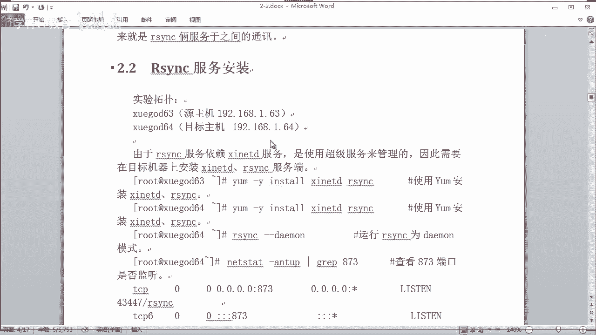

对吧。直接发送啊，那么两台都在同步进行安装了啊。嗯，那你看它是通过亚么云是吧，有阿里云的云啊。好，这边的话已经安装完了是吧，挺快的。装完之后呢，我们看到它是3。1。2的版本了，是吧？

刚才我们笔记的话看到它是3。0版本，所以呢它会不断的更新的嘛，对吧？所以我们装的是亚母园的一个最新版本啊，OK是吧？3。1。2啊OK。😊。

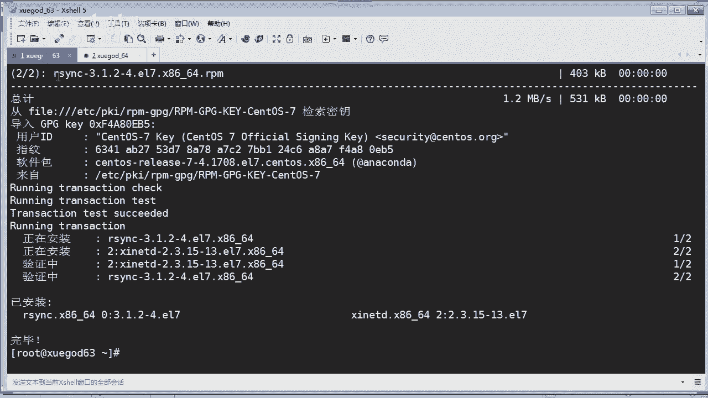

好，那装完之后的话，你就可以啊什么你可以启动它这种是什么呀？demo方式是什么？以后台的方式进行启动，对吧？那我们可以通过这种方式来启动它。那么目前你可以看一下它到底有没有这个端口是吧？那我们执行看看。

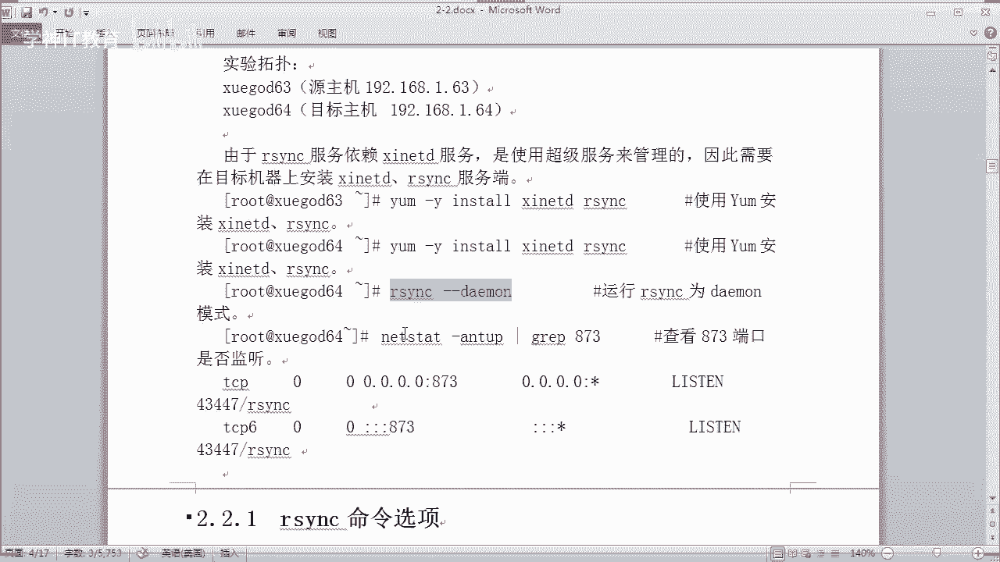

看到没有？是没有873这个端口在运行的对吧？没有873这个端口在运行啊OK。那，我们手工来进行运行一下啊，比如啊我就在64这边嗯运行它啊，比如是ISYNC啊，你你可以table的出来是吧？

你敲一个字母啊，它应该可以table出来，它有这个命令，对不对？如果你table不出来的话，说明你是没有安装成功啊，对吧？那后台运行。OK然后这个时候呢，我们再来看一下啊。

你看我们看到啊这个873端口就已经起来是吧，在监听状态了啊，监听状态OK这样你的S班C的话就已经在监听状态了O。😊，那么今天有同学啊就问到，哎，我用SYC同步的时候。问了一个什么问题啊，是哪位同学的？

他说这个端。这个SH端口改了之后呢，就手工同步不了，对吧？有没有同学今问今天问这个问题的同学在不在？在的话给我敲个一。没有来是吗？啊，我估计是。是你吗？柯子同学是吧哦。对吧。啊。其实你去做实验呢。

你才能发现问题啊，其实是不错的。其实我是想表扬一下你啊，真的你要多动手，你不动手的话，你不你不动手做实验的话，你永远不知道你无法去发现一些问题是吧？你学不到手啊，对不对？😊，一定要多多动手，多做实验啊。

OK。好。那么你看到没有？8732端口是吧？一会我们再讲一下那个啊，那SYC的话，无论是刚才这位柯子同学遇到的问题也好是吗？那我们学什么什么软件的时候呢，在人力史上呢。

它是不是有个慢手册或者是帮助文件是吧？啊，我是曼老师，欢迎你们多多的使用慢手册是吧？OK那比如你现在你这个RSYNC对吧？那如果你不知道一些参数命令的话，它到底能够干什么？就像。😊，抛出刚才那个疑问。

哎，如果要更换一个啊非默认端口的SH，那这SYC应该是怎么样调用的，对吧？我也不知道是不是我可以通过慢手册看一下。哎，有些同学说哎，你这个全部是英文，我看不懂怎么办，对吧？这么多参数。

它每个参数有什么用法？你看哗啦哗啦一大堆是吧，杠V又表示什么？杠Q表示什么？杠C表示。这么多机场你是不是看不懂啊，相信咱们班同学应该很多人看得懂，是不是很多大学生，对吧？那么看不懂的那些的话。

讲到啊这些的话，如果我们看不懂没关系是吧？老师的英文也不好，那么我应该怎么办呢？我应该是翻译，现在不是有很多翻译文件吗？包括百度翻译啊，什么什么翻译都行是吧？我拷过去看一下啊，比如这个杠Q表是什么意思。

对吧？😊，明白没有？那么这样很多东西就是我课堂上讲不到啊，那你是不是可以自己拓展呢？老师带你入门啊，修行还是要靠你自己，不可能我每一个参数给你讲一遍，没有用，讲了你也不会记住是吧？

我们把重要的常用的东西给你讲一下就好了。是吧？你看这个杠1杠一是什么，执行命令的是吧？那你翻译一下这句话是干什么用的。

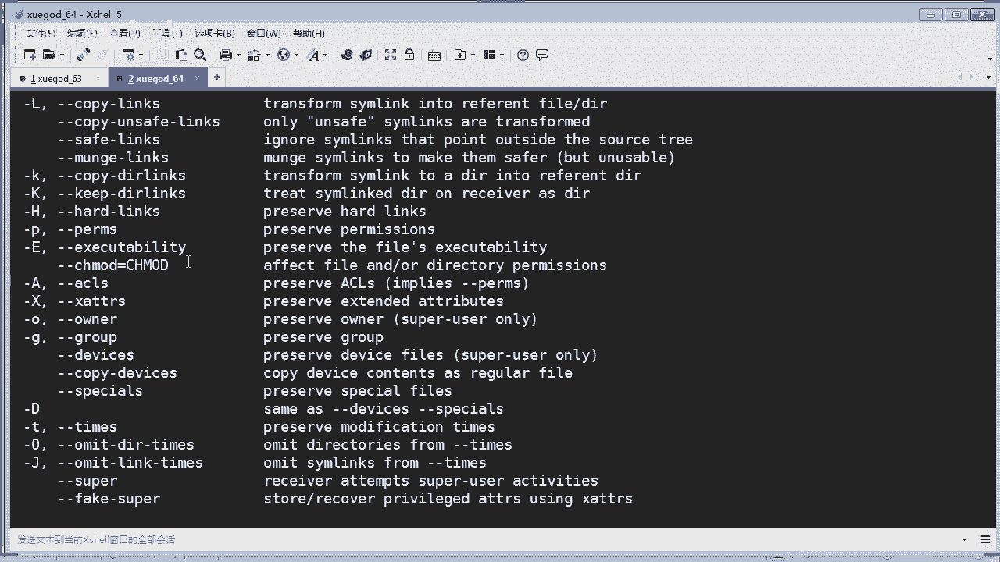

嗯，这里有个笑对吧？就使用执行一些效命令的时候呢，哎，我们可以使用杠一这个参数。对不对？😡，是吧OK。直接装到中文版了，并不是所有的这个软件或者工具都有中文版的同学啊。但是音语已经挂两次了。呃。

没关系是吧，英语挂多少次都无所谓。你我完全不担心你懂不懂英文的问题，我担心你会不会运用工具，会不会运用一些翻译工具来为你干活的事情，知道吗？真正真正你把这个东西懂得怎么样运用工具的人。

那你才是真的能言啊，并不是你你你懂不懂一。懂英语这个东西的话，并不是一朝两天的话，就可以学的很精通了，是吧？😡，要会利用工具啊，因为现在这个信息社会啊，什么东西是吧？都要。懂得利用啊。ok。好。

那我继续往下去讲啊。好，我们看到端口是吧？那么那刚才讲到啊，它有很多的这个命令选项，对吧？看到没有？这里我就不一一讲了，同学们好不好？那比如杠A是保保存什么，保存些前限啊，对不对？

把它文档的一些属性权限都一并啊同步过去，就是杠A嘛，杠R呢复制所有下面的资料递归处理嘛，对吧？杠P又是保存啊什么权限属性等等，好吧，我就不一一讲了OK。😊，啊好多的参数是不是？🤧好。

下面我们就来使用这个SYC来备份数据啊，到底是怎么做呢？你看啊呃那这里的话呃服务端是63是吧，客户端是64啊，首先我们要创建一个测试的一个一个账号，对吧？测试一个账号，两台主机段，你都要创作啊，对吧？

都要创建一个账号，那这里笔记的话啊那我我照好笔记吧，没关系啊，你看这个。他呃创建了一个叫red get一的一个账号，对吧？然后它的密码呢是1个3456，对不对？123456啊。OK来，我来执行一下这个。

两台U机型啊，你看一下我们怎么样实现一个。

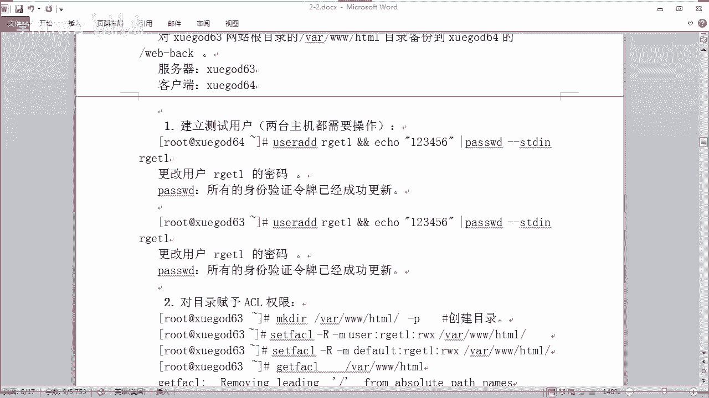

同步啊两台机执行呢，我可以在下面这个框是吧？发送窗口一并发送过去就可以了。你看啊，他就帮我们创建成功了，对吧？啊，这边的话也是已经创建成功了。OK。操作成功啊，然后我们来。对这个什么呀。

对你要同步的一个一个一个目录。然后你你现在63的话是什么呀？是你的备份源啊，有时服务端这边，那你到底要要备份什么东西？我举个例子啊，比如你这台机装了一个什么呀web服务啊，阿帕奇是吧？阿帕奇啊。

那么我要实现这个网站的这个数据呢进行同步到64去怎么办，对吧？那这里呢要对你的目录呢创建1个A1权限。AC1前线还记得吗？😡，AC1权限里面在第一阶段啊，应该讲过。如果没记错的话。

你们在第一阶段的第七章就讲过关于文件权限的。这堂课还记得吗？AC1前线。ok。那比如你看一下我这里有没有啊哦，没有这个目录是吧？那我创建一个这个目录啊make。啊，哇下这个3个W下面1个HTl，对吧？

那杠P是吧，递归创建。那么这个目录呢一般是阿帕奇默认的。一个一个什么网站跟目录。那我现在呢就要同步这个目录下的所有文件，包括目录是吧，同步到64这台机去。对不对？

那首先的话我就要对这个目录创呃赋予1个ACL权限啊，对吧？还记得SL权限吗？如果不记得，你好好复习一下第一阶段。第一阶段的话是以后阶段的基础。如果你前面的阶段不扎实，你学后面的东西的话就会很吃力啊。

同学们。是吧每个节段的话，它会递归的支撑下去的嘛。好呃，怎么样去设置一个。ACL显项赛的。是吧CAACL是不是这样啊，有。递归是吧，这样。嗯。杠MOK好，哪位同学呢给我。😊，说一下啊，复习一下啊。

杠R楼和杠N表示什么，现在敲一下，告诉我，看一下你们还记不记得好不好。user啊，然后哪个用户呢？这个are get一对吧？😡，我，因为我刚才是创建了这样的一个一个一个用户，对不对？然后前线RX。

RWX。看得懂我在做什么吧。有没有在听课？同学们。啊。我敲的是什么东西？知道吗？阿斯帝归。杠M是什么意思啊？😡，嗯，有没有回答我？啊，把东西复习一下。ok。那这样的话我就可以对这个目录是吧。

增加一个这个I get一的这个这个什么呀。😊，就是扩展了一个权限是吧？那你看一下啊，这个而且给他的是可读可写可执行的一个权限。对不对？O。好，这是第一个。那还有啊我把这个也改一下。

还有它的这个de four啊de的权限也要。对吧这个的话也是啊get一是吧这个账号我们同样是给他这个权限，对吧？然后来执行一下。O。这样就可以了是吧？我们可以通过get。😡，g是吧，ACL是吧。

然后看一下这个目录。来。我们看到啊这个目录的话，现在目前就拥有了什么权限呢？是吧？拥有了这个可读可执行是吧？对不对？OK这样的话就可以查看啊这个扩展的一个权限啊。好，那这个配置成功之后啊。

来我们创建测试数据啊，比如。你这个目录下的话，现在是什么都没有，对吧？我看一下这里有什么东西啊，比如我们自己创建个文件吧啊。比如to一个啊。啊，比如叫inice。HTM了是吧。

比如一个是一个首页默认文件是吧？indexHTM啊一个一个什么呀网页的默认啊，默认首页文件啊OK随便啊我随便写一个了啊。这里面也是没有内容，对吧？啊，就相当于创建了一个。

一一个一个文件并没有内容在里面啊。OK然后我们去到这个64啊，64的话，这边的话，我们相当于把它当做一个备份机，对吧？备份机是吧？那备份机的话啊，刚才已经创建的账号了，对不对？那么现在这边的话。

我看一下，假如这边的话也是装了一台什么，装了一个一台这个阿帕奇。你看哎，这里有喂，同学们看到没有？这里有一个inex，对吧？我现在还没同步，就已经有个东西了，但是这个并不是我刚才创建那个是吧？

所以我要把它清空掉啊。😡，对不对？我要把这个清空掉啊，来，我们看一下L看一下啊，看到没有，已经被我清空了啊，上面已经删除掉啊。那么现在它这个目录下是没有任何东西的，对不对？好，那。

然后啊我们也是干什么呢？我们改一下这个目录。再把它锁住啊。这个。are get一是吧？呃，干脆。嗯，但然你可以把阿帕奇的这个组别上上去也行啊。但我这里就。就直接写这个吧，好吧。对吧。

OK然后是递归的方式啊，比如对你这个目录啊，我这个跟笔记啊这目录不一样啊，对吧？我这个应该接近。接近生产环境对吧？一般是这样，我们做这样的一个同步，对吧？比如你发布一些网站代码到63。

它就会自动同步到学盖64去了。对不对？是吧，我们就这样子啊来。😊，来，我们授权一下。修改他目录的一个属主是吧？O。然后我们来进行推送的方式啊来啊，我们怎么样去推送呢？同学们。RYNC对吧？

杠AV isAV以表示什么意思啊？啊，你可以看看刚才我们的那个选项。每个参数表示什么意思对吧？A表示保留什么呀，前限属性呢，对吧？V表示什么呀？以塞又表示什么呀？是吧以塞压缩传输，对吧？

OK那我现在要传输什么东西呢？我现在是推送的方式啊。😊，哇下的3个W下面的什么呀HTM，我要将下面的这个这这个目录下的所有，对吧？你要推到哪里呢啊，推到对端去啊，那你用哪个账号呢？

比如我们写这个are get。一。对吧。那我推到对端192。168。2。64啊，我这里是2。0的网段，对吧？好，推到这里的下面的哪里去呢？一样啊。对吧也是推到这个目录下去。OK好，就这样啊。

然我们按回车。😊，看没有？他现在使用的是SH的协议进行传输，对吧？OK然后我们这里要输一个yes，对吧？好，输入这个什么呀密码，123456啊，这个密码是什么呀？A get一的密码。

OK我们看到这个已经推送过去的是吧？😊，是不是有一个这样同友，哎，我们来看一下，刚才我们看到这个目录刷啊是没有东西的，对不对？空的。然后我们再来看一下IOS看一下，你看到没有？😊。

这个文件就被推送过来是吧，也就是说啊你可以说是同步过来的对吧？我们是手工的方式将他同步过来。对不对？那讲到这里，今天有个同学就问到是吧，如果这个SH的默认端口不是22，你应该怎么办？

是不是那这里拓展一下啊，如果他用的不是啊，就是不是这个22的端口。你我们知道SH的端口的话是22嘛，对不对？那我们就用杠一对吧？然后呢，这个用引号杠一表示执行一些什么效的命令，对吧？比如我们执行SH啊。

然后杠P是吧？222，假如你这个端口这个SH端口的话是4条二的话啊，假如啊我是说假如对吧？那就是这样去操作就可以了。好啊。这跟SCO有什么区别？啊，你刚才没听课吗？我说的它的一些优点和特性啊。

你看一下笔记就知道了啊，有区别肯定有区别是吧？慢慢来嘛，不要急啊，是吧？这种方式啊，如果你是使用非默认的SS端口叫就加上这条这个参数去实现就可以了。好吧，那我这里就不执行了。因为我我用的不是非默认端口。

对吧？就是默认端口啊，OK行啊，你们就执行一下，可以测试一下啊。好。那啊。我们来看一下笔记啊。

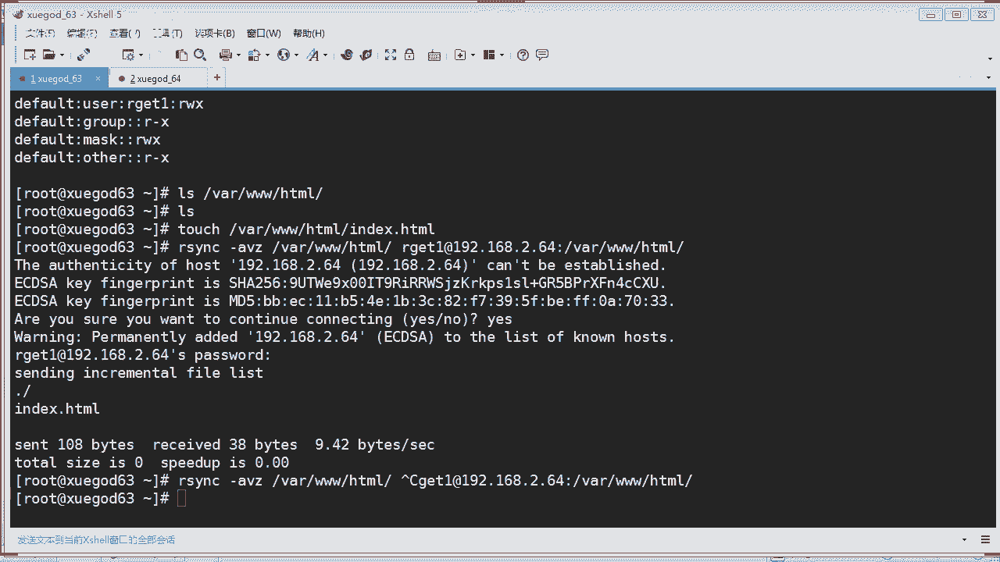

那刚才我们执行了这么多东西啊，有没有跟上的，同学们是吧？好，使用非默认SI端口怎么同步啊，刚才老师也已经讲了啊，对不对？这是拓展的内容啊呃，使用非系统用户备份数据啊，这个这里就讲到了是吧？

有的人说它跟SCP有什么不同，你看它可以使用非系统用户备份数据。明白吗？他完全不用走你的系统用户。你刚才使用的是什么are get是不是系统用户？你创业了系统里面呢，对不对？

那使用非系统用户进行备份数去又是怎么办呢？对吧？他依靠系统中这个SYNC的配置文件来实现的，就是这个配置文件啊，这个配置文件OK。进行备份数据。那么这里面呢就会存存一些什么呢？前线信息呀。

还有一些相关的设置等等。没有没有？啊，来，我们看一下怎么样使用非系统用户来备份数据，好不好啊。我们就要配置这个什么呀，这个主配置文件啊，它里面分有有些全局参数啊，模块参数啊，对吧？

全局无非就是对整个对吧？如果你的呃局部参数不生效，它就会读全局参数嘛，这个我们的懂啊。是啊，OK。这里会讲到传程参数里面有po啊，使用什么呀pod就是端口嘛，是吧？

UID就是用户的IDGID就是用户组的ID其实也很好理解啊，对吧？啊，还有什么啊，这个最大连接数是吧？就最大的一个并发数量是多少，你可以定义它对吧？默认它是零的，就是没有限制啊啊。

这个的话就是指定它的锁文件啊这个MOTD的话，就是指定它的一个消息文件啊，的话是指定什么呀？指定它的一个日志文件，对吧？如果你不想它啊将日志推到这个系统日志里面，我们可以指定它一个什么日志。

方便后期你去查询对吧？PID不用说是吧？咱们原件执行它会生成一个PID嘛。houseal的话更简单，它说明的就是允许allow就是允许说我要允许哪些IP能来连接或者拒绝哪些，对吧？对不对？啊。

还有一些模块参数啊，其实跟上面差不多啊，模块就是指定哎你要呃这个模块你要给一个描述啊，你可以通过这个参数来进行写描述啊，你不写也可以啊，怕起的话，指定该模块供备份哪个目录数啊，目录数路径啊。

就是我们肯定要指定呢，对吧？不指定他哪里知道你的备份的一个目录路径呢。wa only的话也很好理解啊，什么意思啊？只读是吧？y呢就是只允许下载no的话是可以下载，也可以上传啊，是这样的意思。

以后你们学的数据库呢，你会见到这个read only。对吧。OK还有啊这个是用来指定由啊空格隔开的多个什么多个文件或目录啊。比如你要写多个目录或多个文件的话，你可以通过这个啊。啊，还有一个是指定啊。

定义文件名啊，什么叫这个是什么呀？就是你那个模式定义的一个文件名啊，一会我们做实验啊，给你看一下，你看这些东西好像很抽象是吧，看不懂没关系。啊，来，我还是拿这个什么做实验跟你讲话，更更加的通俗易懂是吧？

你看这些东西的话，看的一头雾水都不知道是干啥用的，是不是来。老师可以把那个指定端口的写上去吗？呃，也可以啊，你说写的笔记是吧？

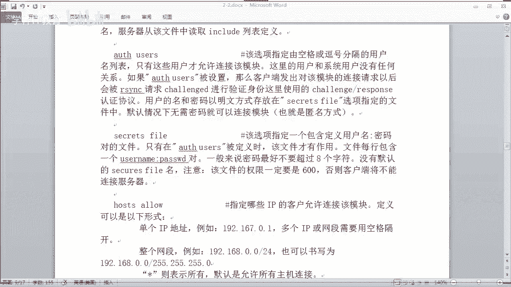

那呃咱们来啊这样子啊来写一个是吧，怎么样使用它这种什么非系统用户来实现一个同步数据呢，对不对？那首先我们还是拿这两台机的这实验是吧？63和64两台机。那么这边的话，我反过来啊，6四做服务端的啊。

64做服务端，63做一个客户端这种方式啊。首先我在64这边的话啊来编辑一个。配置文件啊SYCDcom文件对吧？那这个文件它本身就有是吧？那以前的版本它是没有的，你就要手工创建，现代版本，它有看没有？

它有一些是吧？这里呢提供了一些模板，但是呢它已经注释掉了，对吧？我们可以参照它的模板去操作都可以。当然我这里自己写有是吧？自己写有，所以呢我没有我就不用它那个了。你看啊，我这里应该写的什么东西呢？

我写在这里再跟你解析的话就会更好，来看看啊，那睁大眼睛看同学们，我在这里跟你们解啊讲解的会会更好啊。首先从这一这一行开始是吧，UID还是要理解是吧？你使用的是哪个UID啊，就是哪个运行里，哪个用户嘛。

对吧？root啊root。😊，啊，就是注意啊，这个是运运行进程的身份啊，不是同步的身份哦，是运行这你这个什么呀，运行你这个这个叫啊SYC对吧？啊，GID是吧，组的一个。A的话就是地址叫监听IP啊。

监听IP那你要监听哪个IP地址呢？在本机上呢，同学们，那一般的话我就是写本机地址就可以了。像这里的话，我是什么，2。64，我让他监听2。64就行了，对不对？好，端口是873，你看没有？没错啊，是吧？

这本身它的端口就是莫言873啊，下面这个house alone的话就是允许你要允许哪个IP地址或者是哪个IP网段能够访问，这里就是相当于网络的一个网段限制了，对吧？比如我要允许这个192。168。1。

0啊，杠24，就是这个言码，这个网段对吧？这个网段能够访问，我应该就这样写。或者你直接写1个IP。对吧或者是用这种方式来写，也是可以。对吧我这种简写也是可以。看懂了吧？好，往下去看啊。

y这个CH rootot是等于yes表示什么意思呢？这里表示的是什么？你看一下啊，后面有讲是吧，这里表示的是是否酬劳这个什么酬劳是吧？就是锁定锁定加目录，这有什么用处呢？一然锁定加目录之后呢。

sY继使被黑之后是吧？黑客也无法在这个SYZ运行的加目录之外创建文件，对吧？所以我们把它设置为yes的话，这样是有安全的一个作用，明白没有？OK好，那是吧？然后这个mas链接就是最大链接数是5啊。

就是在最大链接数啊，这个是并发的数量啊，就最大只能有5个5个连接，对吧？5个链接PID不用说吧，是吧？PID你进程启动之后，它就会生成PID啊，还有这个lock file对吧？啊，还有什么呀。日志啊。

就是我们指定它放到哪里去啊，然后客户端登录之后弹出的消息啊，这啥意思呢？就是一些提示信息，比如一些温馨提示是吧？啊，比如你一登录这个什么呀，登录，你要连接这个SYC呢，它就提示你哎，你好啊。

欢迎你干嘛干嘛，你会以写到这个文件里面去。写这个东西的话，你你不写也行了是吧，那你要写也可以是吧？OK那你就可以写一些啊提示信息呀，把它写到这个文件里面就就行了啊。一会我们可以创建这个文件。

并写一些东西啊，是不是好，往下去看呢，就是这个就是模块，对吧？对不对？模块啊这个模块呢就是共享模块名称，就说我要进行什么啊，共享应该叫同步模块名称嘛，也可以这样去理解啊。

就说你等一下要调用这个模块进行执行是吧？明白有。那这个模块下呢，我们要进行同步的这个路径。你看这里这个路径的话就不对了，是吧？我们要同步到同步的路径是这个同步了哪里啊，这个下面才对。是吧。对不对？

我们要同步到下的3个WHT，对吧？应该是这个路径，没错吧。是吧。OK然后我们这边啊下面的话也是描述啊这描述这个描述呢跟这个上面的描述的意思是一样的，对吧？

只不过这个描述呢是相对于这个模块下面的一个描述啊，readally only这个 first的话是设置什么呀？设置服务文件的读写权限啊。因为我们这个没开启，这个表示不开启嘛。如果你要开启的话，就是te。

对吧？错的话就表示开启，那就只能只读的。只读就没有达到我们的目标，我们要他可写文件过来了，不可写，那怎么得了，是吧？😡，类似就是要列出他的这个列表清单是吧，是否允许查看模块信息。一般我们使用yes是吧？

这个usus的话是说你使用哪个备份用户啊，这里重要了，这里呢就是非系统用户。也就是说这个S oneus这个用户啊，并没有在你的临时系统创建的对吧？并没有创建这个用户。它相当于一个虚拟的用户。好。

我们写在这里用它来认证什么，认证你的这个SYC。啊，备份的用户和系统用户没有关系啊。没有关系，同学们。O。好，后面的话就是密码文件。既然你有一个什么认证的备份的用户，那么我要给这个用户创这个密码。

这密码你放到哪里呢？写一个文件啊，写到这里。对吧一会我们要去创建他。那就这么多很好理解是吧？其实RSYZ的话呃很好理解啊。😊，这种是通过非系统用户来进行一个备份，我们在配置文件写好它，对吧？当然了。

这里这些东西我讲完之后呢，跟你讲一个非常重要的东西，要不然很多同学照抄我的笔记下呢，发现报错一直报错。

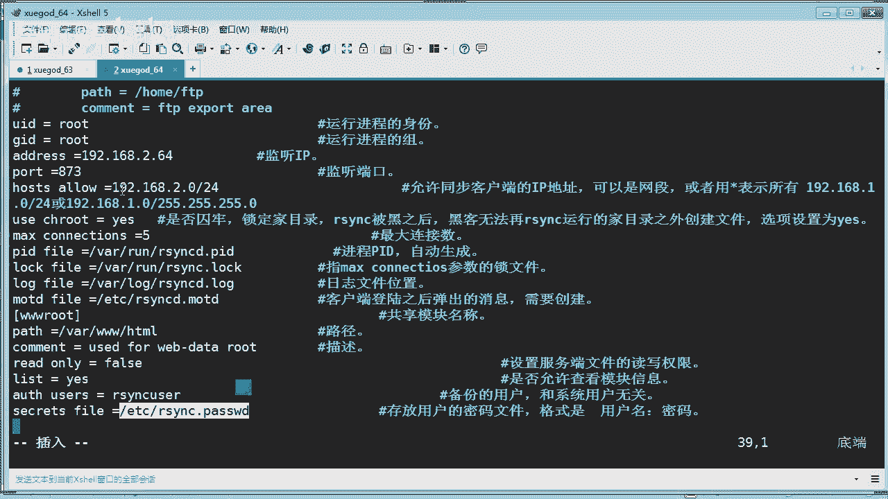

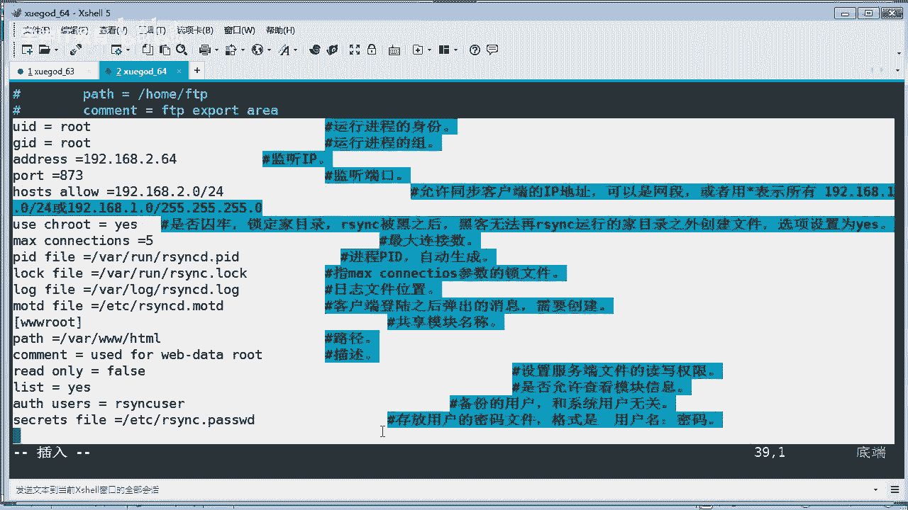

啊，连接不了，为什么呢？因为我他对这个中文注释不够友好，对这个注注释啊就是注解。明白没有？所以呢你应该把这些删掉啊，这些注解全部把它给删掉，不然你报错了啊，到时候哎怎么回事啊，这里有讲到啊。

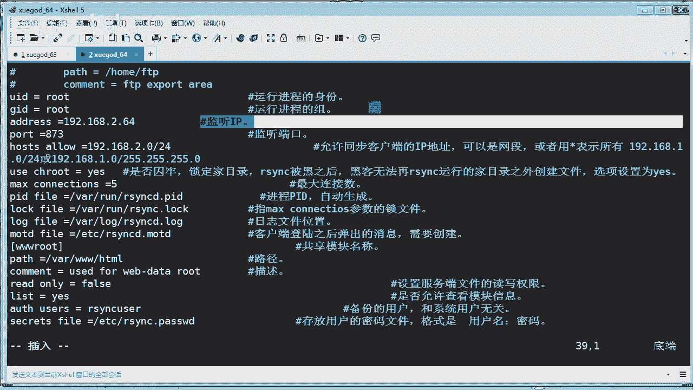

注意会出现因注释不兼容的问题，而导致推数据的时候呢，出现报错，配置文件取消注释或者注释进行换行处理啊，我建议你把它删掉好，注意我这句话，我的标成红色了，就是要警告你们。明白没有？警告里面啊。OK好。

那我这里的话我就这样子啊，我把这个中文注释这些东西的话全部给。

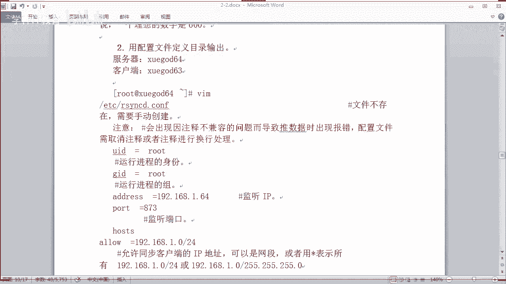

删掉。来，我先把它退出，然后呢，不保存，对吧？强制退出，然后再进来他是不是没有保存东西啊？对吧没有保存一好东西。OK然后再拷过来。那。是吧我再考一份，我我已经把这个什么中文注解全部剔除掉了。

是吧这里的话是比较干净的，不含注接的一份配置文件。ok。没问题吧。好嘞，行那。然后我们刚才说了，我们等一下要创建两个文件，一个是什么呀？做描述的。一个是对这个用户创建密码的对吧？好，保存并退出。啊。

这个时候的话我们就要来啊创建两个东西是吧？首先我们啊创建一个叫个叫。一些什么欢迎信息的对吧？来，我们拷贝一下这个目录，你随便写一些东西，比如我们是用 echo的方式吧。😊，那叫。啊。

我就交比这些relcome。Welcome to Ba。Several。对吧这样继续啊。然后写到哪里呢？写到你的这个这个这个路径啊这个目录。对吧你可以看一下是不是写成功了。OK我们就写了一句话而已。

对吧？好，还有一个是创建这个SYCus侧这个用户的密码。这个密码的话应该是怎么写呢？在哪里呢？目录是哪个呢？是这个对吧？我们照抄啊RS。ISYNC点什么？哎，不是啊，这个没有点是SYNC。

然后pass密码的意思，对吧？WDpasWD对吧？OK这里怎么写？😡，格式呢就是用户名。冒号密码这样写。SYNCus冒号密码是。怕。Pass what。123。是吧。啊，我就这样写啊，前面的是用户名。

后面就是一个密码，这个密码就叫password123。看懂吧？好，保存并退出啊，记得保存啦。好嘞。那这个密码文件呢，它有一个特性呢，你要给他一个权限叫600权限是吧，600。好，我们对这个密码文件啊。

授权授权为600权限啊，要不然它啊就会验证失败的啊。好嘞，那这个时候呢我们就可以开始来启动服务了。同学们来那启动服务啊。star一下，我们知道他使用这个sin地列啊这个。

这个东西是吧我们就把它哎应该是ETD，对吧？启动一下。干脆这个东西呢设置为开机系动嘛，它是用来管理一些服务的。比如像挑类啊等等这些东西是吧？好，那最后的话我们就来启动这个S one sale。

我们刚才启用S oneC是怎么启动的？使用。后台的方式是吧，demo。啊，DAEMON。是吧。这样去后台移动。那然后呢我指定啊指定什么呀，指定你c文件，就是指定我的配置文件来执行。

比如啊这个c文件在哪里啊？ETC下面的RSYNCD点com，对不对？这个就刚才我们编辑的是吧？好辛苦写的一个配置文件。就说指定他去读这个配置文件来启动SYC。O。来我们来启动看看啊。启动完成之后的话。

我们来看一看它有没有端口呢。873端口有没有看到在这里。在监听状态OK是吧？没有问题，可以监听的啊。好嘞，那我们现在就话就可以开始测试了，对吧？开始测试。比如我们要同步。哎。

我们知道刚才我们做了第一次实验的时候呢。这个这个这个什么呀，哇下的3个W下面有1个HTL是不是有这个文件，现在已经同步过来，两边是一模一样了，对吧？我们来看一下啊。呃，瓦夏的一个。那一模一样的啊。

我现在63，我现在63啊，63就相当于客户端，对吧？我们来测试一下。😡，还是拿刚才那个语句哈。SYZ啊，然后比如我要进行推送这个东西过来，但是这里呢就换一下了，因为我们不不再使用这个阿盖E账号了。

对吧因为我们使用的是非系统用户啊，对不对？非系统用户叫IS。YNC什么东西啊，user对吧？这个用户完全在你系统是没有被创建的，对不对？只是把它配到我们的这个配置文件而已。对吧。那这后面的话。

你就不用去写这些什么目录了，他可以直接什么。直接调用你的模块，哪个模块啊？有一个模块名称叫WW啊root。还记得吗？我给你看一下，我刚才写的这个文件。那他模块名称就是这个。看没有。就是这个。

所以他直接可以调用啊。OK好，那我们来按回车，你看它提示什么东西。😊，看见没有？它是不是有个提示信息叫welcome to break server是吧，说明什么呀？你的你的刚才写的那个描述的信息呢。

它能够调用出来了，这是你自己定义的啊，然后输入密码，哎，密码是多少，还记得吗？😡，密码是pass123，对吧？这个。那我们来输一下。PASSWORD123那你输密码的过程呢，它是不会有什么呀？

它不会显示在这个这个交互界面的啊。输完之后呢啊你看发送什么增量文件，对吧？同步了吧，没有报错，对吧？哎，老师，你说哎，我这个东西好像没同步啊，是吧，你发现他。😡，是不是没有同步，没有什么。

因为挖压根这里就是这么多东西啊。那我现在的话再写一些东西进去好不好？你看下这里有没有东西。😡，嗯，再挨口一个买再套一个吧。我也晓得3个W。写个ABC吧，好不好？ABC点什么TST文档。ok。这个时候呢。

你会发现这边的话已经多了一个这个东西了，是吧？然后这边的话并没有，是不是？那我们来再同步一次啊。书明吗？PASS啊WORD123。看到没有？是不是同步一个东西进去了，我们来看一下啊，这边。看到没有？

已经多了一个文件被同步过来了啊，OK成功吗？没有问题是吧？好。这个就没问题了。那这边的话还可以这样去写啊，就你不要你不想输这个密码，觉得太麻烦了。你可以在这里创那个密码文件也是可以的。

那么道理是一样的啊，那我可以在客户端这边也是编辑一个S one password的这个东西是吧？要把这个密码写到这里来。那。叫什么来着？Pass what。123对吧？我把密码写到文件里面去。

这样也是可以的不。那记得给他授权。对吧。然后呢，我再来执行这个东西啊，这个时候呢我不想写密码了啊，对吧？不想敲密码，你可以怎么样在后面杠杠。pass what哎，打错了啊。pas WORD。嗯。

然后什么呀，菲。哈有些同学还不如输密码方便。哈，对吧？简言正智了对吧？这个东西啊嗯这个passport这样我就不用敲密码了，对吧？是不是呢？来我们敲回车看一下，你看。😊，就不用了吧，它就自动啊。

这样就会给我们啊，你敲完之后按回去，他就帮我们去同步数据了啊，这个是一个速率，对吧？O。看懂了吗？那这样的话就可以OK。是吧那我这里再问你们啊，我用这种非系统用户来同步数据啊。

有没有经过SH如果我改了SH的默认端口会不会受影响？来，我问你们。

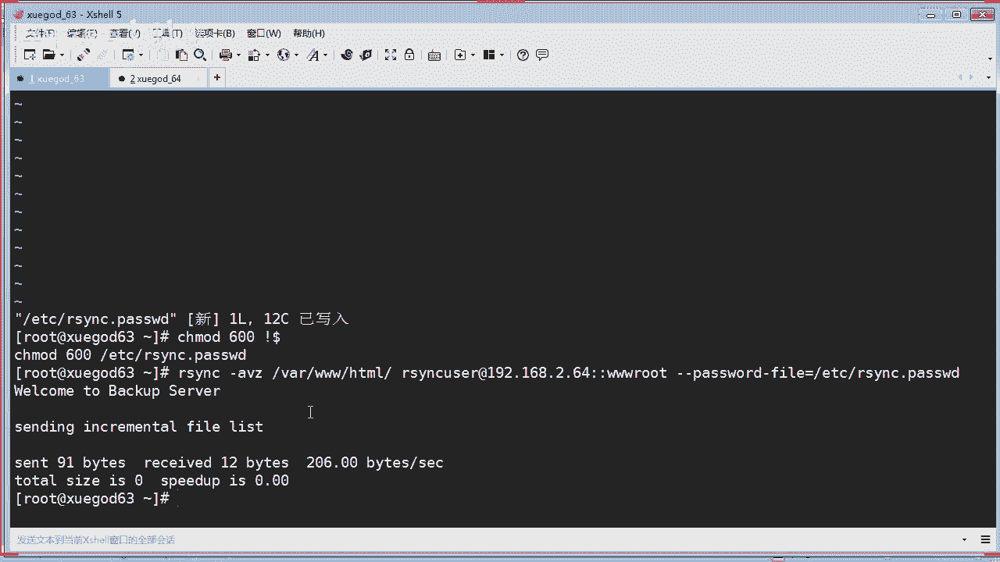

回答我。啊，互动一下啊。用刚才我这种非系统的模式去同步数据。如果服务端改了SH的端口为4条2，那么此时同步会受影响吗？有同学说不会。有些人说说会啊。有同学说有影响。啊。来回答一下回答一下，我等一下再。

再告诉你会还是不会。没好了，没有人回答是吧？那总共有三个同学，一个会，一个不会，一个有影响。S远程登录。嗯，好，那我先公布啊，通过我这种非系统用户进行同步的模式的话，如果你的服务端SH端口改了。啊。

无论你改什么端口啊，跟我都没有关系。知道没有？没有关系，因为我都不使用系统用户，何来走你的SH呢？所以呢它不受影响，知道没有？同学们。😡，你不信你去把你的服务端端口改掉啊，改成非22的端口。

你再来使用老师这种方式去同步，你看他受影响吗？不受影响。对吧当你通过SH的协议去去进行一个认证的时候，连接的时候呢，它才会受影响。明没有。有人人说这是什么协议？

他通过的就是SVC的一个一个协议来进行同步的，他都他都不走你的SH验证。啊，对你使用系统用户的话，走SH连接它就会受影响。好吧，这也是一个拓展啊。嗯，告诉你们啊。是吧。那你们以后做，比如在生产环境去做。

你是不是有有点想法了，我应该使用什么方式去捅步啊，对吧？O。那好啊，那我们学了这种方式之后呢，你是不是可以写一个脚本来实现定时的一个同步？董西吧。啊。我怎么样写一个定时啊的自动备份加本？

我是不是可以利用上面这个非系统用户的这个模式来实现，对吧？你看我这里写嗯我来我来啊这样。

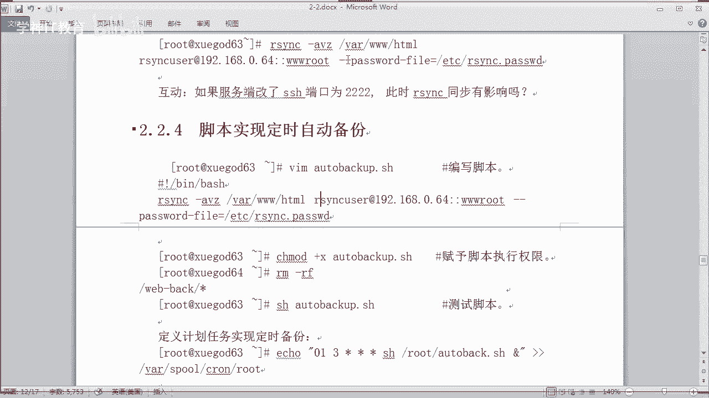

来，假如我们就写一个这样的吧。在OPT下面写吧。OPT下面写一个什么呢？alto back。好吧好。被卡的SH。对吧写一个笑脚本。OK啊，这个非常简单的一条命令是吧？好，我继续使用这个来进行同步。😊。

不就可以了吗？哦，这里有个空格，同学们要注意，同学们，如果你要照抄我的笔记，要copy复制粘贴的时候呢，一定要注意会带一些空格或者特殊符号。你要记得把它删掉或者修正啊。啊，这个问题的话。

其实在很多班级都。都发生了，所以我我我要这里警告你们啊。一定要如果你是去copy笔记的时候呢，他肯定会带一些特殊符号，空格什么东西，你要注意啊，不是笔记有有坑。

还是你们要注意这个问题啊那然后执行这条命令的话，它是不是就自动帮我们同步了？对吧。这个是一个非常简单的一个一个脚本是吧？当然你前期你要做好什么呀，你肯定是要做好那个配置文件。

要不然他怎么去调用这个账号呢，怎么样去调用这个密码呢？对不对？怎么样去调用这个模块呢？所以前期前期工作的话都要准备的对吧？所以前期工作准备好了，你才能使用这里一条命令就搞定了是吧？然要保存并退出。

虽然你看这里好像是已经完成了，对吧？其实你还是要。对他给他一个可执行权限，然后呢，你再写一个什么呀？写个定时备份的什么呀？一个计划怎么样写定时计划，你们在第一阶段应该学过了吧。啊，怎么写？

C这个table杠一对吧？好，在这里的话我们就可以写。比如你想它什么时候啊，我随便写一个啊，比如。OK老师写的这个是表示什么？表示什么？看得懂吗？什么时间？回答我。每天三年OK。对嘛。

你们学的东西之后呢，不要说我写完之后呢，也不知道什么东西跟。更更不要求你们写出来了，要知道他是怎么回事是吧，怎么写才把东西学到手啊。OK然后呢执行什么命令。😊。

执行这个OPD下面有一个什么or back carSH。是吧。好。哎，我加一个这个是表示什么意思？回答我。O。好，我这样去写的话。嗯，王立叶同学回答对了，后台啊。是吧我这样去写，然要保存退出。

那么我们就可以看到A是吧，杠L，你看一下是吧？那你这个计划任务就已经写好了，对不对？那么这样的话它就会定时是吧？每天三点的话，他就会干什么呀？帮我们执行我们的这个脚本。那这样的话就会定时去去同步了。

那在生产环境呢可能更频繁。那我现在要求。美格。每隔10秒钟同步一次，怎么写？来敲给我看一下，每隔10秒钟同步一次。快一点。调出来。我看你们有没有在听课啊。每隔10秒钟。

OK注意到同学说加个sleep10秒啊。OK对你可以加一个sep，10秒钟就会进行一个一个什么呀？嗯。可以哈。如果你不知道你你再看一下之前学的知识啊，或者之前百度吧，好不好？来，我们继续往下继讲。

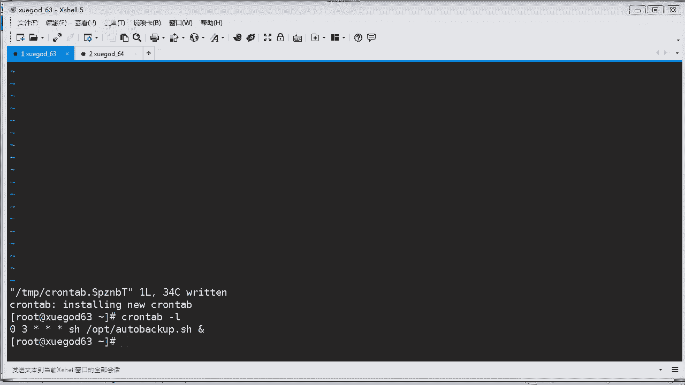

呃，那定时的一个这种备份的话，我们已经实现了，对吧？OK那么我们先课间休息10分钟，接着老师再跟你讲是吧，实现实时同步的另外一种方法呢，是吧？

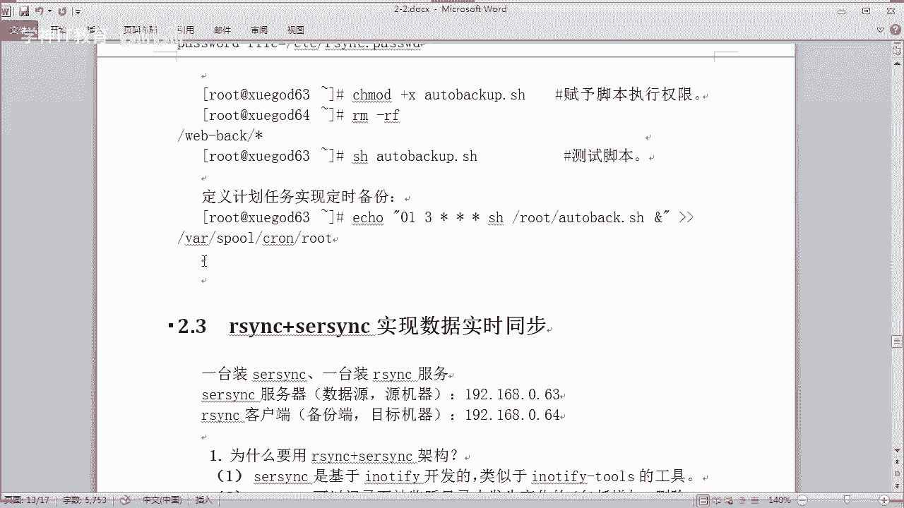