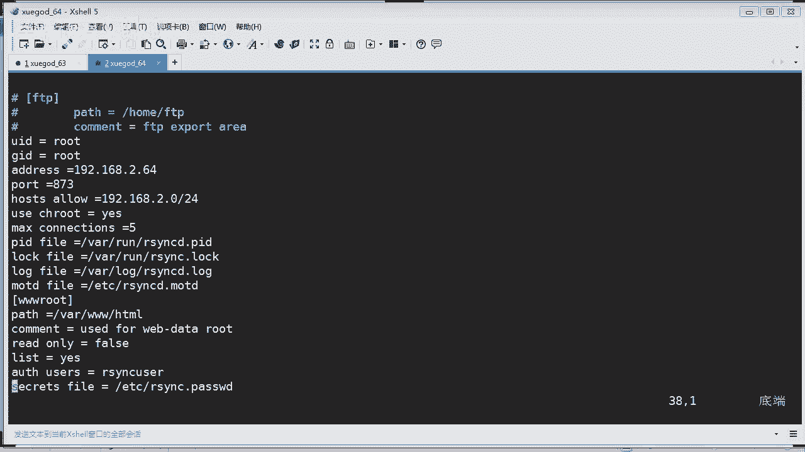

# Linux／Linux运维／RHCE／红帽认证／云计算／Linux资料／Linux教程--rsync配置与实时同步02 - P1：rsync配置与实时同步02 - 学神科技 - BV1UV41167Lx

刚才有同学提什么问题？总是提示模块问题，什么意思啊？

嗨啊，你刚才有没有听我的课，有没有认真听我的课啊，这个问题呢呃虽然你就演示出来了，就是因为为什么呀？😊，你的配置文件啊，你不能有中文的注释啊，你要把那些中文的注释啊，还有那些空格删掉，知道没有？

你像老师那样写什么呀，写啊，没有任何的中文的，我给你看一下我的配置文件。

Iyes， Y and C。Dcom。还有没有？是吧很干净的啊。你自己敲的。你自己抄的应该可以啊。

我看一下你查的东西啊。嗯。你可以啊是吧？然后你这个密码创建了没有？你看你创建的密码哎，跟我的就不一样。你这个密码呢，这里啊同学，你这里的密码是啊SYNCD啊，你这里有个D啊，点password啊。

创建了啊你创建的这个这个路径是不是一致的，名称是不是一样的，这个文件名，你看我的我的是C啊，没有D啊。

你要你要你要对上啊。你肯定要跟你的对得上就行了。好不好。对上之后呢，你。如果你之前有启动进程，你先把你的进程K掉啊，重新再启动它是吧，它就会重新读取你这个配置文件，这样就可以了。

这个是名称，啥意思？这个是创建这个密码的呀，你等一下，他要从你这里读取密码，你创建密码。如果你你这个。

创业的不一样，那他怎么去读取呢？对吧？密码不一样，他不一样去会报错吗？同学。是吧看清楚啊。差一字，那就差千里是吧？

OK行。😊，好，那咱们来继续讲啊。刚才的话讲了这个使用非系统用户来进行是吧？同步了，现在接着下来我们讲一讲啊。

结合啊SYC跟这个SESYC实现什么呀？实现这个数据实时同步啊实时同步啊。呃，实时你看一看啊，他怎么样去实现啊。啊，一台呢装这个工具是吧，另外一台呢装SYC啊，其实这个两个东西呢。啊。

其实这个就是相当于什么加长版的1个SVC对吧？他增加了一些什么监控的一个一个功能啊。那首先这边的这个服务端的话啊，对吧？也就是数据源啊，我们定义啊就在63里面做。然后SYC客户端的话，在64里面去做啊。

为什么要使用这种架构是吧？这里会讲到啊。因为这个SUYSESYZ啊，它是基于什么呀？这个ify这个ify开发的啊，类似于这个工具啊这个工具啊实现什么呀？这个工具你们学过吗？对吧。然后它可以记录什么呢？

记录啊被监控目录中发生的一些变化啊，包括增加删除修改具体某一个文件或者是某一个目录文名字啊，然后使用什么呀，又触就会触发这个SYC来同步啊，只同步什么呢？只同步发生变化的文件或者目录啊。

也就说这个东西呢它就是一个监控的东西是吧？它就一直监视着你哎，看谁有变化，哎，谁生病了，哎，马上他就会通知。谁谁谁啊，你要去看病了是吧，反正发生有任何的东西，他都会记录下来。是吧。OK。

那么以前的话为什么使用这个是吧？现在的话都不再用这个了，都使用这个了。你看一下啊啊，因为这个这个什么inified的话，它只能记录被监控发生变化的这个增删改。

并没有把具体哪个文件或者是哪个目录发发生的一个变化记录下来。OK是吧少记少监控一些东西不一样。那么SYC在同步的时候呢，并不知道具体是哪一个文件或者目录发生变化。每次对整个目录进行同步。

那这样就太慢了是吧？整个目录整个目录都是完整同步的话，那太慢了，效率也低啊，那么现在呢就有这种啊这种架构是吧？这种架构实现啊，来实现了。因为这个工具它可以实时监控着你所有的增删改啊。

包括某个文件名字被改动了，它都会干什么呀，它都会进行监控的。就你这个文件里面增加了一些内容写了一些几行代码进去啊，它也会监控是吧？只要你有变化，哎，它马上就开什么呀，马上就触发这个SYC进行一个什么呀。

进行一个同步数据啊，就是这样的一个意思啊，能又实现了一些什么呀实现的实时同步。😊，OK那么同步的过程的话，啊，就其实刚才我讲那个就是同步的过程，对吧？我就不再读这个东西了。我刚才说的那些就是同步过程。

同步过程和原理啊一样的啊，懂没有？也是也是说那个意思啊，是吧，就有啰嗦了，说了对吧？一样的，反正是监控完之后发生了变化，哎，他就马上触发。这里一个原理就说了有两个，它有一个是推，有一个是拉，懂吧？啊。

推和拉刚才我们也讲过了是吧，到底是要推和拉的方式呢，对不对？OK你看这里啊看这个图啊啊这个进程啊，就是这个进程了嘛。SSESYC它就会监控着所有文件的目录是吧？一旦你发生了有任何的变化。

它就触发这个什么呀，触发这个SYC进行什么呢？进行同步，把你的数据是吧？把它推到啊，把它推到或者是拉到推到这个目标目标机器上去，对吧？这个备份服务器上去，就这样的意思啊，O很简单的一个示例图啊。

那么讲这个SEY呃这个SESYC呢这个东西呢你肯定要去下载安装，对吧？那么在谷歌上的话啊，谷歌上去可以去下载到啊，对吧？你可以通过使用dou get下载下载工具啊，在这里那老师可以把这个这个发给你们。

你们去下载一下啊。这个的话你要知道啊如果你不翻墙的话，我不知道你能不能下载成功啊，有哪位同学翻墙的。啊，有没有这个国外V片呢？我不知道能不能下载成功啊。如果。😊，下载失败啊。老师这边有一份啊。

如果你能下载成功啊，那okK是吧？如果下载不成功，我自己传一份给你们吧。所以说经常我要把这些东西做一个备份啊，不然的话有时候你翻不了墙。😊，但是我这里给你们个建议啊，你要学学好lin历史。

我建议你们搞一个翻墙工具是吧？可以去搞一个像蓝灯，你们知道吧？或者是哎反正网上有很多这种能够实现翻墙的工具啊。对不对？因为你要找很多的一些啊RBM包啊或者是一些东西啊，你要你都要得去。到国外的网站去搞。

是不是？呃，网络波动啊OK。来。那我把这个传到咱们的这个群共享里面啊，稍等。啊，正在上传。好，那我已经上传到群共享啊，你们可以到这个1812班的群共享去下载这个什么呀这个SESYNZ的这个包啊。

我已经上传上去了啊。😊，当然你也可以通过这个这个链接啊去下载。都是可以的啊。好吗？O。好，那我传上去啊。

嗯。啊，我传到哪里去呢？啊，我就我刚才说了啊，这边的话我应该怎么做呢？我这边就反过来吧，把这个63作为又反过来是吧，把六三做服务端是吧？😊，就是原数据嘛是吧，然后64的话，这客户端啊。

CD到的OPT下面啊，这里是唉刚才我们写了一个叫什么自动备份的一个一个脚本是吧？没关系啊，然后我把那个传上来。好。为啥百度很少能搜到关于SYC的介绍用法，这很正常。不但只是SYC啊。

还有很多你要学的一些工具啊，软件啊，你用百度可能。呃，收到出来东西都比较少，或者是比有时候你要解决一些问题啊，特别是做开发的，咱们班有没有做开发的，很多一些开发代码遇到问题呢，你用百度都解决不了。

但是你用谷歌就能够找到方法，知道为什么吗？因为在我们国内很多的东西又被过滤掉，而且有些问题你根本就没有遇到过。那很多代码的一个一个研发啊，都在国外到没有？那么那边的话，很多事情的话都会事先发生。

那么外面的问题，外面的一些解决方案就会更多。明白没有？所以说为什么我建议你们如果有。真的是建议你们搞个翻墙工具啊。能够学到很多东西啊。啊，好，我把这个已经嗯上传啊，对吧？这个是一个。一个原码宝是吧？好。

那首先我咱们要干什么呀？解压是吧？😊，啊用什么解压TAR是吧？然后呢，用这个解压是吧？如果你要看它解压的过程，你就加一个V，对吧？不用看解压过程就不用加，对吧？然后这个S压啊，解压到哪里呢。

我就解要当前路径就可以了啊，对吧？好，讲完成之后呢，我会你会看到啊这里多了一个目录啊，叫GNUlin叉86，对吧？然后我们。重命名一下他啊。把这个目录重命名为 S SYNC。好吧。那在I看一下。看到吧。

被我们重命名了啊这个目录啊。然后啊然后呢我们来开始来配置它了啊。首先我们的话先进到这个S1。SEYC里面去啊，来，我清一下屏，对吧？进到这里面去啊，你看到这里面啊有一个配置文件。😊。

还有一个执行的一个脚本是吧？那这个两个东西呢就是非常重要的啊。首先你要配置一下它。配置啊这个com文件啊，这个com文件啊，打开它啊，编辑它。来，我们先显示一下行号。是吧你跟着老师的步骤啊。

我们怎么样去配置他呢啊？有同学说你笔记做了一个备份配置啊，可以啊，你可以先把你的这个这个配置文件做一个备份，以防下次你写错了，你可以恢复嘛，对吧？这是一个好习惯啊，好习惯。所以笔记里面有这个动作啊。

包括以后你们编辑其他配置文件，比如重要配置件，你都可以先备份再再操作是吧？啊，这样安全。好，你看一下到这个第二4行对吧，这里。第二支上啊，我把它放上去一点嘛啊，让你们好看一点。好，在二支长这里啊。

然后这里的话是什么呀？lock就是什么本地路径是吧，就是一个路径啊。那么这里呢你要指定什么东西呢？你要指定你本地同步的一个数据目录啊，就是要指定目录。哎，你要同步什么目录啊？

我们当然它这里是一个模板人嘛，对吧？他随便写了一个目录，我们当然不是这个目录。我们同步的是一个我们这个阿帕奇网站的一个K目录，对吧？HTL。是不是这个？没错啊。我需要同步这个目录，对不对？

OK那远程主机的IP是多少呢？不可能是回环口的地址是吧？远程IP的话，那肯定是192。168点，就是目标机器是吧？2。64，我要同步到目标机器，是2。64这台机器是吧？然后呢。

这个呢同步一表示什么意思啊？模块对吧？我们刚才有一个这样的模块是吧，有个什么模块，还记得吗？😡，WW root。是不是？😡，我们刚才不是写了一个配置文件，有一个这样的模块吗？你要你要对应的上，对吧？

你不能乱写，它这里的话默认叫同步模块是吧？我们没有这个同步模块。😡，所以我们有一个叫W rootot的一个模块，你要写正确啊，这里是用引号引起的IP也要写正确啊。O。好嘞，那往下去看啊，往下去看啊。

你这里啊第三1行啊，第三1行同学们看。第31行这里我们要改什么东西呢？那这里是star force。什么意思？那开启是吧，你否实话就是不开启了那我我要怎么写？😡，我就要写成处。啊，明白没有？

这里就是要你要开启验证的意思。如果forse的话，就不是开启验证了。😡，处的话就是开启验证了，对吧？那。把它改成处哈，要usersus是什么意思啊？就是你要进行认证的一个用户啊，你用root用了吗？

当然不是。😊，还记得我们刚才写的配置文件吗？那个验证用户是叫RSYNC什么呀user。是不是这个？没错啊，然后pass field就是你的密码文件是哪个，你看。他密码文件这里就跟我们的就不对应了，对吧？

我们要改一改，它应该叫。什么呀？Pass。WD啊，我记得是这个。应该没说啊，一会我我出去之后呢，我再L看一下这个这个这个路径是不是正确的。是吧要保证他一定要是正确的，你可以copy一下嘛，对吧？O。啊。

他读密码要到这个文件去读。是不是啊？好，那其他的话这些。你就不用关了，对吧？ok。好。然后我们。什么呀。保存并退出啊，这样的话来。保存没的说啊，那这个时候的话，我再来L看一下我是不是有这个目录。哎。

对的，是吧，我们的这个密码就是写在这里面去啊，然后的话我看一下啊。你看没有？这台机上的话，我并没有873的端口运行。也就是说我的ISYC是没有这这台机运行的。是不是啊？没有吧，应该没有873，对不对？

874也没有，对吧？OK那我现在的话我就要开启了啊，我怎么样开启这个SESYNC的守护进程同步数据呢？来。啊，我用绝对路径吧啊，应该是绝对路径，其实就是当前路径，对吧？看没有？我使用解奏U径的话。

应该是这样敲OPT下面的什么呀？SESESYZ。这个下面有1个S1SYZ2这个脚本对吧？要执行杠D。干啊。1杠O对吧？然后写上你的配置文件啊，这个配置文件就是这个嘛。好吧，唉，写的完整一点。

也写绝对路径吧，好不好？😊，不要写相对路径，对不对？怕你等一下搞错了啊。那。😡，这样的话就是通过这个脚本来是吧，执行这个配置文件，让他来是吧开启这个守护进程。OK来，我们先执行。好，你看没有？

他这个时候呢，好像是已经呃启动完成了，是吧？ok。他说watch pass is这个是吧，看来有没有干什么呀，有就是在进行进行一个什么监测，对吧？如果有变动的话，他就会进行同步。对不对？

是不是这样的意思啊，他要进行这个啊。那么这个时候呢，我们看一下啊，这个看一下8诶，也没有什么端口，对吧？但是你这样你看不出来，我这样看啊。嗯，叫什么呀？S1。S， Y and C。哎。

你看到是不是有这样的一个进程在运行呢？对不对？有这样的一个进程在运行。好嘞，那么我们为了来做测试啊，我们看一下是不是会实时同步呢。会不会实施同步呢？那你就要看了啊，怎么样去看呢？咱们来来测试一下啊。

你首先的话，我在这个目标机器。目标机器进到这个挖下的。3个W。这个什么。HL，我们知道这里的话，刚才已经被我们同步了两个文件过来啊，睁大眼睛看。啊，我清一下清一下屏给你看啊，有两个文件在这里是吧？

那我现在要实时监控这个文件，这个目录怎么样监控啊？watch对吧。然后呢。啊，S。港L。OK他就实时监控这个目录啊，现在有两个文件，对吧？这是第一个这是第二个好。😊，啊，我把这个。排列一下。比有。

水平排列吧啊，下面的是64啊，下面是64这主机，上面的话是63来我们来看一下，看它是不是实时同步啊。我们在63这个主服器这边话进行一个增三改，对吧？增三改。然后呢，我们看一下会不会同步过去呢。来。

我们先进到这个哇下的3个W下面的HLL啊，它也是只有两个文件啊。那么这个时候呢我先来试一下删除啊。删除什么呢？删除ABC。你看下面这个窗口，你看是不是有一个被删掉了。看到没有？我删除了一个。

下面它也会自动啊，马上就删掉，是不是实时同步，它同步并不是说数据的一个增加哎哎，包包括删除它也会同步，对吧？那我在这里呢再创建一个。啊，toch一个什么呀？toch1个呃AAA点TST啊。

或者是HTM的文件。你看一下啊，它会不会同步过去呢？那是不是他也会同步过去的？看清楚啊，我上下两个窗口哈，两台机。没问题吧。那如果。我要改。我把这个A改成什么呀？改成BB。😊，啊。

H天路看我改这个这个文件名，对吧，你看他会不会同步。你看下面是不是同步啦？整的现行卡。是吧那你现在看时间啊，现在这个文件的话是22点04分啊，创建的这个BBB点HTM的文件。好。

那我对这个BBB文件进行编辑是吧，进行编辑，嗯，你写什么呢？写随便啊，学尬点C是吧，写个网址进去，然后啊你看我保存退出啊，你你睁大眼睛看这个这个时间会不会变啊，看没有？变了吧，变成了10。06啊。

因为现在就是10点06分嘛。只要你修改这个文件啊，内容有变更，它都会同步过去。有没有发现？是吧。这种呢就是通过这个SYC实现的一个实时同步。哎有什么好处？假如你这两台机都是一个weber服务器是吧？

比如你做一个负载均衡，我只要把代码更新到第一台，那么第二台就它就会自动帮我同步了，是不是我就不用手工同时更新两台了，是吧？那假如我有10台我只要更新一台，那其他机器呢它自动就帮我同步更新啊。

这个代码过去了，是不是很方便？对吧。有同学说，对64场机器文件进行操作会怎么样呢？那你这样肯定他就不会通过，你的守护进程在63。对吧你在64上去更改的话，它肯定不会往回同步吧。因为你的守护进程在63了。

对不对？实际工作中一般用的什木场景。哎，刚才我不是说了一个场景吗，对吧？比如你要把你的因为你的网站是吧，网站的一些文件，你是不是要经常要同步啊，要备份呢？那你可以通过这个同步备份的工具实现了。

这个就是在我们生产环境就会应用上啊。你为淼有同学们？嗯。OK那我们再看一下啊，这里。😊。

你们的你们做实验成功了没有？有没有跟着老师敲一下命令？好，那看一下啊。这里有讲到啊呃。设置这个SESYC监控开机自动执行啊，这个就好办了，对吧？

我只应该怎么样怎么样操作啊。啊，比如你在这个63是吧，你应该执行啊，把这个。在这个RC点D下面的话，它应该有个RC lock这个文件。这是开机的时候，是不是读取的这个文件？对不对？

那我在这里啊插入一行啊，你开机的时候呢，顺便帮我执行是吧，执行什么呀，执行SEI什么这个监控是吧，帮我自动执行，就是开启它。我们直接敲这个绝对路径吧，是吧？S1。SYNC对吧。

然后这下面的话也有个SESYNC。啊啊这个对不对？降低。刚。怎么啊。这O是吧，然后再把它的这个。路径写上去啊，OPT下面。哎呀。OK这个是吧。好。这下面嗯他有个什么com文件对吧？啊，这里不能推拨啊。

😊，XM对吧？好，他就这样去执行帮我们启动这个什么呀守护进程啊。就相当于设设计它了，开机启动了，运行我们这个脚本的意思。对不对？然后保存退出啊，这样就可以了。OK好有同学说哎，我创建目录会不会同步呢？

来。😊，Make。创建个叫ts的目录。看到没有？这个目录被同步过来了吧，我创建一个ts的目录，它是不是已经同步过来了，这个是不是DD是不是目录啊，以D开头了就是目录，对吧？没错啊。

那如果S1这个程序跟SYC同时运行啊实现实时同步的话，时在SY上配置那个几乎在厌务，让他每个10秒同步一次，这是是不是就相当没有意义了。对呀，那你就没有必要用那个了嘛？你到底想用哪个，这个是实时同步。

那个是有间隔。比如你间隔10秒10秒，你都比不上这个实时啊，实时更快呀，是不是啊，咱们来这个读步红尘啊，主教同学啊，OK。嗯，王丽也看到没有？你创业目录他也是会同步的啊，是吧？

你比如你这个两个网站的内容是一致的，是不是？让他实时同步。我们现在只用两台机器，那如如果你有10台呢？对不对？你也可以实现是吧？OK这个应该懂吧，是吧？你看我还我们还把它写到这个开机启动去是吧？

那这样的话，这台这台主机如果重启啊，对吧？啊，我们它就会随机启动了，也不用我们再手工执行一次，是不是很方便？啊，OK这个是设计它开机啊，自动执行啊。当然我们还可以再写一个脚本，我们写一个这样的脚本啊。

监控我们这个SESYNC是否正常运行。那如果它不正常运行呢，它就会帮我们运行这个调命令。我们这边怎样写？啊，其实这个写法的话，用你们第一阶段的学过的这个孝校傲命令啊，就写校脚本的知识呢。

就第一阶的知识就完全可以写的出来。对吧。好，我先把这个合并一下啊。这个合并啊OK。怎么写啊，比如。我在OPT上写吧啊。比如 check。蔡个什么呢？检查这个SEISYNC。

对吧这样的一个脚本就检查这个是吧这个进程啊。检查它，如果他不运行的话，你就给我运行啊，写个这样的脚本啊。来，你看我是怎么样写啊。这个这个脚本的内容你们肯定看得懂是吧，除非你第一阶段没写好啊对吧？😊，哦。

这里少了什么呀？井号啊，然后叹号是吧，然后并下的bsh。对吧。是不是这样？O。OK这样的话他才会执行的是吧？啊，这里哎这里是不是少了一个。嗯，所以去copy笔记的时候一定要注意啊。SESYNZ对吧？

哦定义这个啊这个是变量嘛，对吧？这个变量啊等于这个这个这个什么呀？这个路这个这个路径对吧？然后这个汉文件的话等于这个啊。然后这里要再定一个啊stars的话，这个ts啊就是检测状态用什么检测呢？

它这里赋予了一个使用PS啊PSAUX来检测是吧？这这个命令你检测，如果他等于什么呢？你可以执行一下。对吧如果这个检测目里检这个结果啊，等于0，你看到没有？这里有一个if啊if判断啊，对吧？条件判断。

如果说等于零则执行什么，则执行我们刚才的那个什么呀，启动啊，启动那个什么启动那个进程，对不对？那如果他不等于0，他肯定不会执行这条命令。到底它原理是什么呢？你可以执行这个看一下啊。来，我先。给你看一下。

你看它是一了，为什么一，他要统计这个条目嘛。就有一。是吧为什么这样说呢？因为。那再给你看。还没有？他可以看到啊有一个进程，这个是进程是吧，在运行，然后进行了一个什么呀，进行了一个统计。WC呢就是统计啊。

杠L啊，它会进行你这个清单统计啊，有一条记录是吧？这里就会输出一个一。哎，那如果没有呢，它输出就是0。那如果你输出是零的话，它就执行这条命令。那这条命令是干什么呢？

你看dollar SUIC呢就是执行这个。是吧加上这个参数，后面这个dollorcom的话就是加上这个。对吧。啊，在后台运行看得懂吗？这个是非常简单的一个笑脚本啊。😊，O。就是几个检测脚本。

假如啊你这个等于0啊，是吧，就是说你这个进程没有开启，我检测不到你，那我就给你启动它。啊，就这回事。对吧。那我们可以这样执行啊，比如你先给他一个。可执行权限的啊可执行权限啊交。嗯，什么呀？

check是吧。哦，可执行权限啊，这里要加一个什么呀，加一个X。对吧。这个时候呢，你就可以执行了啊。嗯，可以执行的啊OPT啊，或者是直接敲都可以是吧O。OPT下面的check。好。就可以执行了，对吧？

好，那。这几个参数啥意思忘记了是吧？参数啥意思呢？其实你可以把它这个调它的慢手册出来看一下啊呃。OPT。OPT。OPT下面的喂，什么。S1是吧，下面有个什么呀，有个S1啊，然后看一下有没有帮助文件呢。

参数命令错误。啊，没有这样的帮助文件。呃，看一下有没有慢手册给你看一下。哦，没有，那咱们要看那个它的一个官方文档了，是吧？我们这里就没有。啊，他就会有一些参数啊。他那个是二进制的一个文件啊。O。

没讲过杠低呀什么是吧？有吧哦，咱们看这个。😮，其实跟我们这个呃ISYC的这个参数差不多，对吧？你可以看一下啊，应该是有点那个SYNC啊，然后刚刚help文件的话应该也有啊。比如这个。降低这有没有降低？

有大写D是吧，杠O也有啊，然后杠P哎真的是有杠D是吧？有杠D表示什么意思啊，你可以参考一下，这个是目录吧，对吧？你翻译一下。好不好，这个留给你们去研究一下。不难吧，这个没有什么难度啊。O。一样的呀。

这个原理是吧？

来。那。那这个。脚本啊添加脚本监控啊，然后的话我们就已经搞完了是啊。这个已经搞完了啊，然后看一下啊，往后面哎没有了，对吧？添加脚本权限啊，这个你要记得给他一个可执权限啊。

然后你把这个脚本呢添加到计划任务里面去啊，定期检测。哎，这样的话保保证你的守护进程是启动了是吧？比如你现在计算入务啊，每10秒去检测一下这个这个。这个什么呀这个监控脚本。

这样不就可以保证到你的这个守护进程是在运行，是吧？以防他出什么错。是吧这个怎么写下计划任务啊，还用我讲吗？不用了吧，是吧，怎么样去写OK。😊，你写一个计划任务啊，让他比如十0分钟执行一次。

或者是说啊半个小时啊，或者是半天，对吧？根据啊你的要求写到计划任务里面去，就会定期啊执行检测就可以了。ok。嗯。好，那还有点时间啊，看你们有些什么问题啊，可以提问一下啊。

你们有没有跟着老师的这个这个实验啊，做一下啊，有没有？😊。

柯子同学又遇到什么问题了？咱们看一下。

什么呀？没有反应呢，就是这样的呀。😡，他这个这个已经在执行了。啊，你可以直接按回车啊直接按回车。😊，奥回车就可以了啊，这个没有什么。嗯。好，有个同学问什么？如果实际应用中。

我是不是只需要在一台服务器上装上这个应用程序，然后配置上想要同步的数据，所有服务器。IP就可以了，被同步是不行。你对端没有装的话，他怎么去调用呢？肯定要装了。要抓啊。非用户同步。什么叫非用户？

非系统用户啊？非系统用户同步我一直提示模块问题。OK那你这个的话就是你的配置文件没有弄好啊啊，你配置文件没有弄好啊。你你首先把你的进程K掉啊，你要保证没有没有其他你刚才启动那些进程，知道没有啊。

然后你先把你的配置文件写好啊，然后再启动它，然后呢你再进行测试啊。改成一模一样的。改成一模一样的，应该可以啊。你看老师怎么做，叫着老师的来做。是吧你你你再把你的。你把你的那个什么。

报错再亮一次给我们看，然后把你的配置文件嗯也给我们看一下，是不是有什么错误没有，还要看一下你的密码文件是吧，这些东西咱们全部看一下才知道啊。趋势增长的大文件同步效果怎么样呢？嗯。

趋势增长的大文件它一样可以同步啊。那当然了，你文件越大，它同步也要时间的嘛，对吧？这个关乎什么呀？关乎你的网络啊，还有你防火墙啊，还有诸多的一些其他限制，对吧？

这个就是啊验证失败嘛，你看他说在你的这个W root模块上进行验证失败。那么验证失败，一般我们可以这样去判断。第一，你的配置文件他读不了。对吧第二，你的用户密和密码不对。😡，是不是啊？

I S Y C user。冒号pass我。123456OK。那你输的密码是什么呀？这个passWD哦是123456哦。你输的是不是这个密码？哎，如果你觉得这个密码。😡，我去太长了，太复杂。

你可以改一下吗？你改成123456行不行？😡，好不好，我怕你输错了。啊，你把这个密码改成123456啊，不一定要照着老师写。老师的是pass word123吧。O。😊，改的简单一点啊。

去测试看一下有没有报错。

是同样的程序，然后分别配置成服务端，看客户端。对啊，没错啊，是同样的程序啊，就是你你你想用哪一台去做服务端啊，你就在上面去去做一些相应的配置。你看我怎怎么样做的。は。即。😊，你不要配那么复杂的密码啊。

你先用一个简单密码来测试一下，看一下有没有问题啊。我怕你输错了，是不是因为你输密码的时候，我们是看不到的嘛，对不对？你输啥我们也看不到。😊，OK赶紧测试一下。可以了吗？牵你的手跟我走啊，这位同学。

有没有问题？阿强同学说，一台配置服务端，其他机器都配置客户端，是不是都可以实现同步，可以啊，那你就要推的方式是吧？如果你要拉的方式，那你每个客户端要去拉，那你每一台都要配嘛，是不是啊？一样的。我去。

怎么会一样的呢？你应该不一样啊。你仔细检查一下，我觉得肯定是哪里有错啊，对吧？不然的话，他怎么会报错？😡。

他说验证失败嘛，那你认证失败无非就是什么呀？你的配置文件他读不了。嘿，我发现了，哎，你这个这个pch这个p的话是跟老师的一样吗？我做实验的话是下的3个W嗯，下面的HM，你这里是we back。

你是照笔记的。😡，啊，牵手同学。你。你要搞清楚啊。😡，哈。你的路径呢？我你创建了，但是你有没有授权呢？我问你。😡，啊。你有没有授权呢？😡，你要知道什么用户，哪个用户可以对这个这个这个。你创了建了。

我这样检查清楚的话，肯定会发现一些哪里不对劲是吧？仔细一点啊，每一个项目去检去检查，肯定会找得出来是吧？嗯，你看你个这里的话好像跟我们也不一样吧，我看一下啊。哎你。

我看一下。笔记里面这个配置文件。跟你的这个。你可以一一对照嘛，是吧，这个东西都可以对的，慢慢来啊，一步慢慢来啊。

啊，对吧。我记得笔记好像这个好像多了一个C。

啊，这以前遗流的，我看一下啊。所以你抄笔记一定要注意啊，同学们抄笔记的话会带一些很多的一些格式啊，符号带过去。啊，很不理想，你看这里是不是多了一个C啊，同学们。😊，是吧。然后我创建这个这个叫登录客户端。

就弹出的消息是吧？这里有个C。然后呢，你看我创建的时候呢，又没有C。我等。好，把这个去掉。这个时候有时候手多会敲多一个吗？是吧。啊，要注意啊，同学们这个。一个个去检查啊。应该问题不是很大，对吧？啊。

然后你看我笔记的话，这边啊那个目录啊目录是web back，但是我做实验呢并不用这个目录是吧？有同学说发现你做实验为什么跟笔记不一样呢？有可能不一样是吧？因为我要实现一些可能要接近生态环境。

或者是说一些拓展了，是吧？不要说哎，如果我离开了笔记，我换一个目录里面就不会了，不会那么傻吧，对不对？是不是啊？你不用啊，你从头来也行是吧，你这检查也是行的啊。ok。就这么回事啊，对吧？

SYC它无非就是一个同步的工具而已啊，没有没有多难了，是不是？多看看啊。行啊，那么现在的话刚好10点半啊，咱们就可以准备下课了啊。那阿强同学还提了一个问题，拉就是客户端发起，只针对发起的客户端。

从服务端拉出去啊，没错，然后他们两个同步，其他不去拉的客户就不会同步。对啊，你是啊，谁拉谁就同步呗。你那其他客户端他不拉，那他就无法同步，没错啊。推的话呢，服务端推的话。

如果你配置的文件配置推到所有的这个客户端，它就会推到所有的客户端呗。是吧。O我们在讲这个。😊，好吧，这里跟你啊，既然阿强同学提到这个问题啊，或许。如果你一台主机负责把数据推到所有主机。

那它的开销是不是很大是吧？那这个服务端的开销是相当大的，要推这么多的主机啊，这个你要注意这个相对于就说你的你的客户端主机比较少，就后端服务器比较少的情况下，建议你推啊，那因为拉的话。

你是对端来拉拉你自己。那么它开销并不是很大是吧？它资源是耗在你的你的客户端本金上的嘛，是吧？这个你要根据实际上情况去去做。懂没有？是吧这里要强调一下。O。我看一下啊，讲到这个推拉啊，我看一下这里还有。

参数。参数里面呢会讲到这个。Push。对吧。你要你要指定这个路径OK。呃，这个文件要授什么权？啊，你肯定是要可以读，可以写的。是吧。你要不然他怎么同步过来呀，他怎么写进去呀？是不是你干脆就给他77权线。

这样就行了。要不然你就要指定呃，比如SYC运行的用户。他能够去读写啊。你或者是你照着老师的这个去操作。其实很多东西都可以想想，哎，你不是有那个。😊，那个叫什么嘞？日志嘛也可以看一下是吧？呃。

独步红尘说的这个呢，只能说有几分道理，但是并不是这样的啊。因为如果你推的话，那服务端的这个号的资源更大。如果拉的话并不是这样拉他只要建立链接是吧？建个链接，但是所有的这个比如你要发起这个服务啊。

运行这个进程啊，都是在客户端并不在服务端懂吗？它压力是不一样的啊，不一样，知道没有？真的不一样。好，那今天的话们咱们就讲到这里啊。OK好，明天如果没有做实验同学好好做一下实验啊。

这个同步工具在我们实际工作当中是非常实用的啊。好，今天我们讲了SYC的一个理论是吧，怎么样去安装，并且怎么样实现实时同步，对吧？而且我们做了一个实验啊，也成功了。OK那么今天的话我们就讲到这里啊。

同学们啊。😊。

