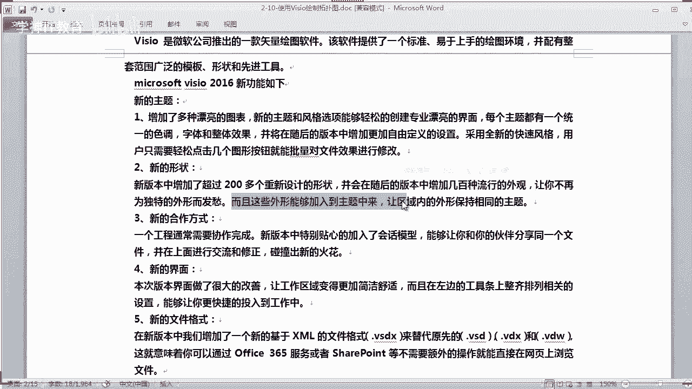
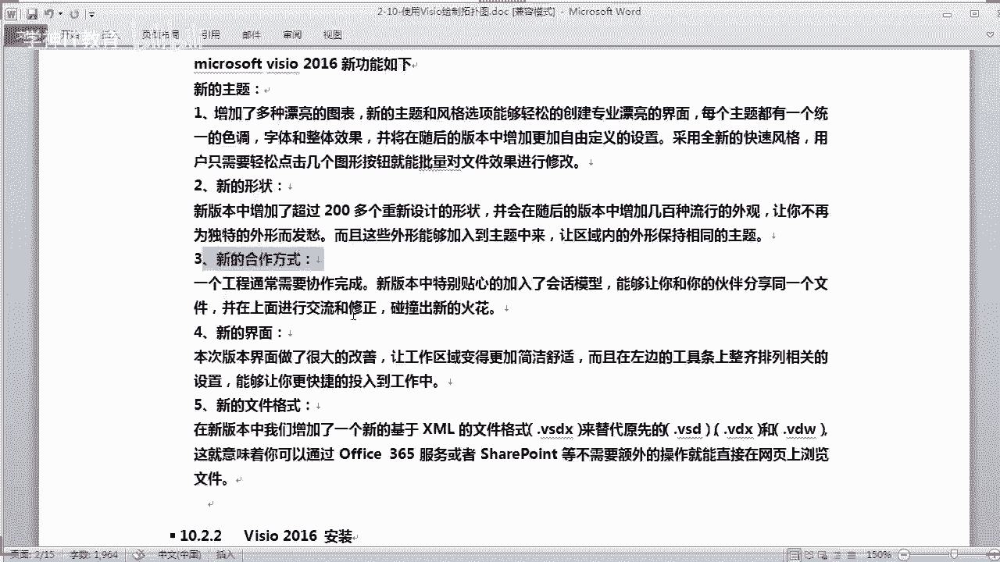
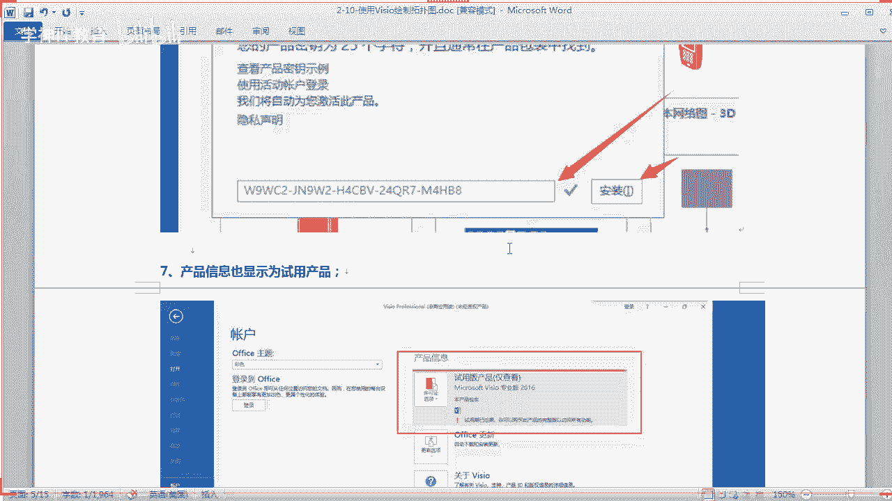

# Linux／Linux运维／RHCE／红帽认证／云计算／Linux资料／Linux教程--使用Visio绘制拓扑图 - P1：使用Visio绘制拓扑图 - 学神科技 - BV1UD4y1S7KB

好啊，今天晚上是第二阶段的第十章啊，第十节课啊，讲这个visor的安装和啊基本操作啊，就是怎么样去画一个流程图啊，我们是基于office2vis2016版来讲啊，那么这节课的话会讲到啊什么是vis是吧。

怎么样安装啊，怎么样去操作啊，是吧？怎么画一个简单的流程呃，一个top扑图，对不对？画一个网站拓图啊，OK。那。officevis的话，它是一个非常强大的绘图软件啊。呃。

在ID行业及呃其他领域的话也会这样用到像画这个人事架构啊，对吧？啊，也会也会用到啊。那么用于处理这种流程环节可视化处理以分析和交流的原件啊，并且能够创建具有专业外观的图表啊，以便理解记录和分析啊。

那么这边我们这一节课的话会去讲一下啊，怎么样使用这个viso来画流程中，其实很简单，对吧？啊，操作起来还是蛮简单的啊啊，那怎么样安装是吧？

安装啊，你首先啊你把它下载下来啊，把它下载下来，然后我们再装啊，来这里讲一下它的一些什么理论的东西啊。嗯，在很多时候呢，你使用图形比使用文字啊能够更好的表达意思，对吧？更容易被其他人理解啊，什么意思啊？

比如你要实施一个项目，对吧？你跟老板这呃滔滔不绝的说一大堆，老板完全不理解那些什么技术啊，是吧？什么笑啊，什么linux啊，什么gra命令呢，你讲这些东西简直是对牛弹琴是吧？你还不如画一幅图给他啊。

告诉他，哎，我要做什么东西，要实现什么东西是吧？把这个图摆到他面前一看啊，他就更加容易理解，你说对不对？对吧对于呃他不懂行的人，他看图的话会更加容易理解，对不对啊。

那么vis损的话是这个微远公司推出的一款是吧？这个是什么呀矢量图是吧？绘图软件啊，它是会这个流程图的啊。那么这个软件提供一个标准啊，比较容易上手啊，比较容易上手啊，而且配有很多的模板啊。

就是有一些现成模板，你拿来修改一下就可以用了，非常方便，对吧？还有很多非常形象的这些形状，你像什么交换机啊，路由器啊，防火墙都非常形象是吧？还有一些先进的一些啊导出导入工具啊等等啊。

OK看一下它有一些哪些新功能啊，第一个增加很多漂亮的图表啊，2016版是多了很多漂亮的。以前2013的话。

不是2010都没那么多啊是吧？2016话更多啊，还有以前是2003的时候呢，更加的少，少之又少是吧？现在的话啊这个更加美观了，对不对？还有很多新的主题啊，对吧？风格也可以选啊，非常漂亮啊。

它每个主题都有一个统一的色调，还有字体整理效果，那并且将随后的版本增加啊，更加自定义的设置，采用全新的快速风格啊，用户呢只需要轻点几下这个图形按钮就可以批量对文件进行修改啊，也是非常方便，批量修改啊。

真的。新的形状啊，比如它增加了有200多个200多个这个设计了，人家已经设计好了，你拿来就可以用，对吧？拿来就可以用了，并在随后的版本增加了几百种流行的外观，非常流行的外观啊，是吧？

让你不再为独特的外形来发愁，对吧？就更形象有什么好处啊。老板一看的话会更加的。

更快的理解是吧？没错啊，新的合作方式啊，什么叫新的方呢？那么一个一个viser的一个工程是吧，通常是要协作完成。那么新版本呢就会有这个非常贴心的这种绘画模型，能够让你和你的伙伴分享同一个文件，对吧？

而且可以协同修改和交流。

对吧啊，新的界面啊改的更漂亮了，对吧？更漂亮了啊，还有新的文件格式啊，以前是VSD对吧？现在是点VSDX对吧？

对不对？是以这个啊。是这个吧啊，现在现在已经改的更加的那个漂亮了嘛，是不是？ok。呃，那我们来看一下啊，安装是吧？呃，我们这里用的是vi首2016版本啊，那你可以去下载啊，老师也已经分享啊。

那这里的话也分享了一个是吧？啊，你们都下载好了是吧？😊。

解压出出来之后啊，直接你就点这个set up啊，set up安装两个多句啊。嗯，对呀，两个都具有。不过我们提前就给你分享了，你看到没有？是吧我前一天应该提醒一下你们，对吧？

如果你看笔记的人应该不用我提醒是吧？如果你不看笔记的，可能就不知道看笔记这里有分享链接，直接从这里的话去下载下来就可以了。是吧？双击这个set up啊，啊，这个可执行文件啊，它就会进行啊，是吧？

自动安装看到没有？这样就会自动安装好不好？

OK我这里已经装啊，你们照这个装就行了，是吧？这个就不用我去演示了吧。😡。

哎，有这同学说哎，包含木马病毒，我去怎么会有木马病毒呢？

开玩笑吧。如果有木马病毒，那你就。啊，打开它看一下有没有一些可疑文件，可疑的话，你可以先删掉它是吧？应该不会有哈。😊。

嗯。应该不会有是吧？呃，还有这里的话有这个密钥是吧？就是我们要进行破解啊，你要激活一下啊，输入这个密钥就可以了，是吧？那么你下载完之后呢，我们也自带有一个是吧，激活的这个这个工具，对不对？有没有？

估计是破解式木马，很多情况下都是这样的啊，因为你那破解工具，很多杀毒眼件都认为它是木马，对不对？相信有点经验的同学应该都懂，对吧？

OK那么激活的话，你点哪里去激活啊？你打开之后呢，不是有一它就弹出来叫你激活吗？或者是点帮助的话，它也会弹出来叫你激活。你就输入这个密钥是吧？然后进行激活就可以了，对不对？😡。

O。那。那你可以啊就你先安装这个激活工具啊，这个激活工具的话需要这个组件啊，它需要这个环境啊，net4。0是吧？到net4。0啊，我看一下，我这边打开看下啊。啊，有没有提示激活？V首。I我的微手呢。哎。

我的vis手不见了。我搜一下啊。难道我我的vi手被卸载了吗？嗯。哦，没有。对吧来，我打开它看一下啊。嗯。

OK啊，你打开它之后呢，它本身的话就带了很多的这些模板，看到没有？是不是很方便啊，对吧？啊，你看这个都已经OK了，对不对？看到没有？那这些话你完全是可以去怎么样去就是啊调用它，对吧？是很方便？

我这里没有提示说啊，你要你要干嘛是吧？来，我打开一个给你看啊，这个文件未找到啊，这个就没有。

如果你是弹出要你激活的话，那你就激活一下啊。我这里的话应该是你这里显示啊，你点一下左边这个账户，这里有个产品信息啊啊，如果是产品未激活的话，那么你就激活一下它啊，你就激活一下它OK。

好不好啊。

它显示什么试用版对吧？O。

嗯，我这个是经激活了啊。激活的话就可以了嘛。对啊OK。😊。

好，那像这种网络图的话，我们都可以直接调用它来使用是吧？你看是吧？你看唉这个的话，它是从什么呀？从这个网络啊，网络是提取，它是联机模板，对吧？联机模板啊正在装载啊。

ok。啊，这个的话呃。比较慢是吧？那当然它这里的话有很多的这个形状啊。有很多的这个形状之后呢，你就可以啊其实很简单是吧？比如我把这个服务器拉过来啊，对吧？当然我们可以把这个放大。

对吧你放大它是不会模糊的，你放心啊。对吧。不会模糊啊，你可以拉大它就可以了啊，对吧？拉大你看。你拉多大的话，他说模不会模糊。它这种图的话是什么？就叫以量图还是矢量图是吧？这个这这种图你怎么样拉它它。

都没有问题，是不是？你看你拉多大，它都不会有模糊的现象啊，是不是那不像我们一张图片的话，你把它拉大的话会变会变成么很模糊就不好看。你这样拉大缩小都没有任何的影响，知道没有？

那这里有什么以太网啊、交换机啊、防火墙啊，对吧？那防火墙啊啊，交换机啊，是不是还有通讯链路啊，是吧？这些东西都是记点即所得，拖过来就可以了，是不是很方便。超方便的对吧？对一点啊。所以我们这个的话呃。

其实蛮简单的对吧？OK来我们看一下。😊。

安装好没有？同学们，安装好之后的话来。啊，激活这些我们就不讲了。其实这种啊你们一看就懂是吧？激活之后对吧？那你这里讲一下啊，讲一下这里呃讲一下什么东西呢？就是它的一些基本的使用，对吧？基本的使用啊来。

我把这个。啊。工具显示选项卡显示选项卡和命令啊，对吧？我把这个显示出来，对吧？你点这里的话可以的啊，你可以点自动隐藏，对吧？它就会自动隐藏了，对吧？或者是你不要自动隐藏也行，对吧？我们让它显示吧。

好不好？对吧？那这样的话它就显示这个效果出来啊，OK。拉大一点啊。那么这里讲一下啊，就是他的一些啊基本的操作。首先你打开之后呢啊在这上面的话，注意啊，这里的话是什么呀？开始菜单里面的都是什么呀？

一个菜单栏，对吧？这个其实跟你的word文档是一样的啊，对吧？你可以调字体啊，什么是吧？还有这个啊居中啊，居左啊，居右啊，对吧？差不多啊，连接线啊，填充啊，你看。还有查找替换啊OK。

这个的话就是我们的这个工具是吧，工具啊，上面还有啊一级菜单，一级菜单你可以切换，你看像插入，它就会切入插入的这个什么呀工具。你点上面这个菜单，比如点设计是吧？那么就是设计是吧？你要什么文本什么的，对吧？

你也可以添加，你看还可以呃去选择它的一个一个什么呀一个叫主题颜色吧，对吧？主题颜色是不是很方便。

哦，这是你画的是吧？唉，上次我叫谁来上来画个图，是你画是吧啊，你天天都画这个东西啊，哎，画的不错哦，你看有条有理啊，而且你看。

这个东西写的还有很多明细是吧？但是你这个图啊。你这图一放大的话就。就变就就就就模糊了是吧？你能不能搞一个高清的大图出来给我们看一下啊。哎，你看这位同学画的是吧？O。是吧上面的话是菜单，对吧？很简单啊。

你看点菜单啊，然后数据的菜单对吧？然后是各种这个流程大纲啊，工作流对吧？啊，然后审页。试图啊帮助其跟你word文档是差不多的啊OK。记点记所得对吧？记点记所得啊来。那看左边这里啊形状这里啊，形状。

这里的话就是各种的模具和什么和形状，对吧？这些叫模具啊，我们把这个叫各种模具啊，对吧？各种形状啊，你也可以本来人家就叫形状，对吧？你又可以叫形状啊，OK是不是那你要这种啊。形状。

那么形状的话它分为啊有有有类别啊。你首先点上面的类别，比如你可以选其他的是吧？你可以选快速形状，看到没有？然后批注的形状，然后计算机和显示器的形状，还有网络图的形。网络图的形状看到没有？

这3D类型的是吧？3D类型的对不对？还有网络外设啊，那你一个个类别去选的话，你就可以看到我们要的东西了，是吧？是不是还有网络位置，你看有云城市住宅是吧？然后网络符号啊，路由器啊，对吧？各种啊各种啊。

你看还有如果你不行你觉得服务器不够的话，你看人家提供这么多服务器是吧？文件服务器、邮件服务器、web服务器是吧？还有数据库服务器。那比如我们通常情况下跟同学们说。

你看那么这两个服务器你就会看到有区别的对吧？因为为什么呢？人家一看到这个服务器非常形象哦，这个是数据服务器，对吧？那如果别人看到这个服务器呢，人家就看啊，这个是weber。你看这里有个有个地球嘛，是吧？

全球通了是吧？他这种的话就是提供web服务的服务器，人家一看就懂了。是不是？OK邮件服务器，你看是怎么样子的是吧？是这种的是吧？有一个什么呀？有一个email的邮箱，有一个信信封，对吧？😊。

OK那上面这种就是普通的服务器啊，那文件的服务器又是长怎样呢？你看看文件的话就插卡了，对吧？啊，还有代理服务器，还有呃其他是吧？那。还有FTP啊，还有目录啊，打印服务器等等啊，是吧？

一般我们用的比较多的，个就是这种这种这种这三种话是比较多的对吧？是比较多的啊，O。那还有机架式的服务器。如果你觉得说哎这种的话不太形向，那你可以用这种是吧？这种是不是跟你的机柜里面的这种是吧？看到没有？

这几U啊4U还是8U啊是吧？几U的服务器，那这种是什么呀？就可以放到我们机房那个那个机架上去的，对吧？它也分有很多种啊，是吧？这是应用程序的服务器，还有什么内容服务器是吧？看到没有？

它都有不同的这个表达，所以我们使用更加贴切啊，更加贴切你这你你你这台服务器名称的这个图需要图形。会更加好，明白没有？O。啊，这个就是那这里的话主要是什么呢？呃，可能就是跟网络，跟我们这个什么呀。

IT相关的多，那还有其他的，你看不单只是说是吧，它还包括什么商务型的，你看。多的很是吧，那其他比如人家其他行业的是吧，这种。这种你见过吗？是吧？还有地地面图，平面图，你看没有？这种你看过吗？

交通图你看过吗？是吧？你你看像个这个什么store红绿灯啊，你看当然这种话我们是用不上，只是告诉你这个viso是非常强大的啊，它适合是吧各行各业画这个流程图都没有问题。OK啊在这里你可以选择更多啊是吧？

好多啊。😊，对不对？是不很简单？其实不能是吧？只要告诉你们在哪里用啊，是吧，怎么样用啊，很快就上手了。O。😊，啊，那以后说哎你随着这里这么多，可能也家提提供了几千种这个图形。

你也觉得不够以后你还可以自己新建模具是吧？比如你在网上去下载一些这个模具导入进来，也可以用的不啊，也可以用的哦，是吧？这东西它都提供可以从外网去下载啊，对吧？其实这么多的话啊，基本上够我们已经使用了。

对不对？好。O。对吧这一步能啊。

好了啊，刚才讲了这个整个的这个什么啊，怎么使用基本使用嘛，是吧？啊，这些菜单啊，你这样切换就行了。这边的话是形状，你拖过来就可以了，是吧？那么这边空白的地方是绘图区是吧？所见即所得。

你把它拖过来就可以了，是不是啊？很简单吧，那vis锁的话有什么优势啊，对吧？它对系统资源流程及幕后的隐藏数据进行可视化的可视化的什么呀，可视化的这种啊操作啊，利于分析和交流，对吧？你把图一展示出来。

大家一看哎。啊，说起来更加的什么呀，更加清晰明了啊，对不对？少说很多废话是吧，跟老板不用说那么废话啊，有图啊。那么外观也专业是吧，专业啊，通过viss锁连接形状和模板啊快速创建什么呀？图表提高工作效率。

对。啊，你拿这个图表跟人家交流呢，就更加的什么更加的贴近了是吧？说的更加容易啊，让别人明白啊，直观嘛，对吧？这几句话直观啊，专业高效易读可操作啊。嗯，那这里讲一下通用操作是吧。

就我们怎么样去创建一个流程图。那，比如我们刚才写的是这种啊网络，对吧？网络的形状，那你点网络形状进去的话，它就会先把你定位到这个网络的这个类别。还有没有？刚才讲了，你还可以使用其他的很多类别，对吧啊。

嗯，那么这个窗口的话，你可以缩放对吧？缩放和什么都没有问题。怎样缩放，你看按住这个ctrl键滚轮就可以了。就鼠标滚轮，它的话就可以了，对吧？你像这个是吧？我按住ctl键。你看我如果向向啊向下滚。

它就这样是吧？向上滚的话，就变大，这个能不能粘贴到PPT好，这位同学提的问题也很有代表性，能不能贴到PPT啊，同学们。

你说你说我我这样复制一份，然后打发打开1个PPT，我看一下啊，演示给你看好不好？我看一下。我的PPT呢啊打开1个PPT。

嗯。好吧好，我呢我在这里copy过来，可以吗？没有问题啊，那我贴度过来之后呢，我拉到缩小会不会有问题呢？😡，同学们发现什么没有？发现东西没有？啊你在这里拉大缩小的话，它是有问题的对吧？它不会说呃。

这个一直保持它原来的那种清晰的程度，对吧？你贴过来是没有问题的啊，那你是在你的这个什么呀，在你的vis里面啊，调好你的大小再贴过来就可以了。OK。

是吧因为因为你在这里的话，你你拉多大，它都不会他都不会说有有有模糊的情况。懂了吗？O。那我还告诉你一个方法，就说你可以将这个是吧，保存一个一个什么呀一个图片啊，保存图片呢，然后你导出来对吧？

导出来之后呢，你在那个什么呀？

你在。你再导入到你的PPT这个懂吧？是不是。那随便了，比如这个我的文档是吧？然后啊这里不是它不是有很多的这个格式吗？你另存为的时候呢，你可以存为啊，你看。这么多你可以成成为这个吧JPG格式是吧？

JPG格式，还有什么PDF格式也可以。你看是吧，还有什么web页面，还有altoCAD你看autoCAD都可以哦，你看CAD的都可以是吧？很多啊，你另成为然后再进行导入就可以了啊，是不是很方便。

所以说vis首是非常专业是吧？专业直观高效啊。可遭受性也强啊，可以直接PPT里面呢。什么意思？可以啊，你可以直接啊把它拷到PPT啊，你也可以就把它导到这个这个什么呀。对吧插入也可以啊。

看你想怎么样去搞啊，都可以。嗯。好，那首先。那像刚才我们打开的这个这个是网络图，对吧？网络图啊OK。网络图啊，我们知道啊在哪里在哪里找找你的这个模具，也叫形状是吧？是吧？你可以把这个形状收藏一下，对吧？

收藏对吧？或者是你在这里找是吧，很多的啊。一般我们像这种网络的流行图，你看在这里。还有很多啊，你看。这种的话是不是3D的，我也把它打勾给你看一下啊，如果不是3D的这种服务器，你看到没有？

这个和这个两个都勾了啊，它这种weber服务器以前是这个样子的对吧？有点难看啊，对吧？还不如这个形象。这个服务器跟这个we器哪个更形象，肯定是这个嘛？所以说为什么以前以前这个这个服务器的话。

我们是没有都没有啊，我们就不用了嘛，对吧？就这个我们可以去掉，它以前的这个老版本啊，你可以把这个勾去掉，它就不会显示这个类别的，看到没有？你们看到吗？这里很多没有打勾的，是不是？嗯。O。好，那。

那呃我们来操作一下，比如这个指针对吧？你这个连接线啊，你从哪里连接到哪里，对吧？它就会给你连接了嘛，对吧？从哪里连接到哪里啊，连接到这个地方，对吧？好，或者是连接到这个地方啊，这样子。ok。

那这样去连对吧，都可以啊。啊，OK。你也可以拉动啊是吧，你可以拉到这里来拉到哪里去就行，对吧嗯。OK然后然后像这些的话，你还可以去什么呀，可以旋转，对吧？你怎么旋转都行啊。😊，是吧OK非常方便啊。

拉大拉小，他也不会说啊这个变形啊什么什么的对吧？😊，OK那这个的话你也可以拉大拉小啊这个。诶。拉大拉小。这样对吧？啊，然后这个。它要显示那个框，然后呢，你就可以拉了。嗯。行啊，我看一下啊。工具选项。

工具选项啊移动，然后双击目标进行编辑啊啊双击目标编辑啥意思呢？比如这个啊双击它，那么你说这个双击它就可以写，比如这个叫啊weable。服务器。对吧。嗯。O。对吧这样子啊。web服务器是吧。

然后就可以了啊。那这样的话，这个东西的话就说明是weber服务器大家就知道了，对吧？那比如这一条是一个什么呀，是链路是吧，你也可以写啊，或者是不写也行啊。这个呢这个是防火墙是吧，防火。强对吧。

是吧可以加文字的方式啊，这样的话会更加的让人家看得懂是吧？不知道你这个是什么东西啊，是吧？这个是数据服务器啊，好吧，这种是你可以双击这个图标进行编辑啊，编辑好不好？啊。其实很好理解啊。

跟word差不多啊嗯。O。那么下面的话这样子啊。

我们来画一个是不是？嗯。来。我们这里要求你画一个企业网站的top图啊，我们画一个最简单的对吧？是吧？那现在画一个简单的啊啊，我们这个项目要求是说嗯四台服务器是吧？要有清晰的这个网站top图啊。

要有数据自动备份啊，然后呢有双组互备啊，要有监控啊，配置好服务相关的安全内容，还有这个调用内容啊，那么你看他说数据库的话要做双组，那就是要两台mycycl了，对吧？那我们要画两个图。

两个数据库的这个什么形状图，对吧？vi博的服务的话，它是什么呀？LAMP的话，我们用一台就可以了，是吧？还是用这个SYC去进行实时同步啊，对吧？那这个东西是不是要一台机器啊？

viboard的话要做一个定时服务啊，对不对？然后mycyclql的话也做定时服务啊，使用那s对所有服务进行监控啊，就这样子，你看没有？这个就是我们已经画好的啊，给你看一下啊。画好的，你看这个。

那那我现在就叫你模拟老师的这个图，你能画出来吗？因为这些的话，基点你点一下就出来是吧？很简单，来，你给我画一下好不好？😡，每个同学现在实抄一下啊。石头一样好不好？现在马上实操一下。嗯。

因为如果你不操作的话，你你的你还是生缩的嘛，对吧？怎么样去画。ok。

来。😡，嗯，我们先把这些嗯。这些是吧。全部先删掉它。OK你全部选中加，然要低的话，他就可以全部删除的了啊。OK来，那就拿这个那个来呃，来来讲一下吧。对吧那这个怎么画是吧，你要画一个一个一个流程图是吧？

那咱们可以先写个什么呀？😊，才有一个。什么文本框。是吧什么文本框。这个文本框对吧？那写什么东西呢？叫中小型。对吧企业。网站。啊，项目。对吧O。😊，那这个的话就我我们就已经搞好了，对吧？

因为呃你可以拉大嘛，对吧？拉大一点就可以了，没有问题的啊，这个东西都可以的啊。然后这里面的我们可以干什么呀，把它置底啊，比如调成这个。什么呀？诶。微远雅黑是吧，然后要多大哈，你看。啊，要加粗。

你看这样的话就可以了，是吧？OK是不是中小型企业网站项目对吧？那以后的话我们需要那个什么图啊？网络图是吧，网络外设。这个。网络图啊，对不对？OK网络外设，然后还有什么？云云在哪里？网络位置对吧？这个云。

那我们把云拉过来。是不是很好理解？是吧云在这里是吧，你可以拉大拉小啊。云我们所说云就相当于什么互联网是吧？你的网啊外网OK。好，那然后计算机啊，比如PC对吧？像这台啊，我们放到这里。ok。就这样啊。

是不是？好，那还有什么呀？嗯，这个。你下面画一个一个一个机房，对吧？比如这里显示的是北京电信的IDC机房啊，那你要怎么画形状图在哪里？是吧你可以画一个形状图啊，形状图是。来，我找一个形状图嗯。常辉。

图案形状是吧，基本形状图案形状。嗯，快速形状，我看一下有哪些啊，不是啊。嗯。那。工程一程网络软件常规哎常规图。应该是在基本形状啊，对吧？基本形状啊，你像这个这个是什么呀呃。矩型对吧？

比如我们先画一个句型啊，在这里。然后拉大他。拿大。这个你可以把它缩小啊，都可以啊，拉大缩小都没有问题，对吧？ok。你给拉长一点，对吧？O。然后我们把这整个缩小来看都可以啊，这样的话你会看得更加形象嘛。

对吧？OK好，我们把这个先那个隐藏。哎，嗯把它缩小一下啊。哎，隐藏一下啊这个。啊，点一下啊。把它就是把那个什么呀，把那个工具的那一栏是吧，隐藏。因为你这样点的话，它也会出来的对吧？

那所以话我们这个这个界面的话，操操作起来就会更大一些是吧？更大一些，方便你们操作啊，对吧？你像这个的话，我们应该把它放到下面一点来，对吧？这样会好看一点啊，是不是？这样会好看一点啊，是吧？

然后把它拉拉大一点啊，那就这样子，对不对？OK啊，然后这里的话你要画一个。半边椭原来是在哪里？嗯。半边椭圆。这个是吧。还有没有？然后你放在这里。O。然把它拉那。是不是哎，是这个吗？好像不是啊。

我看一下啊。呃，这个是缴去缴的啊，不是这个啊。来是哪个，你给我们找一下，是这个吧。😡，圆角的矩形对吧？哦，不是。那。减去眼角的巨形啊这个。哎，我怎么感觉不对呀，是吧？不是这个啊。😊，有一点对了。

减去单眼角，我要减去双眼角的。来，你们找到没有？剪去单元角的，然后这边是圆角矩形啊，剪去同侧圆角矩形是这个吗？嗯，O。这个是吧。那。然后我们把它缩小。是吧。ok。那我们在这里面双击是吧？嗯，电信机房哦。

北京电信是吧？北京电信IDC啊机房OK。这样就可以了嘛，对吧？😊，好，我们把它选中，以后把它自己调粗啊，然后调成这个。你调成你喜欢的对吧？喜欢的这个就可以了啊，然后把它调大一点啊，是吧？

北京电信机房是吧。OK那。😊，这样就好看了是吧？😊，嗯，OK。好嘞，那我们把它拉上来一点啊。OK北京电信机房啊，然后那个路由。路由是哪个啊网络位置是吧？不是网络外设吗？对不对？我们要用哪个路由器啊。

这里有没有路由器？网络符号啊，这个有路由器是吧？那你要用哪个路由器呢？我们就用这个普通的对吧？就可以了，好不好？ok。这就是普通的一个录用啊，你可以缩小一点啊这个。诶。对吧。🤧嗯。啊。

你可以用这个光标移动一下，是吧？要放到哪里都可以，是不是？啊，就这样是吧？啊，然后你可以在这里双击写点东西啊，比如这个是19号。就告诉他是一个网关是吧，哎，我写少了吗。192。668。1。1是吧？

OK就这样。明白吗？你可以把这个加粗一下，也变成一个。会员雅黑。对吧。啊，把它调大一点。对吧OK。好，然后交换机交换机是哪个？路由啊交换机。就没有交换器啊哇，看上面对吧啊。这里有有交换机对吧？

但这个交换机呢我们不喜欢啊，对吧？我们要用那个交换，我看一下啊有没有。你。交换机在哪里啊，来找一下啊。刚才那里是吧。呃，这个是SDN交换机是吧？这种是AMATM交换机啊，还有这种是工作组交换机。

你看有很多种类别是吧？我们可以根据去选就可以了啊。是不是啊？那么应该选哪个呢？选这个对吧？我们是AAMTATM啊，对吧？来我们写到这里是吧？然后呢，你把它缩小一点是吧？O对不对？啊。

你可以把这个放大来来来搞得行是吧，这个。嗯。O。嗯嗯。这个啊一上一点。好了。然后交换机啊，然后是还有什么呀？这个太大了是吧？我们把它调小一点啊，OK。还有的是要画要搞两个什么呀数据库的服务器，对吧？

数据库服务器啊，我们使用服务器3D图啊啊，我们刚才说了数据服务器呢，我们是应该是用这个对吧？对啊，我们就拉下来这个这个叫。数据库对吧？在这里。O。好，那我们要两台怎么办？同学们，你可以按住ctrl键。

同学们按住ctrl键啊，然后的话再点就用这个鼠标是吧，拉一下就它就会帮你复制一个，你直接在这里拉就可以了。你看我这里拉到哪里，它都可以复制。看到没有？是吧，OK。嗯。注意啊，你按住ctrl键。

它才是复制嘛，对不对？好，然后这个还有一个什么web服务器啊，在这里是吧？我们拉到这里来啊，它会自动帮我们做一个对齐的动作，是不是也是挺好的对吧？啊，对啊，那这样填挺好的啊。

然后哎我们这里还没写东西是吧，你可以在这写啊，交换机。😊，嗯，OK。是吧。就可以了啊。啊，然后这个的话你可以。改一下是吧。好，搅换机是吧？然后这个是嗯。是吧mycycle主从是吧？那咱们也写一下啊。

My cycle。对吧。主从啊OK然后是192。168点，就是你在这里的话，你可以写上啊它的IP地址啊，还有相关的一些说明注释啊，都可以写上去，对吧？这样会好一点啊，然后。这里的话我们也改成。

这个什么威远雅黑是吧？然后字体的话可以用小一点啊，小一点。对不对？给它加粗啊，就O了，是不是？那其实那个。我们可以我们刚才应该。那样是吧。搞好再再一起搞过来，那是不是更方便，对吧？哦啊，算了。

我直接copy过来。copy文字也是可以的啊。很方便啊，然后这边的话是。rabel服务啊啊，我也拷过来吧啊。叫weber对吧？服务器啊OK这个IP我们改一下。那。可以啊，O。😊，搞过来。

然后你要还要干什么呀？连线对吧？连线啊OK。😊，啊，连线的话怎么连？啊，是吧。嗯。连线的话在这个我打开这里啊。拿过来一点啊。嗯。O。连线的话，我们可以在这个这里有个连接线，对吧？连接线啊。

比如这个我们应该是从哪里呀，从这里。到这里。啊。系。哎，我们再把这个。搞上去对吧，这样。他不就连上来了吗？嗯，这个太。放大一点啊。来。嗯，就这样，对吧？我们就用这条来连就可以了啊OK然后这个连到这个。

连上去对吧？那は。嗯，哎呀。这个连线呢。不太好用。嗯，这里还有一个把它删掉啊。O。好，或者是我们这里连线的还有很多了，不一定说要用它那个是吧？我告诉你们啊，这里有更多的形状连线啊来。嗯。

网络外设这里啊啊我们可以先把这个通讯链路啊先连一下啊，这里刚好看到这个啊，对吧？来我们先把这个连一下啊。通讯链路是吧，这个。对不对？我们连到这个这个机房。对吧O。😊，然后的话。还有什么呀？

我们还可以连到另外一个哦，另外一个地方还没搞是吧。啊，不是另外一个说明呢还没搞是吧？然后我们这个先连到这里啊啊我告诉你们啊，这里应该还有其他的一些呃连线啊，是吧？你像这里动态连线对吧？动态连线啊是吧。

你看这个从这里到这里。嗯。动态连线动态连线就是刚才我那个连线是吧？我们看一下还有没有其他连线啊，这也很多的啊，网络位置网络符号啊，网络符号不是。证书动态连线就是在网络符号。

使用模具当中连连接线啊连接线我看一下连接线这里还有很多，我看一下啊，连接线。常规图。连接线没有没有勾起来吗？没有。基本形状图案形状，我看一下图案形状是什么。嗯，不是。图案形状绘图工具。哦。

绘者工具也不是啊。说完了。我我记得这里还有还有很多的这个连线呢，哎，哪去了这个连线啊？呃，基本形状、图案形状、绘图工具。绘的工具不是啊。反切线。垂直线直角线斜边斜角。

不过这个的话一般不太用于像我们画这种top图啊，人家画那些工程图的话，用的比较多，对吧？所以这个的话还是比较少啊，先把这个。啊，基本形状基本图形。把，这个干掉了，对吧？绘图工具。啊，在这里是吧。

那批批注这里的话有很多的这个连线，对吧？你也可以用啊，同学们这里啊中断线什么什么线啊，这里是吧？啊，不单只是说你你这里的话，他用的这个就是动态的一个连接线是吧？你看动态连接线啊，然后。然后就点这里哎。

连的话不太好连啊，你看。はい。我把它放大一点啊。嗯。这个动态连接线。哎，怎么拉不出来呢？郁闷算了，我不要他了是吧，我直接搞这条。哎呀，我去。😔，那。你可以拉这条过来啊，同学们。诶。那copy多一条是吧？

哦。这里有。是吧直线。嗯。怎么拉不了呢？怎么这么。😔，好，可以了。好了哎。这个现在呢是。连接线唉，怎么copy不了了？同学们，你你们试一下啊，你看我我我现在点了copy它co。哎呀。拿不出来。等一下啊。

算了，我先把这个copy一下。嗯，我先把这个整个图啊是吧，整个。好。整个拉一个出来。对吧要缩小。OK然后放到这里啊，然后这个是缩小版的对吧？缩小版的什么呀？缩小版的一个这个。啊。

这边的话它是一个北京电信机呃，什么什么公什么什么东西是吧？啊，先这里先改一下啊。北京叉叉公司是吧。啊。啊，O。缩小版啊，然后这里的话。嗯。我们画一个就是做一个说明啊，搞一台服务器过来先。计算机网络。

服务器啊，要后把这个这个放这里来啊，对吧？就这样啊，然后我们在这里写一些东西啊呃，这里写什么东西呢？啊，我们可以在这里嗯，你可以写。是吧你直接双击的话就可以写了啊。你把这个什么weable对吧？

weable什么什么定时。定时。备份对吧？我们在这里要做什么东西的对吧？OK然后是第二。这里是用使用RSRSYNC对吧？要做一个什么实时。同步啊是同步啊，然后用拉的方式。还记得吗？SY有拉有推，对吧？

用来做这个啊weable对吧？做weable啊服务器，对不对？外博做服务器备份。O。然后。还有什么呀？第三对吧。然后是做这个LAMP啊LMP的一个环境啊。然后第四。啊，是做这个neex监控nego哎。

ne个对吧。negos啊。那个是监控。O。那个时间。啊，监控嗯。啊，OK。然后还有第五点啊，是数据库服务器定时备份。数据库啊服务器啊定时备份对吧？好了，就这么多，是不是OK。😊，这个应该很好理解是吧？

OK好，我们把它啊应该是放到下面来，对吧？下面来啊，要记住。然后呢，这个然后呢，把这个。啊。诶。微远雅黑是吧？嗯，如果你觉得不够大啊，可以放大一点，对不对？那别人一看就懂。是吧O。这样就可以了是吧？嗯。

Hao。啊，OK这个没有问题了吧，是吧，就就说明啊啊还有这个是吧？嗯，我们搞多一个过来啊，对吧？然后把它拉到这里啊，这边拉到这里。啊，OK是不是？嗯，O。就可以了啊，是不是？这样就可以了啊。啊。

搞定还有什么呀？哦，连接线是吧？来，我们这里再搞个连接线啊，连接线。搞个连接线啊来。我们用我们要用直线啊用直线好一点啊，它这个连接线，有时候你你用的是动态线的话，可能啊这种是直角连接线是吧？还有个直线。

还有个是曲线连接线，看到没有？红我红色那个什么意思？那我们试一下这个曲线连接线啊。曲线连接线。还，不是怎么选错了是吧？插入连接线对吧？嘿。嗯，这个连接线。没出来。那。真是坑爹啊，老是点的话他都。

不太好操作，你那来。我把这个删了啊这个删了哎。啊，老师你有同人说哎，你的你的是不是啊那个。那个是白色的呀，不是啊，我这是黑色的呀，看到没有是吧？啊。那我放大一点是吧，要不然看了都看不清楚啊，是不是？啊。

这个啊这个的话是连接这一台，对吧？啊。嗯， ok。然后嗯还有哪个，还有这一台是吧？这台连接哪一台连接这台。是不是？哎，我不用这种这种线啊，我要把它干掉啊。看成直线啊，对吧？嗯。对啊，我要直线啊。

我们调整一下。嗯，然后这个。对吧然后我们调整成直线啊。看到没有？我们就用这个直线啊，这样这样就可以了啊。对吧。哎啊这个有点。我不要拉那么长。来。嗯。我怎么拉不上去呀？😡，我去。能奶啊。嗯。你看。

我现在不是指针吗？😡，好。我还没调整指针吗？你等等啊，我看一下啊，现在是指针啦。😡，好，可以了。哎，是吧，同学们要注意啊，这个切换是吧？如果你没切换成功，就像老师这样啊。😊，是吧。好。

这里的话又多了一条啊，把它删了啊。😊，嗯。好，你看那我这样画，我就化成了是吧？你看是不是哦，还有一还有一条线是吧？😡，这个。这里。到这里。是吧。然后呢，我们要把它哎。这个线的话我们要把它调成什么呀？

调成哎哎呀，我要调成直线。好吧。对不对？O。可以啦。😡，对吧。好。OK就这样。嗯。那这样的话，哎，怎么我发觉这个东西好像是没了。是吧。哎，我那个框框哪里去了？😡，我我我这个剧型的框哪里去了？

我刚才删了吗？😊，是不是？我怎么看不到我这个框了？嗯，算了，我把他拉一个过来。哎，不对呀。不是啊，我这个框不见了，刚才是不是我被我删掉，我刚才不是删那个那个这里有多了一条线嘛？

可能我把这个框就外形呢把它给干掉了，同学们是吧，有没有注意？你们都没有提醒我啊，对吧？那我现在的话再搞一个框。那巨型是吧。O。这个的话要放到。底部是吧。底部进型。然后至于。哎，没有吗？底部顶部巨型。

底部咨询。不对呀。我看一下啊。嗯。是不是上一层？你看我这个是啊。肯定是被我删掉了，没有了，对吧？所以我只能再添加一个是吧？然后呢，有同学说我应该把它质疑什么呀？质疑放到这个底层，对吧？至于底层。数据。

我的质疑底层在哪里呢？质疑底层没有啊。我去。拿一下啊，我看一下。置于底层。我看一下这个质疑底层，哎，为什么我的没有质疑底层不可能啊。组合。那。那我先把这个拉下来是吧？那我现在要把它置于底层，我看一下啊。

置于底层排列置于顶层啊，在这里。对吧可以了。嗯。搞定啊。就这样。这个是后补啊，刚才可能是把它删掉了啊。好，我把它放大一点看一下啊。嗯，在这里。完美是吧。是不是？ok。高点啊。这样的话就可以哎。

这里的话你可以起一些文字是吧？啊，这个是。PC啊。Hao。那。是吧这个你们能画出来吗？这个是呃你把这个画出来，其实呃那些比较复杂的，我相信你也没有问题。为什么呢？

所谓复杂的都是有简单啊一层层把它叠起来的，没有什么，对吧？无非就是在简单的图上再画简单的图，再画简单的图，它就变成了什么呀，就变成复杂的一个一个拓不突了啊，OK好不好？那但然画这个东西肯定是非常耗时的。

对吧？因为你要想呃怎么去画画，那你要改，对吧？啊，有时候呢你可能有些地方呢又画错了，是吧？又要重新把它修正一下，对不对？就出现这种情况啊。O。画好了吧，就这样啊。那么。更加复杂的拓扑图呢。

我这里就不画了啊，因为更耗时间，对不对？非常的耗时间。那我我看下笔记这里啊，看下笔记这里。

比记啊这里啊他说一个更加复杂啊，如果使用8台以上的服务器啊，也有清晰的网站拓普图啊，支持高并发，那就是有集群喽，对吧？还有数据备份啊，这肯定的是吧？啊，他就是其实要有高并发的话。

你肯定是呃搭建一个集群的，你看到没有？是吧那么现在像这种话，你那边还没有学到像使用LVS加DR模式啊，再采用了keep live实现高可用啊。那么后期我们会学到啊，那如果把这些东西学起来之后呢。

然后叫你画一个图，你看这个就是画出来的啊。我把它放大一点给你看啊，你看没有？这些画出来是吧？啊，那你说这些东西呃难吗？不难是吧？无非就是有简单的图把它砌起来而已是吧？啊，万丈高楼啊，平地起都是这样的。

是吧？你首先把它你从外层画到里层都可以是吧？想好，其实这个一点都不难，很简单的是吧？画一个图，也要写一个什么写一个注释对吧？那画一个图写个注释，对吧？然后用一个矩形框，然后呢用一个啊椭圆矩形框是吧？

还有用各种直线啊把它连接，还有各还有这里的话有这个虚线连接。😊，那这里要跟同学们讲一下，我们用实线和虚线的一些区别啊。在我们画这个流程图时候，虚线表示什么呀？虚线呢这个都是呢相当于。荣于线路啊。

什么叫荣鱼线路？备份线路对吧？O。😊，像这种容易链路的话，我们可以用一个虚线的方式进行连接。OK懂了吗？啊。那虚线怎么画？有同学说是吧？来，我们看一下虚线在哪里呀。

嗯，标注线连接线对吧？我找一下啊。线条对吧？在这里。然后的话有粗细，有虚线啊，你看这里。同学们。虚线在这里是吧？然后你就可以呃画虚线了啊，是吧？我看一下啊，我画一条给你看啊。😊，找到嗯，比如这两个是吧。

期限。哎，我拿借条来举例子吧。借条。然后呢选中它，然后啊这个叫线条，然后呢变成虚线，看到没有就可以了。OK啊，就这样。嗯。啊，是吧简单啊，你可以选中这条线，让它变成虚线就可以了啊。😊，O。

好。啊，你看像呃它部署这种的话是有什么呀？有1234对吧？有分层次的后外层这边的话是有防火墙是吧？然后把这个ja监控的话也放在外层这里。然后这里的话有一个用于LVS啊进行一个用于啊。

其实它就是分为主从的一个什么呀一个一个备份的一个链路，然后进到这里呢，又有一个这个weable啊，weable里面的话，它这里做了一个共享NF共享，就是说数据共享啊，看到没有？那这里有S一和S2的话。

它分别有两个真实服务器。那你访问哪一个呢？是吧？它是用余的啊，然后这两台的话，它要进行什么呀？进行访问数据库。那数据库呢，这里又做了一个叫MMM是吧？数据库的一个什么双组复制啊，双组同步，看到没有？

ok。123啊三台是吧？MM就是ma master啊O master啊进行一个互主的一个什么呀一个同步数据啊，这样的话，保证数据的话一致，那么无你这个we服务呢，无论是访问哪一台啊。

无论是访问哪一台这个什么这个数据库，它拿到的数据呢都是一样的是吧？渠道数据都是同同步一样的啊，O这种是搭建一个we啊集群的一种架构的一个top图啊。你们如果你会画上面这个的话，那下面这个也能画出来是吧？

不难是吧？无非就是这个图是吧？啊。ok。好，那么我都说了，画拓扑图的话，其实不能，其实还是要多动手是吧？不动手的话就会伸缩一点而已。那其实画拓扑图多嘛，按照我的工作经验来说并不多啊，不并不多啊。

真的是不多，因为呃你不可能永远去做一个用做什么呀，做这个架构图啊，对吧？一般公式的话，这第一次去搭建的时候呢，做好之后以后的变动是非常少的对吧？变动都非常少的啊，都是一些微调整啊。

OK但是你要懂怎么样去画就可以了，很容易吧，同学们。啊。好，我都说今天的内容是比较少的啊，忽悠领导还是蛮好的是吧？呃，对，其实这个忽悠的话，你们呃这个技能的话很容易学是吧？非常好容易学啊。

因为既点即舍得啊把它。你可以像这种画的画的复杂一点，让他看的眼花缭乱是吧？其实也不眼花缭乱啊，因为你每一个的话都有有一个线路图走是吧，你告诉他这个数据流是怎么走的啊。😊，啊，对不对？你跟他聊一聊是吧？

然后呢他就哎就拍板了是吧？小伙子啊，拿50万去是吧，把这个。😊，这个什么呀，这个项目给我实施起来啊。你懂的啊，OK。好吧嗯。😊，然后看一下啊，接下来看一下里面有些什么问题啊。有什么问题回答一下啊。

实际只花了5万。直接5万都不要是吧？嗯。不过这种东西的话，你忽悠不懂的领导还好啊，我告诉你，真正技术总监的话，你肯定是忽悠不了的，是吧？但是如果你们公司的这个上上司啊，就是做搞技术部的上司的话。

他不是搞技术出身，那你就可以忽悠他，是不是？啊，我记得我以前搞那个呃搞一个一个什么很简单的VPN的项目是吧？以前那个领导的话是。啊，是以前一家公司是吧，完全不是搞IT的啊，他你写什么东西。

他说好啊好啊好啊，是吧？你又把他搞错了，他也说好啊好啊，那些领导的话唉，反正是他也不懂是吧？他就说OK你照着干就行了，是吧？😡，嗯。好吧，那今天的话我们讲这个什么呀？

讲这个使用vis来绘制这个top图啊啊，基本上是这样子啊，只要讲是吧，什么是vis怎么样安装和破解它是吧？还有一些通用的一些啊操作啊，刚才我们也已经操作了画了一个是吧？啊，呃。

还有这个企业网站top图啊，这个我们就不画了啊。一样的啊，画起来是一样的啊，没什么区别啊，无非就是增加多一点这个图图形啊。好，今天我们就讲这么多好不好？然后先。

