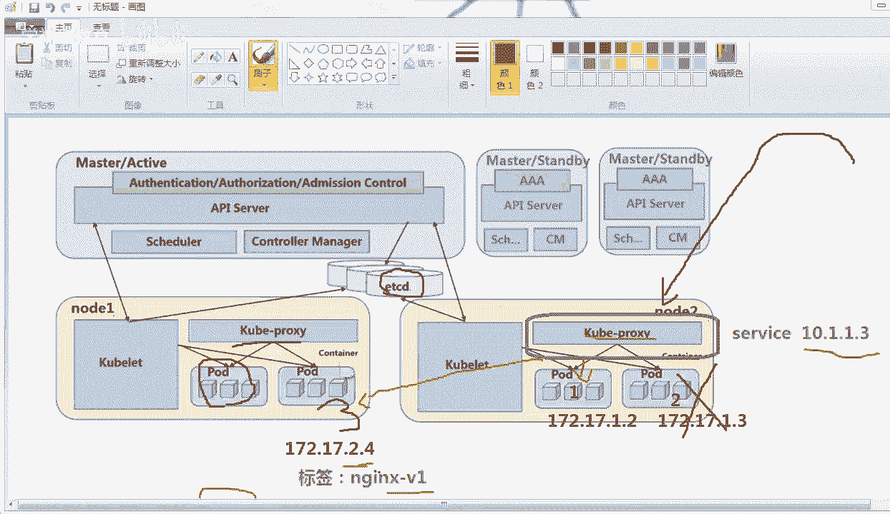
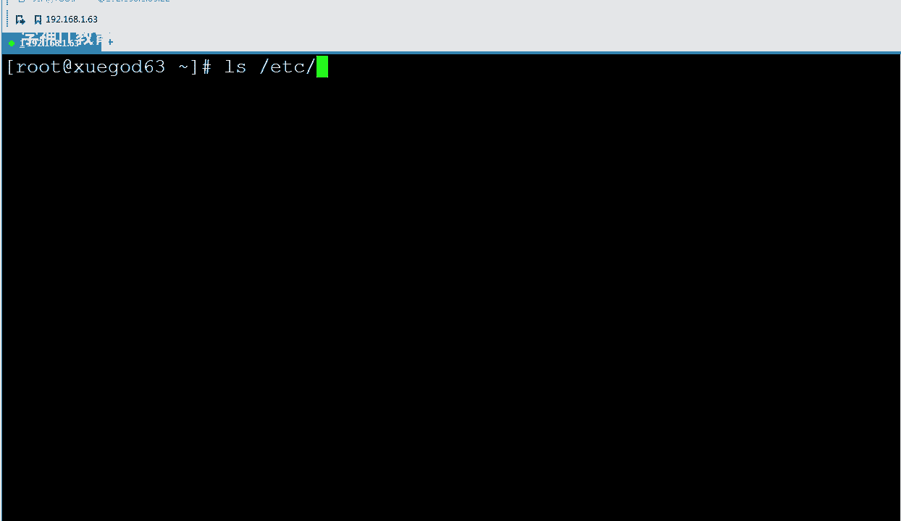
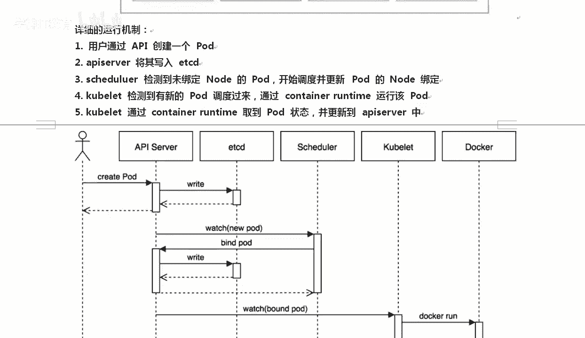

# Linux／Linux运维／RHCE／红帽认证／云计算／Linux资料／Linux教程--使用kubeadm搭建K8S容器集群管理系统 - P1：1-Kubernetes简介 - 学神科技 - BV1jK4y1a7DR

好，大家好，我是MK老师。今天老师要跟大家分享的是coer a去搭建K8S。那搭建K8S有很多种方法，比如说手动去搭建。那么手动搭建的话太太慢了，知道吧？所以后期我们在生产环境下。

我们更希望使用coer。因为它已经把所有的版本给你做好了，而且做成了docker的镜像的方式，你在部署的时候会更加的快捷，用起来也不会报各种各样的错了。O那说完这个以后呢。

我们先说一下K8SK8S到底是个啥是吧？其实它是coer这个单词的什么，你有的人可能中文发音就发成什么是吧？就简称就是K8S了。😊，啊，实际上你也可以读成coernet啊，那它是coernet啊。

kuernet是谷歌开源的容器集群管理系统。以前我们讲的docker只是在单台机箱跑的。你比如说像京东16万个docker或者30万个docker要在一个平台上去跑。那这个时候一台机器肯定跑不起来。

所以我们希望有一个人能管理我们这个集群管理我们的docker谁呢？哎好吧，谷歌开发的这个啊谷歌开发的酷net正好可以它是基于docker构建的一套容器调度服务提供了资源的调度，负载均衡服务体机啊。

注册动态的扩展和收缩都可以。也就是说这里面这里面是吧，连负载调调度器都给你搞定了，负载均衡也给你搞定了。好吧，你就不用再搭什买LVS或者ND。OK也不用搞什么k live，高可用了，他都给你搞定。好吧。

酷ernet是基于docker的容器平台，简称是K8S。啊，那他的官方网网站是哪个呢？是这个那在这个官方网站上，你也可以切换到中文，好不好？对，这是应该是难得是吧？还有一个中文网站。是吧啊。

难道还有一个中文网站是吧？就是国外的这种开源项目里面能有一个中文站点的，其实真不多啊。真不对，你从那个有同学会吗？在你的你打开这个页面以后，在它的右上角可以选择english，好不好？😡，对。

我们来聊一下这个K8S啊，聊一聊K8S它的这个组件。K8S中的大部分是吧，他把大部分的应用程序都抽象成了一种什么组件，好不好？抽象一种组件常见的这种资源对象有哪些呢？我们来聊一聊这个图，这个图复杂吗？

换张图让大家看一下啊。好的。我把这张图截出来给大家看一下啊。好。我们来看一下这张图。这张图其实还好啊，master跟我一开始看一下master master可以有很多master active。

那么就是说高可用的时候啊，这一台机器是活跃着的。还有那么除此以外，还应该有什么呢？还有master stand stand by备用的啊，stand by就备用的。你看有有N台备用的机器也可以。

那么今天我们主要是在两台，我用两台机器去模拟出来，好不好？然后这边是一台note一，这边是台note2，如果你已经学过open stack了，那其实对这种架构应该是轻车熟路了。好吧，应该是轻车熟路了。

唯一的这里面是没有什么没有什么存储节点。😊，各种node一note2都是提供各种计算的，好不？master就相当于我们open stack的控制节点。那master里面又有很多东西啊。

master里面比如说API server，这就是一个组件，好不好？一个组件，还有schedularAPI是专门提供各种接口的schedular是调度的，好不？

conttrol managerr是控制什么控制我有几个po的。😊，啊，控制我有几个poETCD猜猜是什么数据库啊，看那个图形你也能看到是数据库。然后呢，coer怎么样。

coernetcoernet主要是用来管理po的。😡，啊，主要用来管理po的，那么抛的又是什么呢？好吧？po里边有什么？后的是我们K8S里面最小的调度器。好吧，那么pod里面通常放的是pod。

这个单词是豌豆荚的意思。见过那个豌东强吗？😡，去超市看一下，就豌豆荚，就是平常我们吃的那个绿豆比较大的那种绿豆，你你也可以理成成豆荚，是吧？我们去买那个菜豆荚的时候。😡，是不是一个豆一个豆的对。

一个po里面可以有一个容器，也可以有两个容器，也可以有多个容器。😡，好吧，那么我们可以把多个容器合起来成为一个po，也可以一个容器里面只有一个po。好吧，存储全靠外挂说的就是这个道理啊，然后呢。

那怎么出去呢？访问的时候，这里有cuber proxy ，cuber proxy是一个代理，这个代理有负载均衡的功能。OK一旦我们去访问访问到，比如说访问到note一，会访问到cole proy。

 proy再分给下面的code。那通过我这样一说，大家是不是就心里有数了。好吧，stand by这个地方我们先不说了。😊，好，说完这些东西我再怎么样。所以我说你看满屏都是你不懂的地方，但是没有关系。😡。

学一个陌生的知识点，有没有方法告诉我有好吧，我教你，当你学一个新的知识的时候是吧，你就再死记硬背都不好使，先了解一下，然后然后直接上手。😡，好吧，上手干嘛，上手做这个实验，做出来以后啊。

做出来实验好不好？做出来实验以后，对，了解了是一个实，然后再怎么样再看理论。😡，不要上来，就把理论看得很丑，看完理论以后再怎么样再做实验。好吧，然后呢，然后再看理论。你就越看是吧，越有劲。

越看越能理解明白了吧？好吧，所以大家上来是吧，我不建议大家上来是吧，就把理论搞得哦好细啊，每个字都是吧，都拆的非常的细。那样的话反而会让你蒙，明白吗？这就是你们学一个新的技术应该做的，先怎么样看一眼哦。

有这样的各种各样的东西，这些东西都是什么，我知道了好，有好多我不懂的地方，然后就做实验，做做实验的过程中会加深你对po，你对ub你对ETCD的认识。😡，好不好，然后然后再看看理论再做实验，明白了吗？

那我们就来看看这些理论。通过我刚才的那个描述，大家其实心里是没谱的。真没谱啊。😡，啊，你其实心里你是没有谱的那我们来看一下mastermaster他是。它是我们KYS的集群控制界点。

负责整个集群的管理和控制。那么master里面通常又有哪些小组件呢？啊，我们来看一下master里面的小组件。你比如说有kuer是么，coer APII。啊。

酷宝AP server A server就是提供接口的。那么它提供了什么接口呢？提供了HTTPre服务。什么是res服务，不是reset， resets是重置啊，我们那个叫RES。😡，好吧。

rest APII是QQ8S的基础架构，组件之间的所有通信，包括用户的命令都是交给我来处理的。什么叫做rest的这种？了解一下，你为你们以前没做过开发reest的表示，它是什么表述型的状态传输啊。

简称就是这个单词的缩写就是state transfer啊，就是reest的一个缩写。它是一种软件的架构风格，主要用于前后端分离的。就现在我们经常开发的时候就好用到这个前后端分离。好吧，比如说VUE架构。

啊，后期有机会的话，大家可以学一学python啊。pyth里面我们就讲究前后端分离VUE好不好？那么再一个OK就是它能实现前后端的分离。我们这个开发的途形界面，或者说我们的这个设计理念也是这样的。

前后端分离，好不好？好，知道了这个以后呢，接下来还有个controller manager  control manager controll控制manr管理。

好不OKK集群中所有的资源对象的自动化处理和控制中心就靠我来去做这个事了。Oched负责调度好吧，调度，比如说我这里面有node一有node2，那到底我应该放node一上，还是把po放到node2上。

靠着什么？靠这个调度器来实现，我给你截个图啊？😡，来。对我们来截个图。好。我带着大家快速的带着大家过一下啊，知道了这些以后呢，还要n猜一猜这个no是干什么似的。😡，no的就是我们真正干活的事儿。

好吧node节点有时候老的版本里面也叫min就是这个单词，就是爪牙的意思。好吧，node节点是K8集群工作中的工作节点。好吧，就真正干活的那台机器叫做node节点，你可以有好多node节点，好吧？

O node节点的工作负载，主要用master来给你分配，我分配你上面跑什么，你就跑什么？那通常我这上面有什么东西呢？在我的node上通常有kuber主要是负责po的创建启动。好吧。

就是后面我们重点关注的，就是比如说我们这边要起一个po，相当于你也可以理解成我们要起一个什么docker实力了。比我要起一个N的实力，我应该用哪个镜像，我应该分配什么样的IP给多大的资源，对吧？

那么它都是谁呢？😊，真正操作的时候都是coer light3note这样给你去做这个事儿。coer proy主要是实现什么service服务的通信和负载均衡，主要是提供网络这一块的。一旦有一个什么数据。

比如说我从外网进来，访问的时候要访问到note一或者是从外网进来，要访问到note2。那么访问到你这里面，你下面有好多什么容器，一台机像，比如说有40个容器，我到底应该将数据怎么样来到proxy上。

然后我到底应该转给谁？那么在proxy里面。他会帮你去转发啊，具体怎么转是吧？在这里service里面，我们定义服务的时候会给你写的很清楚。好吧，那有同学老师到底什么是po的呢？

那我们来聊一聊这个po的啊。😡，同学们认真听好不好？popo是K8S中最小的部署调度单元。所以这个里面我们就不来聊什么，不再聊conter容器啊。好，每一个po都可以看成是一个或多个容器的一个组成。

一个po可以表示某个应用的一个实例。比如说这一块就相当于启动了一个Nex。看到了吧？你的pod里面可以有一个，你看这样最源端一个po大概就是这么样的一个组成部分。比如说有最源端有IP地址，好不好？

有volume可以挂在卷，好不好？你也可以contAPP具体有程序。当然这几种形态都是可以的啊，我可以只有一个啊，我也可以把容器和vole卷，也就是存储挂在上，也可以不挂啊。

甚至我可以有多个挂一个都是没有任何问题的O那假如说我这里有我希望这台po里面啊，pod里面有什么呢？有两个。😡，好，有同学老师po的 po到底是什么？po的这个po的呀，我先从英文单词上跟你说一下啊。

英文单词叫豆荚好不好？什么是豆荚，这就是豆荚po豌豆角啊，绿豆是吧？一般夏天吃个凉菜的时候是吧都喜欢里边有这个。😡，看到了吧？po对pod将它封装起来，里边就是我们的刀cker容器的实力。

对吧你你也可以理成毛豆是吧？对，这个好像还不是毛豆啊，你看到了吗？这个图要比要比上面更形象一些，是吧？😡，好，这就是pod啊，那我们知道了，好吧，知道这个po以后呢，我们来看一下谁能控制po呢？

假如说我这里面有我希望我的这个pod里面跑的什么，跑的是两个容器，还是三个容器，万一有一个容器挂了怎么办？😡，对吧，或者你希望到底我跑几个。

谁来指定这个relica siterelica replica就是副本的意思。它是副本的抽象，取决于po，就是你希望开几个一样的po。😡，啊，比如说后期我们在配置的时候，rap这个地方。

我们写了两两个pod，那代表我有两个po啊啊，它就代表我创建的时候会创建两个pod。那万一其中有一个pod挂了怎么办？比如说我现在这就是两个pod，万一其中有一个po坏了怎么办呢？😡。

如果换我们现实生活中坏了，我们自己重新把服务器一下是吧？我告诉你，有了K8S就不用这么麻烦了。dloyment deploymentloment表示部署，它的内部好不好？

使用什么relic site来实现。比如说我这里抽象副本上lic site，我给你配置了一下。我说你这个地方relic是吧，等于2副本数要是2，也就是我需要有两个po，那么两个po在真正部署的过程中。

dloyment看了一下哦，你需要两个，那么我可以通过deployment来生成相应的副本数，最牛的是什么啊，最牛的是一个副本，如果挂了以后，dloyment能够自动再帮你生成。😡。

是吗生成一个完整的副本好吧，就相当于什么负载均衡高可用一样。一旦有一个挂了挂了没关系，我还能再怎么样再起一个。😊，能理解了吧。啊，他还能再给你起一个。好，知道了这个以后，我们再往下还有一个挺好。

还有一个东西也挺好的。叫什么呢？叫这个service。就是未来我们到底应该怎么提供服务呢？relicment deploymentment只是说我们启动了两个po。那你想想这两个po是吧。

我起了一个po是吧，我起了两个po。😡，那么别人怎么访问我？😡，对吧因为docker的IP地址都是什么172那一类的是吧，别人怎么从这里面进来访问我呢？😡，对不对？你得在什么co pro上给它指定一下。

那么我们来聊一聊这个东西。首先呢上边有一个叫service服务的东西。service是什么？是K8S的一个重要的资源对象，它定义了服务的访问入口，我定义了你怎么访问我好不好？比如说K8S里面应该怎么调。

因为什么呢？然后呢，服务的调用者可以通过这个地址去访问服务后端的pod的副本，就可以访问后面的副本。service可以通过类服务这一块主要是通过label select叫标签选择器。好不好。

去和后端的po建立副本关系，建立关系啊，然后deployment能够保证副本的数量，也就保证了整个服务的延缩性。什么意思呢？是这样的啊。我们都知道这个K8S它是个高科用的一个东西是吧？

假如说我现在我要去访问了，访问的时候我有两个po，这个没得说好吧，这是一号po，这是2号po。那么在运行运行的过程中是这样的，192168。我给大家写一个啊，172。16点17也行啊，随便写个地址。

假如我的IP是这儿。po2的IP是172。1。72。1。3好不好？这都没有任何问题啊。好吧，这都没有问题。中间运行的过程中，万一比如说这一台机器或者一个po卡死了，或者这一台机器挂了。

那么这个po自然就会怎么样？😡，这个port肯定就完蛋了嘛，好吧，完蛋了以后呢，我们的dloyment好吧，它能够保证后端的副本数。😡，好吧啊，假如我在创建的时候，我指定了副本的数量是两个。

那么dloyment它能实时监控我的po状态，一看有一个人挂了。好，挂了以后怎么样，挂了，我再生产一个出来就行了。我我从这给你复制出来一个啊，假如说我从这边又复制出来一个，好吧，我们就拿这个来说也行。

因为他在哪个既可以在note一上，也可以在note2上。这个时候我又出了一个pod3。好吧，哎，这个时候有个问题，pos3的IP地址19172点171点是吧，我可能变成2。4了。也就是说，po3的地址。

po的地址它是动态变的。后地址是动态变的，这就要求怎么样？我们以前正常是直接能访问到的，你的IP是不变的。现在你的IP老变，那老变，我怎么访问啊？😡，对吧虽然你高科用挺牛的，我老变我怎么访问呢？

那么这个时候怎么办呢？对，这个时候我们需要在上面抽象出来一层，好不，我在你上面给你怎么样包装一下，把所有的po什么。在这里抽象一层放到这儿放到这儿，这个叫什么呢？叫service，你们不用管。

K就实现了一个这样的功能service你们直接访问我service的IP地址就行了。比方我的sS是1。21。3，所有人访问的时候，只访问serviceIP就行了。好不好？下面的po是吧？一旦你坏了。

坏了，它会重新起一个起一个po以后，每一个po都有自己的标签。能理解我意思吗？label标签，比如说我这个标签叫ND，我们都叫NDV。好吧，那么新生成的V3也叫NexV1。好吧。

我们的service能够根据标签去怎么样，对我能根据标签去找到你。原来你也叫service V1好吧，你也叫serviceV1，我能找到你。对于我们上边的人来说是不需要关注的。

他们上边的人只需要访问service就行了。明白了吧。好，我来给你看一下。你大体上了解一下。这就是所以在这里面我们讲强强调了一个很重要的概念，就是我们的poIP地址是老变的。😡，好不。

原来你们所有接触的服务都是告诉大家，应该配置一个静态P。今天我告诉你，K8S0透的是一直变的那我怎么能找到你变化后的这个东西呢？我给你打个标签。😡，好不好。

我们的service有什么selectctor。清楚了吧？我们的service会通过label select，这就是选择器。每创建一个po，整个K8S里面是知道新创建的pod的标签是多少的。好不好？

我在这里稍微画一张图啊。那通过这张图大家也能看得到。哦，假如说我们这个地方label selectlabel select里面有很多label。比如说第一个label是APP等于A。

第二个la叫做APP等于B。好吧，那么我这个serv b这个服务这个服务我的对应的地址是10点10。92，好吧，它里面怎么去找对应的这个po，根据标签哦，你的标签叫APP等于B。

你也叫你也叫那我的service就能把你们三个串联在一起。好吧，那么你这块只有一个人叫service是吧？那么service A直接找到APPA。这样的话就能找到了。有的同学找到又能怎么地呢？😡，嗯。

找到以后，我访问到10点多的这个地方的时候，你怎么知道应该分给谁？想过这个事吗？对你看啊我换一张图给大家看一下。对啊，我们确实根据选择器找到了是吧？那一个流量访问到了什么9。2以后。

对吧你想过这个问题吗？我们的一个流量访问到9。2，我怎么知道应该将这个请求转给你还是转给你，还是转给他呢？😡，想想这个地方。你怎么就能知道呢？对，这个地方。想想这个地方。有同学蒙了是吧，好吧，蒙了。

如果我把那个东西给你简化一下，其实你就不会蒙了啊。😡，真的，如果我给你讲话一下，你就不会懵了，我们怎么讲话呢？假如说这样啊。对你想想，如果我给你做一个最简化的一个操作，就不会加入一台机器是吧。

看到了这个了吗？😡，好不好，一旦有人是吧，来访问我们这台机器的时候，我的这台机器能够自动分给你，分给他，分给他这个图不图熟悉吗？LVS是不是就是这样的？好吧，ND是不是也能实现？加个负载均衡器就行了。

对不对？原来你们是需要搭这个负债军争器的，现在呢？对，现在不需了，好吧，现在我们上面有个好东西，这个好东西叫什么呢？cer proxy，我们从这吧，画的有点多了啊，cuber proxy。😡。

他能干嘛使？想想。同意们来。第七条service service凭什么能跟别人去分呢？靠的是这个东西。kuer proxy叫做代理，有它可以做端口的转发，相当于LVS的什么啊。

你可以理解成LVS的n模式。😡，好不好？实际上它就是负载均衡，相当于LVS负载均衡器。好吧，相当于一个负载均用器proxy它就能解决了同一速度相同端口冲突的问题。假如说我的一个客户端过来了是吧？

我要访问你的服务上的80端口好吧，你可以将这个80端口映射给他。那我哥们，我也想将我这个po映射给你，他也想想po映射。我就一个端口，我怎么做那么多的端口映射，没关系，做一个负载均衡器好吧。

轮巡一下就行了。实际上他是可以的啊，负载均容器O对外提供了啊，后面我可以采用什么proxy的后端可以有很多算法，比如说轮巡了轮巡负载均衡啊，加权的等等都可以。😊，清楚了吗？

这样的话就解决了这样啊解决了这个问题啊。好，我们知道这个再往下，我们来聊聊什么呢？ETCD好吧，整张to图里面是吧，这些东西我们都认识是ETCD数据库是吧？😊，对吧ETCD这个数据库。ETC是干嘛使的？

😡。

想想这个是不是ETClinux下的ETC是干嘛使的？😡，所以大家对一些新知识是吧，你要能够什么举反三ETCETC是不是存什么纯配置文件的？ETCD就是专门存配置服务器信息的一个后台运行程序。

清楚了吧，Dmon好，所以ETCD就加了个D好，它是一个专门存储配置文件的后台服务。配置不能说文件啊，从指配置。信息的数据库后台服务。这种数据库是非关系性数据库啊。

K和value的方式就类似类似于我们的readdis。😡，啊，他是他是这样的啊。黑和 value的方式来实现的。OK。😊，好，那接着。你比如说它这里面存着什么呢？我们整个云平台肯定得有一个数据库。

但这个时候数据库不是阿帕奇，不是不是my思口，也不是or口。整个整个KYS的平台里面，我们用的是什么ETCD这种数据库。这种数据库通常会。就是这兼职对这种方式。比如说我有一个什么呢？嗯。

假如我有一个int是吧，呃，int subnet那么。通常情况下，比如说建制对嘛，这个它对应的是什么呢？它对应的，比如说是192168。1。

0-24这样一个字源源码等等这一类的信息里边存着主要是所有节点po和网络相关的一些信息。其实好不好？就是一个数据库啊。好，知道了这个以后。😊，我们来往下接着。我们聊一下K8S的整体的运行机制，好不好？

K8S整体运行机制是这样的啊，我们先搞一个稍微简单的一个实验图图，让大家看一下啊。好吧，OK这个图能看懂吗？😡，这个时间突不突？我们来画一下这个图。

大体上让大家知道K8S这个访问的这个流程是什么样的一个流程。好不好？这是谁？这可能是我们管理员嘛，对吧？然后这边是外网，这边是我们的防火墙，对吧？我们整体的这个操作流程是这样的。😡，哦。

我们来再次画一条线。数据我们通过AP server好，这个接口去做这个事情。整个这一块EDCD管理端master a server scheduleched是吧，包括po的副本。

这一段都是我们的什么管理节点啊，master节点。好吧，下面的minmin一min2其实也就是我们的node一note2。好吧，它是一样的啊，你可以叫min也可以叫node。

OK我们然后所有的这个跑的时候，上面还有个酷er proy，接下来还有po，po里面有各种各样的coner容器。当我们去调好以后，比如说我们起了一个N。那么在这里比如说会有一个N code。啊。

old谁呢？old N。好吧，这里会有一个po n，然后呢，这边也有一个po n。好吧，他会有很多po。那么访问的过程中是吧，我们对内或者对外访问的过程中是这样的啊，比如说他能他去访问学干的62。

或者你去访问学干的64，这都可以啊。😡，都能访问。OK6264，你去访问的时候是吧？OK这样的话都能去访问到这些po。通过什么procy，然后就传递给了下面这些。OK。上面所有的他有一个特点。

就是你去访问每一个什么物理机的IP地址都可以。啊，都可以正常访问。集群内部的话可以通过什么，后期还有classlaststerI，可以通过内部的classI进行访问。OK大体上这个流程我们有没有问题。

就是这样的。一旦我想去访问NG的时候，当然我一会还要做一下端口映射啊。😊，啊，我还要做一下这个IP绑定IP的端口绑定。你可以去访问他，我通过ma去管理你们几台机器就行了。这样其实挺好的，是吧？

也没有什么流量上的瓶颈。从而我这进来，从我这出去都可以。好，我们聊聊这个详细的运行机制，它的详细运行机制是这样的，好吧。OOO。用户通过API创建1个po，我通过API是吧？

我要create创建一个po。那么创建你要创建一个po是一个什么？是一个动作，是一个操作是吧？我要将这个数据首先写到ETCD数据库里APIserv将它写到ETCD数据库里面，好吧？写完数据库以后。

有给我一个反馈给API一个反馈，说我这边开始要写了啊。然后呢接下来怎么样呢AP既然我已经写到数据库里，我 server就要开始真正的进行调度了找到测没有绑定ode的是我这个地方空闲的一台物理机。

然后呢我开始调度并更新并给它绑定一下啊，我这边要打算找到一台调度器，我找他一台空闲的物理机，我给他起一个就起cker完以要给个反馈负责给你们所有人说话啊，然后呢，既然你O了，那既然你已经决定要给他绑了。

我要把绑到哪台机我把一个信息告数据库写到数据库里面写完数据库就开始真绑下边绑的去看一下应该绑个。😊，我要看看你到底绑成功了没有？co是专门用来操作我们是吧？比如说这个时候我肯定要创建一台真正的po了。

那co就正好是用来干这个事的。它去替你真正在物理机上创建一下创建完以后，那里面的docker实力就要运行起来啊，那就来到了docker一块运行运行成功了，告诉我下再怎么更新一下的状态。

原来你是关闭的状态，现在状态已经运行了，告诉AP再给你写到ETCD数据库里面，这就完事的，好不好？这个小图明白了吗？那这是K8S概念和主要组件的作用。稍后我们来安装一。

