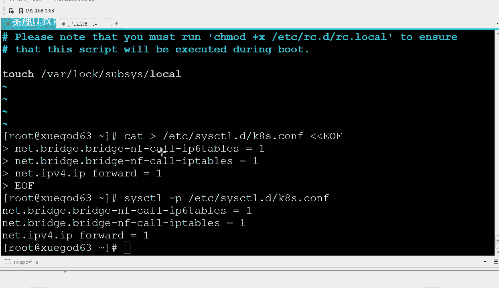
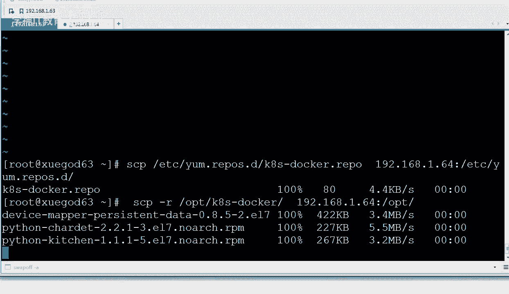
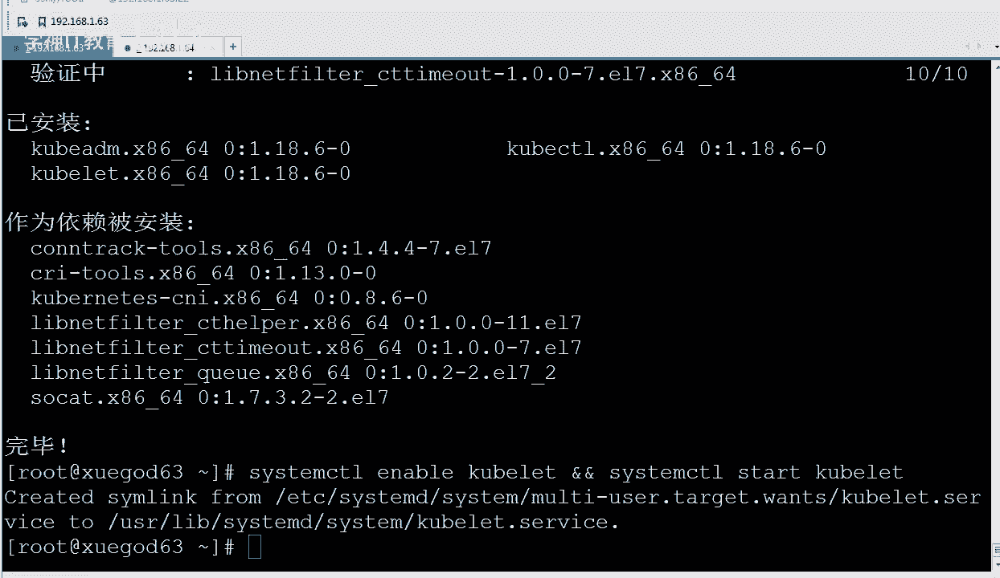

# Linux／Linux运维／RHCE／红帽认证／云计算／Linux资料／Linux教程--使用kubeadm搭建K8S容器集群管理系统 - P2：2-使用kubeadm部署Kubernetes集群 - 学神科技 - BV1jK4y1a7DR

前面我们聊了那么多，那么今天我们来真正的搭一下，我们使用coer a的方式去部署Kk真正如果手动去部署的话，耗的时间挺长的啊，现在主流的话都是用coer a命的方式。

就像我们搭搭什么搭open stack的时候，有对应的脚本可以帮你快速的去部署成功，好不好？那我们来看一下，我们今天所做这个事情啊，呃。

角色master slaveve slave其实这个地方应该我觉得应对它应该叫no啊。node的角角色node就是真正干活的，我只有一台机器。好吧，这一台机器你可以是4G，也可以是8G啊，我给的是8G。

😊，然后n这个节点给的是多少呢？给的是4个G。好不好，我们来试一下这个操作啊。首先呢我们这波操作前面应该有很多步骤都是之前通用的，所以我操作的稍微快一点。第一个，你要生成密钥盾，拷贝到1。631。

64这两台机器上，我们来登录一下。

好，这一台机器登录成功，再来一台啊。

我这其实早就安装好了啊，酷宝那酷宝的命安装K8S note，所以你也要怎么样？你做好了以后，你记得见个快照。好不好？对，这快照啊。编辑一下虚拟机。4096。磁班100个G啊。这边开启了这边也开启一下。

对，两边都启动一下啊。让他启动一下，稍等等他。让他启动一下啊。首先我们生成密钥顿SSH杠KG一路回车就可以了。好不好？生成完了以后拷贝一下SS copypy IDD直接对19。1921681。

63拷贝一下。实现无密钥登录，这样的目的是为了后面我拷文件的时候方便一些啊。瞪大爷你的眼睛看啊，别你的眼睛跟不上我的手速是吧？好，拿完这些东西以后，你的app tables你得给我关了，好不好？

中间因为会开很多端口号，甚至3万以上的端口号，你记得关一下，6364两台机器都要关。😊，我如果需要对两台机器都执行操作，这个时候怎么办？假如有一些操作，你需要对两台机器都执行操作的话，那你可以往这儿站。

用过吗？好吧，粘到这下面s team start farwell system disable，然后然后在这下面可以选选择你要用的是全你要对全部绘画进行搞一下，还是怎么怎么样。我选的是全部绘画好不好？

然后呢，我粘到这儿以后，以后这一类的命字，这一类的命令是吧？我只要往这一粘，然后啪一回车一回车两台机器都执行了。这一招学到手了吗？好，那除此以外呢，我们还有一个。对。

set enforce force等于0给它关一下。除了这样关，这叫临时关是吧？你也可以永久性的给它关。那么永久性关我使用的是s命令。好吧。

我们set杠Ilinux enforcing给它替换成diable就可以了。当然这个时候你可以reboot一下啊，我就不reboot了。好，除此以外，还有一个东西你应该是没搞过的。

关闭swepe分区。好不好。看到了吗？关闭s万amp分区啊。所有分区大家都知道是吧，内存不够用的时候用它，对吧？每一个步骤我都会给你写的很细啊，你自己做的时候。😡，看清楚是在哪排迹想去做的好不好？

63啊，这边64。给你写的非常细了啊。那么关闭swipe分区，对我们是需要关的，会关吗？

都开过是吧？😡，没有关过是吧，free的时候，我们去看swipe分区有一个G是吧，都知道关闭的时候怎么关呢？是这样关的Swepe。Of。好不好？这样就关了吗？对，这样就关了，两台机器上都要关一下啊。

OK关完以后呢，frreee看的时候就00了。😊，好吧好，这有00了。那么除此以外，我希望永久性的关闭，好吧，永久性的关闭怎么办呢？你把所有分区怎么样注释一下就行。VIM打开FS table。好吧。

那么我们去永久性的关闭一下，就是就在哪哪个地方，就这给它注销一下就行。好吧，保存退出这边注销一下，然后这边也注销。他需要关这个呢啊，不关的话，使用的过程中会出问题。官方文档上也是这样建议我们。好吧。

两台机器都关闭一下。

O。😊。

V杠M。以前没搞过这个是吧，所以越到最后你会发现你还有好多linux东西，你是不会的，是吧？

好吧，记得啊，关闭sF分区两边永久关闭63，这样永久关闭一下。同样64你也要永久关闭一下啊，两台都要注视，都要去做这个事情。好吧，大家看我的文档的时候，我没敢给你准备太多的机器啊。做这个实验本来就。😡。

怎么样？本来你就对很多东西陌生，我应该给你正常，我应该准备三台或者4台机器。是吧我要把note再做成ma做成高可用，那就得5台机器了。好，知道这个以后，还有一个。还有一个参数。

BR night filter。这道吗？看到了吗？OK。😊，BRnet filter这种东西好吧？BRnet filter这个模块是用于将求究流量转发至IP tables的。好吧。

内核会需要用这个东西来转发数据。其实我们当时如果安装完docker的时候，我记得我以前跟大家讲docker的时候，docker in的时候查看的时候有有几个warning，还记得吗？

warning那个时候就告诉你什么呢？那个那个地方就告诉你BRnet filter这个模块没有开启，那你得给它开一下。

知道了吧，OK那么怎么看呢？n filter这个模块可以这样啊，eu name我们先看一下我们的内。😊，内核模块EUname杠2，我们内核是3。10，好不好？没关系。

那OK mode probe可以加载模块，我们加载的是BR下滑前n。Night future。net filter这个模块大家知道吗？防火墙经常需要操作I tables是个操作工具，大家还记得吧？

这个操作工具真正的管这个网络这块是谁呀？是内核里的net filter这个模块。好吧，就I tables大家都很熟悉，实际上它只是个工具，真正干活的是net filter的一个模块啊，内核里个模块。

你要把它挂载一下啊，除此以外呢，我希望它能够自动挂载开机挂载。你可以这样去做echo net mode好不好？放ETC profile下。😊，这样可以一直让它啊一直挂在。好不好？好。那知道了这个以后呢。

我们再往下还有一个东西。还有个东西。

我先写到这啊，给大家。看一下。cut好吧，我们去查看好，我们去查看啊查看的过程中。好吧，我们再去我这样写，大家能能理解是什么意思吗？😡，啊，通过这个ca。

这就结束了，知道我在干嘛吗？😡，对我们再往ETC teamL好吧，这下面这下面写了一个K8S点confi。那么这个里面写的是net filter bridge是吧。

等于1IPV6等于1IP tables等于IPV6的tables和IP tables都是一。然后呢，IPV4等于1好吧，我就其实就是对这个文件写了点东西。😊，好吧。

原来我们教大家的时候都是怎么叫CCTL是吧，fi是吧？看到了吧？原来我教你们写的时候，是不是都都教你们写到这里面？😡，是吧在这里面我们要写一个，比如我们开启路由转化功能。

我们就写netIVI four等于一是这样的是吧？好，我来跟大家说一下啊，从这个通S7开始以后，我们我们就是你可以能看到国外的很多文档已经不再这样去写了，就是我们不再去操作它的主要配置文件。

你看他不是写的吗？你应该操作的是一些C下的sTLD啊，你可以在这里面去添加一些新的配置文件。😡，OK好不好？那我们来看一下啊。对，在这下面ETCCTL点D。😊，好吧。

你从这下面去添加你一个这样的confir配置文件就可以了。好不，那添加完了以后呢，CCTL杠P。好吧，去加载一下。就可以了CCTL点第一项的K8S configurefi。这样的话就会生效。明白吧？

那么除此以外，还有一个你会配这个吧？Ancle dollar pass。对吧我们假如我们我们想在这个pa下再加一个java home。等等这些东西。那么除以前我们改的时候就是VM。啊。

很多情况下就是VMETCpro。fi就打开它打开它在它的后面，我们就写EX exportport，然后啊pa等于什么dollar pass等等。我们会这样去写这个操作，对吧？那么现在不是这样的。好。

我们现在还有一种写法是什么呢？你不在这上面吗？ETC下proprofi下还有个profi，你在这上面写一个点sha文件就可以了。好，你想改什么东西，你就在他下面写。写文件就行。

比如说我在这下面写了一个什么呢？写一个这样的文件啊啊，写了一个N点SH。然后这下面我就可以加一些Nex的环境面令了。export等等一些东西，听楚了吗？OK加点东西。

或者说嗯我在这里面想做一件坏蛋的啊坏事儿。比如说我想执行一下RM删除根。一样是可以的。懂我意思吧？比如说啊。扩展了一下啊，我们toch一下。PMP下A点TST好吧，an输出一下海cker。保存退出。

那么我就就随便在ETCpro点地写写了一个这样的东西。当你下次再登录linux系统的时候，你会发现什么？看到这个海口了吗？对你被执行了。TMP下也会有A点TNT，你能想到了什么？搞诉我。

你从来没有想过是吧，黑客还可以往你这下面去添加木马程序吗？现在你们都用的是7。没有想过吧，没有想过的话，敲个一。我们在六里面其实是没有这种操作方式了，就很少有这样的操作方式。从7开始。

我发现整个这个操作系统还有很多配置文档上都是。都是这样去做的。好好。有同说我想起来。想起来女朋友送我的这个安全法了是吧？哼没事哈。😊，你知道就行啊知道就行。好，我们知道这个以后呢。

同样在这上面我们也做一下啊，这台机箱也需要做一下。😊，好，我们在这里。ETCpro啊系统启动的时候也会去加载这个东西，moode problem是吧？加载一下，你也可以写到RC点logo上啊。😊，21。

lo口里面。好不好？对，这个地方也是可以的啊。你把这个modode problem是吧，如果没有加载成功的话，你写到这上面也是可以的。好，那知道这以后呢，我们再ca一下。追压一下追加完了以后。

我们试一试一下。好不好？既然讲到了高级这个地方，那我们就得玩点高级的。对吧好吧好，所以就很少我再去VIVI打开，然后再做了啊，怎么高级我就怎么来了，好不好？6三上配好了以后，6四上也得赔啊，两边都得赔。

😊。

配完以后都得让他生个效笔记，我给你整理好啊。

好，两边都生效了。生效以后呢，我们接下来去先上一个。

因为我们的K8S是基于docker来跑的，所以我们怎么样？好吧，你每台机器上都应该有1个K8，就是你你每一个节点上都应该有个K8S。

好不好，清楚了吧，对你你应该有一个docker啊，对你的K8S的每一个节点啊，不管你是管理节点还是什么节点，你的每个上面都应该有一个docker。😊。

好吧，你的每个上面都有一个docker，因为尤其是我采用酷er的命的方式。去配这个事儿，更应该有一个打卡。

那么单件docker呢，他要从网上去下，好吧，y么int是吧，docker杠CE就行。我呢提前已经把K8S docker。理线包给你准备好了。好，我们解压一下，我给你准备的是。基于7。6的。

所以你也你也在7。6下去做这个事情啊。好不好？我的离线包就是7。6的，所以你要在一个s通S7。6的机器上去做啊，然后呢我们去配置docker的什么docker rip文件。

reple文件里面写的是K8S docker name等于它base uIL等于OPT下的K8S docker enable等于一咱就起活了。又一种写法见过吗？😊，刚才我给你用的是cat。好吧。

看到了吗？刚才我用的是cat这种方法，监括给一个文件，然后UF。

好吧，UF那么现在又来了一个新的一套。T。T也可以，好吧？T的话就少了什么cat减括号，这一就少了这个步骤了啊。开头他们。对比一下。啊，cat的这种方式，还有一种方式是T的方式，T的方式跟它一样。

少了前面这一块。OKUF结束就行了。那么当然T还有一点，他能把输出的内容再次给你显示一下，不仅能重定向，重定向上完了以后，把这个内容也给你显示了一下，这一招学到手敲个一哦，这两种方法都好使啊。

其实就你看这个语法很简单，TT后面跟上一个文件就行。然后呢，两个间括号。

啊，当然是呃反向的一个监口啊。OK。对吧UF好吧，UF就可以了啊。我这怎么还多了个这个符号啊，其实没有这个符号啊。

我这多了一个减号是吧，实际上是没有这个减号的啊。啊，实际上是没有这个型号的。我可以给你再重新搞一下。

对他是没有这个讲了的啊，比如说我这里随便写1个ETC下，随便写一个。A聊天题啊。UF这个地方加个空格就可以了啊。

啊，有时候笔误你看到了吗？parttETCA点TNT完美。没问题啊。都正常，好不好？好。所以有时候敲的时候。可能笔误了啊。好，那么63的离线的刀cker源已经OK了，会配了吧，解压一下。

解压完了以后生成对应的样本文件就。

report文件就可以了啊，重新给你整理一下。好吧，先解压，解压完了以后，通过T生成一个reple文件，生成完reple文件以后，64也做一下学杠的64，我们一共就两台机器啊，master是一台机器。

学霸的63是一台机器noode我只是加了一台啊。啊，因为另一谈的操作方式跟主要一谈会了，其他的方式都是一样的。

好，那6464是这样的啊，直接拷贝就行。SCP将K8Sdocker文件拷贝过去。除此以外，将离线的原野拷贝过去。好不好？

拷贝完了以后，那么。我们来配置一下这个。来，看这儿我们来使用什么呢？这边配置OK了以后，我们在学挂六上去配置一下在线的酷K8S的样明。啊，有同学老师。

我想在线去装KSdocker前面在线的语言我教过你啊。

好，那么他的这个原是通过什么呢？通过这个方式。我给你拉拉下来啊。好。太快了是吧？那没关系啊，那我来给你VI打开一下啊。😡，打开这个配置文件啊。有同时我还没看呢，就完事了。VMETCK8S点repo好。

我在这里面写了是什么呢？写的是这个name等于K8SK8S么ID name等于K8S。然后bUIL走的是阿里云，阿里云有自己的K8S。😊，好不好，OK。😊。

那么enable等于1GBG check等于这个，然后repleGPG check等于1，然后GB密钥密钥是谁？密钥是这个。好吧，其实我这个地方检不检测都行啊。😊，你从阿里云上下来的。好。

执行完了以后呢，还有一个。6464我们也也需要配一下啊。对吧64也是一样的啊，我们可以将64这个地方将63上的东西复制给64就可以了。好。完事了以后，你看一下64上ETCy点repo。

这上面已经有了什么呢？有了s透S是吧，base64base这都是。主要是有了docker，我看K8S。K8Sdocker和K8S啊，这两个就都有了这两个语就可以正常的去安装了啊。😊。

OK那现在我们搭好了基础的设备环境。

好不好，我们是刚才有同说，你刚才怎么那么快？😡，刚才我执行的是这个命令啊，就是T好吧，EETCyM点res点DKYS点repo。好吧。UF啊。OK对我用的是这个啊。😊，好，我们拿到这个东西以后，然后呢。

将63上的这个K8S文件一好吧，样品样的配版配置文件也付给他。付给他以后，我们现在就可以搞了。也就是在master和note上去安装coermin的组件啊，用于后期安装K8S，现在还没开始安装K8S。

你想安装K8S，那么你需要通过什么？

对，在master上和note上去装一下这个组件啊。将基础设施装一下，基础的包装一下。yinst酷宝 CTL好吧，酷er light和酷宝的命将这几个东西安装一下啊。64上也需要安装一下这些基础的包。

因为我配置的离线啊，所以他下的速度会快很多啊。好，稍微等等他。有机会大家可以把这个K8S的这个酷宝的命。啊，这些东西也做成离线。这样会更快一些啊。总下载62兆是吧？这边也安装一行。

你也可以把这个酷宝CPL酷er light和酷er的命，把他们也可以做成一箱包。这样安装起来会更快一些啊。

好，我们稍微等等他。好，我们来快速的把笔记给大家整理一下啊整理一下。因为K8S它的搭建确实挺复杂的，他要装好多的组件啊。好吧，在master和note上安装K8Skuer的min组件。

用于后期安装K8S使用，好不？那么要instore去安装kuuber light是干嘛使的，kuer light是运行在集群所有节点上的，主要是用于启动po和容器。后期我们master上也要启动po的。

好吧。因为好多东西也是基于酷宝也要启动容器的啊，也要启动容器。酷宝的命令是用于初始化整个集群的啊，启动集群的一些命令工具啊也在这里面。酷宝CTLCTL是干嘛式的控制是吧？用于集群命令通信的一个命令行。

通过它可以用来管理和查看各种资源。嗯，比如说我要看一下集群的状态啊等等。好，那么知道这个以后呢，我们接下来。安装完了以后，你要把kuuber light这个服务器一下。cuber好不好。

让它也开机启动一下啊。好，64开一下是吧，取一。

这边也开启。那这两个都OK了以后呢，我们最后呢需要在两台机器上分别再安装一下什么。

docker好，我们需要在两台机箱分别安装一下docker啊。好，安装一下docker。

要么你扫两台机样都要执执行啊。先把依赖包时装上。装完以后，我们把刀号CE给大家也装一下就可以了。然后把刀号一启动。接下来就没什么可操作的，因为所有东西都给你封装到刀坎容器，刀坎的镜像里面了。

等他安装一下啊。好，两边都执行成功了，这是docker的依赖包。

好，执行成功了以后呢，我们执行这个命令啊，就是算了，我直接站那吧。

我们要将刀口CE给装一下啊。

稍后我们把那个服务启动一下就可以了。

你先我给你的笔记是先写的是63，然后再写的是64。实际上你做的时候，两台机器一起做就可以了啊，这是安装docker的依赖包。然后呢，样minstore docker跟我们之前讲的是完全一样的，好不好？

对，然后安装完了以后，six team start docker给他启动一下。好，我们让他慢慢的安装一下啊。

我现在这个已经安装好docker了，安装好docker以后呢，我们把docker服务时候，在两台机箱都启动一下啊。

好不好？两台服务都启动一下，s team start dockers team enable docker两边服务都启动一下。啊，没有任何问题是吧？记住可以在这里面去发啊，记住可以在这上面发。

其实这种有点像自动化运维那种uns一样是吧？一台机器对所有机器进行一下操作，有这个意思是吧？好，除此以外，我们还需要配置一下什么？因为我们中间可能要下载一些K8S平台上既然是基于docker来跑的。

所以我们肯定需要做一件事情，就是配一下什么？配一下加速器，好吧？定向的加速器。😊，试一下啊。这个不行啊，这里面有回车就不行了。嗯。😊，好。好，我们重新重新来啊，我们来做一下这个T。😊，我们要写一下。好。

有同学又懵了是吧，一看我这样操作。

操作的是什么啊？添将阿里云镜像加速地址，并且修改docker的文件驱动为s team d啊默认docker的文件驱动为C group FS啊，你要改它一下ok默认规则就默认用的是s啊。

所以两者必须是一一样好吧。如果你单纯的跑docker是吧不需要去改这一块改哪块呢改这块 group driverver等于s好不好？

O如果你单纯用docker的时候是不需要的let默认用的是这一套所以你得加然后呢register指定向一个阿里云的地址O通过T的方式去实现。两边实现了以后，两边都要dereload一下就可以了啊。

sstemload，然后呢，st team restart启动docker就可以了。好，这样的话，我们在63上就配置成功了。

你知道什么这个docker systemem D跟sem D跟C group FS是啥关系啊？

知道吗？扩展一下好不好？docker文件驱动sMD和这个是什么关系，我们来聊一聊。因为这个东西对你们来说其实挺陌生的。s groups首先说一下Cgroup是内核提供的一种机制是吧？

后来当linux从init这种方式发展成sstem D以后啊，那么steem。😡，怎么样，s teamMD跟C group就发生了融合。

OK也就是相当于s team里面已经提供了s group一些东西了。好吧，所以我们可以将st team直接改成这个，就是他们俩已经彼此相互包含了一些东西。但是谁包含谁了呢？好不好？

那么我们来简单的来说一说，实际上是这样的，sstteemD是依赖于C group的。啊，依line this group呃 group啊，我们之所以在这里要改成sstem D是因为什么？

是因为我们的cober light这个服务默认用的是sstem D，好不好？其实我们不改是吧，也没有没有关系的。😊，好吧，OK因为C group就完全够我们刀杆使了，只是因为我们这个酷let这个服务。

人家用的是这种类型。😊，好，你在这里聊一聊啊，他俩之间的关系的话是这样的，你你可以理解成是这样的啊。对于C steamD来说，它必须得依赖于C group的这种层级结构，而资源控制能力是。😡。

是吧是可以可选。可选的就是我必须得依赖于Cgroup这一块。啊，C groups这一块的东西就行了。至于控不是控制什么。

因为C group也可以控制什么控制资源docker里面C group可是控制资源嘛，那一块我可以我们的ssem d systemem可以有也可以，就我可以用这块我也可以不用。

所以ssem地这一块一般我们都是用来启动服务的，也没说拿它来控制什么资源，对吧？😡，是限制CPU限制内存。指导一下就行啊，知道以后呢，6464上同样也要装docker，好不好啊，它的安装方式跟什么呢？

跟我们前面这个安装的是一样的。哪呢？好吧，跟我们6三是一样的，先安装依赖包，然后先安装docker，安装完了以后启动doockcker，启动完了以后配置一下demon啊。

配置完了以后reload restartstar，这样的话就起火了，起活了以后，你是不是该配置什么？告诉我，你要配置集群了是吧？好，你要知道，因为。那这个时候我们就是couber at命是吧。

已经有现成给你做好了现成的什么包er金像。只要我们去安装阿帕奇的时候，你需要yinstore去安装吗？如果有刀cker的情况下，要么in到HDDBD我们原来是这样做的。那么如果有了刀口以后。

我们就直接刀cker run。杠D后面起一个三透SHTDP的这样一镜像就可以了。看到了吧？就这么简单的一件事，这就把阿帕奇给搞定了。你一定不需要关注这个东西怎么安装呢，直接把镜像起来就行了。

钱你就正常用就可以了。所以我们这边也是一样的啊。😡。

好吧，我呢先把离线的镜像是吧都给你当下来了啊，这个镜像大概是多少呢？564栋。啊，564兆，那你先给他挤压一下。我们解压到哪呢？解压到OPT下。好不好？解压到这下面解压解压到这下面以后。

接下来我们就需要执行dr load，把这里面所有的镜像都加入到本地。如果你没有加那个本地，它会自动从网上去下载。那么在下来的过程中，可能你就会报错。明白吗？嗯，有同学你会下来哪一些哪些镜像呢？

他会下的是这样，我是搭乘什么看这LSOPD下什么有con的K8S image。这里面好多啊。K8S杠e。看到了吗？这么多的镜像。能理解了吗？对KMS以这个事啊。😡，叶梦啊OPT。好不好。

这个地方K8Sdocker是我安装docker的PM包啊，只有这个是我们的镜像。也就是我们需要从外网去当几个镜像的images杠H。这么多的镜像看到了吧？对。WC统计一下啊。14个镜像好吧，14个镜像。

然后这个整个是多大呢？DU杠SH。那大概也就是571兆，你要从外网荡着这么多，很有可能你荡到一半的时候就报错了。尽管我已经怎么样给你配了y么的那个加速地址。什么这个网络相关的是吧，caicalical。

然后还有P8这块的相关的一些东西。registry阿里云这都走的是阿里云相关的一些东西。OKcont的proxy schedule调度的，还有pose刮起的APstore的ETCD数据库的是吧？

都有caDNS啊，它内部K8S里面还会给你集成一个DNS。听楚了吧？还有我们的K8UI界面大是bo啊，pod相关的一些东西。都有。OK还有n node这一块的东西。OK好呃，这几个镜像是吧。

是我我当时安装的时候。有的你没有这些镜像怎么办呢？没有这些镜像也没关系。好吧，你正常执行我这个命令就行了。😡，ok好，直接哪个命令呢？我们现在要先把它导入一下。导入的时候怎么导导入镜像大家都会绑。嗯。

docker in我先看一下我的版本号啊。我这个版本号是19，还挺新的啊，19。03。导入镜像就是docker load。是吧don口load杠I指定OPT下的。把每个镜像都指定一下。是这个道理吧。

比如说OPP下KYS images啊下面什么什么镜像。对啊，然后回车这样就导入了，这样太慢了。教你一个脚本。好吧，使用这个脚本直接就能导入。OK这就奇完了。这样的话，他会将下面所有的东西都给你导入一下。

明白了？好，我们来等等他啊。啊，他已经在正在什么呀导入中了啊。

在导入中。那他会将那500多个就是所有的整个整个目录下，你看其实这个脚本如果大家看不懂的话，你自己分一下啊，分拆一下，分着显示一下，先LSLLOPT下是吧，这是第一个步骤是吧？

我能显示一下这里面所有的他点JZ这就是镜像了。显完以后呢，AWK print是吧？做一下是吧？名字上的这个取舍，然后set。😡，执行完了以后好不好，执行完了以后，这是赛的一个特殊写法啊。

通呃OK替换杠S这个替换替换的时候，然后。😊，紧接着docker load的杠癌。加载上加载上，然后形成shall语句交给管道输给后面的be事。这样的话就会形成一行行的什么呢？对，就会形成一行行的名字。

比如说这个叫做K8S什么什么什么啊，他点JZ。然后呢，接下来再来一个。理解了吧。OK。😊，对，这样的话就一行一行的都执行上来。这个。我们稍去等等他啊。你自己慢慢拆分拆分这个脚本就可以了。好。

我们稍微等他一下。好，让他安装着啊，在这个过程中是吧，我都快安装完了。其实大家期待MK老师应该执行的是ymint couber nice。

啊，但是实际上我们去执行这个是没有问题的啊。

对，正常的圆里面是有K8S这个包的啊，但是这个包太老啊，而且这个包自带的这个包跟docker C。不太兼容好，docker C的版本太细太新了，它和原有的刀cker是吧是冲突的。

所以我们没有使用这种方式去装这种装的话，装的包太老。对，有了docker以后，以后我们装的时候都是docker漏的杠I。其实你想想也是这么回事是吧，就是样么instore的时候又能怎样。

你也不知道int的时候到底干了一些什么事，跟我docker load杠I其实一个意思。😡，是吧装完以后，我知道你这个怎么用就行了。你这样去装也一样，装完以后也无非就告诉我配置文件在哪个地方。😡。

是吧然后启动服务是怎么启的？那我告诉你这个装完以后，你启动帮考实力就行了。而且这种方式刀cker漏的是永远不会报错的，只要你的原是没有问题的，好不好？他绝对不会报错啊。

好，这边你看所有的已经都载入成功了。那么docker images。都载入了。好吧，我的名字叫registry，阿里云，谷歌contercer scheduler。叫这个名字是吧？那么我们初始化一下。

好不好？初始化的时候是这样的。我要对整个集群在master上做一下初始化。好不好？我执行的是哪个命令，我来告诉你啊。

这边先让他执行着，好不好？先让你看看他的执行流程。让他执行的啊。ETCD什么什么ATR是吧，还配了一些什么密钥啊，密钥案的K证书和K啊证书和K。IETC酷宝。好，我执行的是这个命令啊，这边先让他执行掉。

啊，我执行的是哪个命令呢？是这个命令。这里面初始化集群这块的参数稍微有点多啊。来。对，就这个。kuer a命用这个命令后面跟上init初始化，然后呢，kuer我们去指定指定什么呢？

co我的版本号写的是1。18这个版本啊，然后呢APIserv advance AI server对外监听的地址是1。63，指定我API server对外监听的地址。好吧。

AP因为所有人都要去找APPS2干活呢。清楚了吧？你看我的箭头就能看出来。所有人都要去找谁啊，找APPS吗？好吧，因为你是APPS server是什么，是要跟我们这个ETCD好不好去做任何操作的。

我要做的每一件事都要经过APS server。因为他对外提供了统一的接口，所以他肯定要监听一个地址，我起的是1。63啊image这个地方我们就是我们，你看这个地方。我们指定的是什么呢？

image这个镜像，我们指定的是regstry阿里云、谷歌container。为了保证我们拉取的镜像不拉到国外，我们手动指定仓库的地址为这个地址，就相当于我们每一个镜像的开始都为它。好吧，默认的话。

他要上K8S，就是谷歌或者国外的这个站点上去拉啊，那样的话你去拉不下来的。这道吧，拉起来会很慢。所以我正好我的docker镜像加速器也指向的是。阿里云这样就会方便很多。

接下来还有一个service CIDR就是我们的服务的服务的一个网段啊，服务器的一个服务的网段是110点10点，这是服务服务内部集群的有个classsterIP集群IP啊。

整个集群IPservice给他提供服务的时候，用的是这个这个也就是说我们这块啊酷宝proy这个地方，假如说我们在上面有一个有一个统一对外的一个东西叫做service服务。啊，那么你既然是统一对外的。

所以你这个地方就相当于你你应该有一个虚拟IP。整个虚拟IP我都是10点多10点多，我指定了一下整个内部的虚拟IP的什么。对，整个内部虚拟IP的这个网段，好吧，是10点度的。OK然后呢。

po network CID是10。22po指的是什么呢？每一个po就是我们下边还有一段，每个po上面都是什么？po里面都是docker嘛，对吧？那么docker既然是docker。

那么docker容器docker实力，docker实力就相当一个虚拟机一样，我也得有个网网络嘛，我这个网络是1。22。0。0-16。😡，做了个子网划分啊。上面是10。10，所以一看到这样的IP。

你就知道是虚拟IP也叫集群IP。集群就相当于附在军衡器上的那个IP啊。后期我们分享对我们proxyservice上面会有一些IP，然后呢，对应的下面这个IP。好，有了这几个画就完全够我们用了啊。

有了几这几块我们就可以完全够用了。我们来等等他。好，现在已经完事了啊，已经完事了完事了以后呢。😊。

那能看到这一块就就OK了啊，discover discovercover talkingken C哈西值等于什么？然后MKDR是吧？you can join any number。

你可以加入任意一个什么成员啊，就是什么成员呢？worker node就是工作的这个node。啊，怎么加入呢？加入的时候，用这一条coer join1。636443等等等。用这一条命令。

这一条命令你得给我保留下来。他干嘛呢？因为我现在集群里面只有master，也就到现在为止，初始化了以后，只是masterO了。

这个东西没有没OK好不好？清楚了吧，到现在为止。年轻人。谁OK了，他OK了。😡，啊，master可以打个对勾啊。ma了一条命你就搞定了，前面都是准准备的。😡，好不好？清楚了吧，对。

我们这个地方已经OK了。你通过这个参数去指定，就不用修改那些配置文件了。好，这块OK了以后呢。那么这个命令我们得保留下来，每个人的这个注册命令都是不一样的啊，所以你别保存我的，好不？

这个地方最终我们弹出来这个叫做节点注册命令，我们需要保留下来。好不好？对节点注册命令我们需要保留下来啊，就这一段。

好不好？OK。哦，那你现在知道怎么加入节点了吗？很简单，你只要在你那个需要加入的那台机箱跑一下这个命令就行了。当然你那台机箱得有刀口啊。😡。

好，我们来总结一下啊。就K8S的它的装的时候是这样的，你先装docker，因为前面更多的是概念性的东西，先装docker安装酷ub板的命，酷板的命很简单，要么insstore就行了。安装完了以后。

使用酷板的命去初始化一下，这就结束了，是不是非常的简单？😡，好，我们来强调一下啊，这三条命令，这就是我们整体的这个安装过程。好，其实到这儿就算是安装成功了。安装成功了以后，那有同说我我要开始使用它呢。

对你要开始使用它的时候，你还需要一件事情，就是配置coerCTL的配置文件，我们需要保存一个证书。这样后期使用coerCTL命令才可以通过这个证书对我进行操作。

好吧，其实这个地方人家给你有提示啊，你看MK杠Pho下的。然后呢，SCP拷贝一下，他到这儿，然后修改运用者，我们就按照他这个来就行。好不好？对你就按照他这个执行复制过来是吧，直接执行就行啊。

复制完来修改拥用者。好，那到底是什么呢？我们可以看一下我们的加目录就是这个嘛，吧。就相当于在它下面拷了个confire，你也可以看一下里边的东西。OKAPAPI version是吧，classster。

然后class。没结束啊，classas下面是证书，好吧。OK这是证书里的一些数据，然后呢，再往下ser怎么连1。63name是什么？然后名字。是吧又有一些。Clud key data。就是到底了。

就这个。好吧，拥有者也给你配了一下啊也给你配了一下。有了这个以后。😊，啊，有了他以后，我们就可以去怎么做呢？可以这样了。我去执行cer CLget notice。no的我们当前n的只有学的63。

而且还是没有准备好，角色是master。好不好？这样对你能看到这一个就可以了啊，当前还是not ready，好吧，因为我还没有什么呀。😡。

为什么还没好呢？你还差一个网络组件，你把网络搞定就行。好不好？那么稍后呢我们聊聊这个网络。

