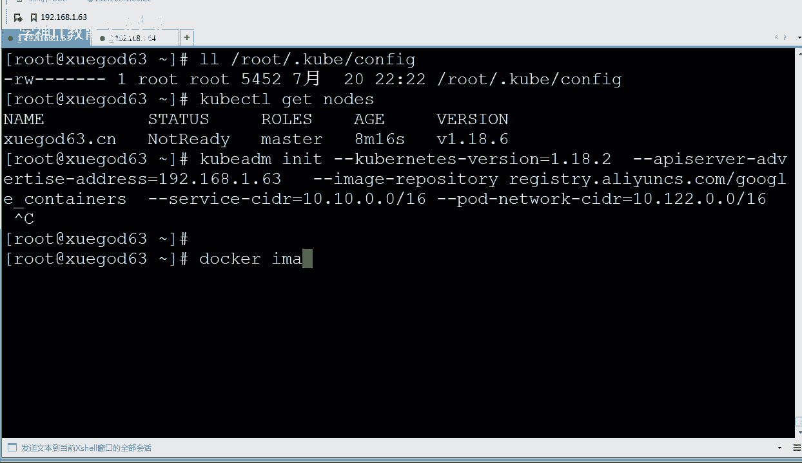
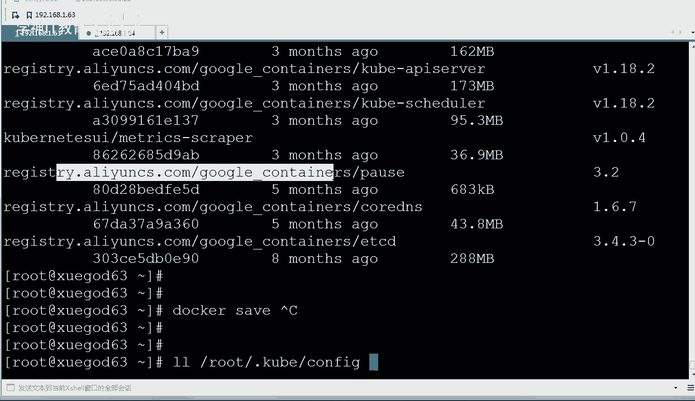
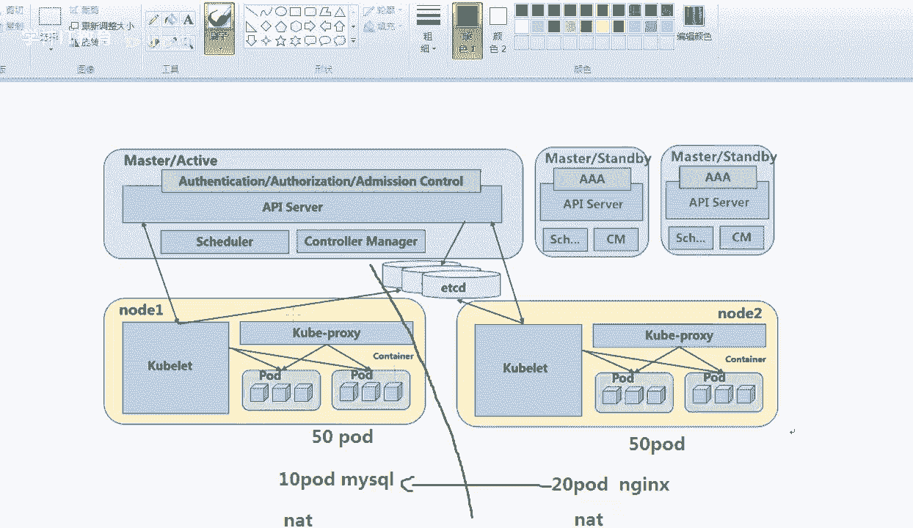
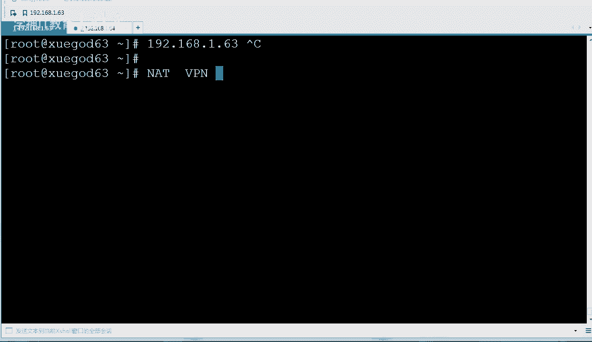
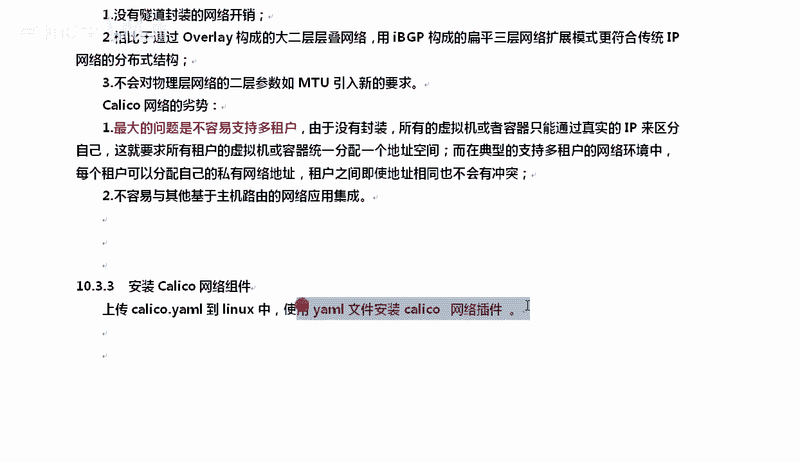
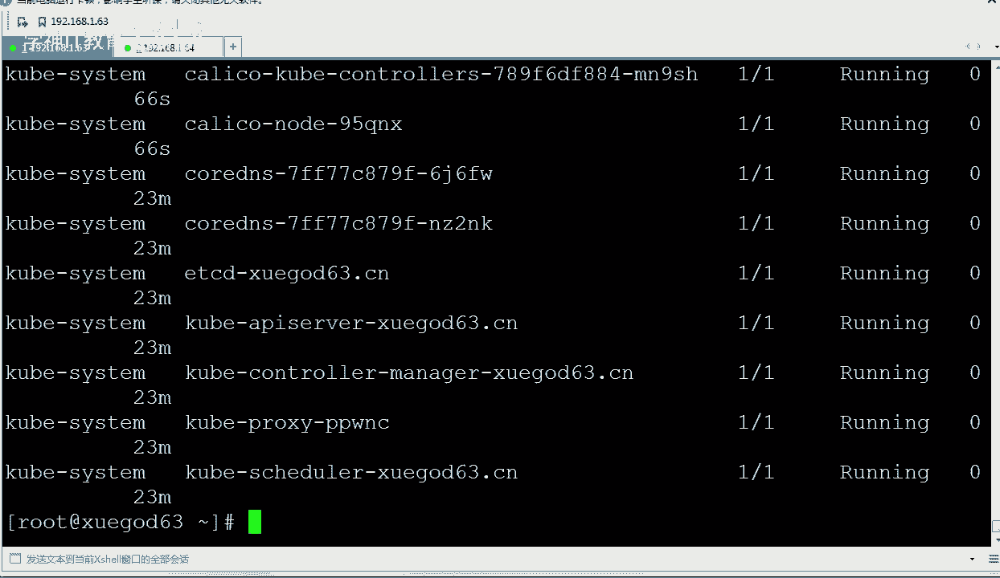
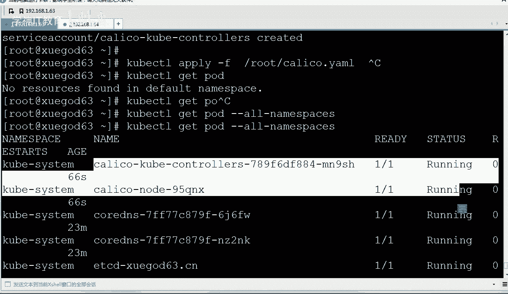
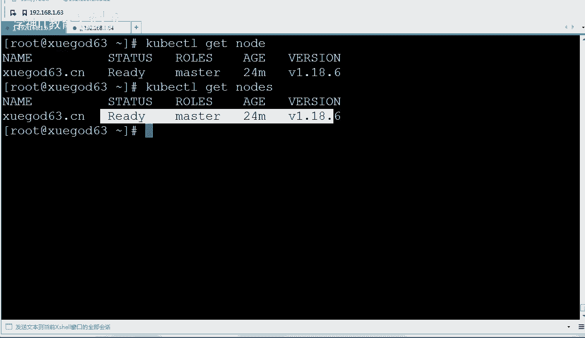
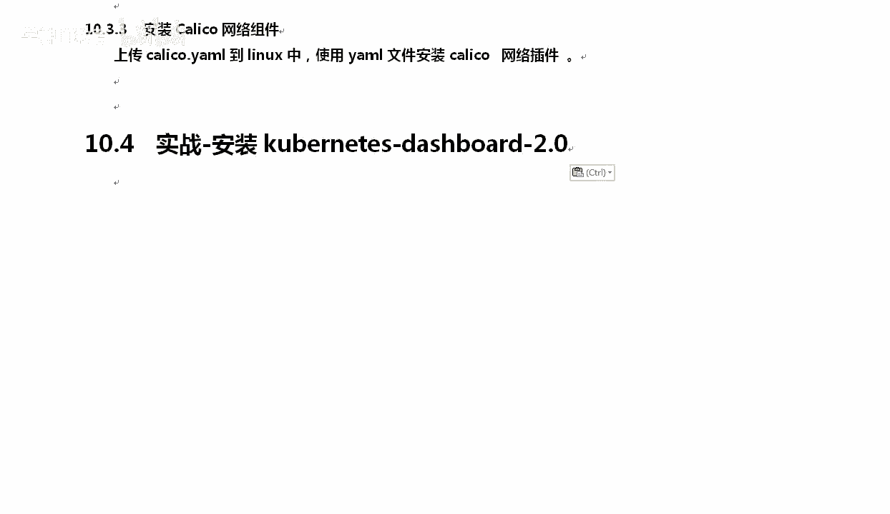

# Linux／Linux运维／RHCE／红帽认证／云计算／Linux资料／Linux教程--使用kubeadm搭建K8S容器集群管理系统 - P3：3-安装kubernetes网络组件-Calico - 学神科技 - BV1jK4y1a7DR

好，我们来说一下啊，那这个地方是吧，直接去执行。有同学说老师，我你是怎么把这些镜像存下来的是吧？我是这样的啊，我第一次执行的时候，他是在线从阿里云上去下的这些镜像，好不好？然后下完了以后呢。

我不是docker看了一下吗？我能看到好多镜像。😡。

对吧好，看到这些镜像以后，MK老师我是非常用心的，我通过docker save。清楚了吧，一个一个给你把它怎么样手动给你存了下来。理解了吧？我是手动一个一个帮你存下来了。所以你知道我的良苦用心了吗？

就是为了让你大的时候顺一点。😡，好吧，老师我就想自己在线搞，那OK你在做的时候，你就别把我的镜像导入就行了。你别把我的镜像导入，你就直接怎么样执行这个init就行了，他就会从网上。

因为本地没有自然会要从网上去找这个regstry阿里云是吧？谷歌coner相关的这些下面这些东西。那个同到底他怎么知道找要找ETCD呢？因为他人家初始化的这个脚本里面就写着ETCD。😡。

好不好？好，我们知道了这些啊。😊，OK那我们来聊聊这个网络组件，好吧，ical。开口介绍一下啊。caical是一种容器之间相互通信的网络方案。好。

在虚拟化平台open stack里面也会使用到caical啊。OK还有dota都需要是吧？work load之间是吧，进行相互关联，就是工作机器之间相互同时也要做到隔离。那么在多种虚拟化平台下。

我们通常使用的是二层隔离基术来实现。对吧比如说二层有危烂啊，briredge这种方式都行。OK但是微烂或者turn碎到这种在二层隔离的时候是吧，因为我需要怎么样？对你需要这种隔离，需要拆包或者加包。

拆包和加包的时候就要消耗更多的东西。随着网络怎么样越来越大，你的这个效率就会越来越低是吧？所以我们不希望是吧，在这上面拆。好吧，如果你不希望他在上面拆能怎么办呢？1好吧。

我们可以使用这种方式了解一下开口啊，开口他把主机每一个主机当成internet网络中的路由器，好吧，使用BGP同步路由器使用I tables来做安全访问策略。OK不使用隧道，不使用n子好吧。

使用的是二层三层，就二层把所有的二层三层流量都转成了三层流量。通过主机上的路由来。来怎么样来分发来进行通信。好不好？大体上大家知道一下开利口这个东西。那么开里口这种网络通信模型什么意思呢？说这个这么多。

你想想你是学尬的64这一台这一台机器有一些docker，有一些po的，我是这边。是吧我这边是学干的62。对吧。那咱哥俩是吧，直接通信是没有问题的，因为咱俩都在一个网段里的，是吧？我说对吧？对不对？

我是比如说我是一。1，你也是1。1，但是抛的不一样呀。好吧，后的通信的时候，你想想你的刀cker。你的刀口跟你们公司其人的刀口那个实力能通信吗？不通，因为他们就相当于是n模式一样。我这边刀口采用了n。

你也采用了n，咱哥俩能拼得通吗？😡，就就最简单的VM虚拟机上，你是net，我也是n。😡，咱俩是拼不通的是吧，你是172的对吧？0。2，然后我可能是。其他的地址就假如说我这边就是个10点多的地址。

我也不给你整成一个网段了。😡，是不是肯定就通不了？通不了，你是172，5是10点多的，通不了，通不了怎么办呢？通常情况下，我们会说，既然通不了，通不了，我们就。什么。整个隧道吧。

是吧我们搭个VPN可是不是可以连上去，把不同局域网里的机器给你连起来。对吧，当然VPN的话，这种开销又太大，所以又有一种新的技术，好不好？在局域网里面的。开力口不属于微栏，不属用微插栏。啊。

利用率更高一些。清楚了吧。OK仅仅一来，它是通过三层路由器来到达的，反正三层本来就是不同的什么网段，所以你们怎么划分局域网，怎么搞都没问题。😡，理解一下啊。开口一句话，他能实现我们怎么样。

不同物理机器上的这个po相互之间能够通信。为什么要相互之间能通信呢？因为我要干，比如说我一个东西，一个服务是吧，我要部署。那没有？100个po一台机像是做不了的，我肯定是这边有一些po的。

这边有一些po。😡，好不好，所以我就希望你们彼此之间是吧能够相互关联。清楚了吧，假如我要创建一个dloment，我需要有100个po。100个po的那这个地方跑50个。好吧，你这边也跑50的。

而且你们之间还要有相互通信。清楚了吗？啊，再或者是什么呢？再或者这边有10个pod，做的是mysco，这边有20个po，做的是阿拉提。N斯吧，我这N斯我是在这边的机器，我这边的机器要跟你进行通信。

我得解决一下这个问题。因为正常情况下，他俩是通信不良的。😡，好不好？对，因为net因为docker这种方式默认情况下，就相当于是个虚拟机上的net模式一样，你跟我是没法通行的，群非咱俩都是巧劫。是不是？

Vre这个地方就是这样一个道理啊。比如Vre，我是我是个n模式，你也是个n模式，咱俩是没法直接通行的，除非我跟你都是调解。net跟net，尤其我说的是不同机器啊，同一台机箱，net模式是可以通行的。

咱哥俩是不在同一台机箱的。😡，那就没法通信了。就像你一样，你现在机你现在电脑上开一个什么？😡，你现在电脑上开了一台虚拟机，我这边也开了一台虚拟机，你能跟我这台虚拟机通信吗？😡。

你肯定给我台。对啊，你能跟我这一台机器通信吗？咱俩肯定通行不了。😡，是吧如果我是个公网IP，所以说这种net就没法去通信。😡，好吧，没法去通行啊。那这个时候如果我这儿搭了一个什么。

最简单我这边搭了一个VPN是吧？你连到我这上面，然后呢，然后咱哥俩就能通信了，好吧好？但是VPN这种开销太大，不适合我们这种高速网络。😡。

好不好，谁能适合呢？开一口好，开一口少了封装。当然不仅仅只有开了口这一种，好吧，K8S的整个组网方案有很多种。开看眼界啊。法拉诺这种方案。希望在每个节点上，它也是一种方案。法兰总这种组网方案。

它可以在每一个节点上。把8项容器的数据包进行封装，封装后再利用隧道好吧，再用隧道将封装后的数据包传传到哪了？运行者目标。目标po的node节点上。达到我这里以后，pod会进行拆啊。

就跟VPN一个道理拆掉你的封装，然后呢然后送到具体的pod上。啊，通信的时候性能会受到影响，还有一种叫做overlayoverlay这种组网方案也是OK的啊，下下层的网络好不好？OK在下层的网络。

在下层网络的上层去做一下overlay嘛？是吧？覆盖一下，在下面再给你覆盖一层，也是基于隧道封装的机制，好吧，搭建这种层叠的网络，OK在下面一层再给你上面搭一层。好吧。

大一层二层网络这种层面网络可以跨主机实现图形。其实你看所有的这个事就是一点，跨主机实现通信。OK清晰明了，数据性能也会受到。而caical这种的话，好吧，延迟性是最长最好的。😊。

所以开了一口就是最棒的吗？不是啊，有优点就有缺点。好吧，对于你们公司来说是吧，你就用开口这种就可以了。但是如果你要搭一个。搭一个什么公有的，谁都可以用，好吧，那就另当别论了啊。

flanno类似于docker里的overlay好不好？OK它的优势是对层叠网络的依来少，不管底层是物理的还是虚拟的。好，管理上都很就是很轻松，管理上易于学习也非常易于学习。学习他的历是。他的劣势。

你看有优势，有劣势啊，我给你列到这。大家了解一下啊，这种封装有开销，这就是唯一的劣势。好吧，但是呢他也有很多好处啊，就是多用户组网的那种。是OK的，是没有问题的。好吧，看ical是什么样的呢？是这样的。

优势跟劣势，你可以理解成优势，就是管理起来，配置起来都很简单啊，劣势就是会加点开销。啊，我增加你点开销它属于非层叠网络，因为他把二层搞成了三层，不像别人一样，在二层上再搞个二层是吧？没有隧道上的开销。

相比于好不好？overlay构成的大二层层叠网络，好吧，用IBDP构成了一个扁平型的三层网络，好不好？那么劣势是什么呢？最大的问题是不容易支持多租户。好多人都用你这一个，而且彼此之间还没有任何关联。

就你们公司自己用都好说。😡，好冇？这个地方管理起来好复杂呀。清楚了吧。啊，所以说如果是你们公司自己搭K8S用开口就够了。好吧，如果是公共的，公有的，你用flanno就行。明白吗？好。

那么我们把这个组件给大家装一下。那么装的时候，你需要将我给你提供的cateicalymer这个文件传到linux上啊，ymer文件我们基于这个ymer文件去安装它的网络插件就可以了。

OK。😊，好，怎么去做这个事呢？Coer。CTL好吧。Apply。好，OK杠Y应应用一下啊。创建一下。这样就可以了，这个提前我已经创建成功了啊。好，这样的话就OK了吗？是的，呃，通过apply这种方式。

我们创建了两个东西。好不好，哪两个东西啊？我们等等他啊。一种是dloment，一种是service。啊，我都给你创建好了啊。chemicalical node被创建了calical node的。

然后service也被创建了啊，dloment也被创建，都被创建了啊。好，我们等等他。那么这个创建成功了，到底成功了还是没成功呢？我们可以去查怎么查呢？我们现在所说的这个命令已经属于K8S里的命令了啊。

coer CTTL。啊，查的时候是这样的，cer cPge po去去看啊，默认get po是看的是defat。😡，好，你是看不到的，所以你得用什么，你得加个all name space。

因为不同的po可以在不同的命名空间里面。😡，OK这样的话我们去查查的时候，你可以看到这个开ical。

啊，已经是running了，这边running了以后，我们再次去看n节点。

酷宝CTL这个就是查看整个就是转酷宝CTL这个命令，后期就跟docker命令一样。好吧，它可以运行一个po，查看一个po的状态，查看节点的状态都可以。现在就是ready了吧？加S和不加S都行都行啊。

已经reading了master。OK啊。

好吧。你OK了以后呢，接下来。我们可以怎么样呢？安装一下这个大sbo好不好？我们来聊一聊这个大势报道啊，一会儿。

