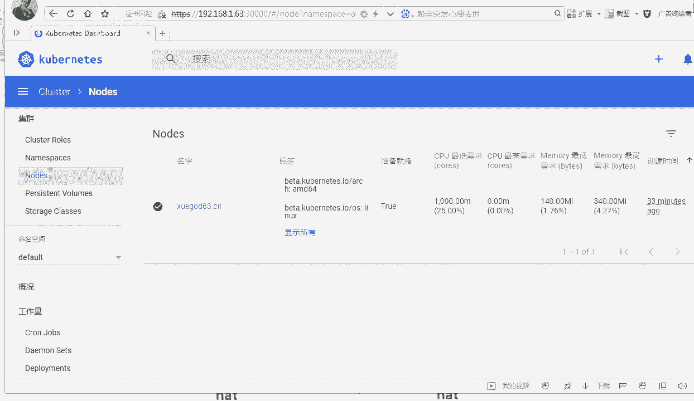

# Linux／Linux运维／RHCE／红帽认证／云计算／Linux资料／Linux教程--使用kubeadm搭建K8S容器集群管理系统 - P4：4-安装kubernetes-dashboard-node节点加入集群 - 学神科技 - BV1jK4y1a7DR

好，我们接下来来安装一下这个K8S的大bo2。0这个we部界面啊。因为通过命令行操作，大家。操作起来觉得挺困难的是吧？那你可以从这个上面去下载这个地址。很多时候官方资源我们不能直接访问。

所以你访问的时候。可以conrs保存，好不好？给他保存一下，它是整个一个压码页面啊。啊，你把整个页面保存一下，或者把整个东西复制一下，复制的时候一定要注意空格啊。好，一定要注示空格。然后我们修改一下。

默认大po没有设置note port映射的这个端口范围，我们可以给它改一下，改的时候是改成的是这个note po，从3万开始好，一般情况下，node port，也就是我们node po是什么呢？

就是我们这个node节点上的这个对外的映射的端口号好，默认是从3万开始了啊。

VRcom打开好不好？在42行的时候去添加。就可以了。我觉得我还是最好给你们添加一个现成的就行，是吧？因为你添加的时候绝对会报错啊。知道吗？我决定我还是给你们留一个完完整整的，因为。

我添加这个有没有问题？啊，你一定要注意这个空格的这个对齐。

好不好。增加完的效果是这样的，你的n port要跟这边的他给的 port是对齐的，你的t类型好不好？要跟上边这个地方port是对齐的。这个样码文件所有的样板文件必须空格是对齐的，可以少一行或者多一行。

这道可以啊啊，但是配空格，它是用空格做风格的。

好吧，证明咱俩是对他是用空格做分割的啊。好，拿到这些东西以后呢，我们接下来接着来我们去添加一下大bo的用户凭证。好不，行政是怎么添加的呢？是这样添加的啊。好。来，我给你写到这啊。

うん。OK你要对这个文件是吧，去添加一下，添加的时候是通过我这次通过是cat，又一种写法是吧？追加啊追加到最后。好吧，追加一下内容，追加的是。name叫dashboard好不好？

然后命名空间是daashboardkuubernet dashboard，然后API的版本号。OK class大board。啊，API group是什么？好，你就class的命。

按照我这个地方往上追加一下，这样的话我们用的时候就方便很多。

好吧，相当于把我们。呃，比如说name大board，这是都创建好了。因为接下来我要基于这个样码文件去创建什么？对我需要去创建一个命名空间，包括我要创建一个服务。好吧，我们来看一下啊。

我先给大家安装一下啊，kuer。好不好，apply杠F后面跟上样本文件。去执行一下。OK他会去调用这些大board，而这些大bo是吧，我们很多情况下已经都有现成的了啊。

Oer GIEP所以我提前给你下载好了这些大报的。他是有这个大的，能看到了吗？如果没有的话，那就不好使了。然后呢，我们去看看。我们创建的这个地方gege的时候。

get port or namespace。那么在这里你可以看到cuber dashpo这个地方已经是running runningning runningning，你能看到我这马上就能running。

是因为我都有对应的离线镜像。轮你自己在线安装的时候。

超慢。这道吗？啊，答院起还是非常慢的啊。然后我想看看登录的令牌，这个怎么去做，就是。

他是这样的，cooper好不好？describe描述secre的密码，然后看谁的密码呢？coer nice dashboard啊和dboard amin的密码。

看这儿这个talking。他的登录方式是不一样的啊。它登录方式不一样，这个时候我们去访问什么3万端口。稍等啊。这块的操作，因为大家从来都大家是第一次接触这种配置方式啊，所以呃你先操作一遍。好吧。

先操作一遍，熟悉一下他这个流程啊。输入上1921681。63冒号3000端口。先按照这个把它搭起来。呃，他会说有证书不信任啊，没关系，点信继续访问就行，关了他继续访问就行。Talken。好吧。

这里要求你写这个taken，那这个taken是哪呢？是在这里？你把那个陶肯拿下来。OK你每次登录的时候要输入这个东西啊。好不好？因为我们当时创建的就是这种方式。这样就能登录到外部界面了。看到了吗？好。

那么登录到整体的这个外界面里面，好吧，servvicice服务已经有了，密码也有一个，然后。我们来看一下啊，他缺少什么呢？往下走吧，往下走啊往下走，走到这里的时候，你看一下，我们看找找 node啊。

稍等。我说的放大一下啊，在这下面整个集群里呢，node只有悬霸631个节点是不行的，好不好？因为悬霸63它还是个master，所以我要将note一啊，note2加入到进来，加入他怎么加。😡，还记得吗？

加我的时候怎么加？

你要将他加入进来的话。

还记得这一条命令吗？

哪儿了呢？我给你找一下啊。好，就这一条节点注册命令，你只要在那台机器跑一下这个命令就可以了。

好，我需要在64上去跑一下这个命令。但是前提你的64上刀坎已经是安装好了。好吧，你别刀坎都没装好。好吧，你刀坎要装好才行啊，然后这样回车就行了。好吧，你看包括你这些coer light好吧。

也要装好才行啊，还有couber啊ad命相关的这些东西。啊，前期我们正好已经把这些技术工作做好了，做好了这些技术工作以后，这就行了。然后你看他告诉你，你可以运行去看了。好吧。

在我这儿64上为什么不能运行这个东西？因为你连接不到我这上面，你没有权限，你没有那个证书。好吧，你得在这上面去做，否则谁都能看了。那这样的话，我们可以看到64已经note还没有起来啊，等他一下。

之所以我能是因为我的下面。有证书，有confi的一个东西。听出来吧，有这些comr相关的东西。所以我才能在这个节点上去查看啊。好，你要你要想的话，你可以怎么样？你可以在64上也考。也创建一下。

创建完了以后，我们将。将东西给他拷贝过来就可以。好吧，拷贝上给他拷虑过去。😡，完事以后你就能看了。对，这样就可以看了。好，你稍微等等他啊，等等他，关键是学霸64这个地方。

rose角色还没有什么没有角色是吧？你可以给他指个角色。啊，怎么指定这个角策呢？对我们可以给他指定一下，指定他为worker嘛。😡，可以这样，这个命令只要你在64上配置了什么？有了这个kuer好吧。

这个证书以后，你可以在64上去执行，也可以在64，就cobernet酷erCTL可以在6364上都可以执行。cer label端以谁呢？对于64给他打了个标签，好吧，叫什么呢？叫无work。好吧。

给他打了个标签。这样我们去get的时候就好说了。那你可以看到你就是个worker。好吧，你你然后呢你多等等他，多等等他，最终怎么样，最终他也可以跑起来的。

那有同说我要再加一个node节点，再加一个node节点，就像刚才那样。😡。

执行一下那个命令就行了。就是在6次上执行的这些命令，你都跑一遍就行了。好吧，该安装刀cker安装刀cker。

对吧啊，该安装。

该安装这个酷板库板的名字都装一下。

这样就可以了。然后最后执行一下这个jo进来。

好，这是大时报的。那么等会儿你可以看到他已经ready。

成功了。