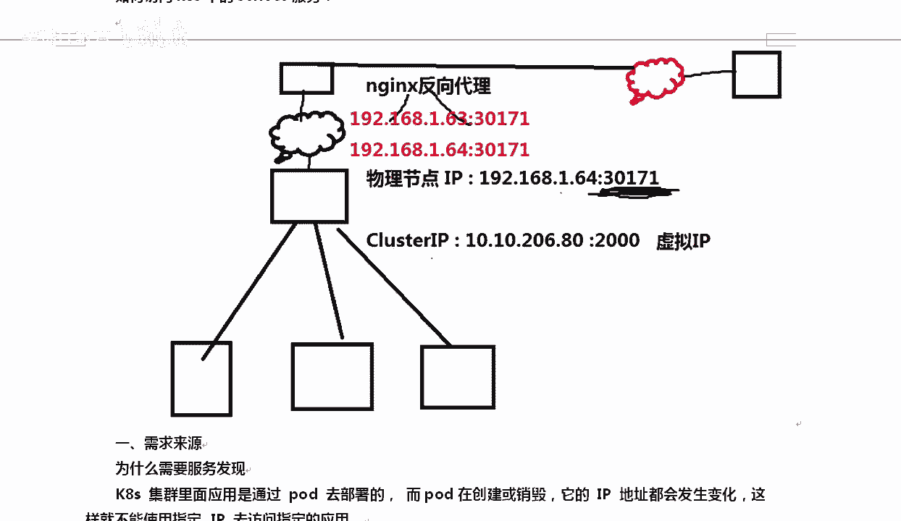

# Linux／Linux运维／RHCE／红帽认证／云计算／Linux资料／Linux教程--使用kubeadm搭建K8S容器集群管理系统 - P5：5-实战-通过kubernetes-dashboard创建容器 - 学神科技 - BV1jK4y1a7DR

好，那我想用一下他怎么办呢？嗯，看到。我们的no no node是吧，64搞定了吧，这边也搞定了。😡，对吧6463都搞定了，然后当前都是正常的CPU当前的状态是什么？最高的时候是多少，内存是多少？

然后这些OK了以后呢，再往你可以点开这些看一下namesmith是什么？有一些命名空间默认是defat。classster是吧，角色，然后呢，再往下工作这一块有po，主要看po，现在还没有任何po是吧？

relicica副本数是多少？然后这里面还有s维服务是吧，发现服务和负载均衡嘛这块我们来这里做一下啊，那么可以这样去做，你想创建一个。对吧我想创建一个容器，或者我想创建。

你可以直接写样本文件或者jason文件。好吧，通常是开发来写这一类的文件。OK那你也可以通过表单，假如你不会的话，你写个表单，我想创建NG code。好，我们创建一个的镜像是什么？你本地没有镜像。

它会从外网去拉取这个镜像啊，数量可以一个，我也可以创建两个。这样的话我的副本就是两个了。然后呢服务这个方可以带服务，也可以不带服务，我需要带个服务写上exter是对外的还是innal对内的，我是对外的。

对外的话，后期他会给你分配一个外部的noode端口。好吧，假如说那么这个地方。好吧，对外的对外的这个时候你就要用到负载均衡，就要用到service服务。我指定的这个端口号是80端口。啊。

3000端口我特意你也可以写个80了啊，我这里特意特意写个3000端口，为了方便给你一会看这个3000端口是什么端口，这边是8080目标端口，就是ND容器的端口，这个叫service服务的。😊。

sice是服务的端口。好吧，service服务端口是3000docker实力端口是801个po。但这个这个是两个po啊，一个po中包含两个docker实里有两个Nwo。

这个一个里面可以包含两个docker。但是我这并不是这样细写的啊，这是这个意思是我这里面有两个。

好不好，有两个破的啊。我创建两个po的。

我没有后期我会教你一个po里面怎么创建两个conter啊。好，拿到这些东西以后呢，点deeploy deploymentloy。这样就会部署出来一个什么。你等等他啊，Dloments。

developments只是部署出来一个什么资源，这个资源上有两个NG code。但是你还不能访问他。好吧，他会自己去做啊。等它全面绿了就可以用了。好，然后呢再往下。servervicice。

发现和负载均衡，这里就是有个ND好吧好？ND你可以看到3000端口对外的是317070。好吧，我们要访问的时候怎么访问？大家知道吗？我们要访问的时候是这样的啊。

就刚才那个截图容器的镜像名字是N po数量是两个service是外部，选一个外部端口号是服务的端口是3000，目标端口是80t端口，通常叫服务这里面叫port。好不好？然后呢。

他给的po是指的是容器的端口。OK好，在创建表单的时候，没有node port，那这个时候会自动创建1个3003万以上的端口号出来。Okay。好。我们来看一下啊，这个端口有一点要跟大家说的是好吧。

tangge这个端口就是最终的端口，也就是我们的po端口。我们稍微等等他啊，这边应该差不多了。好吧，我我来看一下啊，我往上，我怎么知道O不OK呢？看到。Diploment。deloment绿了。

那就没有问题了啊，这就没有问题了。你也可以看一下那个概况。OK。好吧，现在都绿了，那就没有任何问题了啊。好吧好，这个没有问题了以后呢，你去你知道怎么访问吗？从外网访问的时候是这样的啊。😡，端口号。

你要用这个端口号31怎么样？31707用这个去访问。而且这个时候你去访问的时候，1921681。63。冒号317。多少啊？31770。31770。回撤。Ning是能访问。看到了吗？

以后什么NG源码编译安装啊啥的。没得说。你也不用管他1。64也是可以的啊。好吧，都是可以这2个IP地址都是可以访问的，整个里边都可以访问。😊，好吧，整个里面都可以发问啊。好，这样的话你就可以访问了。

如果你有多个n，那么每一个node上都是可以访问的。尽管我这个时候，比如说NG实际上是运行在这个pod上的。但是呢但是你你到这个你写node1的IP也是可以的。好吧，什么ND原码编译安装。

我估计十年以后就没人会这个东西了。mh。好吧，因为直接一个ND po就行了，你也不用关心我到底从哪下的。😡，好不好？最后我来聊一聊啊，聊一聊。那有同学，你这个3000端口是干嘛使的？😡，嗯。对。

这个3000端口是集群的内部服务端口。好不好，这个如果访问K8内部的这个service。当然这种情况下访问的时候，可能大家是这样访问的啊。好吧，后期K8里面还有一个什么，还有一个这样的一个东西。

有你看到这里发现服务和负载均衡。除了service以外，还有一个in。😊，还有个这样的东西，现阶段你先了解一下思维思。如果是这种情况下，你看。我们是这样做的这个事。1。631。63。

我们不可能每次访问的时候都加个特3万端口吧。对吧那这个时候怎么办呢？你可能在上面还需要在他上面再加NX方向代理好指定一旦访问80的时候转给他转给他。用户在访问的时候，前面还要再加个东西。好吧。

这是物理节点上一个端口。那有同学说你这个2000端口或者3000端口是干嘛使的？

我这应该写3000啊，这个叫虚拟IP。我带你看一下啊。好不好？啊，我们来大家看一下，就是集群内部。

好吧，因为我们的poIP地址一直在变，大家知道这个是吗？😡，啊，什么意思呢？我想跟大家聊为什么需要服务发现？😡，K8S中的所有东西都是通过pod去部署，而在po在创建和销毁的过程中，它的IP地址都会变。

这样的话我们就不能靠IP去指定应用。对吧你得给我找一个不变的东西，什么不变呢？在这儿在K8S里服务的发现和负载均衡是K8Sservice外部网络可以通过它去访问。那么po网络也可以通过它去访问。

也就是说说什么呢？对，这个东西是不会变的，可以通过K8Sserv方式去负载均衡到一组铺的上去。这样相当于解决了前面所说的这个复发性的问题。啊，或者说吧给你提供了一个统一的入口去访问我们的服务。

又可以访问外务，好吧，解决了不同po之间访问的时候。无法提供统一的地址。这个地方。

好吧，你想想我们现在有两个po的，万一有一个pod挂了呢？是不是？对不对？是不是这个东西，我们来看一下啊，如果你想访问集群内部的是kuer cLget。servervicice。啊，你也可以这样啊S。

2RC。对你就这样吧，getco CL get service你可以看到像我这个地方inex是吧？这就是服务嘛，查看我的服务有个load balance。😊，这是我的cast集群I地址，是这个地址。

好吧，这个地址的3000端口对应的物理机上的131770访问的时候是怎么访问的，就这样。

一旦有人访问我的30171这个端口，它会转给后端的什么？一旦你他会转给后端classlastster这台IP的这个端口上。那这台IP的这个端口呢，它是个虚拟IP它是个负载军容器，它会往下继续分。

它会分给谁？

告诉我。那你不知道分给谁的时候，你可以getdescribe描述详细信息。关于哪个服务呢？关于N详细描述一下。流程就是访问这个端口转给3000，3000完了以后，我们可以看一下。我们去看整个服务的时候。

你可以看到。首先好吧，服务是通过NG这个label。啊，APP等于谁呢？等于NG这个标签去找什么，找下边的po好吧，下边的pod啊，下边的po，因为下边的po也叫NG啊。打了标签一脚个。然后呢。

你看我的集群IP地址是谁呢？classIP是这个相当于我们的就高可用里面不是有个。就是集群里面都有一个什么对外的1个IP地址，对吧？这就是这个虚拟IP好吧，classIP啊。

对外的这个IP就跟我们LVS1样。😊，然后呢，他他的什么呢？你看。他的80其实他的3000端口最终要转给80。这个80是谁呢？就是我们的targe port。好吧，这个pod指的是服务的3000。

服务的3000数据来了以后，转给3000端口，3000端口再转给后端的80，后端的谁的80呢？end point转给这两台机器的80。能理解吗？也就是说有人访问我们物理机上这个流程是这样的。

一有人访问了1。63的301071的一个端口，他会将流量转给什么？转给下边这个3000端口或者2000端口转给classster上classster。

2000这个端口号3000端口号收到的信息，会将真正的信息传给谁呢？传给下面这台机器和这台机器。那这两台机器是什么？这两台机器就是。酷板CTFge。对，就是我们这两个po的。好。

这两个铺1个IP地址是这个一个IP地址是这个。回去的时候也是这样回的。OK对于我们那个同事说你你这个这个IP啊，caststar这个IP有什么用？😡，好吧，其实你是可以访问到这个castI的。

假如说这是一个mysq数据库，它是不对外提供的。知道了吧？他是不断要提供的，你不断要提供服务的时候，只是对内部提供。那我是一个NG，我想访问一下你的NG这个IP怎么访问呢？它是能访问的啊。😡。

嗯，咱们去访问，比如说我模拟一下啊ESEC杠AT。跟N迪。好吧，进到谁呢？我们进到进一台机枪，进一个po，这个和我们进一个docker是一个意思。好吧，后面跟上bas。

这样的话我就进到了pod里，就相当于我们进了一个dockerEXEC不是也可以进到docker里面吗？拿到这里面我们可以做这个事情，做什么呢？靠。

好吧。

我可以去访问谁呢访问他他的3000。看到啊。

冒号。3000这是个浏览器啊。是不是能访问到？看不清了是吧，是。我去访问这个classIP是没有问题的。

明白了吗？

我是能访问的。你想想，如果这是一个什么，这次我这个cast是这个service，这个服务是一个什么，是一个N n直接对外是吧？如果我这个起的一个mysqcle的。

那么后期我的N是想要访问mysql的时候，你你应该怎么访问你不能访问mysq的po的地址，因为po地址会变，你应该访问mysqcle的service地址，因为这个东西是不会变的。好不好？好，先到这儿啊。

这是搭建啊，后期具体怎么用，我们还会再详细去聊，好不好？

对，今天呢结束了以后呢，大家回去搭一打搭一打，你不停的去多敲一敲，多练一练。因为接下来我要讲K8S的命令行了。好，如果你对这个东西没有概念的话，我讲命令一行，你更懵了。

啊，好，我们先到这儿。😊。