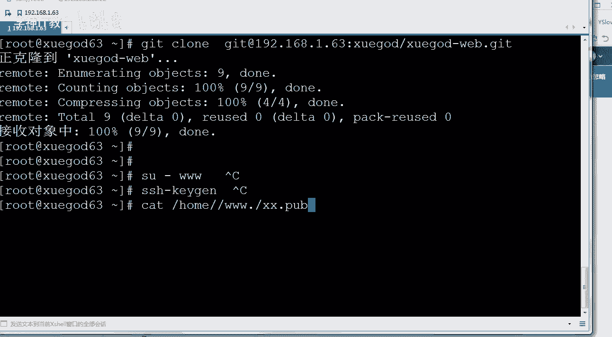
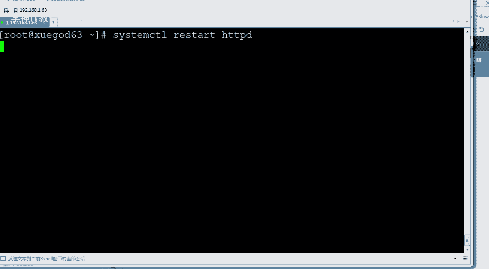

# Linux／Linux运维／RHCE／红帽认证／云计算／Linux资料／Linux教程--扩展-GitLab与Jenkins持续集成平台使用方法 - P1：1-配置Jenkins自动拉取gitlab中的代码并部署 - 学神科技 - BV1hK4y1a7Bh

好，大家好，我是MK老师。今天老师要跟大家分享的是关于tla加kins这一块的内容。我们讲讲他们的使用方法。好吧，也就是前面我们讲过是吧，如何搭建了。那么今天我们来聊一聊它的使用方法。呃。

首先你要点一下虚拟机还原到加这个快照，我已经还原成功了。啊在这里我们可以打开虚拟机给大家看一下，我这边已经还原成功了啊，还原成功了以后，我们先带着大家把t lab去用一下。

你得先确认你的机器是没有问题的啊，还原以后呢，你记得清空一下防火墙规则好吧，如果你的IP防火墙 table这个规则没有。

对你得清空一下这个规则啊。恢复好快照以后，启动虚拟机gtlab和jas啊。在我们开机之前，我们要清空一下它。

好，我们登上去。

要不然我的80端口是吧访问不了。1。63。

接收并保存。

IB6清空一下防火墙，清空完这些东西，这就没啥问题了。我们打开一下这个。打开一下浏览器，我们先怎么样，先测一下我们整个环境有没有问题。你们做的时候也一样，恢复完的快照是吧，先要测一下它有没有问题啊。

比如说第一个我们先登录上get lab上，你先登一下，看看我们能不能登上成功get lab的地址我已经搭好了。1921681。63。😊，好，如果你前面没有搭好的话，呃，你要参考一下上一节。好吧。

一定要先把它搭好。然后呢，jakins的地址，他的用户名是addmin密码是123456。他的root用户名是root密码是addmin。好，我们来登录上去。那么登录的过程中。

两边应该都没有太大的问题啊。记住要输入冒号198啊，ja我们先登上去这一块。用户名是root密码是。原告的点CN。好不好？好的。修大点声音啊，你得写的长一点。这边先登上去。

然后jakins用户名admin。密码是123456也登上去。好，两边都登上去啊。😊，记得给他内存打一下。好，这边应该没有任何问题。好，拿到这些东西以后呢，你得怎么样，我得测一下能不能用，好不好？

所以我们那叉连上去，比如说get lab这个项目是吧，我们点开它的代码，看能不能使啊，我们打开叉再次连接一下。😡。

首先呢IM我把原来的学杠的web给删掉。好吧，删完以后呢，我们去克隆一下你这个。

网址。好，我们去克隆一下他啊。点一下这个地方。你要看一下他的地址。好不好？对你要怎么看呢？你也可以从这从这里点点我们经常访问的这个项目。好，点开以后呢，在这里有克隆，看到了吧？

你如果采用HTDB那你就复制。复制这个地址。好不好，复制完一下，点一下复制。复制完了以后呢，我们来试一下。

get克隆。好，树入上这个地回撤。

先试一下能不能克隆成功啊，用户名可以写root啊，也可以写。我自己给的这个权限。好，密码是学杠点4。能克隆出来看到了吗？能克隆出来说明我们这个版本是没有任何问题的。好不好？

对他说明咱们这个是没有任何问题的。好，说明我们的代码是正常。那么接下来我们来安装一下jekins。

ds这个插件ds我们上一节课已经安装成功了是吧，看到了吧？所以今天我们来用一下这个jakins。我们来看一下，大家经常听什么，你们听说过那个什么什么deoOPS。😡，Dvo OPS。没有听过的话。

凑个2。听过这个吗？我刚有几个同学进来是吧，你们刚进来的同学，我最后强调一下啊，今天咱们该讲get lab加dkins的使用啊。好不好？OK班主任发的那个上课通知，可能发的稍微有点问题啊。

今天讲的是使用啊，下周讲刀坎好吧，下周讲刀坎呃，你如果不会搭建，那你可以加他姚老师发的这个QQ群，找姚老师要一下，清楚了吧。😊，好。回来啊回来这个地方，我们等了大概有一分钟，哎，有有反应是吧？好。

我们等了一分钟，这个地方是有反应的啊。等等他啊，那么这边在等的过程中，我我再开一个标签吧。对，咱们再开一个标签啊。我们把剩下的一些插件也找一下。比如说什么呢？你看我们接下来把另一个插件也也找一下啊。啊。

也找一下。稍等等他。让他慢慢的去加载一下啊，接下来我们需要把get labb这个插件也装一下啊。😡，我等一下大家。好，这边你看它已经差不多自动启动成功了。其实。我们来刷新一下啊，看到了吗？我也看不出。

又让你重新登录了，说明它已经自动重启成功了啊。😡，重重启成功了以后，我们点登上去。登上去以后，你可以看一下那个差价这块啊。是吧那我们可以点插价管理。我们再找找跟跟lab相关的插件，你想用是吧。

先把这些插件装上啊。就像我们浏览器上去装这个不同的插件，一个道理啊。莫慌，让他等一等。那么同样再点manrjakins。然后呢，下面往下继续来啊。有一些组件已经发生了警告是吧？

比如说叉SS可能有存储型叉SS嗯，漏洞，像这个插件是吧？所以说有些插件的该更新，你就更新sty叉SSner就是存储型叉S攻击叉SS分为几种攻击方式。反射型叉SS攻击和存储型叉SS。知道吧。

主要就是这两种。听说过吗？叉SS跨战脚本攻击。啊，跨难脚本攻击啊，在咱们那个渗透安全的一个课程里面有讲。好，我们接下来再点这个get live，咱们去搜一下。这些差价你得搜网。对。

这次我把给给 lab插件。好，稍等等。让他搜一下啊，为什么这么慢呢？因为他要上外网上去匹配啊，你也可以把这些差件干脆都下到你本地，然后这样的话会更好一些啊。😡，好不好？对，这样会更好一些啊。没搜到是吧？

重新让他搜一下啊。哦，出来了啊，还是太慢，刚才刚才太慢啊，他没有出来啊，我们将这个地方get lab。好，和ge是吗API这两个都装一下啊。😡，点直接安装就行了。好不好？O。啊，我们两一下直接安装。

稍等等他啊。对，安装完了以后，同样你点什么？安装完后重新启动jakins。这样也是可以的。好，我们先装一下这两个啊，那这两个插件它的主要作用是干嘛的？

gitla这两个插件的主要作用是用来允许get lab触发jekins啊，并且呃能够在这只有啊gitla的这个图形界面上去显示啊显示这个结果。😡，我们稍微等等他，先把插件先给大家去装起来。啊。

让大家好好了解一下啊。好，他正在安装中。对，我们当任他家啊。好，我们来说一下啊，那么在get进行安装的过程中是吧，get这个插件应该是没有什么太大问题的。好，但是我在安装的过程中。

get APII这个插件始终没搞下来，没搞下来。很简单，去网上找一个t APII点HPI这个插件，从哪找呢？从他的官方网站去找我上次给大家提供了官方网站下载那个地址，你把它下一下。😊，好。

包括你从清华园上去下也一样。好不好？大家把那个下载下来，然后呢。从哪个地方去做呢？我们在高级里面直接上传就行。因为我记得这个API这个差件是等了半天，是始终。始终安装不上啊。好，我们来返回一下。管理。

对你在这里选择这个插件啊。差价以后呢点高级。啊，高级这地方可以上传插件，你可以通过上传1个点HIP的文件来安装。对，那我们点一下上传。好不好？上传一下就可以了啊，我来上传一下这个链接。

还是上传这个插件要快一些啊。OK选择上点打开。然后点一下上传就行。我们当然他啊。点该点你已经获起了。我先看一下这边能不能安装成上啊。先把gt lab试试一下。直接上传了啊。好吧，直接上传。上传完了以后。

他现在正在等待中一步步来一步步来就可以安装成功了啊，各位。哦，这边先让他执行着OK好，如果你实在创建不了，那你就用我给你说的这种方式。行不行？对，大家就使用我跟你说的这个方式。

你直接离线去下载一下就可以了。好不好？好，咱们双业等等大家啊。好，那么知道了这些东西以后呢，还有一个问题，接下来我们来设置get lab用户的root。

就root用get lab上的root用户可以通过SS公钥直接下载代码。好吧，我们需要部署一个key，让root用户可以部署密码，直接获取get lab上的源代码O好不？该key是get下载时使用。

明白我要干的事情吗？明白的话，敲个一。我会在群里给你发一个离线的报啊。😡，明白我要做的事情吗？好，那有同学怎么实现这个呢？它是这样的啊。我们这边先让它安装着啊，安装中安装的比较慢啊。

ja安装的还是比较慢是吧？下次我都给你弄成离线包，这样的话安装起来就非常的快了啊，就很方便了啊。因为jain很多网站从国外取下，你可以从这直接添加K好吧，我们也可以怎么样，也可以点这里点控制。

或者说点出他用户的设置。你要单纯给root用户去做，那就点设置。啊，给他添加一个什么添加一个公钥。好，好，添加一个私钥啊，准确的说应该是私钥，我们点SSH。先公钥啊公钥啊，添加1个SS密钥，看到了吧？

生成一个会用，现有的，我没有现有的，没有现有的那你就从这里面什么点pop这里面去搞。

懂我意思吧？怎么生成呢？SS用这个命令SSH。杠KD。回车一路下一回回车就行。好，回下这以后呢，公钥我要用公钥啊，是不是私钥啊，私钥是只有你自己能保存。怕了。好，拿到这个东西以后，我们就可以了。

那这个密钥是谁的？密钥？对，这个密钥是谁呢？是root用户，是谁？是当前系统的root用户。好吧，当前系统的如的用户，你把整个复制出来就可以了。把它复制出来以后呢，我们粘到这上边。😊。

好，粘完以后点添加密钥就行了啊，密钥叫什么叫root下ar特学杠63。也就是说呃，这是root用户6学杠63点CNroot用户的这个密钥啊。跟我们。什么get lab上的这个ro的用户没有任何关系啊。

有了密钥以后是吧，就相当于我把公钥给你了，我是不是就可以怎么样，我就可以免密钥登录你是一个道理。😡，那么这样的话，我们再删一下。删除学挂的外文删完以后，那么这次我们再去克隆克隆的时候。

这次应该用什么地址？

告诉我。啊。点开这个项目啊，我们来看一下啊。最近访问的是这个项目是吧？你点克隆好，你点一下克隆，你要是因为我们走的是SSH，所以你要把这个地址复制一下，点一下它这样就复制上了，复制上以后粘上来。

你要用这个get at1。63看到了吧？慢不点。这样就可以了。那第一次你都得输入什么yes啊。😡，好，第一次都得输入yes。记录一下服务器的指纹。假如我现在又删了他，第二次在登录的时候。

这样的话就不用输密码了，就非常的方便了。你想不输密码怎么样，就就怎么样，就想在get lab上去把代码当下来。很简单，你就以当前目录。比如说我想以3W用户，那怎么办呢？那你就CD到SU切换到3W下。😡。

切换完了以后，生成SSH。怎么样SSHKD。好，拿他生成密钥，生成完公钥以后，将他的公钥搞一下啊，假如我是ho下的3W下的隐藏一下，隐藏下面。比如说有对你将他的那个plic文件搞一下。

啊，然后呢，然后登上去登上g lab上是吧，以3W用户或者其他用户。好，OK去配置一下他的这个点设置去配置一下他的41就行了。

明白了吗？这样的话就可以实现无密码灯直接克隆了。我们来换一张图。

对，咱们给大家画一张图是吧，让大家看一下啊。接下来MK要做的事情。接下来我要做的事情是这样的啊，我们在jekins中去添加一个get。呃，用户什么用户呢？就是root用户的私钥。

我要在Jkins里面去添加gatet用户root的私钥。干嘛呢？有了这个以后呢，你看啊程序员gatet可以上传到get labb上的代码，这是没问题。然后呢，稍后我们要做的这个操作就是这样的。

我们要在jakins上创建web钩子啊，创建完web钩子以后，通过web钩子去告诉jakins怎么样。对，上有人上传代码了，然后他再上自动去下载。所以你一会要在ge lab上还得创建一个web钩子。

这个钩子要能怎么样跟jakins进行通信。通信了以后，他哥俩就会相互怎么样。一旦有人上传代码，我就能告诉你了。告诉我了以后，我就能自动下载代码。下载完了以后。

我再通过jas给他部署到生产环境下或者测试环境下，就是这个流程。行不行？对他就是这样的一个流程。那我们来完成一下好不好？啊，我们来完成一下，其实这里方有个问题，首先程序员已经能自动。

我提交代码已经不输要密码。好，提交一下问题在这儿，glab和ja这哥俩我凭什么信任你好不？你凭什么你的外b勾子就能告诉我有人上传，而且我凭什么就能自动下载你的代码？😡，是吧所以这个时候就需要有凭据。

清楚了吧。对，这个时候我们就需要有个凭据，这样的话才能满足这个需求啊。那我们来添加一个凭据，凭据从哪里添加呢？从jas上添加。现在你看AI完成了API完成了是吧？正在老定。好慢是吧。如果他太慢的话。

你刷新一下，你看我刷新完了也没有什么太大的问题，的密密码是123456。能看到这个界面，说明他已经重启过了啊。啊，更新成功了是吧，完成后重新起。你可以。让他再重新启动一下。实际上你不点这也没有问题啊。

他已经重启过，否则他就不需要你怎么样重新登录了。好，点一下这个地方回到首页。现在回不去啊，因为他没有重启完。怎么做呢？my有个凭证。好，我们有个凭证，我们点这个凭证，从凭证里面给它添加一下啊。

凭证的话怎么添加呢？

嗯，你有私钥吗？有我们我们把私钥放一下，你看我们现在有私钥，所以我们就可以直接什么连他。因为这是get lab上已经有我的公钥了，所以我只要把私钥给别人，别人也同样能连get了，私钥在哪里。

好吧，SSH下的ID把这个拿下来。清楚了吗？你构建一个凭证出来。OK。好，那后他以后怎么去怎么去构建呢？在这里有啊全局点一下下拉三角。稍等。出来。如果他点这个没有反应的话，你换一个浏览器。

让他转一会儿啊。好，我们换一个浏览器啊。因为正常情况下，你点这个凭证是没有问题的啊，可能兼容行。有点问题。OK也就是说，我们只要把jekins是吧，jakins上有个私钥，有个私钥以后。

我就通过私钥可以自动去下get lab上的东西了。好不好？重新登一下啊。咱们登登登录一下啊，让他。好，添加已经已经有这个添加凭证了啊，我们重新点开吧。谈的有点多啊。点一下这个凭证，点完凭证以后。

我看这一次能不能出来啊啊，有了是吧，添加凭。对，有了，刚才主要还是反应慢啊。好，有了这个以后，你选择什么样的类型，凭证其实很有很多。你看这么多的类型，我们应该选择的是哪种？啊。

以SSU的 name选择这个SS用户名with private key私要的方式。通它就行了。然后它属于整个全局。然后呢，接下来Uer name是谁，Uer name自然是ro它了，好不好？选完以后呢。

选择enter好，直接往里写。直接往里写就行了啊，点一下添加。然后呢，将私要写上去，私要怎么写？告诉我这样子么写，从上到下啊。看到了吧？从上到下，你给他复制一下。OK。然后呢。

ctrl V加到这上面加完以后点确定。好，这样的话我们的一个私要就有了。这个大家能理解了吧？有了他有什么好处啊？😡，嗯，我们将私要，你想想我们之所以能够什么，像我这边之所以能够直接克隆，不输密码。😡。

对吧直接克隆不出密码，原因就是因为什么公钥跟私药这个问题，看这。

我把那个复制上啊。它的主要原因是在哪呢？是在这root公钥好，root的公钥已经在get lab上了，所以root的私钥只要放在Jkins上，那么jekins就可以直接拉取get lab上的代码。

明白了吗？好，那这个OK了以后，有同学真的能直接拉项目吗？你给我演示一下试试，那我给你演示一下试一下啊。对，在这里，我们jakins创建一个项目，创建一个新的项目。好，我们来添加一下这。

iteom新建一个atom，你可以理解成新建一个任务啊，请输入一下任务的名称。对吧创业一个新的任务啊，任务的名称叫做学的web test。站点一个测试，然后写free style。

构建一个自由风格的像软件项目。我们点free style project啊，好点一下它点确定。选中它他可以有很多啊什么流水线的呀等等。OK先构建一个。自由风格的。一个工作已经执行了是吧？

所以我不能点的心着急啊。已经有了啊已经有了，有了，没关系，我在后面加个一，好吧，加个11加一个一啊。😊，选中它点一下确定。因为我想给你看一个完整的过程啊，它会弹到这个界面，你点确定以后。

它会弹到这个界面。看到了吗？对，描述描述这个地方可以随意想。假如说我写学霸的web网站代码提交，对吧？你想拿dkins直接去找人家，我给你画一张图啊，时刻我们以这张图来说话，这样你看起来就不会晕。

好不好？哪张图呢？这张图。😡，好。对于我们当前这张图来说，有哪些事已经是OK的了。告诉我程序员可以直接无密钥，什么样拿代码，好吧，这一块是OK了。对吧现在现在我们要实现的是吧，你能自动下载代码吗？😡。

好，我要让jekins可以自动下载代码。我们现在完成的是这块的东西。对吧你想让他自动下载代码，为A，那需要什么样？对，这边要有一把公钥。😡，然后呢，这边得有死咬才行。私样我已经有了。好吧。

那接下来你这把是要。和什么和下载的东西写上去。比如说我要从哪下，你是不是得告诉我一下。😡，我要从哪想？啊。不要从get lab上想。先点一个应用好，把这一块都都点一遍就行了。点应用它就会给你保存。

保存完了以后可以选管理管理。那这个时候你要选一下无还是怎么样，还是sub就是SV嘛？我们选择的是getlab请输入L地址地址是谁呢？是这个get1。63，好吧，选完它选完它以后，你得给我添加个凭证。

用谁用这个root的4要。这样的话我就能直接下载道代码，是不是很清楚。然后下的版本号是masterOK然后get酷的浏览器选什么版本号啊，其实我们就选get就行。这个不用管好吧，你就默认它就能自动适应。

好，选完它以后点保存。这样我们就可以拿到代码了，真正拿代码了吗啊？看到了吗？真的能拿到代码了吗？build now立即构建一下。😡，好吧，立即构建一下，当然你也可以从这里去点啊。

这个点完这里点完这里会回到这一个首页。好，我这个就没有用了啊，我应该用学的test一的啊。我们把它给删掉。好，那拿到他悬案的t这个地方，你可以选择build on。这样的话就 build标完以后。

你可以看到这边正在B。那你可以打开一下啊，点一下它。好，打开以后，你可以点一下他能看到详细的信息。好吧，你或者你直接看这里，看控制台输出也行。空来输出最终结果告诉你是个3次说明成功了。啊，他确实会。

去做这个事情，一步步，你看他会去克隆啊。好，他会去找你克隆，get他先初始化了一下，然后呢，getson等等等等。好，清楚了吧？最终他会将代码给你取出取出呢啊。对，已经顺利的时候提出了。

那么有同你取完以后，代码放到哪了啊，在Jkins那个地方取完以后，它是放到这下面CD到word下的lab jkins。😊。

有个worker，jakins有个worker space工作空间在这下面。好吧，我放的是哪个呢？我放的是学霸的test一，那就在test一下。就能找到了。

好。这个地方我们已经成功了，同学们。咱们已经现在能拿到代码是吧？拿到代码稍后我们来讲一下发布怎么样。对你拿到代码没有用啊，jakins不是还要怎么样？😡，这个我们先做的是手动啊。

一会儿我们再说自动这个事，我们现在至少已经能够手动。怎么样手动不不输密码，直接拿到代码。拿完代码以后，我是不是要做测试，先不做测试，我们先做一下发布。把这个最主要的功能是吧，给你。融合进来好吧。

你拿到代码，拿到代码以后呢，我需要发布到服务器。能发物吗？那我们将代码发布一下啊，发布这个倒不是很难。你可以通过命令或脚本的方式进行代码的发布。所谓的发布就是把代码，比如说我自动下载代码是吧。

放到网站上面，这就是发布。好吧，你可以使用root用户在各大外部服务器上进行发布代码。OK你也可以建个3W用户或者阿帕奇用户来实现。好吧，普通用户，如果你是普通用户进行发布代码。

你要保证所有图像的ID都是一致的。因为root它的ID是0，它都是一致的。如果ID不一样，就会出问题啊。比如说你用的是阿帕奇是吧？你这个用阿帕奇的ID是1000。

但另一个用户上人家的1000代表的是MK。如果我是个MK，然后又放到了word下发布的时候，又放到了word下3WHTL下。游勇者又不是MK，又不是什么阿帕奇了，那网站访问的时候就会出问题。好吧。

所以接下来又其实我们想做的这个事情就是这样。get一旦push到get labb上，push完了以后，get lab能够自动出发。哎，有人给我推代码了，推完代码告诉jakins，哎，你来我这下载代码吧。

有有人提交了，jakins自动去下载，下完了以后呢，它能够怎么样自动部署到雪霸的6364这两台机器了。😡，好不好，这就妥了，没有问题了。那当然如果后期的话，我们还可以加入这个sna自动化测试这个框架。

好，去进行测试测试。审判长。

好，我们先做一下63啊。既然要做这个发布上的测试，我们必须得有一个阿帕奇，我们先装一个阿帕奇。这阿玛提能以8凌方式启动吗？我们让它安装一下啊，稍等它，你不能用80端口。

因为80端口已经被get labb给占用了。好，所以稍后我们还得把阿帕奇的80端口稍微改一改。

改成81吧。那安装成功了以后呢，我们VI打开阿帕奇的配置文件，你将它的80搜索到80啊。啊，这里是吧，我们将listson80应该改成什么81啊，保存退出。好，我们保存保存完了以后。

size team c填2restar HTTPD。启动一下啊。

1。63冒号81。

好，访问是正常的，没有问题吧。好，没有问题的话，我们来准备部署一下。好不好？部署的时候，你想想我要想讲代码怎么样，所以我想将代码部署到这下面，肯定我得拷贝一下。好吧，拷贝的时候自然就不能输密码，好吧。

就得无密钥的方式去做这事情。所以SS copypy ID拷贝给谁呢？root1921681点多63登上去请输密码，123456。第一次输用输密码，退出退完以后呢，再次进行登录，就不用输密码了啊。😡，诶。

好，我们再次登录一下啊。Oh。你看不输密码就可以直接登上去了，起火了，可以。好吧，到这没有问题了以后呢，我们来构建一下这个步骤，你怎么去让他做这个事，还是他好不好？可以点jakins。😡。

好吧，这个是你从这里去点他的项目，点开他的项目有一个修改记录。点开这个任务以后，我们可以修改它整体的记录。no change。点配置啊。修修改记录说没有没有没有修改是吧啊，没关系，那我们点一下这个。呃。

配置配置源代码好吧，应该是源代码啊，源代码没有写完了，写完了以后呢，你你想怎么样？😡，对，我们是不是要给他来一个构建？对，在这里环境能构建吗？触发器吗？这都不是好吧。

构建这一块在构建这个地方可以点新增加步骤。明白了吧？那么新加的哪些步骤呢？这次是执行shall的步骤。OK然后呢，将sha尔的命令写上去就行，我们要写什么，假如MK写这个大家能看懂吗？啊。

如果我就写一个这个SAP杠2，我将是吧，第二当前目录下的所有东西拷贝到这儿这个当前目录是什么？不知道是吧。如果你不知道一个当前目录是什么。

你可以这样e一下worker space当前的工作目录到底是多少。好吧？PWD执行一下，执行完了以后去看在构建时，默认只会切到worker space目录的。

所以worker space可以理解成你的当前目录。我们的work space就是网站的代码，那个地方就是。😡，好吧，保存。好，我们来保存一下啊。保存完了以后，我们那测一下吧。看看能不能步署上去是吧？

对吧那么怎么部署呢？你可以点一下它好吧，可以看控制台输出，你也可以点这先build buildil完了以后呢，在这里正在buil过程中，你就可以点开控制台去看了啊。

那么在这里大家可以看到SCP这个地方已经拷贝到下面了。而且当前工作目录是什么。我执行PWD的时候，大家可以看到当前的工作目录，就是work space里面的学的 webb test。

就是你创建的这个任务的名字。😡，他会在你创建的这个任务名字里面去作为当前目录啊，然后呢，SCP构建成功，真构建成功了吗？是的，那我们可以刷一下这个页面。😊，是不是变了，原来是那个页面。

没有index的页面，现在已经有index了。所以这样的话就算是OK了。好吧，当然有同说老师，我想部署多台机器可以吗？😡，啊，我只部署了一台，我想部署多台呢？😡，步如堕谈。跟你台有区别吗？没区别啊。

部署多台的话，你需要比如说64，那你在64上也要安装一个阿帕奇。知道吧？

我们来给大家演示一下这个60啊。对，咱们演示一下这个6啊。我找一台64的机器。

学看了64这一台机器啊。一台其实跟两台是差不了多少。真的。稍等一下啊。可用环境。执行一下啊执行一下。64还原一下环境啊。我记得6次这个实验环境是可以开机自动啊，只是这一台机器是吧，7。64是吧？

我用这一台7。7。5这一台啊。因为这个快照他是可以直接用的啊。

好，他执行着啊，那你同样你要在64上去安装一下这个阿帕墙，各位同学。

1921681。64。

步骤跟之前的是一样的啊。😡，先安装一下阿玛奇。然后1。64的防火墙关一下。只是在最后拷贝的那个时候是吧，多加了一条。

好不好？来我给大家过一下这个流程吧，我觉得这个挺对大家来说没什么太大问题。安装安装完了以后，你修改一下配置文件，你将80改为81就可以了。改完81以后呢，记得改一下清空一下防火墙。😊，好不好。

清完防火墙以后，你登录了63上传root密码，也就是公钥给他上传一下。OKSS copypy ID给他拷上去，拷上去，让我们可以直接登录，直接。登录了以后呢，后期我们在构建shall的时候是。

我们这样去写就行了。原来的sll脚本里面只有一条，现在你多写一条就可以了。

这了吧。我看这边安装完了没有啊，还好，已经安装完了。我带着大家快速的去做一下这个操作啊。对，42横。listen，他也叫8一，其实他叫80是可以的啊，我也给你改成8一了，这样访访问的时候方便一些。

然后你在这个63这台机器将公钥拷到64上一下。这样后期我们SAP拷贝啊，上传代码的时候就方便了很多。好不，接下来你上这个工作目录上调整一下。服务还没启动了吗？咱们把阿帕提启动一下啊。

对你要讲阿帕奇启动一下，启动完了以后，我们来调整一下他的工作目录。这一次在部署的时候多加一条。

好不好？返回工程。你可以从这里直接点配置啊。学挂的web test一点配置。那么在这里。在这里构建好吧，点构建啊，构建这下面是吧，再加一条其实就行。加一条谁呢？到1。64的这下边就可以了保存。好。

保存完了以后呢，我们再次进行一下built。好吧，不要闹啊。现在给他勾一下。清楚了吧。那么它会有一个build3buil3的话，你可以点开控制台，这样的话能看到信息，它已经完成了。

完成了以后你去访问谁呢？我们访问1。63的时候是没有问题的。同样我们去访问1。64也没有问题。有点眉目了吗？嗯，同学们。是吧这也是OK的。好，这叫同时给他说吧推到多台机器。

现在推动的话和构建是手动的方式去推动和构建。那么稍后呢，我们可以实现什么？对，咱们可以实现这个操作，这个操作就好了，叫做get lab。一旦更新了代码以后，如何能够自动触发jains进行部署，行不行？

说一说这个地方。

