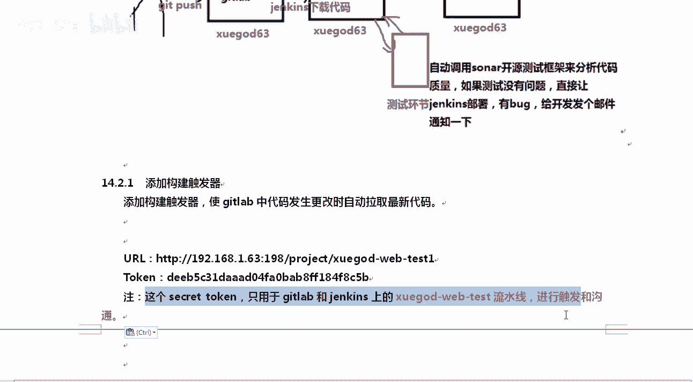
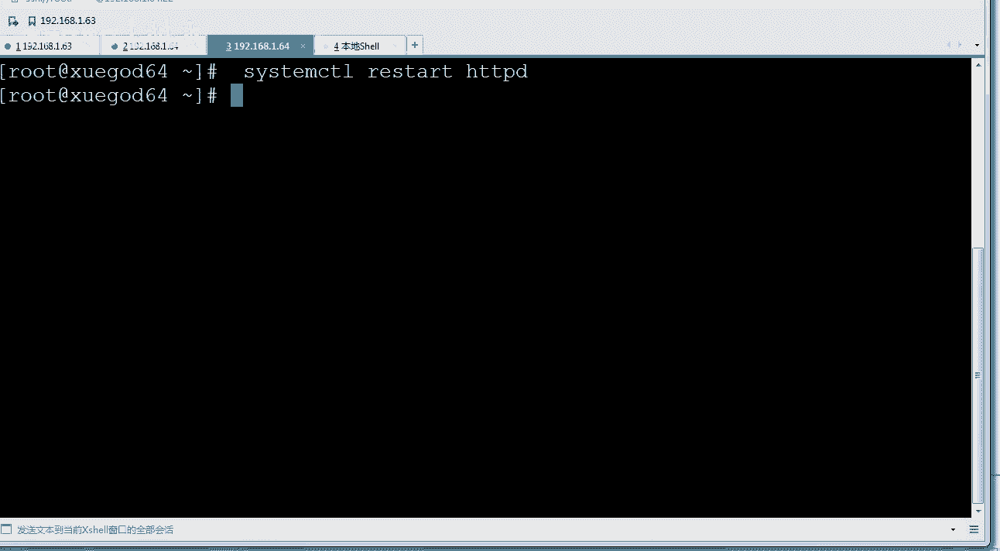
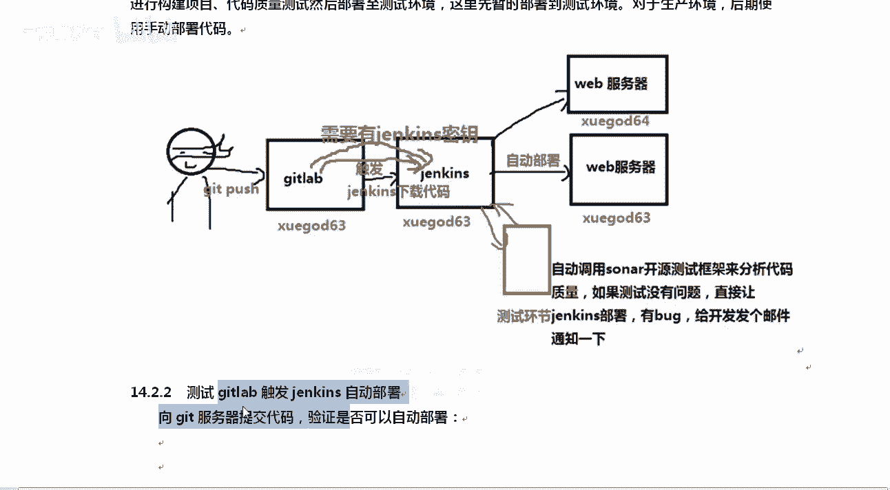
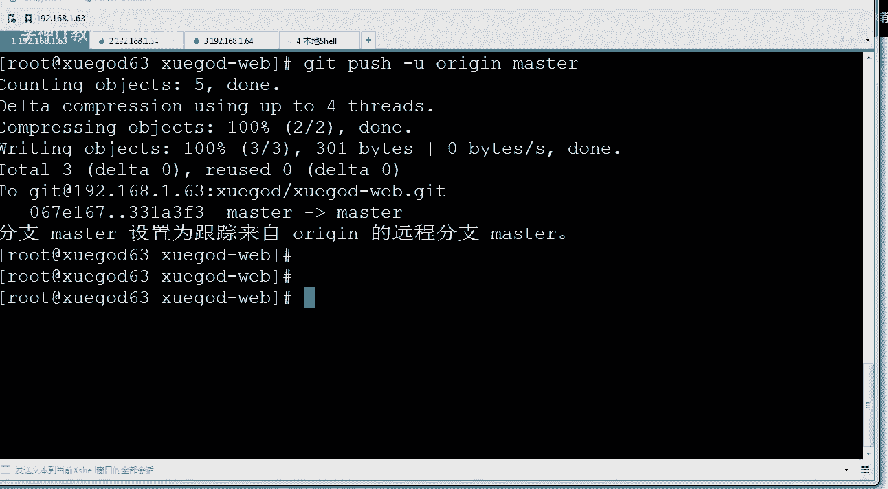
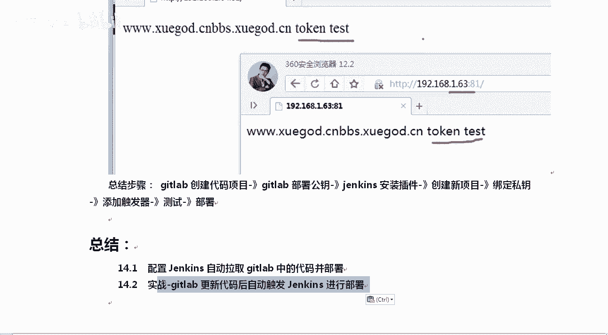

# Linux／Linux运维／RHCE／红帽认证／云计算／Linux资料／Linux教程--扩展-GitLab与Jenkins持续集成平台使用方法 - P2：2-实战-gitlab更新代码后自动触发Jenkins进行部署 - 学神科技 - BV1hK4y1a7Bh

好lo大家好，我是MK老师。那么接下来我们来分享getb更新代码后自动触发dkins进行部署。那你想想能够触发，就需要有一个触发器。就像我们那个ing一样是吧？它有一个触发器就可以了。

给它设置一个条件好不？那很简单这个条件是什么，是这样的啊，实战场景实战场景是这样的公司啊，在公司的测试环境下啊，当开发人员向get lab提供了一个代码，我给你提供了一个代码，提供完这个代码以后。

get能够自动通知一下kins进行构建O啊，如果可以的话啊，可以做代码质量的这个测试。然后呢部署到我们的测试环境下，这里我们先直接部署到测试好不好？O生产环境下你可以选择手动部署好吧，那样的话会更。😊。

更好一些啊，当然你也可以选择什么呀，反正能回归嘛是吧？你也可以选择嗯自动直接部署到生长文下，也是没有任何问题的啊。好嗯，我们是怎么做这个事情。

你看这个流程就是这样的get pushush pushush pushush到上面，push到上面你看gatet labb上要有jakins的密钥。好，清楚了吧，你要有jakins的密钥清楚了吧？

为什么要有jakins的密钥呢？因为你你有了jakins的密钥，你才能触发去跟人家dkins说话好，ds呢要能够自动下载get lab的代码，所以jakins上也得有get labb的密钥。😊。

他俩相互都有必对方的密钥，我有你的密钥以后，我就得我就能跟你说话。你有我的密钥以后是吧，你就能自动下载我的代码。😡，好，那么我们来构建一下这个触发器。好不好？首先呢构建一下触发器。

使get map中代码发生改变的时候，能够自动拉取最新的代码。在哪呢？所有的这些操作都是通过jekins来给你完成的。

所以Jkins它确实是一个什么你去构建CSCD就是可持续呃CSCD这样的一个环境的一个很好的一个工具，它能给你集成很多很多的东西。好不好？好，我们打开点一下。给他配置一下，你可以点下拉三角。点配置。

配置里面其实还是我们这个修改是吗？对，还是配置这一块，配置这一块，你要把这些这几项都点一下，general最普通的源代码管理，你也可以一一直往下去拉啊。你看构建环境。

构建构建完有构建后的操作都有OK然后呢，构建触发器都有。😡，那这一次我们选择的应该是构建触发器。好吧，构建触发器的时候，我们应该选择哪呢？在这看build问问什么呢？一个称指pushgitlab上。

在这个时候去发生一下改变。我们要选择的是什么？对我们选择的是这个操作。好吧，所以你在这里要注意一下啊，我们选择是这个操作。然后呢，URL这个地址你记得是吧，给它复制下来。😊，清楚了吧？

你看gatet lab gate lab它的webho web hook web钩子的UIL地址是哪个？是这个地址？啊，是jakins上的这个地址。

就是get labb他的web钩子要勾kins哪个地址要勾他这个地址要跟他这个地址进行通信。O那进行通信之前，什么时候什么事件呢？你看en get labs什么时候作为触发器呢push只要有提交了。

我就算是一个触发起，好吧，然后呢，在这里再体验一下高级。😡，养那个高级以后呢，我们看一下这下面需要生成一把是吗？啊，在这里啊有个january。

这里要生成一个什么secret secretre怎么呀secret talk生成一个。talk好，就像我们的邮箱一样，又有邮箱的这个talk啊，要邮箱这个令牌，我们这是生成了一个jakins的令牌。

这个jacks令牌能随便搞吗？你得复制下来。好，清楚了吧。因为稍后我们要在getap上去用它啊。好，拿上它以后呢，包括我们的URL地址。好吧，他俩都要有啊。哎，在那UIL地址好吧，是这个。然后呢。

taken是这个拿到这两个以后，这个taken。干嘛这个secry的 talkingken用于get lab和dkins上他们之间进行触发和沟通使用。所以拿到这个东西以后，我们点保存就可以了啊。

一会我们去提交代码试一下。好。有了这个汤坑以后，你记得点一下保存啊。你是不是看不到这个保存了，它到最下面啊。对，在最下面这个地方保存保存上以后呢，我们上get lab上进行操作啊。

g lab gate lab上需要添加一个web勾子。OK他的外包后口从哪呢？从你看。我们先忽略一下这个消息啊，从哪呢？从这里。管理中心。对你点那个管理中心就行了。管理中心下面有一个设置啊，往下走。

好吧，在设置这里面有听楚了吧，设置里面有个叫网络的东西。😡，点开。网络里边一步步来好不好？然后有个外部请求，允许来自钩子和服务的对本地网络的请求给它展开展开。然后呢，我们把那个对勾打上，允许webho。

好吧，和服务对本地网络的请求。好，那么。这个地方保存一下啊，点C5。好，那么允许这个外b钩子以后，我们现在已经设置保存成功了。接下来你要去你的项目里面设置某一个项目的钩子。比如说我们点开它。

对你得设置具体这个项目的钩子啊。因为每每一个项目它的钩子是不一样的。好吧，在哪里呢？在设置设置里面有个参数叫web钩web hook。好，我们点开这个钩子。那么这里请写UIL地址。写哪个地址。

example什么什么这个地址应该写什么啊，写我们刚才所记录的这个地址，URL地址把它写上去。😡，你这如果不叫学案的web test，那你你这里跟我也是不一样的啊。所以我建议大家跟我写成一样的。好吧。

你复制的时候，从文档里复制就行。taken这个地方呢，taken你的taken跟我的taken肯定不一样。所以这个地方拿到手，我们把seta security talk写上去，他上去什么时候出发呢？

push event。好，这个时候出发就行了。其实它里面有很多参数啊啊有很多，比如说木纸的时候才发生合并的时候才发生这种事，一般拿它就够了。好，拿到它以后呢，我们点击添加。添加一下你个卖国钩子。OK。

好，按一下啊，添加完了以后呢，我们在下面看这里就会有一个好吧，有一个外包钩子，那这个钩子能使还是不能使呢？你得给它测一下，好不？所以我们点测试push events。😊，测一下啊。

就是模拟一个什么模拟一个push疑问词这样的一个事件。模拟一个提交的事件。如果返回ho执行成功了，successfully什么是成功的？HTTP的状态码是200就代表成功。如果404，那就不行。

500也不行。好，这边成功了以后，其实你可以上jakins上看一下啊呃，我们这边也有赔有有的啊，我们刷新一下，你看第四个。好，你看tangit。被谁呢被get lab pushush。看到了吧？

对他是成功的啊，而且他是出发的时候也跟我们之前也不一样，之前没有写。你看started by Gi lab push by administrator。而且最后终也是部署成功了。看到吧？

那么这些都步署成功了以后，我们来真正的演示一下，手动模拟一下我是个管理员，好不好？我们来模拟一下这个操作，明白我要做的操作了吗？对我要模拟一下，我看看能不能提交上去。

好，那我们来试一下啊，咱们可以比如说CD的OPT下，我会给你模拟一个完整的。好吧，当前上面上面什么都没有。那么接下来我们先get克隆一下1。63这个项目学的外这个项目克隆完了以后，CD到。

学挂的 web部下好吧，完事以后呢，随便写一点东西。比如说echo，我们就追加一个test，好吧好？一串1。放哪儿呢？咱们追加给。Index点 HL。好，追加完了以后呢，你得get at添加一下。

好不好？添加index，然后呢get commit。杠M去提交好吧，提交的时候写上你干了什么事，比如说我写的是mod，干了一个in修改了HTL这样的一件事情。好，修改完了以后呢。

push啊get pushush就行了。好，push的时候记得是ge的push杠U指定原原始。origin好吧，orig masterster要提交到master那个分支上。好，这样的话我就提交上去。

提交完了以后，你等他提交成功啊。好，这边已经提交成功了，提交成功了以后呢，我们去访问我们两个站点。

哪两个站点，我先不看这个，我直接看最后的结果，好不好？1。63这个地方刷新。好，然后呢，再在这边刷新一下啊。重新打开一下。你能看到他这个过程啊，我们我们来看一下，刚才是井号4嘛，现在你看井号5。好。

井号5完了以后呢，我们可以看一下井号5的状态啊。刚才那个还是太快。好，警25执行执行的结果是成功的啊，finish的。完事了。好，他是成功的，他也确定又把是么这些东西拷贝了一下，拷贝完了以后呢。

但是有同学老师，你这里为什么看到一个界面？泰11有了，刚才需要稍微等一会儿啊，好不，刚才那个流程，我将代码提交到get lab上getla自动告诉jakins，我有新的东西怎么样来了，有人给我推送了。

推送完了以后，直接执行我们这个脚本哪个脚本的部署的脚本，我们就部署到网站上了。好吧，SCP就给我部署到网站上了。那这样的话就齐啊。这就实现了这个自动触发。好，我们稍微总结一下这个步骤啊。对。

那么在这里最后呢我们可以看到太都能发生的改变是吧？总结一下这个步骤，就是get上创建代码创建完了以后，你要在get上部署一个公钥。然后呢，ja是安装插件，安装完了以后创建项目。

创建完了以后绑定私钥添加出发去进行测试和部署。这样的话就可以实现get更新代码后自动出发jakins进行部署，理解了吧。好的，这是今天的内容。

