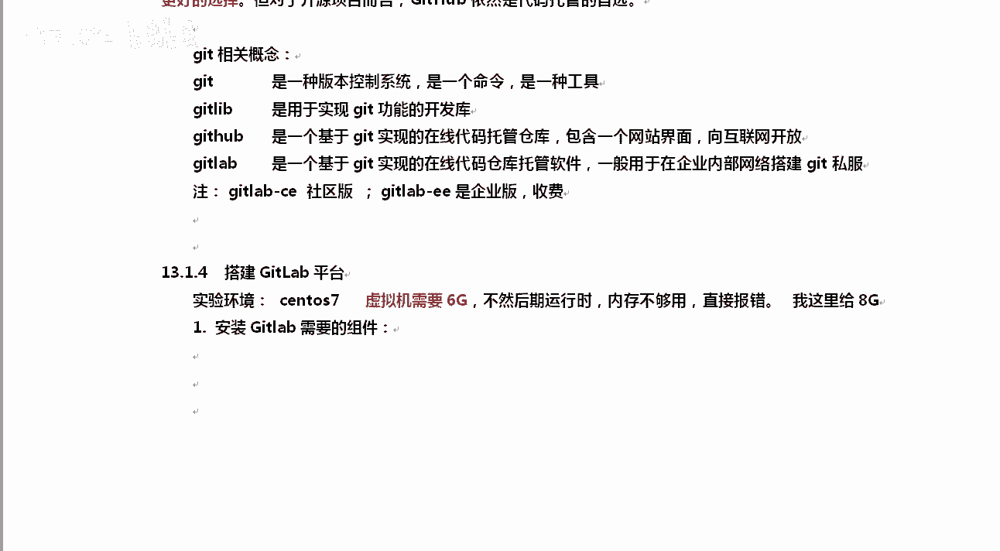
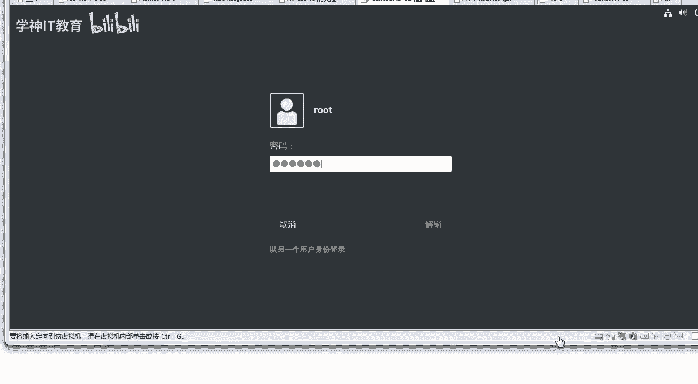

# Linux／Linux运维／RHCE／红帽认证／云计算／Linux资料／Linux教程--扩展-GitLab与Jenkins结合构建持续集成-CI环境 - P1：1-持续集成概述和搭建Gitlab平台 - 学神科技 - BV1254y1C7rJ

大家好，我是讲MK。那么今天老师要给大家分享的是get lab加s去构建CICD叫持续集成这样的一个环境。好吧？CI的话就是构建什么持续集成O那么稍稍后呢我们怎么样会去搭一下t lab。

然后说说get的日常使用方法，然后再加讲一下kins今天先把这个平台搭起来，后面我们再去讲如何使用它好不，那么说这个事之前我不知道大家都听说过一个词嘛，叫什么PS听说过这意思吧？

dvo OPS它是一个概念，好不？真正能实现devo OPS这个功能的是什么？对，就是getlab jas这一套东西。明白了吧？就像智能手机一样，我有一个智能手机，那么智能手机里面又分具体很多技术。

比如说我是用java做安卓开发的对吧？或者你是写驱动的，或者你是写是吧？用object C是吧，去写什么？写苹果下载啊，苹果下的这个程序的开发，懂我意思了吧？所以你你要知道devo O它只是一个技术啊。

一个概念，真正实现它的是什么，是哎get lab加。😡，好，我们来实现一下啊。来。我们来给大家实现一下。好，那么我们来演示第一个第一个叫什么呢？持续集成，我们来介绍一下这个概念。

持续集成持续交付持续部署，对吧？你看一下持续集成好吧，简称就是continuous。inegration就是什么CI简称是CI持续集成，是指开发者在代码开发的过程中可以频繁的将代码部署到主干上。

并且进行自动化测试。好不好？OK测试清楚了，也就是开发开发完了以后，代码能够进行自动的集成自动的编译，编译完了以后还可以进行测试。那有同学说这个和SV有没有什么不一样的地方？有SV你上传上去以后。

怎么样？你能自动编译吗？如果我是C元写的一个代码，步署上去以后是不是不能自动编译。好吧，有了我们这一套流程以后，C语元可以自动编译成二进制文件。然后呢，如果可以的话。

我们在kin里面再加一个什么加一个自动化测试的一个框架。比如说sna翻译过来就是声拿啊中文加上它以后能够自动给你生成测试报告，这样就非常方便了。好不好？那么再一个就是持续交付。

持续交付是在持续集成的基础上啊，将代码能够自动部署到玉生产环境下。也就是当我们开发编译编译完了测试，测试没有问题以后能够自动进行交付。那么还有一个就是持续部署了。那它是在持续交付的基础上，好吧。

可以将它部署到生产环境下。但是一般情况下，最终这一步我们还是希望怎么样手动。好，最后最后的一步新防手动，万一是否出了点问题呢？对吧啊，那个时候要慎重啊。好，理解了这几个词以后呢，我们来聊聊是吧？

Jkinskins的一个概述啊，Jkins。😊，和get app jkins首先说一下它好吧，它是一个开源的项目软件项目。那么它是基于java开发的一种持续集成工具。对吧那么他干嘛呢？

他是用于持续怎么样，看监控持续重复的一些工作，旨在怎么样提供一个开放应用的软件平台，使软件的持续集成变成。可能是这个地方大家是没有理解到，你能感受到持续集成的好处吗？因为在大家的平常的工作中。

就SV把代码或者get把代码填上去填上去以后是吧？然后比如说CP或者SCP或者RSNC拷贝到网站跟目录下就就可以了。平常的时候我们都是这样的啊，SV是吧，开发把代码传传到什么传到服务器上，比如说传到了。

阿帕提上啊，或者说就是SV传到了SV服务器上。传以后我们想知道有没有问题，那怎么办呢？最简单RSRSNCIRSNC我们上传到那上传到阿帕奇上，上传阿帕奇以后，然后打开浏览器去测试测试一下。

对吧这种大家觉得没什么样，也挺快的呀。😡，我说对吧？这是因为什么？这是因为你这个程序太怎么样，或者说你们公司的那个业务流程太简单了，好不好？我问你个问题，比如说好吧，比如说我们公司是腾讯，好不好？

我们要开发的这个软件是QQ懂我意思吧？我问你个问题，QQ有QQ啊，我们就不说手机版，我们说PC版的这个是QQ。😡，有多少个功能？告诉我。嗯，每一个功能是不是都要测一下？至少我每一个功能我都要编译。

而且是吧，像你这种是吧，它是什么，它是不需要的。因为你是H这种或者是PP的，你是不需要编译的，扔到阿盘上就能测QQ不一样。QQ是吧，明显怎么样，它是windows下它绝对要编译成二进制文件的对不对？

那QQ上有多少功能。😡，对吧随便拿一个什么聊天了、语音啦，视频，这都是，而且都是大功能。对吧里边还有什么斗地主，还有什么游戏平台，是吧？每一个什么都是包括最简单的，我要改个头像，这都是什么？对。

这都是一个随便拿一个功能出来。哇，那上面功能太复杂了。😡，你是不是都要测一？是吧你看下面我还没有点亮这么多呢。对吧那这个时候还按你这个思路可不行了，每一天都在编译，每一天都在怎么样测试。

对吧所以对于一些什么持续集成这种东西，只有是吗？你的软件是比较复杂的。好吧，你的软件已经很复杂了，你需要频繁的去怎么样？对我们就需要什么呀？很频繁的去提交代码去编译。

这个时候才需要用自动化的这种持续集成。清楚了吧？如果你就是比如一天我要持续集成几次。😡，就是我要把代码部署是吧，合并到主观上几次，我要合慢合到上面100次、1000次。

对吧那这种情况下肯定就需要用到什么。对我们这个持续集成这块啊，如果你们公司只有最简单的。啊，三天可能才开发出来一个功能，那很显然你没有必要。明白我的意思了吗？那么在这个流程中是吧。

大家都知道需要很复杂很复杂，频繁的集成才需要用到。那么在原来的时候，我们使用的是SV哦，那么新版本的话，我们都使用的get来管理代码。那么get来管理代码，通常它和get hub是配合到一起的。

当然对于企业来说，不可能把代码放到外网上。清楚了吧，就像腾讯绝对不会把QQ的代码放到外网上的，绝对是内网O那谁能实现这个get的内网代码管理呢？get lab好吧t lab是什么？

get lab是比加什么它是利用 on是一个框架啊，基于这个框架开发的一个开源的应用程序，可以实现自托管get项目，而且可以通过web界面进行公开或者说私人项目的这个搭建O好吧，他可以让你去做这个事情。

ru比也是一门语言啊，清楚了吧。by也是一门语言。那么说到get lab好吧，那么必须要提一下get hubt lab和有什么不一样的地方。😊，知道吗？认真听一下啊，get lab。

因为我今天我讲的这些内容，你可能都是第一次听，所以你要用心的去听，好不好？听会了，你就挣了，你就转了。😡，那我们来开始。他能够什么样干什么事？首先能够浏览源代码管理你的代码，就是一句话我能给你管理代码。

OK那么他有自己的一些网站，好吧，3Wget lab点CC这是get lab的网站。那么我们来说说这哥俩的区别。😡，清楚了吧，我们来聊聊这俩这哥俩有什么区别。嗯，get给他他吧。😊，先从它的吉祥物上。

我们来看一下长得是什么样子。gatet前面这个小猫，好吧，这不是章鱼啊，上次有个同学说章鱼只前面这个小猫是get hubub，后面这个狐狸是b好，这是他们的吉祥物，那哥俩有什么相同点呢？有好不好。

知道吧？其实gatet labb是模仿人家hub做的，知道了吧？两者都是基于web界面的get仓库。那么很大程度上lab就是模仿着haub来的，因为先有了hO他们都是提供这个代码分享的好。

都是提供代码分享的那有没有不一样的地方呢？什么时候该用。是吧什么时候应该用哪个服务呢？来看一下gt hub，他的个人私有仓库最多可以邀请三个人协同开发，超过3个人就要收费。比如说我整了一个私有项目。

不想让别人看到。最原始的时候，最开始的时候，get，你只要创建私有仓库，你就得收费。你像我们公司要管理自己的代码，我不可能让全世界的人都看到。好，我的代码也不开开远，对吧？

那这个时候我要去上g hubub上，我就得充钱。😡，你不充钱，你创建不了私有仓库。后来给 have说老充钱也不是事，就三个人吧，超过3个人再收费。😡，好，也就你们团队里面超过3个人开发。

其实用githa是收费的啊，而git lab上是可以创建免费的使用人仓库的。清楚了吧？get labO可以让我们对代码拥有更多的控制权限。好吧？相比一ha来说。

除了免费这一块还可以允许你只分享代码的某一部分就是。这样的话安全性会更高一些。有同学，这有什么什么？只分享一部分，这有什么好的呢？我就问大家一个问问题，你们有没有看过那个广告，什么贪玩蓝玉啊是吧？😡。

加大辉。看过那个吗？我们以前玩游戏的时候是吧什么你听说过私塾吗？😡，对我们那个时候玩游戏的时候，比如说你玩传奇是吧，玩这些呃游戏的时候是吧，会经常有个私服，对吧？为什么会有私服？

是不是因为你的代码被泄露出来？因为对那些网页有的，或者说PC端的那些游戏，其实只要我把代码拿出来架个数据库就能搞是吧？玩正版的是吧，收钱玩私服的是吧，不收钱，或者说玩私服是吧，升级更快。

感觉都是一样的嘛？为什么会有私服，就是因为那个时候你比如说我们管理代码上就没有那么规范。比如说我使用SV好吧，我SV check out一下子就把所有代码给你取出来了。因为假如说那个时候我们管理是吧。

其中的有一个主管拆个out，把所有东西都取出来，取完以后怎么办？😡，取完以后，我找台云音主机搭上去，搭上去，就是一个什么服务器，就是一个游戏。是吧，刀刀裁决。杂树回收看过没有啊。

为什么当时就是经常回收我们是正版传奇是吧，游戏就是装备收回收的时候是给钱的对吧？😡，原因就是因为当时传起啊货是吧，他的代码泄漏了。就这么简单的事，所以导致的私浮是泛滥成灾。好不好？

所以说从代码私由性上来说，公司并不希望员工拿到全部的代码。好了，假如MK我去做QQ的开发是吧，马化腾也不可能把QQ所有的代码都给我开个玩笑啊。😊，啊，这个时候呢么get lab就是一个更好的选限。

如果你是个纯开源项目，那么git hubub依然是托管的首选。懂我意思了吗？好，那么除此以外呢，来我们来看一下get相关的概念。get首先这是一个命令。好吧，还有一个叫get lab。

这是它的一些库get hubO还有一个是get lab好吧，这个是主要是企业内部用的，就是你们公司要自己搭的话，搭内部的话，只能用这个。除此以外，get live里面还分C版跟E版，E版是收费的。

C1版是社区版，所以你应该选择的是什么社区版，除非你有钱。好不好？好，那么说完这些东西以后呢，我们来搭建一下，搭建的时候使用一台stoS7的系统就可以了。你这台虚拟机要给6个G，不然后期运行的时候。

内存不够用，直接给你报个错。真报错吗？真报错啊。好，我们来启动一台linux机器。我们把这依赖包给大家安装一下啊呃，对应的安装包时吧，我已经提前给大家下载好了，好不好？我们来看一下啊。

书123456。

对我们来做操作一下啊。好，我们打开这个终端。

好吧，LS那这个地方我已经提前上传好了，如果你没有提前上传好，回去自己做的时候也提前上传一下。因为get C这个包好大呀，722张，这应该是你们有史以来见过片包最大的包吧。先安装一下易赖包啊。Yeah。

一样不能使是吧，我把我的原移回来啊。来。先安装一些依赖包。他需要这些易赖宝啊。😡，看这里好吧，搭建的时候，我们先安装一些依赖包，这些都是他需要的啊。什么open SS杠serv其实早就都有了啊。

post post fix发邮件相关的啊call命令call命令其实也都有啊。OK。好，我们稍业等等他。让他启动一下。好，安装完毕安装完毕以后呢，我们把什么。把那个。post fix给大家启动一下啊。

这些命令都比较简单了。s team enable post fix，然后呢，star再给它启动一下。启动完了以后，如果你开了防火墙，你记得把防火墙规则清一下，清完以后，我们最好直接给它关闭一下防火墙。

好吧，因为稍后它开放的端口还挺多的啊。OK清楚了。好，那么这是我们的初始环境。安装完这两个以后呢，我们可以直接进行安装了。安装的时候是LS。RPM杠AVH我们要安装gatet lab。

先安装get lab啊。这个包还比较大啊。那有多人说我没有这个包怎么办，我应该从哪下？如果你没有的话。各位。对，没有的话，你应该从他的官方网站上下。但是但是官方网站太慢了。

所以我给大家提供了一个这样的网站。有人知道这个网站叫什么吗？TC花EDU点C好，你从这里去下载就可以了。好，你可以拿迅雷是吧，直接去下。那这个包是吧？下的时候还挺快的。OK认识这个网站吗？有机会是吧。

咱这一辈子应该是没机会进这个学校了。啊，好好培养培养你你们家的下一代啊，让他。进什么进清华好，学习学习。行不行？好，我们稍微等等大家啊，让他快速的去安装一下。所以好的学校确实跟差的学校有很多的区别啊。

你像MK我的我的母校里，可能什么开源站点。整个学校的网站可能打开的时候都都还是挺卡的。或者说设计封面是吧，都挺low的。对吧所以好的学校确实不一样。那清华这个园是吧，很多生产文学也可以直接用的啊。

在没有阿里云和没有阿里云这个园啊，那以前我们都是清华163，要么就是搜狐。好，我们稍微等等它啊，他安装的会比较长一些。contrl shift TLL。看一下啊，为什么他这么慢呢？😡，大家知道吗？

因为他的包太大了，你知道吧？里边什么东西都给你带了。😡，就我这一条命令就把什么。😡，把NG都给你安装好了。啊，里边数据库的监控的等等，很多项都给你装好了，它集成的非常的棒啊。毕竟700多张呢是吧？

OK好，这是说的这个安装方式，你可以从迅雷上去给它下一下来，好吧，然后进行安装。除此以外呢，有同学我就喜欢样安装，可以吗？可以啊MK老师给他准备了一下，你可以这样好吧，你可以这样去安装啊。

那么这样安装的时候可能比较慢。那你也可以怎么样呢？VI去写写一个这样的文件啊，VI下的这个地方去给他写个这样的文件就行了。好吧，我们写个ge lab杠4E这样的一个代码。写完以后呢。

你可以看到ge lab CE去写上这个清华园写到样EL7下啊，写到这下面也一样是可以的。CDETCEM点repo。好，我给你加个路径啊。会不会有人就直接照着我直接写了？😡，就是直接在当前目录下就行。

你要注意看我的文章的时候，要看前面。好吧，看前面我的路径是在哪个路径下的啊。所以这两种方式都行。好不好？对，这样的话你就可以去安装成功了啊。那么安装完了成功以后，配置它也是比较简单的几乎安装完了以后。

你是不需要做什么配置的。唯一你需要做的配置是什么呢？安装完以后，它会生成一个这文件叫ETC尾啊你看到这种文件你就知道这是看到你就知道是的吧修改一下外部访问地址它的外部访问地址是这个地址如果你不改这个那么后面用户访问到的地址都是以它开头它开头肯定你是访问不了的。

所以这块要改成你自己的这个地址修改这一块就可以了。OK。好，我们等等他啊，看一下。稍等一下。那我这边已经安装成功了，安装成功了以后呢，我们去修改一下这个地址。VMETC下有它会在t下生成。好吧。

下面就这一个文件而而B打开这个文件第29行的时候，你去改一下exUIL这个地址我们来改一下，不应该叫这个好吧，他应该叫1921681。63写这种东西的时候怎么样认真一下，别写那么快，好吧，网址写错了。

后面就都扯犊子。OK。看清楚了啊，好，保存退出，这样的话就可以了。那么有同学保存完了以后，我们就应该ste cTL。然后呢，是不是你就想的是restar启动服务了，是吧啊。

启动什么get lab这个服务。哥我告诉你不是啊，因为getab它有好多好多的服务，所以你修改完这个以后，你得用get lab cL人家自己的命令，然后后面跟上re什么confi。

而且这个东西不能补齐啊。得这样去执行。好不，这个叫什么recomp configure是配置recomp是重新配置。哎，这是什么意思？大家想想。为什么我们改完你以后啊，要用这个命令好不好？

我们要用的是ge杠CTL这个命令去搞它呢，这叫重新配置应用程序。好吧，修改了你的主配置文件以后，你都要执行一下这个命令，干嘛让各个服务器的配置文件重新加载一下。根据什么。

根据我们上面这个主配置文件重新加载一下啊，这里要等2分钟左右。好不好？你看这上面它会同步好多信息，比如说这些东西，你看post gray circlereadies好mon对吧？regtry啊。

regitry是docker下的一个仓库，清楚了吧。而且你可以看到N也在有CnACMrun IT等等。他这里面被就是我们这默认里面已经带了这么多的服务了。清楚了吧。

我安装的这1个RPM包，相当于已经把这些服务都给你装上了。他都给你集成好了啊，然后你看他在创建各种各样的东西。

好，我们稍微等等他。这个配置它会自动去做啊，他那做的时候根据什么来做呢？根据我们刚才那R。然后最下面。对他是根据我们这个主配置文件去做的。所以每次你修下来这个主配置文件，你记得reconfi一下。啊。

一般情况下，get lab我们就在最开始的时候去配置它就行了。配置完了，剩下我们就不用动了，剩下你就直接使用就行了。因为所有东西他都给你搞好了，好不好？我们等等它2分钟啊。

那让他慢慢的安装着安装的过程中，我们接着往下去讲啊，也别在这一直等他是吧？安装完了以后，你可以通过gatet lab什么杠CTL，它可以去查看整个gateab所有的服务。啊。

gtla cL所以后期他的服务管理有他自己的一套流程。啊，你从这里能看到很多很多的，而我们的80就是get lab，它不是有一个we界面吗？它的外界面是通过NG来提供的啊。😡。

OK而且你第一次访问的时候，如果报了这种错，该怎么办？还记得吗？报了个502，假如说安装好了，安装好了，我去访问web几秒的时候报了个502。这个时候怎么办？这个时候502是什么意思？啊。

它的内部服务器出错啊，其实一般情况下就是ND啊N那个地方有问题，N和后端怎么样？后端的服务通信之间出了问题，就是啊502。比如说N和PP杠FPM这个程序啊，9000端口通信的时候太繁忙，他也会报502。

清楚了吧。这个时候你需要把防火墙清空一下，内存给大一下。其实防火墙清不清空都无所谓啊。因为防火墙如果都不清空的话，你就看不到502这个错。我说对吧？对，防火墙不清空，你就连5502你都看不到。

所以这种情况下一定是你的内存不足了，响应太慢了啊。所以这个时候你要根据你的内存去看一下，把它调大一下。实际上我这个确实会出这个问题啊。😡，我当时给的是4个G的内存，好不好？呃，OK我给的是6个G啊。

那么你可以看到我已经使用了4187个，这还不算我8块和cch里的东西。是吧如果把8号和ca再加上free，马上就用完了。啊，马上就用完了啊。那我问一下大家，就我这个截图。

请问我当前机器真正可用内存到底是多少，你知道吗？😡，好，我们来跟大家说一下啊，真正你可用的内存是多少时这个ailable清楚了吗？啊，是这个地方是你真正可用的内存。有多时老师。

我这个buffer也是可以释放的。我告诉你，buffer和c里面不是所有东西都能释放的。😡，清楚了吗？好不好啊，以前你们的老师跟你们讲说8卡都是可以释放的那是以当你内存慢慢不够用的时候，好不好？

单纯的fr瑞杠M这一瞬间，我们所能看到真正可用的内存是多少，就是1198，不是什么呢？不是这个有同学的133加上我们的8ca就是我们是吧，这一瞬间真正可以使用的内存，这个要远远大于后面的1198。😡。

知道了吧？好，明显你看一下我。虽然我数学不太好是吧，你也能看到他明显是多少。呃，18多少吗？对吧也比我们这个地方多了700兆。是请问那700兆为什么？

为什么那个时候显示available说这700兆不可用。😡，因为这700兆有很多情况下，也是有一些东西它是bar和ca，但是它不一定什么在这一时间可以随便让你去释放掉。比如说比如说MK老师。

我要往硬盘里写数据，我要写10个G，我写10个G的时候，有一部分数据大家写过吧。比如说往U盘里面写数据的时候。好，我往U盘里面写数据的时候，是不是10个G前，比如说前两个G可能嗖一下子就写进去了。

然后后面是越来越慢越来越慢。有这种感觉吧，为什么？因为好不好？因为这前两个G，比如说我们在写U盘的时候，这前两个G是怎么样，直接写到了内存里，好不好？程序说已经写完了，但是内存还没有慢慢的内存。

还要再写到你的磁盘上。😡，好吧，而这两个地直接写到你的内存，包括写到你的磁盘的什么缓存上，清楚了吧，还没有真正的写到这个磁盘里面。😡，清楚了吧，而这两个G是缓存吗？这两个G它也是巴法和卡。清楚了吧。

但是这个时候你能告诉我马上把他给我怎么样释放一下，能不能。😡，不行，好吧，你得等我把数据真正写完以后才能释放。所以大家就知道了，free加上8ffer它会永远大于。因为在这一瞬间。

真正可用的内存只有1198。理解了吗？所以大家知道是。直接看a就行了。好吧，7里面是有的，你要在6里面，你就得什么free再加8fferca再去算7里面给你给的更详细了啊，OK。

对你要知道巴ffer和喀sh里边确实有一部分东西是无法释放的。比如说没有写完的数据，他只是缓存到了内存里。啊，除此以外，还有很多数据啊。比如说什么，假如说你开了什么？😡，开了那个。He dump好不好？

对我们张弄他啊。让他安装一下，安装完了以后呢，他就可以怎么样呢？可以进行下一步了，就是我们正常登录了。好吧，登录的时候你就输入1921681。63就行。第一次登录的时候需要为root用户改一个密码啊。

root用户就是我的超级管理员。但是这个root跟我们什么跟咱们操作系统的root没有任何关系啊。好，我们稍微等等他啊等等他。等他以后，一会我们输入密码啊，输入这个密码，输入这个密码的时候是这样的啊。

他登录上去以后，就是趁着upa word，你输入一下你的密码，我能写123456吗？啊，123456行吗？我跟你说的是我的密码是雪点CN啊，输入新密码雪2点CN。输入123456是不行的。

123456以后，你看一下，他会报这个密码，说L是吧，你的密码太简单了，你应该怎么样搞得复杂一点，好不好？所以我们要输入的密码是哪个呢？是这个。哦，我用雪娜的点CN这个加一个特殊符号。啊。

加一个特殊符啊。让他清空一下缓存。好，我们又等了一会儿，他终于结束了啊。那你可以看看到他最后什么修改完所有的，根据你的主配置文件，然后去把每一个服务器的配置文件都改了一下什么n export相关的东西。

好吧，这是普罗米修斯监控里的一些内容啊。啊，普罗米修斯跟Z一样，也是一种监控，好不好？也是一种监控啊。2。那我们知道了这些东西以后呢，等他更新完了，更新完了，我们就开始了。那这边执行完了以后。

我们是否可以立马去登录呢？我告诉你啊，你看的这个服务好像都启动成功了，是吧？😡，那如果我们现在立马去登录，你看一下一样会怎么样。他一样会给你报错的啊。好，我们打开那个谷歌浏览器。

你用谷歌浏览器登录这种啊。不用那个360去登录，360登录的时候可能会有兼容性的这个问题。好不好？对，国外的这种软件，你都用谷歌去访了，那是绝对不会出问，不会出问题的。我们登上去。好，没有错。好。

可以啊，你要是刚起完，有时候立即去登录，它确实会有问题啊。学杠的第儿CN。第样CN好，甚至youour password别在这儿写错啊，同学们谁要在这直接把密码记错了，然后告诉我哎，老师。

我接下来输入root登录不上去了，你就直接怎么样。😡，对你就直接还原快照重做吧。好，所以账号密码你别在这儿写错啊。当然也有办法，就是你还得进入他的数据库里面再去改他的是吧，那条社会依据啊。

那个就太麻烦了。OK那这样的话我们就登上去啊，登上去以后你能看懂吗？同学老师这是英文我根本就看不懂。😡，是不是？到此大量成功了啊。

