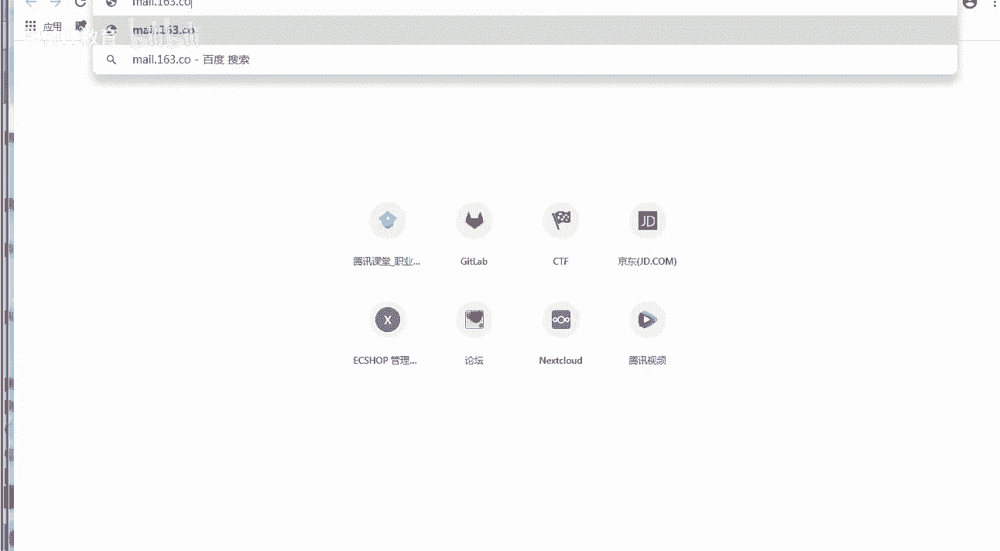
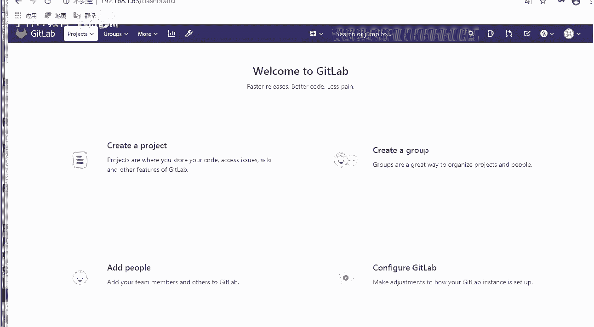
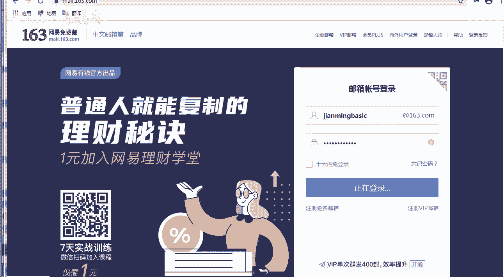
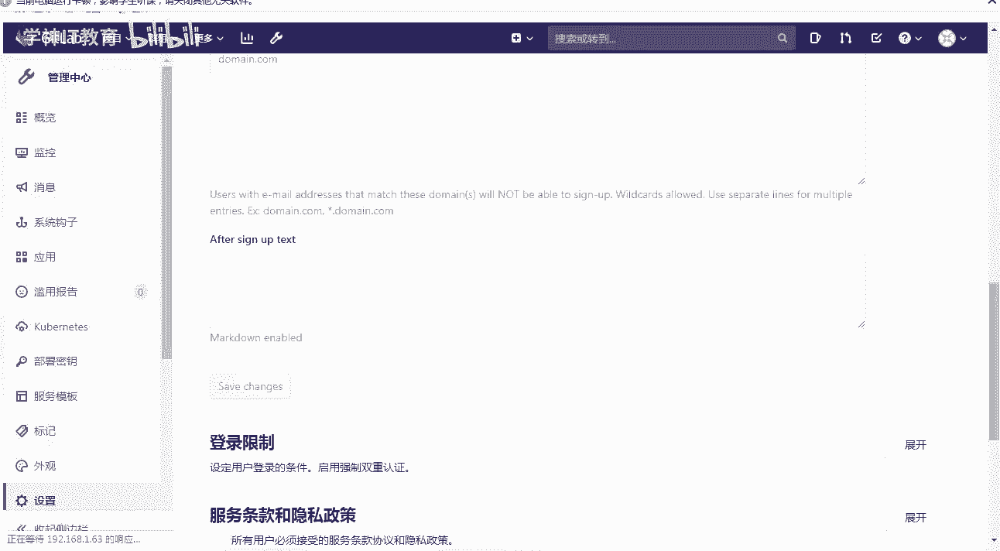
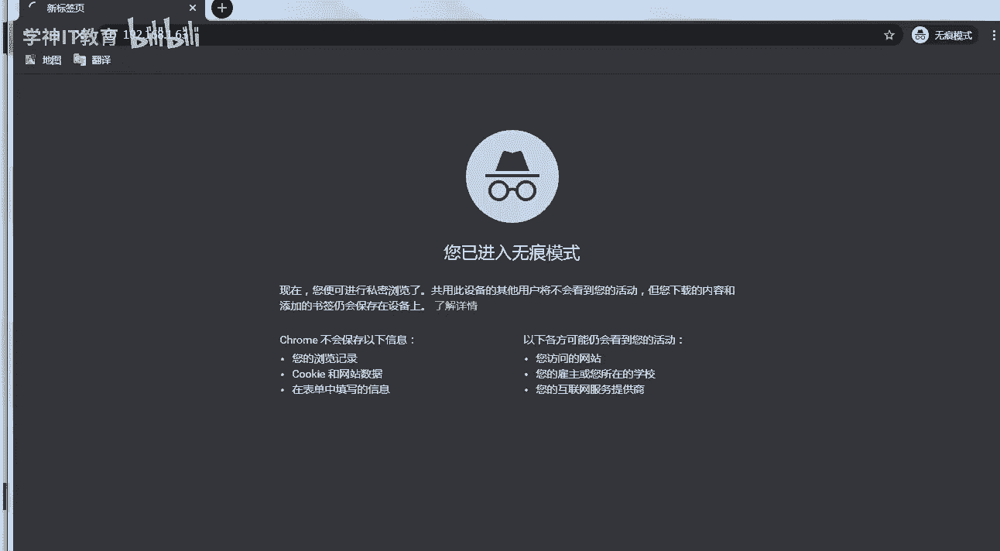

# Linux／Linux运维／RHCE／红帽认证／云计算／Linux资料／Linux教程--扩展-GitLab与Jenkins结合构建持续集成-CI环境 - P2：2-配置gitlab邮件服务和对gitlab平台汉化 - 学神科技 - BV1254y1C7rJ

好，那么怎么去汉化它呢？说到汉话的时候，很多同学都是说老师我们整个汉化的语言包是吧给它装上去？我告诉你啊，那是老的版本，那么新的版本直接自带了汉化。功能啊，就直直接已经支持中文了。

就说明中国又强大了是吧？因为我以前记得很多国外的软件都是支持英文，支持日文。😡，是吧就不支持中文是吧？对，说明咱们中国越来越强大了啊。而且我跟你讲的这个新版本确实是有用的。老版本是不支持韩华的。

新版本才支持啊，我给你讲的这个版本是支持的啊，我跟你讲的是哪个版本L我跟你讲的是12。9这个版本是支持的。原来是11这个版本以下都不支持的啊。好，安装完了，你可以删量他啊，删量他。节约点空间。

所以我们学新版本是有用的啊。那么总结一下getla配置一下它，配置完了以后，我们来用一下。那么怎么去关重启get cL stop start restart okgit labb的主配置文件是在这里啊。

你可以定一些邮件相关的一些东西，怎么发邮件。然后日志地址是想一下lab下有很多日志。所以后期大家真正报错了以后排错，应该从这里去排哪边呢这边。word下的logg钱看到了吗？这里面是我们每一个服务。

甚至logro体的都有日志残购的都有。全都给你弄的妥妥的。真的很不错啊，服务器的地址都有。然后呢，仓库地址也都有。你想想这么多的服务，如果我教你一个一个手动去搭建。随便一个NG是不是得耗点时间。

post green circle是不是也得耗点时间？普罗米修斯promissus做监控的啊是吧，res是不是也得花点时间啊，日志切割ground方图形美化的。他都需要好长一段时间。所以。

所以你知道刚才慢一点是有原因的，好吧，帮了你很多啊。好，说这么多，我们来要用它之前先对它做一下邮件上的处理。因为稍后我们可以实现发邮件的功能。好吧，当有比如说有合并请求账号注册修改密码的时候。

我可以通过邮件的方式给你通知一下，给你验证一下。发邮件这个功能是所有人都要会的，不仅仅我这有很多产品，现在都有发邮件的功能。比如说ja姆、堡垒机是吧，他们都需要有这个那怎么做呢？

登录让你的163邮箱点一下p或者P3啊，点开它以后，先给自己搞个授权码。听楚了吧，什么是授权码？在第三方登录的时候可以用的一个码叫授权码。听楚了吧。OK。好，为了您的邮箱安全，请设置授权码。

点一下这个Pop3，把这两个对勾都打上啊，打上以后呢，它会弹出这个窗口，你就去配佩自己的这个。是么授权码授权码并不是你的什么。对他不是你的邮箱密码啊。好吧，都有自己的授权码吗？😡，那一定要开一下啊。

如果你没有开的话，你一定要开一下。后期我们做监控，做堡垒机，做很多地方都需要用到授权码。邮箱还是很有用的。VMETCglablab点RB去打开它打开它去哪呢？第609行的时候好吧。

其实这里已经给你写好了，看到了吧？咱们配置邮箱。SMTP enable允许好，要其实你把这一块都去掉就行了。前面井号去掉就行了啊。然后邮箱的地址，SMTP邮件的地址。

SMTP pop SMSMTP的端口号是多少？啊，是465吗？默认是25好，为什么写465？告诉我。想想用户名写你自己邮箱的，然后这块不是写你的密码，写授权码，好吧，domonO写你的域，然后呢。

烙印等于出要不要登录是的。enableable好不好？all to等于t接下来是SMTPTLS force。for是不允许。好，我呢我要给你开启。这叫什么？对SMTP杠就是TLS经过加密的。

正常你的邮件是没有经过加密的哦，你要加密了，那就不是25端口了。😡，你要加密，那就是465端口。明白了吗？清楚了吗？各位。还好我没有把自己的密码写上去啊，我以为我把我的账号密码也写上去了。对。

这个465是因为我们走的是TLS就是加密协议。好吧，TTL也是一种加密啊，就跟SSL1样。然后呢，然后这个地方应该写上你的密码，我的密码是123456。不可能。拉到一边啊，不让你看到。

因为能看到你就能拿我的账号去登录了。保存退出。好不好？对，授权码肯定不让你看到。好，我们这边写完了啊。哎。清楚了吗，各位。对，正常SMTP是是25端口，我们这个不是。咱们用的安全一点，用的是465端口。

465是经过PMS加密的。好，那么拿到它以后再次进行reconfi，我应该早点。实行的。这样执行一次就行了，因为他太慢了啊。好，我们这边是吧配置完了以后，我们把那个步骤是吧，给大家说一说啊。

咱们所做的这个步骤是getla杠CL什么confi reconfi配置完配置完了以后，你可以通过命令去测试邮件是不是发成功了？怎么测呢？哎，ge labbs console。

他会给你提供一个这样的一个什么呀交互的一个界面。啊，提供了一个这样的交互界面，你执行这个命令要等一会儿，等个大概几秒或者几十秒，你的是吧，sll界面就会变成这样i如笔。然后后面一个提示符。好。

这是一个提示符啊。整个这个是一个提示符，然后你在这里面输入什么呢？notaughtify test email按固定格式去写，好吧，然后这一块写上你要发给谁？OK邮件的主题，你自己随便写这个单引号。

逗号，逗号后面跟上邮件的主题，然后跟上邮件的message body，也就是邮件的正文。好吧，后面括号什么deliver now，就是现在要发出去它。O整个有脚本的格式就是这样。

你调用这个notify test email就行了。清楚了吗？啊，那么这样的话，你就能去邮箱去测一下。如果我们真的收到了这个邮件，那就没有问任何问题了啊。我这边已经OK了，好快呀。比上次快一些啊。

他少了一些步骤啊。G lab reals Council。这个脚本你是记不住的啊，你就直接复制就行，好不好？因为这个脚本有又有大小写是吧，测试等等，你就改什么，在我word文档上改好，改好以后是吧。

直接粘贴就行。那你等等他啊。我能去登录上我的邮箱。看一下我能收到吗能啊。mare点163点comM。

QQ邮箱也是一样的啊，也有这个授权码啊，所以你使用QQ邮箱也是可以的啊。

你别写我的邮箱啊，我看因为我的邮箱时不时就收到什么。😡，对我时不时就收到一封莫名其妙的邮件。啊，就是有有有的同学可能怎么样？

对，莫名其妙的就发给我了。粘的时候说，你粘的真的很多同学粘的时候来，我们就输这个吧。输完以后MK我没有收到邮件啊。😡，不是我的问题是吧？对你要写你自己的啊。😡，不过话说回来还真有很多同学。对。

会有很多同学啊。你比如说什么呢？我们打开我的邮箱。你比如说这个人。我也不知道是谁给我来一个测试邮件标题，磁盘空间不足，这明显在B报警的时候写的是我的邮箱。是吧。对不对？很明显啊。好，这边已经启动成功了。

我们登等他啊。马上了啊。好，那这个地方已经弹出来了。谈完以后呢，我们把那个命令往上粘一下啊，给大家快速的发一下那个邮件，好不好？对。好。完事以后呢，我们呃，发成功了啊，他没有报任何L相关的一个东西啊。

他并没有报。然后呢，我就听到咕噜一声，咕噜一声，你看这个地方已经完事了是吧？21点36的时候，get lab测试邮件已经成功了，说明我们这块发的是没有任何问题的。

内容证实我写的邮件正文message body这样写让你知道哪一段是正文，哪一段是不是正文。好，有了这个以后，后期我们在ge上，比如说我们做一些测试或者做一些注册功能，就是很轻松就能搞定了。好。

说完这个以后呢，我们来再来怎么样。对咱们再来给他汉化一下啊。嗯，汉化的时候是怎么汉化呢？他是可以这样喊化的，看一下啊。原来老版本我们是需要把汉化包是吧？上传一下。那么对于新版本来说怎么样呢？

可以看这好吧，点一下s屏。直接点三庭就可以直接去使用了啊，你稍微等等他。你看整个这个界面，你看着确实不是很舒服是吧？啊，那么在这里点preferences相当于属性啊。去修改，你可以修改他的是吗？

界面啊，包括这个代码的界面等等，都是可以修改的。OK好吧，我们需要怎么样呢？往下拉一下啊，这是语法加量等等相关的功能，你都可以设置啊。好吧，我们在这里选择这块。OKlo相关的一个loc。

locization本地的，然后我们选择以。田岭中文。好不好，OK简体中文。好，点完以后呢，点C。保存。好，这样的话就保存成功了。保存成功了以后呢，哎没变是吧？没关系，刷新一下。好。

到这你可以看到已经没有任何问题了啊，简体中文已经成功了，这样去看就舒服了很多。好不好？对，这样就看可以舒服了很多。默认用完了以后，我们这个是有注册功能的，咱们这个ge他来吧，你是希望他注册吗？

对你们公司那个代码管理服务器是谁都可以注册的吗？正常一个网站是希望任何人都可以注册的，而get lab不一样，好吧，gt lab是不希望谁都可以注册的。因为我是管代码，所以在这里我们要设置一下，好吧。

在这里点这个管理中心啊，管理中心里面有一个什么，我们去找一下设置。OK。😊，啊，好，点管理中心。你是不希望是吧，你是不会希望任何人都能注册你们。😡，公司的这个代码管理的啊。所以我一般情况下我会把它给。

怎么样关了好不好？用的时候很简单，new project创建个项目，创建用户，创建新的组就可以了。好，我们在这里点一下最下边设置设置里面点通用，好不好？OK那么在通用里面有啊。哦，连一下通用。

通用的它有很多啊很多设置。那我们往下去找一找关于什么呢？关于注册这一块的注册限制方式，然后点展开展开，这里允许什么s up，允许注册。你把那个对勾要点上，这样的话就不允许注册。然后呢，保存在哪里。

保存在最下面。啊，C称。这样的话，我别人是无法怎么样。对，无法注册呢。后期所有的账号信息只能由管理员给你提供。

新建无痕浏览器。当我们去打开一个新的窗口的时候，大家请看到啊。来，你可以看到这个地方，当我们打开一个新的窗口的时候，你看。

稍等等他啊，他还有注册功能是吧？可能刚才还没有生效，你看我强制刷新了一下，已经没有了，这样的话就完美了，明白了吗？同学们。对我们不需要别人去注册的啊。你没想过这个事情吗？嗯。

对我们是默认情况下是需要关闭啊。每一块是怎么做的？MK老师都给大家写的很细啊，跟着我的箭头去走，你绝对能做出来。😡，好不好？那么稍后呢，我们来真正的开始用一下get lab。

行不有？