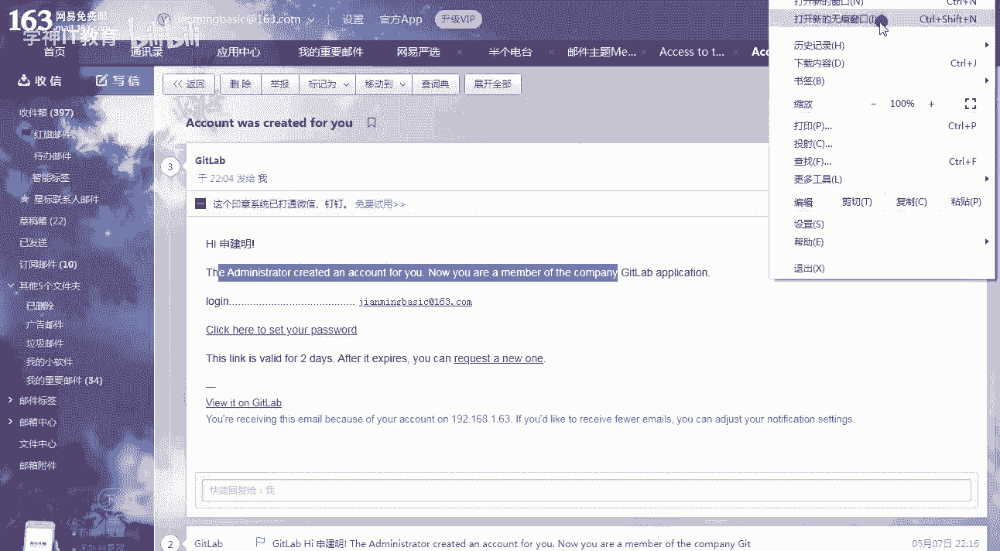
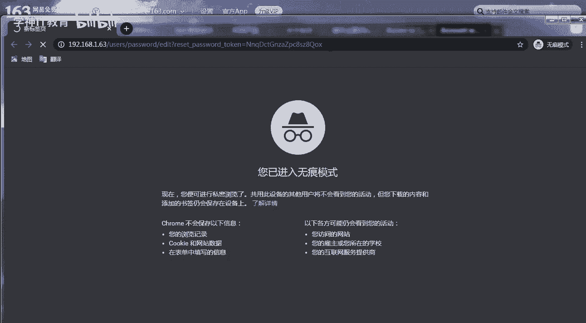
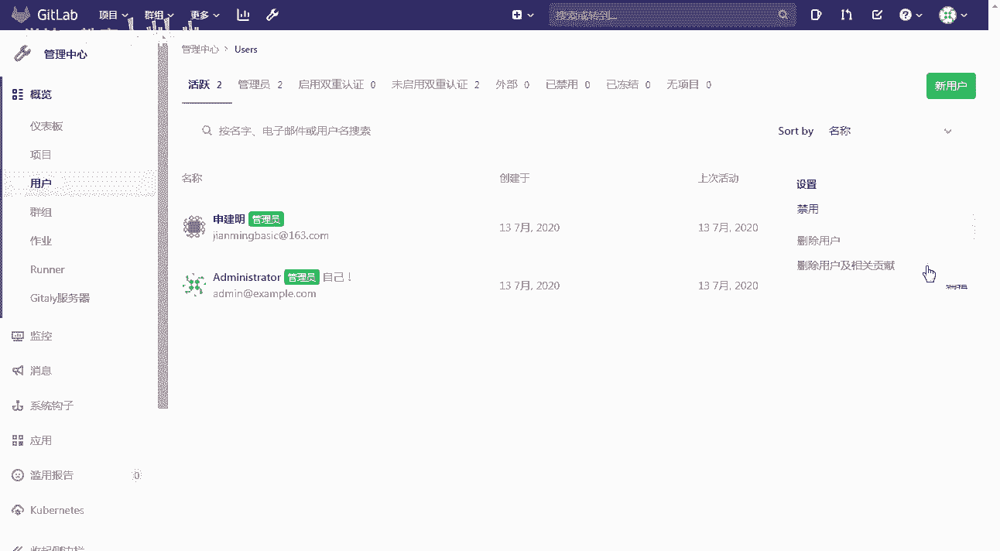
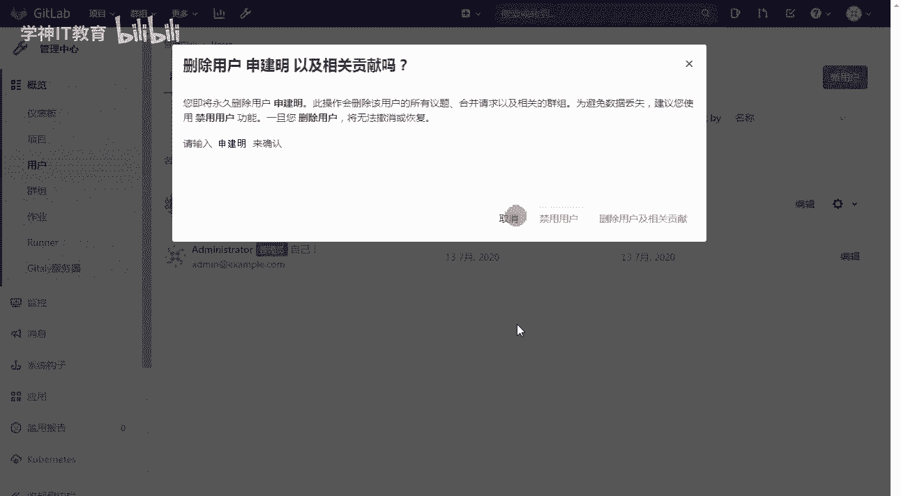
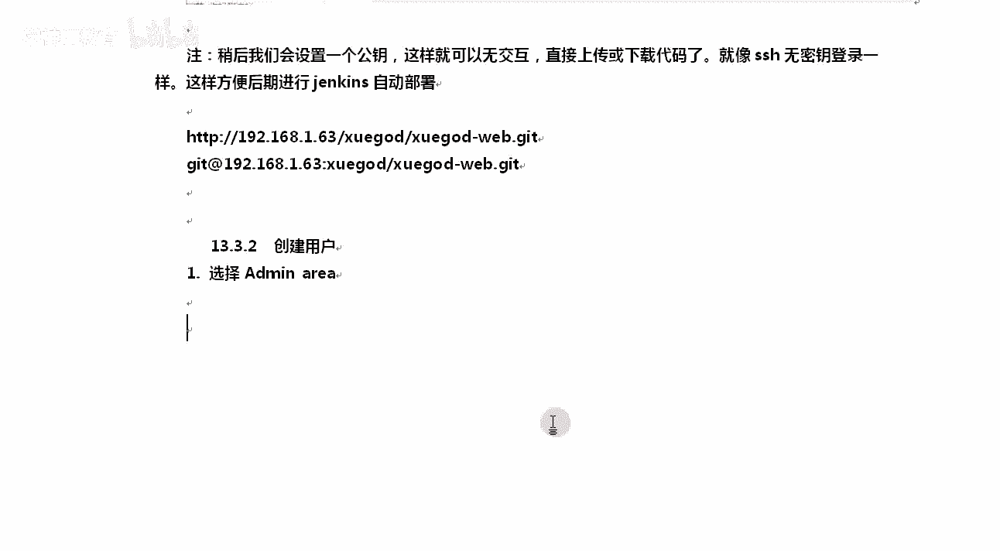

# Linux／Linux运维／RHCE／红帽认证／云计算／Linux资料／Linux教程--扩展-GitLab与Jenkins结合构建持续集成-CI环境 - P3：3-gitlab日常使用方法 - 学神科技 - BV1254y1C7rJ

好，那么接下来我们来讲一讲getlab相关的这些个内容啊。比如说我们讲一下如何使用它好不好？首先呢我们先新建一个项目，新建项目的时候好不，要新建怎么样，新建一个组，好吧，项目是属于某一个组的，清楚了吧。

也就是说我们这个项目具体是保在哪个组的，好不？所以你应该先怎么样，先选择group怎么去做这个事情也很简单。其实你点这个t labb啊，点这个首页，从这里也可以点create protocol啊。

project创建一个项目也可以点管理点哪都行啊。其实。好，我们点一下这个管理啊。点完以后呢，我们新建一个group。每一个项目都属于一个组，只有我们都属于这个组的人才能玩这个项目，懂我意思了吧？

比如说MK老师创建一个内容吧，我们创建一个学尬的这个组组名叫学尬的web啊，组名的话就不要带空格了啊，看到了吗？因为什么？因为它会自动从1921681。63给你创建一个目录。

这就是访问我这个组的什么东西啊，访问这个组的东西，然后呢，我们的描述里面可以这样去写点好，比如说我叫学挂的外b开发组就可以了。权限这个地方我们其实可以选的稍微大一些啊。理解了吧啊。

比如说我在如果这里选择的是私有，那么组籍其项目只能由组里的成员去查看。如果你不是我这个成员，你是看不了我这个东西的。清楚了吧，可见性这一块，然后内部内部就是任何登录的用户都可以查看该群组的所有内容。

OK组有一个权限好，这个组有一个权限，我们稍后创建具体项目的时候，还有一个权限。清楚了吧啊，他有两个权限，一会我们用的时候，我们再一次去详细的去看看这些内容。OK啊，比如说我们这个时候选择私有这个地方。

好，那么选完这个东西以后呢，我们往下。接下来继续。那往下允许用户访问。是的，允许然后允许创建项目，谁可以创建项目。谁可以就我我我这个组里面什么样的人可以创建这个项目是吧？你是开发，你是维护人员。

你是可以的。好吧，开发和维护人员可以在我这个组里是允许被创建项目的，允许创建子群组，只有谁，只有维护者才有维护者相当于。超级管理员的一个权呃，所有者，那当然是超级管理员了啊，所有者是超级管理员权限。

就默认就行啊，默认就行。拿到这两个以后呢，我们往下继续。好吧，点一下这个这还有个to factor两种认证方式，我们先不选那个客户端那那那种方式认证啊。就相当于我们登录京东的时候，可以扫个二维码一样。

我们先不用这种客户端直接账号密码的方式去创建。这样的话我就创建了学挂的这个组，创建完学挂的这个组以后。在组里面，你再去创建什么project，好吧，组里面再去创建project。好。

我们来创建project。我往上拉一下啊，那么怎么去创业project呢？同样在这里也可以啊。好，另一个 project。啊，另一个 projectject啊。好，我们创建一个project名字。

你这个project的名字叫什么名字，你可以自己写啊。比如说我这个叫做学的下划线web好不？我就创建了一个学的web。那么它属于你看这是项目的名称，项目的UIL真正访问这个项目的时候应该是什么。

默认是1。63rootroot下学的 web，我们应该选什么，我们应该选择这个组，因为我是学尬的这个组里，好吧，不是root这个组里面的，清楚了吧，选这个就行了。描述的话可以随便去写点东西。OK。好。

加上去加上去以后，你看这可见级别。好吧，能点内部和公开吗？不行，好吧，只有私有这一项。私有这一项是什么？project访问的时候，mat be必须g被赋予每一个人的一个权限。

我必须给你付一个跟你用户付一个权限才行。好吧，如果这个是一是吧，组的一个部分去访问的时候，同样也要被授权，被这个组进行授权。OK这就相当于是一个私有的一个仓库啊。好吧。

怎么才能让内部和公开这两个也可以被人访问呢？嗯，想上这个事。你怎么才能让怎么样？😡，我们先把这个给大家翻译一下啊，为什么这两个是灰色的内务和公开，这里只能选私有的。因为前面徐挂的已经指定的是私有的权限。

好，这一段还翻译过来的意思是必须明确授予每个用户目录访问权限。好吧，如果该项目属于组，那么将授予组成员访问该权限。就是你要么是因为我这个学案的这个组啊，在创建的时候，你看我给的权限就很小。啊。

如果我们的学看的那个创建的时候。大家可能忘了啊。我当时给的这个权限，如果这是学挂的创建组的时候，如果我写的内部好，或者我选择公开。我也就是这个意思是我这个组里的项目都是公开的。清楚了。

我现在选的是我这个组是私有的。也就是说我这个那么凡是属于我组里的项目都是私有的。清楚了吧？OK如果你选择的公开，那么。在真正创建这个项目的时候，你可以选择公开，也可以选择内部，也可以选私有。

一旦上面选了sU就都是C了。懂我意思了吧。好，那知道了这些东西呢，我们点一下确定。创建一下啊。没打没有点那个啊使用自书文件，什么初始化仓库，这个没选，没关系。好，我们点点完以后等待他一下啊。

让他响应一下。好，那么这个地方是添加一个SSHK添加这个K，你就可以说不输密码方式直接去就是我可以通过SSH协议去怎么样去访问get通常情况下，我们以前访问get的时候，都是通过什么都通过HTTP协议。

那么有了这个以后，你可以设置一个公钥，后期可以无交互去上传和代码，就像SS无密钥登录一样，方便我们实行kins部署。现在怎么样先不创建啊。好，所以你就插掉它就行。好，那么这样的话，我整个项目已经有了。

啊，已经有这个项目了。然后呢，你想做的时候，下面不是有吗？具体使用的时候，get你就用get就行get是吧，先做一个全局设置get configure global配个用户，配个邮箱。

然后呢创建一个新的仓库，好吧，克隆下来克隆下来，然后创建个文件，添加添加完了comit提交，提交完了push杠 origin master。好吧，要这样啊，指定他的原是master，然后呢推送是吧。

这都可以get push already master。好吧，push之前一定要先commit一下，然后才能push啊。OK这里面就没有什么check out那一说了。😡，好不好？好。

我们知道了这些东西，那我们来创建一个用户。现在我先不不对他进行什么操作啊。啊，不对他进行操作。那么你想克隆的时候，可以这儿啊看点那个克隆有两种方式，也可以可以选择这个，你也可以选择这个。

我把它给你复制出来啊。你也可以，就是我如果搭到外网上，你把这个这就是我的get地址记住它是点GIT啊，不是什么HTM。😡，好吧，如果你想走SSH的这种方式，那他的写法就不一样了，它是get art。

是这种写啊，链接也不一样啊。好，说了这些东西以后，我们需要怎么样呢？咱们需要有个用户才能使用它。所以接下来我们创建一下ra用户。来管理。你这个用户必须要是学的组才行啊，添加用户。好吧，提安用户，然后呢。

输入新建，你也可以从哪呢？也可以直接从这。啊，就是比如我们点管理中心点用户，从这里也是可以的啊，我重新给你重上点一下。那如果点到这儿，那你就需要从这儿再点。好不好？输入上你的用户的名称就可以了。OK。

名字是什么？名称名称是你真实的名字。比如说MK我真实的名字就是孙建明。好，我的user内容是。是你登录的用户名叫建名basic啊OK邮箱是这个。好，说完这个东西以后，密码。

你看reset重置密码的链接会给你发到你的邮箱里。清楚了吗？对他会给你放到邮箱里啊，access默认就行了。好吧，OK接下来注意access levels，你这个用户后期想要拥有什么样的身份呢？

我希望成为addmin这个身份可以吗？你就点addmin就行。啊，你要想成为什么，这个叫什么run。OKregular是吧，reular regular就是。怎么样？普通用户啊。

OK regular就是普通用户的意思。我想成为管理员啊，我想成为管理员，这样后期我才能在上面创建文件等等这些东西。普通用户只能。是吧提就是把他拉下来。OK好，拿到这个。那么关于文件的一些，你看。😊。

什么twitter账号啊，领命账号了，skep账号这些东西都没有没有的话，先创建。这样我们就创建成功了啊。创建完了以后还不算完事。好吧，我这个人我这个用户我们不属于某个组。

我还得需要让他属于某个组里面才行。所以在这里我们选择一下群组。好，那拿到这个群组以后呢，我们点开学尬的这个组，我要将我加进来。好，我要将他加进来，加的时候将用户加入好，点一下这个地方就行。清楚了吗？

OK你选择好不好？没有指定用户是吧？那我们指定一下啊。😊，从这里可以自然是搜索。好吧，对你从这里可以搜索选选搜索什么呢？搜索我这个这样就可以填下去了。可以吧？各位。对你你从这里搜索一下就可以了啊。

那我们选择我自己的名字，好吧，选我自己，选完自己完了以后用权限这个地方report。开发是吧，维护hoorownor的权限最大，其次是他再就是developer啊，开发和这两个是有上。

包括就开发网上是有什么是有上传代码的权限的，它是没有包括gues是没有上传代码的权限的。所以你就选择honor整个项目的什么整个组里的拥有者就行了。他是一个拥有者的权限。在这个组里在这个组中，对于什么？

对于这个组里的所有的项目是拥有拥有者的权限的啊。将用户是吧，加入一下。好，这样的话整个加进来了。那么整你看群组中的成员有他好吧，对，有这两个有这两个权限。

你看他和admin root对于这个组是拥有一样的权限，都是honor，只有最高的权限啊。拿拿到这个以后呢，其实如果你去邮箱里看一下，我其实我在我的邮箱里已经收到了一封重置的账号，看这。好不好。

excess访问你的组去做你自己想要做的事情就行了。好吧，你是什么被授为honor权限了。OK发两封。第二个是这个地方。你好是吧，你好，请点这里重置一下你的密码。好。

通常情况下这个地方我会复制一下这个链接，在无痕浏览器下去打开。

啊，我不希望他跟我们。现有的我是以超级管理员登录的啊，如特登录的。

好。看到了吗？对，这是改密码这一块。我不知道大家有没有那种经历，就是QQ密码找回你同时登录了2个QQ号。然后你想找回其中的1个QQ。登着登着改着改着，你就不知道到底应该改成哪个QQ的密码，就改错了。😡。

有那种经验吗？所以你整个无痕浏览器啊。尤其是你比方你有两个QQ号是吧，QQ一已经先访问了空间。然后接下来我要找回QQ2的密码，他又要在浏览器上打开找回密码那个地方。

结果改完改完以后是把QQ一的密码给改了。学挂的D2CN好，输入上称至爬错的。这样的话我就OK了啊。登录一下。不用写邮箱了啊。好点CN登上去。好，这样就OK了。啊，已经可以登录了。我问大个问题啊。

我当前是谁，你看我当前是我是吧？那如果我忘了密码怎么办？我也没有写邮箱，好吧，那我告诉你还有一招，还有一招是什么呢？在这里啊，如我是以你以超级用户admin登录。😡，好，你是我以是我是谁呢？

我是按min，我已超级用户登录以后，你可以编辑一下，就是我可以对任何人改密码。😡，好吧，我可以让你你看这在这个地方，我可以从这里直接改你的密码。好吧，超级管理员是可以直接改你密码的啊。好。

那这个地方大家知道一下啊。那么如果我想删除用户呢？关于用户管理这一块，想删也很简单。把它删一下，然后删除用户及贡献。

清楚了吧，那么比如说我想删除用户及贡献。看到了吗？这样的话就删成功了啊，清楚了。那么他怕什么，怕你误删除了，所以怎么办呢？你看您将永久删除用户是吧啊，那么这样删除的时候会所有都给你删，好吧。

请输入什么呢？请输入这个名字来确认，这样是不是一个好处，怕你自己删错了。好不容易我写了那么代码是吧，点错了。啊，所以你把那个名字什么要写上去，你不写对这个地方就不亮啊，假如我写这。它是不亮的啊。

我们点取消，我就不删了。

所以整个做的这个挺到位的是吧？好吧好，挺到位的。另外我希望修改你在我这个群组中的权限，你可以怎样呢？学尬的。假如说点开，我想看看你的这个拥有者权限。我不觉我觉得你这个权限有点大。好吧，权限有点大。

可以怎么样呢？可以可以改吗？可以啊。再选择它再选一下。比如说我我选你为维护者，然后点添加就行了。好吧，或者直接从这里管理权限也是可以的。清楚了吧。OK然后选下你的这个地方。都可以啊。哎。

对你是可以直接编辑他的这个权限的。好，权限这个地方大家知道了吧？点这个owner是吧，随便你自己选一个都可以啊。我们在这里随便选一个。他是都没有问题的啊。OK这没有问题了，我们再点管理中心。

选有我们的项目嘛，你你有哪些项目呢？😡，好吧，你有哪些项目，你可以从这里看一下啊，我的项目。OK我的项目有谁呢？有这个学霸的是吧？那么你可以点一下X或者点一下这样都可以啊。我你点一下这个X。😊。

他就可以访问到我们的项目。有时候大家不知道我自己的项目地址是多少是吧？看着你自己的项目地址其实挺有规律的，就是前面是get live的地址。然后呢，这是群组的名字，群组名字后面跟的就是你的项目的名字。

好不好？就是你的项目的名字啊。好，那么拿到这个。我们可以从这里面先新建一个代码，之前我们都是我们这样，我们新建一个代码，好不好？你可以直接点。OK比如说我们新建一个文件，关于它的使用，如果你不会的话。

你从这里跟着这里面去洗。😡，叫你们来就行啊，我再打开一个标签，稍等。我把这个标签给大家保留下来啊，一会我们参考这上面这些文档是吧，来真正的快速的用一下get好不好？好，我们点新建文件。

我们新建个index there。HTML这样的一个文件啊嗯。肯定属于master分支了。master分支，然后模板类型的话可以随便去选就行了。啊，OK比如说我是默认的还是docker。

我什么也不选也没关系啊。那它就是HDL这样的一个格式。然后我们随便往里写下东西，3W徐点C。就是一个测试页，好吧，完事以后新无论你新增什么文件，你提交的时候都得commit的时候都得写。

对我都愿意写点提交的信息，好不好？后期根据这个提交信息去判断你这次做了哪些修改。comit提交一下啊。好，这就是他通常的这个外卖请求。好吧，关于后面的CSCD后面的这些东西，我们慢慢的再跟大家去分享。

那这样的话，我们算是已经OK了。好master已经有了一个内容了。相当于已经有了第一个版本了，稍后呢我们拿get来使用一下。

