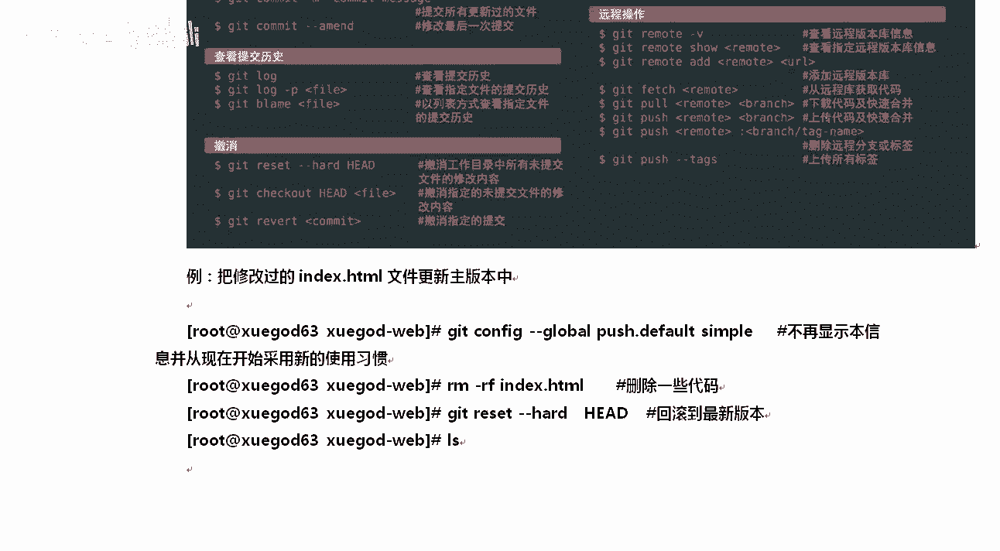

# Linux／Linux运维／RHCE／红帽认证／云计算／Linux资料／Linux教程--扩展-GitLab与Jenkins结合构建持续集成-CI环境 - P4：4-git客户端使用技巧 - 学神科技 - BV1254y1C7rJ

那么接着我们来快速的去看一下客户端上到底是如何使用它的对吧？前面我们的外b界面都OK了吗？OK了，我们来看一下。首先呢我们的地址是什么地址，你可以参考我刚才保存的这个页面上来做这个事情，好不好？

咱们整个地址是怎么样的，我来给你切一下啊，你可能看不到我的切面，我当时为了让大家知道怎么用是吧？我我把这个界面还给大家保留了一下。清楚了吧，一旦你更新了文件以后，这个命令行的指引就没了。

你看我在另一个链接上打开的时候。他就没有对应的这些代码相关的描述了啊。啊，所以我提前给大家做了一下一个准备。OK它只有这样的一个东西啊，只有告诉你克隆的时候应该怎么克隆，我们选择HTTP这种克隆方式。

好不好？先把它复制一下，复制完了以后打开。

那么接下来都是客户端下的一些操作了啊。

好，我们把没用的关一下啊。所有的这个get都是啊先来全局设置。然，我们把那个代码给大家克隆一下。退出一下啊。克隆一下。请输入用户名。密码是。徐卡点森。学杠的点CN啊。好，这样的话我们就克隆成功了。

克隆成功了以后，当前目录像有一个学挂的外，有了它以后就可以了。那么其实大家正常看的时候，LS下只有这一个，实际上不是呢LS杠A你看的时候，其实它还有一个隐藏的点get。好吧，还有一个隐藏点get。

那么LS点get下其实也有一些东西。好，所以大家真正的网网站上上传以后，你要怎么样？假如你真的要把代码上传到那上面来，那你要记得把你上传的那个。版本库的下面的隐藏的一个东西要给干掉。啊。

要记得要给他干掉啊。这样的话，我们每次大家要注意啊，我们每次都得输入账号密码。如果不想输入账号密码，后是可以通过SSH的方式来实现这个事儿。OK。😊，好，知道这个以后呢，我们来看一下get的使用技巧。

gate初次运行这个ge好吧，那么在新的系统上初次运行的时候，你要怎么样？你要写一个点拜事，你。啊，点b文件，你要写一个波浪号现的点get configure这样的一个文件。好吧。

我们要写一个这样的文件，这个文件怎么写呢？可以这样去做这个事情。其实我刚才那个地方已经给大家写过了。来。get configureg user name这样去写一下。

其实就跟这个一样。看到吗？把它复制一下，改上你的邮箱，用户名和邮箱是一直要有的。OK这是一个全局配置文件。这样的话，后期每当我们有提交代码的时候，会把你的用户和你的邮箱都怎么样提交上去。这样的话。

后期我就知道到底是谁干了这件事。谁提交的代码？那么他会在哪呢？他会在加目录下创建一个get configure。看到了吗？会把你的全局写到这儿。那如果你不想写全局，我只想怎么样，或者我这里面有很多账号。

😡，我就想自己每一个项目都有一个自己的文件，好吧，我有好几个账号。对不对？我想切怎么办？比如说关于学案的这个东西，我就想整其他的那可以这样VM点。当前目录下有个点ge gate下面有个confi。

你可以改这。如果是看到了吗？这里面默认会有cor remotemote origin，然后branch master它会有好多东西。你可以手动在这里面写U的，好吧。

alreading就是原就我真正提交项目的时候，应该提交给谁？😡，他要去读这个变量，否则他也不知道应该提交给谁。好，那这个时候怎么办呢？嗯。对，现在是没有这个user是吧？我们可以这样，不想写全局。

你就进到你的项目文档里执行confi user name界名basic。然后呢，再设置一下。好吧，一面完事再去打开就可以了。看到了吗？这样我们去打开的时候，你能看到账号密码已经有。OK。听楚了吗？

VI打开它确实新增了，这就是这就是什么？初次啊，初次运行的时候，你都要去做这个事，要么你是配个全局的。😡，懂我意思了吗？对，要么你就给我配个global全局的。如果你是什么单个的，那么怎样？

对于单个的这种好不，你仅仅对某一个项目有效，那你就在这个项目下面去写。get configure里面去写就行，执行的时候怎么去做的也很清楚。怎么去做的呢？咱们是这样做。

先让CD到项目下VN打开打开去执行confi就confi不写什么global。啊，不写global参数了，跟刚才那个其实是一样的啊，只是我没有写global参数。好不好？好，知道以后呢。

我们来把get它的详细的使用方法再给大家说一下初始化。初始完了以后，你想具体使用它怎么去使用它？好不好？对我我我们想具体使用的时候可以这样去使啊。

global configurefi设置全局的global user name邮箱，全局的用户名和邮箱这个地方。

然后confi global list列出全局用户的设置ge add index是添加文件到暂存区。好吧，如果你新建了一个文件，你要先ad一下，添加到暂存序，然后commit提交到工作区域。

这个时候还没有真正扔到服务器上，好不好？ge push才行。所以后期经常是这个。And。添加新文件，添加完了以后，然后confi configurefi好吧，加个描述。

其实confi这个地方就要提交到工作区更多的情况下是说我们这次要提交的时候，我要加个描述push pushush提交上。好，pro就是获取代码的意思。OK除了克隆还可以通过炮的方式啊。

泡前提你已经有已经在本地下过一次了。然后查看日志，然后你想忽略了什么文件，然后get resetset hard是res是回滚，你想回归到哪？你要写head一个是吧？向下的监控号叫做head是当前好吧。

加一个监控。上一个加两个上上个版本。OKgate reloglog这个东西需要大家记啊，reset hard。😡，假如说我有好多版本号，那你可以通过ID，你怎么看ID呢？😡，R flag。

可以获取每一次提交的ID。这不像SV是吧，SV8门18门28门3。他是通过ID的方式啊。还可以get branchch查看文字，check out切换check out不叫取出是切换。

那么为了让大家更好的去理解M田老师，还给大家整了一张图片啊。那么在这个图片里面，你后期慢慢去查就行。

好，说这么多，我们来用一下。快速的用一下啊。

使用的时候，比如说我想将它更新一下，那么怎么做这个事情呢？可以这样，我先切到这下面，切到这下面A口我们去。执行一下这个命令啊，这个命令都太简单了，我就直接。直接搞了好不好？anleBBS index。

OK原来是学杠的点型，现在又加了个BBS，你想给他用一下，怎么用呢？get先添加index。好吧，添加完了以后，get commit，当然它可以摁table啊，杠M。然后写上东西，比如说我添加了BBS。

好不好？OK添加完了以后呢，就叫添加成功了是吧？一个文件发生了变化，还没有真正的扔上去，扔上去的时候是get push。OK。get push的时候记住啊。

看这get push default没有进行设置，好吧？O默认是吧？从2。0以后由 machinein改为了simple，所以你不想看到这个消息，那怎么办呢？

你可以执行get configure push default machine，或者你采用新习惯。好，我估计你们都没有用过老版本。

所以你干脆就直接用get configurefi global push default simple就行，不用谈那个了。conrl C结束实行这个。直接用simple经。精简完了就行啊。啊。

这样就OK了，请输入什么？你看我我问大家一个问题，get的push的时候，我怎么知道他怎么知道要push到1。63上。😡，建名被。嗯。好，已经提交上去了啊。对吧已经提交上去了啊，已经提上去了。

他怎么知道？对，因为我们在。在什么在这下面有个是不是有给他？com格在这里面origin远端的origin就是原的意思，就是这个路径。看到了吧？origin远的圆就是这个路径，所以他才知道。好不好？好。

那么哎，对了，问大家一个问题。如果这儿有个user，当前目录下有个user账号和密码，然后呢，用户的加目录下也有这个东西。以审为主。好吧，我告诉你，这是全局的，这是局部的。如果局部有，先以局部为优先。

😡，清楚了吧。对，局部的要先优先一下啊。好，那么这些东西执行了以后呢，假如有一天我不小心把index给干掉。好吧，干掉没关系，我可以重置一下，回归到上个版本。可以吗？可以的，resite。啊。

resit杠杠 hard的从那呢haHEAD。这9。回哥上来了。稍等啊。唱错了。好不好？直接回归一下，回归完了以后，你可以看一下。这就是上个版本吗？啊，也就是回味到最新版啊hi啊。上个版本是这个是吧？

Oh。看到了吗？是不一样的啊。OK。对，上个版本只有这个最新版的时候还有什么？还有BBS的。好不好？好，大家知道一下啊知道一下这个东西。😡。

我给你笔记总结一下啊。好，那通过它可以回到最新版，然后呢，你也可以怎么样？如果我也不知道到底是哪个版本了，我想看一下历史版本，那么有relog。

get re，那你能看到，比如说哪个版本呢？012是吧，其实它上面也有一些版本号，更多的你可以通过这个来指定。好不好，那个ID。OK。清楚了吧，对你可以通过恢复到具体某个ID上，这都是可以的。😡，好。

知道这个以后呢。

我们来说说这个。

什么呢？工作区和暂存区好吧，工作区就是编辑的，需要将文档通过ad好吧，添加到暂存区，然后再提交给他。而工作区有多个文件可以同时将它添加到暂存区呃，这个地方大家工作区和暂存区啊，大家记的时候。

你用的少，你总会记错，你就这样这样记就行。好，我就记住命令，我需要先艾一下，然后commit一下，然后push就行了。艾 commitit pushush这三部曲必备的。😡。

这就可以了。好不好，所以大家也不用太纠结，越纠结是吧，什么工作区，什么暂存区好不好？对，先艾的艾的完了comitcomit的 pushush这就行了。😡，反而英文是吧，直接进英文更简单了。好不好？好。

知道这个以后，如果我想创建一个新的分支呢？比如说我想创建个BBS分支。BBS分支是这样的。ge branchch B BS。好吧，完事我想切换到这里面，切的时候是get check out。听楚了吧？

BBS。OK啊，蔡花我都拼错了啊。😊，CH啊C是ECK。这样我就去啊。签完以后呢嗯给他。Branch。什么也不写，他是查看我当前的分支新点BBS代表我是在BBS这个分支上。好，那在这个地方以后。

我们讲讲。我的分支怎么合并到主上呢？这样吗？我比如说我现在在BBS分支上，我们添加了1个A点TST。添加完了同样三部曲啊，先艾的。完事以后，get commit杠M写东西。添加了A点天NT。

然后get pushush。我现在在分支上是吧，去做这个代码get push的时候，如果你是在分支上，你要指定一下origin。啊，大忧。到底要push到哪？我push到origin上origin。

他他是有值的。清楚了吗？嗯。密码。对。这个杠否则我不知道应该push到哪个地方，因为他也不知道BBS到底是哪。好吧，所以你要写一下你看分支BBS设置来跟踪为origin的远程的一个分支。

这个origin到底是什么？你可以看一下coner。origin好吧，看master masterster。😡，branch啊remote origin origin是什么？

就是它BBSBBS的远端是谁，也是这个这个仓库地址，其实就是origin，你可以理解仓库的地址到底是什么，它相当于是一个变量，好不好？里边给你写了仓库的地址到底是谁。OK。😊，对你写origin。

就是这个地方VI打开，这就是orrange它的地址。UIL地址到底是什么？那么这个OK了以后，我们去查看分支的时候，它也是有的。刷新一下。原来只有master吗，那现在呢？😡。

看现在master下是不是有BBS。好不好？OK怎么将BBS的东西合并上去呢？这几个东西大家要记一下啊，无论你是做开发的还是做什么的。😡，我想跟他合并一下。合并的时候分支合合并当主干上是吧？

ge check out。先切到master上，好吧，从分支切换到这上面，然后合并的时候用的是。G march。BBS我要将BBS合到主上，好吧，这就行了，这不添加了A点TNT吗？添加完了以后。

你在给的铺ush往浮墙推一下就行。好。每次输密码是不是不爽呀？一会儿我给你整一个不爽啊。OK你看更新被拒绝。因为当前的分支是吧，的最新提交落后于对应的远程分支是吧？在次推荐前先变更。嗯，先远程合并。

然后再想。我刚才在推的之前时吧，我改过东西。这道吗？就我刚才最开始我那来回的切了一下。整个流程他就是这样的啊。我是你们合并的时候肯定没有问题啊，因为我我在那上边。就是我的分支跟来源是吧。

我应该你要创建分支，一定要以从什么，从最新的那个分支啊去创建啊，新版本上。😡，OK否则合并无商。听楚了吧，那这个合并上怎么办呢？其实还有一个方法。最简单的是你把那个东西是吧，发给他就行。

A点填的题就是考进来了，反正考进来，我重新再把它添加一下。这道了拷进来是吧，重新get add添加一下就行了。然给他铺ush。就这几个文件吗？好吧，康明的。然后给他铺ush一下就行。好。

这是关于这个地方。记住合并的时候就用的是mch。好，默耳日就可以了啊。好，说完这些东西，那就是关于ge的使用。稍后我们来聊一聊dkins。

