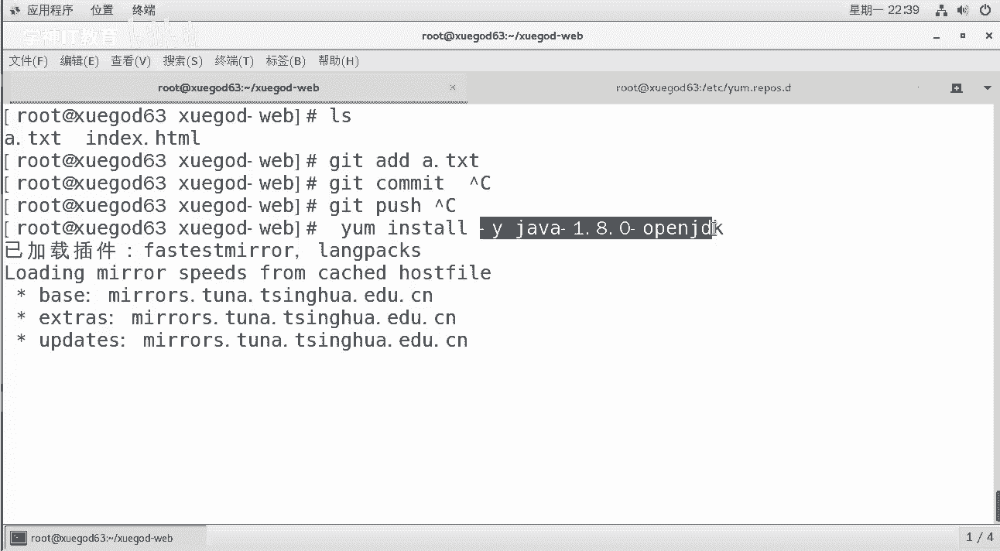
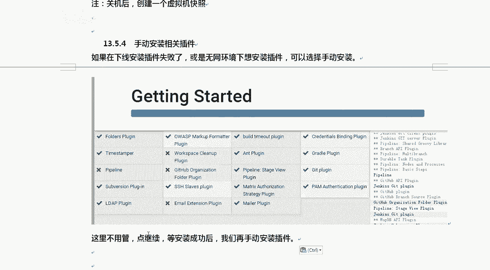

# Linux／Linux运维／RHCE／红帽认证／云计算／Linux资料／Linux教程--扩展-GitLab与Jenkins结合构建持续集成-CI环境 - P5：5-搭建Jenkins实现持续集成 - 学神科技 - BV1254y1C7rJ

好，我们来安装一下这个dkins，好吧，jakins实现可持续集成。安装的之前先安装一下这个java GDK好吧，样么in杠java点open gDKJDK和open GDK是不一样的，好不好？

open是开源的啊。

正常二口人家那个BDK是有自己的版权的。好，我们等等他啊，jakins是拿java写的，所以需要安装JDK好吧，这里使用y安装OK你也可以从or克官方去下载。好不好？对你们公司来说其实都行。

用哪个都可以啊。然后jekins啊他更新的老快了。

这好了，各位。对它更新来还是很快的啊，你可以从jakin点IO点就是新的一些网站，新的一些技术，它的结尾都是点IO结尾的啊。好吧，一些可能点com相关的已经用完了吧，他们都是点IO啊。

什么docker点IOJkins点IO。从这里面可以去选择你中文版的，好吧，选的时候要选这种长期支持版的，不要选这个每周更新版。

这s他有个特点，就是一周更新一次太快了。好吧，从这里面去选选什么呢？选red hard sentence。每周给你更新一个版本。永远都有新版本。

好，这边先安装着啊。我已经提前将包传上来了，传上以后呢，阿平。安装ja就行了。好不好，现在你看啊。

java先把java装上吧。一步步来啊。对，先让他安装着啊。

如果我们想在线下载的话，你可以怎么办呢？你可以把这个下一下jakins有自己kins点reple文件好不好？下载下来以后呢，RPM import导入一下它的私钥，然后你就可以去y的方式安装了。

OK安装完了以后呢，你要记住一点，就jakin它也是80端口。

好吧，新版的getab服务端口有1个8080，为了不和什么jakins冲突，修改默认端口8080。为198或者其他端口都行啊，4个9都可以。好吧，新版本的这个jakins的端个号为8080。看到了吗？

我们的glab已经占用了8080了。😡，是吧，考标站了只能。这个词他已经变了啊。

安装一下。

你看。在我们媒体之前，这个80已经被人用了啊。好吧，已经被人用了。所以我们在启dkins之前，我们需要修改一下它的配置文件。ETCC configurefis。

打开这个配置文件去改29行的时候。OKkins运行的时候用什么用户运行？运输的。否则后期因为各种权限的问题，他会报错啊。使用如ot运行，然后呢，第56行。自然就是改半个号了，默认是这个。

我改成198或者其他的都行啊。这个没限制。好不好？拿完这些东西以后，我们把jaen启动一下，jakin启动就很快。Starts。启动完了以后呢，防火墙清空一下。1林波啊，防火墙关一下啊。

我们去访问198就行了。

19216192165。81。63冒号jakins。稍等等他啊。有同那老师，我看到的是一片白是吧？😡，别慌。

好，Jkins刚起来，你去访问的时候有点慢。please waitJkins is sight ready。好，ready to work。

等等他啊。出来了是吧。他要是从他要怎么样，他要这个是要从国外去下来一包啊。对不对？让他准备准备啊。

好，让他等等，等一会儿它会出现一个什么样界面呢？会出现一个这样的界面。unlock是lock时锁unlock是解锁，你想你需要解锁一下N怎么解锁呢？输入min的密码，它的密码在哪呢？

它的密码初始化密码在这里。好，然后呢，后期你就需要怎么样改一下插件的原地址，这样后期更新前会更方便一些。清楚了，因为默认情况下，它的原地只是要到美国去下载。很多情况下你到美国是下不下来的。

所以呢我通过这个s命令啊，我们将什么呢？将这个jekins。

怎么样update default叫jason jason这种配置文件将里面的什么jekins杠CI点OYG替换成清华。又是清华是吧，对以，这样就会好很多了啊。

好不好？然后呢，你你把这个再重新启动一下就行了。因为稍后我们需要安装这个插件，安装插件的时候通常会比较慢。

好，那我来说一下啊，那大家执行一下，他等的时间比较长，我就带大家大家过一下这个流程。好不好？你要能看到这个初始化这个密码文件，为什么呢？因为看到这个初始化文件以后才会有这个文件，好不好？

否则是没有这个文件的，清楚了吧？拿到它以后，我们需要做的是什么呢？

我把这个步骤给大家说一下，咱就不等它了。你需要s restart启动一下，重新启，重新启完了以后再次去看一下初始化的密码，好不好？再次去怎么样去输一下，再次访问再次去输输完以后你就可以怎么样，对。

点continue点完continue以后会弹到这个界面，就是custom自定义一下kins插插件。

OK那么你你就选什么，选对个就行。

啊，选默认这个就行了啊。选完它以后呢。那他就开始在。呃，该屏各种各样的插件了。那么这个插件的话，它会从网上去下载，好吧，大概是需要20多分钟。那有同学老师我安装了半天失败了怎么办？

啊，失败了也没关系，安装失败了，你就点重试。同事还不行，怎么样？同事还不行，你就点继续。好。看到了吗？如果还是失败，你就点继续。

清楚了吧，那等Jkins整个安装好了以后，我们可以手动下载插件进行安装。清楚了吧？OK你点继续，那么它弹出的是什么窗口呢？弹出的是这个窗口，好吧，addmin密码输一下，创建forst admin。

这是管理员啊，清楚了吧，一定要写好自己的名字，写完以后呢。默认实例的就是这个地方点保存，然后。

就绪就绪完了以后，Jkins就起来了。

你就可以U盘的使用它了。

这个时候怎么办？嗯。关机创建快照。开机的话占的资源太多啊。好不好？好，那么知道这个以后呢，我们再看这。如果你实在不行。

好不好，失败了怎么办呢？很容易啊，我看明天谁报这个错。

那么这个地方我们可以什么自己去搞，怎么自己去搞呢？在这里。

假如你需要什么差件是吧？好吧，你需要什么插件，你可以从这个插件管理上去做这个事儿。他有一个自己的插件可选插件。比如说我需要他CC是吧，或者你从这里面去下来都行啊。

好吧。对，比如说我要下来什么什么差价。你他报哪哪个地方报了那个插件，你就报，比如说他需要一个拍 line的插件，或者需要这个插件，你从这里面搜就行。搜完以后呢。😡。

打开清华，这个是可以下载的，好吧，或者直接打他官方网站都可以下下的过程中，一般他会报错的时候，他会告诉你是吧？呃，有什么样的版本，你就下对应的版本号就行。

假如说呃后期安装的过程中，我们需要什么get lab APII需要1点00几版本，你就从这里面去下就行。它里面有很多版本哈。好，找个下好下好上传就行，传的时候怎么传呢？谈的时候在这个地方，它的设置好吧。

这个怎么做呢？

点系就是这安装好的这个首页，从首页里点系统管理。系统管理里面有个插件管理。好吧，你点那个插件管理，点完插件管理以后点高级。

清楚了吧，点高级点完高级以后呢。

里边有上传插件选他的扩展名是HPI姐面的啊。好吧，他的插件名是HPI。选完这个以后选择嗯。

完成。你点这个提交就行，好吧，点提交了以后，它会自动显示安装更新啊，然后把这个对勾打上，安装完后重启这个词，它自己就重启了。

清楚了吧。OK。好，当然还有一一张。

如果你实在不行，实在不行，是这样的，你可以找一台安装好的。好，比如说他是OK的，63根本就网络1一个都不行。那怎么样呢？你可以把63上的插件拷到64上。怎么办呢？CD进去，然后呢，你在64上是吧。

把64上的插件打个包，所有的插件都是在word下leeven。下的什么p拉这个里面，你给他打个包，打完以后将他打好的包传到64上，然后呢解压到咱们这上面。

好，只要版本号一样就行，然后重新起一样手给。

好，这就是jakins的大脸，回议大家好好做一下啊。

