# Linux／Linux运维／RHCE／红帽认证／云计算／Linux资料／Linux教程--无人安装配置-测试 - P1：无人安装配置01 - 学神科技 - BV1AZ4y1u7PH

好，今天晚上的话是第二阶段的第七节课啊，也就是第七章啊。搭建无人值守安装服务器啊，比如说可以实现批量的去安装服务器是吧？如果你去管理是吧？那个几十上百台机器的话，如果要进行一个批量安装怎么办是吧？

那么今天我们就讲如何实现是吧？批量无人值守安装服务器啊，那么这节课呢我们会讲到啊，怎么样搭建一个无人值守安装，对吧？然后到底用了什么工具是吧？来了解一下，然后搭建这个东西，我们应该怎么样安装和配置它啊。

最后啊我们来实战一下，就是搭建实现无人值守安装批量服务器应该怎么办啊？O。嗯讲到无人值守安装的话啊，我们知道无人值守就说没有人去干预他是吧？没有人去干预它，只要我们配置好之后，它全自动帮我们装好对吧？

装完之后呢，你这台机啥都帮你配好都可以是吧？比如配置好亚源啊，配置好这个网络啊，可以上网啊等等等等这些东西是吧？这叫无人值守。那我们这次使用无人值手啊无人值守安装的话。

我们要使用的是这个P叉E加DHCP还有什么呀通过这个TFTP啊，这个star加这个FTP来实现啊，所以我们要需要装到什么东西。你在这个的话就可以了解到啊。

我们之前不是学过DHP吗今天我们就派上用场了对吧？那么TFTP我们也学过，对吧？OK来。讲一下关于这个P叉E的一个原理和概念啊，什么是P叉E是吧？啊，PXE吧也可以这样读是吧？

严格来说的话并不是一种安装方式，而是一种引导方式啊，进行这个P叉E的安装必要的条件是要安装的计算机，包含一个什么呢？还有这个PXE支持的一个网卡啊，这个这种支持P叉E啊，记住啊。

支持P叉E的这种啊才这种网卡它才能够从从什么从网络去启动来安装啊，就也就是说网卡必须有PXE cleanan的是吧？有这个驱动P叉E啊这种协议。ok。好，那么协议分为客户端和s端啊。

那么P叉E客户这个客户端呢在网卡的这个什么room就是我们的这个光盘中就有啊。当计算机引导时啊，这个bossboss话会将什么将这个P叉E调入到这个什么内存执行啊，由这个P叉E的客户啊。

客户的客户端将放置在远程端的文件通过网络下载到本地执行啊么那么运行这个P叉E协议呢需要设置什么呀DHCP。为什么要D指示遍？如果你没有IP地址，他怎么样从网络去下载，肯定要分配IP地址嘛，对吧？

因为你机器还没有装，什么都没有，是不是？所以肯定要分配给地址啊，还有需要什么TFTP的服务器。当然你也可以提供像HTTP服务器也行啊，或者NSF服务器也可以。只要你能够提供什么呀投提供资料下载的服务器。

都可以。那么DHCP服务器用来给什么给这个P叉E客户端啊，对吧？就是将要安装系统的主机啊，就是客户主机分配一个什么呢？分配一个IP地址，分配完I地址，它就可能上网了，对吧？

它就能够连接到你的什么你的服务端，对吧？由于是给PE的客户端分配IP地址。所以在配置DHCP服务器的时候呢，需要增加相应的什么PE设置啊，所以在我们之前配置这个DHCP的时候呢。

要加一些特殊的设置上去啊，让它实现啊，能够能够什么让你让你这个网卡能够什么能够分配到地址啊。此外，这个P3E客户端的这个room当当中啊，已经存在什么呢？已经存在了TFTP的这个什么客户客户端啊。

O所以呢他就可以通过这个TFTP协议啊，上去下载啊所需要的一些文件啊来实现。OK这个呢是一个重要的啊，就是说你的网卡要支持这个协议，它才能够什么呀，它才能够通过网络方式进行安装，是吧？

OK然后第二步的话，你要了解一下这个什么这个东西才是重点啊，重点它是什么东西呢？它就可以实现无人值守安装方式的一个一个什么呀？可以说是一个软件是吧？

叫sstarsstar啊什么是star呢star是一种无人值守安装的方式啊，那么kingstar的工作原理呢？它是通过记录典型的安装过程中所需人工干预填写的各种参数。

比如啊你要安装什么包开安装开发包安装工具包啊，安装呃配置这个网络啊什么什么东西，你在这里的话都可以将这些人工干预的东西是吧？一先把它配置好，以后呢，它就照着这个应答文件啊，一步步操作。

一步步安装就可以了。OK它会生成一个名为 kiss case是吧？ki点CFG的文件啊。那么在其后安装的过程中呢啊当然不局限于啊生成这case安装文件的机器啊，当出现要求填写参数的情况下。

他就会找什么找这个应答文件啊，哎，我这一步应该怎么填呢，要填什么东西啊，完全在这里是吧？有答案，你去找照着填就行了啊，安装程序呢，就会首先去查找啊，你这个文件是吧，找到合适参数填进去是吧？然后呢。

就不用人工干预了是吧？比如你选择个键盘语言是什么语言是吧？选择要不要要不要开启防火墙啊，那么要不要关闭S，那么所有的这些答案在这个什么呀，在这个文件上都有答案，你找就行了，你找到之后呢。

按照它的要求是吧，要执行就完事了，就是这么回事啊。嗯，TFTP不是传输小文件哎，对TFTP可以传输小文件。但是我们可以通过VSTV啊，就是VSTFT这个VSFTP嘛，对吧？

也可以它也可以传送一些大文件的，对吧？等一下，所以说我们要装两个嘛。O。那么这样的话呃，这个star的话，它就涵盖了安装过程中所有要填写，或者是要你进行啊配置的一些参数啊。

那么安装的完全可以只告诉安装程序从何从何处是吧，你要从哪里去下载这个什么下载这个这个KS点CFG文件，然后去是吧，去去忙自己事情。就说啊你照着这个执行就行了。我给你一份清单，你按着照着做就行了。

其实这个kiFG呢，它就相当于一个应答文件啊，什么叫应答文件上面都有答案的是吧？你照着做啊，等安装完毕之后呢，安装程序会根据什么也是根据这个应答文件里面啊，设置到底要不要重启你的电脑呢。

到不要到底要不要给你配置一个样源啊等等这些东西啊，在上面都可以去配啊O。那么无烟值守安装的话，我们需要我们今天的话就这样子啊。嗯，你最好是准备啊三台啊，三台这个虚拟机啊，虽然我这里的话是准备两台啊。

准备两台，你看没有？我这里是准备两台，但我建议你准备三台啊。呃，来，因为我首先我们要教你怎么样去测试，对吧？以后如果你真的你学会了，那你肯定不用准备那台是吧？你只要准备来服务端配好之后是吧？

那么其他的就是没安装的机器啊，你让它启动，它就会自动安装的了啊。OK来，那我这边的话服务端是学挂63是吧？我首先要配一个他的网卡模式啊，你看这里配成L一是吧？就什么意思呢？

就是说你的服务端跟你客户端肯定要要同在一个什么同在一个网段是吧？同在所以我这里呢用L一这个区域啊L一这个网络区域来来让它是吧？让你的服务端跟你的客户端都同在一个什么一个网段啊，同在一个一个网络上是吧？

然后服务端呢在另外配置多一张网卡啊，变成变成什么变成桥间模式，那么这个有什么作用呢？这个就是为了我们通过插效能够连接上你的服务端是吧？因为比如你这个用了一个什么呀，嗯。

像这个你配置了是一个特殊的一个网段，那么你的你的PC电脑连不上啊，所以呢我再建多一张网卡是吧？为了用插效能够连接上去而已是吧？其实理论来说，我们这个不用再配它的可以，你可以在什么呀？在你的数主机。

就是在你的虚拟机上操作也可以是吧？对不对？都可以的啊。那么这里的话不能使用NATT或者主机模式啊，同学们不能使用NATT或主机模式。因为这两种哎其实也。并不是说完全不可以，你先听听我说是吧。

因为这两种模式啊，这两种哎。这两种模式当中都会自动分配IP地址，所以我们使用len模式模拟出来一个纯粹的一个局网。OK那如果你使用主机模式也不说不可以啊，你要保证什么呢？主机模式的话。

你不要给它分配出来1个IP地址就可以了，是吧？对不对？ok。呃，来你看一下啊，看这个图啊，那么首先中间这台呢就是服务端啊，也就是说在这上面呢，我们部署什么呢？啊，比如包括你一个呃安装光盘。

就是安装镜像是吧？要挂载上去。还有呢我们要安装FTPTFTP还有DHCP是吧？最后呢我们还要安装上这个，然后配置好这个应答文件就叫什么case点CFG的文件是吧？配置好它之后呢，我们就可以干什么呀？

我们就可以让啊这样什么呢？让你的这个客户端是吧？客户端，然后启动，假如你这台客户端是一台新机啊，没有安装验头的系统的情况下是吧？你一启动呢，它默认一般是从网络启动。为什么呢？因为第一启动可能就是硬盘。

但是硬盘没有系统啊，它就跳过去，跳过去下面的顺序是吧？就是boss里面设置启动顺序，下面的顺序呢肯定有一个就是网络启动是吧？当然你也可以设置一下这个boss启动的顺序，将网络调到前面去是吧？也可以。

不过一般出厂的这个主板的，boss里面都设定好了是吧？第一启动一般是什么呀？第一其中一般都是呃这个。硬盘是吧，然后下面是什么CD了啊啊什么呃远盘哪啊然后到网络启动啊等等等等，是吧？它有一层层检测嘛。

OK好，这里的话这物理机啊，物理机你要连接上你的服务器进行操作的话，所以它这里为什么增加多一块网卡变成桥接呢，就是这个意思是吧？其实这这一层的话真正的是在生态环境下，我们完全是可以不要它的，对吧？😊。

如果你在机房里面操作，那你还要这个干嘛是吧？直接在这个数主机箱上操作就可以了啊OK。😊，那来那么。我们来看一下啊配置基本的环境啊。呃，首先的话他说在你的服务端这边啊关机，然后添加上一下一张网卡，对吧？

啊，然后这个就是为了我们插效能够连接啊，方便操作而已啊，是吧？你看为了用于后期插效连接你的服务端进行配置而已啊，OK行，那我们先将啊这个服务端它呃加一张网卡，然后还有客户端啊。

把它设置同同一个这个什么呀同一个网络区域。O。那打开一下啊。

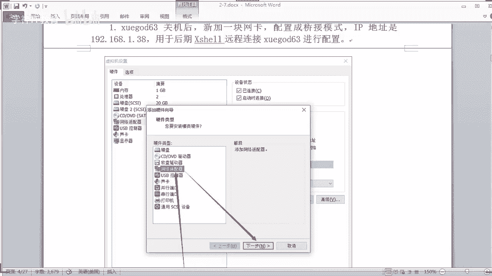

那哎我这个已经开了是吧哦，你看一下我这台机啊，打开里面的这个vivo word是吧？然后点一下，你比如我这个学盖63是服务端是吧？我去你看我这个是512兆的内存是吧？512内存啊，没问题吧，老铁。

你看我都照样运行的，非常流畅啊，这个是37。4的系统。😊。

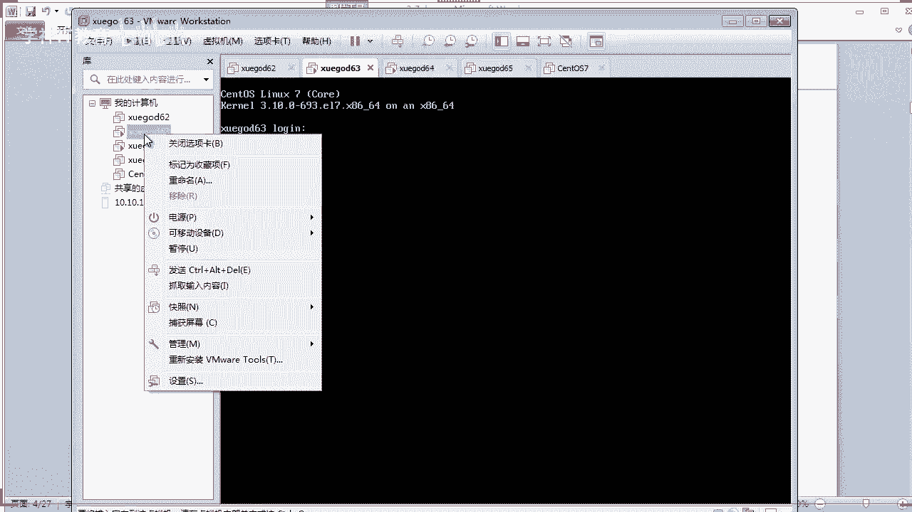

对不对？O。没有问题啊。啊，这个是调接了，既然他有一张网卡是调接模式，我们再增加一张网卡吧，好不好？

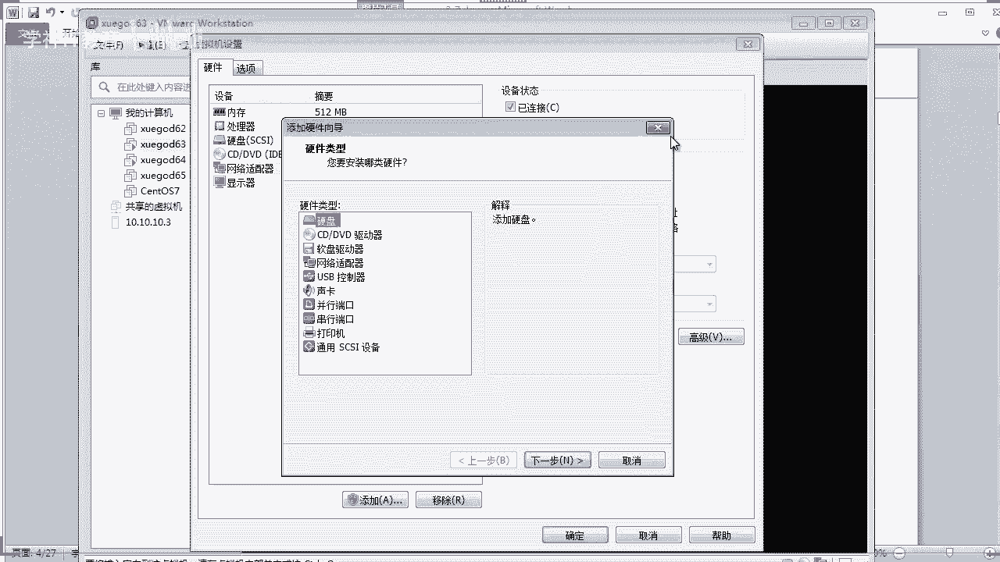

啊，我还是先把它呃那个关闭吧。对吧。O。啊，这个64也关掉。哎，64其实关关无所谓是吧？关了吧。这样的话是比较安全一点啊。OK好，那么63的话，这边这台是做服务端的啊。那首先的话来编辑一下啊。😊。

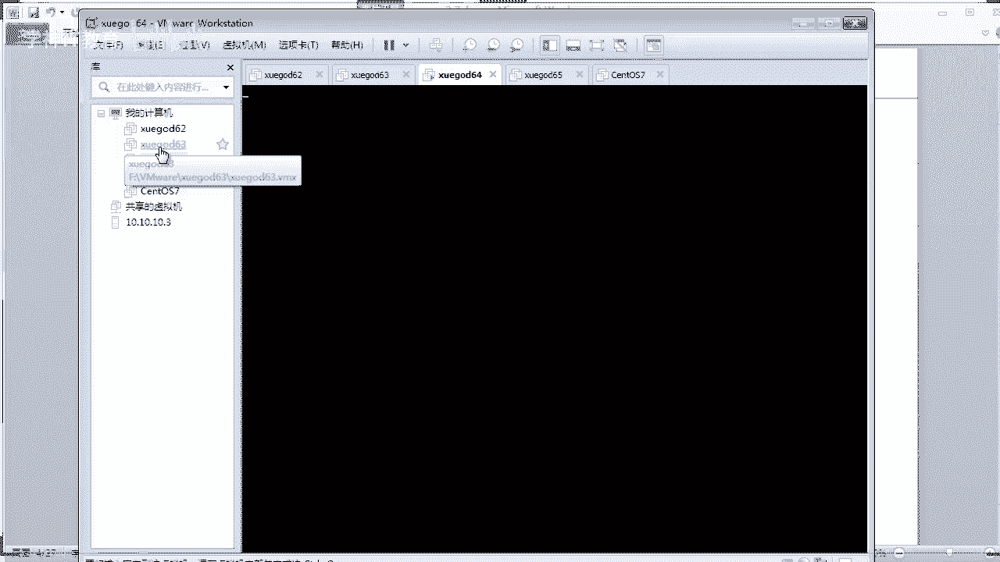

那编辑一下啊呃我再增加一张网卡啊，添加对吧？然后网络适配器啊，然后下一步。然后呢，我这里呢。我就不能用我我不要用这种特定的虚拟网络啊，等一下我创建一个一个区域吧，好不好，创建一个区域。

然后在这里啊这个网段这里创建一个区域啊，好不好？嗯，我这里先随便选一个啊，然后完成对吧？选中它，然后呢，我选这个len区段，你看到没有？然后选择这个。land区段，如果没有land区段的话。

你点这个lan区段，它就会创建，比如添加一个就可以了。同学们，你可以添加一个lan区段啊，添加完之后呢，在这里就会有什么区段一啊，区段啊，对吧？我就选这个是我已经创建好的le区段一对吧？我选中它哎。

你先先选中这个网卡，然后再选这个lan区段啊，选中它，然后呢点确定那OK那么这个网卡呢就变成le区段是吧？就属于这个这个区段的一个什么呀。啊，这个网段OK它同在这个这个网络上就可以了。OK好。

那么这个时候呢我们就可以启动它。

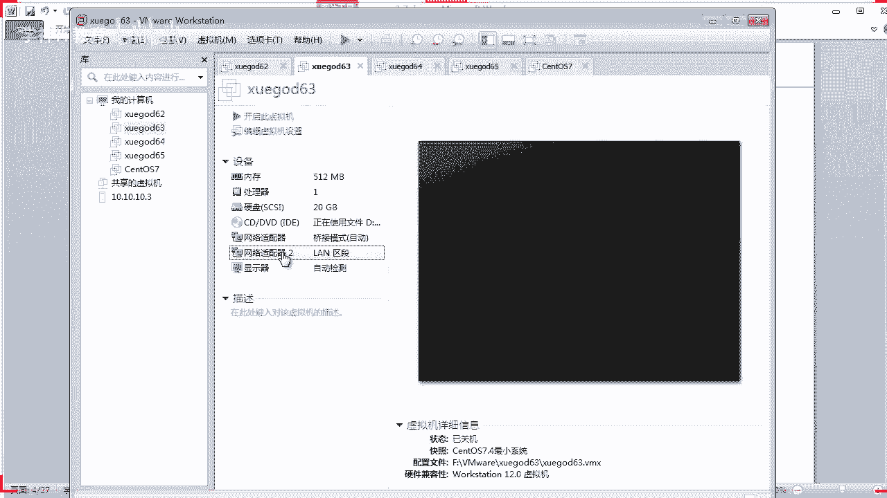

自定义虚拟网络也可以可以呀。你自定我的刚才说了，这个并并不是一定要强制，但是这个自定义虚拟网络，你要保证呢不要让它能够有其他的一些啊DHCP干预。比如你家里不是有路由器吗？是吧。

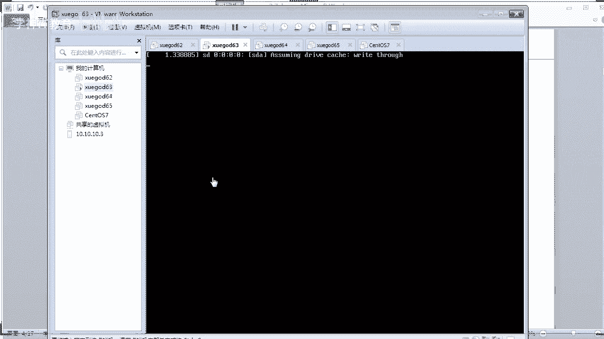

不要让他能够分配一些地址啊，然后六4啊六4的话，你看六4的话，我就干脆我就不管它了啊。六4我只有一张网卡，我直接将它调成land去段就可以了。可以吗？没问题吧。如果你想6视也用插销连接上去的话。

那你还得再增加增加一张网卡。算了，我不增加了，好吧，就直接将它调成L集端就可以了。o k。😊。

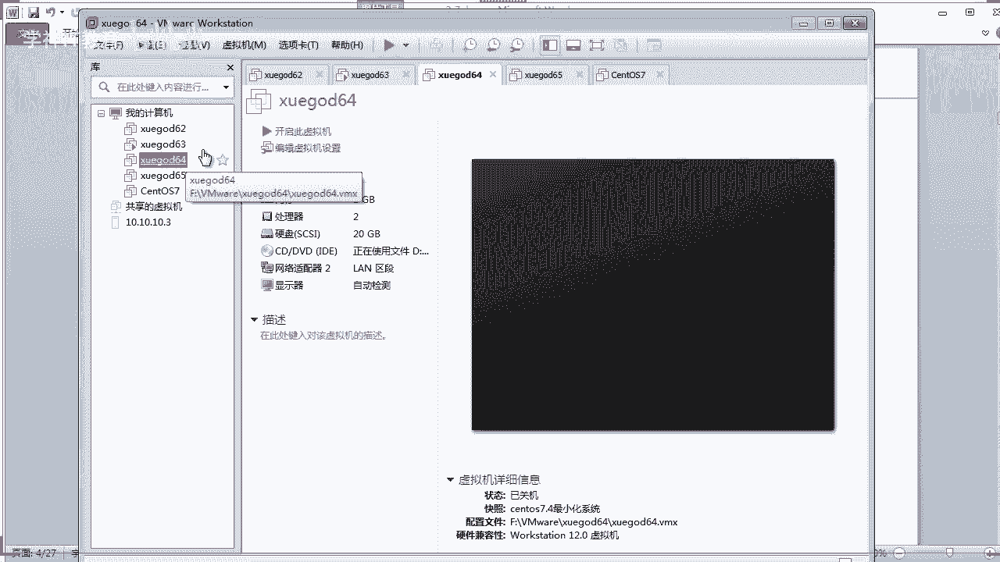

啊，那我们先先搞这个。呃，63吧，对不对？

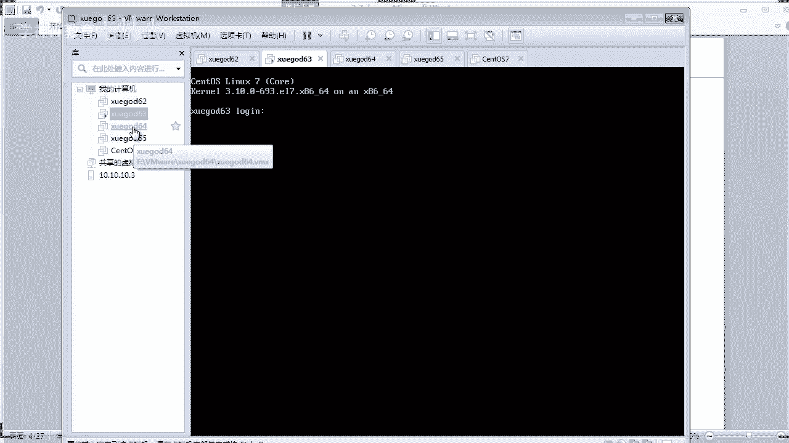

好，63已经启动是吧？啊，6四的话哦，我六四是两G是吧，是吧，启动它也行，没事啊。好，那这个过程是吧，很简单是吧？咱们把这个网卡添加上去之后啊，来我打开我的插笑啊，打开我的插笑。😊。

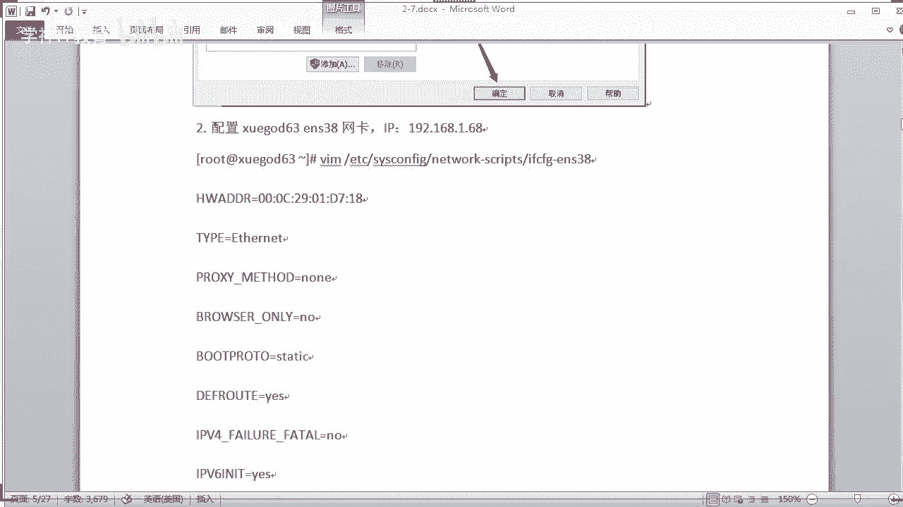

嗯，系呀。

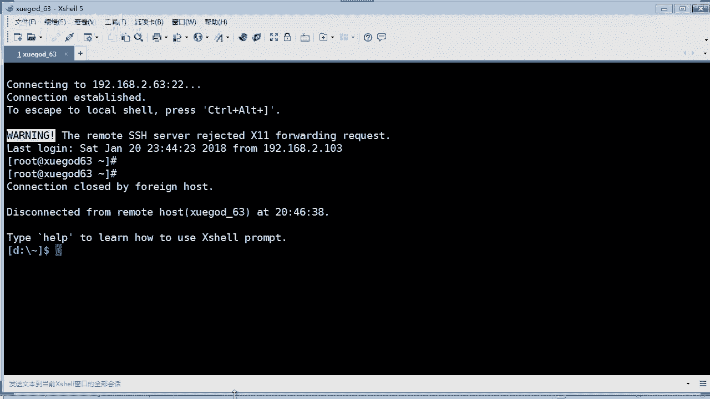

好嘞啊，然后连接一下啊。😊，好，连接成功了，你看这里是一台啊最小化安装的这个系统是吧？那么现在我们要做什么东西呢啊？先看一下啊。你看。😡，这里是不是多了一张网卡叫34，这个网卡名称？

它是不是没有IP地址。对的，你看不到IP地址是吧？有ES32呢，就是当前我们连接上的IP地址对吧？这是网卡一叫192。162。63，对吧？我们是通过这个地址来用插效连接上的，对吧？

然后这个网卡我们专门是用配置我们的DHCV是吧？啊，用做无缘之手，它等一下就要啊是吧？需要需要这种网卡了，对吧？这个是在7段是吧？7段的一张网卡，注意啊，是吧？这两张网卡是在不同的这个网段网络上的啊。

ok。那么你要给他配一个地址啊，不然等一下你装DHCP的话都启动不了，对不对？😡，那怎么办？你要配一个地址，我们应该怎么配？还记得我们之前讲过，其实配地址很简单是吧，你直接编辑是吧。

你可以copy多一个这个s32的这个网卡地址，然后呢再修改一下是吧？IP地址，然后去掉那个什么MSD啊，UUID啊等等那些东西。对不对？那还有没有其他方法呢？同学们。嗯。

是不是还可以通过这个什么NMTUI这个。

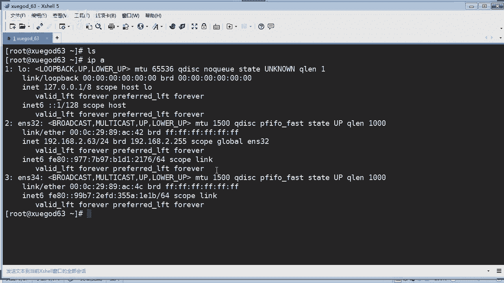

这个还记得吗？你们在第一阶段的时候有学过是吧？比如我现在我来编辑一下是吧，这个是我添加的新网卡啊，这个还没有重命名啊，来，我们重命名一下，将它改成ENS。34，你看人家这里是34啊，你就写34就可以了。

对吧？然后的话如果你要在这里配地址也可以是吧？但我觉得在这里配地址好不习惯了，对吧？来，我还是改成改了名称之后呢，确定退出啊，对吧？嗯，然后最后的话退出它，对吧？

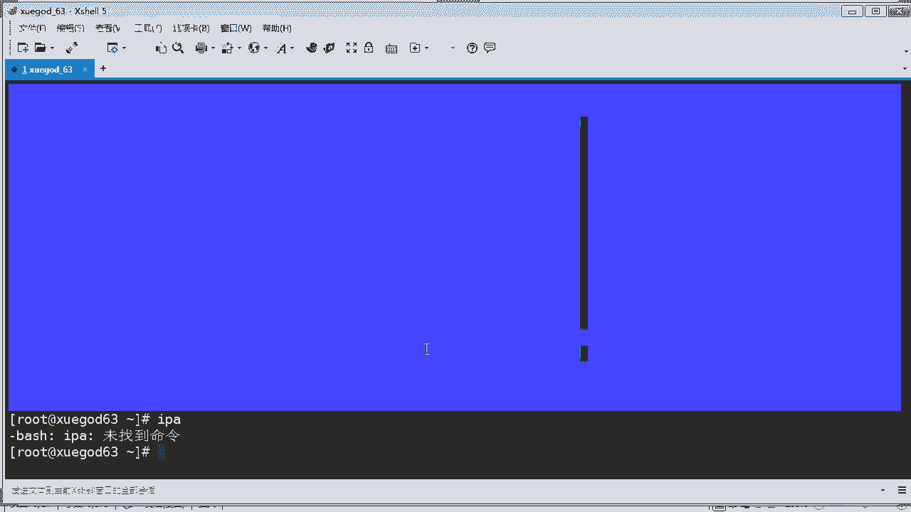

OK那这个时候呢我们来编辑一下啊啊，直接在你的这个网卡，它已经帮我们生成一个网卡配置了。是不是呢？你看一下啊，那个 word是吧，然后是F，你看是不是多了一个网卡了？网卡配置文件啦，对吧？

多了一个网卡配置文件之后呢，我们直接对它编辑就行了。这个时候呢我们就不需要改它什么呀，不需要改他什么MI这个物理MACC地址啊，物理地址，还有它的什么呀，还有他的这个UUID这些东西，我们都不用改了。

对吧？它会自动帮我们生成，就是正确的，对不对？我们现在只要改什么东西呢？嗯，增加IP地址，对吧？怎么样人家IP地址。😡，啊。我们直接在下面这里写IPAADDR对吧？那等于什么呢？啊。

那比如我就设一个网站叫192。168。1。63是吧？比如刚才我的我的物理机上是2。63是吧？不我我就我另外一个网卡是2。63，我这个就搞成1。63啊，用1。63来做实验，对吧？可不可以？O。

是吧然后的话还需要什么呀？啊。还要配置什么？同学。我配置了这个IP地址之后，我需不需要配置网关啊等等那些东西。我问你。要不要？好，那有助教同学说你要将这个什么呀。

将这个put boot pro two是吧，这个改一下，改成静态。哎，这个嗯不错，那说明你你这个还是有点经验了，是吧？对的啊。我等一下就想提问啊，我还有哪些东西要改的？对，就是这个东西哈。

你要还要改是吧？我现在问你的是我要不要要不要添加什么网关啊，什么什么东西。要吧。对不对？好吧，来。那我们把网关网关的话，你可以net。musask对吧？😡，对不对？net mask等于什么什么时候对。

你可以这样写啊，255。255。25。0，对吧？OK那网关的话，GATE对吧？然后WA。Wai。对不对192。168。1。1是吧？ok。嗯，还有什么呀？啊，这个刚才讲了是吧？嗯。

朱晓同学提醒了这个你要改成什么呀？静泰的STATIC是吧，改成静泰的一个地址哈，是吧？还要检查一下你的网卡名称对不对。对不对呀？还有呢你要启用它on on boot是吧，启用这张网卡等于yes，对吧？

OK这样就可以了是吧？然后呢，我们保存并退出啊，然后重启一下你的网络。OK然后我们来看一下IP地址啊。😊，你看没有？这个时候呢，它的IP地址就出来是吧？成功了啊，OK。呃，接着啊我们就可以装什么呀？

装DHCP是吧？来，你看一下啊。😡。

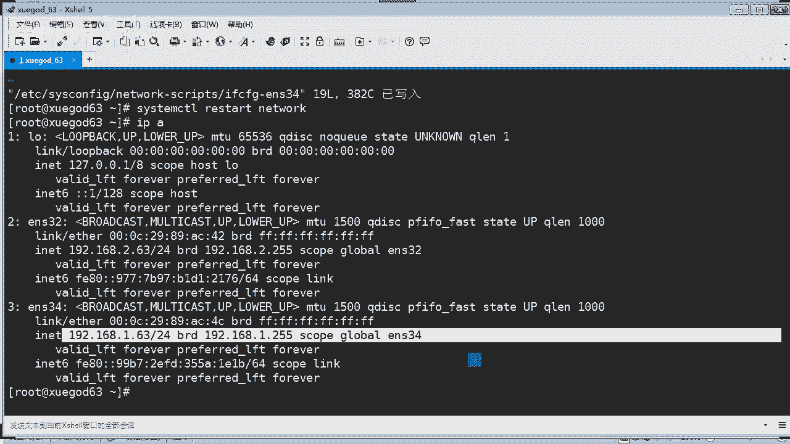

呃，我们把这个啊配好了之后啊，你看这里就有吗，对吧？静泰地址啊嗯。on boardyes啊这个啊DNS啊DN我们可以不配，它都可以，是吧？你也可以配它啊，或者不配它都，没问题啊。呃，重启网络对吧？嗯。

OK啊，关闭防火墙S links，这些本来我们就关了，对吧？如果没关了，那你记得关一下啊，然后设置每台服务器的boss引导顺序为先硬盘在网络。先硬盘在网络有好处啊。

同学们它本身一般的话出厂默认都是先硬盘或网络。那假如你买了一台新的服务器回来，里面是不是没有安装过键材操作系统，对吧？那么它先硬盘启动，在网络，然检测硬盘哎没有系统，它就跳过去啊，再到这个网络启动，哎。

发现网络可以启动，它从网络启动，对吧？网络启动之后呢，安装完了系统，哎，然要再重启重启的时候呢，它又先硬盘在网络。哎，这个时候发现硬盘有系统了，它就会从硬盘启动，还不会再从网络再重新安装系统，你说对吗？

一般是这种顺序，对吧？对的啊，OK来，你看一下这个实验的top图啊，那你看。嗯。是怎么样的是吧？那。这个呢是一个客户端啊，这个是一个客户端，这上这里这个三台的话都是同一台机啊，虽然他画画了三台是吧？

其实你可以用三台来来来实现那个时间也可以是，但是我们没有必要啊，我们把这个系统记一下，还有什么呀，还有这个star，对吧？还有一些呃配置文件呢都放在一台机上就可以了。他会他这里为了讲清楚啊。

它的来龙去脉才用了三台机这样子是吧？比如这个新机啊，这一台是你买回来的新的机是吧？你让它自动化安装系统啊，你把它接上这条网线对吧？同一个网络之后是吧？一旦启动它之后呢，哎它就会进行什么呀？

它就会先硬盘网络，哎，发现硬盘里面没系统，它就网络网络呢它会检测到对吧？哎，有网络。哎，它就会从这个DSCP里面去是吧？给你什么？给你分配1个IP地址，看到没有？😊，分配完之后呢，哎他就会什么呀？

他这里会写入一些呃呃P叉E的启动是吧？然后呢就会请求下载启动文件啊，从你的这个啊FTP里面下载下载完之后呢，就会响应请求啊，就要传输是吧，传输你这些什么，包括你的应答文件啊啊，那个什么什么文件一起是吧？

还有你的系统镜像，把它全部传完之后，当然你可以分开是吧？传完之后呢，他会执行什么执行安装操作系统啊，然后最后呢，安装完之后呢，再次进行重启或者就可以了，对吧？就这么一回事啊。😊，来，让我们来实现一下啊。

首先我们安装1个DHCP啊，然后再装FTP啊，最后装这个kingstar啊来实现。😊，要带一定要带有PCE支持的啊，是吧？肯定的，我们现在这种vi word本身也是支持的对吧？O。嗯。

他说哎他这里是先把这个什么FTP先装上了是吧？没关系，这个安装顺序都可以啊。那可以，那我们就先把这个呃FTP给装一下吧。

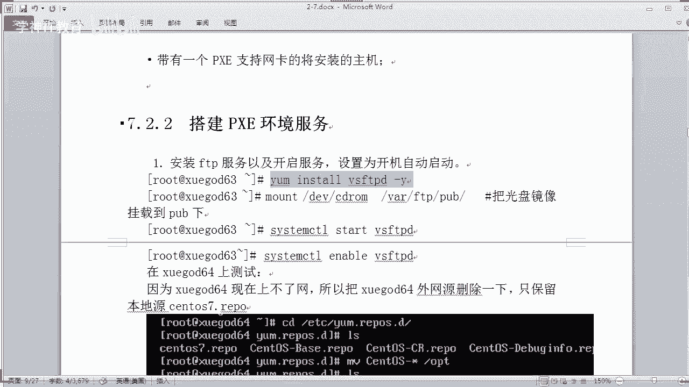

没问题啊。来，我们执行一下啊。O。好，那稍等一下。好，那这个VSFTVD的话已经安装成功了，对吧？安装成功来，我们做一个配置。那首先看一下我这台机的挂载情况啊，我这台机的挂载情况主要你观察是这个。

这个光盘的话目前是挂载在什么呀？MNT下是吧？然后我配置的有个本地养务员啊，对吧？他也是就是从这个MNT嘛，对吧？挂载到这里了。那有同学说呃，你们用的是哪个系统啊，是7。4呢，还是7。5还是7。6？啊。

你们用的是哪个？我用的是深圳OS啊，这个7。4的系统。7。5是吧啊啊，有没有愿意用7。6的啊？有吧。有用7。6啊啊，我前几天就在安装7。6的系统了哈，7。6的啊，3到是7。6。😊，啊，都可以啊。

没有问题啊。那OK好，我们这个挂载情况是这个样子啊，然后我这样子啊，我再挂载一个。😊，诶。我了个去，什么东西。啊，这个DV下面的什么呀啊，CDlo。这个里面看你知道是什么地方吗？下的FTP是吧。

有PUB我把这个挂到这里。这个可以吗？然后你看你在这里能看到他的一个挂载情况吗？好像是看不到了，对吧？但是实际上他是不是已经挂载成功了呢？FTP啊，然后PUB你看这个是不是光环镜像啊，对吧？

很明显就是光环镜像，是不是？就是这个相当是7。4的一个光盘啊，对吧？这个镜像已经挂上去了啊啊，OK挂上去之后呢，我们呃我们的这个服还没启动啊，我们把它启动一下VSFTPD啊OK但实际生产环境当中。

你要把它调为开机启动。对吧。O。然后的话我们可以测试一下啊，比如啊我再骑一台机。64。哦，64啊64不行，64的话，因为我是L7段是没办法了，对吧？那这样子吧，我只能在这上面去试了LFTP。哦。

这个要装。啊。install一下你的LFTP啊，把它装一下。测试一下啊，看正不正常啊。来我们看一下啊，LFTP。192。168点，我没有1。63吧，好不好？因为我们等一下就是通过哎，你看它能够连接是吧。

虽然是本机测试啊，都一样的啊，PUB啊OK。是吧可以看到这个光环镜像的内容了啊。OK说明我们这个FTP是成功，没有问题，能够正常访问它的数据。好嘞。嗯。然后我们退出啊退出啊嗯。

然后呢我们再来安装1个TFTP啊。对吧。TFTP有同学说哎，你为什么要装个TFTP呢？我这个主要是来传一些啊比较小的文件啊，没错。OK这个东西啊它需要有用到一个这样的一个这个是吧？这个框架来支持。

所以要把这个装上去啊，你看客户端啊，服务端对吧？还有它支持的这个东西啊，我们也一起把它装上去了，对吧？装完了之后的话，我们就可以呃把它。嗯，他默认的默认的这个共享路径是在哪里呢？

在Y下的label下面的TFTB这个。同学们。这是他默认的一个路径，你看这里是空的啊。然后我的笔记里面呢是重新创建一个这个目录，就说我不需要他出厂默认提供了一个共享目录，而是自己创建一个目录。明白吗？

啊，这个也没毛病是吧？那我们也可以创建一个。当然你使用它啊默认出厂的路径来做也是可以的啊，没有毛病啊。OKMKDR啊，你可以创建一个叫TFTP什么样boot是吧，自己再创建一个这样的一个路径。OK。

好嘞。😊，嗯，然后呢我们来编辑一下，既然你改了路径的话，你要改配置文件啊。这个点D下面啊。有1个TFTP的文件啊，你打开。修改一下，因为你这个路径改了啊，那你看没有，它的出厂路径是在这里配的啊，对不对？

所以呢你要这里给要配一下啊。这个名称改这个改成什么呀？嗯。就改成你刚才创建的那个目录啊，TFT。P boot对吧，这样的路径，然后要开启服务啊，这个关闭E的话就表示关闭嘛。如果把它调成no的话。

就是什么呀？开启，然后保存并退出。OK那就可以了。嗯，从启。重启它啊，那么这个东西的话，我们也调整一下吧啊。然后启动它。好企啊。来，我们看一下啊，它的这个是不是启动呢。哎，没有这个命令了，装一下。好。

然后我们看一下到底是不是已经启动成功了呢？是吧是不是启动成功了？那么这个他是工作在端口是69对吧？这个TFTP啊，他工作在69同学们是吧？哎，你看到他的有有进程了是吧？有PID说明是没有问题。

当然你也可以通过nest的方式来查看69，但是那样的话，你只能看到呃，他的这个上面这个框架的服务名称，对吧？嗯，没有问题。这位同学虚拟机无法进入什么ent特模式，原因是客户机不支持ent特什么意思啊？

为什么不支持安特模式，你调了什么东西吗？死机啦。怎么回事？卡死了吗？好嘞，那么这样的啊，我们把这个TFTP的话配置完成是吧？然后我们要把它用起来了。啊，是吧把它用起来啊，用起来之后，你这个时候呢。

你可以。要用什么呢？就是放一些像这个kingsstar的一些配置文件，对吧？但是kingsstar我都还没装，对不对？所以呢我要首先装一下这个kingstar啊，那还有一个东西啊。

注意我们这个linux的内核启动文件，嗯，你也要装上去，这个包含什么slin，这个东西很重要啊，你一定要装啊，你一定要装它带一些什么内核启动文件。是吧非常重要啊，这个呢就是什么？canstar。

你把这个sstem confi canstar这个装上去。还有呢这个s装上去。ok。哦，144个包啊，那还是挺多的对吧？你看他需要的依赖是非常庞大的一个依赖群。你看是吧？超多的啊。嗯。

所以如果你的这个你看我这里是通过一个什么网络源，对吧？去下载和安装。啊，这个依赖挺多的啊。之所以我们配两张网卡也有一个好处是吧？嗯，因为你这样第一张网卡的话，至少你可以上网的是吧。

而且又可以通过插效的方式来连接。149个包啊。稍等一下。呃，能够跟上节奏吗？同学们。好，那马上就装完了啊。OK那装完了之后的话来。配环境啊。配环境要这么长时间吗？啊，我都跟你们说啊。

一定要准备好多台的这个虚拟机啊，以便后用啊。来啊，你把这个装完之后来，我们接下来要干活了啊。现在我们要考一些启动文件啊等等一些东西啊，对吧？拷到我们的这个TFTP里面去啊，来，同学们啊。

你看啊嗯首先呢我刚才是不是创建了一个叫TFTP的这个目录，这里面是没有东西的，是吧？啊，它需要创建个在这个目录下再创建一个目录，什么目录呢？你看啊TFTP下面再创一个P叉E啊，P叉E要linux。😊。

啊要点CFG注意啊，这个不是文件，这个是一个目录。我再说一遍，我创建的这个是一个目录。ok。好，那这个时候呢，我们应该去把什么？把我们相关的一些启动文件是吧？把它拷过去，启动文件在哪里呢？

你应该在这里可以找到。因为我们刚才把这个S呃叫sslin装完之后呢，它就可以找得到了啊。把这个sslin，你看吧？这下面P叉E什么linux，你看。😊，这有一个这样的文件，哎，这个东西就重要了，是吧？

我们经常说这个PXEPKSE它到底什么东西呢？你看就这个是吧？还有了这个东西，它可以通过网络去驱动是吧？启动啊来引导啊，它就是一个网络引导了，对吧？那这个东西呢要放到哪里呢？

放到这个TFTP就是TFTP的这个这个目录下。OK这是第一个啊同学们，这是第一个好啊，有了这个东西啊，非常重要啊。然后我们再去考什么呢？从我们的光盘镜像里面考一些是吧？也是一些啊启动文件过来。

什么东西呢？来光盘镜像那MNT下面对吧？MT有个image image下面的话有一个P叉E对吧？P叉一bo，你看也有这个目录，然后呢有一个VM link什么linu是吧？lin。😊，这个看到没有？

把这个东西的话放到哪里呢？也是放到这个TFTP这个目录下。好，把它靠过来。啊，还有东西啊啊还有东西也是在这个光盘镜像下面啊，这里有一个叫INIT什么什么。

你看这个呢就相当于什么启动的一个什么一个镜像一样，是吧？启动了一个小小的一个镜像文件一样。你看IIT嘛，对吧？这个东西也是要拷到这个目录下来OK。好了，嗯，最后我们再来拷贝啊什么东西呢？😊。

还有还有东西啊来。啊，只从桥板啊MNT啊，这个是另外一个目录叫SOlin，对吧？F1后SOlin下面的CFG对吧？这个文件呢我们要拷贝到TFTP下面的什么呀P叉E点CFG这个目录下。

然后把它重命名为deford。啊，注意我把这个文件啊是从我们的光盘镜像拷过来，拷过来放到这个目录下，并且重命名为deefour。看清楚啊，同学们。从未没有跌风啊。好。然后呢，你记住啊。

给他一个可执行的权限啊啊，644啊，给他一个权限啊啊，是哪个呢？就上面这个文件你直接可以通过敲过这个是吧，就可以对他授权了啊。很方便啊。好，那我们来看一下啊呃。

这边的话也装了TFTP我也用这个TFTP的命令啊来测试一下。1。63啊，你看他能不能是吧？哎，这里面我们可以用L吗？不能对吧？那。那你怎么办？也就是说你怎么测试这个。

这个东西到底我怎么能不能够看得到的文件是吧？你看啊我现在目前是在什么呀？目前是在跟目录啊，就是这个root目录下面是吧？这里面是没有任何文件。那我又通过这个TFTP啊去下载一个文件，如果他有。

那就正常了嘛，对吧？我通过这个ge命令下载了一个文件，你这个下面有什么东西啊。是不是有这个文件，也有这个文件也有这个文件，对吧？那我随便找一个下载，我就下载这个给你看啊，叫VMlinux。对吧。

我下载这个文件，看能不能下载下来啊，你现在也要退出才能看到，对吧？QUIT啊退出，然后你看一下是不是多了一个文件，说明他从你的这个TFTP下载下来是吧？正常。你要测试一下这个TFTP正不正常，对吧？😊。

OK好，这个的话我们可以把它干掉啊，不要它嗯。好嘞啊，那然后的话嗯我们就来看一下啊，要安装什么呢？啊，DHCP啊DHCP啊。嗯。DHCP。DHCP。ok。😊，啊，DSP很快就已经装完了，对吧？好。

我们已经学过DHCP了怎么配置，还记得吗？😊，是吧我们现在就来快速的配置一下，在我们的这个ETC下面的DHCP有一个什么DHCP。点D有个c文件，打开它这里是空了，啥都没有是吧？骂斗盟啊。

好吗那你要干啥呀？那你就要配一些东西进去了，是吧？我们完全可以把这些东西干掉。对吧完全删除的啊，留空空如原啊，然后我们自己去配一个什么呢？配一个啊，注意了。

这个其实我们就留一个subnet这样的一个配置就可以了。那就是这样。是吧。就是一个配一个什么一个玉是吧，一个一个这样的一个一个文件。ok。那由这个很简单是吧？首先定义你的网段对吧？然后呢。

你的子网源码要定义你的地址池啊，从100到200啊可以分配出去是吧？啊，然后定义什么呀，你的这个什么呀？这是什么呀？DNSs是吧啊，其实这些东西你可以不配，都不存在什么问题是吧？然后呢，还有网关，对吧？

还有你的DNS服务器啊，然后广播地址啊，然后这个什么呀？还记得吗？时间是吧，租约时间还有最大什么租约时间是吧？那最重要的是后面这两行啊，同学们这个。对吧。这个叫nest server，这个啥意思呢？

这个IP地址呢它就非常的重要了啊。同学们这个是非常重要。这个呢就是我们TFTP的服务地址，也就是本机地址。这个地址你必须填什么跟你的客户端的网段一致的IP比如我这台机是1。63，就第二张网卡。

在这个len网段呢，对吧？然后呢，你要进行下载这个引导文件，这个是通过网络引导的对吧？P叉Elinux。0啊，这个文件要在这里指定它。明白没有？这个就是引导文件。他一旦通过DHC分配之后呢。

他就会干什么呀？他就从这里下一个这样的文件进行引导。是吧所以我们写在这里。OK这样就可以了，然后我们就可以。😊，保存并退出，然后啊重启不是直接启动就行了，是吧？DHCPD。是吧。就可以了。ok。

然后来了呗，那呃我们就可以干什么呢？我们建来的话，是不是可以看一下能不能分配地址。64嗯，我看一下六4能不能正常分配地址。64我们就是用来测试的对吧？

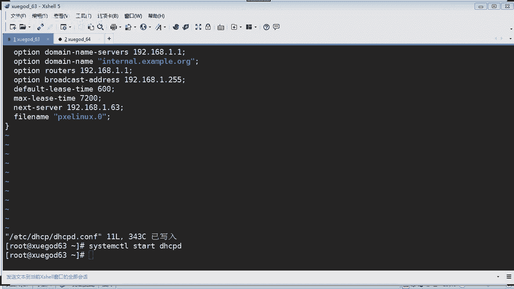

64我打开它。64。123456。OK你看一下啊IP。哎，他没有IP地址，看到没有？只有一张网卡，这张网卡的名称叫ENS34，对吧？我们看到它没有任何的IP地址，那到底有没有像什么配置文件啊什么等等的。

对吧？来，我们看一下。啊，就是只有这张网卡，对吧？哎，没有VI我去。没有VIM对吧？连这个都没有装啊。😊，说明这个系统非常干净啊，你打开看一下啊，这个网卡呢，它配置的是什么呀？睁大眼睛看最导数第二行啊。

主要是这样，它配置的是DHCP就是动态分配地址是吧？动态获取地址啊，那这样就足够了，对吧？既然是动态分取IP地址，那么它应该能够获取地址，为什么现在还没有获取呢？因为你没重启它是吧？它一直开着的。

是不是好，我们退出一下OK然后呢，你看啊刚才我们看他是没有IP地址啊，现在也是没有。然后我们重启一下，看他能不能够自动获取一个地址呢。😊，好，重启成功啊，我们来看一下啊，恭喜你，你看地址出来了吧。😊。

肯定是100是吧？因为我们的地址值是从啊1。100到1。200分配。那么分配第一个地址就是1。100OK。成功是吧，192。168的1。100。从刚才的无地址到现在有IP地址。那么分配完地址之后呢。

他应该就能拼通你的服务端。你说对不对？来，我们输一下啊，192。168。1。63，能不能拼通，可以拼通啊，肯定可以拼通了。因为地址都分配过来了，是吧？没有问题啊。是吧，那么这样呢。

我们已经测试我们这个DHCP啊分配地址出去是没有问题的对吧？没问题啊，老铁。好，没有问题之后呢啊那接下来来我们就回到我们的这个学盖63服务端这边啊，要做一些相应的配置了。

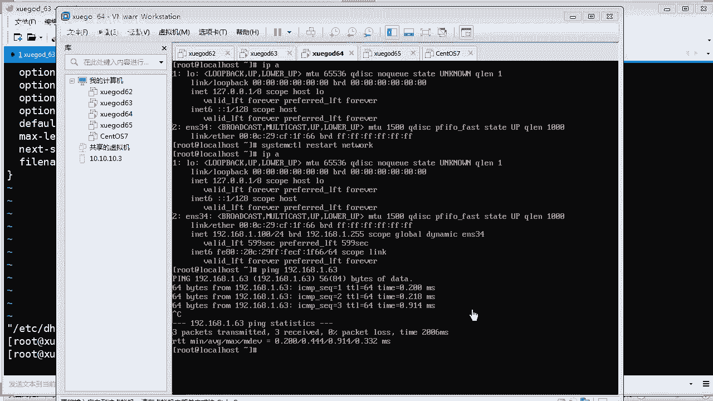

我们要改啊，比如高包括我们的这个应答文件啊，还有启动的顺序啊，是吧启动你要从哪里去取文件啊等等这些东西你都要配好是吧？嗯，这是还重点啊，同学们接下来讲的东西就是重点之重了啊，就是嗯比如。刚才讲了啊。

我们不是考了相关的启动文件啊等等很多东西嘛？对吧？在这个TFTP这个下面啊有个P叉E下面的CF区，哎，这里有个de对吧？这个东西能干什么呢？它可以指定你的就是安装这个操作系统的方式说。他会读取这个文件。

告诉告诉你的客户机。哎，我应该是从哪里下载系统镜像啊，我应该是从哪里下载应答文件啊等等，这些都都是在这个片子文件里面配的啊。所以它相当的重要，是吧？那我这里的话要改一下啊，首先你要改，我告诉你。

只要改第一行和第六4行就可以了。是吧来。是吧。那。我把行号第一行是deford什么什么什么啊这个东西是吧？啊，我们把它直接干掉他。呃，这个名称其实我们可以随意起的啊，比如我也可以起lin。

我也可以取case是吧？我也可以取sOS。但是你要注意的是，如果你起的名称要跟下面第六十行的那个要对应，那干脆我们就按笔记来吧，我就起名称叫linux。其实他读了第一行之后呢。

就说默认使用啊linux那个配置。什么意思呢？你看啊就是第六十四行。那64我们拉下去给你看。看没有这里。哦，不是哦第61行，我说错了，对吧？改是改64行，但是它读取啊，首先上面是defordlinux。

那么它就会选择啊以这个开头后面跟着linux的就对了。明白没有啊，如果你上面写的是写的是check，他就会读到66行，然后就会读66行下面的这些配置，对吧？那你写零0时呢，他就从61行开始读。

对吧也就说读了第一行，马上跳到61行的意思，懂吗？这个很让我了理解啊，对吧？他就跳到律师项，哎，61行下面有什么配置啊，就是这些配置。所以说你这个零0呢跟上面第一行那个后缀一样啊，你爱改什么都可以是吧？

都没有问题，只要不要冲突啊，你不要跟这里有冲突就可以了，是吧？因为下面还有很多，你看没有？是吧还有各种各样的，你看。是吧好，我们这些啊我们不用管它啊，呃，我们就主要是改一下第六十行这里啊。

这里要改什么呢？嗯你要指定你要告诉他，哎，我应该从哪里去找我的这个什么呀这个镜像。对不对？找这个镜像，还有呢这个应答文件又从哪里去下载，你要告诉他。OK那你应该照着啊，比如这个叫啊in点。你炮。对吧。

就是你的系统源在哪里呀？😡，我们是通过FTP的对吧？我们可以写FTB啊，192。168。1。63对吧？我刚才放的光盘镜像是不是在这里，我们是通过VSFTBD来搭建的这个光盘镜像源自在这里。没毛病吧。

是不是这里？肯定是的是吧？O。如果等一下你也可以啊再确认一下儿子劝认一下啊。如果你怕了错的话，对不对？然后呢，你还要告诉这个应答文件叫in点ki。这个硬达文件的下载路径在哪里？

我们也是通过FTP下载就可以了。1。63。对吧下面kis哎，这个文件你当前是还没有生成呢。我们刚才并没有配置这个文件，对吧？那一会呢，那你要记住了啊，你要把这个文件配到什么呀。

配到你的这个这个目录里面去是吧，就是跟目录里面去。对不对？没毛病吧，因为因为这个镜像是放在这个路径下面，而这个呢是放在顶级目录，就是根目录上，对吧？就你的FTP的根目录上。懂我的意思吗？O。

IP不要填错对吧？就可以了。好，然后的话保存并退出。O。保存并退出啊。那。改完了是吧，这里就要讲一下啊，我翻到笔记里面给你们讲一下这个东西啊，这个东西的作用。😊。

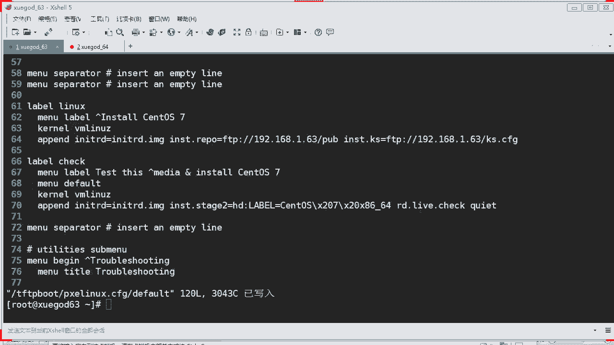

嗯。对吧这里讲一下啊，呃，这里就是刚才我们改了嘛，第64行对吧？指定通过网络启动系统时啊，通过FTP服务器访问这个什么呀这个应答文件，这个天star文件。这个。对吧。啊，就是这样配啊啊，这里解释一下。

第一行de表示指定默认入口名称啊，刚才已影响对吧？你写了lin，它就会直接跳转到读第61行。哎，发现第61行就是lin，对吧？它就读啊，那个呢这个linux下面有什么配置呢？就是从61到64行是吧？

包括定义引导的入口啊，然后要开始自动安装安装程序必须访问这个什么应答文件等等，这些东西就配好了，对不对？那当然了，刚才我们只是通过FTP的方式来下载相关的文件，我们有多种方法来下载这个文件。

比如你可以通过什么呀？这种方式，比如通过HTP方式来下载，就是web方式。或者是通过什么呀NFS方式也可以的哇，不一定说一定要写什么写FTP是吧？你也可以通过HTP当然如果你要通过HTTP的话。

你要装什么呀？你要装we服务啊，你可以装一个帕奇，你可以装是吧？或者你可以装其他的啊什么，但是一般我们装帕奇可以是吧？或者我们这里直接用FTP就可以了，是吧？都可以啊，它支持多种啊。

支持多种的这种这种啊。😡，方式来进行下载啊，这里只告诉你啊，扩展一下。OK刚才我们已经测试过了是吧？没有问题啊，可以也可以看到这个文件了，对吧？那往下去看的话，我们就可以来做实战了，对吧？

准备要写这个ki文件啊，这个才是重点了，对吧？这个kis文件的话嗯。你看这里笔记里面的话，它是什么呢？他用的是这个图形界面的方式来配的。那么实际在生产环境中，你们有图形界面吗？

你们的操你们的生产环境的操linux系统会装图形界面的linux吗？不会对不对？不会啊，你不要想着这个东西，哎，我要装个图形界面去做去配它多轻松是吧？还中文界面。

但实际生产环境都是没有你想象的那么那么美好。所以呢我今天呢就干脆不要这个。不在这个图形界面啊，直接写配置文件。好吧。因为如果用图形界面的话，你们啊记点即成啊，你看看着配就行了，是吧？

这个东西是干什么用呢？我先跟你讲，就说你配这个kiss文件呢，它主要是用来应答的。OK。应答的啊，什么应答，就说我要装这台新的电脑的时候，应该是怎么样一步步的应答它。比如基本分置啊，你看这里啊。

基本配置啊，它这台系统它使用的是默认语言是什么？english键盘语言使用这个USenglish时区使用的是亚洲上海root密码，我设置它是123456啊，就是配置这些东西，对吧？让它应答。

你照着我这个填去安装系统的意思，还有架构是什么？安装后是否要重启，对吧？然后还有安安装方法啊，安装方法呢，它是全新安装还是升级安装，对吧？当概是全新安装了，因为我是买回来一台新的服务器嘛，对吧？新安装。

OK然后的话哎安装方法它是通过哪种方式去下载这个源，你可以通过啊这里有写是吧？通过FTP那就写FTP的服务器，对吧？他说应答，哎，你要从这里去找源对吧？然后这个目录下去找。明白吧，要引导装载程序的话。

你看。安装新的引导是吧，我们肯定是要安装新的引导了。因为我们是新系统，啥都没有，肯定要安装新的引导是吧？也要安装什么呀？主引导记录，这个MBR对吧？也要装啊。

你们装个系统应该知道这个东西都要都要要配的嘛，对吧？分区信息肯定要分区啦，因为我买回来这台新的服务器是吧？我的硬盘都没分过去，对不对？我要如果有主引导机录，我要把它清掉对吧？啊，删除所有的分区啊。

如果有我要把它删掉，然后呢我要进行做一个分区啊，这里有个布局，比如部署分区，我让它啊把它分区类型是叉FS是最新的文件系统格式对吧？要格式吗？是啊，分多少不得分200兆就行了，是吧？跟跟分区分多少。

分啊10个G对吧？还有你的呃s就是虚拟是吧？虚拟交换分区，你要分多少对吧？你也可以可以在这里添加。😊，其实跟你安装超这个linux的时候呢，差不多，对吧？那个步骤只不过这里是先预定好我要怎么样去走。

对吧？把这个程序流程先写好一张清单，然后呢，他就看着这个清单去操作，全自动化去操作的意思。明白吧？😡，其实他提供了一个叫图形界面的，给你配的中西，但是我今天就不用这个了啊。啊。

我我我在这个笔记给你们讲是吧，其实就是这样意思啊，还有网络配置是吧，验证防火墙要不要开啊，显示配置要不要加载一些第三方的开发包也帮你装上去是吧？还有装完之后，你要不要搞一些脚本呢，是吧？

这个非常功能非常强大，你看没有？网络配置，比如网络设备名称对吧？呃，网络类型是不是调成DHCP，还是说使用固定的IP地址，你都可以配，对吧？一般我们是自动自动获取就行了，对吧？呃，来，你看。😊，呃。

验证类型是吧，使用屏蔽密码是吧，这种加密算法。嗯，防火墙是吧，就说你安装这台新的机器到底要不要开启防火墙啊，开启S呢，当然不要开启了是吧，不用是吧？免了，不要给我开启是吧？如果你要开启也可以是吧？

像这里开启防火墙，那我就应该开放什么呀？开放这个80端口和22端口，你要把这两个勾上，看得懂吗？如果你要哪些服要开启，你把它勾上，要不然嗯使用防火墙之后，有可能哎你连远程都登不上啊，那就坑了是吧？OK。

😊，那显示配置，他说你要不要安装图形界面，一般我们都不要装，明白没有？这个要根据你实际情况，生产环境肯定不需要你安装一个图形界面的。啊，我们都是最小化安装，你装这个东西不是浪费嘛，对吧？也不安全是吧？

那开发包就说安装这个系统时候呢，是不是要附带给你装下一些开发包程序是吧？比如开平台平台开发开发包工具等等。是吧包括其他的一些东西，你都可以选。是吧还记得吗？你的安装系统是不是有也有这些东西先？对的是吧。

都有这些东西啊，你可以选啊。嗯，O。自定义原件包啊，是不是？预安装脚本，就说你在预安装的时候，要不要执行一些脚本，所以你自己可以写一些写什么呀？校脚本放到这里让他执行一下，要做一些什么动作。

当然我们这些没有特殊要求，我们不写，对吧？安装之后呢，你又要执行什么脚本呢？也可以写。你看像我这里写了一个叫安装完之后，系统呢，你给我配置一个本地亚母言吧，对吧？那你就可以写一个校脚本，写在这里。啊。

写在这里呢，当你当他帮你安装完系统了，他帮你执行是吧，执行这个校脚本，帮你配一个本地按员是吧？很简单。就这么多。😡，没了是吧，然后最后的话。

你把这个这个配了这么长时间的这个什么呀这个应答文件保存保存出来就导出来是吧，保存到哪里呢？😊，那比如你保存到root目录下啊，然后把这个保存下来了，就变成这个文件嘛。看到没有？变成那个文件嘛。

是吧我们命名为ki点CFG啊，然后呢，你把它拷贝到这个FTP上不就搞定了吗？就完成了。😊，就这样的意思。好吧。那么如果你们的这个服务端啊没有图形界面的话，你是弹不出来这个这个界面的。

对吧你是谈不出来这些东西的。你必须有图形界面它弹出来，但我们不需要图形界面，我们也可以配我们自己写这个KS呃叫KSCFG不就可以了吗，对吧？😡，是的。OK那这样子啊啊等一下我们再来写啊。

我先给你介绍是吧，介绍一下，通过图形界面来配这个cases文件的时候是吧，是这样的一个过程啊。😊，好，那我们先休息课间时间啊，休息一下，然后回来我们再写这个KSFG文件，好不？

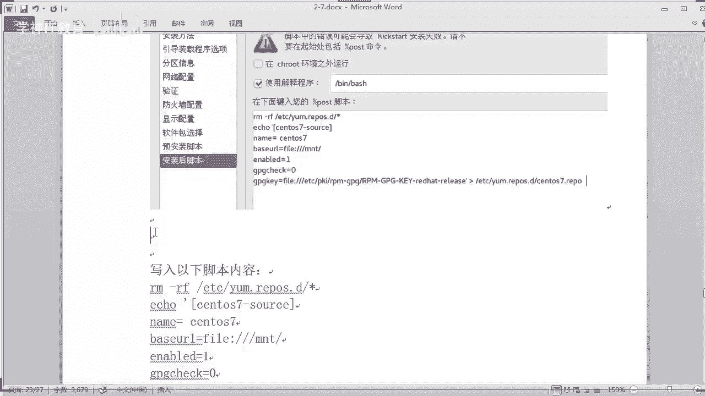