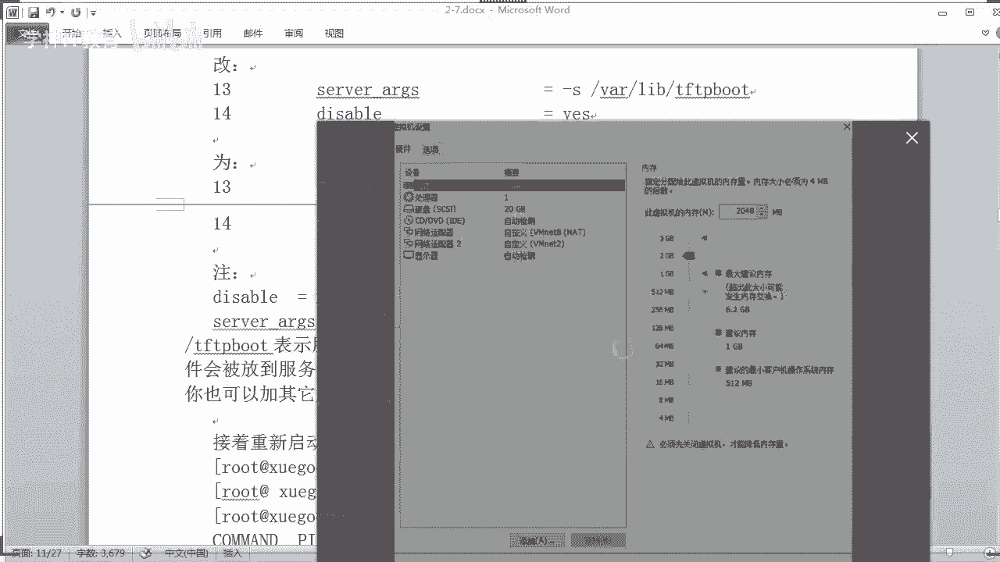
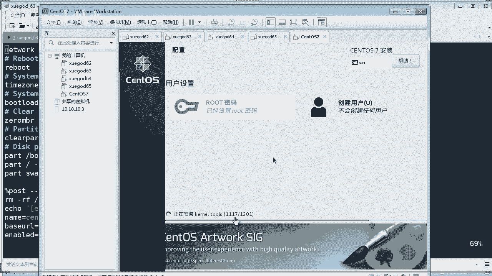

# Linux／Linux运维／RHCE／红帽认证／云计算／Linux资料／Linux教程--无人安装配置-测试 - P2：无人安装测试02 - 学神科技 - BV1AZ4y1u7PH

好，刚才讲了啊，这个cases的应答文件了是吧？非常的重要啊，那么在生产环境呢，你又没得图形界面配是吧？那你只能自己写，是不是？所以呢这个配置文件一般我们是可以提前写好啊，写好。

你可以在网上去找这个配置文件要改，也是可以用的啊。我们主要是了解每一个项，它代表什么意思，那你就知道怎么去改了，对吧？这是很重要啊，你看啊，我这里有一份啊，看没有？那看没有。那这里呢其实啊已经定义好了。

对吧？你只要看这个没有注释的，就看得懂了啊，上面是注释说安装系统是全新安装还是升级安装。那你如果你写inst这个这个单子上去表示全新安装，对吧？啊，我们就用全新安装就可以了。那么键盘的这个语言的话。

我们使用的是US对吧？就是美国的这种标准的一个键盘啊，对吧？然后root password的话很好理解啊，对吧？交配一个什么呀？你root的密码，这里呢是用一个加密的方式。那么加密的这个的话。

一般我们你可以通过一个算法的方式把它算出来。比如使用这个什么呀？啊，这个MD5啊或者512这种算法对吧？来进行算出来。对不对？或者我通过通过在我的linux下去算一个什么算一个密码出来。

然后写到这里就可以了。OK。呃，然后这个呢就是你的原啊原地址啊，就是你的这个什么你的安装系统，你的系统镜像的原地址是哪一个？你可以用FTP啊，或者是用其他的对吧方式来。那我这里用就又用FTP啊。

然后是这个地址在PUB下面啊，就我的系统就在这下面，对吧？他会通通过这个地址是去下载。ok。😊，往下去看啊，sstem language的话就是语言嘛，你们都看得懂是吧？啊，这里定义的是什么啊。

lan然后是。带HCN就是中文嘛。很难好理解是吧，支持这个中文的嘛，就是中文的啊，对不对？啊，forward啊 configurefi啊，这个更好理解是吧？防火墙要不要开启还是关闭。看得懂吗？对不对？

也就是说这些注解我们可以把它删掉。如果你知道是吧？啊，大家不用散心啊，那防火墙我是要关闭的，dember对吧？把它关闭。如果你要开启就改成yber是吧，就可以了嘛啊。呃，往下去看就是认证是吧。

就是用户认证啊，这个用了加密算法是吧，使的是SH512，对吧，这个。使用这种啊杨幂算法，然后是否要安装图形界面，对吧？你就写这里要不要装，要装，你就写这个不要装，那你就不用写了，对吧？就看你要不要安装。

哎，这个是图形界面还是字符界面了，我都忘了，是图形界面吧。还记得吗？ok。要fatboard december这个的话就是第一启动啊，这个把它关闭是吧？我们肯定不需要它第一启动为这个图形界面的嘛。

S要关闭吗？当然要关闭是吧？设置啊net word就是配置网络这一块。网络这一块的话我们配置成DHCP就是动态获取地址，对吧？那是网卡名称的话就设备的名称是什么？ES33，对吧？我们写ES33啊，OK。

啊，然后重启。对吧。要不要重启是吧，就说安装完这个这个什么呀，安装完之后呢，重启有的同学说你都还没配完，怎么又重启了？其实这个东西它它是有有有定义的。就说你如果你要定了这个表示什么，安装完之后才重启。

你看没有？这有注结。对吧安装完之后再再重启。如果你不需要的话，可以不加这一项啊。O。嗯，然后是区域啊，这个是一般我们配种都有区域的嘛，时区嘛，是吧啊，比如亚洲、上海是吧？北京时间是吧，OK呃，启动。

启动的话启动模式是MB呀，就是我们进行那个启动啊，对吧？不是有个这样的模式吗？MB呀对吧？啊，OK。然后cle master是否要清楚，对吧？肯定要清除他原来的这个引导，对不对？zero就是青零嘛。

青零呃，你之前的这个MBI啊OK。是吧其实都看得懂啊，然后清除他所有的这个分区。这个是不是分区啊？对吧分区如果有的话，我们把它清空是吧？重新再分啊，然后清空之后，我应该怎么样分区呢？你写在这下面啊。

看得懂吧？比如我要分一个不骤分区给它200兆的一个空间，然后呢，文件系统格式呢是叉FS，对不对？根分区呢，我给它10个G，当然呢你给它硬盘，你要注意啊，你这里不能超出你的硬盘的总容量，要不然就会报错了。

这个要注意一下，对不对？比如你分10比如你20个20个G的硬盘，对吧？你分这里分了10个G啊，然后这里分了啊200兆，这里分了1000兆，那还是可以接受的嘛，对吧？这swa啊，你可以指定它。

比如1000兆。对不对？这样子OK。啊，就把它的这个类型写上去就可以了。简单吧，对不对？呃，往下去看就是要配。比如我安装完之后，比如我要配一些什么写一些脚本啊，你应该就写在这里，看到没有？

有些就安装完系统呢，你给我配置一下这个本地亚母园，你看。也就说这个步骤的话，其实你可是可选项啊，可选项，你可以不用它也行，是吧？你如果你想让他帮你配，你就写好这个校脚本，写这里他就会帮你配了。ok。嗯。

然后安装的时候呢，要不要安装你的这个工具包，你看这里会定义啊是吧？比如啊这个开发包对吧？还有什么什么工具包，就刚才我们看到那个那几个，我拉上去给你看啊。就是这几个看到没有？什么平台开发，什么开发工具。

什么附加开发啊，就就就这几个东西是吧？😊，如果你要装啊，你要把它写写写在这里。他就会给你装了是吧？OK最后的话结束就这么多。那他其实你用那个图形界面配好完之后呢，它就是生成这个配置文件。就是我这个。

对不对？有了这个配置文件啊，我们可以随意的添加和修改它就完事了，是吧？以后你可以你可以拿着这个模板去添加和修改，都可以啊，都可以用，是不是很方便啊？ok。好嘞，那我我已经写好了是吧嗯。😊。

这个我传给你们了啊，我看一下啊。传到哪里呢？如果没有图形界面的话，这个配置文件怎么来？要自己一个字一个字敲吗？它有自带的模板吗？有啊，我现在不就给你一个模板吗？你可以改就行了，是吧？我要传到群里给你们。

啊。嗯，来，我找一找咱们班。群文件啊来。软件包我传到软件包这里好不好？还是笔记这里啊，软件包吧。这个很好理解啊。嗯， ok。这个软件里会有自带的这个模板，有你可以找他慢手册每一个参数啊，你都可以。

比如就像我这个模板里面呢，没有的参数，你也可以添加上去的，明白没有？比如后期你可以添加一些特殊的东西上去都可以啊。自己用图形界面生成一个也可以。那么jes诶。jessica同学啊，好熟悉呀。

你肯定是老学员是吧？嗯，对你可以用图形界面生成一个啊，对吧？你可以找一台，比如你们公司的测试机，比如你自己玩了这个你你这个vim word的一个一个一个实验机是吧？生成一份也可以生成一半呢。

以后你都可以拷来拷贝来用。懂吗？ok。因为在生产环境的话，你哪来的图形界面呢，对吧？嗯。好嘞，好，我们把这个东西配置完成之后啊啊，对吧？然后的话我们要把它拷拷到哪里去呢？😊。

嗯，涂姐。我们应该拷到这个下的FTP这个目录下，对吧？我们这里是有1个PUBPUB下面的话就是我们的系统镜像了，对吧？然后我把这个文件。拉上来。那传上来对吧？传送完毕啊，我给给你看一下啊。

然后我我给你打开看一下ki。你看就这个样子的吗？是不是啊啊，在这里看的话舒服多了，对吧？😊，哪。很简单，其实这些东西你都看得懂啊，比如你要开启什么，不开启什么，要怎么分区啊，照着这个格式去分就可以了。

😊，懂吧啊，写一个笑脚本啊，最后要装什么开发包，就这么多没有了。😊，用跟我们虚拟机生产可以这不当然可以了是吧？啊，可以的一样的啊。好嘞，那有了这个东西之后呢。

你要注意的问题就是刚才我在上课的时候跟你讲了，可能有些同学刚上课的时候没有听我讲。你的客户机啊，就是你要进行自动化安装的这些机器。你的内存肯定要啊2G或者2G上，但实实际生产环境肯定不止2G的对吧？

按目前来说。如果你第一两句的话，他安装就有可能报错啊，有可能会报错。所以这一点要注意啊OK。好，那这个东西的话配完之后啊，我们已经把它上传到相应的这个FTP目录啊，它就能够正常下载了嘛。对不对？好，那。

我们已经把它配完了。那这个时候的话。我们要注意问题是你现在准备一台新机器呢，还是用一台已经安装好系统的机器来测试呢？这个问题啊。

要注意。那这里的话要跟你们讲一下，有关于这个问题啊。你是要到底是用哪种机器啊，哪个来配？对吧新的吧，新的话测试效果非常好。因为为什么新的它默认就是从硬盘启动，硬盘本来就没有系统是吧？它就会从网络启动。

那如果哪一台已经安装好系统呢，你测试的话，它第一启动就是硬盘，那么进入原来的系统了吗？那我怎么测试呢？那你要调成网络启动。所以这个东西啊你要你要注意这个问题是吧？你这边要跟你讲一下啊嗯。

在哪里我看一下啊，在这里讲是吧？注意啊，就对于安装后重启这一项建议不用勾选，这里不是有一个吗？安装后是否要重启啊？是吧我刚才那个配置文件不也有这一项嘛，对吧，叫Vbo是吧？建议不要勾选。

因为系统在重启过程中，如果第一启动顺序是还是网卡，那么它会再次重新引导安装系统啊就坑爹了，是吧？啊，这这个东西，所以你要注意的启动顺序一定是第一启动，把它调成什么呀？硬盘启动会比较好一点。

因为新机器默认的话啊是硬盘启动，对吧？情况啊，如果被安装的服务器原来就没有系统，就可以把安装后重启这个勾打上，对吧？就我们把这个这个参数写上去，写到那配置键。因为安装系统时默认的磁盘作为第一引导。

而磁盘中是没有系统了，对吧？它就跳过去磁盘引导，就会使用网卡引导，对吧？当系统安装好之后再重启呢，它就会从磁盘引导了。因为你第一启动是磁盘，这样的话正正好就用你的新系统，对吧？好。两个一起来是吧。

看效果。那这样子啊。来给你看效果啊，同学们。

嗯，我先拿这台，那64这台呢是已经安装好系统了，来测试，对吧？这个是安装好系统了，对不对？你看六4啊，我重启，我直接重启啊。We boat。

那我进入到这个boss对吧？这个boss，你看一下它的第一启动顺序是什么。同学们睁大眼睛看我都说了，新机器第一次启动的话，肯定是硬盘的排在前面，网络排在后面，对吧？😡，网络排在后面了，同学硬盘排在前面。

它是从上往下的嘛，所以所以要什么呀？😊，嗯，所以你要你要把它调整顺序，你把它这个调上去，比如调到前，反正你调到硬盘的前面就对了，对吧？但是这样又会出现问题啊。如果你把它调前面，等一下重启的时候。

那不就完蛋了吗？它又重新不断的重复安装系统，不断的重重复安装系统。😡，啊，那这样又头疼是吧？所以如果已安装系统的话，你要注意啊，你可以这样子啊，临时让它网络启动就可以了。什么叫临时？那比如就按它默认的。

先硬盘启动，再网络启动啊，这顺序你不要动啊，就不用动它。啊，不用动它啊，他原来是什么就是什么啊OK。然后我们可以。这样子。我先按F是保存一下，对吧？然后在启动时候呢。哎，我按了没有？没反应了。退出。

然后保存。哎。😮，算了，我也不用保存了，因为我就没有改动过啊。

然后我直接按重启吧。好。你看没有？我这个时候呢按了1个F12，你们有没有看到我按了1个F12，你们是看不到的啊。我按F12呢，它就是从网络启动啊，注意。😡，你在启动的时候要按F12。

它就临时从你的网络启动，看到没有？没有操作系统的主机网络怎么设置自动获取IP你这个问的有点意思啊。

没有操作系统是没有操作系统啊。😡，因为他不是P叉E这个东西在生效吗？P叉E这个东西呢，它就自动帮你啊设置或1个IP地址。F12是根据机器来的。对对对对对啊，不同牌子的话可能有点区别。所以你要熟悉啊。

比如你买的是戴尔的服务器，买的是IBN的服务器是吧？那你要想想哎，我应该怎么样去设哪个快捷键，它是从网络启动就可以了。明白没有？这里我要提醒你们啊，这些东西在笔记是看不到的啊。以后你们出去生产环境。

你要注意这个东西啊，不同牌子你要。不过呢，你买回来新机器基本上不存在什么问题。因为新机器它默认是从硬盘启动，再从网络启动，对吧？哪里设置快捷键网络启动，这个东西不是设置的啊。

它本身这个boss里面就已经定好了，明白没有？就人家出厂这个主板就已经带好了OK。😡，在哪个时间按F2，就在一启动，你看到那个启动界面的时候就要按了。OK那你看我这个悬霸64这台机是刚才已安装好系统了。

我现在临时让它从网络启动，你看它就会自进行一个自动化安装了。看到没有？对，这个东西你是看不到的，我只能我在这里按，我告诉你是吧？我们使用win word这种虚拟机的话，就是按F12。

那我现在是没有动掉他的东西啊，他完全是自己在安装，你看到没有？😡，是吧那密码自己设置。你看这里啊看这里正在等待4个县程是吧，你看正在设置安装环境，啊，正在创建分区，正在启动软件包安装过程，全自动化的啊。

你啥都不用干，这个时候呢你就应该泡一杯茶，对吧？同学泡一杯茶啊，翘着二郎腿啊，在这里边喝着边看着。就可以了。假如你这个机房有100台机是吧，让他100台再装，你是不是赶觉很壮观了，是吧？😊，很壮观吧。

怎么实现呢？奇怪，如果是新机器的话，连操作系统都没有怎么实现。独步红尘呢，可能你是比较基础啊。它的启动作用呢，它是通过P叉E啊，P叉E这个是它是一个引导程序，知道没有？引导程序呢，他就会干什么呢？

他会给你的，你不是有物理网卡吗，对吧？他会对你的这个物流网卡呢临时是吧，分配1个IP地址，明白没有？同学。OK它是带驱动的，带驱动文件的。啊。怎么操作没实操过是吧？没实操过。

你看我这里刚才不就实操给你看了吗？一样的道理啊，一样的。你在你在物理机上也是这样的操作。😡，换了好几个虚拟机也没成功嗯。佳斯卡龙学。你你还做不成功。不可能吧。那同学这样这样这样这样这啊。

那这一台的话是正在安装了是吧？嗯，我再找一台新机器给你们装，好不好？

新机器啊呀，我这个好像又有系统。我去哪里找他先进去。嗯。我把这个删掉。把这个硬盘。3料。嗯。移除它对吧？哎我看下这个硬盘放在哪里。对，创建一个新的虚拟机。啊，一样的呀，我我把这个硬盘都删了。

不就相当于一个新的虚拟机了吗？对不对？老铁。啦啦啦啦啦，我看看啊。😔，O。好，我添加啊。添加一块新的硬盘啊，看到没有？我这个相当于新建讯你一个样了啊。嗯，这个是。创建新的硬盘啊，我系统都干掉了。

OK20个G对吧？7。0对吧，就这个。嗯，放哪里？好，就这个路径吧，不管他了。7。0啊完成。物理机上当然可以了是吧，你用物理机也行了啊，没有问题啊。那这个是新硬盘，同学们，这个硬盘是全新的啊。

里面是没有任何的系统啊。😡，看到没有？OK那这个3条7这个啊是全新新建的一个信息，然后我点开机啊，你们看一下它能不能自动化安装来。

对吧你们现在看到就是新机器，你买回来新机器。

你看啊你看它第一启动就是从网络启动，看到没有？😡，是吧你看已经分配了1个101的IP地址了。😡，看到没有？😡，那这个是全新的机器啊，我啥都没动啊。是吧我新建了啊。看见没有？哪哗啦哗哗啦再跳了啊。😡。

全自动没有系统的啊。O。呃，同学说虚拟机反应太快，所以F1没用啊。对虚拟机反应非常快的。所以你不是你要把那个光标啊定位到你的虚拟机里面，快速的迅速的不断按F12，它就会从什么呀从网络启动啊啊。

这个是相对于已安装好系统的情况下才用啊。像我这种新建的虚拟机，你不用管它。😡，你尽管配置新建好讯机，也要启动它，它就自动从你这个什么呀，从你这个这个这个网络启动了，是吧？全自动化对吧？

老师生产环境服务器可以给P叉E网卡设置1个IP吗？用户连接PI服务器。嗯，可以呀。他本可以呀可以啊可以呀。但是你你给他设置1个IP，为什么要设置1个IP呢？它本来就自动化就行了。

他通过DH是一批分配的呀，你想手工设定1个IP地址吗？😡，这个也可以批量安装，可以当然可以批量安装windows了，对吧？嗯。004都可以的。好嘞。

这位同学分享的是什么东西？打开电源进入工具啊，这个进入boss嘛，进入这个boss嘛，对吧？是的啊。你看这个是全新的一个虚拟机是吧，全自动化也在装了，然后那个六4也是在装，对吧？我们返回六4哎，六4。

你看六4，你看这里总共有1201个包，已经安装到862个包啊，864了，对吧？然后我们啊这个已经装了那么多。然后我们到这个这一台呢。是吧这台也正在启动安原件包安装啊，是不是可以批量安装啊，没问题吧。

是吧，老铁。是吧那如果你现在有100台，那你一下子把100台的电源打开不就完事了吗？😡，对不对？😊，O。那他就全自动化进行安装是吧？一般我们可能生产文件还要配的更加细化一点，吧？比如他安装完之后呢。

帮我们比如搭建一个让环境，搭建1个LNNP环境。哇，是吧，全部你写好脚本放在那里，全自动化帮你装，是不是很爽？装完之后呢，连你需要的是像比如啊一个通块的环境都帮你配好了。

或者是1个LM配的环境帮你配好了，是吧？你只要抑制好这些脚本。全自动化装完装完之后呢，你还可以让它启动是吧？😡，呃，你的服务启动。是不是很爽？自己查找系统路径吗？对，当然了。

这些东西我们提刚才不是提前已经一写好了吗？他从哪个路径去下载这个什么呀系统镜像，从哪个路径呢下载应答文件，对吧？OK你们成功了吗？同学截个图给我看一下有没有做成功的同学。啊。嗯，助教同学是吧？卡了吗？

啥意思？😡。

嗯，我看一下你有没有报错啊，这里有个失败警告。失败 to fetchstar from，你看他说在获取你这个应答文件的时候，失败了，不懂了，这里不是写的吗。获取你的应答文件。

这个KSCFG就是一个应答文件，失败了。同学。为什么从你这里获取文件失败呢？你首先考虑的问题。是不是网络不通啊，还是说呃，什么或者你等一下吧，你先不用动它。😮，是吧他只是卡住失败了。

那么现在他有可能还会重试啊重试重新下载。你一直等到他会有一个最终的报错，并停止啊，停止就是回到那个那个什么就操作光标下了是吧？然后你再看一下。能道FTP禁用命没法。哎诶，这个有可能是吧？

比如你的这个服务器啊，你要配好，肯定要要开启匿名访问的，对吧？😊，因为在我们这个这个模式下，必须是匿名访问的啊。回忆同学不错啊，你看全自动化中是吧？good的啊，其实做这个东西不难是吧？

你看这位同学已经做成功了啊，很好啊。😊。

呃，新的机器通过P叉E是怎么连接到无人指手安装服务器的？通过DS机分配的IP地址连接到吗？对，龙杰同学，你问的这个问题，你自己都回答了啊。那首先的话，你所有的新的机器都是在这个网段上。

比如我又接了一台24口的交换机是吧？那么我的服务器也是接到这台交换机上我这个交换机是同一个网段，没有画什么对吧？他都是能够访问的。他我的服务器在上面，那他就会从我的这个D去分配个啊这个分配个地址。

分配完地址呢，他马上就会干什么呀，从这个P叉一引导P叉就是网络引导引导了引导完之后呢，你会看到那个那个文件是吧？就是刚才我配置的那个引导文件。那个引导文件告诉你从哪里下载应达文件，从哪里下载系统镜像。

那他就进行下一步安装了，明白没有？老师以下这段话怎么理解？批量安装可以用无人值守，也可以用模板。用。那么EX。每个场景做个模板镜像，装机时直接花费一两分钟导入模板，更快说啊。嗯，这个很好理解啊。

比如我现在做好一个系统镜像，其实跟你们用Gs装系统是一样的道理嘛，对不对？阿里云就是这种模式啊，比如他抑制好一个系统，帮你抑制好了这个让环境啊啊或者是呃什么PHP环境啊，通快环境啊都装好了。

那么那你们公司可能装的环境都一样。他批量把这个模板镜像啊，一部署一恢复，他不就可能成功了嘛，就这样的意思啊，是吧？但是那种模式跟我们这无人之手一步安装还是有区别的啊。😡，如果网络环境不可以用DHCP呢。

按你这个问的，怎么就不能用DHCP呢？你给我举一个例子，什么情况下不能用DHCP。我都把它设置在不同的网段上，他怎么就不能用DHCP了呢？😡，Ha。是吧。自己搭建的对呀。

我这个DHCP都是我自己搭建的呀，是不是我又不依靠你你的其他第三方的DHCP对吧？我都搞了一台服务器，专门搭建DHCP专门放镜像，专门放韵达文件的。😡，用模板的话，那UUID不都一样了吗？O。

有所以说用模板UUID1样。是的，但是人家会做一些脚本处理呀，是吧？你要像阿里云的话，就是用镜你用镜像，比如用镜像呃部署这个应用主机啊，非常快。因为你部署好一台，然后呢，你先生成一个镜像。

然后再部署其他的话就非常的快。是的，没错，但是呢它会有相应的脚本，你是看不到的。它脚本的话自动化的帮你嗯，比如重新生成UUID啊，重新去掉你的这个网络配网卡配置啊等等这些东西，你知道没有？

它是不会把这些东西录出来的。明白没有？那你自己做的话，你肯定要自己写了是吧？😡。

这是没有找到吗？哎，来看一下这个助教同学啊，你看像这种就是已经停止了，你根本就没有没有成功。你能不能把这个截图截大一点，截个全图给我们看一下，截全图。

不在生产同网段可以啊，你可以不在生产网段。是吧。如果是新服务器的话，上电自动安装成功后，他如果再重启默认第一个加载的是啥硬盘嗯独步红尘。新机器的话启动的是硬盘先啊，网网络后啊。你不信你去买一台。

你买组装机也行是吧？他的新主板买回来，他默认的话，肯定是啊硬盘优先以网络启动，对吧？😡，这个东西其实都已经想过的是吧？来，你看一下朱教同学。嗯，这种一般的话肯定是什么呢？呃，两个问题。

一个是你的配置不够高，你有没有2G的内存？第二个是你的刚才你配置的这个网络下载不成功，就说他无法从你的这个网你的这个下载原这个原地址下载东西。就两个问题。O。为什么我刚才说要准备三台机器呢？

就是拿一台机器来做客户端测试一下，检测一下你那些FDP能不能够正常下载，明白没有？通过匿名方式能不能获取呀？😡，有没有你要测试一下通不通啊，这些东西都要搞一下。今天有点事。

前面没有听到这个地方如果如何修改柯子同学是吧？柯子同学啥问题，我看一下啊。好，这个是吧，这个的话，你改成你的真实这个路径呢，来我这个给这位同学回答一下柯子同学。那。你们有问题都可以问啊呃。

来我翻上去给你看啊，我为什么要改这个地址？其实你不改的话。😊，也是行的，只是我这下面路径改了，所以上面也要改啊。在哪里呢？

VSTP。

诶。啊，这里。是吧我改成了这个地址。这个这个地址。我为什么改成这个地址呢？是因为啊我创建了这个目录，你提你要你要首先你看前提是你要创建这个目录。😡，你要创建有这个目录，你再改啊。

然后这里的话要改成no啊，这个要改成no，主要改。我标红色的东西就是要改的，其他东西你不用动。这个目录有没有创建？对不对？O。

嗯，OK看一下助教同学的配置，一核2G嗯，20G内存。OK我看到你这个网卡的话，有两张网卡，对吧？那么这个时候可能哎你这个是服务端呢，还是？啊，客户端呢。有两张网卡啊。我我我担心的是你有一个网卡。

有1个IP地址存在一些什么呢？可能有冲突或者什么的，导致他下载不成功。因为你可能有一张网卡，你配了固定IP地址。对不对？啊。哎，你刚才那里可以那个啥的呀？😡。

啊，我看了你看上面的话呃，他从第二张网卡启动了，对吧？你看这是第二张网卡是吧？所以。但是你是从第二张网卡启动进去了，但最后他下载地址的时候呢呃。会不会有什么冲突啊？你最好两张网卡，你就。

你要调成自动就行了。还有的话，你把这个配置调高一点。

啊，你调成双核吧，双核两G吧，调高一点。很多问题都是由于你的配置不啊不够高。你是不是没有恢复快照？啊，你可以移掉一个啊，像这个这个网，你为什么配两张网卡呢，对吧？处理器啊，搞个双核嘛。

有条件你可可以再高一点都可以啊。O。因为因因为如果你配这个内存不够高啊，它会有这样一个动作，我告诉你们，它在进行下载的时候是非常庞大的。比如下载那个启动文件，还有下载啊这个系统镜像，对吧？

它又很耗内存的，你知道没有？一个系统镜像是不是4点几G啊，它下载的速率的话都要都要很大，连内存都耗光了。比如你如果你配个512内存，那完全是扯淡，它直接就。就异常就退出了，知没有？把内存配高一点啊。啊。

小问题啊，你这个都是小问题。ok。嗯。对我一般我们做这种实验呢，你都要搞一个干净化的系统，对吧？干净的系统啊，好，我们看一下这个安装完了没有，哎，这个还没装完，看一下六四装完了没有？

哎，六四差不多完了，你看到没有？六四的话正在执行安装后的设置啊，对吧？当然了，如果你这个配置越高，其实装的越快。对吧像我们这种给的是比较低级的配置的，对吧？所以安装的时间才长啊，当然1000多个包啊。

也要也要点时间是吧？我的配置文件是安装完之后呢，会重启系统，对吧？

O。啊，你看一下我这个配置文件，对吧？里面会涉及到这个重启系统，我看一下啊。对吧有这个参数。装完他会重启啊。

好。嗯，我看刚才就只有一个同学跟上脚步是吧？啊，就刚才那个回忆同学是吧，能跟着上我的这个实验啊，我看你做成功了。还有没有其他同学？啊，这个你看1001200多个包，其实我选的东西太多了，你的是吗？然。

其实我们最小化安装应该不应该装那么多那些什么开发包啊，工具包。

刚才我就是为了实验，为了告诉你们这个东西写了写了什么东西，写了那个叫。几个包是吧？这个什么开发工具啊，什么什么东西，哎呀，扯了太多。如果把这些撤删了，它安装就更快了，是不是？

记得我说的那个东西吗？我拉给你看啊，我显的包太多了，对吧？所以安装时间特别长。在哪里？在下面这里。我拉给你看啊。你用图形画配的时候是可以看得到的吗？啊，就是这里。

软件包选择你要到底要把哪些啊第三方的软件包把它装上。你看我这里选了平台开发啊，什么开发工具附加开发包。是吧这几样东西加起来。啊，好多啊是吧？如果你把这些去掉，那就快多了，他就不给你装这些东西是吧？

那哗啦哗啦可能就很快就装完了。

你看六4的话装完正在重启是吧？哎，搞定了，看到没有？我们已经有一台装成功了啊，然后六期的话还在执行安装后的设置啊。来，我们看一下六4这台机装完之后呢，我们能不能正常的登录呢，你看啊root。

密码123456。ok。有点慢是吧，我现在开了三台机，okK没有问题吧。来，同学们装完了，我已经登录了是吧，看到没有？😊，Okay。😊，没有问题吧，我们看一下IP地址。192。16801。

100没有错啊。然后拼一下，哎，现在肯定拼不通外网了。因为我这个区段本来就不能上网，对吧？我拼一下。你的服务端哦打错了。192。16。第一点。653。对吧通的啊。没毛病啊OK。好，可以是吧？

然后刚才我是配置了一个叫安装完之后，帮我配置一个本地亚母园吗？还记得吗？来，我们进去这个ETC下面要么点这下面看一下，你看是不是有个327的一个一个一个东西啊。来，我们看一下这个东西。

你看是不是帮我们配好了？是吧。没毛病吧。但但你这个是没有挂载上去呀，可能这个圆是不能用的，对吧？什么没挂载，你光盘我看一下，你看一下你的挂载情况是没有的啊。如果你要挂载上去。你这个光盘啊，如果有的话。

当然可以了，是吧？嗯。SR0。MNT对吧？挂载上去之后呢，就可以。使用你的这个样么源了，对吧？好，告载成功。啊，那你们这个亚姆。List。是吧。生成样么缓存，那应就应该没有什么问题，是吧？好嘞啊，来。

我们看一下啊。😊。

呃，这台新机器啊还在装，对吧？星期期还在装啊。来，我们看一下这个。可以。😔，要多买个显示器，要不然边看视频边操作不方便。哎，这个我是非常赞成的龙杰同学。啊，老师讲课的话就是要双显示器啊，要两个显示器。

当然了，你没有两个显示器。呃，你就不方便嘛，是吧？你们的话有条件的家可以没条件啊，那我就不推荐你买啊。不过显示器也非常便宜，你淘个二手的就可以了，不要买什么一手的是吧？二手显示器就100多块钱。

200块钱啊。到那个二手电脑城。

啊，这个助教同学看一下啊，你你做什么东西啊，这个分配地址。

没问题是吧？看一下你下一个图。

这没问题啊，你截的这个图都没什么那个密码我那个密码我们怎么用什么软件生成的配置文件那里写的，你可以用我那个我那个就是123456。当然你可以使用一个加密工具嘛，是吧？不有很多工具吗？

网上找一个生成一个加密的。如果你不想加密，你可以直接写123456。都可以的，是啊，方法很多。😡，切屏吗？😔，商品。直接把cases中安装包啊改成。就快好多。对啊，杰斯卡同学对对啊。

这样的话最小化安装最好了啊，就不用装那么多开发包。😊，老师，我还在这里有问题。FTP。

来看一下这位助教。你的问题还是卡在这里啊，他说警告是吧？呃，失败获取这个是获取的意思，看到没有？fetch fetchch啊ta from FTP102。16。8。我靠，你这什么地址啊，102开头的。

我也是醉了啊。😡，这是私有地址吗？同学，我刚才就没有注意你的地址，102。168。2。101。难道你真的是公网地址？好。我不是这个地址，那为什么从这个地址下载K kissCFG文件。

那你这个地址都不是你的地址，那就错了嘛？同学那你还看不出问题来吗？😡，去找你的配置文件。😡，肯定配配置有错了。难怪他说失败啊，获取你的这个应答文件很明显的错误啊。同学。啊是。

嗯，柯子同学这个啥呀？

你这个什么东西？哦。我这里改成了192。168。10100。88。哦。可以啊，这是私有地址吗？这个要不要删除？

。什么东西要不要删除？哦，你说DHCP的这个配置文件是吧，删了它我本身就没有用它模板。😡。

是吧啊，这位同学他问啊，我的笔记里面不是做了啊那个DHCB的覆盖吗？其实你不用不用不用他都可以啊。

我给你看一下啊，拉给你看一下，有些同学可能有点疑问啊。DHCP在哪里？我看一下啊，DHCP。啊，在这里。我是做了这个步骤是吧，你发现。😡，是不是。这个。诶。这个这个你可以不覆盖它，不用管它啊。你哎算了。

这个东西你都不要了行了，我把它删掉。车灯。对吧直接写一个文件就行了，是吧，清空章啊，自己写一个，就就是这部分啊，写就可以了。😊，别搞那么复杂。啊。

。嗯。192。168。2。101啊，地址没错啊，同学们你要搞清楚啊。

是的啊。删除完他啊，科字同学。好嘞。那个。那个助教同学，我看你的问题解决了没有啊？😡，我看一下你的问题解决没有，你的问题应该很好解决。他提示你了获取获取你的这个什么canstar的应答文件失败。

你看一下你路径好像都不太对，是吧？😡。

这个。好。呃，你的应答文件在哪里呀啊，同学。那你的硬拿文件在哪里就写好你的路径嘛？然后你这个IP地址什么是102开头的呢？😡。

类似有点公网地址是吧？

。还是小问题是吧？小问题真的。就提示你了嗯。

OK你赶紧把它修正，然后重新啊，这个很快了。修完之后呢，你马上启动一台客户机就可以测试了，是吧？超方便的。😊，又不难。嗯，好，我看一下最后面啊。配置亚母原哦，那个也讲了是吧？

这个说你可以将它调成网络为第一启动。这个东西呢你要依情况啊，知道没有？如果你调成网络启动的话，它等一下重启之后呢，还是从网络启动，那这样的话就不断的重复在装系统，你也是非常头疼的啊，这个不要乱调。

要小心啊。一般你就默认了，用硬盘第一启动是最保整的啊。

最保证的。是吧刚才我们装完之后呢，也看到了是吧，他这个药么员也帮我们配好了，对不对？

没毛病养啊，同学。我看一下64，你看64的这个样母缓存也是帮我们生成了，对吧？

搞定，然后我们看一下这台新机，唉，新机也已经装完了。哎，来我们看一下啊，登录一下。123456。ok。啊，新机啊也已经装完了啊，看到没有？IB地址是101，对吧？没毛病啊，然后看一下这个。

要么是不是帮我们也配好了，对，也是配好了。搞定。成功啊，那这种情况的话，他就可以什么呀？哇，批量的帮你装很多的系统。哎，我好像我记得我的配置文件里面写的是安装什么呀，图形化界面的，是不是？

我是不是安装图哎，没有吧。是不是没有？如果安装有图形界面的话，那就浪费了，没有必要装图形界面上去啊。ok。好，那就这样啊。

没有问题了啊。😡，啊，来总结一下啊，今天我们讲的什么东西啊，我们讲了无人值守安装服务器是吧，怎么样去实现它，怎么样去安装配置。懂了吧？是吧？还有做了一个实战啊，为公司内网搭建一个无人机手安装的服务器。

是吧，实现批量安装，对不对？那么这个东西以后啊你们。

真有可能用得上啊，是不是？

哪一天你去搞个IDC是吧，工作，在IDC机房让你批量装装机器的时候是吧？O。好，那今天的内容的话，我们就全部讲完了。同学们啊，没有做实验的同学的话，明天好好的做一下。OK行，现在是10点38分啊。

同学们我们可以下课了。😊。

