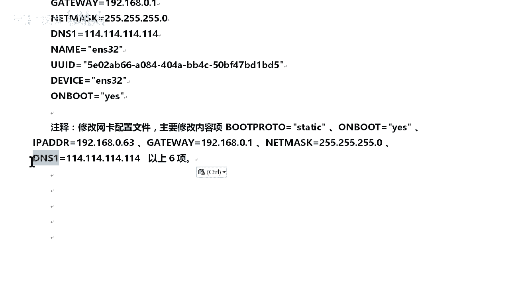
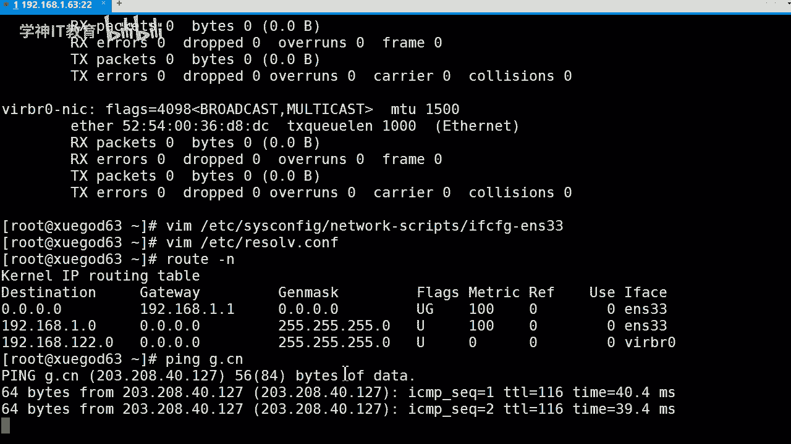
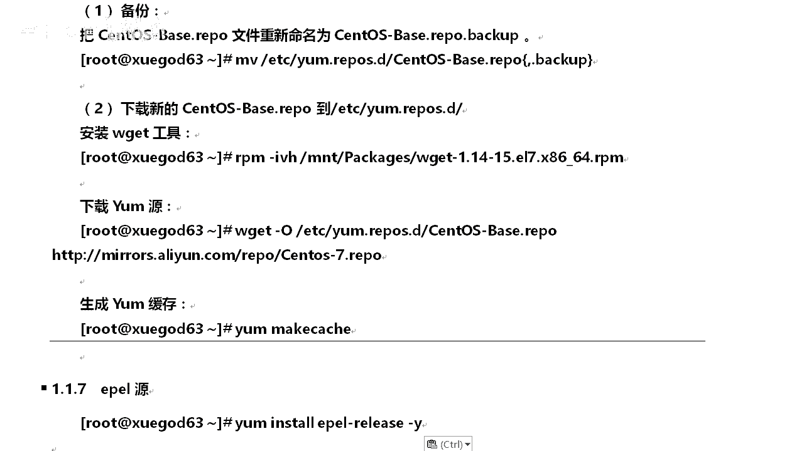

# Linux／Linux运维／RHCE／红帽认证／云计算／Linux资料／Linux教程-2-1-1-学习Linux服务前期环境准备、搭建CentOS 7环境 - P1：2-1-1-学习Linux服务前期环境准备、搭建CentOS 7环境 - 学神科技 - BV1HD4y1S71W

ok同学们，我来我们今天讲一下第二阶段第一章的内容，好吧？O首先的话我们讲的是什么内容呢？😊，首先讲的是SSHD服务的搭建以及管理。还有。防止暴力破解啊，防止这个暴力破解。

OK那么我们今天讲的内容有哪些呢？首先的话，因为这是第二阶段刚开始嘛，对不对？OK然后首先我们要学一个lenux服务前期环境准备。😊，比如说啊我们搭建3到7的环境，对吧？做一个快照呀是吧？

为后期那个第二阶段下面第三阶段第四阶段一个学习的准备嘛。O这块稍微给你们讲讲啊，前期你们在第一阶段有有学过，对不对？OK那么我们这边简单过一遍，好吧好？OK那么下来以后呢，我们来讲一下SSHD服务安装。

还有什么SSH命令的使用方法。😊，OK然后呢接下来我们来讲一个SSHD服务配置以及管理。最后呢我们再给大家演示，对吧？用实际上。去告诉大家如何去防止这个暴力破解。针对SSHD幅的暴力破解。

我们如何去防止它。好吧，什么是暴力破解？你们有没有听过啊，有多少人听过暴力破解的，什么是暴力破解？😡，啊。是不是拿个锤子什么的，往往那使劲往那砸那种的。😡，啊，OK我看一下啊。😊，啊。

就是一个一个4是吧？啊，各位有没有听说过字典字典破解啊？😡，有没有什么提止过呃，那个有没有。😡，了解了解过那个字典破解，这种质点工资那种的。😡，啊，都是差不多类型的啊都是差不多类型的啊。

如果说像那个什么暴力破险啊是吧？像我们这个。😡，啊，以我们个人的利益的话去破解的话，可能是。有所难度的啊，但是相对来说，对于一个企业针对去做你的暴力破件的话，可能是比较简单，对吧？

因为他们他们的机器对吧，动不动就是上百万好几十万的那种的超超大超强的那种计算能力的对吧？OK它每秒钟可以什么。😡，上呃上几千万次的那种破解，对吧？像我们这个机器的不行啊，那个没没办法，对不对？😊。

OK好，那么下来我们开始继续讲了啊，我首先讲第一个内容。😊，我们讲第一个内容啊。等会去讲一个这个啊。学习linux服务前期环境准备。OK主要是搭建深到27这么一个环境。😡，那么这里边的话。

我相信各位同学3W7这一个。系统都安装了吧。几乎都安装了啊。那么下来的话，我们是干嘛？😡，就做一些这个环境的准备。比如说配置一些我们不必要的东西。对吧啊他比如说什么包墙。😡，前期我们还没学到防火墙吧。

😡，所以吧所以呢我们为了不受到防火墙的影响，我们实呃实验呢顺利进行。😡，所以呢我们要干嘛清空并关闭我们的防火墙线。肯定把这个关闭先关闭啊，因为我们还没学到了啊呃，估计你们在在七第七第八。😊，第八第九啊。

这两张会学到这个IPtables啊，到时候那时候就可以开启都没问题啊。好，那么星空是怎么清空的呀？😊，来啊，老师这边给你们看。首先清工的话是IP你面输入IP tables。😡。

啊。安迪这杠大写的F。😡，啊，大学F。我们就可以干嘛？就可以对它的所有的硅胶清空了啊，清空它的硅角。明白吧？就是说啊某个同学在搭建HDDP服务啊，或者说什么其他的服务，对不对？我发现我访问不了。😡。

那我告诉你，首先你去把这个清空掉。首先把这个清空掉。明白吧？把这个也清空，再试一下，看一下好不好使啊。O这是什么？这是清空的啊，清空的。那么我们关闭怎么关闭呢？😡，啊。肯定是sst啊。

这是怎么CTL对不对？1top。😡，然后呢，fward的对吧？我们在7里面是用什么？是用foward啊。😡，输用sword在我们录像的话，就IP table，对吧？在其里边我们。😡，换了。😡。

其实功能是一样的啊。😡，在去个我们用IP tables也可以用。只不过呢它是被改变成为什么fireor的。所以说我们针对屏幕的话是停止fire的啊。O这次我们停止防火墙。😡，啊，OK然后呢，我们干嘛呢？

我要设置它开机自自动。😡，不能让它启动，对吧？开机不启动。O那怎么关闭呢？同样啊st么CPL对不对？😡，要干嘛服务是怎么停止的，diable对不对？😡，diisable然所的。🤧OK这个可以了啊。😊。

这我们就可以了。都要进行关闭的啊。然后的话哎头头说说我要看看怎么看。😡，okK可以的啊可以看的啊。😊，啊，sorry啊。呃，IATU。啊，不对啊不对啊不对啊。😊，啊，打错啊。

嗯，对，是这样的啊。O。😊，你看一下啊，disable看到吧？就看这一项啊，disable的diable的。😡，diable看到吧就可以了。如果说是V enable的，那告诉你开机还是自动启动。

如果说这边显示是啊running的话，那告诉你这是正在运行，能理解吧？😡，能理解吧啊O。😊，好了啊。😊，166给我们粘出来啊。😡，OK给你们站出来。然后呢，第二个是干嘛呢？😡，第二个我们要干嘛？😡。

关闭。是呃SE那对吧？😡，S那SE那个O。有些人读成什么s，对不对？OK都行啊，你知道描述是同一个东西就行了啊。那我如何去关闭它呢？或者说我们要去看看他有没有关闭，怎么看呢？OK。😡。

好，我直有一车啊，输入证明了我们只有一车就行了啊，看看一下啊，是diable的那就证明什么关闭了。😡，能理解意思吧？😡，O。这查看的啊查看的。那比如说我是开启的呢。😡，那我临时关闭怎么办呢？

OK命令是一样的啊。😡，只不过前面是get设置的时候，它是干嘛？是set啊，都是一样的。前面前面就前面三个不同啊，然后呢加上一个零就好了。零表示什么？表示关闭，这是临时的关闭。😡，一的话是开启临时的啊。

正命令都是临时的这个面料啊。okK我们接回一程OK他告诉你已经是关闭的对吧？好，那么比如说我们永久关闭呢。😊，怎么办？OK我们打开它的配置文键是吧？因为我们永久关闭。

或者说我们永久涉及到一个服务的配置的话。😡，那肯定是干嘛呢？😡，他是证明它是永久存储的，对不对？就很简单，你们windows下面的那个啊。😡，怎么说呢？那个壁纸对不对？那个壁纸的话。😡。

是不是啊你设置完了以后。😡，我关机开机它还是一样的，对不对？那它是怎么实现的？😡，他肯定有一个文件记录着，你设置在设置什么东西。对吧所以说呢你一旦凡是啊第二阶段以下所学到的那些内容。

或者说我们前期前前期第一阶段所学到的都是一样。如果一旦涉置到永久关闭的话，它肯定是记录在永久存储。永久存储在哪？在磁盘内存当中是不会造啊，不会有永久存储的。😡，所以说呢开机以后，我们再去找到那个文件。

然后重新加载OK它又设重新设置一下。😡，对吧从而实现什么永久永久性的设置。所以说它肯定存储在哪磁盘磁盘存储什么什么东西啊，文件。😡，文件里边才是数据，对吧？OK所以说我们要修要什么配置文件。😡。

同学们在这哪呢？在ETCSElin下边的一个compt在这啊，我们去看。😊，明白吧？这里边把这个S16等于diable就可以了。但是你们要明白一点东西啊，改完以后我们保存退出。😡，主要是涉及到永久。😡。

永久设置的话，调它的配置文件，我们都需要干嘛？😡，维护的。reboot对不对？我们要敲reboot重启一下，为什么？因为这个内核已经加载到我们的内存里边。😡，在启动的时候。

他把这个文件已经设置到它的内核，加载到内存已经运行了。那如果说启动以后你再修改的话，修改是哪？你因为修改是内存吗？不是的，你修改这个文件，这个配置文件肯定是在硬盘里边，所以呢它还会会去加载这个不会。

所以它就不会生效。😡，它不会生效干嘛？我们让它重新加载加加载一下，重启一下，让它重新加载，把内存里边数据清空，O重新加载回来。那他是不是该按照你这个去设置了，对不对？OK所以重启。

那比如说哎老师我不想重启，我线上有业务在跑的呢，我不能重启怎么办？那我告诉你。😡，凡是这样的情况你都可以做。把永久的搞一遍，要临时的也搞一遍。😡，所以说有效的临时的话，我们马上生效，对不对？

直接设置到哪内存当中的OK运行正在运行内存当中的，我把它设置了。OK可以了，没问题。😡，对吧下次如果说关机了以后呢，它还会从再区找。同样设置是你两个设置一样的话，那就证明是可以的。😡。

能理解老师的意思吗？😡，啊，这么说能理解吧，你也可以敲个一吗？😡，啊，其实老师说的这些都是通用的啊，不管你后期怎么说，对吧？比如说呃我那个对吧？我设置某个我这个IP对不对？😡，OK我一回车它生效吧。

生效。但我为什么要干嘛要去修改它的配置文件啊，不就为了永久性嘛，对不对？😡。

你们要理解啊，这个一定要理解好不好？😡，OK。你们理解的好啊，你要不理解的话呢，我就没法说了啊。😡，OK这是关闭S1linux的啊，老师前期会花很长时间，对吧？给你们讲一讲这个理论。😊，对吧。

完了以后呢，后面的结段你们就不用那么辛苦了，对吧？😡，OK。😊，行要那么下来的话，我们再干嘛呢？😡，还有一个要讲啊，我们需要注意的地方啊，对吧？永久的关闭生link的话，它需要重启主机就生效，对吧？

如果当前主机生产生态环境不能够重启到条件下，但又要实现永久关闭生link的情况。OK那么首先我们先做临时关闭，然后再修改其配置文件，实现永久关闭。😊，但不需要重启主机。OK你这个还没改了啊，还没改的啊。

你改一下就行，好吧，这个需要注意的地方啊，你们看一下啊。😊，老师花那么大的心血给你们写这些笔记，对吧？这个课件就希望你们能够看明白啊，能够好好学明白，好不？😡，O那么刚刚我们讲到了什么问题啊？😡。

OKIP对吧？行，那下来以后，我们就开始看一下我们这个IP。😊，我们IP什么配置啊？😡，我要配置这个IP对吧？静态的静态的IP。而且我们要实现什么？😡，永久的配置。对不对？那如要去配置？😡。

他的文件在哪？我想必各位都知道对吧？它的文件在哪呢？配置文件啊，我们先通过它的配置文件去配置它，好吧好，OEDC是吧。😊。

这是。compfi然后network script O in。好，ENS33。ENS33对吧？OK可以的吧。😊，来，我们直接回车，直接找到它的配置文件，我们就对它进行配置。那么配置文件里边有哪几项呢？

想必各位在第一阶段都是学过的啊，我老师就简单的在这边给你们过一遍，好不好？首先呢我要改哪个地方呢？比如说新的一台一台虚拟主机，我们要改的什么地方呢？这个你是设置为动态还是静态，因为这个表是什么？

这个表示我们能获取IP地址的方式，比如说它有DHCP呀，对吧？有静态的呀，有固定的等等这么三个选项。O那么老师这边的话写设置为静态就好了啊。😡，O。😊，如果说你设置为动态以后取的就DSCP嘛。

那么下面这三项里人们就不用指定了，指定反而会报错，那么就不指定了，明白吧？😡，OK那静态的话，这三项必须得指定，对吧？OK那么比如说还有一项是什么呃，on boot啊 on boot的话是干嘛？

你这网卡是否是开启？😡，对道吧，就像咱们什么。😡，windows一样啊，在上像windows叫什么？😡。

给你们打开看看啊，就像windows里边这个设备器一样啊，比如说我关闭禁子。😊，就相于这个按钮啊。你知道吧？静止了以后呢，这个是不启动的。😡，明白我意思吗？开机以后它也是不启动的啊。

就把这个状态也关闭了，不用这个网卡了，对不对？OK你要呢这个是什么？deele个是什么？😡。

啊，对了啊，这什么这个是。网卡的名称，设备名称啊，它有内部这个啊这两个基本设置都一样，其他的就没什么注意的啊，这些它有的就保持默认IPV6的话不用不到，我们可以删，其实也没什么影响。

但是放在这也对我们没什么影响，就让啊让它放着啊OK然后呢下边的话是IPAAD的R，对吧？我们指定等于啊注意要大写啊。😊，192。168。1。63是我们所用的IP对吧？然后下边呢这个麦克沃的话是什么？😡。

啊，是这是错了啊这是配析错了。这是n mask啊。net mask啊。掩码啊，这是指网掩码啊，是应该有老师刚刚给写错了啊。😡，是什吧？指法源码对不对？okK指导源码有什么作用，你们应该知道吧。😡。

OK那么网关有什么作用，知道吧？我们的网关有什么get right啊，get right，然后呢指定我们的网关就行了啊。对，也可以的啊，直接写它24位也可以。24位指的是什么？写的前面三段是255嘛。

因为它8位一段吧，八正制的吧。😡，啊，二进制的嘛，这转换为转转化为十进制这这样的嘛，就变成三位的嘛。O它不是8位二进制的8位二进制的，对不对？都是零和零和1嘛，它这个24位挤的前面这。😡。

这4位全是一嘛，全一为什么就是255嘛，8个1就255嘛。😡，对吧指的是前面这三位嘛。O它是因为什么？😡，不知道他干嘛呀，他就是怕你网断的呀。😡，比如说我要访问1个IP对吧？我我要访问啊192。168。

1。62这个IP的话，他肯定首先去看一看这个掩码，拿这个掩码个跟你的目标IP去做一下预认算，对吧？😡，OK他得出来的结果，如果是一段的话，干嘛证明你是同网段的吧。😡。

如果说得出来结果是不同的那证明你是什么？不是一个网段的那干嘛？交给网关去处理吧？😡，明白吧？他是因为判断网断的啊，是这么一个意思啊。呃，如果说老师同学不懂的话，后期的话我可以给你们讲讲啊。

有时间的话给你们讲讲这个怎么去推断，对吧？怎么计算，怎么去划分，指导划分等等等等。这些以啊，网络基术相关的啊，都有啊，我可以给你们讲讲啊，因为我们这是四种课程嘛，就网络这块的话就可能啊不会深入去讲对吧？

但啊老师的话可以给你们讲讲都都没问题啊，前提得有时间，好吧，把前面我们系统的学好，对吧？😊，OK来，这是我的什么网络。😊，进啊我IP设置啊，要么我们重启怎么重启呢？😡，有两个都可以啊。

stCTL这个也可以，对吧？service啊let work。😊，也可以，为什么是在6下边的吧，6下面就是这么用的吧，在6吧，在7里边也可以啊，但是老师习惯用这个对吧？因为他没说下来。

他告诉你是否OK或者说什么问题提示对吧？这那个的话就我就不太习惯去用它，明白吧？O这个重启了吧，重启以后呢，我们iffi我们就可以直接看我们的IP信息，对吧？O证明出来了啊。😊，对吧这是什么广播地址吧。

😡，OK要IPV6的吧，这是默认的地址吧，因为我们没有吧，没设置它吧。OK你要按什么m克地址吧。😡，等等啊，里面的信息。都在里边是吧，它是up的吧？比如说有一些网卡我关闭了。

但我if confi我没看见，在这显示不了怎么办？因为它是关闭的，因为if confi的话，只是看我们启动的网卡，已经启动的网卡。😡，懂吧？比如说那些还没启动呢，我怎么看呢？我们干一个A。😡。

杠A选项就可以了啊，把那些没启动的，我们都可以看得看得到，理解意思吧？😡，O。She。

Okay。🤧这看明白了吧。😡，比简单啊OK当然啊漏了跟你们说一下，这个DNS对吧？在里边也可以也可以指定。😊。

啊，这里边我们也可以这么几定啊，DNS1等于是吧？啊，114。114。114。114对吧？我用的那个google的嘛，DS吧。OK比如说我多个是吧，一个首选的一个备用的，对不对？那备用的怎么写呢？

DNS。😡，wo啊1等于什么？8。8。8。8。😡，OK这样设置也可以。😊，对不对？这样事就可以。但是。老师以前啊最初的在IDC机房的时候呢。😡，就经常这么玩，方便吧。😡，方便嘛，对不对？

一个首选一个备用啊，就为了方便嘛，对不对？好，那么正规的写法的话是这么来的啊。😊，不在这写啊。😡，在哪呢？我们写在这个文件里边的啊DNS。😊，O。re啊在re秀这这文件里边，我们是放在这里边啊。😊，好。

直接指定那个设吧。因为DNS是什么？它就是一个名称服务嘛。😡，所以说这边直接什么name server就是一个名称服务，要空格啊，不用等于直接空格写上就行了。如果多了怎么办？😡。

OK内设了啊OK然后呢这干嘛？8。8。8。8啊，它这文件会自动判断你是否写错了，错的话，它淡红色。因果DS写错了，它也淡红色，但是它是判定你这个IP的格式是否有有啊四段3。4段。😊，对不对？

OK那么这时候我们可以保存退出啊。😊，🤧。那么网关我们已经有了，对吧？😡，OK你们可以用什么？😡，呃，刘井对吧。灯我们去看一看我的网关OK有了啊，已经有了这个网关。

第二次呢我们去最简单的我们拼一下就行了嘛，对不对？我们可以测一下嘛，拼什么自己点声N吧。😊，啊，能通吗？通了吧。

O。拼某度也行啊，拼某度也行啊，随便拼个公网的都行，能出去有能找到域名的就可以了啊。那就证明我的网络是没有任何问题的，对不对？😡，okK还有一个什么呢？

我们关闭network messagessage服务。😡，啊，要注意啊，这个在关闭的时候有两个方法。😡，对吧同样是适疗方法呃s也可以。😊，sCTL也是可以的啊，这是关闭的啊，这是设计开机不启动。

我们应该关闭它。不用卡。因为它是据说啊在期下面是用这个东西去管理网络的，但好像是还一直不太稳定啊，还不能正常使呃，正常投入使用，明白吧？它但是它这个东西会存在系统。我们就要进行关闭一下。

免得它会对我们的服务造成一定的影响。😊，好吧。OK就关闭它就行了啊，它是有这么几项服务。好。😊，🤧那还要设置什么呢？还有一个。😡。

理程解释那块我们要设置一下好不好？都可以啊，你要设置也行，不设置也行。什么host啊，host这一块文件，这文件是干嘛的呢？😡，就是相当于你的。手机号手机里的电话本，对吧？😡，名称对应的什么IP地址嘛？

😡，对不对？他解释在哪？其实这个是解释解释文件啊。😡，是名称服务解释文件啊。😡，明白意思吧？所以呢在这边你可以写可以写上，也可以不写上啊。那如果写上的话，那可以啊，都可以给它写上。😡，好吧。

我都可以给它写上来。😊，那是怎么写怎么写的？嗯，我们是这么写啊。😊，呃，稍微等会。😊。

我要去。这么来跟他跟他说啊。Okay。把这个copy过去啊，我老师接copy了啊，你们那个就手写一下吧啊。😊，这是什么东西呢？IP地址对应我们的什么域名，对不对？说白了主机名也可以。😡，对不对？

okK首先这个是主机标，要后呢这个什么？😡，说白了就是简写。对吧有一些就是简写了嘛。😡，你反问他okK也可以，也相当于是他都一样啊，就是说白了就是什么。😡，别名准确来说话，这是个别名。

比如说啊你有你你小时候叫我张张三，对吧？okK长大以后啊，把这个语名改了。😡，叫什么啊，叫做张氏，对不对？😡，因为加加潘潘行老师吧，对吧？😊，OK所以说。😊，那怎么办？😡，ok那张三啊，张帅也是你。

张四也是你啊。😡，对不对？你知道都睡觉你嘛，对吧？OK是这么意思啊，一样的道理，好吧。😡，这块能理解吧？okK来，我们下来以后，我们就还有还有一个什么修改主机名。😡，我的主机名怎么修改呢？在7下边的话。

我们有一块配置文件，其实也是可以的啊。😡，啊，S net name哎呦。host对吧？host name。Yeah。name啊总是打错啊，把这个给设定下来就行了啊。😡，把这个设置一下设置一下。

在里边我们添加，如果说呃有些有些同学说。😡，哎，老师，我这边上面有一个注释信息的，那我告诉你，不用管他。😡，你可以删除。对吧你也可以干嘛？😡，可以在下面添加一行，直要写上你的主机名就行了。😡。

能理解意思吧？O有些同学说啊，我用这个什么呃。😊，这个工具是吧？NMTI工具它也行。哎呀，这管理器我没运行嘛，就刚刚那个麦克风很慢序，我关了啊，所以说他是。😡，不是跟你说了嘛，他要用那个去管理网络了嘛。

对吧？我关了，所以说这个用不了啊，所以呢还是直接在这弄一下啊。但是这个还是那句话，手法配捷文件并不是马上生效。所以呢如果说你马上生效的话，干嘛？😡，好。name啊ho的 name。

然后我这边把这个写一下啊，选到了63O。😊，就可以了啊，因果说你上面这边开见不对。好，那么告诉你还是那个哈。😡，重新打开一个，它就就会自动变了啊啊，我记得前前面我给你们演示过，对吧？

说白了就是说进城再打开只禁程吧，be2一个进程又打开一个be2。因为我们登录看了下来，它就是一个be二进程嘛。😡，被赛镜城里边又打开一个被赛镜枪。😡，明白意思吧，可以的啊。😡，因为他设置以后呢。

它才还没重重读你这个环境变量嘛。OK。😡，房那么下来以后呢，我要干嘛呢？配置压米源吧。😡，我要不要配置养母员？😡，要培钱养不元。🤧Okay。啊，你直接设计一下就行了啊，这是在6个版本下面去用的。

我们在7里边也支持刚刚有是同学说了，在6个版本里边我们用的是什么hosho nameCL是吧s host name要加上我们的主机名，对不对？都可以，没有任何问题啊。😡，因为七版本是向下兼容6版本的嘛。

因为很多同学在可能你们刚接触lin时的话，直接上来就上上个7，可能就没有那种感触，你知道吧？如果说像我们以前啊有接触过5版本的，六版本的那时候，你就发现了。😡，并不是那么一时半会的能够习惯用期的。

你知道吧？😡，因为习惯了用56你的版本是没什么区别的，那时候却个差别不大的对吧？所以说你上来用期很多面令变了，很多是不习惯的，你知道吧？所以说呢它不向下兼容的话，没那么快去能够去适应这个新系统新环境。

所以说它会必须会做到什么向下兼容嘛，对吧？😡，就这个意思啊。好，okK那么下来以后呢，我们就干嘛配置我们样母员，样母员我们应该怎么配置呢？😊，要么得我们应该怎么配置。其实很简单啊简单的很。😊。

你们都配置过，对吧？要我在哪呢？😡，这TC样么。😡，啊，sorry啊，我先按步上来吧啊，我们首先挂点什么光驱吧，我要光驱挂点的话，那我光驱就话到这儿啊，我看见这些内容了，对吧？DF杠H。😡，啊。

我就看得见对吧？挂点在哪？😊，大小容量等等啊。🤧为什么是零呢？😡，因为它是个指读文件嘛，你不能往里面写的啊，它是个指读文件啊，不能往里面写的。你可以把它里边的东西co比出来，但也不能移动。😡，你白吧。

不能不能那个剪贴啊。就要知道一下OK那么现在来还有我要实现什么？😊，开机自动挂载是吧？开机自动挂载的话，我们是干嘛呢？😡，fas table啊。

在ECC下fat tablefast table里边就写入啊你的。挂载的设备OK它设备是SR0啊，这个是零，不是O啊，这个是零，甚至是啊。😡，什么。😡，CDL母都是卡的啊，CDLm这是可以啊。CDLm。

OKSR0也是可以的，因为它只有是个链接嘛，链接文件嘛，是D任母的话，你看一下吧，它本来就是一个链接文件嘛，DV嘛SR0嘛。😡，哎呀还看不见是吧？😊，呃，CD。CD你看就是个链接文件嘛。

主要是它吧这个是链接过来了不链接到S20吗？CD那我们是链接到啊同步录下边的S20不？😡，对吧所以说我是习惯用这位的啊，S20明白吧？😡，我是这么习惯的啊，然后呢你的挂载点挂载到哪。

前期你这个挂载点的目录必必须得存在啊必须得存在。然后呢它的。😡，格式文件系统格式，它是ISO9660okK这是我们挂载选项，我们就接defor就行了啊，de就行了。😊，然后呢，启动级别等等啊。

检测级别等等的这些我们直接指定00就可以了啊，连空格零就可以了。好，我们保存退出对吧？使用这个文件，我们保存退出。😊。

然后呢，我们就干嘛？😡，我们要要对它进行配置样本人，对吧？我们一旦挂载上来，我们确保它是挂载上来了以后，我们是干嘛呢？OK我们就开始。😡，配置我的样母园，本地样母园啊。😡，业委员的。

文件放哪EDC点report点B目录下OK那下边你创建一个新的文件。😡，创建一个新的文件，但是前提你不想受到其他那些网络源的影响的话，我们可以把下边这些全干掉，明白吧？全部干掉，把它全部干掉。然后呢。

你在下面再另外创建一个什么创建一个样么的样么的文件OK你创一样么的微port文件，对吧？然后呢，一定要变微port结尾，如果不是微port结尾的话，我告诉你不生效，没有任何意思，明白吧？😡，所以呢。😡。

干嘛呢？要前面这个你随便命名，okK后面这个必须是这report啊reportO那么下来以后写什么呢？你们随便可以写点内容啊，这个你们知道吧？😡，仓库名称OK那么你的y务名称。😡，然后呢备食拉油。

这个固定格式啊，这是固定的格式，有fi啊，FDP啊，对吧？还有什么HTTP都可以的啊。fill的话是本地的镜像，对吧？你指定为你挂载点的那个目录就可以了。你镜像挂载点那个目录。😡。

但你果直接找到就没有任何问题。😡，OK只要你这个地方能够提供那些安装包给亚么话，亚么能找到你的安装包。那我告诉你可以了，找到那些安装包，或者说那个文件那就可以了。

ok enableble enableable就后干嘛呢？一表示开启这个样m原是开启的。😡，还有随时随时很有可能吹用到这个氧员，对吧？我们开启的OK如果零的话就关闭。😡，你是用不了这个养员了。😡。

懂我意思吧？如果零就关闭OK那么这个GPG check的话是干嘛的？😡，检测检查去检查你安装包那些啊验证啊，说白了就验证。但你可以指定你本机那个密钥啊，就指定那个密钥去检查。但是会慢。

因为我们是本地的吧，我不需要检查它吧，对吧？检查什么，检查有就害怕有没有啊检查那个电子签名吧，可以这么说它啊，检查的安全性，就看那个包到底是不是从别人的手里一开发完以后直接发出来，你下载是那个包。

还是在中间被人篡改过，要再往网网互联网上发布，你才下载到的，对吧？就去检查被再一个安全性的。O那么我们的本地的，我不需要做它进行检测吧啊，我们就直接关闭了啊，因为它安装时候会耗时，懂吧？😡。

okK这时候这时就行了啊，当然啊。😊，各位往下看。我给你们粘一下啊。呃，是。给你们讲讲啊，这个前期我们讲的那些。呃，来前面这些是吧，需要取域名什么的对吧？OK那下来以后呢。😊，过载工区。然后呢。

我们直接用A的方式，也可以用VIM的方式往里边写也可以。但是你使用A口的时候，一定要两个。两个这个大于号两个两个大于号啊。两个大家好，一个的话他表示追加。😡，就把你原来的东西全部啊， sorryry啊。

😡，一个的话是从定向会把你原来的那个文件里边的东西所有的删除。OK重新写写入这一个。😡，对吧写入这个东西。如果说两个的话表示追加重定向追加是干嘛呢？在你文件的尾部去追加这些。😡。

所以呢就不删除你原有的文件，明白吧？这个一定要注意啊，一定要注意，别搞到用了一个完了以后，下去下次重新开机，对吧？哎，老师，我那个根找不到，换载不了啊，我进入了一个不知道是什么界面。😡，那我告诉你。

那我只能跟你说。提供两个提供一下思路给你。对吧把这个文件重新写一下，前期你得知道它那个挂载的方式是什么，挂到哪。怎么洗？明白吧。如果实在不行的话，去备份一下，做完一台虚拟机的话去备份。😡。

比如说我做了5台OK这一台的我去备份到另外一台主机里边，相互备份。😊，对吧OK因果一旦出现问题的话，直接去那边找找一些，对吧？往里边粘对吧？或者说弄到弄过来这边。😊，都可以明白吧。OK那下下来以后呢。

我们开始配键原对吧。😊，你可以把下面这个全部删掉，或者说把下边这个re啊样点re点B目录下面这些东西全部copy到另外一个地方，或者说移动到一个地方，不要它影响到我们本地样务员啊。

因为我们在学时当中的话，很多在样员这个方式。本地业务员这个镜校里的那些安装包都能够满足除非它额外的那些满足不了。那我们可能需要用到E批E业务员扩展员啊。扩展员的话，我们会另外创建一个扩展员。

安装一个扩展员，明白吧？OK那么首先这边的话可能这边是以这种方式去写的。😡，用EOF的啊EOF是什么东西啊？叫起触文档。说白了就是说我们使用cat把命令传递对吧？重印向给谁给他这个文件好。

OKEOF把下边这些东西对吧？把下边这些东西敲上去OK然后1个EOF结尾好，那起出文档，那这个文档。😡，里边的内容就生成了。明白意思吧。O。不说G你的VIM其实是手敲的还快一些啊，我觉得啊我个人觉得啊。

😡，如果大家想玩高大上的话，也可以啊，也可以明白吧？啊，能够实现能够实现那个目的，最终达到目的就可以了啊。所以说这些什么生成文档啊吧。😊，明白意思吧？okK然后呢我们配置一下啊网络网络源。

网络人怎么配置啊？😡，首先我们来有好几个。啊，网络人是什么？😡，我的往外来。首先有什么阿里的。😡，我们去讲讲阿里的啊，以阿里的为例。😡，对吧这个镜像呢我们呢这个参考，我们去这个站点去参考啊。

比如说我给你们。发一发啊，你们可以去到里面去参考一下这个站点OK首先的话我们就是怎么配的啊。😊，把这一个重新命名啊，我们备份备份一下备份一下，对吧？然后呢我们再去干嘛呢？啊，接。

接接移动啊备份那重命名啊，重命名，然后我们就下载这个东西，怎么下载呢？OK我们直接安装一下就行了。😡，ok我们直接安装一下就行啊，我们直接安装一下，好吧，直接安装一下。😊，因为我们RPM这个工具。

我们可以直接从审啊。😡，从我们这个。😡，光盘里面去读取我们的一个app片M包，对不对？安装这个w get工具，我们是用来下载。成为下载工具。比如说我们name系统里边，它也有，比如说什么呃某某旋风啊。

对吧？某雷啊，它是不是一个下载工具。OK那么我们在Wou get在我们认里边的话，它就是一个下载工具。你有意思吧？OK那么在这的话，我估计是有了这个啊W get啊WGET啊。😡。

OK我这是有了这一个命令了啊，证命是安装上来了，安装上来，那我就不需要做这一步了。就说有些同西说啊我还没安装，我没有这命令，那你就走一遍，好吧，走一遍啊，我确保一下吧，看一下这个包是不是对镜啊。

PM啊杠啊NT里边。😡。

啊，IVH然后NT。啊，这个七系统是吧，你不写正确，他这个table都补补全不了的啊，就提示你说白了，提示你是错误的对吧？WGET啊，OK是这是这么一个啊，是一样的啊，版本是包括号一样的啊，没错啊。

你看他说说已经安装过了啊。😊。

安装过了以后呢，干嘛我们就去直接去下载这个圆，好吧？😡。

我要下到哪呢？😡，杠O啊。放在哪对吧？放在这儿？刚刚我们指金条下载的位置。OK然后下载完以后，那个名称是什么？好，那么它从哪下载呢？我们空格几定，OK从这下载下载什么东，下载什么东西。

我们下载就有这一个东西啊，好了啊，回车。😊。

下载完B下载完币怎么样？来，我们看一下啊，亚啊EDC亚么点B啊，sorry亚点D好，我们看一下是不是有了这一个被源，介绍我们的贝源，我们俗俗称为贝源的东西。😊，知吧这个是我本地源码。

这是我们被员网络员啊。OK因为老师之前做环境的时候，就已经把这下面的其他的写给删了。😊，所以说这时候是没有的啊，然后呢我们叫make啊，所以啊是样么m。😡。

make check啊m check。😡，啊，cash啊c这是c啊，是干嘛呢？m cash是干嘛？我们建立缓存。😡，建立缓存建立样码的缓缓存。因为它有些是缓存信息嘛。因为他每每回在运行的时候呢。

他会干嘛他会到那个亚虎仓库里面去获取一些信息，然后跟本地的去对比哪些安装了，哪些没安装啊，哪些有的有的依赖啊，哪些啊没有依赖啊，我那依赖我在这个原里边能不能找到啊？😡。

等等等等。啊，他都会他都会这样的啊。他都会。他都会去干嘛？去获取那些。所以说我们先把那个你等等这些些相关的信息吧。这些要缓存到我们本地。所以说下次我们集行的时候就会快一些，不用到你那个远远端那边去查。

明道吧？okK那么原数据对吧？缓存已经建立好了，那就可以了啊，已经建立了对吧？就可以了啊。😊，来这意思吧，就挺简单了啊。😡，OK然后下来以后呢，我们干嘛？我们还配置个什么EP药源，EP要源怎么配置呢？

😡，O。有些同学说两个啊这个一个本地员，一个被职员不影响吗？我告诉你。😡，当时有顺序的y么在执行的时候，我能够从本地源里面找到，那我就用本地源。OK没有的话，我就去看别的别的源。😡，他挨个挨个来的。

比如说我看一下bass员有没有没有，那我是找什么本地员都没有的话，最近给你报错，没有有的话，哪个有，我从哪个去拿。😡，去那个安装那个明白吧？一般你觉得网络源的更新比较快呢，还是什么，还是你镜像的更新快。

镜像的是死的。😡，他是把那些包下载到里边。😡，这个呢有的维护，有更新都会更新。那包不够啊，有人做了阿片包会放上这里进行一个样物员，放在这个样品仓库里边，对吧？所以说呢。😡。

包的话是肯定是网络员多一点的啊。比如说你们我们可以看一下我要么呃weport list这么能用吗？我们看一下状态。😡，首先我们看一看okK这是我的本地人吧，本地园的啊，1么3是9591个包。

看一下这边我们的被子圆。😊，啊，有多少个包？对吧。是不是上到1万个包了？😡，明白吧？呃，哪个高的话，你可以进行去调的啊，可以去调的，哪个优先级高会去你们可以去调去调一下。或者说我们在使用的时候。

我们直接使用enbel去指定去指定。我要我就是要用哪个圆都可以是很方便的，很自由的啊，自由选择，明白吧？😡。

既有选择的啊这东西。O那么我们。😊，安装什么？安装这个EP要源怎么安装？首先我告诉你。😡，你觉得我们的呃本地人有这个包吗？没有。😡，这是个亚么啊E批药务员的包，亚么的E批医药务园的包扩展员的包。

它在b员里边有的啊，它ba员贝贝员里面有。所以呢在这里的话，如果说你没有啊啊下载这个贝员的话，你是安装不了的，你是安装不了这个E批药源包了啊，直接用亚文安装是安装不了的。因为本地是没有的。😡。

不意思吧？别到时候把那个被鼠箱给干掉了，或者说没有网络的情况下，唉小时我装安装不了EP校源。😡，我告诉你没有。😡，没有啊，肯定是被选有的啊。所以OK那我们看一下，比如说我先不安装啊，我就不输入Y啊。

我先看看。😡，看一下它在哪个圆里边啊。首先我安装的是什么包，它架构是什么啊？你要版本是什么？它的圆在哪个圆OK。😡，在这里边在这里边对吧？在这里面找着了okK为什么不是b源呢？😡，他没成绩叫被纸员。

对吧？okK我们输入弯啊就可以安装安装了吧呃，还没安装啊。😊，他问我是我继续OK我继续OK这时我在安在安装的啊。比如说有些东说说啊，为什么它是在这个圆里边不是被纸源呢？那我告诉你。😡。

他一个是贝里边有直接好几个元的啊。😡，O。你看有多少个，一个被诉人吧。😡，O。好，你看啊这个开启了一的话，他要指定这个密钥的啊，要指定这个密钥的啊。一的话他他要指定个GPGK啊。

这个K来指定OK那么刚刚是这个圆吗？是吧？他是从这里找到的啊，有好几个圆料里边同时写好几个圆都是可以的啊，看到吧？😊，都可以的啊，你可以在里边，你看有好几个吧。😡，对被s员是网络人啊。

它里面可以直接好几个圆。一般情况下呢好有好有好几个不同不同镜像站点，不同样母仓库的啊，不同样母仓库的员。😡。

OK那这里边的话我们就安装好了，安装好的话，我们可以样嘛啊。😊。

Report list， O。我去看一看扩展员来包更多。😡，扩展人的包里边会更多包。我们可以看一下啊，扩扰员稍微会有些缓慢。😊，但是它的包。要多啊。要多。Yeah。来，我们看一下。应批价园对吧？😡。

看到吧，他多少个包。比你们要比你们这边要多吧，你看这个圆的对吧？😡，才300多个包，对吧？但我们的这个EP是从这个圆里边，这个包从这里找到的啊，最后一个圆对吧？它原是500多个包，里边一共有包数啊。

看到吧？备鼠员的。😊，然后呢。一批要园的。明白意思吧。对你不联网的话是不可以下载的啊，必须得联网，能够联网才可以，能理解吧？😡。

okK这块就可以就过了啊，这块可以就过了啊，老师继续往下了啊，继续往下。😊，然后呢，这边有一个什么？😡，设置开机。三模式三0模式是什么模式啊？😡，OK就这么设置就行了。一条命令的事啊。

一条命令都可以搞定三模式啊，我们设置为三模式，好不好？😊。

我们设置设置为三模式。

我接一个链接啊。😡，把这一块我们接连接过去。😡，O来链接一下okK成功开机的话，它会自动找这个就可以了。找到这个他看见这个就什么rel点tag啊，tag tag啊。😊，要就可以了。没错啊。

VF是什么意思？😡，你们上酒件的时候没没。😡，没有那什么吗？😡。

你们不知道吗？不知道的话，你们可以慢一下嘛。这里面老师没跟你们说吗？😡，嗯。老师没这没说吗？这情况你看一下。😡，啊，慢一下不就行了吗？删除已存在的。😡，墓的文件。就是说原来可能他建立是五级别的。😡。

OK那我把它删除掉，或者说以前有的有有设置到。okK我们把它这个目的的文件，我们把它删除。😡，明白吧？V更不用看了，V肯定是显示想啊显示过程或者或者说这个。😡，你看在建立连接前显示所有操作的文件名。

说完了就显示这个操作过程了，明白吧？😡，啊，其为什么要你们装中文版呢？😡，为什么要你装中文版？因为在七下边这个中文已经优化的很好了，不像咱六下边那个中文很烂。😡，对吧很多说是中文的。

很多东西都不是中文的，但其里面很多都是中文的。😡，你在6下边说点声音啊，我今为水平差的同学我看不懂。😡，我不怪你。😡，但你可以翻译吗？😡，你为什么不翻译，我就怪你了，对不对？在C域下面全是中文的。

你为什么去不去看看每一个人每一个命令它都有一个帮助，有一个帮助手册使用。😡，为什么不用啊，放这机源干嘛？😡，看看不就行了吧，对吧？因为老师不可能每个参数给你们讲那么明那么明白的，只讲常用的，讲多了。

你们会乱。😡，记不住这东西就是多用多看。😡，多摸索他就会清楚了。所以说教你们一招好吧。😡，啊。对吧就卖一下就行了啊，进入麦里边，我们按空格一页一页翻，按回车，一行一行翻。😡，对吧按Q就直接退出吧。😡。

案件就退出了啊。可以吧。

然后到这里后，我们怎么办？请执行你们的reboot。😡。

这个环境我们要设置好了。😡，请求下法维捕他。

生效okK这就好了。好了以后呢，我们就干嘛呢？😊，OK我们创建一个快照，对吧？防止是吧？后期我们可以恢复。我们因为后期我们要做很多实验。😊，你不可能很多时间可能会冲突的啊。比如说我按这个安这个词啊。

安这个阿帕奇啊。😡，冲突了吧。端口重动了啊，接下一个不小心就会受到影响，只有不冲突可能有一些会遭到影响的。😡，所以干嘛呢？啊，保持为了保持那个环境的干净，我们学时更加轻松一点。

因为老师在上课的时候也会恢复环境的，先做好环境，上一节课OK你上一节课这节课没有关系了。行，那我就恢复环境，重新新的环境去给你们讲解。😊，这样不更好嘛，对吧？就不容易缓乱嘛。😡，明老这意思吧。😡。

OK下来以后我就创建一个快照，这快照是这么创建的啊。😊，有新的服务是吧？我们恢复一个全新的快照。OK你可以命名圈快到一，或者说基本环境，写个基本环境，就像老师这样啊。😊。

老师就是这样的啊。😡。

给建立一个什么。O。你看有这么多个，你看基本环境。😡，OK这个一表示什么？是一环境嘛？192192。168。1这个环境这个流环境是什么？也是从一环境里面下来的啊。😡，我就因为网段不同嘛。

获取的网段不同了，我了让他能够通网嘛，我就在一基础上不再把IP改改，改个零的IP又保存一个快照。上回我给你们讲课的时候，OK不要说我在公司，我这是零网段，再加我是已网段。OK行，那我就干嘛？

那我就在公司给你们讲课，我直接恢复联网段，这样我就恢复以网段，是不是就不用来来回回配置那么麻烦了，对不对。😡，理解我意思吧？okK又教你们了啊。😡，行，那我们继续往下啊。还有一个什么？

如果说你啊有些同学说我的主机不够用，那我告诉你。😡，克隆一个。简单克隆一个就行了。看头一个啊。直接去干嘛，克隆一个。怎么克隆呢？来。在这里边。这是是呃神项卡里边，哎呀，为怎么去到这边去了？😊。

右键啊，然后点击什么学卡里边，我们去找到有没有克隆啊啊。😡，呃，有一个虚拟管理，对吧？然后呢，克隆。在这个管理这一块有克隆，点击克隆就行了啊，以后。😊。

哎呀，我这在吃什么？😡，是属于开启或者挂起的状态，那是没法可能的啊。那比如说啊我找一个关机的吧呃，这台吧对吧？然我右键。😡。

你看。我就不给你们克隆了啊，今边可以下一步，对吧？要么是什么？你还要用当当前这个状态吗？啊，还是限额快账呢，保持了对吧？okK我就直接下一步，我要靠克容完整的，我不是创建链接。

创建链接的话就是什么链接我不用说了，刚刚跟你们演示过链接，对吧？😡，OK下一步就可以了啊，在这我就不克隆了。因为。😊。

空间有限啊，老师这边的空间是有限的，你们可以看一看。哎呀。怎么停了？啊，老师这边的空间是有限的，所以说没办法给你们做啊。呃，是在哪呢？来给你们看看。😊，这个盘是满了，这个盘已经满了。把摄音机时放在这盘。

看吧。都已经满了啊都已经满了，都放在这。我就不给他们克隆了啊，我免他删除了。😊，快转不来了，对吧？优。等会儿啊，同学。然后我们继续往下啊，克隆完以后就按照这时步操作，就没问题了啊。😡。

