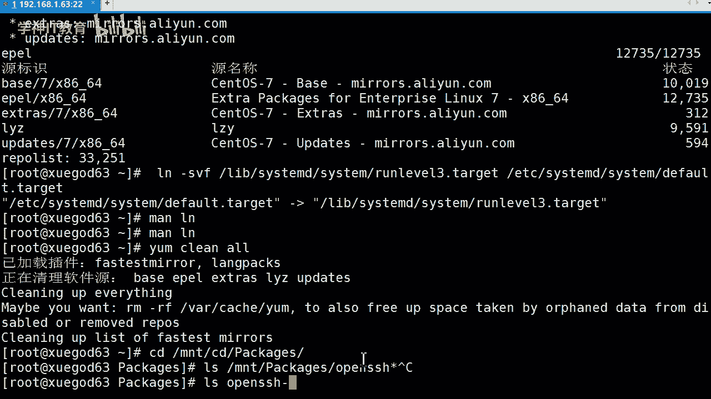
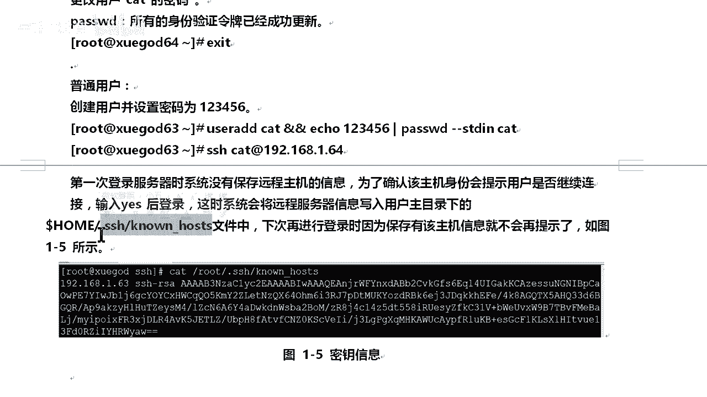

# Linux／Linux运维／RHCE／红帽认证／云计算／Linux资料／Linux教程-2-1-2sshd服务安装-ssh命令使用方法 - P1：2-1-2sshd服务安装-ssh命令使用方法 - 学神科技 - BV1HC4y1h7XG

OK啊，来后我们开始我们开始接讲第第二点的内容。第二点内容第二点内容是什么呢？是SSHD服务安装，还有SSHD的。😊，命令使用方法。OK那么SSHD服你们都知道是什么，对不对？你们也目前也在使用，对吧？

OK那可能你不知道它是什么含义，对不对？行，那我给你们介绍一下SSH是一个协议。😡，他叫什么协议呢？😡，okK它是安全的啊安全。😊，安全效协议。明白吧？它是比较安全一点的，像我们的那个ten料啊是吧？

它就不安全的，是名言前出的。但我们SHH这个传输加密方式就不一样了。OK如果各位同学有兴趣的话，下去可以看一下这个SHH这些加密啊，但我建议你们还是等学完那个加密方式啊，什么其他那些啊。😊。

对象加密啊对吧？非对象加密等等，你再去看一下，比较容易理解好吧。OK那么所以说呢他说的是什么？😊，OK是这一个啊。好，那么说SHH为了建立在应用层是吧？😊，它是什么？是为建立在应用层和传输层基础上的。

😡，安全协议。OK。可能这么说不太明白，对吧？行，那我们来说一说它的作用是什么，它有什么作用。OK首先SSHD这是个服务，在我们是啊在们len里边，它也是个服务。那么在使用SSH的时候呢，干嘛呢？😊。

它其实是使用到SSAP协议，可以用来进行远程控制。我们用到它不就是为了远程控制吗？没毛病吧。OK或者说在计算机之间存属文件。都没有问题，都可以使用它来进行实现。

OK相对比较之前用的tel方式来传输文件要安全了很多。因为天料是使用名文权输吧，SSH都是加密传输的。比如说我要传输一个珠串什么的。😡，对吧。啊，他说我要传输一个密码。😡，中间人儿。

他或取到底是个加密的。USS吧，它是加密的O。😊，好，那么怎么去安装呢？安装也很简单的啊。😡，需要安装OPN SSSH这是个包就行了啊，它是个包主，我把它这个安装上来以后呢，干嘛？😡，就可以了啊。

把这个包安装了，它是个包啊。啊，是是个安装包明白吧？也可以说它是个包主等等啊，它是个安装包OK那么提供服务端。后台程序和什么客户端工具。就是说他有一个服务端，有一个什么。😡，客户端有两个端里边啊。

明白了吧？所以说用来干嘛加密远程控制文件和传输文件，对吧？😡，OK那么它并由由此来代替什么？原来类似服务器那些FTP啊什么ten out啊等等。比如说我FTP是吧，它就要消除文件了吧？

OK ten out呢，我们用用完远程控制的吧？销除指令等等，对不对？OK那么有SSH就是说oppo SSH这个包有这么两工具，它就会实现这两个东西啊啊。😊，这是比较安全一些的对吧？不用用天掉啊。

像我们那个恰效，它也是支持天掉这这一块的嘛，有天掉协议的吧，对不对？okK那么安装包的话，它有4个安装包啊。😊，啊，他是他四个安全包。他需要4个4个安装包，有4个。因为有一些是其他的包嘛。

它里边一个服务嘛，它有这么4个安装包。首先openSAH这个不用说吧，就是这个服务端以及客户端的核心文件OK那么下面这个呢可ent啊就客户端的。好，那么opSAH这个C网的就是服务服务端的，明白吧？

那么这一个呢。😊，SK pass呢是干嘛？是支持对话框。😡，窗口的显示是一种基于X系统的密码诊断工具。我不知道你们能不能听懂啊。😡，okK那么需要我们注意的是什么呢？

这四个包都在我们3WS镜像里边安装就有。😡，很多都是莫兰总上来的啊。😡，这块要知道一下，知道一下就行了。那么我你如何去查看呢？😊，我们查看一下这四个包在哪呢？我们怎么去查看呢？好，这么去查看它啊。😊。

我，我们这么去查看他。😡，首先我们进入这个NNT是吧，OCD拍下去这个包里边。好，回车来，我们去看一下啊，sorry啊呃，我们进入里边了，对吧？我们就不需要这样啊，我们就OPGN吧。😊，对不对。

然SSH。

呃，接星吧。看一下它有哪个包，有这么多个包啊，有分别不同的对吧？OK那么我们主要用到就刚刚我们所说的4个包，对吧？其他那些我们是用不到的，在这我就不给不给你们增加负担，好不好？可以啊。😊，然后呢。

主要我们用到了啊，这个是个包。其他那些就不给你们写了啊，然后我们去如何去安装呢？😡，我推荐是用什么亚码安装，接亚码安装就行了，免得搞那么多的依赖关系啊什么的，对吧？OK我要接亚马。😡。

对吧。看我们就按照这1个就行了。你看这些我还还是没安装的啊，它还是给你们安装的。😊，Yes。只要这个包我们应该是装上了，原来应该就有我看一下他最后装了多少包。你看我们清过我刚刚清除了那个样板的缓存吧。

你看它重新建立缓存呀，对吧？把这些你看就有点慢啊，就有点慢。如果是网络源的话，网络慢的过程当中的话，那更慢一些啊。😡，因为他得去找哪个圆里边有我们装哪个圆的对吧？或者说要不要升级什么的，对吧？

你看有些包是被升级吧，因为我们连接那个什么源备选源吧，有更新的，他会看这个我觉要去装一吧，你看它升级了吧。😡，这个我们原来有了吧，你看被升级了吧，这个我们原来有吧，就升级了吧。😡，对不对？

我们其实这包我们都有啊，我就升级了一下而已嘛。因为我们连接什么被死源嘛，因为没有被死完的话，他肯定告诉你是最新的版本啊。因为我们镜像光盘那个本来就从光盘那边安装了嘛，安装系统的时候，对不对？

所以说跟那个是一样，都告诉你是最新的，没有更新的可用，对不对？OK那么我们去看看。😊。

我们去看一下。是不是在我们光盘里边有的？😡，来啊，老师这边是有1个CD的啊。😊，呃。

O。没有。啊阿PM啊。OK你看到吧？要找到这么几个包，有相关的对吧？有一些依赖的依赖包的是吧？有一些是吧软件包吧，已经安装了等等，都告诉你。😊，对吧他都会告诉你啊。🤧我们这两种方式对不对？😊。

我们这两种方式我们就用用什么用其他其中一种就行了啊。刚刚老师给你们演示了两种方式，对吧？一种是使用IPM包，对吧？把oppo SSA啊H的全部安装，一种呢？是干嘛？😊，接样啊，我们就推荐用亚母啊。

推荐用样么。好，那么最后呢我要确认一下，对不对？确认一下我们安装哪些包呢？😡。

我们安装过哪些包的来。天我们当QA，我们查看所有安装的包。😡，明白吧？那最后呢我们去看看。来。我们直接过滤一下，可以吧？可以来一车。OK这三个主要是三个包我们已经安装上来了，对不对？主要是安装上来。

那么我们要看一下它有安装安装这个包的时候，生成多哪些文件呢？😊，杠QL啊杠QL来回车，它生成了这么多个文件。在哪个目录呢？对吧？有ETCSSH然后呢还有。😊，ECC下边SHHH下边还有一个文件，对吧？

还有这些等等等等啊。😊。

我就不跟你一个一个去说啊，这太时了，对吧？😡，行啊，下来以后呢，来后给你们给给各位粘粘一下啊。😊，这时候我先安装了吧。然后呢我们还有一点要说一下啊还有一点要说一下。

我们说知道了就open SSH配置文件。首先open SSH的话常用的配置文件有两个，第一个是ETC下边的SSH目录下边有1个SSH下划线config和ETCSHHD下划线config这两文件我们是配置的时候经常会用得到。

😊，经常会用得到经常会用得到okK那么SScom这个是吧，它肯定是为客户端的配置的。😡，为客户端来配置的。😡，全球的配置文件对不对？所以呢一般设置与客户端相关的应用啊，应用可以通过这个配置文件来实现啊。

这一个啊，那么SHHD可的话。😡，都能看明白SHD对吧？D肯定是5嘛，对吧？O懂漫吧懂懂漫是我服务的意思嘛？OK。😊，好，那么为这个服务端配置文件对吧？好，那么设置一些服务端相关的。

我们都可以通过这文件去实现。明白吧。🤧O。那么第六个呢，我们要了解一下它的其中脚本，其容脚本是这么样的啊。😡，是这么来的，自动脚板。首先我们scomCDL对吧？中间我们可以加上这这三个参数啊。

比如说re starting啊，stop啊，对吧？ok starting啊，对吧？okK等等等等这些啊这4个。😊，我们其中选择一个每次集型选择一个就行。好吧，然后最后加上我们SSD的服务名称。

就可以对它干嘛。OK对他进行一个管理，好不。😊，这个就比较简单，对吧？ok那么最后一项呢是什么？😡，开机启动对吧？OK我们接着che个compfit SHDR也是可以的。因为它干嘛，它肯定是转到这个啊。

😡，善善责容嘛。😡，这是在6下面执行的嘛，它也自动会转到这一个，你集行这一个也是可以的，其实都是一样的。😡，明白吧。其实都是一样的啊。OK1么我们可以通过什么。😡。

啊，通过这个面料去看一看。

去看一下。看见了吗？😡，我看一下这个所有的开机管理的服务，对吧？我看一下SSSHD这个服务，你看我们其可以管理的到吧，看得到的吧。😊，list unity fellO我们过滤SSD。

再一个我们看一下这个s对吧？

是什么？是开启的啊。你要我们不设置开启的话，那就跟你说不行啊。😡，像这些diable的话就不会开启的啊，enable这些是开启的啊等等，这些都是开启的。好，那么下来以后我们讲讲点什么内容呢？😊。

如何使用SSH远程连接主机？明白吧？为什么我要这样弄呢？来，首先有什么。😡，🤧嗯。有一个方法一。是这样的，是这么使用的啊是这么使用的这么使用的SSH对吧？加上你远程主机的用户名。😡。

这个什么有这些括号的中括号是吧？这叫公中括号吧。😡，有中国号的。我们可以要可以不要。对吧要不要的话，肯定是获许当当前你这个登录这个系统的用户状态。😡，那个用户是什么？我们就用用那个什么身份去执行。

OK但这个软程的服务主机IP啊，这个要加上来好不好？😊，1杠P端口这端口如果默认的话，我们可以不用。明白吧。OK那么当前历上远成另外一台主机的时候呢，如果当前所登录的用户是路ot的话。

当前链接另外一台主机的时候。😡，是吧也是用那ot用户去登录。对吧可以通过啊可以直接使用SSHIP端口就可以了。比如说默认端口的情况下啊，如果说不是默认端口的情况下，我们可以是吧使用杠P来指定。

如果是的话，我们可以用这种方式学干嘛？😡，用这种方式啊就这种方式出远干嘛远程一下就行了。比如说啊我看一下这边有没有通的啊。😊。

嗯，192。168。1。点6是吧，看一下这台主机吧啊，自看是没开机的吧，哎，没开机啊。😊。

没开机干嘛呢？😊，啊，62这台是开机了，是吧？我把62这台给暂停了吧，把64这台开启吧。😊。

啊，把这台开启啊，要拼一下，通了吧？ok这是极简SSH。😊。

把这个IP带上来来回车。😊，他又问你，你把是否把这个啊认证接受呢想活yes的接受啊，而且我还保存到本地，对不对？OK。😡，11密码，对方的密码，对方什么密码啊？绿手的密码，因为你是6册用户码。😡。

ok可以吧，可以。😊，组合上来了吧，谁干了64啊，这台手机啊来我退出一下。😊，就这么简单，是特别好用啊。😡，OK了啊，这些方法对吧？比如说。😊，🤧普通用户对吧？我们用普通用户去登录，对吧？

比如说我创建一个用户簿，密码为123456，对不对？O来，那我就创建一下啊，直接copy一下，好吧。😡，我就不手枪了啊。😊，对，这个右艾我们创建一个tt用户，对不对？要按按，然后这个干嘛呢？这个知道吧？

OK就是前面这个基因分工，有基行后面这个后面这个什么？😊，A口一串数字，然后通过管道传送给什么，给pass word。😡，啊，passW对这个命令接收，对吧？因为它这个选项是干嘛ST啊。😡。

DIM是干嘛的？😡，OK从标准输入啊输出里边获取数据，明白吧？从标准输出里边。获取数据okK你要说白了就是说把这个给他去设置这个用户密码，它本来就是设置密码嘛。OK你没有的话，没有指定这个。😡。

正正确的一个数据流的给他的话，他就让你从键盘输入嘛，对不对？O。😡，就这个意思啊，还是有同学懂的。😊，好，然后呢我们干嘛呢？我们就直接使用什么。😡，用这个命令吧啊，这个是一啊。玩司机。

因为老是机是一环境，好吧。好，O。😊。

来我直前。干嘛演程一下。😡，好，我用什么证据身份呢？ASory。这个密码错了啊，我打错了，123456来。好吧呃，也不正确。😊，他说密码不正确啊。123456对呀，没错，223456好嘞。不对是吧。

不允许是吧，对方面就没听交户对吧？因为那个什么。😡，我是在本机创建的啊，是在本机创建的，是在本机创建的。2。可以啊。呃，这边再推出一下啊。开的中后应该是没有啊，律师这边没有，对吧？😡。

来，我还以为这边有呢，来哟sorry。😊，呃，那我这边就去创建一个吧，好吧，登录一下啊。

登录一下的话，那就干嘛。

来成功吧。来，我这边再试一下啊，用ki这个用户来123456OK可以了啊，就是对方这个没有这个用户啊，必须对方这有这个用户，明白吧？😊。

没事吧。说白了，从这边啊。呃，我这写吧这写吧，一套下来吧，好吧。

因为你对方没有那个用户的话，他可能是不行。因为身份验证啊。

比如说这样子吧，我们用这个root去远成上来这边，对吧？我们就创建这个们用户宝啊，创建这个用户创建，然后呢我们再退出，对吧？😊，我们再退出啊，把这个给你们写清楚一下。啊，给你们写清楚一些，好不好？😊。

Yeah。啊，ok我们来修改一下吧。😊，这样可以吧。OK我们就可以成功了吧，对不对？O那么第一次登录的时候，对吧？他会给你一个密，他告诉你啊，问你你这个密你是否要什么第一次登录时候，对不对？

系统没有保全远程组机的信息嘛，他为了让你确认这个身份，对不对？OK你连接人是谁，他的身份是什么什么，让人工呢还是什么辨认，你是不是要必须要干嘛？😡，要用啊，这样接入是吧，输入这个yes，然后登录是吧？

这时候呢是统会以远程把服务器信息写入到用户加目录里边OK。😊，那么比如说是吧我按照yes之后，它就会这样对对。好，那么它会在哪呢？在你的用户里边。😡，在用户目录里边啊，比如说我去看一看啊。

比如说我去看一看他在哪呢？呃再说吧啊。😊。

都说我就去看看啊，行。😡，不这啊，这看看，然后呢，在那在谁那里呢ho。😡，啊，ca用户是下边，我看一下有没有这个目录啊。😊，啊，没有对吧，认为没有。啊，这64啊。什么玩意儿？这远程上来60吧。

OK那我就不他了吧。😊，OK来我这边。我回到6山里边去看看。不对啊，可能是输错了啊，ho。是OME要cutt。全SSH。啊，这也没有是吧？啊，是个目录对吧？我看一下这个目录目录里边，我看A。哦。

他确实是没有啊，应该是我看一下loot里边有不有。啊，以路团那边为例吧啊。呃，那个路ot。🤧好。路头目录下边有1个点SH对吧？你看这里有啊。😊，你看。这是有一个文件，说白了就是一串必要，明白吧？

谁是哪谁的手机的？😡，这个主机的。他的。明白吧？他的啊，六4的64的主机，你要他什么类型的OK他是谁，对吧？他们要是这个。😡。

比如说啊比如说把我把这个给删除了，好不好？我把它也干掉了，干掉怎么样？我SSH。😡，我再试一下这个行不行，OK他告诉你重新让你确认，因为你没有嘛，让你确认，懂吧？😡，O。yes。

ok我把密码输入输入以后呢，我们退出一下，来，我们再看一下又回来了吧。😊，是不是一样的？😡，好，来注意一下它是不是一样的一样的啊，就这么一个意思啊。O。😊，这个是什么？说白了，它就是基于RSA算法的。

是吧？是一个十分简单的什么熟问实事啊，这个事实的。所以呢将这两。这两个大数相乘十分容易，明白了吧？O你们就去推荐一下啊，去推推啊，能不能看一看能不能把它给弄出来什么的，对不对？😡，O啊。

我这边就不跟你说那个了啊。😊，下来以后我们再说一点呢。呃，方法2，我们还有一个方法2。😊，方火案是什么呀？比如说杠L。😡，对不对？这种。首先是什么？😡，指定登录名称而已嘛？😡。

是不是不是跟前面那个一样的啊，那我就不多说了啊，一样的啊一样的。就是比如这样呃，那我就跟他们演示一下好了，演示一下得了啊。😊。

这边的话演示下得到。OK可以吧，可以。😊，对不对？我看我这天密码输错了啊，输错了，我这不不输了啊，密码输错，看看行啊，这块就。😊。

可以不？啊。

