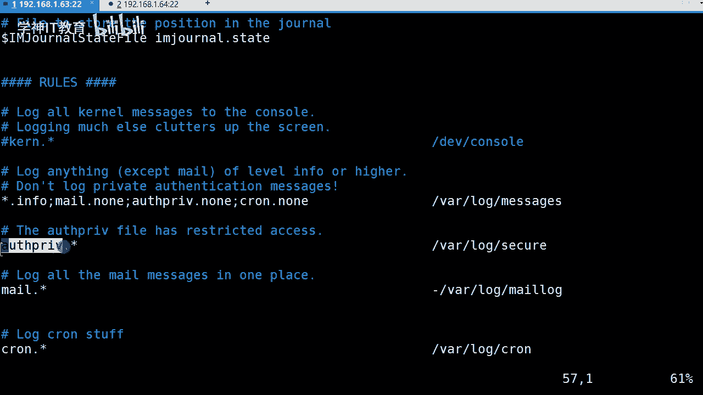
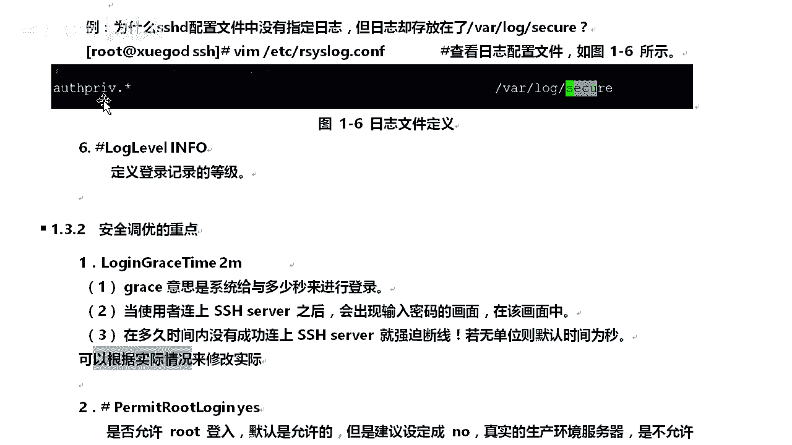

# Linux／Linux运维／RHCE／红帽认证／云计算／Linux资料／Linux教程-2-1-3-SSHD服务配置和管理 - P1：2-1-3-SSHD服务配置和管理 - 学神科技 - BV19i4y1g7XX

好，OK我们开始啊。😊，我们下来的话我们讲讲这个服务。啊，还有一个啊就怎么去管理，好不？第三点，我们去怎么去管理这个SSHD服务的配置以及管理，好不好？行，那首先的话我们来讲讲这一块。😊。

在配置文件当中对吧？前面的井号表示什么默认值在配置文件里边的井号表示一个是。😡，注释也表示什么默认值OK因为他告诉你，默认就是这个我就把它给注释掉，对吧？OK那么这个配置文件在哪呢？

我们主要设置这一个配置文件。😡，针对服务。服务这一块的啊，针对服务这一块的。首先我们讲一下这个端口。😡，这个端口我们怎么配置这个端口呢？第一点啊，我们配置一个端口，我们说说这个port啊，22。来。

我们呃打开一下吧，还是什么呢？我跟你说明白啊。首先第一点呢，我们设置。😡，SSH监梯的端口号。首先这个SSH这个预设使用是什么？22号端口。这个23号也就是说我们默认的嘛，默认端口号嘛，对吧？

也可以使用多个端口号，也就是说把这一项配析文件里边的这一项co比一下，往下边再放一个okK把这个端口改改就可以了。OK你以为我们想开放22号端口和222号端口，那，就是说嘛在它下面多加一项就可以了。

就这么简单。😊，所以呢要后呢我重新启动SSH这样就好了，是吧？建议大家修改的话，这个port number。😡，OK为其他的多考号，为什么呢？防止被人的暴力破解。😡，因为他不知道你啊，你不敢的话。

他一默认就知道是22号，对不对？😡，而且还使用什么root用户去登录OK你一旦获取输入到密码那个步那个步骤OK那他记掉你这个2号是监听的，一般改掉其他的，明白吧？就他们没那么容易发现，对吧？就这意思啊。

okK那我去修改修改吧啊，这样修改呢在ETC下边的SSHSSHD。😊。

Ocom think在这。来，这边有一个默认的吧。是22号吧，比如说我要改为其他的怎么办？😡，O。把这一项。注释打开OK重新使用这一项，我多加1个2OK来。😡，但我告诉你啊。

我这样下来肯定会断开会断开链接的，明白吧？因为一旦混合然后我重启一下，肯定会的啊。不如我这边重启一下，可以吧？OK我重启一下，告诉你断开了。😡，啊，还没断是吧？还不在是吧。啊，他不断。

来看一下还不断是吧，它还没断开是吧？😊，还不到什吗？一般它都会断的啊哦，我明白了，应该我是那个IP tables没关的啊，以前会断的时候是那个IP tables没关掉是吧？它没开启那个就断开了啊。

一一般它这个是不会断的，应该是不会断的啊这个。😊，它会它不会断，它不会断啊，它不会断。😡，这服务不重启了吧。那是大神吧。这不重启了吗？对吧它不断的啊，一般你如说IP table开启的话。

不是你开一下IP table。😡，看下它会不断肯定断的啊，它肯定断。😊。

或者时候把IP换了，它就肯定断了啊，这些等等等等，它都会断。OK这样的话，如果说你重新连接的话，你我告诉你啊，你肯定连接不上。比如说我从64这个连接上来SHHO192。168。12。63，看一下。😊。

OK22号端口连接失败。😡，对吧验证失败。为什么了？😡，我不是哪个端口啊，那干嘛干屁啊啊啊。😡，我可以了吧。😊，okK那啊不接受退出。

就这么简单啊。挺简单了吧。所以改这个是蛮简单的啊，比如说那个我如果才知道他那个干嘛呢？😡。

对吧我如何才知道它是。监听22号端考呢来，我看一下啊，使用这个。那啥。nax呃HTAT这个命令去看干什么杠TU。啊，杠TLUNP啊，这几个选项是多个选项啊，你可以随便指定，对吧？位置随便放都可以啊OK。

O我过滤一下这SIH，你看它监接的是什么？😊。

没毛病啊没毛病。😡，再试一款啊，来，我们接着往下。😊，来我们接着往下啊接着往下。所以呢我们登录的时候是干嘛呢？😡，我们要使用这个这个去登录啊。我使用这个登录明白吧？好，那么第二个是什么？😡。

这会表示什么？😡，监听地址对吧？设置SSD符绑定的IP地址。也就是说00。0。0。0，比如说表示监听所有的地址零表示网段吧，对不对？😡，O。你要呢我们安全建议是吧？

如果说你的主机不需要从公网进入SSH的，比如说就从内网的，比如说我跳板机什么的对吧？OK你就设计监听为你的内网就行了啊。那公网的话，你告诉他，你告诉他I啊，就比如说你你你告诉他IP对吧？

告诉他那些他都连接不上，就这意思啊，因为它。😡，没有先听的啊。你要绑定你要绑定那个IP对吧？因为这个值可以写成本机的。😊，也可以写成所有的。明白吧。OK啊。这个明白了，我就跟你们说一下啊。

在配件文件里面都有啊。😡，你知呢协议版本，我们选择SSH协议的版本是什么？可以选择一，也可以选择2。在深toOSOS5版本的话，我们意测的是什么？仅支持V2版本。因为出于安全考虑嘛，我们还是设置微新的。

😊，知道吧？当然你可以选择旧的啊。这块默认就行了啊，就简简单说几个啊，说一个我用得到了。😡，OK不ho key这个我们指定本机的。利要我们去啊这个什么。比如说设置包含计算机私人密钥的文件。

它这个文件在哪私钥的文件啊，因为它在加密的过程当中会用得到会用到这个文件的。如果你一旦。把这个文件修改了。OK那告诉你加密就不成功了，甚至影响你这个连接啊。知道吧？O。这块的话，第5个。

当有人使用SHH登录系统的时候，SSH会记录什么？😡，和记录你这个信息OK那么这个事时间的话是进入的类型为什么？是这个啊认证啊与认证相关的对吧？😊，OK那么SSHD的服务日志群放在哪呢？在这儿。

OK请问在这个目录啊，在这个文件里边，比如说我们去看看好不好？看一看，然后去看一下这个哎呦。😊，嗯。嗯，去看看啊。看上去看一下，你看有了吧，你看。连接从哪来的？从这来的OK。😡，他的多转号是什么？😡。

是这个它是随机开的啊，他那边是随机开的，到我这边肯定要监听那多少号才行，对不对？22大看。😊，都是在这里面记录的啊，都是在这个文件里面记录的对吧？比如说学员暴力会建立的。

我就看一下这个文这个啊这个路径这个目录下边的这个文件就行了啊。😊，那比如说吧。😡，为什么是吧SSHD的配置文件当中没有指明这个。😡，这个什么这个文件它为什么会存放到这呢？行，我们来看一下这个啊。

在我们的这个日志配置文件里边就有指定什么类型的存放在哪，明白吧？okK我们去看一看啊。😊。

我去看一看，就他这段了。😡，文件里边我们去看一下，看一下哪呢。😊。

来呃，我们看一下这个什么类型的，刚刚我们不想了吗？它设置是什么类型的？来来来来来，我们看一下这是这一类型的对吧？好，我们去找一找这类型，好不好？😊。

这里新在哪呢？O。在这儿。凡凡是这个类型的一致。😡，对吧我不管从哪来。😡，对吧反产生这个这类型的日志，这就认证类型的嘛，然会我们放到这公布里面去，对吧？所以说我们在这配置文件里边。

我们因为这是我们系统给我们调用的，我们直接调用这个就行了，它就会记录到这个文件里边。😡。

懂我意思吧？O。

就这么简单啊。看不难把，那么下来以后呢，还有一个什么？第6个。😡。

log呃log live啊，记录什么定义，记录密制的等级。ok我们等级什么info啊，info info等级。后期我们学到这个日志这一块啊，你就知道infor是什么等级啊。infor是什么等级。😡，O。

嗯，那下来啊我们还有一些给你们讲讲就行了啊。你们要回头的话去看看，好吧。😊，你，比如说。我们这个什么安全条约的重点，对吧？😡，OK下面以下这些都是安全条约的重点，与安全相关的啊。😡，首先一个是什么？😡。

呃。就是一个时间嘛，与时间相关的，登录的时间相关的，对不对？OK他的意思是什么？给就是说系统给以多少秒来的进行登录。但很简单我告诉你啊，你比如说我登录到这个界面。😡。

对不对？oky。😊，好了，我在这边我不输入密码吧，我看一下它多少秒会自动退出吧。😡。

一会的自动废除了啊，说白了就是说当你连接上了这个之后呢，会出现一个提升密啊，对吧？画面在这个当中的话，在多长时间你没有连接上功成功上来的话，那就破影下线了啊。😡，明白吧。如果说没有啊，这个无单位。

那就是默认的啊。😡，明白吧？就默认时间，这这个可以根据你的实际情况来什吧，来去调整它啊，这个去调整它。😡。

对不对？

OK好像默认是多少啊？2分钟吧。那你要等两分钟吗？对不对？哪天你可以设计一下，比如说呃干什么玩一下吧。😊。

就不需要时点时间而已嘛。在哪来来来，我们找找找找。😊，太了啊，你没找着是吧？呃。我还是看一看啊啊，这是大写的啊。😊，OK我们开启一下啊开一下。播就2分钟是吧？😡，行啊，我改个两秒啊，两秒太少了。😊。

10秒吧。可以吗？呃，重启一下啊。行。这边退出一下，重新连系下。啊，算一下吧啊。🤧And。

你看退出来吧。这不是去了吧。😡，就这么有效啊，一设计就有效，我们可以改嘛，对吧？O下面这些都是注释掉的啊，也是默认的。你们调整的时候改改就行啊。O那么这里边是干嘛呢？😡，好。

这一个转型呃这一块是指定什么是否允许root登录。如果默认的话是允许的，但建议你改成什么。😡，设定成no啊，为什么呢？在真正的生产环境当中的话，是不允许root账号直接登录的，仅允许普通用户登录。

又是说我登录以后，我需要用到root用户了。okK我只能够在本系统里边使用数命令来切换。😡，明白吧？这有效的隔隔离了什么危险性。😡，比如说默呃路ot入ot用户每个系统都是。

对吧你们也知道他的系统肯定有一个root用户可以登录，对不对？okK那我就针针对它暴力破解。我知道他的端口OK路ot用户端口IP行，我就暴力破解了。😡，对吧如果说你不允许他这个root登录的话。

这是普通账户。那他这个登啊这个入新键还要知道你这个普通用户账号密码。😡，对不对？这就增加难度了吧。😡，这个账号用户名以及密码对不对？OK是这么一回事啊。😊，然后这个呢。这边是什么？O。

就是说密码验证是吧，大家是需要的，明白吧？所以在显动，你也可以选用yes。😡，OK那么在真正的生产环境服务式上，我们是根据不同安全级别I要求是吧？有的设置不需要密码登录，有这是吧？直接通过密钥来登录的。

😡，对吧OK是可以的啊。😊，好，那么下来这一项呢是吧，是否允许空密码的用户登录呢？默认文豆，你知道了为什么那个比如说我创建的UI呃U。😡。

爱的啊，然后呢我比如说啊创建一个CQ，这个用户存限了啊FDH啊FD对吧行，我不改他密码对吧？okK那我这边登录。😊，呃，FD可以吗？呃，按20168。1点什么631杠P222。OK没有密码的登录吗？

你能登录吗？😡，也登录不了啊。😡，是吧登录个屁都登录不了没密码啊，对吧？不允许的啊。如果说你这下设定个什么winow的话，它就你就可以登录了。Vs啊，你就可以登录了。这个比较危险啊，千万不要设置啊。

这是安全相关的。😡。

は。OK那么啊给你们个实例啊，就是说给SSH添加一些什么警告信息。比如说我看一下这里边。😊。

这个显要在啊EDC是吧？😊。

MOTD这个文件里边这里一点东西都没有，对吧？okK我们添加一下进去吧啊，我们添加一下进去。😊。

我icle一个什么running啊。😡，OK这说明什么呢？😡，给你一段信息，对不对？给你说明一段信息。OK比如说你那个我警告。😊，你已经登录了一台什么什么环境的服务器，对不对？你的所有的行为都会被在啊。

都有人在监控这里是吧？请注意你的什么。😡，请注意你的行为，对吧？有没有见过这情况，下面一个什么监控，你进入监控区域了，是吧？😡，要注意你的形象行为什么的对吧？OK你可以给他一点信息嘛。我O我写手里边。

比如说我这边登录一下。😡，啊，这边登录一下对吧？好，OK密码输入。😊，来，他给你输输出这一块了吧。当然啊你还可以什么？当然你还可以，比如说有颜色的那个是吧，我要调一下颜色，对不对？你是可以的。😡，啊。

看到吧。就是这意思啊。比如说你要写中文的可以吧？可以，比如说艾特一下中文进去，我再给你麻烦啊。😊，啊，对吧我学习中文的吧。首先我给你说一些什么。😊，呃。警告对吧？警告。你以的。进入呃监控。范围对吧？

的请注意。嗯，请注意什么请注意颜值好不好？我这说可以吧，请注意颜值啊。可以吧。来，我看一下行不行啊。😊，有有有有，我登录上来了是吧？😊，来维车密码OK警告是吧？你就监控范围这哈，请求颜值是吧？可以吗？

😊，可以的啊是可以的啊，这没问题的啊，你随便写点进去吧，对不对？OK那这边去登录登录一下就有了啊，就这么简单对吧？好，那么下来有哪宝们显示是吧，上市登录的信息是吧？默认是有的，什么上市登录信息呢？

比如说像这些。😊。

对吧O。来，你上次登录是的什么？从哪台主机进入的？😡，对不对？什么时间登录的，几几月几号的，对不对？OK12月。😡，对吧等等人家6号的什么什么的对吧？OK从这里经登录的。如果说你要把这个选项给去掉。

改号说，sorry啊，改成no，那这块就显示不了了啊，是这么简单。😡。

O那下面还有一个实例是吧？😊，不用说了。我这个远程登录主机，对不对？O远程登录这这台主机里边。😡，看到吧。这是什么？😡，啊，就是说。😡，一些东西啊，对不对？OK刚才给你们显示了啊，那么最后一个是什么？

😊，呃，一般来说的话，为了要判断用呃这个客户端的来源是否呃这个正正常合法的。所以呢我们一般使用什么DISS去反查客户端的主机名。但是通常要在内网互联的时候是吧？该项为no。该上是吧，设置为noO。😡。

但需要设置为noOK那因此连接的速度会更快一些。明白吧？这在是默认的啊，默认是yes啊，就会要判断这是什么。😡，客户端的来源和是否合法的等等的啊，就做这一个就干这个用的。你也认识了没？😡，理解意思了吧。

😡。

。