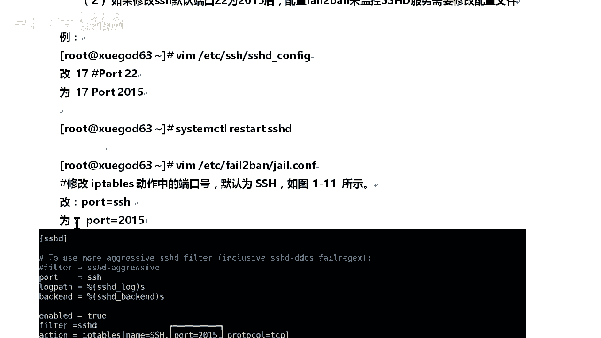

# Linux／Linux运维／RHCE／红帽认证／云计算／Linux资料／Linux教程-2-1-4-SSHD服务防止暴力破解 - P1：2-1-4-SSHD服务防止暴力破解 - 学神科技 - BV1Yz4y1X7B3

来，我们开始我们开始呃呃我们这个1。4的内容。首先SSAD服务这个防止暴力破解这块。😡，有两种方法啊有两种方法。我就快速给你们带过来啊。😡，这方法有哪些呢？比如说。配置安全的SSE服务这块是第一个方法。

首先你的密码足够复杂，密码的长度要大于8位，最好是大于20位吧啊，当然你得记得住。😡，复杂度有什么呢？比如说尽可能有数字大小写、字5特殊字符等等混混合在一块。😡，O然后呢。

第二个我们搜索修改修改这个端口，默认端口，我们要修改一下。然后第三，不允许root账号，直接登录添加普助账号，对吧？设置权root的权权限给他。😡，OK那么我思考一下啊。是否可以禁止录者身份啊。

登录登录的是吧？是否可以禁止路ot身份登录？是不行的啊，你不能完全把它禁止啊，为什么？因为有些程序就是用root去运行的。😡，明白吧？所以说另外我们判断一个用户是不是超级管理员的话，我们看什么？😡。

ID码。啊，当然啊你可以把两个用户，对不对？使用同1个ID可以的。😡，可以的，虽然说他用户名不对，但是。内核系统识别还是很。把你当成管理员了，你知道吧？OK那么第四点呢，不允许这个什么。😡。

密码登录只通过什么认证的密钥来登录系统。😡，O。好，那么通过这个密钥认证，怎们怎么通过啊OK首先我们来试试一遍，好不好？来。😊，我们这边怎么去通过他呢？😡，首先我们说一下这个时间环境吧。嗯，啥情况？

OK首先我们客户端。😡，客户端的IP啊客户端的IP啊，s啊，客户端的IP服务端的IPOK然后呢我们生成一个密钥是吧？然后呢传输到什么服务端里面去，那我们怎么生成呢？首先我们来来来哪块来来这块啊，来这边。

😊。

来这边去生成啊来这边去生成。首先这个命令都跟大家讲过，对吧？OK呀。😊，这多了个空格啊，来回车。多了一个空格，对吧？O来。

。哎呀，我真愁呢。😔，为什么？稍等啊，同学稍微等会稍微等会稍微等会。😊，嗯。O。来，我继续啊。首先的话。呃，我们这边是这么来的啊。😊。

来，我们这边要不要输入密钥呢？你可以输输入你的密码来保护你的密钥等等，对吧？OK在这儿的话，我们先看一看这个路径，对不对？它路径保存在哪，保存在这儿来，我们直接维修。如果说我被保存在这儿，行。

你可以改改什么的，对吧？OK。😡，我就。哎呀，这这。Yeah。嗯。打开吧啊。SH啊，然后K啊。我就。来，我要不要要不要呢？换一个这个路径呢？要不要换OK我可以改了。我企实在这个输入。

比如说放ETC下边呃，什么什么位置对吧？可以改啊，就果说我不要它了啊，我删掉删掉，我就按按ctrl和退个键啊，OK只样我就保存默认就行了。那要不要输入密码了，保护你的密钥呢？要果说一旦输入密码的话。

你在使用的时候，你肯定要输入密码啊。那么在这我们就直接回车了啊，不给它密码了，好不好？😊，不给他密码了啊，来，我直接回车回车了以后呢，接下来我继续回车啊，来可以了。😊，我才生成了一个密钥，对吧？行。

那我就干嘛呢？😡，呃，我这样吧，我进入到里面那个目录里面，对吧？我看一下我看一下有没有他说的那个OK。😡，说是这个吧，SASA对不对？OK是没有问题的。证明已经成功了吧，成功了是吧？然后呢。

我再发布过去，对吧？我们怎么发布过去呢？😡，我们要发布到我们的服务端里边，对吧？OK我要发布到服务端里边。😡，没有。呃。又掉了一个来我车。啊，不是多少多少是吧。呃，完是改改吧啊。😊，为了方便啊。

方便还是改改吧。啊，直接注示掉吧。就让他走模样吧啊。OK可以啊。😊。

来这车OK可以了啊。😊，yes啊，然后呢把密码输入进去。行，okK没问题。没问题以后呢。😡，我干嘛呢啊。是不是可以了，用要登录了，我把那个密码给禁止，是不是可以了，这不是一个安全性了？😡，对吧O。😊。

行，就这么简单啊，今天复制过去的话还是有其他的啊，有其他的方式的，对不对？😊，有其他的方式的。对吧。O。来，我给你们站出来啊。😊，反正是蛮简单的嘛，对吧？再改啥啊。然后呢。哎呀，这IP啊。

你后呢这边是什么？😡，下来这边是啊还没有改回这个端口的，对不对？老师这边刚刚改了，为了后期那个演示方便一些嘛，我就改回来了嘛，对吧？这笔记里面是还没还没有操作那些改改回来的啊，你们要注意一下。

要加一个什么杠P的啊，杠P的。😊，再换点刚屁一下啊。这块要。刚屁一下，知道吧？啊，干P吧啊，有。刚是啊啊啊啊。可以吧，我去赶我是赶回来了啊，我是赶回来了。😊，O。😊，这两种方法啊这两种方法。

如果坚持的不用2号的话，你就得这样啊，那我这边改回来了，我就就不跟你们说了啊。下来这边的话有了有了。😊，都一样啊都一样，别问就行，好不好？😡，OK了啊。😊，行，那下来以后呢我们怎么做呢？😡，这都已经。

都已经操作好了，对吧？我们可以基于密钥来登录了吧。😡，再说这是免密来了，对不对？OK那么第三呢，我们是通过什么？😊，嗯。我就受不了他了啊，你等会啊。O来。Yeah。我们这个啊。32我们是干嘛？

通过开源的防御软件来实现安全，明白吧？符合分用脚板啊，那么优点是干嘛呢？使用简单灵活，功能还强大。那么实战背景是什么呢？来，我告诉你一下啊，实战背景是这样的。

首先最近我们公网网站一直是被暴力破解我们的SSHD服务密码，对吧？虽然说还没有暴力成功，对吧？但是会导致我们的系统负燃很高。😡，那么原因是什么呢？在暴力破解的时候，我们系统不断的去认证。

从而增加了系统的额外开销，才有最后干嘛导致我们访问公司网站的速度会很慢，因为主机的机源嘛都用在认证了，懂了吧？所以说会很慢的嘛，对吧？

OK那么然而我们可以通过什么photo band这个程序可以监视你的系统日志是吧？然后匹配连进是是否错误是吧？正确的搜索说理啊，它是用正则或者说匹配去匹配你的日志。OK然后执行什么相应的屏蔽动作。😡。

对吧一般它是使用防火墙去对你这个暴力破解来源的IP进行一个屏蔽，一旦发现屏蔽啊，而且还可以给你发送一个email来通知管理员OK干嘛非常实用，功能强大。要吧？那么简单来说的话。

它的功能就是防止暴力破解OK工作的原理是通过分析一定的时间内的相关服务日志。将满足了动作。2。将满足动作的相关IP利用这个IP tables加入这个drop这一列。😡，啊，OK那么一定的时间内就进止你。

😡，OK而且禁止是什么？把所有的端口你是永远都说我进去的，进去的时间内，你是把我端口所有的端口我主机你都访问不了，明白吧？😡，OK那么重启IP这有时的话，那时候吧所有的ja的会标会从置吧。

这个要注意一下啊。😊，因为还是加入到这里边的啊，那么下来也有我去怎么去下载这个软件包的f片这个软件包okK从这下载啊。😊，从再序下载。从这边去下载啊，来我们去看看，照进去去看看啊。

Fll bit啊f bit fell bit。慢啊，我的网络慢啊，okK进入来了吧。😊，比较简单啊，所有比较简陋的一个站点。但我们可以从中可以去找一些啊。比如说从这边是吧，当load的对吧？

在这里边不有一个当load的吗。😡，O我去点击去下载它是可以啊，比较慢啊，哎出来了啊。😊，去下载这个里边对吧？你看这下载哪一下，下这个啊，在哪呢？对吧？在这里有，对不对？ok现在有0。9了，对吧？😊。

你们可以去下载一个尝试一下。OK这边以上的话，我们是展示发动面的源码下载啊。那么我们以下呢使用什么？使用的是亚文方式来安装。😊，可以吧使用压门方式来安装说。用压门方式去安装，我们比较简单一点吧，对吧？

反正它就是一个程序而已嘛，我们使用亚模尽尽可能用亚模吧啊。首先它有一个要求啊，有一个要求，要求是什么？😡，你说要要求你安装这个拍thon环境，这个单巴环境并小要大于2。4。要大于2。4啊要大于2。4。

OK我们可以用这个python杠V这么一个命令去看一下你是否安装了python。

对吧你是否安装了派手呢？😡，对吧okK来，我们看一下。😊，O。😊，7。5系统的默认带的是什么？2。7。5这个版本足够强大了吧啊，版本足够更新了啊，是7。5啊。😡。

71。5对吧？OK那么第二步呢，我们使用E去安装就可以了。E安装什么？OKEP药源，我们在EP医药源里面找。那么这一步我们已经安装好了，对吧？呃，我们这一步。😡，2。已经。操作了。用超呃。这么说吧啊。

已经安装好了EP12元。这一步啊可以忽略啊忽略。我可以忽略他啊。呃，直接忽略吧。啊，有有有有有有有。先那个忽略啊，那昨天找了接忽略掉行。😊，嗯，这忽略掉啊这忽略掉，这步可以忽略。okK那么下来以后呢。

我们就开始。😊，干嘛？现在我们可以开始什么按照方 bit啊啊翻图片啊，翻图片来，我们可以。😊。

安装。你们是在跟刘老师一块操作吗？还是在看呢？😡，如果跟操作的话，我可以慢一点啊，我可以慢一点。如果说看完再慢操作的话，那我就老师放快一点速度了啊。😡，🤧う。O再看是吧？行好嘞，OK先看后操作，对吧？

😊，OK可以啊，好的那么现在我们就安装好了，对不对？你看他安装是什么版本。😡，OK已经安装好了是吧？0。9个版本。那我官网的网站的新版本是多少呢？😡。

一般的话，你看。

啊，9。4对吧？0。94对吧？0。94我们是0。97OK可以啊，这版本是足够新的，我们可以够用了，对吧？OK那么下来以安装好了。😊。

我们就说明一下它的配置文件，好不，它的配置文件在哪呢？😡。

🤧来在这V2我们安装到哪了EDC下边的f啊。😡，发到这下边有这么多个文件，对不对？😡。

OK。啊，这有个说明啊。我们说明一下。好了啊。😊，呃，这边来我们看一下。😊，来，我看一下到底是包含什么内容呢？比如说啊我们这个。😡，Oh。第一个我们是什么动作的文件内含了默认的文件，对吧？

是内部就包含有了啊，是IP table已经这个啊。😡，MAIL这个等的动作配置对吧？😡，okK就是说我们的一个邮件以及我们ICs等等这些动作的一啊一些动作相关的文件定义的啊。因下来这一个是什么呢？啊。

这个点com点com这个什么定义f的日日配置日日是吧？以及的一个文件配置。好ok那么。😊，这一个。😡，点B的话是吧？这条件文件O条件文件啊。😡，条件文件。呃，条件文件条件的目录吧啊，写目录。😊。

或者说节文件吧啊，这文件应该是个。😊，虽说它是个目录啊，完是描述目录录的，好不好？😡，条件都目录啊。以呃以条件。相关的。目录啊，因为内涵呢文件呢是什么过滤日志关键内容的设置，这样理解吧？😡。

OK那么接下来这这一个呢。😡，是什么？主要是配置文件模块化，主要设置启用这个动作啊，对吧？服务以及动作这个阀值等等等等。😡，OK。啊。对，wind里边是没有一个文件夹这么一个一一个说法的啊。

是没有文件夹的这么一说法，明白吧？没有没有啊，完完全全是没有的。😡，没是吧，是没有的啊。因为目录是文件吧，目录是说白了就是文件的路径用上，你可以这么理解它完全正确啊，完全正确。好。

那么下下来我们就应用实例啊，给给大家讲个实例好不好？讲完我们就开始下课。OK吧。好，首首先我们设计条件SHH远程5分钟内。😊，啊，远程登录5分钟内三次密码失验证失败。okK禁止这个用户登录一个小时。

那么一个小时。最会自动解除OK用户可以重新登录，对吧？那么因为这个动作文件对吧？OK有录径给你们啊，以及这个日志日呃日志匹配这个文件，对不对？安装后是默认的存在，所以说基本不用我们做任何的修改。😡。

是不是特别简单？OK我们主要修改的设置的是只有一个。😡，OKZZAIL这一个文件啊，点com这个文件。😊，我们启用SSHD服务的入制分析，对吧？指定这个动作的。罚石即可。太简单了吧。😡。

不知道你们做起来简不简单呢，对不对？😡，OK啊。来，那么首先我们说明一下这里面的情况吧。

这里啊我们打开去看一看。讲一讲啊。打开这个文件，首先我要去看一个，我们会用得到了吧啊dealt这不对对吧？😊，哎，我们不要它啊啊，打开这个看看啊，这一个看看来，我们这边现在在使用的这个这是什么呢？😊。

啊。这一块的话是全局的啊全局什么是全局，什么是啊那个局部呢？你们要分清楚，这是全局的全局的是吧？首先第一块这个是忽略IP的列表，这是表示忽略了IP列表。😡，我忽略是什么？忽略是这一个啊，是我回放地址吧。

我们忽略的啊就不对它进行任何任何操作了，就忽略了对吧？O不受限制。好，那么下来呢呃再讲一个比较常用的啊。😊，这个啊。半time啊半time半 time这是什么？就屏蔽的时间对吧？单位为秒ok。😡。

那下来这个犯了看什么呢？是干嘛？这个是时间段没超过规定的次数会被禁止掉。😡，OK600秒是多少分钟，告诉我。来600秒是多少分钟告诉我。😡，啊，十分钟对吧？OK10分钟。O ok ok ok好。😊。

刚好4分钟对吧，所以呢。在干嘛呢？在40分钟内吧，大概就是这意思的啊。6。😡，为什么？😡，在这个时间内，超过规定次数被就会被禁止掉。OK然后呢，最大的尝试次数啊， sorry以啊，不是啊，对。

试试上啊最大的尝尝试次数啊，最大的尝试次数OK然后呢下来我们再讲一个，一会我们就开始实战，一把就。😡，就够了啊。OK这边。😊，OK这是什么？就日志的修改检测资质。OK它有三种啊。

我们用的是out啊 out啊。😡，okK我们用的是out这一个。好，那么首先我们下来要添加什么内容呢？来。😊，啊，我们配置一下吧啊，配置一下呃，我们从哪配置呢？我们从SHH。😊，D这块配置啊。哎，对。

就完这儿啊，我们来我们找到这儿在它SHHD这块，我们如下啊我们添加什么内容呢？我就快速一点了啊啊快速一点的话我就。😊，叫你什么了？啊，我就。啊，这块的话我们可以直接。呀。为什么这样子对我呢？啊，来。嗯。

什么情况哦，他比较错是吧？我就需要复制一下好不好？😡，我就直接复制一下了啊。😊，呃，可能这么复制会出问题。对吧。呃，来对，就这样啊。我就这按一呀，这个我们就。去掉啊，这些要去掉有有问题啊。

我copy这有问题。来，我们把这些不必要的去删掉它，好不好？不必要那些我就删掉它了啊。嗯，来呃，为了快速吧，对吧？我就。😊，快速删掉他了啊。嗯。嗯。这有啊。哎啊，他是在这儿，对吧？😊，ok啊，来。

我直接把它删掉啊。😊，把它干掉。因为为什么我要干掉呢？本来是注册的，为什么要干掉干掉他呢？因为我我会担心啊，他那个支付串会出错啊，所以说还是把它干掉吧啊，我还是把它干掉，这什么意思呢？😡。

这一块啊你可以随意设置啊，一个邮邮箱这一块你可以设计一下啊，邮箱这一块你可以设计一下。就说白了就一个报警啊啊，这块你可以设计一下。那么这一块的话，我可以啊来，我我回到这边给你们说一下啊。😊。

回到这边给你们说一下。嗯，今天我回到这里跟你们说啊。😊，这还是蛮简单的啊。就这么止步。这跟你们解释过了，对吧？OK它有这么三种。好，那么下来的话，我们针对于单个服务的设置。因为这是全局的嘛。

OK这是针对我们单个的啊单个的这设置的话和全局是吧？O冲突的话，比如说我全局设的一一啊一个我这边这个单独服务这边设置一个一模一样的。ok那就冲突了，冲突了怎么办？那肯定是什么？😊。

是服务的优先值大于全局的啊。😡，为什么？😡，OK我可以这么跟你说，凡是有全局的，有局部的设置的话。😡，你都是什么？如果一旦冲突了。😡，哪个生效的范围越小，最终越生效。明白吧，明白意思吧。😡。

如果说有全局和局部的设置一模一样冲突了，那么我告诉你。😡，都是以哪个生效的范围越小。😡，哪个就月就最终生效，明白意思吧？那我问你全局的生效是整一块的，那么局部的就是他这个单单项的服务的。

你觉得哪个生效的范围越小，肯定是服务的嘛。😡，O你吧。在linice里边基本都是这样的啊，就很简单，我们的那个什么。😡，我们能设置网关的吧。

我在网卡里面设置到它是最终是什么生效那个网卡的OK那我在那个文件里边全局的文件里面设置的时候，它是全局的吧，所有网卡都能使用的对吧？那最终哪个生效呢？肯定是那个单独那个配置网卡里面文件那个针对于生效。

对不对？😡，就这么一回事啊。OK那么下来这边呢是干嘛呢？我们在这里边啊下边去插入下应内容。首先第一个内bel的这个O是我激活这一项啊，O那么过滤的规则O名称是什么？我们对应在这一个目录里边。

下面有这么一个文件O对吧？有这个有这个文件里边会指定O我们直接写SSHD就行了。😊，OK那么动作相关的是什么？这是动作相关的对应的文件。比如说在这里这录里边有一些文件去定义它的啊。

要么我们什么用IP tables。😊，这一块去对它进行一个监测啊，去对他一个动作，去对他进行一些动作，对吧？ok那么下来这边呢是设置你的啊文件发送给你的报警人的啊，发送给你报警人的。

比如说我就这一边我就改改啊。😊，啊，OK我觉可以从这边去改一下你这个报警员，你要吧。我给你群里把它保保存默认就行了啊，这是你的是吧？邮件OK然后呢，在这边的话干嘛？😡，检查你的日志对吧？你日志在哪？

我要检查哪个日志呢？我从哪个日志里边去找一些数据去进行核实，进行检查。😡，OK那么在这个位置。对吧我们肯定是要做一个针对于登录的文日志文件，对吧？😡，O。好，那么这里写了SSHD服务的日志文件是吧？

默认为什么？😡，这不对啊，默认是这一个了，我们改掉插入了重新插入，我改成这个就行了啊。好，那么下来以后我们设置一些什么？5分钟内三次验证失败，禁止这个IP访问主机一个小时配置是往这三项加入就行了。

主要三项生效的，就是这么三项限定，这才是真正的限定啊，OK禁止用户一个小时吧，3600秒okK这5分钟内出现了规定的次数就开始工作是吧？300秒，明白吧？300秒，对不对？

OK这个是是不是跟这个是一样的啊？OK是一样的啊。😊，好，那么下面三次验证失败是吧？它最大的什么尝试次数嘛，OK就差不多这个意思啊，能理解吗？😊。

好，那么下来以后呢，我要干嘛呢？啊，我用端口改回来了，对吧？因为为什么呢？我要提示你啊，上面我改过端口，对吧？我下边下面你在做的时候把端口改改好不好？因为它这端口指定SSH，那么SSH里边指定要是什么？

它默认是22号端口啊，22号端口，这个要改。如果不是的话，你就得把这个端口改改了啊，改成22就行了，好吧？😡。

改成你的哦，sorry，改成你的最终那个端口就行了，理解我意思吧？😡。

O所以说在做之前把东西我改回来啊。😊，避免那些不必要的麻烦吧。好，那么现来我们就开始启动吧，对不对？我要开始启动这个启动卡了啊，哎呦，sorry，我怎么这鼠标问题嘛？总是那一个的啊。好，OK启动成功。

启动成功了以后呢，我再对它进行一个开机自动启动。😊，好，来A车。OK可以了，对吧？😊，嗯label是吧？好，那来我们测试一下。首先的话我们来清空一下这个日志，清空一下这个日志啊，这种是清空日志啊。

你只有一个从立向，对吧？因为前面是空的嘛，空的从立向到这个软件里边，那它就是空的。😡，对吧你不你不要直接V幕掉啊，你不要直接RM调，因为M调，你再创建这个也是可以清空。

但是它的权限以及等等是一些原数据吧，它会改变懂吧？所以呢你直接再清空一下就行了啊，尽可能不要去删除再清建这样因为原数据会改被变了啊，会变变了OK那么下下来以后，那们查看一下SP table的规则，好吧。

杠什吧。😡。

杠O杠小是NOK来回车。😊，他是不是多了1个FFB。😡，F啊 sorryry啊FF two B这么一条这这么一条是吧？OK。😡，作为一条这么一张表，OK这么一张表，对吧？😡，啊，这一条件啊这一条件啊。

😊，OK增加了这么一条是吧？😊，好。那下来以后呢，他是。原本是这种的啊。好，那么来我我跟紧说啊。😡。

我跟你说来怎么去做呢？我给你们写一下啊，它在IP透里边是会增加了这么一条这么一条件啊，增加多一个规则嘛，多一条规则。原本呢是默认是没有的啊啊。

比如说来我来在64这边看一下IP table是的IPT有IPTABLES。😊。

好，OK来杠L杠N。😊，多来告诉我一个2个3个，对吧？好，这边呢OK一个、2个、3个、4个。😊。

没事吧。好，没事以后呢，来我们开始测试了吧，我们开始进行测试阶段了吧啊，测试完了就可以了啊。来各位同学坚持会见证实际的时候了啊。好，行，我们来SSH。😊。

192。168对吧？点1。63来，我们继回车。🤧啊， shitt还有这个啊没没没调整回来是吧？OK我们在这边故意输错一次啊啊啊。😊，哪去了？し。啊，他这边密样。啊，我应该恢复一下环境才对啊。😊，啊。

这边没好对吧？😡，隐密的。呃，直接把它删除吧啊。😊，我先盘它删除吧，rootot用户里边的点SSH啊，我删除一下啊我删除一下在这个。哎呀，不对啊。哎啊这边啊。不是这个不是这个。

他那个他那个是放哪个路径来着？😊，我想想啊。Yeah。呃，我想想。就已经清除掉了那个免密了啊，刚刚出现一个免密的状况，我们清除掉对吧？OK我这边直清除掉了，清除掉了以后呢，我来我这边重新登录一下，好吧。

重新登录了。😊，OK随便输错，一一次。OK两次。O。啊，已经出来了，对吧？这因为这边我已经有一个有输入过一次吧，刚刚啊有有错过一次吧，因为10分钟以内吧，对吧？一次啊，这个我就直接退出了吧，我没输入。

对吧？OK两次3次OK那我这边。😊，说错了吧，对不对？好，我们重新这边再干嘛，再往成一下。😊，告诉你22号端口连接失败。连接失败了吧，连接失败就这么简单，对不对？OK那么我这边来我我回到这边。

我去看一看啊。😊，去看看。okKIP games这个规则里面我们去看一看啊，看一下来。😊，看到什么？这台主机的吧。😡，OK因为我这边有那个什么有有这个了吧，对不对？刚刚我就有有了这个啊，我微微夫快照啊。

我应该微夫快照给你们讲的才对的啊啊，我就应该有了这个吧。😊，它会送解释的吧，对不对？对应的IP是它好吧？所以说它它默认解为这个。如果说你把这个去掉了，它就会显示IP的啊。😊，就这么一个意思啊。😡。

所以说他是。给你做下一个域名解析了吧。OK我们看到了吧。😊，哦端口这项项表示端口，我要进止你哪个端口呢？O全部丢弃丢弃的，对吧？😡，re rejectject啊 rejectject这个干嘛？

我丢弃你的包进到我这边，我全部丢弃了，我不接收，我不给你回响应包，什么都不不要。因为d的话，最后也给你回响应包啊。因d的话，这个是允许的啊。😡，这法的话是干嘛？这法是给你拒绝的，要这个。😡，2。🤢。

那价条的话是干嘛？是兵器，丢器是什么东西呢？😡，就告诉你，比如说你追一个追追你对象是吧？OK你跟人说啊，大声跟他说是吧，向他表白了，对吧？OK这时候他跟你说做法的意思是什么呢？就是他跟你说，我拒绝你。

我不能跟你来往，我不能跟你处对象，对吧？OK。😡，这就兵弃啊，所以了，这就拒绝你对吧？丁弃呢是什么？就你刚才告告白了以后呢，他也不说答应你okK也不说拒绝你。😡，啥我都没回你。😡，OK这叫丢弃，知道吧？

没给对方回任何一句话。😡，这丢弃。啊，懂我意思吧？就大概是这么一个意思啊。所以说呢你觉得呢丢弃你对吧？如果说拒绝的话，对方肯定认为你有是拒绝了。那丢弃的话，你就不知道对吧？心里想，哎呀，他是拒绝我呢。

还是干嘛呢？还是在等我什么呢，对吧？😊，那你你就你就难搞了，对吧？这时候不知道该如何下手啊，是这意思吧？OK好，那么下来呢我们来看一下它的一个状态啊，看一下它的状态。

来他一个photo band杠这个countt啊，看一下他这个客户的状态来。😊，我们看一下有一啊，就证明什么正常的吧？具体的对吧？如果是零的话，就证明没成功了啊，这一就表示成功了啊。

我们看一下它的状态对吧。😊，好啊，我这边给你。😊，测试这块啊，给你们讲一下。

明白吧？这故输错密码啊，在64上面登录啊，要这边重新登录一下OK。😊，ふ。什么鬼？这什么鬼啊？啊，可以啊，来就这么简单啊，让我们回到这个63。😊，啊，在雪盖的路山上操作啊。查看啊。编后呢是干嘛？

我可以看到这个IP啊，如果说没有音频显示的话，才是有这个IP的啊。OK我建议你们做完以上的实验，然后恢复一下快照，对吧？保存快照时候，我们恢复一下，okK再做这个实验啊，老师就是没有恢复快照，我们要吧。

😊，好吧，你没用的啊，它建的是什么？他建的是你IP，你换个IP你就可以了啊。所以说你换用户是没用的，它来源是IP和端口，你知道吧？😡。

这我跟你说，别说什么。😡，你你你你你别说是吧。😡，别说你这个22号端考的，我就是给你个什么。😡，我给啊，比如说我压问一下啊，干嘛意思打。😡，对把HDDP8哦，sorry。😡，OK。

我跟你说个80多口你访问不了。😡，甭管他是IP不IP的啊。O。😡，好了啊，我这边我就来我启动一下这个服务对吧？😡，okK我启动了吧，来后我看一下这个动口启动了没有启动了吧。好。

那我这边来是UROK我杠大I对吧？11929168。1。63来回车。😊，O这呀随便下了吧，有有成功吗？没成功吧。😡，他会给你发回的资是吧？😡，43吧。对不对？你也访问不了，它进的是什么？进的是端口。

是所有的端口，你明白吧？😡。

能那你个意思吧。😡，啊，这搞粉啊，那我们下边查看的是什么？😡，OK看一下是有没有工作啊，这是我们这要看他有没有工作了。具体我要看了一下呢，看这一项啊，K我们可移它到SSD的对吧？如果被禁止的话那。

显示这个IP的表没有成功对吧？如果是零的话就没成功，我们这边显示什么？一OK这是它的状态，知道吧？好，那么下来的话我们再看一下这个服务吧。我们还有一个命令叫什么？我们看它的服务。😊。

服务人在哪？在这。😡，啊，SSHD啊，因为这边呢我们有禁止1个IP对吧？有禁止1个IP如果多了IP会会在这边进续显示啊。😊。

OK这块明白吧？😊，理解啊理解理解。😊，啊，都快11点了，对吧？我们抓紧了啊，我们抓紧。😊，OK那么下来以后呢，来我们需要注意的地方。是什么了？来ok就这么一点点，讲完下课。😊，对我来看一下这个日志啊。

我们来看一下这个范合图变的日志，好不好？它本身范号图变这个服务本身的意志啊，我们来看一下在哇下边。😊。

来他看到没？办了1个IP吧，要吧？从你的IP来信息对吧？SHD来用那个IP对吧？OK警告一次啊。OK这没了，到这咔给你卡掉了。😊，你白意思吧。对，相当于防火墙的拒绝啊，只不过是自动的自动给你拒绝的吧。

不用你去挨个挨个去分析日志，完了以后再去做那个做等等等等对吧？那么需要两点啊，另外是什么需要两点，后期如果说我们需要把IP tape清空或I重启以后，也能把这个重也要也需要把这个重启一下。

这是第一点O那么第二点，如果说修改了这个端口以后那么f to配置的那个监听端口，我们也需要修改它文件啊，就很简单。比如说这样。😊，啊，比如说这样啊。😊，去把它多少修改一下。比如说这边改了那个22号端号。

对吧？打个比方说啊，我就不修改了啊，比如说这边修改了，对吧？不然这样OK重启了以后呢，来我们这边要修改一下。😊，修改哪个呢？来，我们看一下把这一个修改吧。刚刚一开始跟你们说了吧，对吧？

一开始我就开始跟你们说了，这个要把这个给修改掉，好吧，你看哪个呢？哎有有有有有有有啊哦O okOK把这个啊，他默认是用这个的啊，我们直接修改掉就行，明白吧？修改掉这个端口。😊。

明白意思吧？😡。

好，okK这边还有一个啊对，还有一个问题，这边要修改啊。😊，这里边还有个端口。😡，这内目是吧？OK还有协议是什么？这是定义协议的啊，因为他要IP内时的规则，要通过协议去判定，对吧？

OK就是说建OK这边也还需要改改啊，就改这么两处就可以了啊，或者说我就改这么一处就可以啊，这个不用改也可以啊。😊。

来吧，okK最后我们冲启一下就可以了。要吧OK。有不理解了吧？😡，啊。OK没有的话，我们开始总结一下啊。首先我们今天讲了什么内容呢？😊，学习为lin服务这个啊前期的环境我们准备是吧？搭建3个S7环境。

要再来呢我们还讲了什么SSHD服务安装以及SSH命令的使用方法。要呢再来还讲一个SSHD服务配置以和管理。最后我们还讲了一个服SSHD的服务，防止暴力破解。😊，对吧一个是利用我本身的去防止暴力破解。

就涉及一些密码程度呀，对吧？那个复杂复杂度对不对？😡，okK还有别的对吧？那些什么啊乱七八糟的啊，一些服务啊安全这块相关的对吧？啊，密钥认证啊等等，对吧？都是通过这个SS服务内部去调整的。

那么第二个我们是讲来靠外边的一个软件，开源软件去实现开软件搭配我们的IP tables去实现这个对来源主机的暴力破解，进行一个禁止拦截，对吧？😊。

OK我们今天讲了。😊，也差不多对吧？各位看一下有没有什么问题可以提出来的。😊。

怎么说来着？开了。