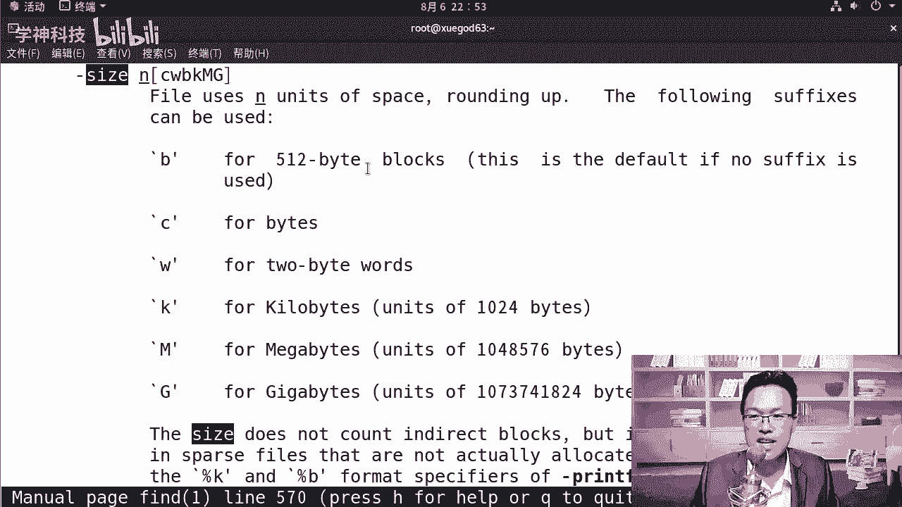
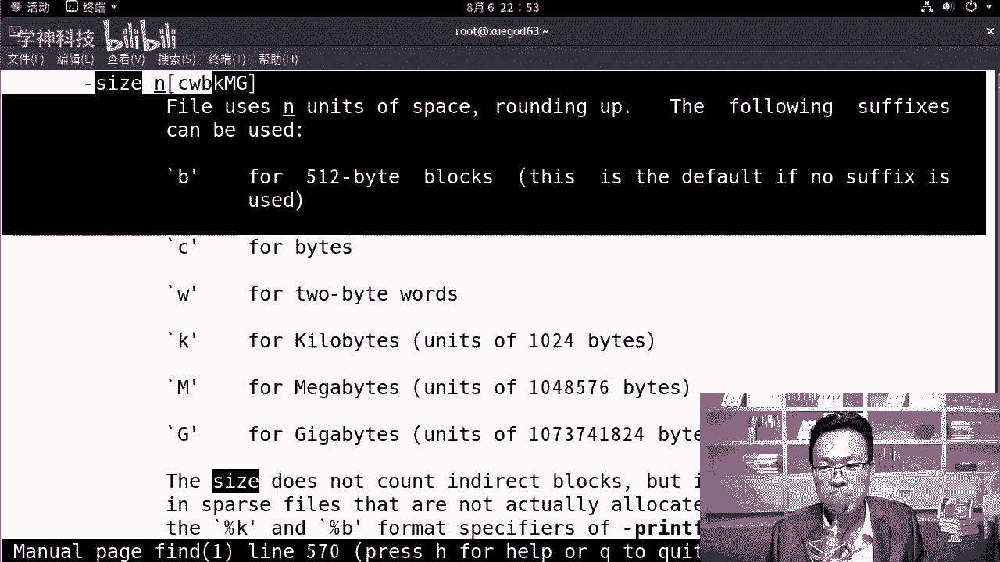
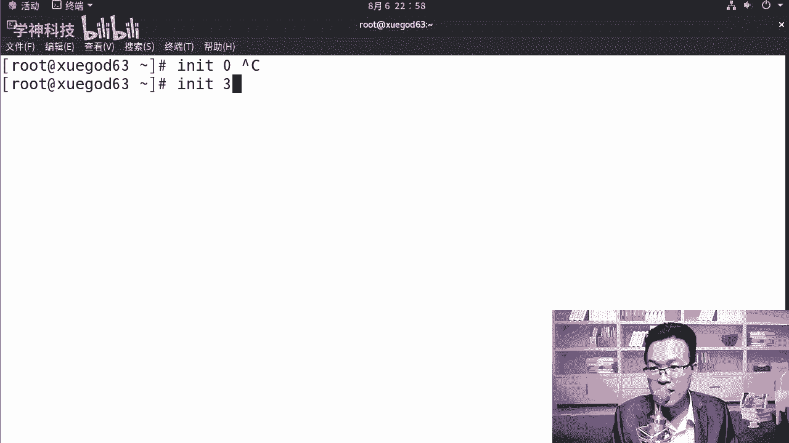
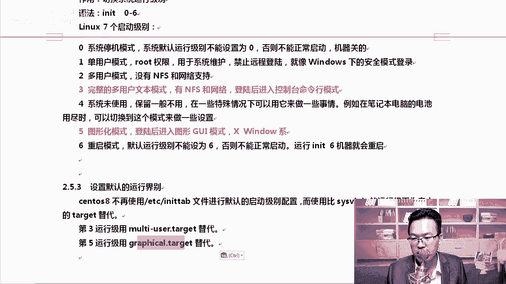
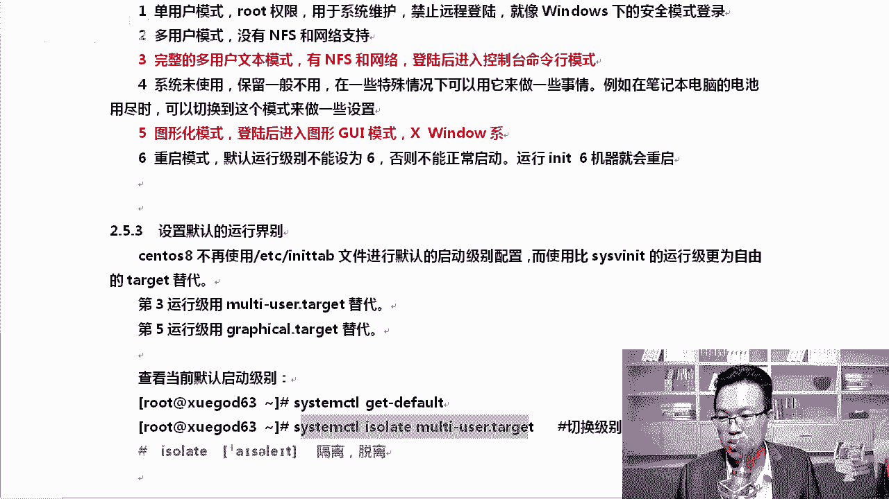
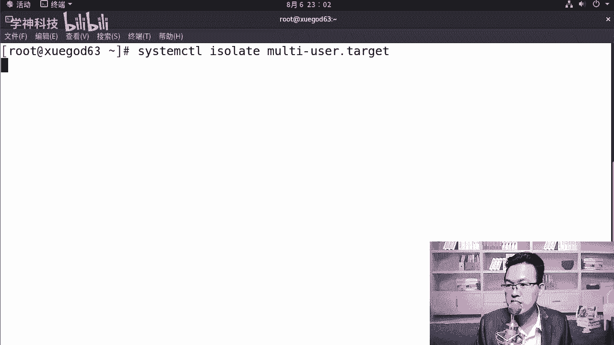
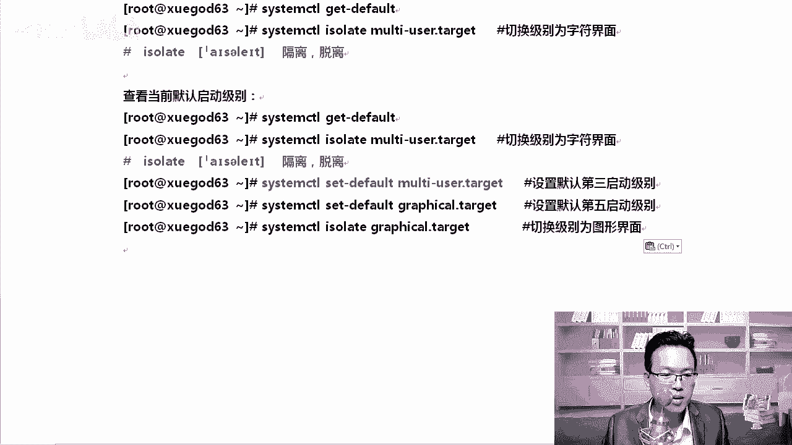
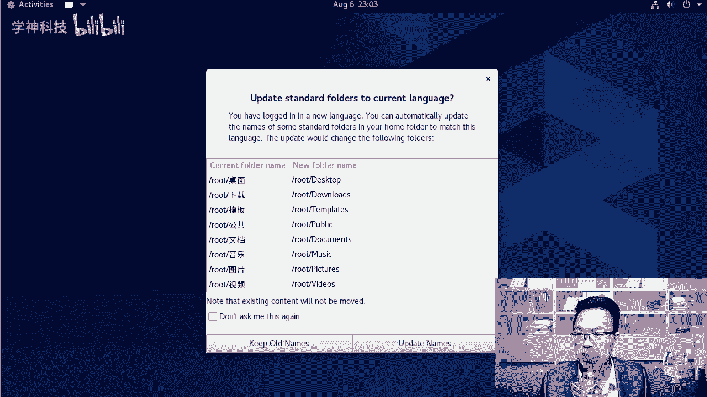
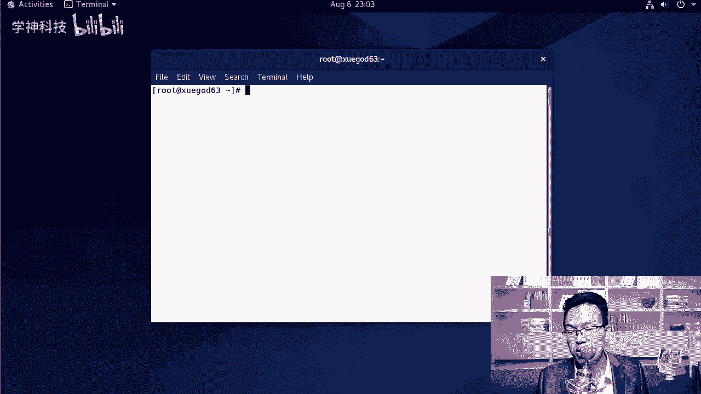
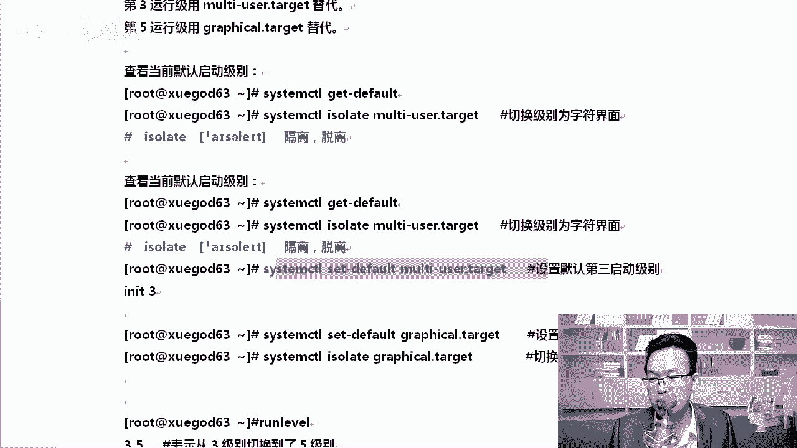

# Linux入门教程：P10：帮助命令与开关机命令及启动级别

## 概述
在本节课中，我们将学习Linux系统中的帮助命令使用方法，以及常用的开关机命令和7个系统启动级别。掌握这些知识是进行系统管理和日常操作的基础。

---



## 帮助命令的使用



当我们在使用Linux命令时，如果不清楚某个命令的用法或参数含义，可以通过帮助命令来获取信息。

以下是三种获取帮助的常用方式：

1.  **`man` 命令**
    `man` 是“manual”（手册）的缩写，用于查看命令的详细手册页。例如，查看 `find` 命令的手册：
    ```bash
    man find
    ```
    在手册页中，可以使用上下键翻页，输入 `/` 后跟关键词（如 `/size`）进行搜索，按 `q` 键退出。

2.  **`-h` 或 `--help` 参数**
    许多命令支持 `-h` 或 `--help` 参数来显示简明的使用帮助。例如：
    ```bash
    find --help
    ```
    或
    ```bash
    ls -h
    ```
    如果 `-h` 无效，可以尝试 `--help`。

对于初学者，建议跟随系统教程逐步学习，效率更高。`man` 或 `--help` 更适合在已知命令基本功能但忘记具体参数时进行快速查阅。

---

## 开关机命令

Linux系统提供了多种方式来实现关机和重启。记住一种最常用、不易忘记的方法即可。

以下是常见的开关机命令：

*   **`shutdown`**：功能强大的关机命令。
    *   `shutdown -h +10`：系统在10分钟后关机。
    *   `shutdown -h 23:30`：系统在23点30分关机。
    *   `shutdown -r +5`：系统在5分钟后重启。
    *   `shutdown -c`：取消预定的关机或重启任务。
    *   `shutdown -h now`：立即关机（需谨慎使用）。

*   **`init`**：通过切换运行级别来关机和重启。
    *   `init 0`：关机。
    *   `init 6`：重启。

*   **`reboot`**：重启系统。
*   **`poweroff`**：关机。

最常用的定时关机命令是 `shutdown -h`，而 `init 0` 和 `init 6` 因其简单直接，也常被用于立即关机和重启。



---

## 7个系统启动级别


Linux系统定义了7个运行级别，代表系统不同的运行状态。可以使用 `init [级别号]` 命令进行切换。

各级别含义如下：




*   **0**：关机。
*   **1**：单用户模式。此模式拥有root权限，无需密码即可登录，常用于系统修复（如重置root密码）。
*   **2**：多用户模式（无网络文件系统NFS支持）。
*   **3**：完整的多用户文本模式（有网络支持）。这是服务器最常用的运行级别，登录后进入命令行界面。
*   **4**：保留未使用。
*   **5**：图形界面模式。带有桌面环境，适合桌面用户。
*   **6**：重启。

默认运行级别通常为3（服务器）或5（桌面）。例如，从图形界面（级别5）切换到文本界面（级别3）可执行：
```bash
init 3
```
切换后需要输入用户名和密码登录。从级别3切换回图形界面可执行：
```bash
init 5
```

---




## Systemd系统下的运行级别管理（CentOS 7/8）

在CentOS 7及更新版本中，采用了Systemd初始化系统，不再直接使用 `/etc/inittab` 文件管理运行级别，而是引入了“目标”（target）的概念。

新旧概念对应关系如下：
*   运行级别 3 对应 `multi-user.target`
*   运行级别 5 对应 `graphical.target`

以下是常用的管理命令：



*   **查看当前默认目标**：
    ```bash
    systemctl get-default
    ```


*   **设置默认启动到文本界面（级别3）**：
    ```bash
    systemctl set-default multi-user.target
    ```

*   **设置默认启动到图形界面（级别5）**：
    ```bash
    systemctl set-default graphical.target
    ```



*   **在不重启的情况下切换到文本界面**：
    ```bash
    systemctl isolate multi-user.target
    ```




*   **在不重启的情况下切换到图形界面**：
    ```bash
    systemctl isolate graphical.target
    ```



*   **在文本界面下直接启动一个图形会话**（需在root用户下）：
    ```bash
    startx
    ```
    执行 `startx` 与切换到级别5的区别在于，`startx` 会在当前文本登录会话中直接启动图形窗口，无需再次登录。

可以使用 `runlevel` 命令查看之前的和当前的运行级别。

---



## 总结
本节课我们一起学习了Linux中的关键基础操作。我们掌握了如何使用 `man` 和 `--help` 获取命令帮助，熟悉了 `shutdown`、`init`、`reboot` 等开关机命令，并深入理解了从0到6的七个系统运行级别的含义与用途。最后，我们还了解了在CentOS 7/8等使用Systemd的系统中，如何使用 `systemctl` 命令来管理对应的“目标”（target）。这些知识是进行Linux系统管理和维护的基石，请务必熟练掌握。