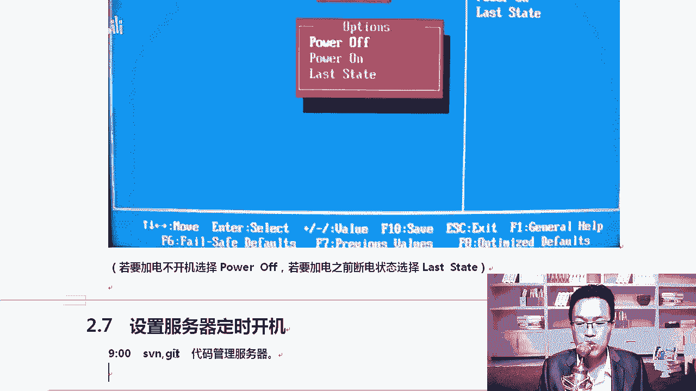
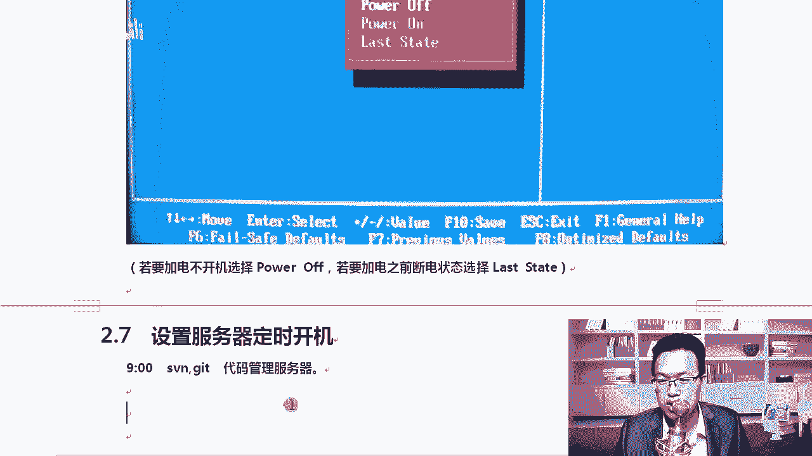
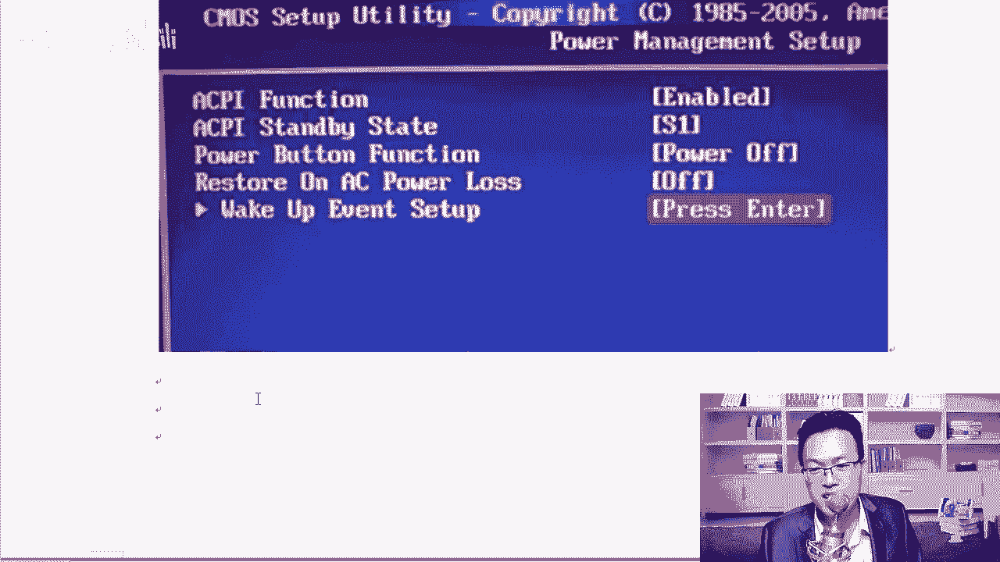
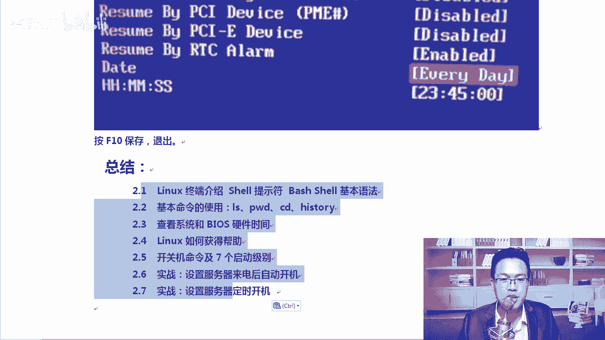

# Linux运维实战：P11：5-实战-设置服务器来电后自动开机与定时开机 🔌

在本节课中，我们将学习两个实用的服务器硬件管理技巧：如何设置服务器在断电恢复后自动开机，以及如何设置服务器定时开机。这些是数据中心和日常运维中常见的需求，能有效提升管理效率。

## 概述

我们将通过进入服务器的BIOS设置界面，配置相关选项来完成这两个任务。这些设置不依赖于操作系统，属于硬件层面的功能，因此适用于各种Linux发行版和服务器型号。

---

## 设置服务器来电后自动开机 ⚡

上一节我们介绍了课程的整体目标，本节中我们来看看第一个实战项目：设置服务器在电力恢复后自动启动。这个功能在拥有大量服务器的IDC机房中非常有用。想象一下，机房意外断电后恢复供电，如果每台服务器都需要手动按下电源按钮，将是一项极其繁琐的工作。通过BIOS设置，我们可以让服务器在检测到电源恢复时自动开机。

以下是配置步骤：

1.  重启服务器，在启动初期按下特定按键（如 `Delete`、`F2`、`F11` 或 `F1`）进入BIOS设置界面。
2.  在BIOS菜单中，找到并进入 **“Integrated Peripherals”**（集成外设）或类似名称的选项。
3.  在该菜单下，寻找 **“Super IO Device”** 或包含 **“Power”**、**“ACPI”** 字样的设置项。
4.  找到名为 **“Restore on AC Power Loss”**（交流电断电恢复后行为）或功能相似的选项。
5.  该选项通常有以下几种模式，请根据需求选择：
    *   **`Power Off`**：电源恢复后保持关机状态，需要手动开机。
    *   **`Power On`**：电源恢复后自动开机。
    *   **`Last State`**：电源恢复后恢复到断电前的状态（如果断电前是开机状态则自动开机，如果是关机状态则保持关机）。这是比较智能和常用的选择。
6.  保存设置并退出BIOS。

> **小提示**：此功能在个人台式机和部分笔记本电脑上也支持。你可以尝试拔掉台式机电源线，进入BIOS进行上述设置，之后插上电源线，观察电脑是否会自动启动。

---

## 设置服务器定时开机 ⏰

上一节我们解决了断电恢复后自动开机的问题，本节中我们来看看如何让服务器在指定的时间自动开机。这个需求类似于我们希望办公室的服务器能在每天上班前自动启动。由于定时开机时操作系统尚未运行，因此这个功能同样需要在BIOS中配置。

以下是配置步骤：

1.  进入服务器的BIOS设置界面。
2.  寻找 **“Power Management Setup”**（电源管理设置）或 **“Advanced”**（高级）菜单下的相关选项。
3.  找到名为 **“Wake Up Event Setup”**（唤醒事件设置）或类似的子菜单。
4.  在该菜单中，找到 **“RTC Alarm Resume”** 或 **“Resume By RTC Alarm”** 选项，将其从 **`Disabled`** 改为 **`Enabled`**。
5.  启用后，会出现日期和时间设置项。你可以设置一个具体的唤醒时间，例如：
    *   **`23:45:00`** 表示每天23点45分自动开机。
    *   部分BIOS还可以设置具体的唤醒日期（如每周的某一天）。
6.  保存设置并退出BIOS。

> **扩展知识**：在“Wake Up Event Setup”中，你通常还可以设置通过其他方式唤醒电脑，例如：
> *   **`Resume By USB Device`**：通过USB设备（如移动鼠标）唤醒。
> *   **`Resume By PS/2 Keyboard`**：通过按下PS/2键盘按键唤醒。
> *   **`Resume By PCI/PCI-E Device`** 或 **`Wake On LAN`**：通过网络信号（魔术包）唤醒。这可以实现远程开机，非常方便。

---

## 总结

本节课中我们一起学习了两个服务器硬件管理的实战技能：
1.  **设置来电自启**：通过BIOS中的 **“Restore on AC Power Loss”** 选项，配置服务器在电力恢复后的行为，实现自动化运维。
2.  **设置定时开机**：通过BIOS中的 **“RTC Alarm Resume”** 选项，让服务器在预设时间自动启动，满足规律性的业务需求。

这两个功能都是直接在硬件层面进行配置，独立于操作系统，是运维人员需要掌握的基础技能。请务必将操作要点记录到你的笔记中，并在实验环境或确保安全的情况下进行实践，以加深理解。