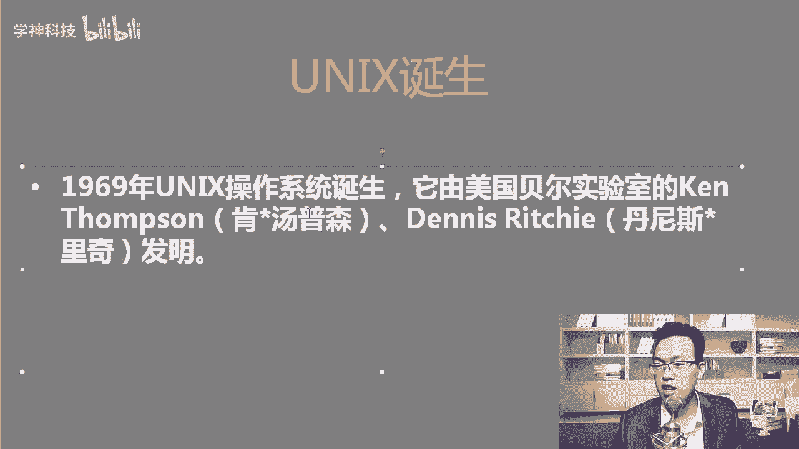
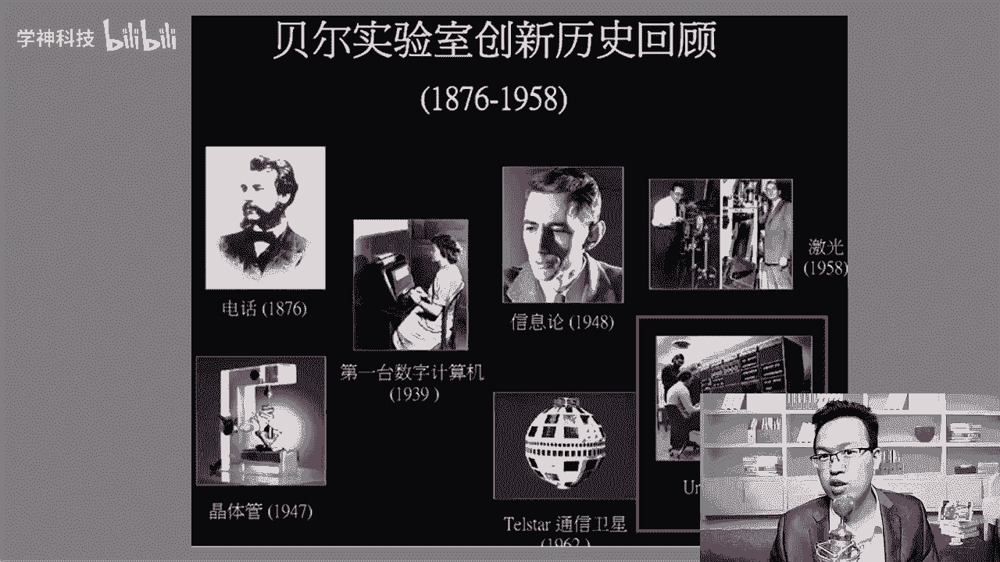
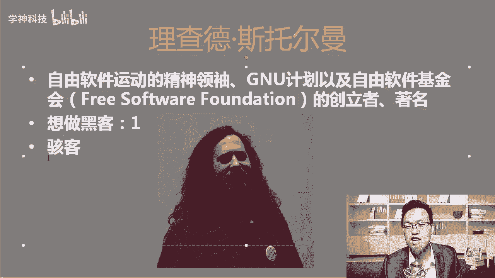
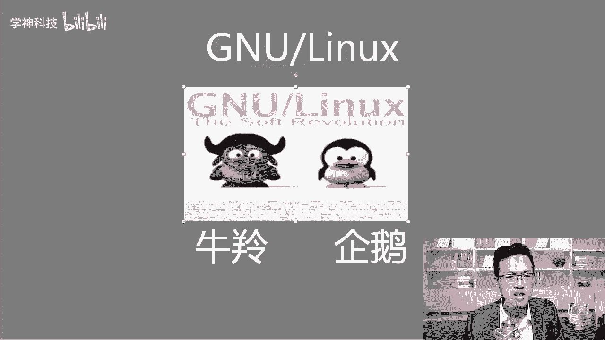
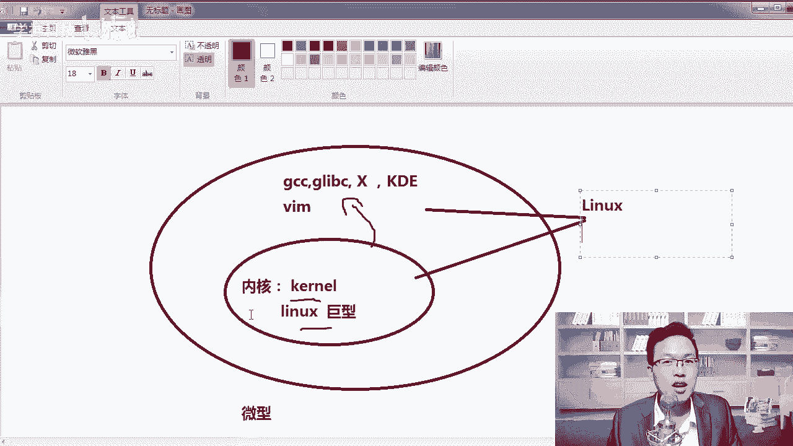
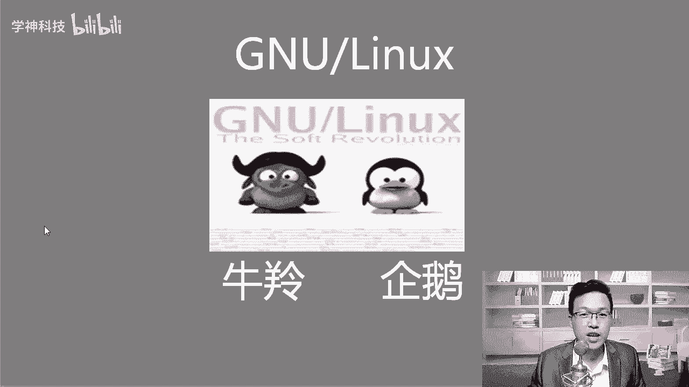

# Linux云计算入门：1：Linux发展史 📜

在本节课中，我们将要学习Linux操作系统的起源与发展历程。了解这段历史，有助于我们理解Linux的设计哲学和它在当今技术世界中的重要地位。

## Unix的诞生

上一节我们介绍了课程概述，本节中我们来看看Linux的源头——Unix系统。Unix系统诞生于1969年，由美国贝尔实验室的肯·汤普森和丹尼斯·里奇共同创造。

贝尔实验室在历史上非常著名，许多重要发明都诞生于此，例如第一台电话、第一个晶体管以及第一台数字计算机。

除了创建Unix，这两位科学家还在1972年创造了C语言。随后，他们使用C语言重写了Unix系统。最初，Unix是用汇编语言编写的，而汇编语言与硬件紧密相关，导致系统在不同硬件平台（如英特尔和AMD的CPU）上的兼容性很差。C语言具有跨平台特性，用C重写后的Unix系统移植性大大增强。

## Unix的开源与“百家争鸣”

为了让更多人使用Unix，开发者选择了开源。开源是一种有效的推广手段，类似于后来的安卓系统。在开源后，许多机构和公司开始使用并修改Unix，其中著名的版本包括加州大学伯克利分校开发的BSD系统。

然而，到了1990年，Unix的版权持有者AT&T（朗讯公司）意识到了Unix的商业价值，开始起诉包括伯克利分校在内的许多厂商，要求支付版权费。这导致基于Unix开发新系统变得困难，也为Linux的诞生创造了契机。

## Linux的诞生

当Unix的使用因版权问题受限时，技术社区需要一个全新的、自由的操作系统。Linux的诞生主要依赖于两个人的贡献。

第一位是理查德·斯托曼，他是自由软件运动的领袖，也是GNU计划的创始人。GNU计划的目标是创建一个完全自由的操作系统。GNU这个名字的含义是“GNU‘s Not Unix”，既表明它与Unix不同，也暗含了对Unix后期闭源行为的回应。

第二位是林纳斯·托瓦兹，他开发了Linux内核。内核是操作系统的核心，负责管理系统的硬件和资源。当时，GNU计划已经开发了许多操作系统所需的组件（如编译器、函数库、桌面环境等），但唯独缺少一个成熟可用的内核。

林纳斯开发的Linux内核（一种宏内核）与GNU组织的软件组件相结合，形成了一个完整的、可用的操作系统。这就是我们今天常说的“Linux”系统。严格来说，“Linux”指的是内核，而完整的操作系统应称为“GNU/Linux”。

这种组合迅速获得了社区的认可，并在全球开发者的共同努力下不断发展壮大，形成了如今庞大的Linux生态。

## 核心概念与总结

本节课中我们一起学习了Linux的发展史。我们来回顾几个核心概念：

*   **Unix**：现代操作系统的先驱，由贝尔实验室在1969年开发。
*   **C语言**：由丹尼斯·里奇创建的高级编程语言，其跨平台特性 `printf("Hello, World!\n");` 对操作系统发展至关重要。
*   **GNU计划**：旨在建立一个完全自由的操作系统，提供了除内核外的大部分组件。
*   **Linux内核**：由林纳斯·托瓦兹开发的操作系统内核，其版本号遵循 `主版本.次版本.修订号` 的格式，例如 `5.10.1`。
*   **GNU/Linux**：指结合了GNU软件和Linux内核的完整操作系统。

总结来说，Linux并非凭空出现，它站在巨人（Unix）的肩膀上，融合了GNU的自由软件理念和林纳斯的工程实践，最终在开源社区的滋养下成长为支撑现代互联网和云计算基础设施的基石。理解这段历史，能帮助我们更好地理解和使用Linux系统。