# Linux教程：P3：CentOS 8操作系统安装 - 前期准备工作 🛠️

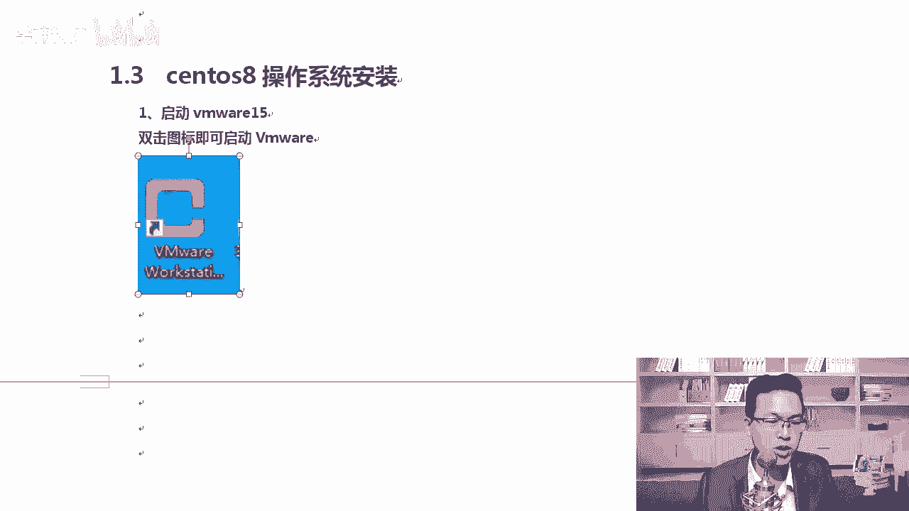

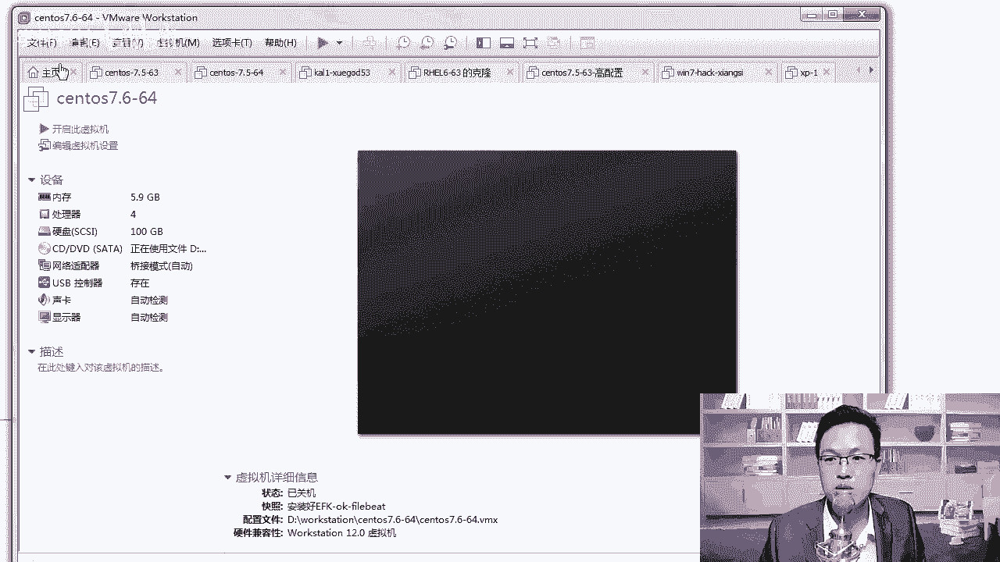

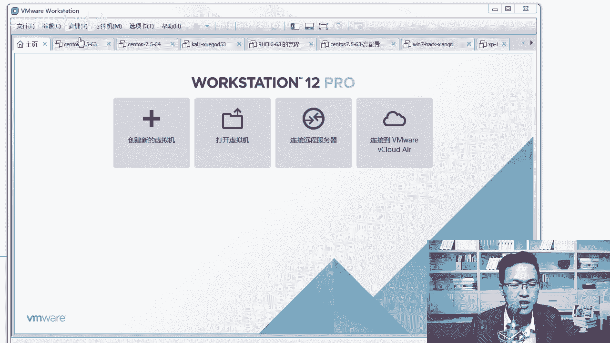

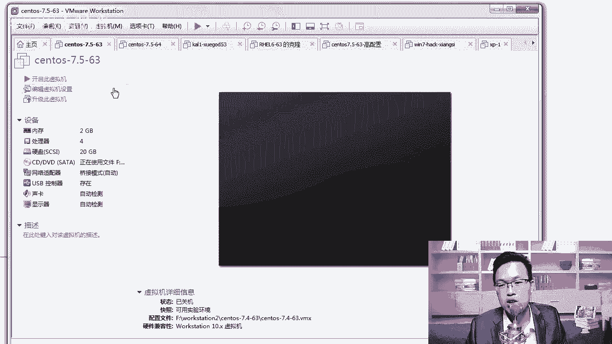

在本节课中，我们将学习如何在VMware虚拟机中安装CentOS 8操作系统。首先，我们需要完成一系列前期准备工作，包括创建虚拟机、配置硬件参数以及解决可能遇到的常见问题。本节内容将引导你一步步完成这些设置，确保后续安装过程顺利进行。

## 启动VMware并创建新虚拟机

首先，你需要启动VMware Workstation软件。在桌面上找到VMware图标并双击启动。启动成功后，你可以通过点击“主页”上的“创建新的虚拟机”按钮，或者通过菜单栏的“文件”->“新建虚拟机”来开始创建过程。

## 选择虚拟机配置类型

在创建虚拟机的向导中，你会看到两个选项：“典型”和“自定义（高级）”。为了获得更精细的控制，建议选择“自定义（高级）”安装方式。VMware Workstation 12和15版本在此处的配置步骤基本相同。

## 选择操作系统安装方式

接下来，在“安装客户机操作系统”步骤中，建议选择“稍后安装操作系统”。虽然你也可以直接在此处加载CentOS 8的ISO镜像文件，但选择稍后安装可以让我们更灵活地配置其他参数。

## 选择客户机操作系统类型

在“选择客户机操作系统”步骤中，需要指定要安装的系统。Linux有许多发行版，例如Red Hat Enterprise Linux (RHEL)、CentOS、Fedora、Ubuntu等。CentOS是RHEL的社区免费版本，两者在命令和使用体验上高度兼容。对于本教程，请选择“Linux”->“Red Hat Enterprise Linux 7 64位”或类似选项。即使你的VMware版本显示为RHEL 8 64位，选择RHEL 7 64位通常也能成功安装CentOS 8。

## 命名虚拟机并选择存储位置

为虚拟机起一个易于识别的名字，例如“CentOS8-192.168.1.63”，其中包含系统版本和计划配置的IP地址。**切勿将虚拟机文件存储在C盘**，因为虚拟机文件体积较大，容易占满系统盘空间。请选择一个有足够剩余空间的其他磁盘分区，并创建一个专门的文件夹来存放。

## 配置处理器和内存

处理器配置取决于你物理电脑的CPU核心数。对于大多数笔记本电脑，选择“处理器数量”为1，“每个处理器的核心数量”为4（或根据你的CPU实际核心数设置）即可。内存方面，如果你计划安装图形界面，建议分配至少2048 MB（2 GB）内存。如果仅使用命令行界面，分配1024 MB（1 GB）或512 MB也足够。你可以通过拖动滑块来调整内存大小。

## 配置网络类型

网络连接类型有三种主要模式：桥接模式、NAT模式和仅主机模式。为了模拟真实的服务器环境，方便后续学习，建议初学者选择“桥接模式”。如果你的网络环境（如某些校园网）做了MAC地址绑定，导致桥接模式无法获取IP，则需要选择“NAT模式”。

## 选择I/O控制器和磁盘类型

I/O控制器类型保持默认的“LSI Logic”推荐值即可。在“选择磁盘类型”步骤中，虽然最新版本的VMware可能推荐“NVMe”，但为了与后续Linux磁盘管理课程（磁盘设备名称为`sda`、`sdb`等）保持一致，**请务必选择“SCSI”类型**。NVMe是一种更新的、速度更快的存储协议，我们会在后续课程中单独介绍。

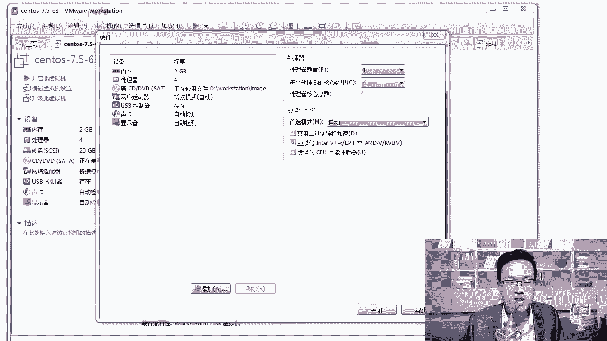

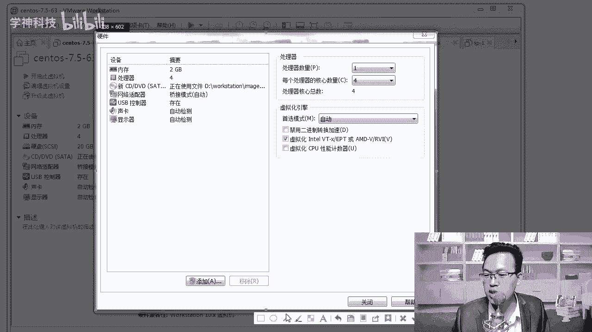

## 指定磁盘容量

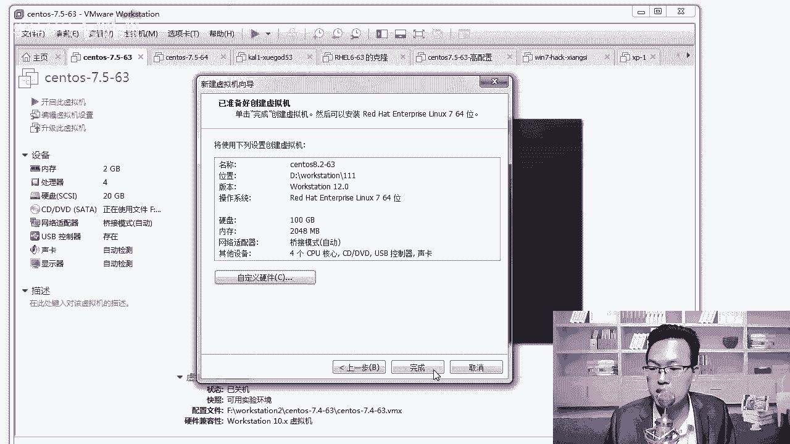

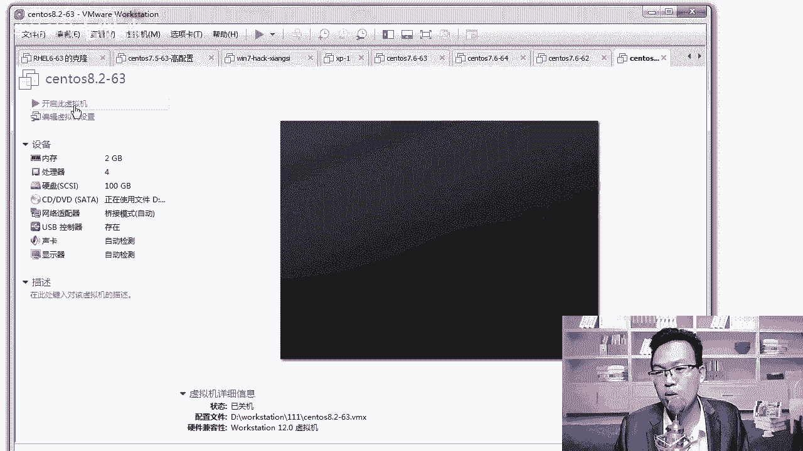

为新虚拟机的磁盘指定容量。建议分配100 GB，这能为系统留下充足的空间。如果物理磁盘空间紧张，也无需担心，**关键是一定不要勾选“立即分配所有磁盘空间”**。这样，虚拟机文件只会随着实际使用量慢慢增长，而不是立刻占用100 GB的物理空间。磁盘文件可以选择存储为“单个文件”。

## 自定义硬件与加载镜像

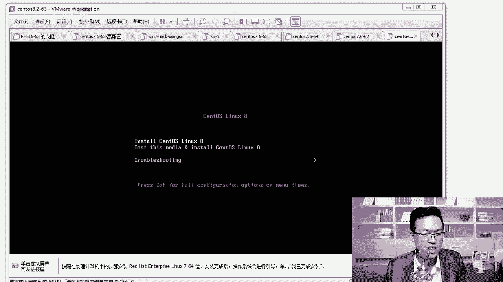

在完成向导前，点击“自定义硬件”按钮进行最后调整。以下是需要检查或修改的几项：
1.  **移除不必要的硬件**：例如“打印机”通常没有用处，可以移除。
2.  **加载ISO镜像**：选择“CD/DVD (SATA)”设备，在右侧选择“使用ISO映像文件”，然后浏览并选择你下载好的CentOS 8.2 ISO文件。请确保勾选了“启动时连接”。
3.  **启用虚拟化**：选择“处理器”选项，在右侧务必勾选“虚拟化 Intel VT-x/EPT 或 AMD-V/RVI”。这对于后续学习Linux KVM虚拟化技术至关重要。

完成所有设置后，关闭自定义硬件窗口，并点击“完成”以创建虚拟机。

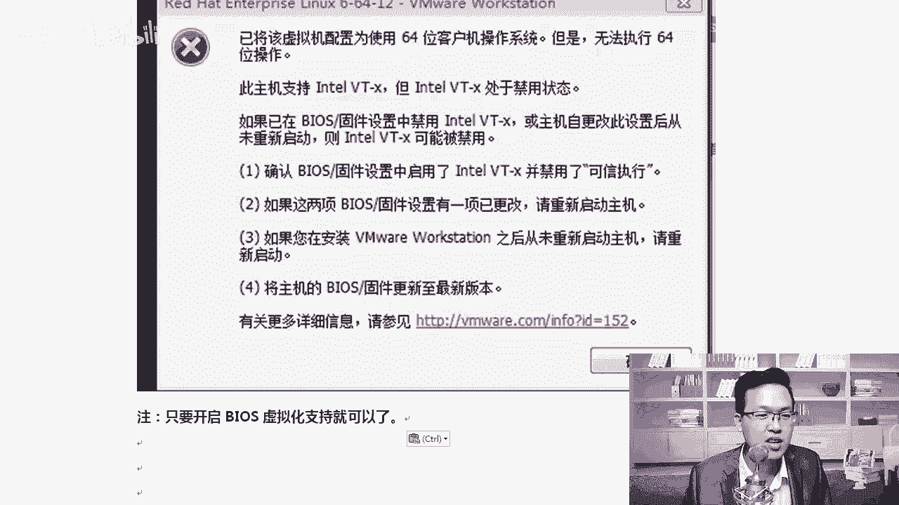

## 解决“Intel VT-x 被禁用”错误

首次启动新建的虚拟机时，可能会遇到错误提示“此主机支持 Intel VT-x，但 Intel VT-x 处于禁用状态”。这意味着你需要在物理电脑的BIOS/UEFI设置中开启CPU的虚拟化技术支持。

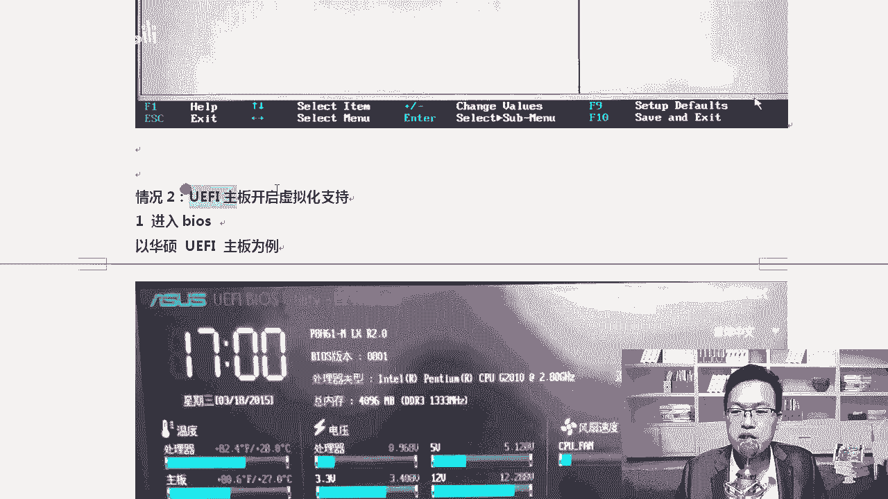

以下是通用解决方法：
1.  重启物理电脑，在开机时按下特定键（通常是 `Delete`、`F2`、`F10` 或 `F12`，因电脑品牌而异）进入BIOS/UEFI设置界面。
2.  找到“Advanced”（高级）或类似标签页。
3.  寻找名为“Intel Virtualization Technology”、“Intel VT-x”、“VT-d”或类似字样的选项。
4.  将其状态从“Disabled”（禁用）更改为“Enabled”（启用）。
5.  保存设置并退出（通常按 `F10` 键），电脑将自动重启。

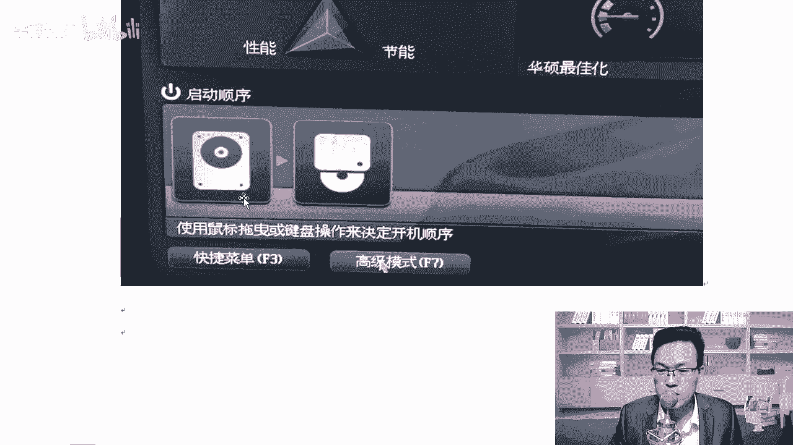

修改BIOS后，如果虚拟机之前启动失败，建议将其删除（右键虚拟机 -> 管理 -> 从磁盘中删除），然后重新按照上述步骤创建一次。

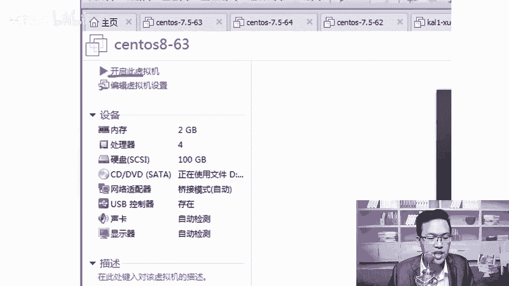

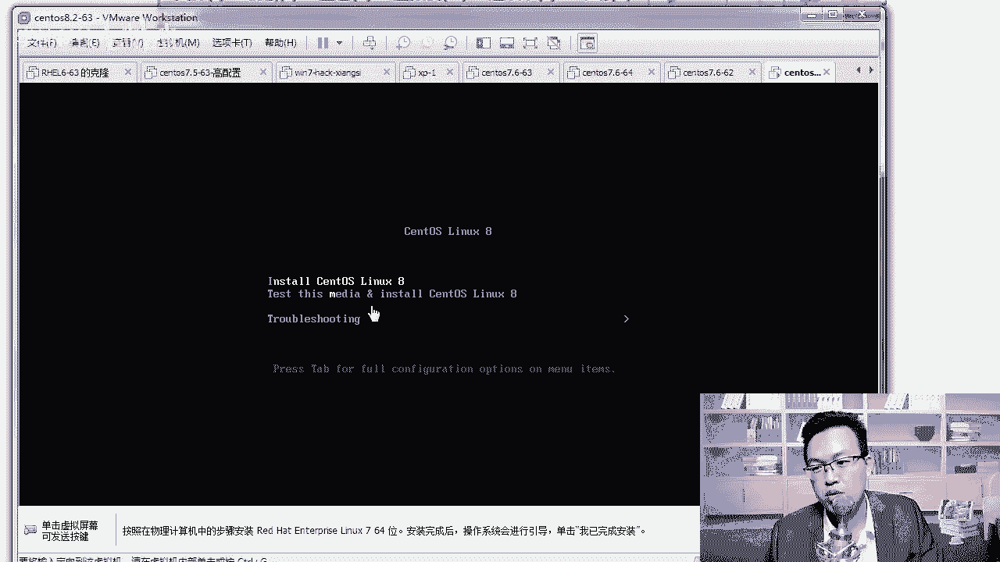

## 启动安装程序

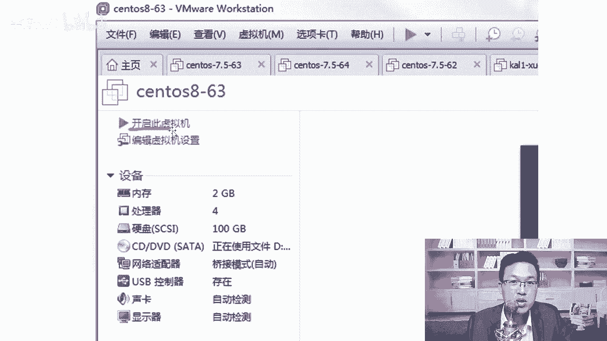

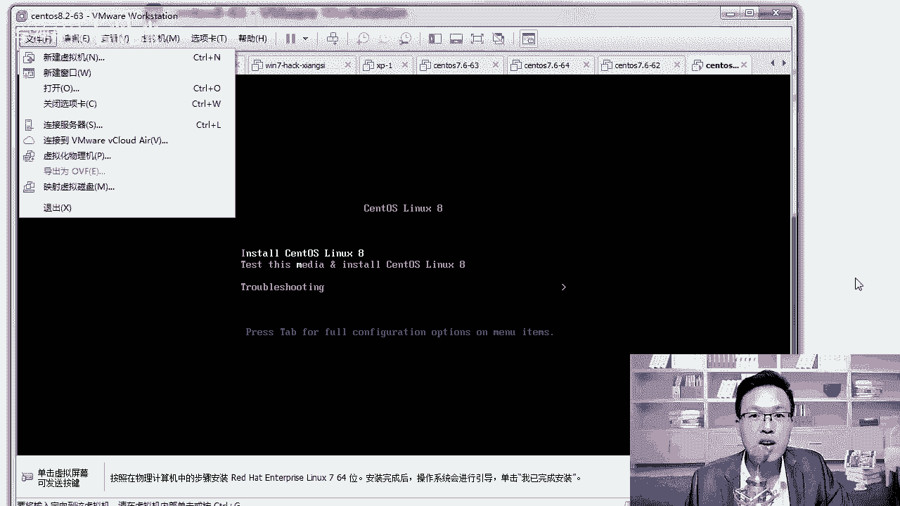

确保虚拟机配置正确且ISO镜像已加载后，点击“开启此虚拟机”。虚拟机启动后，你将看到CentOS 8的安装引导界面。使用键盘上下方向键选择第一项“Install CentOS Linux 8”，然后按下回车键，即可开始系统的安装过程。

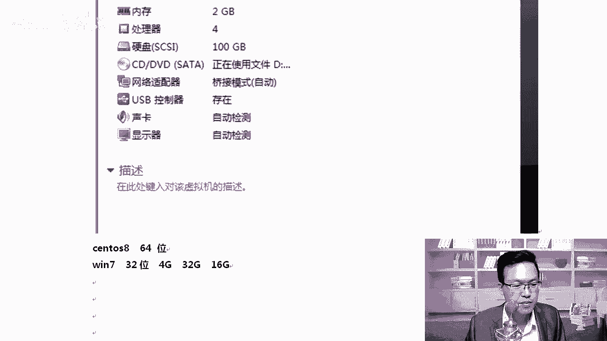

在等待安装程序加载的短暂时间里，你可以了解引导菜单的另外两个选项：
*   **Test this media & install CentOS Linux 8**：测试安装介质完整性后再安装。对于ISO镜像文件，此步骤通常可以跳过。
*   **Troubleshooting**：修复模式，相当于Windows的PE环境，用于系统恢复等操作。

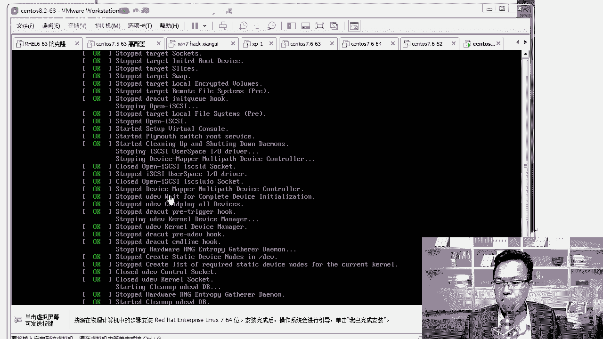

---

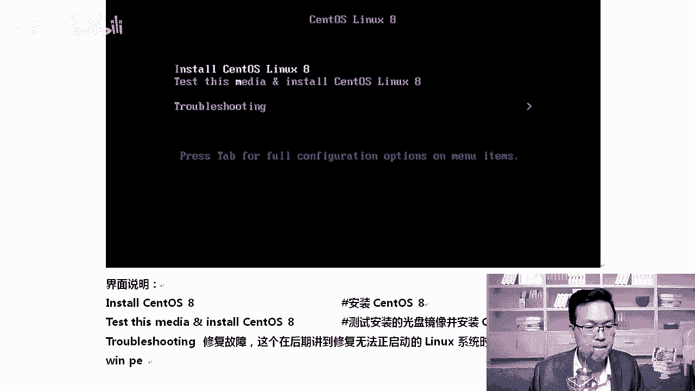

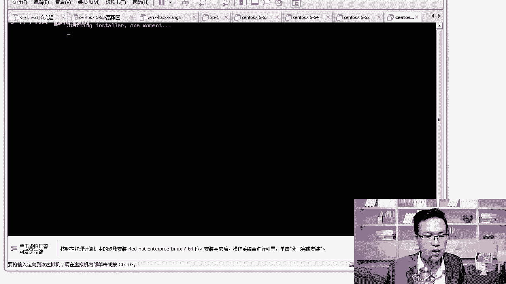

本节课中，我们一起学习了安装CentOS 8前在VMware中创建和配置虚拟机的完整流程。我们涵盖了从选择配置类型、分配硬件资源到解决虚拟化技术报错等关键步骤。完成这些准备工作后，你的虚拟机已经就绪，下一节课我们将正式进入CentOS 8操作系统的图形化安装界面。