# Linux入门教程：第5章：操作系统重启后的相关配置 🖥️

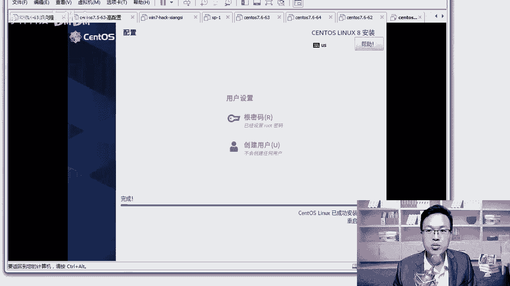

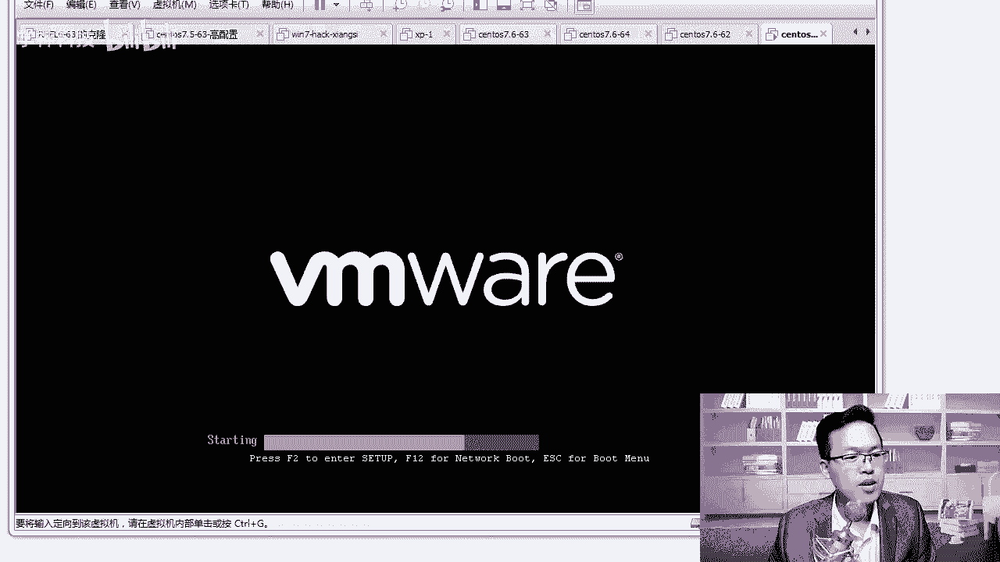

在本节课中，我们将学习CentOS 8操作系统安装完成并首次重启后，需要进行的一系列初始配置。这些步骤包括接受许可协议、创建用户、以管理员身份登录以及熟悉图形界面的基本操作。

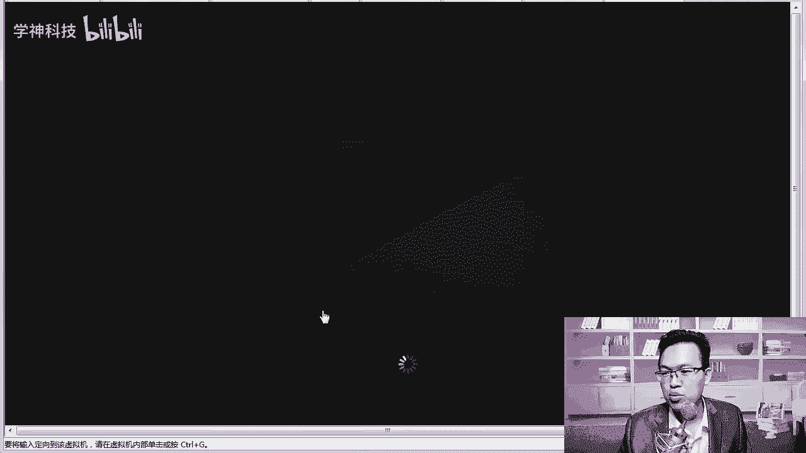

## 系统重启与初始界面

上一节我们完成了操作系统的安装。安装结束后，点击重启按钮，系统将重新加载。

重启后，系统会进入启动界面。默认选项即可，界面会有一个短暂的倒计时。

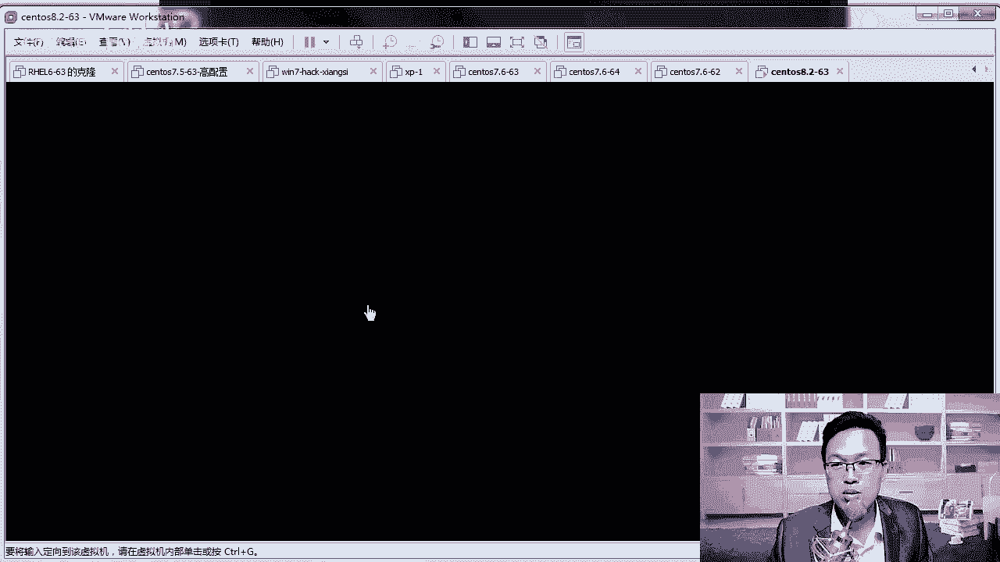

启动完成后，界面会显示出来。从CentOS 7开始，系统已自带VMware Tools（或类似虚拟化增强工具），无需额外安装。该工具的主要功能包括：
*   实现物理机与虚拟机之间的文件拖拽。
*   允许调整虚拟机图形界面的窗口大小。

## 接受许可协议与创建用户

我们来到了初始配置界面。首先需要点击“未接收许可证”并同意许可条款，然后点击完成。

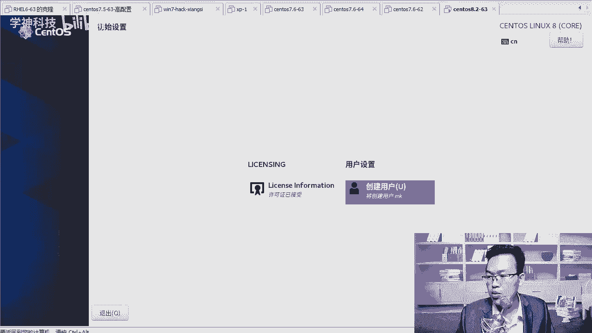

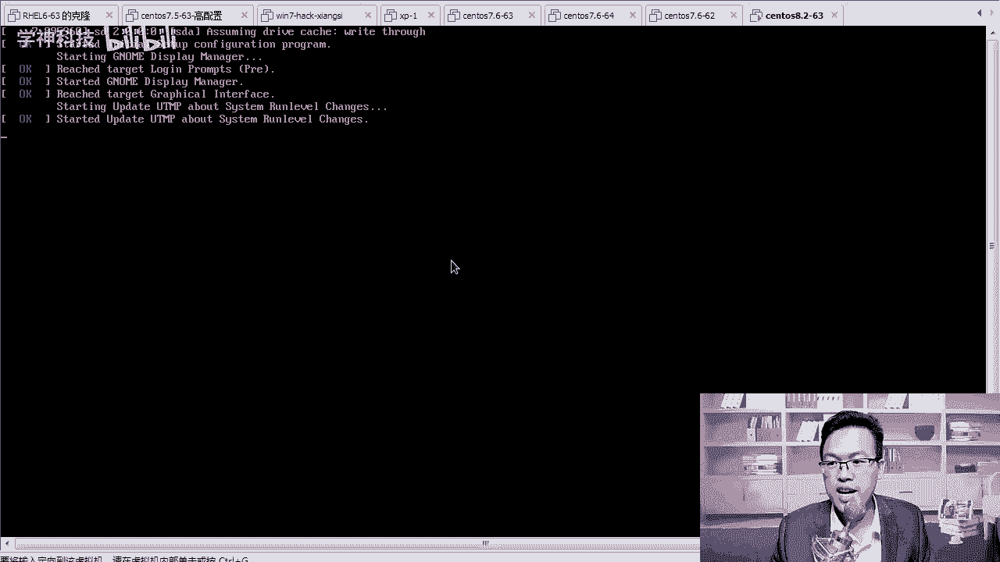

协议完成后，系统会提示创建一个普通用户。以下是创建步骤：
1.  在全名字段输入用户名，例如 `MK`。
2.  在密码字段设置密码，例如 `123456`。
3.  再次确认密码。
4.  如果系统提示密码过于简单，需要点击两次“完成”以确认。
5.  用户创建成功后，点击“结束配置”。

## 以管理员身份登录

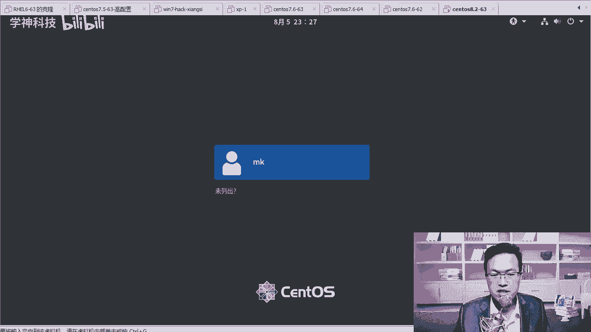

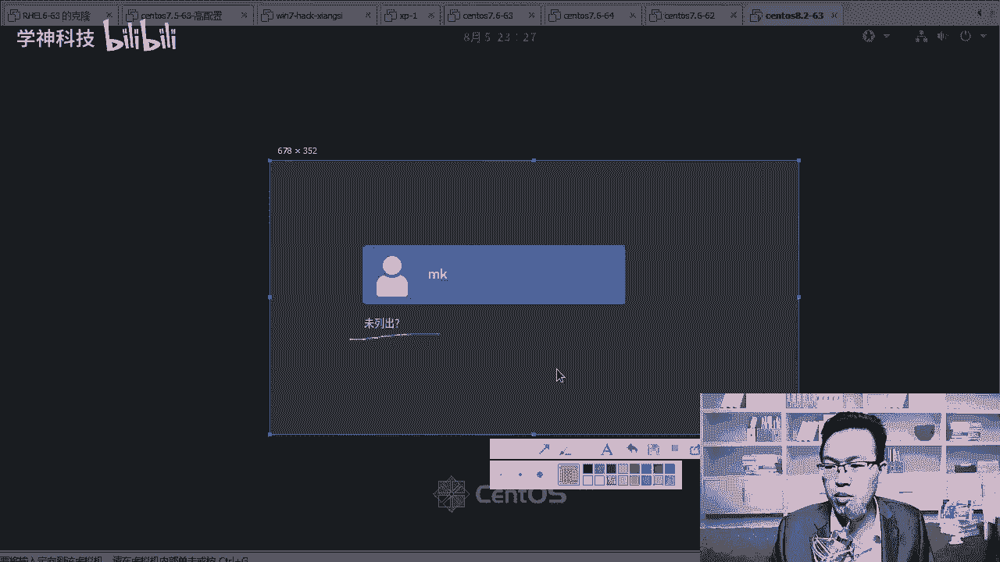

配置结束后系统会再次启动。启动成功后，登录界面默认会列出刚才创建的普通用户。

我们不需要使用普通用户登录，而是直接以超级管理员 `root` 身份登录。操作如下：
1.  点击登录界面上的“未列出”。
2.  在用户名输入框中输入 `root`。
3.  输入 `root` 用户的密码（安装时设置的）并登录。

**注意**：初学者在实验环境中可以直接使用 `root` 账户。但在实际工作环境中，使用 `root` 权限需格外谨慎。

首次以 `root` 登录时，系统会弹出欢迎信息。我们点击“前进”继续。

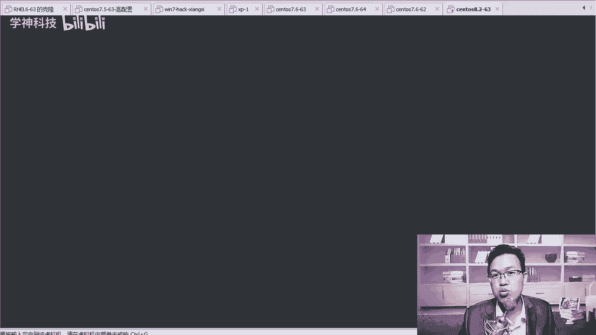

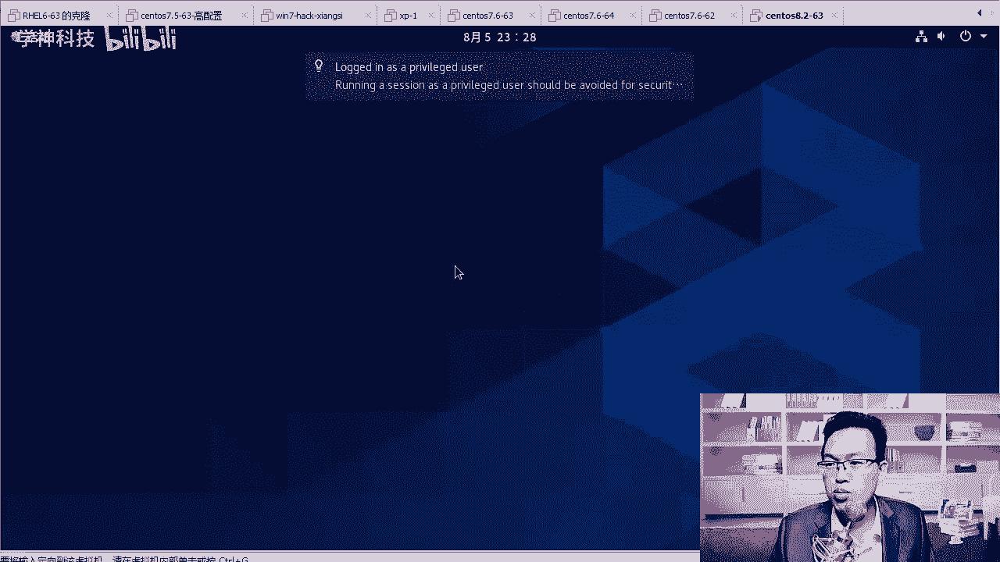

在后续的隐私设置和在线账户关联页面，可以根据需要选择开启或跳过，此处我们均选择跳过或关闭，最后点击“开始使用”。

## 熟悉图形界面与打开终端

开始使用后，系统可能会弹出帮助文档。你可以直接关闭它，也可以浏览一下，其中介绍了一些图形界面的使用技巧。

一个重要的操作是如何打开命令行终端。在CentOS 8的图形界面中，操作与之前版本略有不同：
1.  点击屏幕左上角的“活动”。
2.  在弹出的视图或搜索框中，点击“终端”图标。

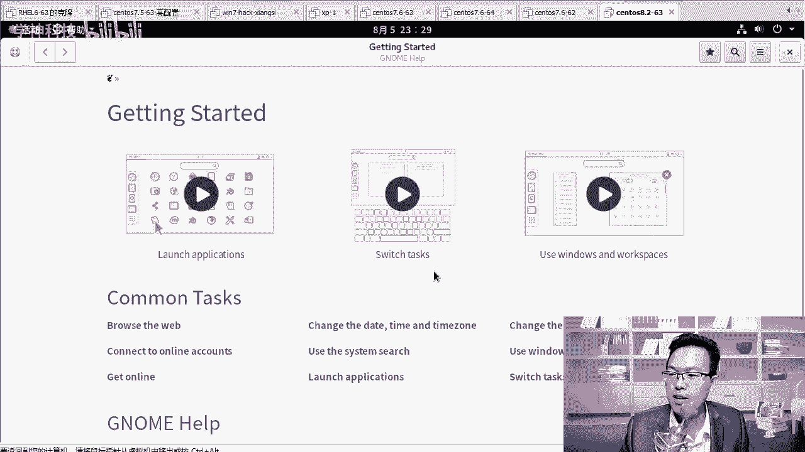

终端窗口打开后，你可以通过双击标题栏来放大或缩小窗口。

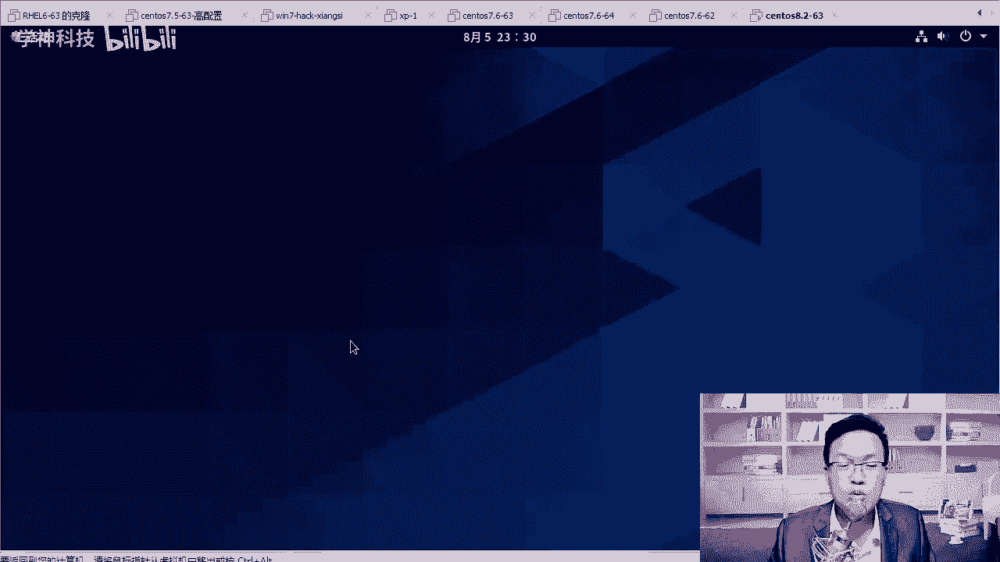

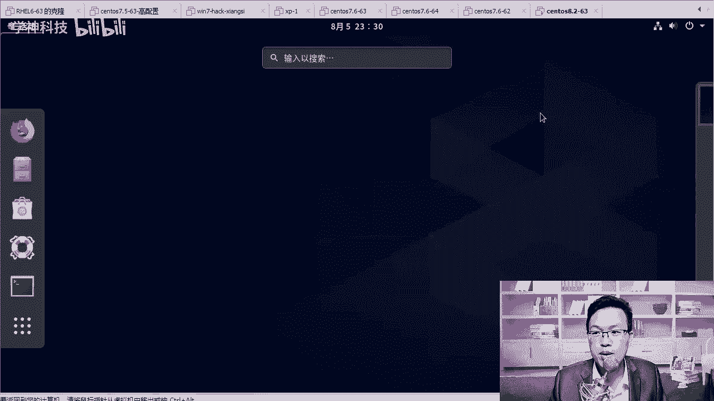

现在，你可以在终端中执行命令了。例如，我们可以测试网络连通性，使用 `ping` 命令：
```bash
ping baidu.com
```
如果命令能收到回复，说明网络连接正常。

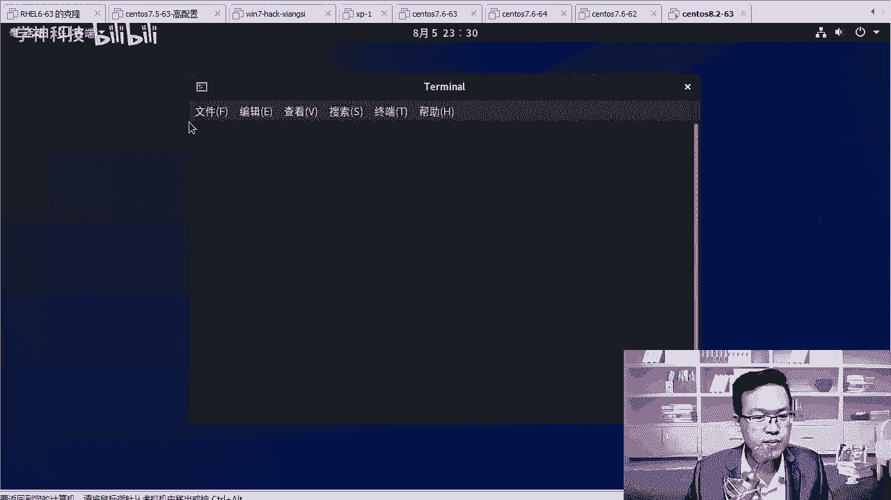

## 总结

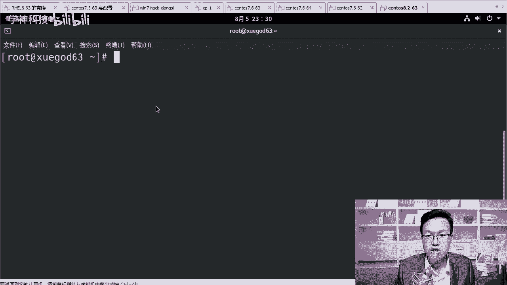

本节课中我们一起学习了CentOS 8系统安装后的初始配置流程。我们完成了接受许可协议、创建普通用户、以 `root` 管理员身份登录系统，并学会了在GNOME图形界面中打开终端窗口以及执行简单的网络测试命令。至此，一个可用的CentOS 8实验环境就准备就绪了。