# VMware虚拟机使用技巧：P6：12个核心技巧详解 🖥️

在本节课中，我们将学习VMware虚拟机的12个核心使用技巧。这些技巧涵盖了从基础配置到高级管理的各个方面，能帮助你更高效、更安全地使用虚拟机进行学习和实验。

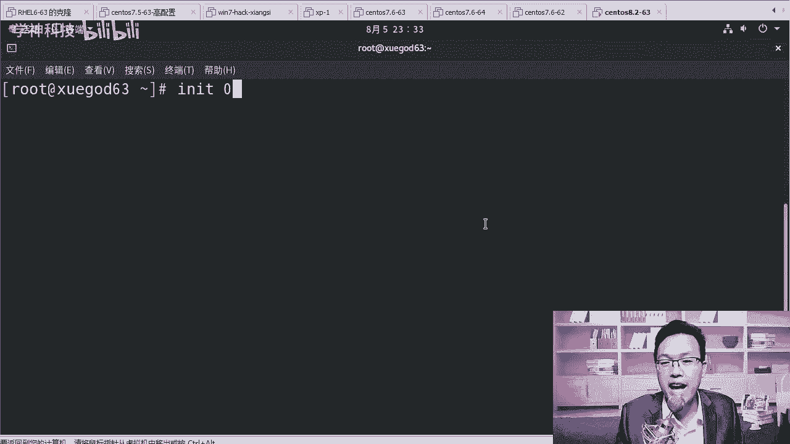

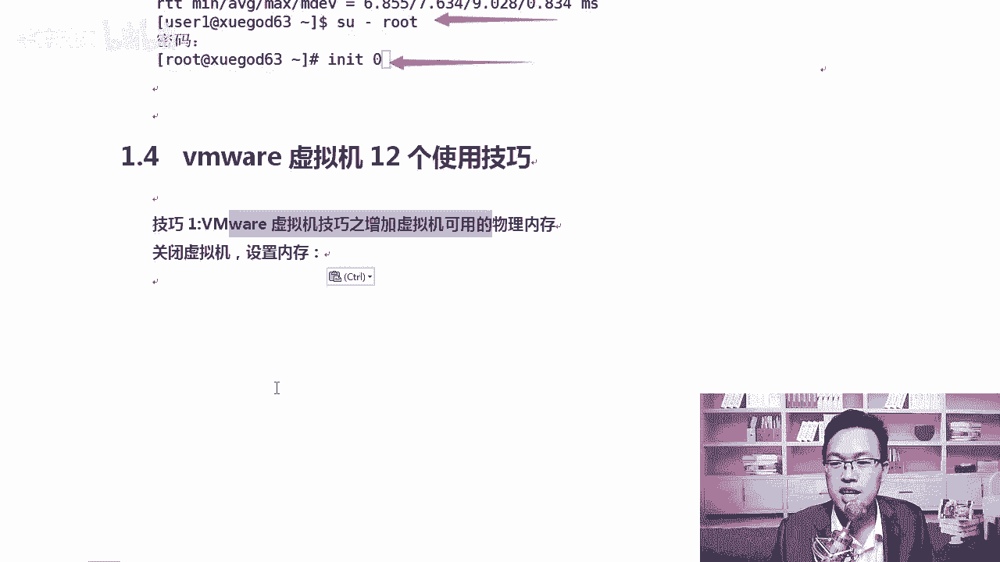

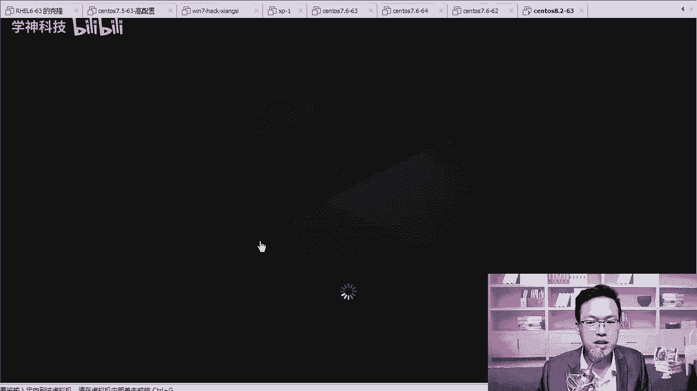

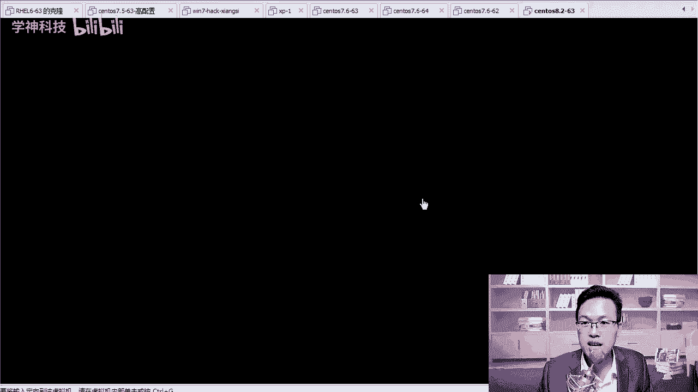

## 概述
本节教程将详细介绍VMware虚拟机的12个实用技巧，包括调整硬件、网络配置、系统控制、快照管理等。掌握这些技巧能让你在后续的Linux学习和系统运维中更加得心应手。

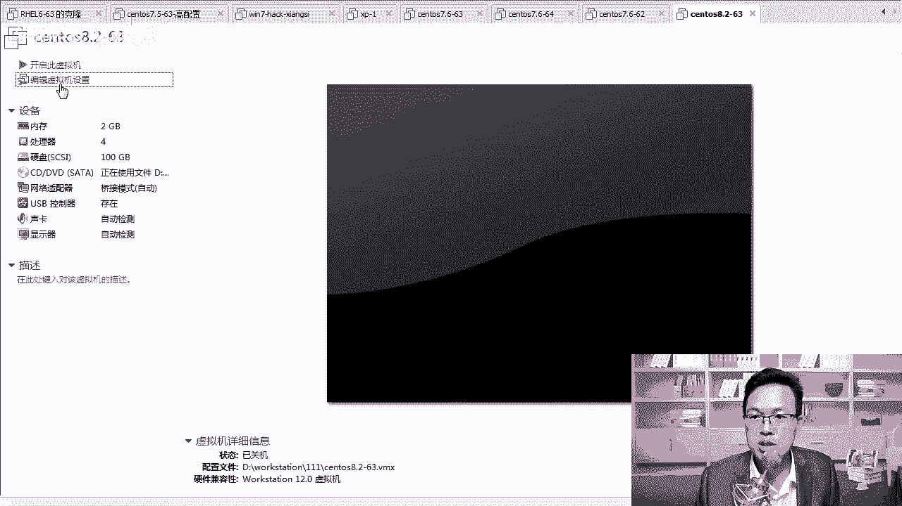

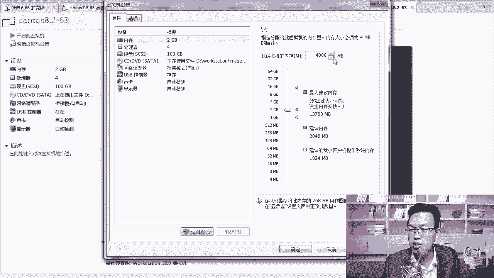

---

### 1. 调整虚拟机内存 💾
上一节我们完成了系统安装，如果暂时不使用虚拟机，可以执行 `init 0` 命令将其关机。关机后，我们开始介绍第一个技巧：调整虚拟机内存。

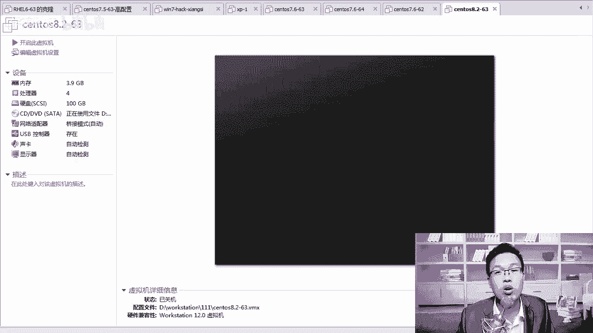

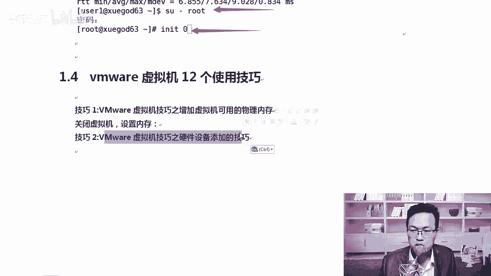

虚拟机内存的调整必须在关机状态下进行。以下是操作步骤：
1.  确保虚拟机已关机。
2.  点击“编辑虚拟机设置”。
3.  在“内存”选项中，输入你想要分配的新内存大小（例如 `4096` MB 代表 4GB）。
4.  点击“确定”保存。

**核心概念**：内存调整公式为 `1 GB = 1024 MB`。例如，分配4GB内存应输入 `4096`。

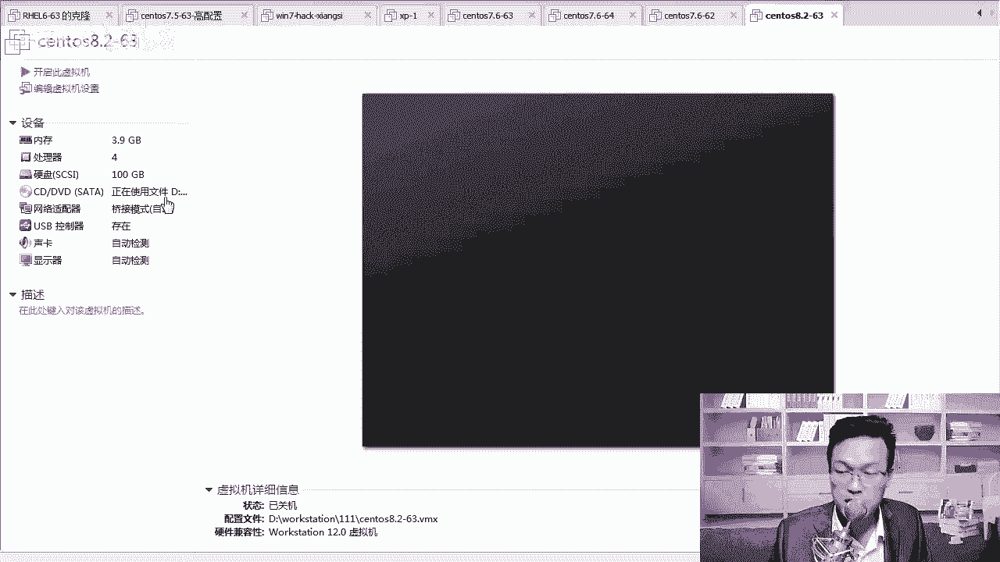

---

### 2. 添加硬件设备（如硬盘） ➕
如果你想为虚拟机添加新的硬件设备，例如一块硬盘，可以按照以下步骤操作。

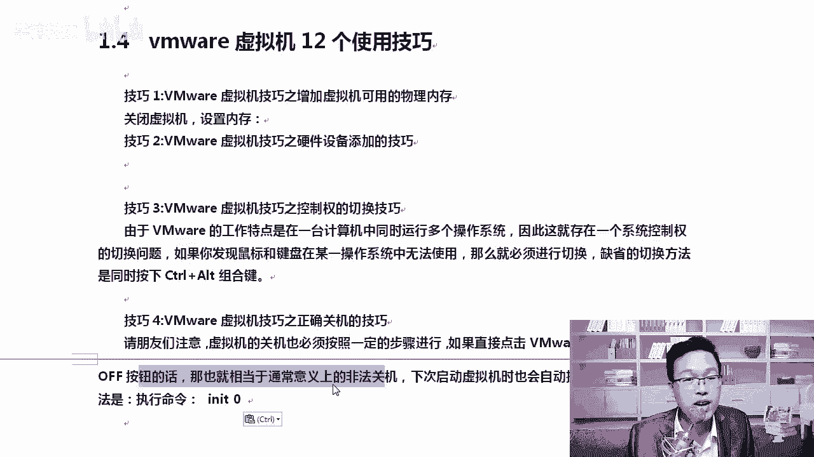

以下是添加新硬盘的步骤：
1.  在“编辑虚拟机设置”中，点击“添加”。
2.  在硬件类型中选择“硬盘”。
3.  选择“创建新虚拟磁盘”。
4.  设置磁盘容量（例如 `20` GB），建议选择“将虚拟磁盘拆分成多个文件”。
5.  点击“完成”并“确定”即可添加。
6.  如需移除，在设置中选中该磁盘，点击“移除”即可。

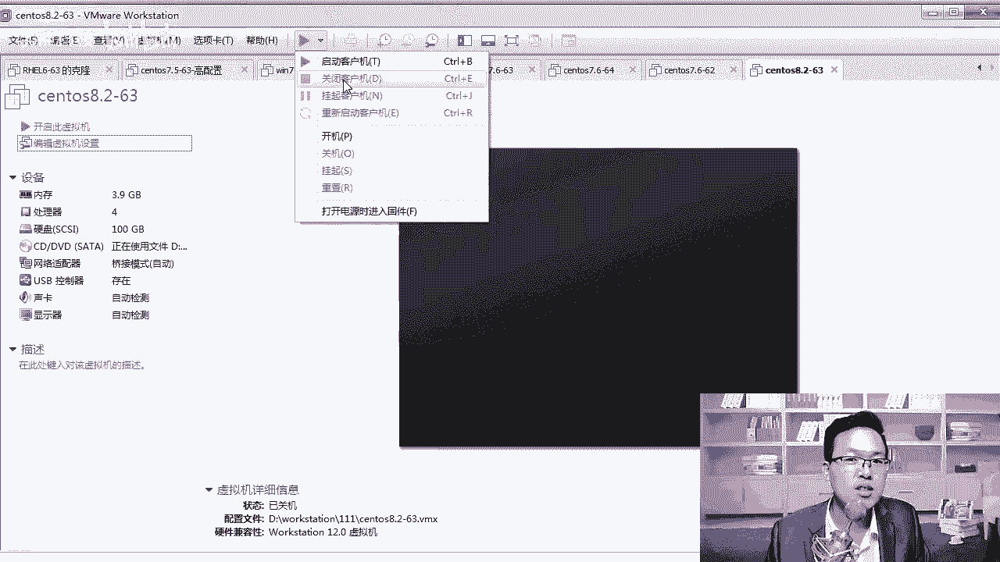

---

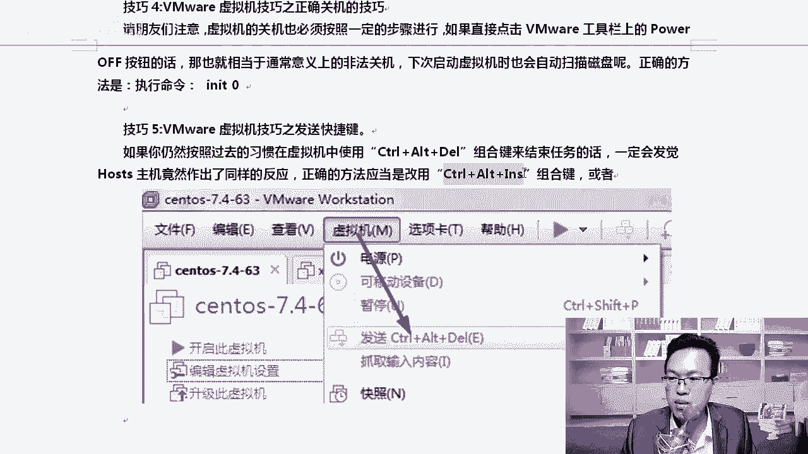

### 3. 虚拟机控制权切换 🖱️
VMware允许在一台物理机上运行多个虚拟机，因此存在控制权切换的问题。

当鼠标被捕获在虚拟机窗口内无法移出时，按下 `Ctrl + Alt` 组合键即可将控制权释放回物理机。

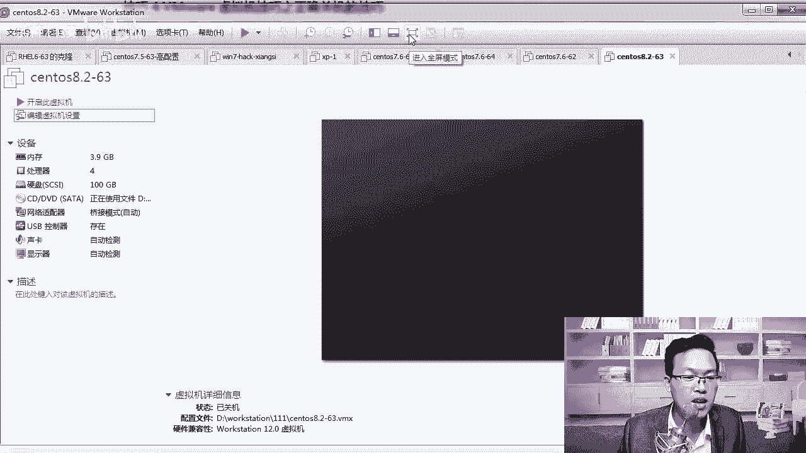

---

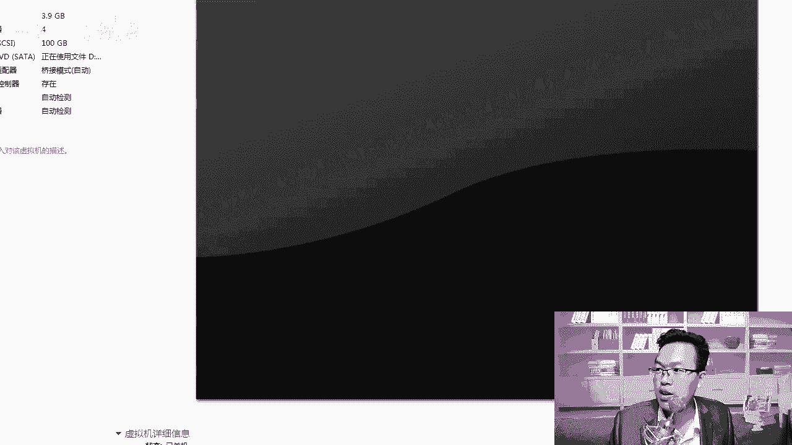

### 4. 虚拟机的关机方式 ⏹️
虚拟机有两种关机方式：正常关机和强制关机。

正常关机是在系统内执行 `init 0` 命令。如果系统无响应，可以使用强制关机：在VMware界面点击虚拟机的“关闭客户机”按钮（红色电源图标），这相当于直接切断电源。

---

### 5. 向虚拟机发送快捷键 ⌨️
有时需要向虚拟机发送特定快捷键（例如在Windows虚拟机中调出任务管理器 `Ctrl+Alt+Delete`），但直接按键会影响物理机。

你可以通过VMware菜单完成此操作：
1.  点击菜单栏的“虚拟机”。
2.  选择“发送 Ctrl-Alt-Delete”。
这样，快捷键只会发送到虚拟机，而不会影响物理机。

---

### 6. 界面显示管理 👁️
为了方便管理多个虚拟机，VMware提供了几种界面视图。

以下是三种常用的视图切换方式：
*   **显示侧边栏**：方便在大量虚拟机列表中快速选择。
*   **显示底部缩略图栏**：以缩略图形式展示所有已打开虚拟机。
*   **全屏显示**：让虚拟机界面充满整个物理机屏幕。将鼠标移至屏幕顶部可呼出菜单，点击“恢复大小”即可退出全屏。

---

### 7. 理解三种网络模式 🌐
VMware提供了三种主要的网络连接模式，理解它们对网络配置至关重要。

上一节我们介绍了界面管理，本节中我们来看看虚拟机的网络配置。VMware的三种网络模式决定了虚拟机如何与物理机及外部网络通信。

**桥接模式 (Bridge)**
*   **原理**：虚拟机的网卡通过虚拟网桥与物理机网卡连接。
*   **效果**：虚拟机就像一台直接连接在物理机所在局域网中的独立主机。
*   **配置要求**：虚拟机的IP地址必须与物理机在同一网段。

**NAT模式 (网络地址转换)**
*   **原理**：虚拟机通过物理机的IP地址共享上网。物理机上的VMware服务充当了路由器和DHCP服务器。
*   **效果**：虚拟机可以上网，也能与物理机通信。虚拟机通常获取一个 `172.` 开头的私有IP地址。
*   **配置要求**：虚拟机网络通常设置为自动获取IP (DHCP)。

**仅主机模式 (Host-Only)**
*   **原理**：虚拟机与外部网络完全隔离，只与物理机构成一个私有网络。
*   **效果**：虚拟机之间可以互相通信，也可以与物理机通信，但无法访问外部互联网。
*   **用途**：常用于构建安全的内部测试环境或集群模拟。

---

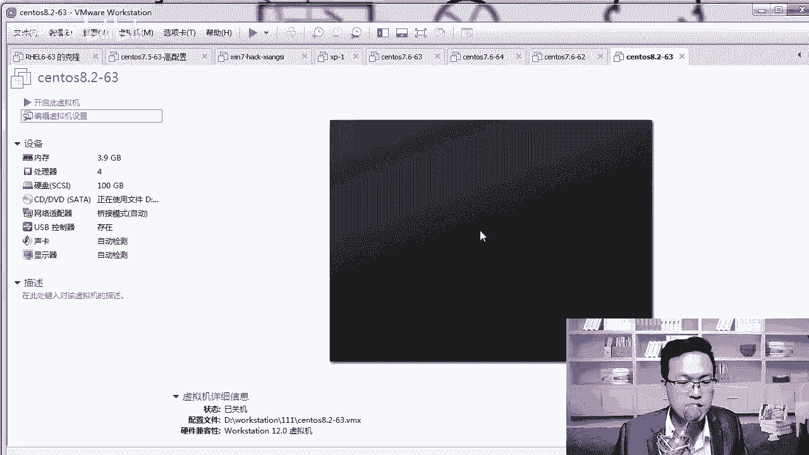

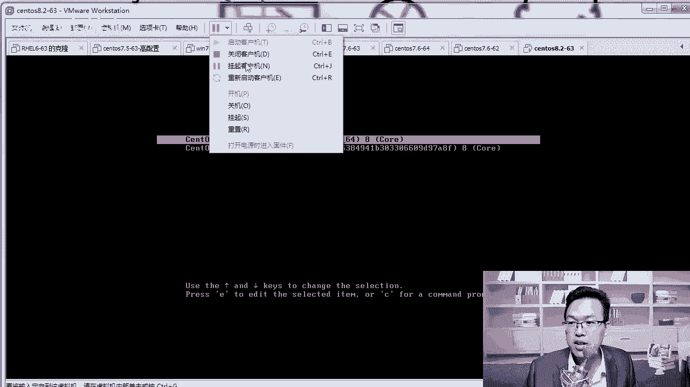

### 8. 进入虚拟机BIOS ⚙️
有时需要进入虚拟机的BIOS修改启动顺序（例如从光盘启动）。

虚拟机启动时，屏幕会提示按 `F2` 进入BIOS，但时机难以把握。更可靠的方法是：
1.  确保虚拟机已关机。
2.  点击“虚拟机” -> “电源” -> “打开电源时进入固件”。
3.  启动后会自动进入BIOS界面。使用方向键选择启动项，按 `Shift + +` 可上移选项，按 `F10` 保存并退出。

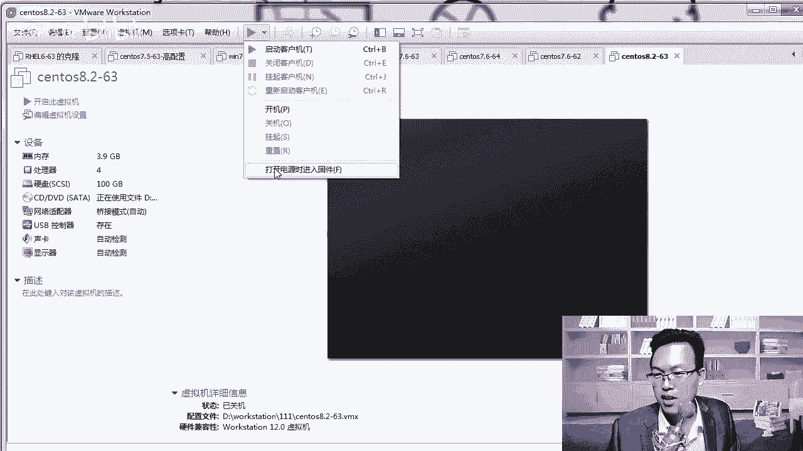

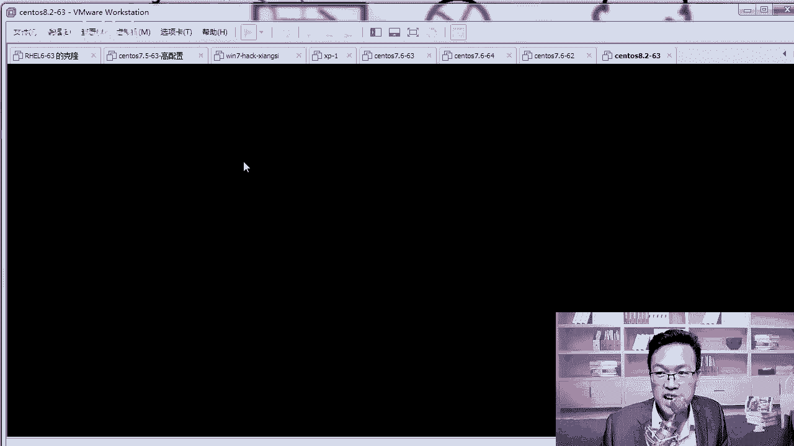

---

### 9. 安装VMware Tools 🔧
VMware Tools是一套增强工具，能改善虚拟机的性能和使用体验，如支持自由拖拽文件、自适应分辨率等。

对于VMware 15及更高版本，大多数Linux系统安装后会自动集成相关功能。你可以通过菜单“查看” -> “自动适应客户机”来启用窗口自适应功能。如果功能不全，可能需要手动安装VMware Tools，但本课程环境通常无需此操作。

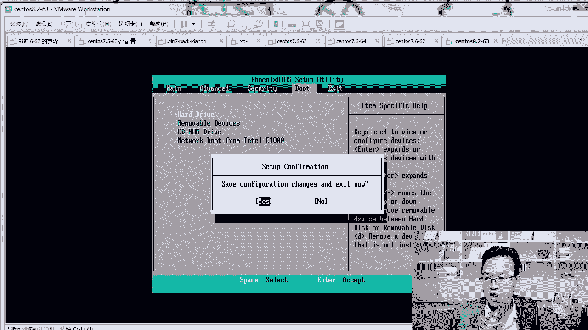

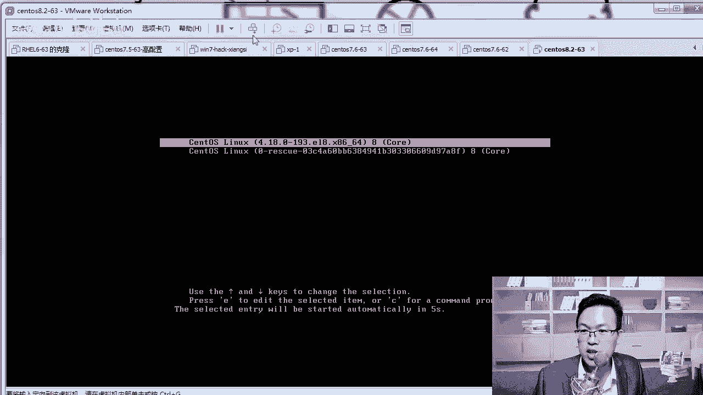

---

### 10. 连接与使用光盘 💿
在使用光盘镜像（ISO文件）安装软件或系统时，需要确保光驱已正确连接。

编辑虚拟机设置，在“CD/DVD”选项中，选择“使用ISO映像文件”并指定路径，**务必勾选“启动时连接”**。如果启动后发现未连接，无需关机，在虚拟机运行状态下同样可以进入设置勾选此项，然后点击“确定”即可立即连接。

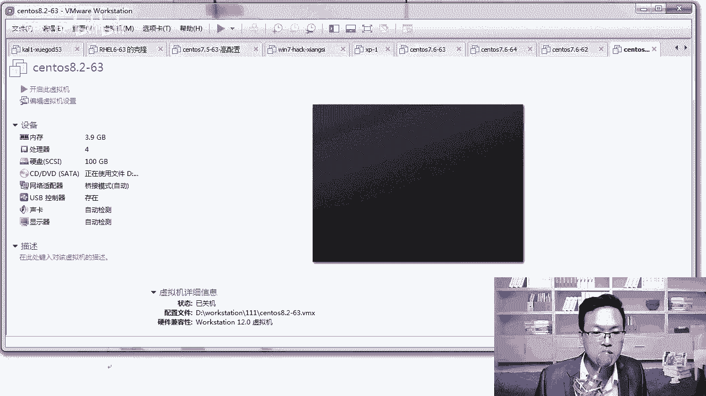

---

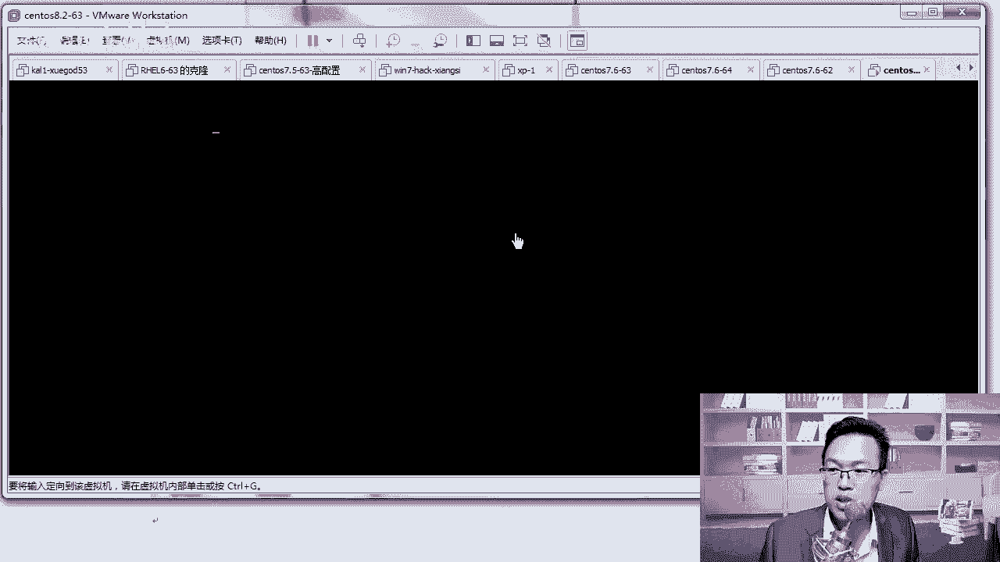

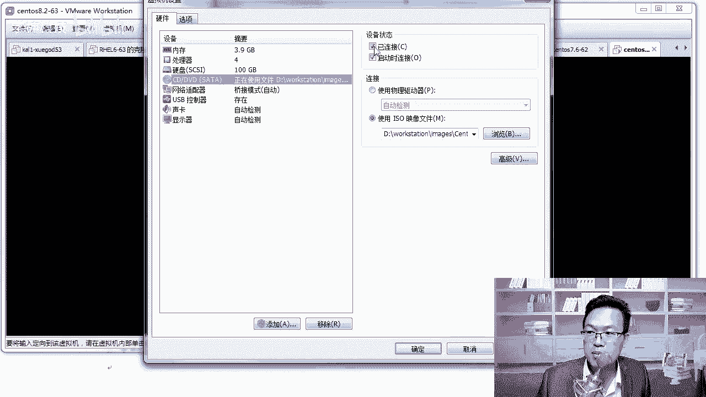

### 11. 彻底删除虚拟机 🗑️
关闭虚拟机电源并不等于删除它。要彻底释放磁盘空间，需要执行删除操作。

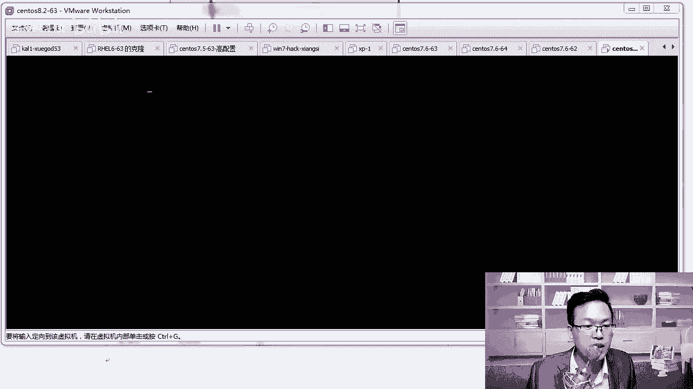

在VMware列表中，右键点击目标虚拟机，选择“管理” -> “从磁盘中删除”。这才是永久删除虚拟机及其相关文件的操作。

---

### 12. 使用快照功能 📸
快照是VMware最重要的功能之一，它可以保存虚拟机在某个时间点的完整状态。

在完成一个稳定可用的系统配置（例如安装好所有基础软件并能上网）后，强烈建议创建一个快照。
1.  点击工具栏的“拍摄快照”按钮。
2.  为快照起一个描述性名称（例如“可用实验环境”）。
3.  点击“拍摄快照”即可保存。

**注意事项**：
*   可以在关机或开机状态下创建快照。开机状态快照会保存内存数据，恢复后直接进入系统；关机状态快照恢复后是关机状态。
*   如果未来系统出现故障或配置混乱，可以通过“快照管理器”选择之前的快照点，点击“转到”即可快速恢复到创建时的状态。

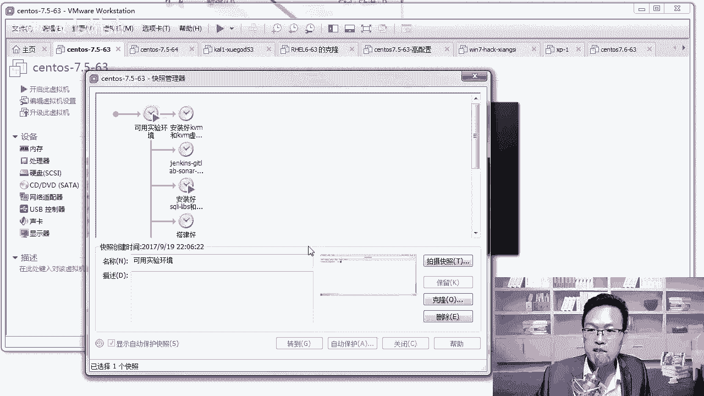

---

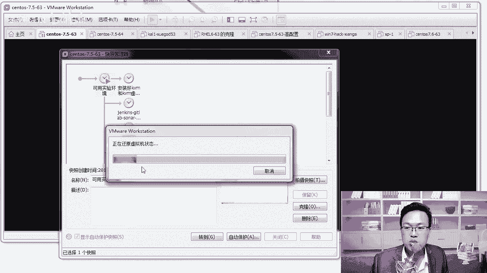

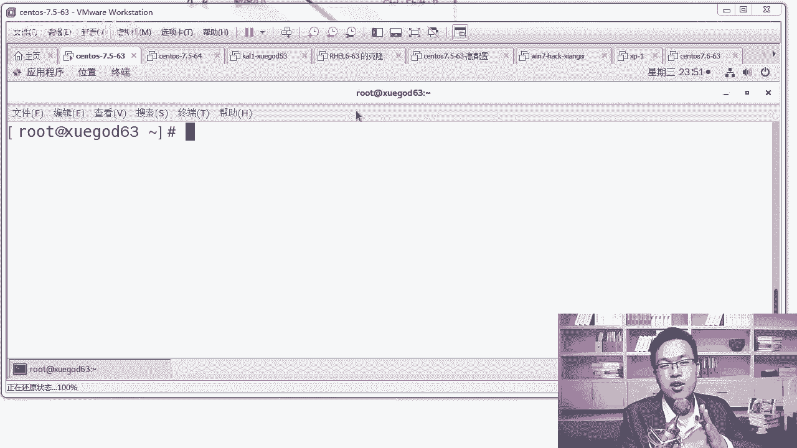

## 总结
本节课我们一起学习了VMware虚拟机的12个核心使用技巧。从基础的硬件调整、网络模式理解，到实用的控制权切换、快捷键发送，再到至关重要的快照管理，这些技巧构成了高效使用虚拟机进行学习和实验的基础。请务必动手实践，特别是快照功能，它能为你后续的探索提供一个安全的“后悔药”。