# Linux系统管理：3：系统时间管理 ⏰

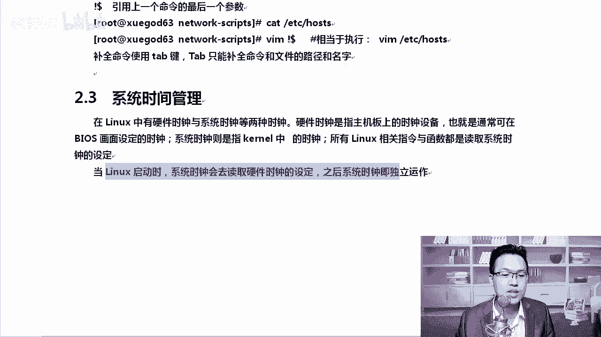

## 概述
在本节课中，我们将要学习Linux系统中的时间管理。我们将了解硬件时钟与系统时钟的区别，学习如何查看和设置系统时间，掌握使用`date`命令格式化输出时间，并了解`time`命令的用途。

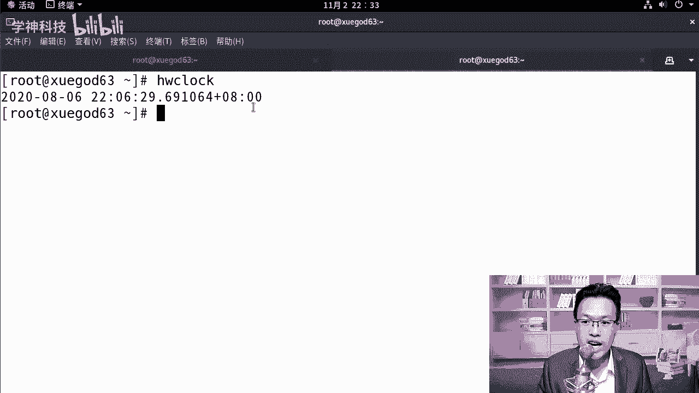

## 硬件时钟与系统时钟
Linux系统中有两种时钟：硬件时钟和系统时钟。硬件时钟指的是主板BIOS上的时间。系统时钟指的是Linux内核启动后读取硬件时钟并维护的时间。

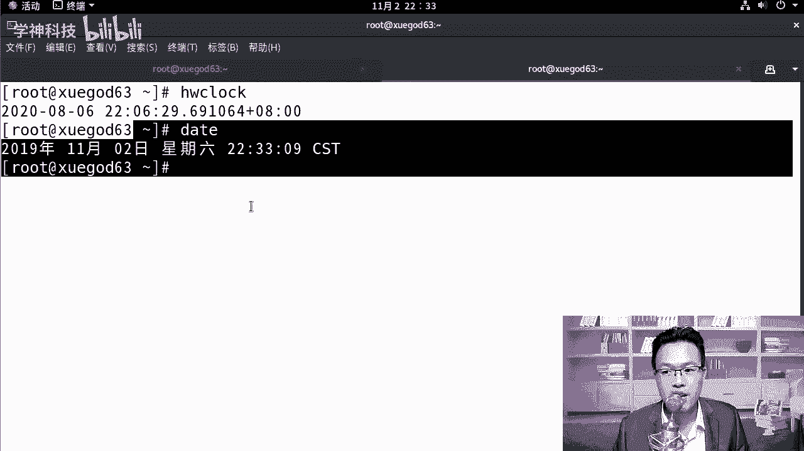

上一节我们介绍了两种时钟的概念，本节中我们来看看如何查看它们。

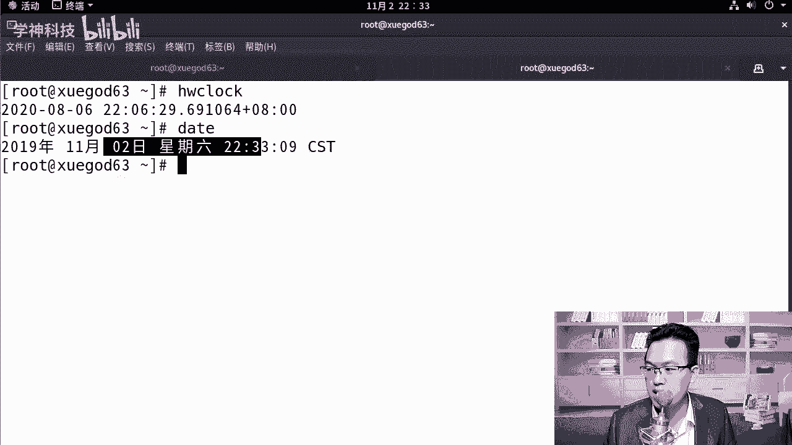

### 查看硬件时钟
使用`hwclock`命令可以查看硬件时钟。

```bash
hwclock
```

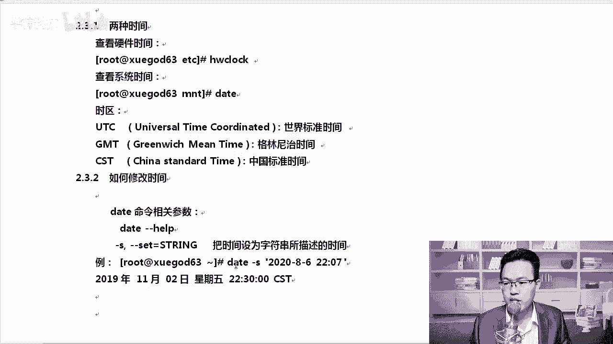

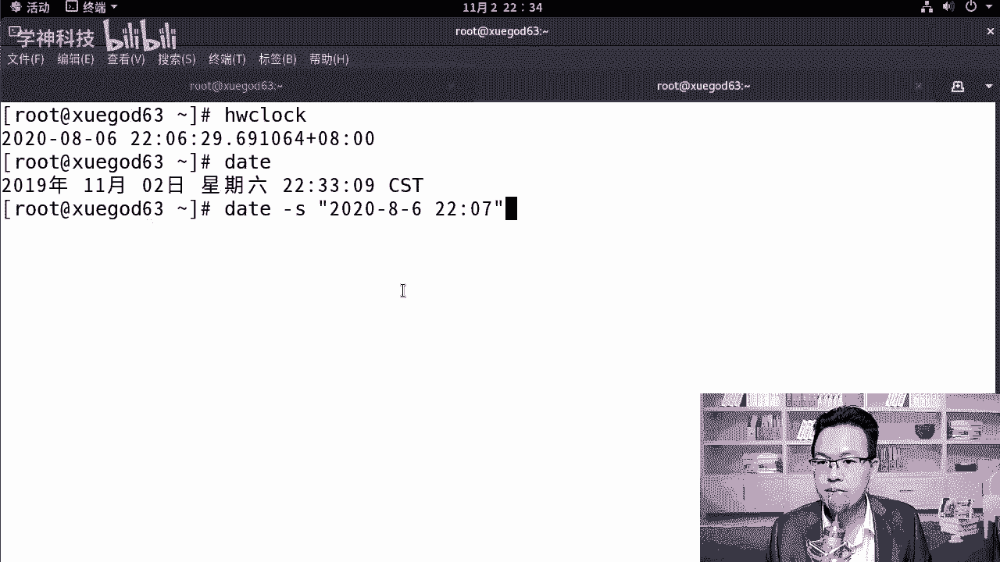

### 查看系统时间
使用`date`命令可以查看当前系统时间。

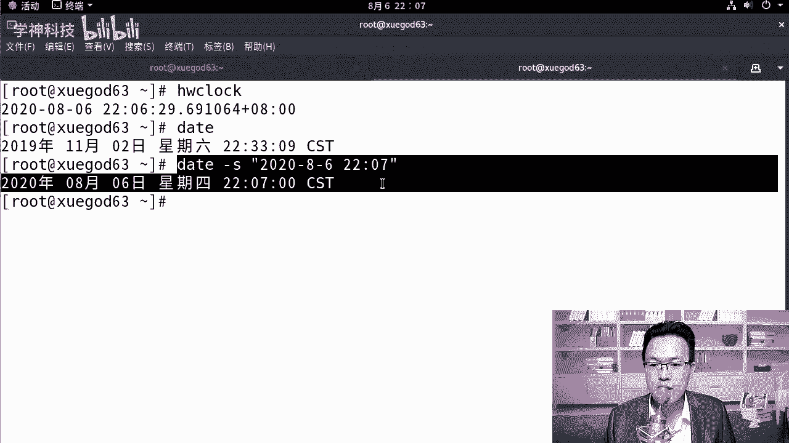

```bash
date
```

正常情况下，硬件时钟和系统时间是完全一致的。`date`命令输出的时间字符串末尾可能包含时区信息，例如`CST`代表中国标准时间，`GMT`代表格林尼治标准时间，`UTC`代表世界协调时间。

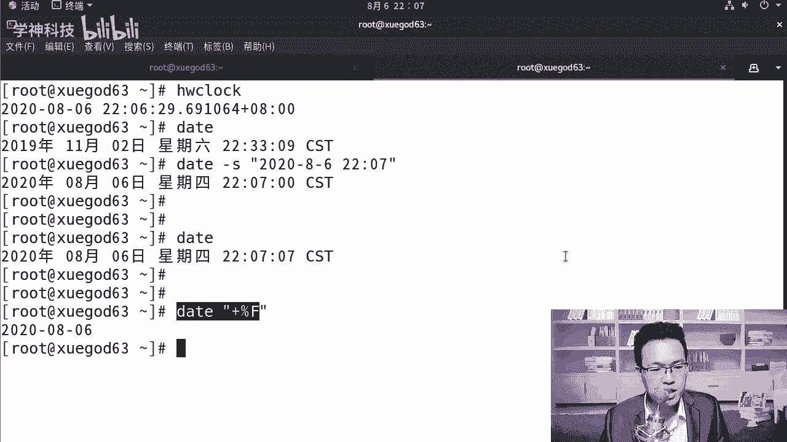

## 修改系统时间
了解了如何查看时间后，接下来我们学习如何修改系统时间。

修改系统时间主要使用`date`命令，配合`-s`参数来设置。

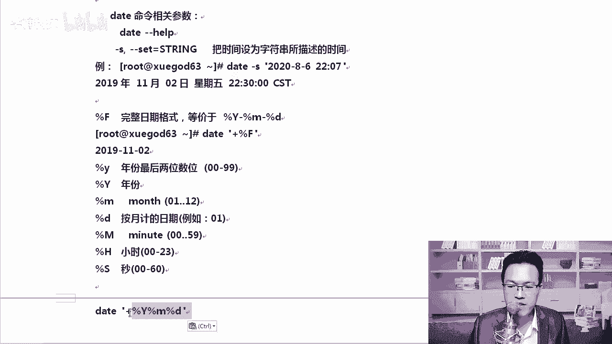

以下是修改系统时间的命令格式：
```bash
date -s "YYYY-MM-DD HH:MM:SS"
```

例如，将系统时间设置为2020年8月6日10点07分：
```bash
date -s "2020-08-06 10:07:00"
```

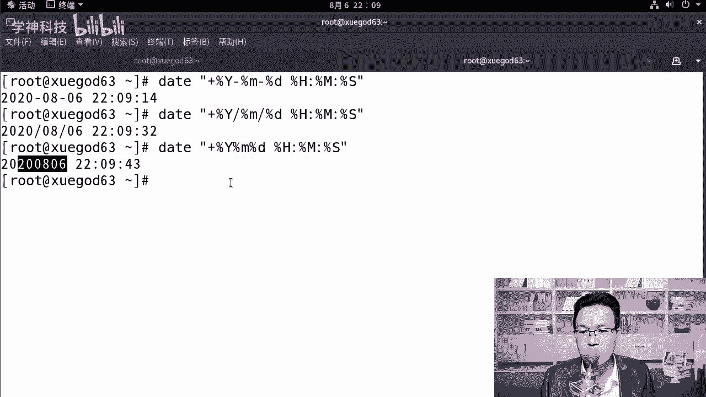

## 格式化输出时间
有时我们只需要显示时间的特定部分，例如仅显示年月日。`date`命令支持自定义格式输出。

以下是使用`date`命令格式化输出的方法：
```bash
date +"%Y-%m-%d"
```

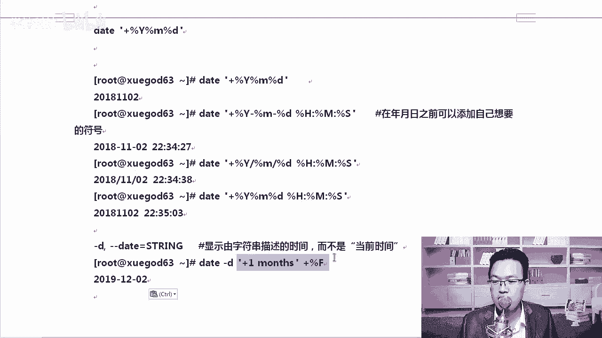

其中，`%Y`代表四位数的年份，`%m`代表月份，`%d`代表日期。这种格式化输出在脚本中非常有用，例如为每日备份文件生成带日期的文件名。

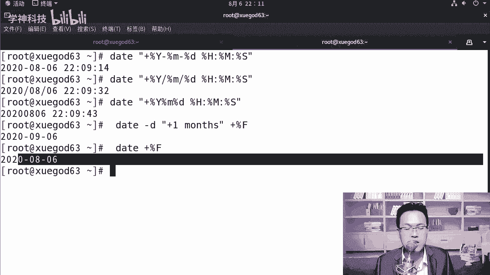

以下是常见的日期格式符号：
*   `%Y`：四位年份（如2020）
*   `%y`：两位年份（如20）
*   `%m`：月份（01-12）
*   `%d`：日（01-31）
*   `%H`：小时（00-23）
*   `%M`：分钟（00-59）
*   `%S`：秒（00-60）
*   `%F`：完整的日期格式，等价于`%Y-%m-%d`

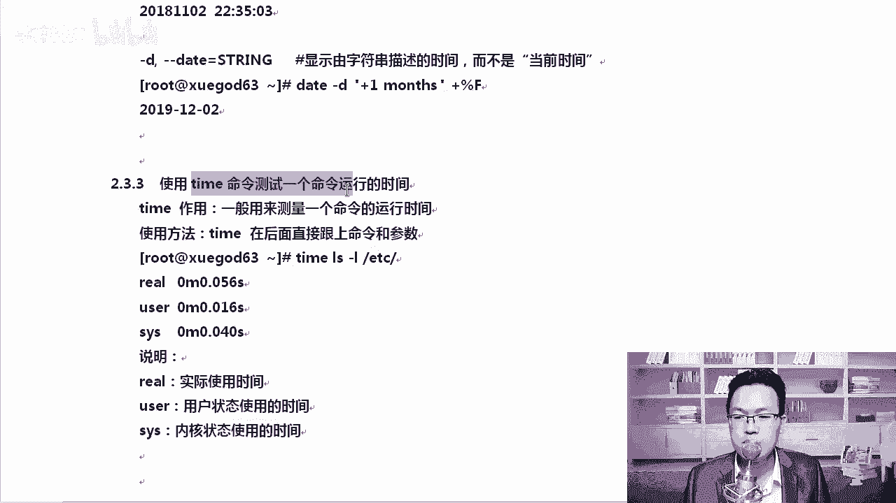

你可以在格式符号之间添加任意分隔符，例如：
```bash
date +"%Y/%m/%d %H:%M:%S"
```

## 显示特定时间
`date`命令还可以显示基于当前时间的特定时间点，例如显示一个月后的日期。

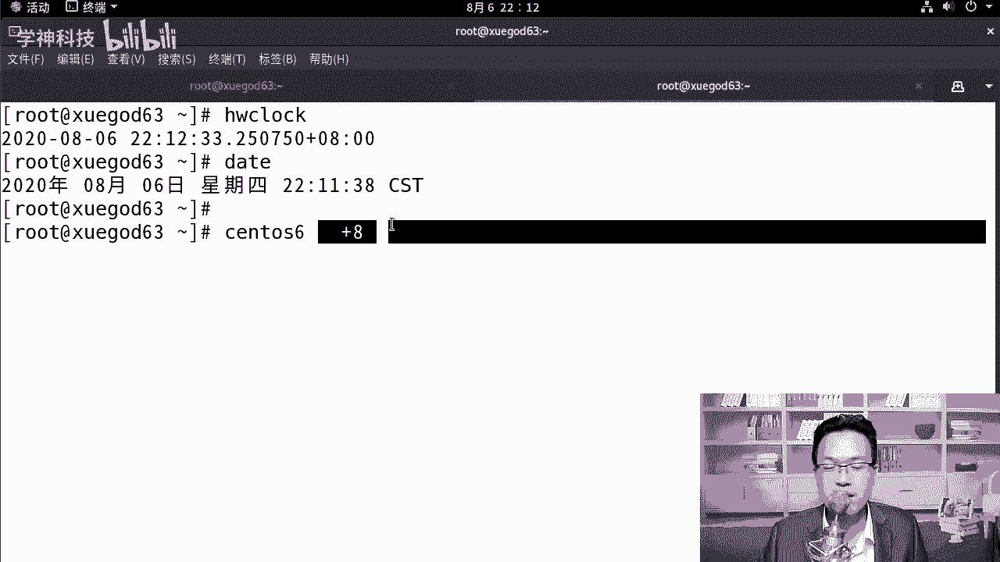

以下是显示一个月后日期的命令：
```bash
date -d "+1 month" +"%F"
```

## 命令执行时间测量
除了管理时间，Linux还提供了测量命令执行时间的工具。

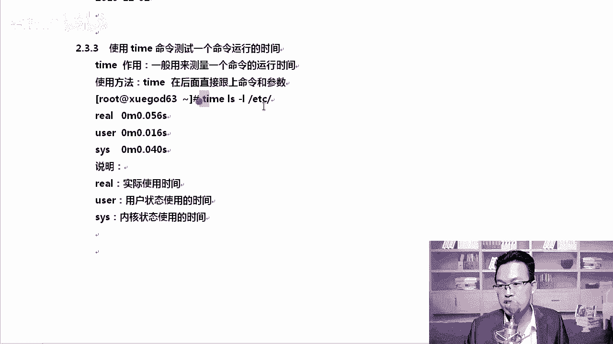

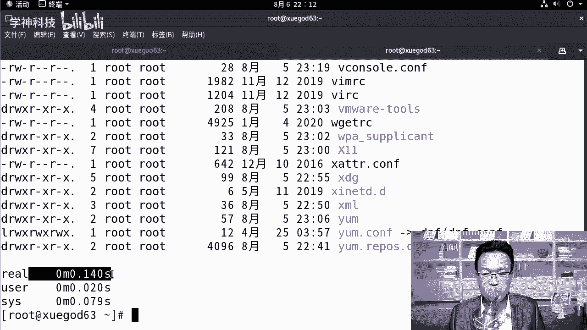

`time`命令用于测量一个命令或程序的执行时间。它可以帮助我们了解程序在用户态和内核态的耗时，对系统性能调优很有帮助。

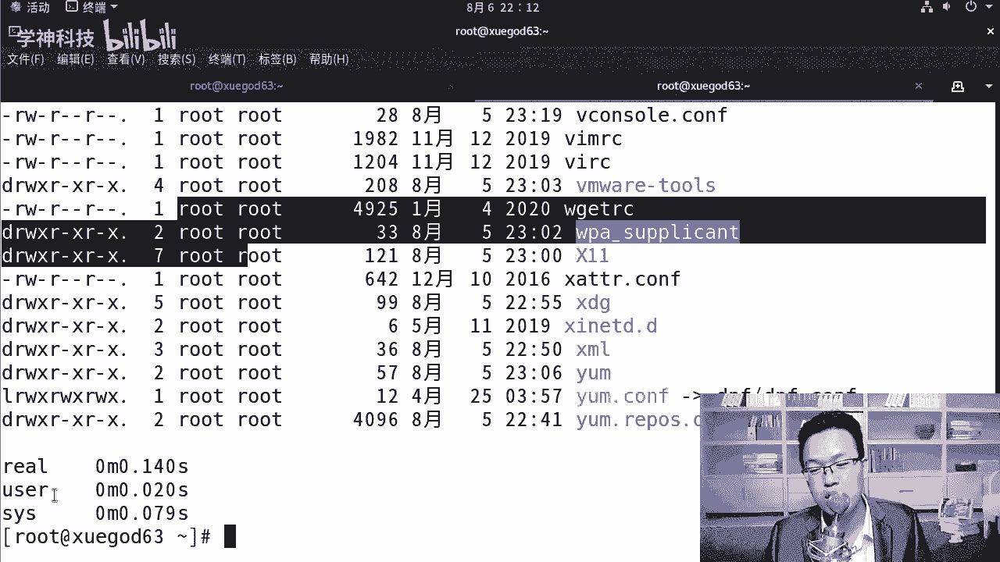

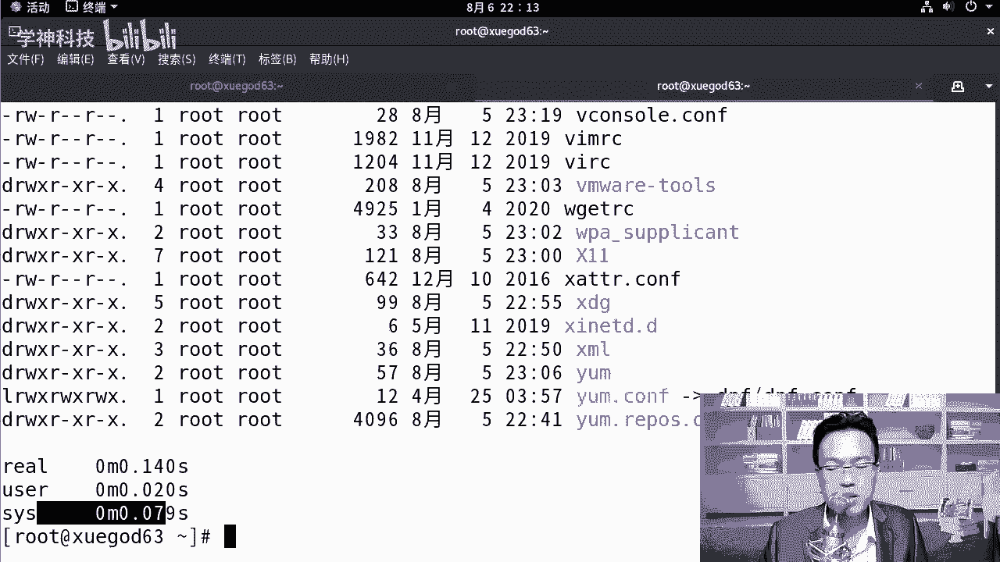

以下是使用`time`命令的示例：
```bash
time ls -l
```

命令执行后会输出三个时间：
*   `real`：实际流逝的时间（从命令开始到结束的“墙钟”时间）。
*   `user`：程序在用户态消耗的CPU时间。
*   `sys`：程序在内核态消耗的CPU时间。


## 总结
本节课中我们一起学习了Linux系统时间管理的核心知识。我们区分了硬件时钟与系统时钟，掌握了使用`hwclock`和`date`命令查看时间，学会了用`date -s`设置系统时间以及用`+`参数格式化输出时间。最后，我们还了解了`time`命令用于测量程序执行时间的用途。这些是系统管理和脚本编写中非常实用的基础技能。