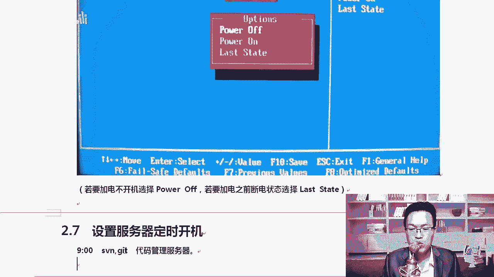
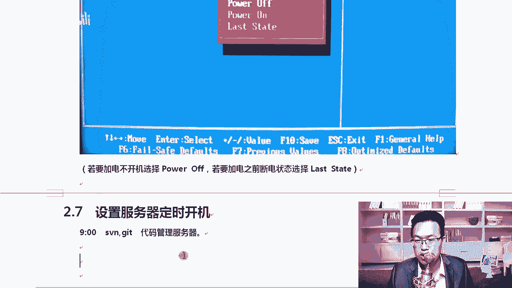
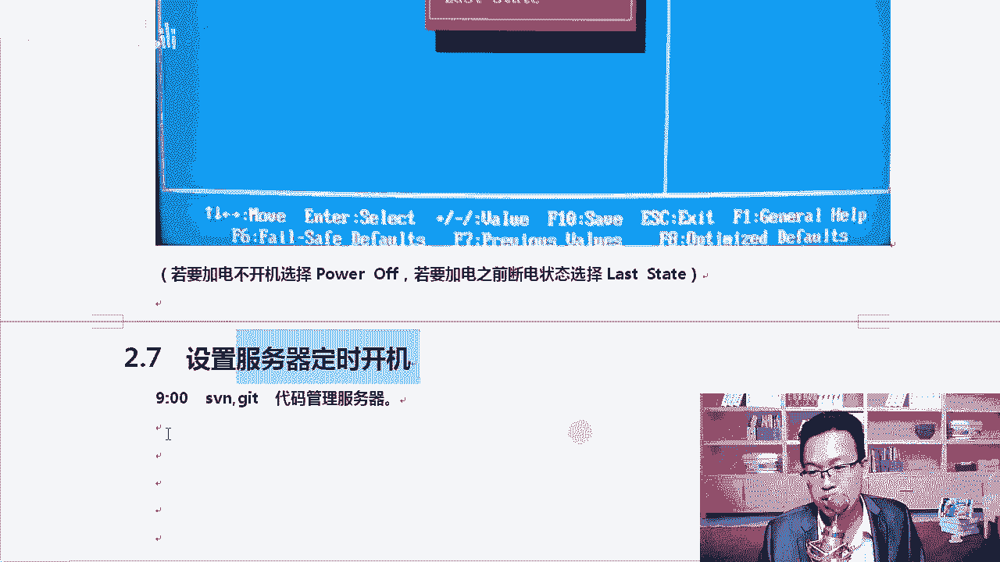
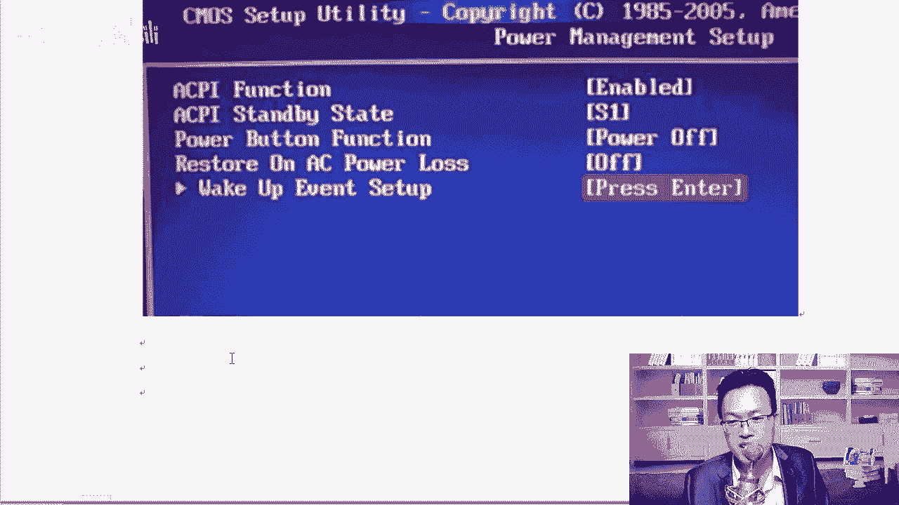
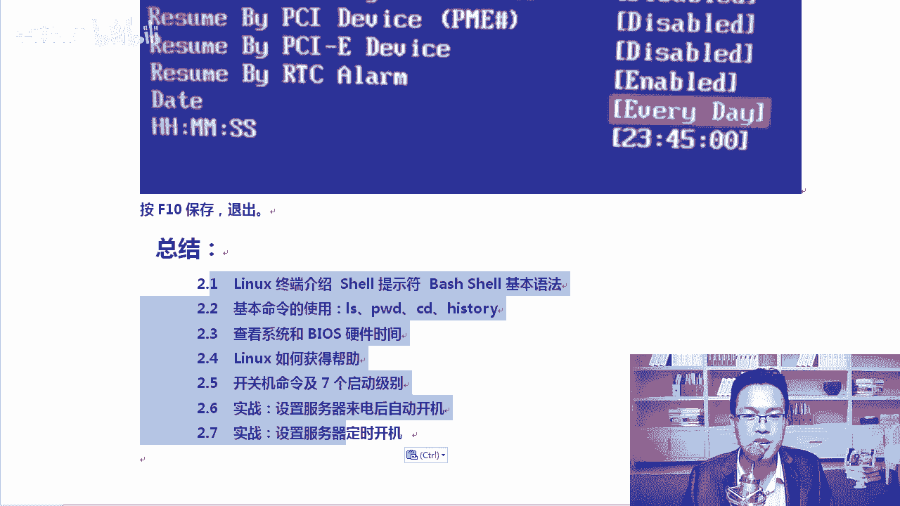

# Linux／RHCE／红帽认证／云计算／Linux资料／Linux教程／运维云计算／全国首家Centos8系列课程 - P11：5-实战-设置服务器来电后自动开机-设置服务器定时开机 - 学神科技 - BV1BZ4y1g7TE

接下来我们来分享两个小的项目实战。那么我们的课程就可以圆满的结束了。第一个是设置服务器来电后自动开机。这个实战的需求是什么？比如说你是IDC机房，你们公司有1个IDC机房里边有2000台服务器。

突然间怎么样断电了。当IDC机房都有备用的电源啊，我们就假设一下是吧，它突然间断电了，2000台服务器瞬间都关了，关了以后呢。😊，来电了以后，你是不是每个机器上都得去摁一下开关？把它给打开。

能不能说来电以后让它自动开机，可以吗？可以。啊，我不希望我把2000台电脑都去开一下机，或者2000台服务器都去开一下机，它是可以的啊。你进入bios以后就行。我们进bios有很多种方法。

比如说按deelete NF2NF11F1都可以。假如说这就是一个bios进入进入以后呢，我们来配置一下。😊。

我们选择的是哪一项呢？我们选择的是这一项。啊，你要选择这一块外围设备。好吧好，我们要选这个啊integerintegerrate。OK选择它。选择一下这个外围设备，选择完这个外围设备以后。

integer啊，integ是集成的意思啊。我们选择这个外围设备，选完这个外围设备以后去找。Super。对我们去找这个superLO。好的，super。super air device选择这个啊。

打开它以后，你可以去配置，我们来配置一下，在它这里面有一个power on。我给大家截个图啊，每一个每一个bios都有你你自己的笔记本电脑上也有。就每次比如说我的笔记本啪一插电，然后它就能自动开机。😡。

清楚了吧？在这里面有一项好不好？我们找一项这个叫restore onAC power A power就是交流电是吧？😊，OKAC4 power是交流电的一个缩小啊。

那么A power low当我们的电源丢失以后，默认是power off power off就是怎么样。就是当我们restore恢复了恢复了。😊，好，断了电以后又恢复了电。

那么这个时候是power off是没有任何响应的。你需要去改一下，我们可以选择这个power off，可以改改的时候，咱们可以选好多选项。比如说这里选p on和last state。你要选哪个呢？嗯。

你想选哪个？有多种方法啊，你要家电不开机，你就选power off。你希望断了电以后，一般比如说台式机断了电以后，你从后面一插电源，然后那个机器就自动开机了，那你就选择power on断电后是吧？

再次加电能够自动开机就选power on。还有一个是什么？😡，哎，如果家电之就是保持断电前的这个状态，你就选last state。什么意思呢？假如我这个机器在断电之前，我就关着的，你来了电。

我还用再开吗？不用了。😊，明白了吧？其实这个方法是比较好的啊。因为我断电前我就关着加了个电，我就要重新开一下，显然是不合适的。对不对？啊，这两种方式，只要你选了这个，下次你一拔一插电就行。

你把你台式机啊，就你们家那个台式机，你试一试，从bios我们的笔记本也是支持的啊。😊，做的时候怎么办呢？你把笔记本的。😡。

是吧电池抠下来抠下来以后说吧进到bios里去设置设置成power on或者last state，你自己要尝试一下。挺有意思的。好唔好。对，把笔记本的电池拔下来，拔下来，然后下次一插电。

然后它就能自动开机。要知道一下这块。好，知道这个以后呢，这是一个小小小的一个工作经验啊，所有的服务器都支持这个功能啊，所有的服务器都支持功能。每一节课结尾的时候，我都会给你分享一些工作中的项目经验。😊。

上次给你分享了VMM12的使用技巧。那这一次呢跟你分享两个工作中硬件相关的经验，行不行？😊，这样的话，从一开始就把项目经验交给你。那你学完以后就是有2到3年的工作经验。出去找工作就是没有任何问题了。

明白了吧？😡，还有一个项目实战是设置服务器定时开机。什么意思？假如说你是公司的服务器的维啊，负责者，好不好？你负责运维，你希望老板希望每天9点上班啊是吧？你们公司有一台内部服务器。

比如说这一台内部服务器是做SV的，或者说get。😡，啊，管做代码管理的一个内部服务器。我希望每天这个服务器。

9点的时候能够自动开机，晚上11点半的时候能够自动关机。自动关机这个好说，我们在代码上，比如说我们就刚才那个命令就是上当就可以。😊，是吧我们我们每一次写一个计划任务杀当的时候是吧。

就让他每天晚上11点的时候关机杠H是吧，11点就行了。😊，这个倒好说，上当这个地方是没有什么问题的啊。那我希望他9点能够自动开机，这个时候怎么办？你想想定时开机。能在操作系统上搞吗？你的电脑都没有启动。

你能从操作系统上去开吗？就像什么呢？😡，以前那个安卓手机一旦你关了机以后，你定的那个闹铃就不响了。我不知道你你的电脑，你的手机现在还是不是这个样子啊，就是晚上的时候睡觉的时候。

很多同学都喜欢把手机关一下，关了以后是吧？第二天本来定的7点闹铃响不了了。😡，只能是晚上开的机。但现在这个手机已经有这样的一个闹铃，关机以后，闹铃还在响的一个功能。最开始的时候。

安卓手机是晚上不能关机的。

好不好？现对，以前是不能关机的啊，安卓手机你马上一关机。😊，闹铃不响了，为什么？因为闹铃响那个事是在操作系统上实现的。😡，明白了吧。对吧我们这也一样，所以这个事儿。定时开机这个事肯定不能再操作系统啊。

因为那个时候系统还没启动呢，我希望每天9点开机，你得上bios里。

啊，biosbios进入到bios里面，bios里面，比如说stand标准的advance高级的那有一项叫做power managements up。进入电源管理设置。好唔好。来。你能给它唤醒。

进入这个设置以后，这里有一个叫wake up event set up， wakeake up就是叫醒叫醒你啊，event是事件。那你要选一下事件。😊，这个机器开机。其实是有很多时间的。

甚至我可以通过网络，通过鼠标，通过键盘都可以啊，找到RTC这个报警这一块啊，by rRTC alarm这个地方默认是diable，你先给它搞成enable。😊。

好吧，in那以后呢。😊，那么它会下面显示一个时间，看到了吗？RTC byRTCal这个地方会显示一个时间，你在这个时间上可以去怎么样？对，在这里可以写一个具体的时间。比如说我希望几点几分。

比如艾贝是吧每一天的23点45的时候自动开机，那你就写这个时间。😊，你写早上你就写早上的。这样就OK了。当然你也可以选择什么，比如说掰谁呢，掰USB设备，bu什么PS2 keyboard。😡。

掰键盘鼠标或者是PCI网卡都可以。一只要给网络是吧，网卡发一个信号，你的电脑就自动开机了。😊，感觉跟黑客一样是吧？每天不用摁那个开机了，每天到公司摁下键盘，然后你的电脑就自动开机了，这个也可以啊。

你从这里面也可以设置。😊，啊，不用每天低下头是吧，去摁那个服务器了。方便很多啊。你可以给你自己的电脑也设置一下。明白吧。最后呢保存退出，它就可以实现每天的定时开机了。好，这是我们今天所分享的内容。

把该记的东西都写到笔记上啊，加强一下印象。

我们下期再见。