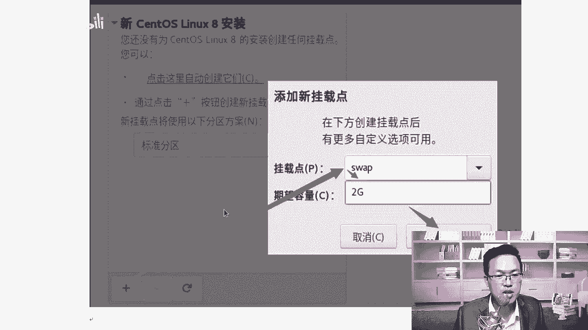
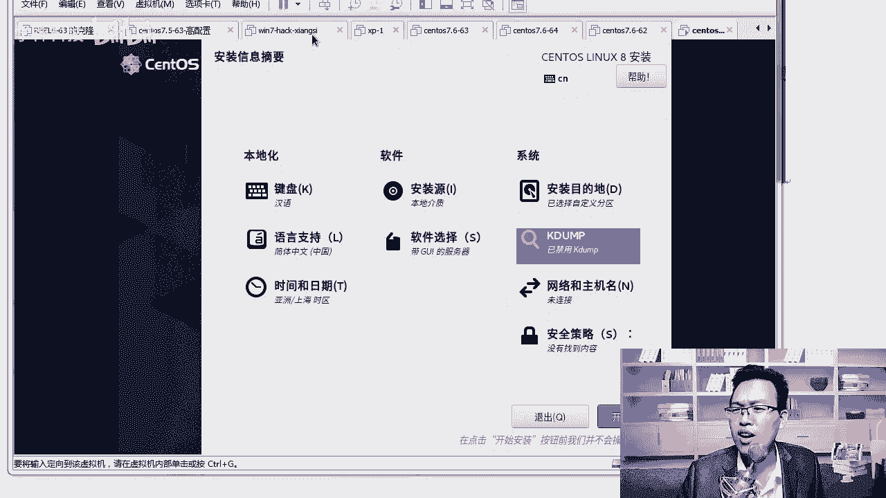

# Linux／RHCE／红帽认证／云计算／Linux资料／Linux教程／运维云计算／全国首家Centos8系列课程 - P4：4-配置centos8操作系统参数并自定义分区 - 学神科技 - BV1BZ4y1g7TE

好，我们稍微等了一会儿，可以看到了这个界面啊，这个界面就是谈到的第一个界面就是选语言环境，默认是english。那我们要选什么呢？我们往下拉。对你要选择chinese好，你要选择中文啊。对。

在这里大家选这个chinese就可以了。那么chinese里面有简体中文和繁体中文。好不好？那这里还有一个繁体中文，中华人民共和国香港特别行政区。好吧，中华人民共和国香港特别行行政期。

还有一个是新加坡简体中文，你应该选择简体中文就可以了。清楚了吧？其实我跟大家讲啊，就是。😊，你们可能接触的开源软件比较少，你知道吧？就是这个地方好，这个地方对于一些新型的软件。

比如说像zas或者ELK啊，kebinna或者普罗米修斯等等一些新型的一些软件，包括get lab。😊，其实它里边只有简体中文，只有繁体中文，根本后面没有什么香港，没有什么台湾的概念。

大家能看出来点意思了吗？啊，这说明中国的这个地位是吧越来越强大了，就是简体中文，就是繁体中文，没有必要把台湾把香港还要单拎出来。能理解我的意思吧？所以这一代人是吧？

我希望因为我我装系统装了从松屠S3松屠S4就开始去装那个系统啊，一直装到现在stoS8是吧，一直是这样啊，我希望等s图S9的时候，上面只有一个简体中文，繁体中文。😊，好不好？需要什么？

需要靠我们这一代人不停的强大钱。😡，靠我也靠你。好不好，你像今年是吧中美贸易大难干的是呢？如火如荼是吧？时不时特朗普出来搞一个事。😊。

再加上今年新冠呃新冠疫情。啊，这个时候是吧大家更应该重植是吧？万众一心啊，让中国强大起啊，让中国的开源，让中国的芯片是吧？都强大一起，行不行？😊，要这样啊，在咱们这一代人是能看到这个希望的。😊。

至少装系统的时候没有必要是吧？单拎出来，我就不信是吧，你整个繁体中文，台湾人看不懂还是香港人看不懂繁体中文。😡，好吧，整个操作系统系统里面才有几个中文啊。大家说是不是不就是个新建是吧？创建啊。

这些最基础的嘛，肯定是能看得懂的。好吧，但是在这个地方就能感受到什么。😊，对你就感受到国外对。怪的这种。好，不说不多说了啊。😊，对吧一句话，你我都好好把技书学学好，强大起来。😡，OK我们选简体中文。

好不好？😊，我们选简体中文。点继续啊。实际上这个操作性不是中国人造的，是吧？😊，中人造的把英lish史是吧，美式的、英式的、法式的全都给你是吧？来一遍。是吧印度啊english对吧？

印度也说english英语是吧，那为什么english那里来个印度的？

开个玩笑啊，就是一句话。😊，啊，不论是从个人还是从大的国家层面上来来说，我们都应该好好的努力。好，都应该好好拼搏。你我这个年龄正是。正是拼搏的时候啊。好吧，所以不用担心，而且搞linux。

搞li搞lininux的时候，我经常跟大家说一句话，就是linux像什么呢？对，就像这个老中医一样。😊，好好，越老越值钱。啊，他不像开发，开发可能是个青春饭是吧？干了一段时间。😊，啊。

我老师我到30多干不动了，我到40岁啊，干不动了，很少有开发到40多了。除非那个时候你已经成为真正的管理层了。但是搞lininux运维没关系啊，别说干到40岁了，你就干到50岁一样O的啊。

lininux运维。如果说我们的平台不出问题的话，其实你的工作是很轻松的。😊，知道吧？除非你，而且一个公司不能不可能天天的上新的平台。😡，能理解我的意思吧？所以你选择一个好的方向方向啊。

干到一辈子都没有问题。像MK我现在是吧，30多，我干到40多，我去讲linindowux课程，一样是比现在更好。因为我的各方面经验更丰富了。😊，对吧你也一样啊，lininux就是个老中医，越老越值钱。

行吧。

记住这句话啊，所以你可以放下心来好好学了，而且064。😊，只要你肯努力就能学得会，因为他很多东西都他都是死的，需要靠你去记啊。😡，好，我们来安装这个系统。安装系统的话大概有三列，第一列是本地化。

第二是软件，再就是系统。那。键盘就选汉语的默认就可以，你也不用非得选个english啊。啊，音式键盘不用语言的话，一定要显示简体中文。默认如果你是以中文方式安装的话，那它简体中文就自带了。

所以这个你不用再去选语言了，时间的话这个需要选一下。我们来点一下啊，我们把时间需要点一下。那我们在这个地方。好吧，亚洲上海啊，亚洲上海啊。😊，为什么要选这个呢？因为后期我们要做数据同步的时候啊。

或者我们在做一些日志记录的时候，你的时区是吧，几点几分访问的，我们在做日志的时候，要根据你的时区去设定时间的。好吧，所以时间这个地方大家一定要选对的时区啊。呃，安装介指本地，然后软件的话要选。

大家第一次装lininux系统的话，你选带G带GUI的服务器。如果你已经是是个老鸟了，你已经对linux很熟了，或者工作中是吧，你就选最小化安装，这样的话安装的时候非常的快，就几百个包很快就装完了。

好吧，而且装的越少，你的风险是吧？出问题的。出问题的次数就越少，清楚了吧？因为很多软件都可能带有漏洞。啊，所以我们但是呢对于初学者来说是吧，你可能不太习惯怎么样，上来就是黑乎乎的一个。😮。

一个什么命令行的一个界面，所以我先教你带GY的，你先感受一下它的图形界面好不好？如果你已经会了，那你可以直接装最小化的啊，就是lininux已经有底子了。😊，然后选完以后选什么呢？

你要把这个开发工具选上在哪里呢？哦，我们来把这个开发工具给大家选一下啊。好，这个地方啊基本的开发环境。这样的话，我们在后期讲源码编译的时候是吧？JCC。😊，啊，这些编译工具是吧，他都会帮你去怎么样装上。

好吧，要把这个装上啊，你最好化安装的时候，也要把这个对勾是吧，打上，这样编译的时候会快一些啊。好，我们点一下完成。它对它的确认按钮是在上边啊，不是在最下边啊。那让它自动去检测一下，然后已经变了。

变了以后呢，安装安装目的这个地方从这儿开始选，选的时候，你要选对应的磁盘。好吧，你要选一下词，我们要默认这个地方已经打上对勾了。😊，好吧，自动分区还是自定义。对我们选择自定义下啊。O。好。

我们往下看一下，这个下面就没啥了啊。好，要不要加密我的数据，不用，你选自定义，选完自定义以后点完成。😊，OK这个默认已经选择上这块磁盘了。你如果有多个磁盘，你在上面打对对应的对勾就行。好。

想要在哪块磁盘上装系统，你就打上对应的对勾，我们只有一块默认就行，点完成。点压完成以后，我们会进入这个磁盘的界面啊，我们来稍微等等，我们来划分一下磁盘的空间。默认这个地方看到的是LVM。

是吧你你应该选择的是标准分区啊。好吧，LVM是逻辑卷的意思，可以自动扩扩容。将你的磁盘空间不够的时候是吧？扩容我们不用扩啊，先来个标准的就行。OK好，我把这个地方也给大家总结一下，记住这里好不好？

我们这里选择标准分区就可以了啊。😊。

啊，标准分区标准分区的以后呢，我们选。选多大好吧？在这个时候我们去点这个加号，点这个加号的时候可以创建新的分区。那么怎么创建呢？我来跟大家讲不的分区，你们以前的老师跟你们讲不的分区是给多大的。😊。

看到啊，新建一个分区。那么第一个叫不的分区，不的分区是引导分区，就是我们操作系统的内核好不好？还有引导项啊，都在这里面，你应该给多大，期望容量是多少？你们以前的老师是不是都给你们讲了200兆？是不是？

啊。后来有一些老师可能会跟你们讲是吧？嗯，给500兆。对吧。好不好？我告诉你，那个时候在汕通S6，汕通S7甚至到松塔S7就不行了。200兆的空间装完系统以后，可能剩余的空间也就150兆了。😊，好。

这个时候后期我们在执执行什么？比如说工作中我们在执行update，我们去yupate去更新操作系统。比如说我从7。1更新到7。2，7。2再更新到7。3，一直更新到7。6。😊，啊，7。8。

那么在更新的过程中，剩余的这150兆的空间。因为我们更新系统的时候，内内核也要会稍微的怎么样，也会稍带着被更新。这个空间不够用。150兆的可疑空间根本就不够用。那个时候你就无法执行yupate了。

所以所以怎么样呢？一次性给大一点，给两个G就行。啊，或者给一个G1024兆。

你要给一个G啊。这是不同于以往的这个。啊，不同于我们当时在s S6下去做的那个时候都给200兆或者500兆就可以了。你给一个G，这样后期你在更新系统的时候，这个剩余空间是够的，否则肯定有一天是不够的。

😊，好吧，凡是跟你说给200兆就就OK了。那说明他没有真正的使用过somS。😡，至少他没有在stoS上做过系统的升级。升级的时候，他会告诉你空间不够啊。

明白了吧。啊，真不够啊，你自己回去是吧，如果你有系统的话，你去试试。就是当你去update更新的时候，好不好？加杠Y也可以。😊，你去这个是干嘛的？时？是比如说你可以方便我们从7。2升到7。3。

就是相当于打补丁了。

就像我们的微软系统打补丁一样。

O。😊，哎，说到这，我想一个问题，你们安卓手机用过吗？我用过小米的手机啊。并非我在那吐槽小米啊。小米三米3米三那个手机的时候。我当时买的是32G的空间，我觉得挺大的，好不好？你知道米三有个特点是什么？

4G的是做系统盘。😊，好吧，我当时不知道，你知道吧？我就觉得32G无所谓，小米怎么样？凡是小米的系统提示更新，我都下载都更新更新更新更新到最后。😡，系统盘4个G给占满了。知道吧？4个G占满了。

剩下的还有空间，就是用不了。😊，理解了吧，那就是什么？那就是个问题。好吧，就是在分区的时候没有没有做好。

清楚了吧。好，那我们在咱们不要犯这个错是吧？我们在这里搞定。然后呢，接下来swipe分区，swipe分区是交换分区，好吧，交换分区的话给多大？😊。

给两个G就够了。好，那有同学为什么就给两个G就够了呢？😊。

我先给你分出来，一会儿我给你讲原因好不好？然后呢，我一共100个G，然后接下来根分区我们给给多少，根分区给50个G就可以了。

好吧，你的这个根分区如果给的少的话。因为操作系统会产生一些日志，word下的log下会产生很多很多的日志。有一天你的日志满了。😊。

其他地方有空间，你的系统一样会出问题。就像我说的这个米三手机一样，4G的系统盘系统空间没了，剩下的比如说我还剩8个G的空间有用吗？没用，好不好？系统跑不了了。明白了吧。好，我们来说说为什么呢？

还剩49个G呢？为什么这样去分好吧好？第一个bo特分区给这么多类型，你要选一下是叉FS啊。😊。

大家可以看一下啊，它的类型也不一样。在这里你可以选EST4是吧？啊，它现在是不的分区，默认是EST4。😊，对吧啊，那你可以选择成叉FS为什么要选？😊，叉FS呢后面我们要做做一些叉FF叉FS数据的备份啊。

你在这里直接选。选成叉M。然后呢，根的话我们来看一下啊，根的话默认就是叉FSET4是在sometoS7上用的一个系统。好，那swiap呢spe它的文件系文件系统类型就是swepe。好。

OK拿到这些东西以后呢，我们来说说原因，不的分区，好吧，是引导分区类型是叉FS它是干嘛的？引导引导是干嘛，系统引导啊，里面放着grabgrab是我们的引导器。

OK三toS7或者是生态S8给1024或更大一些，这样更新的时候，好吧，会有足够的内存去存你新的内核。OK5跟6上给200兆就差不多就可以了啊。😊，好，这个知道以后呢。

接下来我们还有一个刚才我们所说的swipe分区，swipe分区是什么？swipe分区的大小是2个G是吧？有同学老师，我们应该以前你们老师是不是跟你讲swipe分区应该是物理分区的1。5倍。😊。

或者两倍说过这什么？说过吗？啊，那我来跟你说，那他是说的是错的啊。😡，啊，这就是你为什么要听我的课，我会告诉你正确的方法。😡，啊，不为什么照着书面上的那个东西去跟你讲。😡，清楚了吧。

看着s万分区通常称为交换分区，什么时候用呢？这个东西好吧，当我们的实际空间内存不够用的时候，操作系统会存内存怎么样？对。pos系统会从。OK会从内存中取出一部分不用的数据放到交换分区里面啊。

这样的话就OK啊，就内存不够使的时候会用啊，会用到okK从而为当前运行的运行的程序提供足够的内存空间。那么sap一般应该为它的1。5倍和2倍吗？😊，啊，话是那样说。

但是当我们的物理机内存多于16个G以后，你就别给那么大了，你就给8个G和16个G就行了。😊，清楚了吧？OK另外呢，如果怎么样，如果你就工作中也是这样的啊，装系统啊，如果你的系统经常用s分区。

那你说明你的要么系统有问题，要么你的内存真的不够使。😊，好不好。工作中怎么样呢？工作中大家经常见到的，比如说32G的什么，如果你们是你买的不是阿里的服务器啊，你买的是硬件。😡，好吧。

比如说我买了个戴尔的服务器，32G内存，这是常见的，清楚了吧？就像有同学说老师，我电脑都32G的，服务器还不应该吗？对，32G的内存是常见的好吧，更多的如果你买的硬件都是128G的内存。

或者是256G的内存。😊，好吧，如果我是256G的内存，那我含为物理机的两倍。请问你要给多大4？sap你要给512G。有这么大的swipe吗？肯定没用，好吧，正常我们一个sars盘才怎么样。

15000转的一块硬盘我们才死。😡，怎么样乘300个G的空间。啊，一块硬盘就是ss硬盘啊，有同学老师，我的硬盘都是1T2T的。😡，对，我们sars盘ss盘是企业盘，企业盘是15000转好吧。

就转速要快一些啊，你们普通盘都7200转。😮，才这么点，现在能理解了吧？😊，3份。

好吧，1月份不用给他妈的。😡，大啊，你对于你来说，你就给两个G就够了。😡，好，意思一下，知道它干啥就可以了。那么根分区是干嘛呢？根分区的话是50个G叉FS文件系统50个G，有的话还是剩下一部分。

剩下一部分干嘛使呢？😊。

啊，剩下剩下的后期我们怎么样可以练习手动分区啊，到那个时候你就不用添加新的硬盘了。😊。

OK当然其实剩下的这个空间，比如说我们剩下的还多呢，那这个时候你可以怎么样添加挂载点啊，比如说MK，我添加一个什么呢？ok比如说我们添加一个data啊，添加一个这样的东西。然后呢。

这里面专门放我们的数据，好吧，这里面比如说我的200G，你还剩200G或者600G的空间，这个是专门用来存你的什么数据的。😊，这样的话，有一天你的根系统盘坏了，你的数据不会丢失。就像你的C盘坏了。

重装系统并不影响D盘和E盘里的数据。

清楚了吧，所以你的数据盘和这个。系统盘分开来也是可以的啊，我们点完成，他会告诉你，我要消除一些格式，创建一些新的格式，没有问题吧，没有问题啊，叉MS跟是吧？叉MS bootot啊sap。

好，没问题，点接收更改就可以了啊。

不的是引导分区。好，那这样已经选好了，选好了Kd需要开吗？Kd不用啊，你开了以后它会占你的一些内存空间，好不好？所以把它关掉。有同学为什么不用呢？因为K dump是是什么？是内核崩溃的转储机制。

就是当我们系统崩溃以后，Kd能瞬间捕获什么崩溃的原因。😊，对呀，就像你的linux，就像windows一样，windows蓝屏了。😡，蓝屏了以后，为啥蓝屏呢？你知道吗？它会产生一条什么序列号是吧？

你拿那个序列号可以去查是吧？但一般很少有人去查，是不是？😊，蓝屏了重启就行，再蓝屏，再蓝屏重装系统是这道理吧，linux也一样好吧，因为Kd其实它能怎么样存很多当时系统的状态的。😊，把那个日志拉出来。

让你看，你也看不懂。啊，所以我们一般怎么样就不关了啊，就不开这个东西了。这样还省点内存好，你看默认要保留160兆的内存给他用的。好，所以我们就关了它就可以了啊。okK而且linux它一般也不会蓝屏。

也没有蓝屏，这一说，顶多就是卡死。😊，但lininux一般情况下不会卡死，因为lininux啊你就跑你这个服务。顶多是你这个服务卡死啊，你把服务重新启动一下。好吧，他不像你个人电脑什么，什么都装。😡。

是吧什么美女直播软件是吧啊，什么赌博软件你都装上去。😡，别随便装啊，MK5的系统从买了电脑到现在从来没有装过。😡，啊，一一样运行的是吧？很流畅。知道吗？那有同老师，你怎么看？😡，啊。

你怎么看那些啊不正常的东西呢？有看这。😮。

好吧，winN7海客相似。

啊，你要在你的虚拟机里去跑啊，别再真机啊，随便搞啊。

好，那我们知道一下啊。对，有机会我把这个电脑打开是吧？带你看一看。😊，啊，看看你不为人知的什么技术啊。

领略一下是吧？领略一下不一样的人生啊，那那个时候就不是说只看看墙外的风景长什么样子啊。😡，好，我们知道这个啊，那么再往下我们就网络主机名了。网络在这儿就直接配置好吧。很多同学装完系统以后。

总是说老师我这个电子连不上网。😊，很纠结是吧？所以你在这儿就直接连上啊，怎么做呢？默认网卡是关闭的。😊，好不，默认网卡是关闭的啊，你怎么样？你打开一下，打开。如果你们。😊，比如说MK我这里是吧。

是路由器自动分配IP地址的，你看我它就能自动分配1个1。60的IP。啊，能自动你关了它，然后你只要把它打开，能这里自动分配IP地址，那就没有问题。我分配的是1921681点多的IP地址。

所以我配的是一点多的网段，清楚了吧？如果你这里分配的是2点多的IP地址，你就或者是零点多的，你就用你自己网段的。好吧，你别给我用我写个1。63是吧？你也写个1。63，你肯定上不了网。

因为你的物理机就不是这个啊。好，我们点一下配置。😡，在这里详细的去说一下啊。好吧，我要给大家配成静态IP地址，静态IP地址后期方便我远程去连接。好吧，在这里我们选择默认这个网卡名字是应S33。

你的网卡名字可能叫ES38。或者要ENS其他的名字。有区别吗？没有区别，他这个名字是根据你的主板信息上的网卡信息是吧，识别的。你们也叫ES33吗？有没有人不叫1233的这块选手动啊，不用选自动啊。

选手动，然后点添加。你们也叫ENS33吗？1921681。63。好，子码页码按table就可以切换啊，或者你鼠标点一下子法页码24，就代表255。255。255。03个25啊。😊，网关的话。

我的网关是1921681。1。好吧，有的可能是ETH0是吧？没有没有这种可能啊，少啊极少啊ETH0。😊，现在都因S什么什么。啊，应该ES38或者ES33，这是最常见的啊，还有37。然后DNS的话。

我们写写个谁呢？你可以写你的网关，也可以写8。8。8。好，我写那个地方。就可以了。然后呢，我们点保存。看清楚啊，1。6324保存。侬保存完了以后。你看一下，对，保存完了以后已经变了啊，这个IP地址1。

63。😊，1。1。好，主机名在这里就直接配置成功就行了。好吧，主机名写什么呢？你跟我写成一样的啊，学尬的63点C有同老师为什么要写成一样的？因为后面我在敲那些实验的时候，我不会再说IP啊。

我都是说学尬的63学尬的63代表的就是1。63这个IP地址。😊，好，有同学这个还记不住吗？记不住，后面我教我教你做集群的时候，舞台机器一起开启。😊，IP地址你都不知道是哪个配IP的时候都都怎么样。

你都懵逼了。😡，啊，所以你就直接写这个就行，你主机名你就写成一学杠的63。然后这个IP的话，如果你那儿。😊，比要是0。63也是可以的啊也是可以的。IP地址根据你你自身的网络情况去配，好吧。

如果你是校园网。啊，绑定了mac地址，那你就使用net模式net模式这块是自动分配的IP啊。好，这些都OK了以后呢，我们点一下应用。😊，要点一下那个应用啊，你看主机名变成悬杠的63IP1。63。

一切没有问题点完成。我们就可以愉快的。等待他了啊，安全策略没有找到内容，先不用配这个啊。啊，不用陪他。这一切都没有问题了，好不，最后你自己再看一眼成语。😊，汉语简历中文，亚洲、上海是吧，自定义分区的。

然后网络也连接上了，点开始安装就行了。然后你就可以怎么样抽根烟，放松一下。我问大家个问题啊，你装系统装了几次才装成功。啊，一次就装成功了吗？账号密码没设置啊，你给他配一个。123456。

我用的密码都是123456。好吧，我没有起一个很复杂的密码啊，所以所以后期所有的课程里边内容都是123456，这样你就不用浪费脑细胞去记这个密码了。你可以把更多的时间和精力放到技术上。😊，好不好？

工作中你别起123456啊。O。😊，好，那你需要点点两次啊。

然后先不创建任何用户，一会儿等他装完以后再创建。好唔好。我们稍微等等它啊，你看正在下载软件包，其实它是从光盘里面去读这个数据。ok。还有一就是网卡信息这块啊，我的是。

ENS33是吧，有的同学可能是ES160。也正常啊。好吧，这个ENS160也是完全正常的。清楚了吧，这个也完全没有任何问题啊。😊，咱们稍微等等他啊。

那这个地方你慢慢的安装一下啊，它的安装大概是1000多个包。如果带了图形界面的话是多的。好，这个包比较多啊。我另外在这说一下啊，就是装系统这个事情，大家不要不要嫌麻烦，我装的次数绝对不比你少。😡。

知道吗？

好，不说其他老的版本，我们就简单的展示看一下。你能看到的就这么多了。啊，是什么六了，宋头S的fi的，就是很多东西你可能都没有搞过的。都有。啊，所以呢大家装系统第一遍装错了没关系，多装两遍，直到什么呀。

直到装成功为止，技术在于折腾。我记得我那个时候装stoS装了一星期7天没有把系统装上去。怎么样，我也没有放弃是吧？对，所以我现在能做到的给你讲课了好吧？所以大家在后面搞技术的时候，别放弃。😊。

啊，搞失败啊，搞失败的大不了删了它是吧，重新再新建个虚拟机。然后我们稍微等等它啊，让它安装一下啊，这个安装的时间可能稍微会长一些。😊。

大体上就是它正在安装，安装完了以后呢，你需要怎么样等对，咱们稍微等等它。这个时候你可以稍微休息会儿，等安装完了以后点重新启动就可以了。

