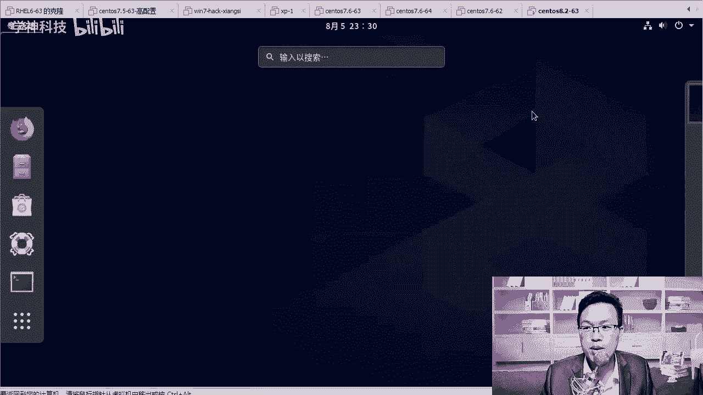

# Linux／RHCE／红帽认证／云计算／Linux资料／Linux教程／运维云计算／全国首家Centos8系列课程 - P5：5-操作系统重启后的相关配置 - 学神科技 - BV1BZ4y1g7TE

咱们等了好久，那终于这个地方装完了，装完了以后，我们点重启就可以了啊。重启以后，它会重新把系统加载一下啊。

默认就行啊，你看这里有个3秒呃，5秒倒计时。我们稍微等等它啊，大家可以看到这个界面变大了，有没有感觉到隐隐约约有个8是吧。😊。

就是原来我们。装生特S6的，它还需要装VM toolsth。啊，那么从斯S7以后，系统里已经自带了这个VMto了，就装软件的时候就给你装上了。所以你不用再额外的去装这个VM to啊。啊。

我们的操作系统里边已经自带了啊，那这样就挺好的。这个VM to是什么功能呢？呃，它能让我实现什么？实现我们把物理机的文件直接拽到虚拟机里面啊，虚拟机的文件直接拽到物理机上啊，当然还有很多功能。

比如说我们的窗口可以变大啊，显示的这个图形界面窗口可以变大啊，变得大一些。因为因为默认的话。😊，它是一个很小的一个窗口啊，就800乘600左右大小的一个窗口啊。

好，我们来到了这个界面，大家直接点一下未接收许可证，那你肯定肯定得接收，你点击一下，点击一下，点我同意就可以了。好不好？点完同意以后点完成啊，这块就O了。完成以后呢，我们点一下什么呢？

我们可以创建个用户，好，协议完成了以后，咱们在这里创建一个用户。默认它是需要你创建一个普通用户的啊，那在这里我们点全名，我的全名是MK好不好？咱们就写一个，然后需要密码才能使用123456再写一次。

123456。这样我们创建一个用户，你的字典太简单是吧，必须摁两次啊，完成才行，那我就点两次一次两次，这样就okK了。然后点结束配置。😊。

鼠标这时候找不到的时候，你摁下cttrorl加。

什么alt键它就可以弹出来了。好，那这样的话又启动成功了，启动成功了以后，怎么已如的默认情况下，你你要点MK，然后输入账号密码去登录。但是我们没有这个必要，你直接点未列出就行。对。

在这里我们直接点什么呢？点这个未列出，好吧，你点一下这个未列出，然后选择什么呢？选择直接输入MK相关的。😊。

好，账号就可以了。来，我们看一下啊，我们点一下这个未列出，然后输入新的用户名，谁呢？rootro它是不会给你列出来的啊。😊，啊，我们点登录123456好，我们点登录。

这样的话我们就直接啊以超级管理员的身份登录上去了。前期大家作为初学者是吧？你直接上来用如的账号是没有问题的。好，搞花了以后，你还还原快照就可以了啊。

工作中可能你作为一个初初级的lininux运维公司也不会给你这个如的权限，如果给了你如的权限，你用的时候要注意啊，多注意一些，多小心一下就可以，好不好？首次登录的话，他会给你弹一些欢迎信息啊。

我们点看一下就行。好，这个欢迎信息已经出来了啊，出来以后呢，我们点前进就行啊，wecome to默认就是汉语。那我么点前进。😊。

前进还是汉语，隐私地理位置可以打开，也可以不打开啊，我们就关了它就行。点前进，你有谷歌账号需要登录吗？啊，没有没有，就跳过。然后一切开始使用，那就开始使用吧。对，那么到现在为止怎么去啊。

谈还会再给你谈一个消息啊。😊，我们稍微等等他。对，一键开始使用了以后呢，它还会给你弹一个帮助文档是吧？d help的帮助文档，你直接把这个gen help这个帮助文档给它关了就行啊。

各位用啊就是一些小的技巧好，我们在这里直接关闭就可以啊，直接关闭它就可以。如果你想看的话也可以啊，就是。😊，它有一些小特效，好吧，大家可以打开看一下。关于图形界面上的一些特效啊，大家可以可以播一下啊。

对，怎么怎么弹出来是吧？😡，然后键盘上的一些布局和按钮。好，知道一下就行啊。比如说最简单的第一个是吧，我就关了它啊，以前我们在7里面是吧，就是右击啊，咱们在如果在7里面就是右击就可以打开终端啊。

我在这里右击，然后可以选择打开终端，就命令行的终端。那在八里面不行，八里面你得点那个活动。😊。

啊，点完活动会弹出这样一个页面，然后你点这个终端。

啊，对你得这样才可以啊。这样的话你就可以在这里面去敲你想要的命令了。好吧，双击这一块就可以变大或者缩小。

OK那比如说我们在这里啊，我想。😊，拼一下谁呢？拼一下百度点com是没有任何问题的。啊，这样的话是通着的。好。那这是操作系统的安装。

