# Linux／RHCE／红帽认证／云计算／Linux资料／Linux教程／运维云计算／全国首家Centos8系列课程 - P6：6-vmware虚拟机12个使用技巧 - 学神科技 - BV1BZ4y1g7TE

那我们安装完系统以后，如果大家不用它，那就执行第一个命令安安T0，这样就可以把它给关机了。好不好？关完机以后呢，我们再说一下vemre的12个使用技巧。

那么第一个虚拟机的技巧就是我们如何怎么样增加一下我们物理机呃，增加一下虚拟机的内存，假如说我现在给的两个G是吧？你觉得不够了，你希望增加到更大的可以吗？可以啊，这边先让它关一下机。

增加内存是需要在关机以后才能增加的啊，所以我们正好把它关了一下是吧？关闭以后呢，点编辑虚拟机就行。这些常见的功能，大家就一定要知道啊。😊。

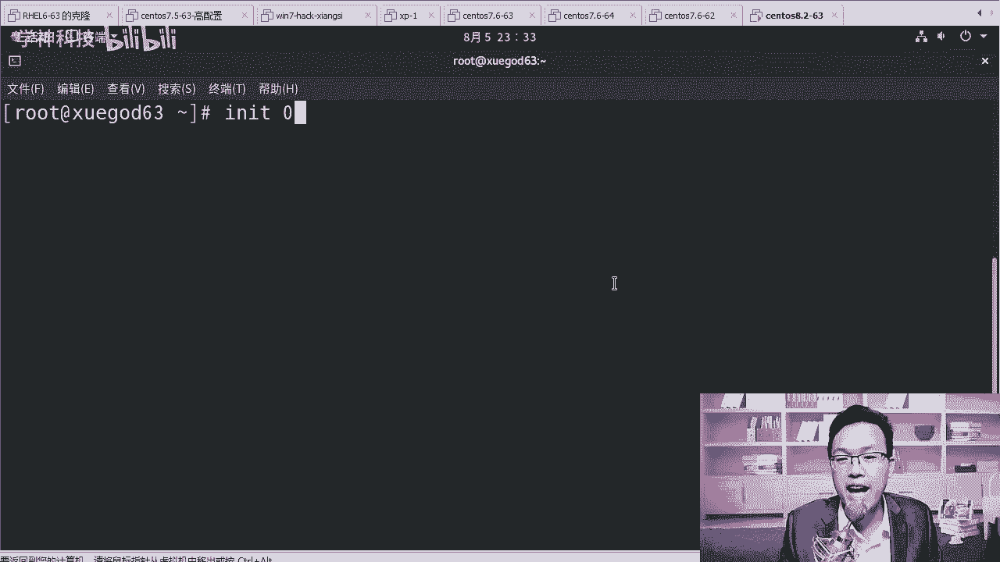

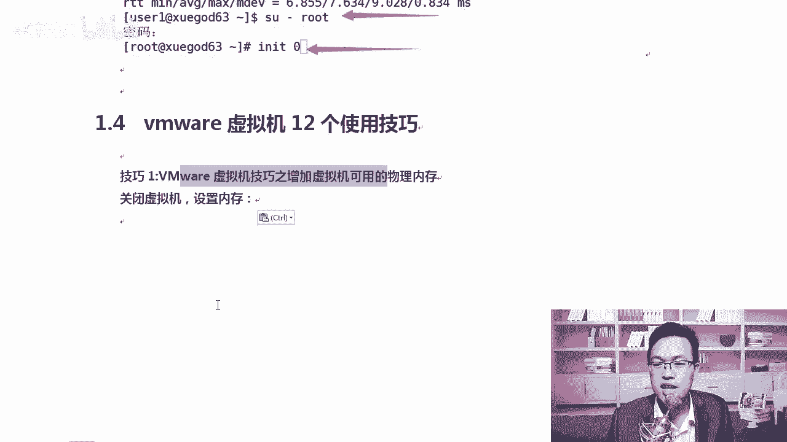

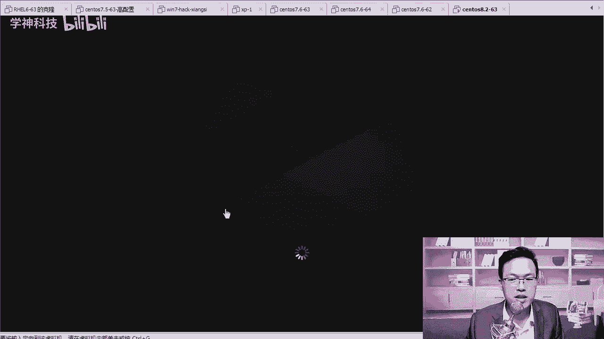

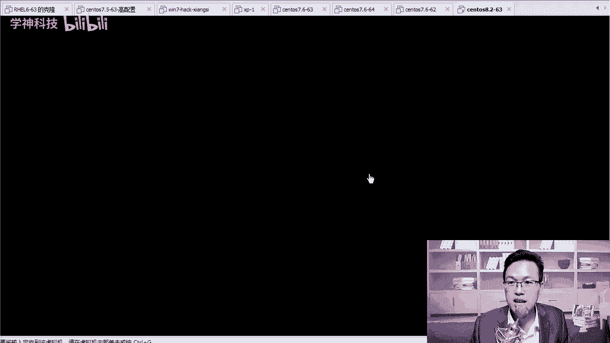

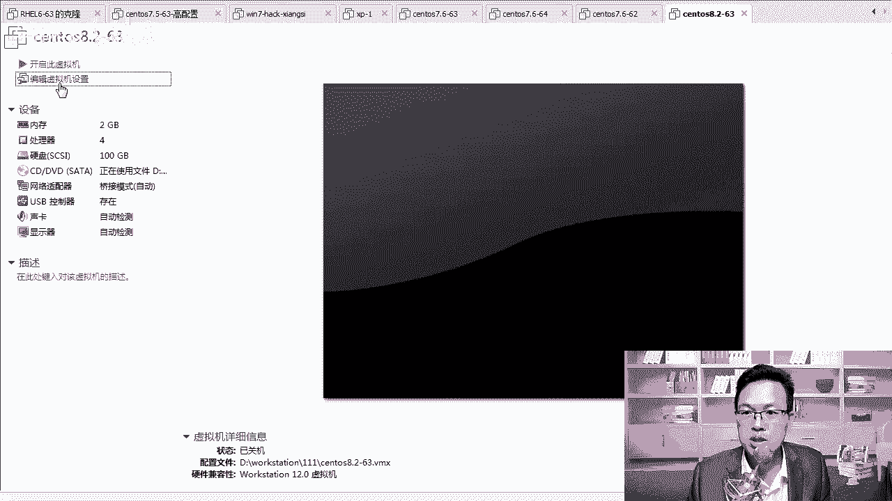

好，我们来看一下。那在内存这个地方，比如说我可以添啊4个G4096。你写4000也是一样是可以的啊，不一定一定要是什么那么精确。

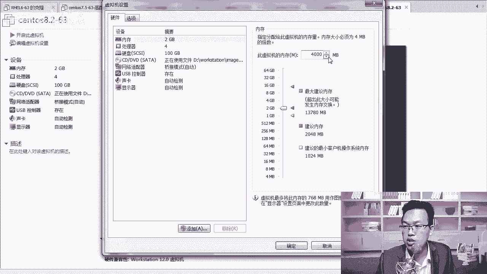

好吧，我就写个4000可以吗？没有问题啊。😊，显示3。9。多一点啊，因为正常它的单位是1024啊，它不会给你写，清楚了吧。然后，这是第一个。那么第二个技巧是什么呢？如果我们想添加一些硬件设备。

那这个也是可以的。比如说我们想添加一块硬盘是吧？我的硬盘我觉得不够用了啊，那可以怎么样呢？还是这个编辑啊，拿到这个地方，比如说我想增加一块硬盘啊，那我们可以点是。😊。

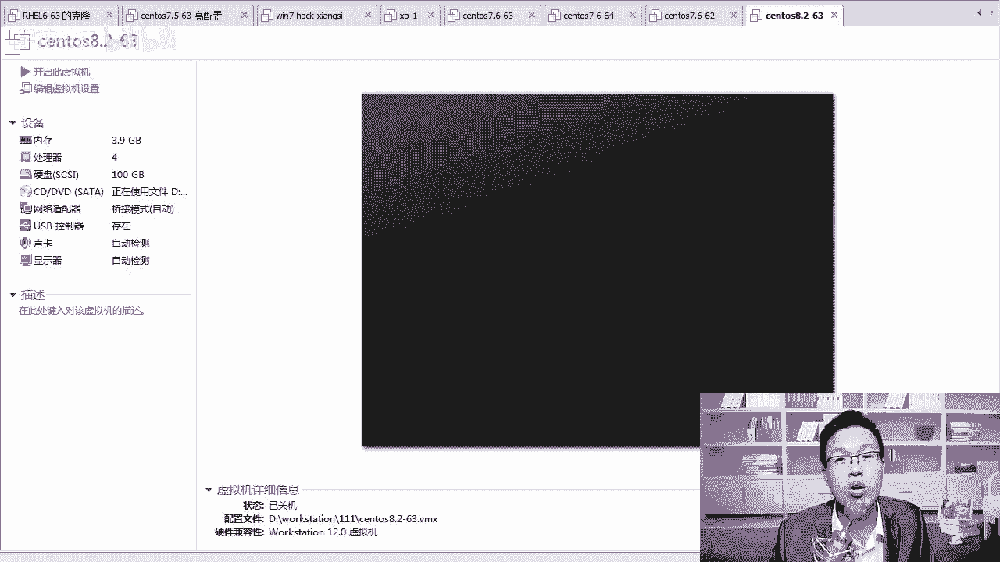

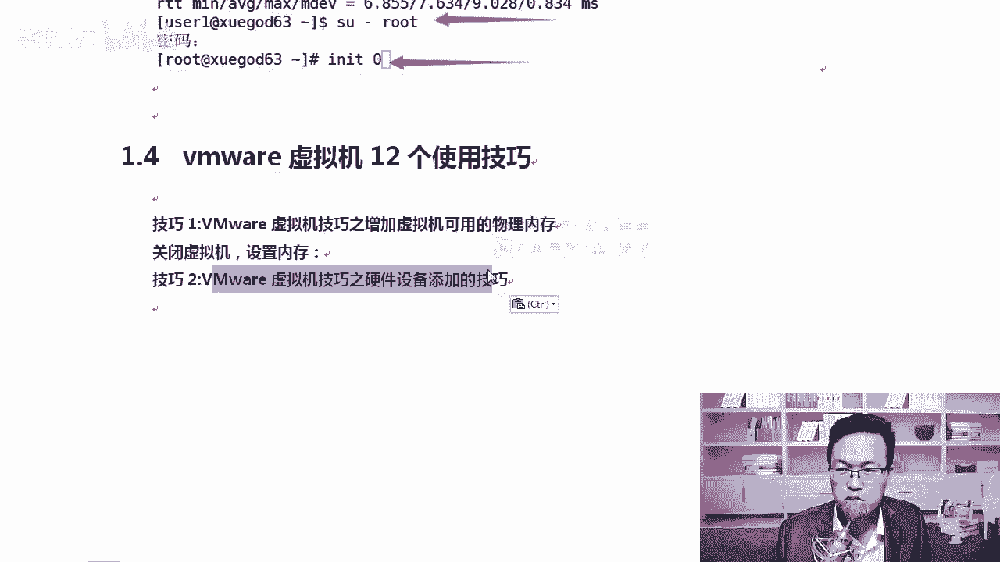

弹出的这个地方，但是然后呢硬盘选择你也可以选软盘，也可以选网卡。网络识别器就是网卡啊。好，我们点下一步，一般我们就添添加sy这种硬盘就可以了啊。下一步创建新的硬盘，再点下一步，然后呢再点。

不要立即分配空间，给20个G默认就行。然后点下一步，接下来点完成，这样就会多一块磁盘啊，我们点一下这个完成吧。那这样的话就会多一块磁盘，你再点确定就真正的添加上去了。好，当然你想移除这个磁盘可以吗？

也可以啊，你点这个地方。这样就可以把新添加的这个磁盘移除了。好，点一下确定。好，这是关于。😊，啊，关于什么呢？关于我们这个设备的添加，还有一个就是键盘的切换啊。第三个技巧就是Vware虚拟机控制啊。

控制技巧就是虚拟机。

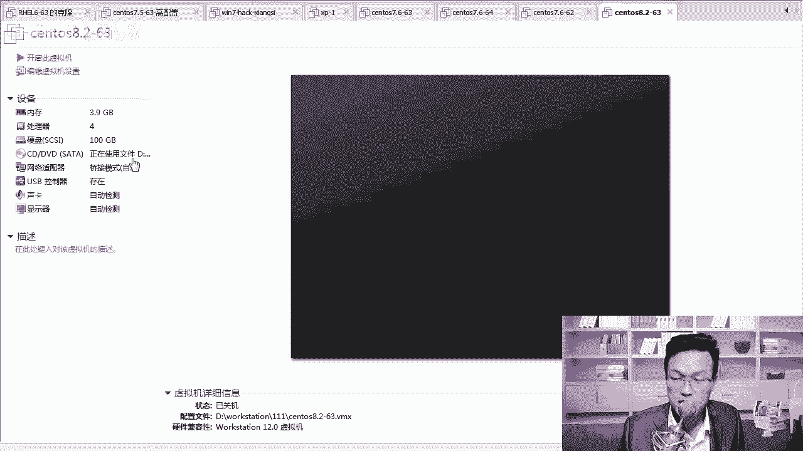

它是怎么样？Vm可以让你在一台机箱上跑多台好吧，所以这个时候就有个系统控制权的问题啊，假如说我的鼠标点进去无法出来，那这个时候摁下ctrl加alt键就可以怎么样啊，就可以切出来啊，这个大家都知道是吧？

还有一个是什么呢？还有一个第四个技巧就是关机。关机这个技巧是什么意思呢？😊，你可以按port off，你也可以直接执行init0。好不好？这个是正常的关机，我建议大家执行什么init令。如果你关不了。

关不了，你再按这个，因为p on这个键是非法的，哪个是p on呢？就这个地方power off就这个地方。

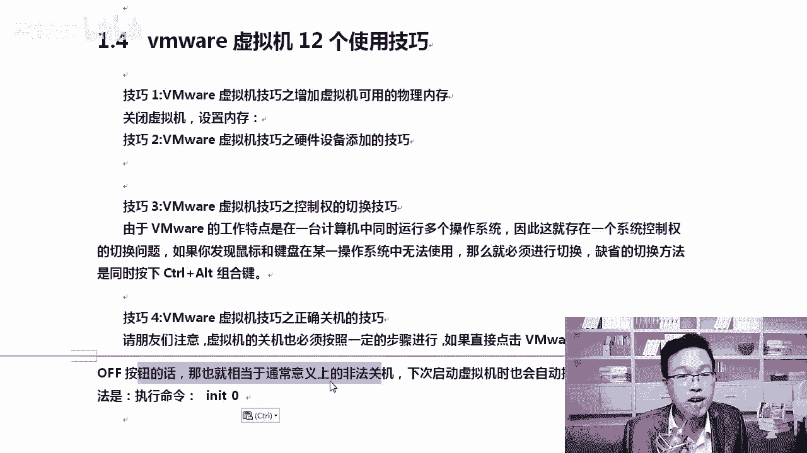

好，我们下拉一下，在这里假如这个虚拟机开启的情况下，你直接点这儿点这个红色。它如果开启这个地方是红色啊，直接点关闭客户机。😊，就相当于你直接拔了个电一样啊，再死机我也能给它关掉。

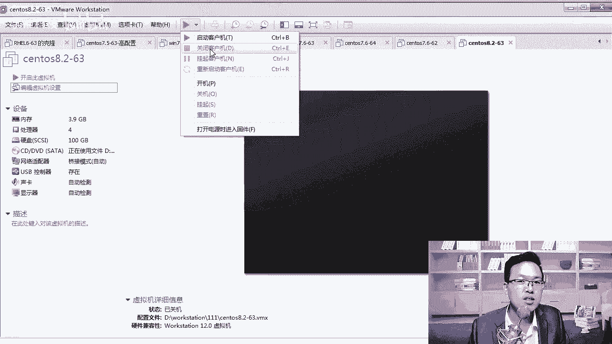

第五个技巧就是发送快捷键了。就有时候如果你是windows虚拟机好，你想调出任务管理器，我们经常在物理机上，我们习惯按ctrl al加delete。但是有时候你这样去结束的时候是吧。

你的物理机也会怎么样锁了一下屏。那这个时候怎么办呢？对我们在这里你可以点虚拟机虚拟机又发送conttrol。😊，alt加这个什么，就是或者你直接摁这个键controrl alt。

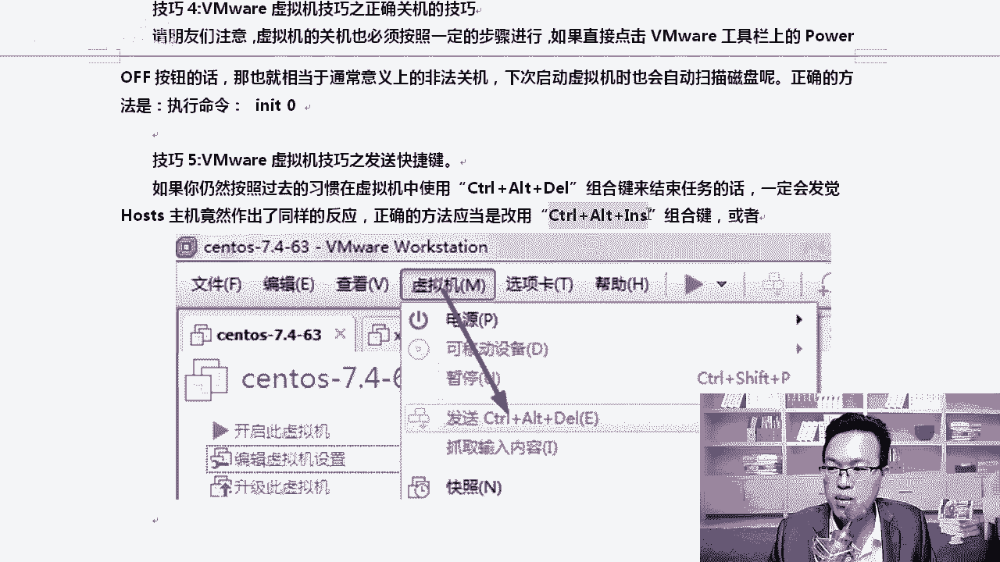

啊，按下这个alt键，然后加insert键。这样也是可以的啊。再或者就是我们直接点虚拟机，我在这里直接点发送。啊，发送这个键，这样就不会对我们的物理机产生这个影响了。OK还有一个功能。

就是我经常用的就是这个地方。好，它可以把这个侧边梁显示出来。因为正常情况下，你这里显示的讯机是有限的好，我这么多讯机你是显示不出来的。😊，O再一个就是下边看到了吗？显示或隐藏这个缩略图标。

就下边有这么多的机器。😊，OK我一般喜欢怎么样，喜欢用这个这个更直接一些。因为我的机器数量太多了。😊，好不好？再一个就是全屏了。😊。

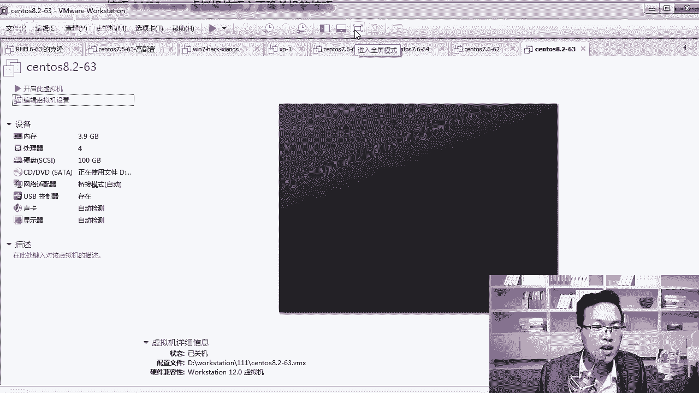

好，点一下这里就是全屏了，全屏以后怎么退出全屏呢？呃，你得怎么样？鼠标往上一放，放到最上边的时候，它会有一个怎么样，放到最上边啊。

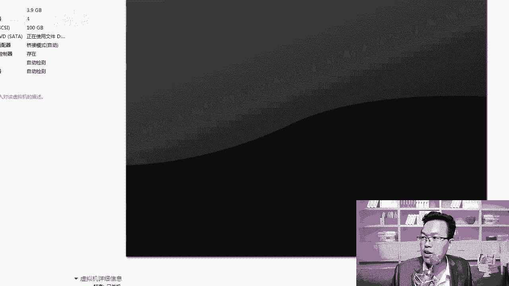

顶到头它会弹出来弹出来一个小窗口，你可以点恢复恢复大小就可以了啊，所以他们三个键分别是这样的。显示侧边显示下边呢显示全屏。好，知道一下。那么再一个就是VMware虚拟机哈Vware虚拟机。

Vware为我们提供了三种网络模式，分别是bridge桥接night网络地址转换和housese only仅主机常见的这几个模式是吧？大家是它是怎么一回事啊，我们来这里给大家聊一聊啊。

对于桥接这种方式就是将主机的网卡与虚拟机的网卡啊，利用虚拟机网桥进行通信。那么在这种桥接的情况下，类似于把物理机跟虚拟机都连到了交换机上啊，交换机上。然后呢，这个交换机再接到一个接口上。😊，去正常通信。

最主要的是桥接这种情况下，虚拟机的IP地址要跟主机在同一个网段，要是一样的网，清楚了吧？都是在一个网段，你不能随便配，好不好？配了，你就上不了网了OK网关和DNS可以保持一致啊。呃，如果大家不懂的话。

我可以画一张图给大家看一下啊。好吧好，看一下啊。交换机路由器好吧，交换机路由器交换机是什么呢？交换机上还有很多的接口，就像你的插板一样啊，就像你们公就像你自己家里的，就是电线的插板一样，好吧？

然后路由器就是你们家里能提供上网，这个O提供上网。那么交换机上有很多的接口，我们的物理机正常情况下拿一根网线或者拿一个无线连到这个交换机上，交换机啊，在经过路由器就能上网。当然你们家用的家用的是吧。

是把这个交换机跟路由器什么样？😊，合到一起了好吧，合到一起了，所以就不分什么交换机和路由器了。😊，OK你们家用的你你看你的家用的路由器上是不是有好几个口，一般都有5个口或者啊或者更多的口。😊，清楚了吧？

桥接是什么意思呢？桥接物理机，你这样能上网，桥接就是如果我虚拟机63啊，这台机器采用了桥接模式，就相当于我63这一台机器怎么样？在逻辑上我也找了根网线，接到了交换机效，我也能正常上网啊。

咱俩都能正常上网。当然咱俩通信是不是也没有问题。😊，好吧，因为咱们都在一个网段是6三根什么跟物理机的通信也都没问题。所以所以虚拟机好吧，调接的方式，虚拟机的IP要跟主机在同一个网段。😊，啊。

那有通哎那n模式呢？😡，net就是这样的啊，net叫地址转换。好，在net模式下，虚拟机虚拟机的这个主机需要记住什么net设备和虚拟的DHCP记住它才能使我们的虚拟机可以上网啊。

那么虚拟机要跟物理机共用1个IP共用一个什么局域网里的IP好吧，虚拟机会怎么样？那那我有同学老说我的虚拟机有IP吗？有你的虚拟机会从呃的DHCP上去获取1个172的IP地址，它会获取一个这种net模式。

虚拟机。你看使用net模式，linux需要配置成动态获取IP地址。😊，好吧好，就相当于什么呢？是这样的。😊，啊，物理机人家还是能够直接去上网的。OK那么net这种方式就相当于我们63连到了交换机上。

那么物理机上自然有一个什么路由器。OK我们连上它那，然后呢，它再经过路由器去上网啊，我们所有的IP地址都是通过物理机上的DMDHCP软件给它分配的。

分配的一般都是1个172的网段的IP这是1个B类的私有地址。那么63能跟物理机正常通信，63也能上网。好，但是呢呃63的IP地址是吧？它是172的。😊，还有一个就是ho only的。警主机警主机嘛。

好吧，houses就是将虚拟机跟外网彻底隔离了。好吧，正常我这个还能是吧上去也能上外网。对吧也能上来吧，使得虚拟机成为一个独立的系统，只与主机进行通信。好吧。

相当于net模式里面去了什么去了net地址转化的功能。仅主机嘛，仅和主机能通信。比如说6三这一台机器是吧？我只能跟物理机虚拟机只能跟物理机去通信。当然如果六三是井主机模式。

然后这一台比如还有个64这一台学霸64这个虚拟机，它也是景主机模式。他俩是可以同行的，但是他们都上不了网。好吧，所以金主机模式这种情况下，一般用来我比如说我们做集群的时候模拟一个内网是吧？

别人都不能访问我们。OK清楚了吧，警主机模式。好吧，只能跟物理机通信，不能去上网，相当于net里面是吧？没有了什么，没有了地址转发，只是大家都连到了交换机上。😊，好，知道一下这个啊，还有一个功能。

还有一个功能是什么呢？就是bis。好吧，这个三种模式大家最主要用的就是桥节模式。慢慢用的过程中，尤其因为有一些同学可能第一次听说这些事情是吧？啊，没关系，你就先用乔节就行，慢慢用的用的你就熟悉了。

所以不着急啊，这些词是吧，先死后活，先记住它，然后呢上手去操作它操作完了以后。😊，哎，操作完了以后你就知道。😊，真是这样啊，我印象最深的是什么呢？我MK老师当时那个时候学学车。😊，啊。

我那个时候学车离合器。如果你考个驾照，或者说你家里有车OK你对离合器。还知道是什么？如果你没有什么对，没有考过驾照，你也没有见过车后啊，自动挡上的那个离合器，离合器是干嘛的？😡，天天说离合器。

离合器说100遍，你都不知道是干嘛似的，只有你亲自上车上是吧，踩一踩操作一下哦，什么时候挂档，挂档的时候我要踩离合器，你才能真正知道离合器它的这个作用。😡，好吧，才能是吧有敌方矢。所以搞技术就是这样。

大家遇到一些陌生的词呢，慌吗？别慌，我第一遍不理解，没关系，我上手动作操作一下，我动手做做实验啊，做出来这一个效果。😊，然后呢，然后回来再看看这个理论就越来越清楚了，都是这样。从理论到实操实操完了以后。

再回来看理论加强，加强完了以后再实操，这就是学习方法。啊，有这个学习方法，再难的知识你也能学得会，何况还有我呢是吧？我不是会教你吗？😊，行，咱们说下这个啊，说完这个以后。

我们再说bisbis这个地方就是bis大家每次启动的时候，大家看到了吗？当我们启一下机器啊。😊。

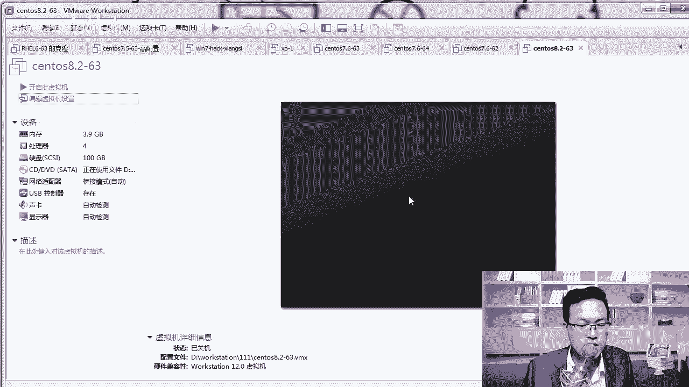

写的时候，你看大家看这个提示啊，它会有1个F2，看到啊。😊，N加F2。哎，我可能摁的就晚了，你看我就进不了这个balos了。那这个时候怎么办呢？当然这个时候你可以直接关按它啊。😊。

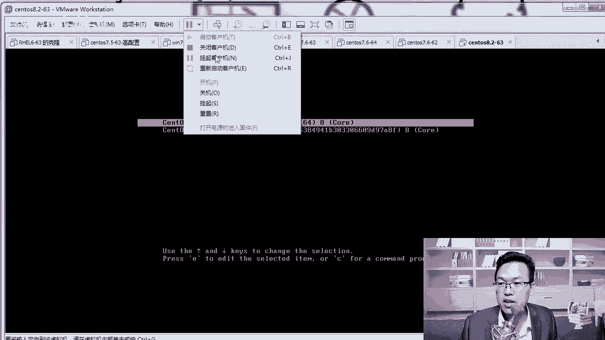

每次他都问NF2，你可能跟不上你的手速。那这个时候怎么办啊，手速不行是吧？30年的单身。😊，手速都不够快是吧？那我跟你说啊，不是你手速不够快的问题，是你的方法问题。😊，好不好？方法的问题啊。

我们可以怎么样呢？在这里啊，这里有个按钮，教你一下老司机教你一个技巧，好不好？😊。

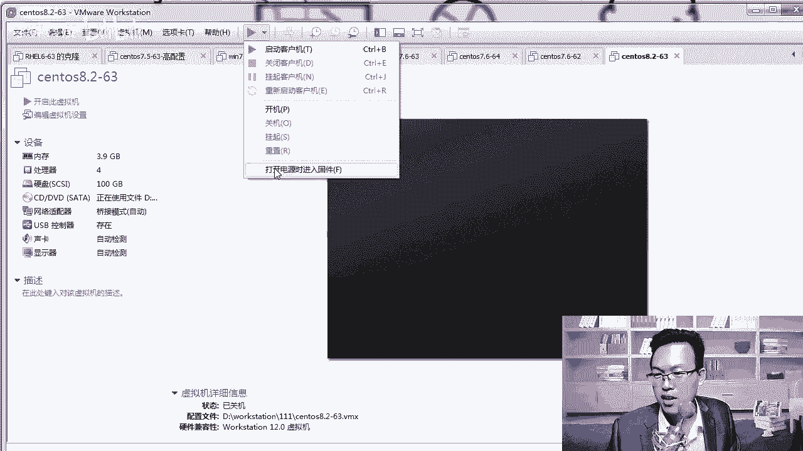

打开电源时，直接进入骨架。啊，你点这个按钮，我就不用摁手速了。你看那个F2了吗？

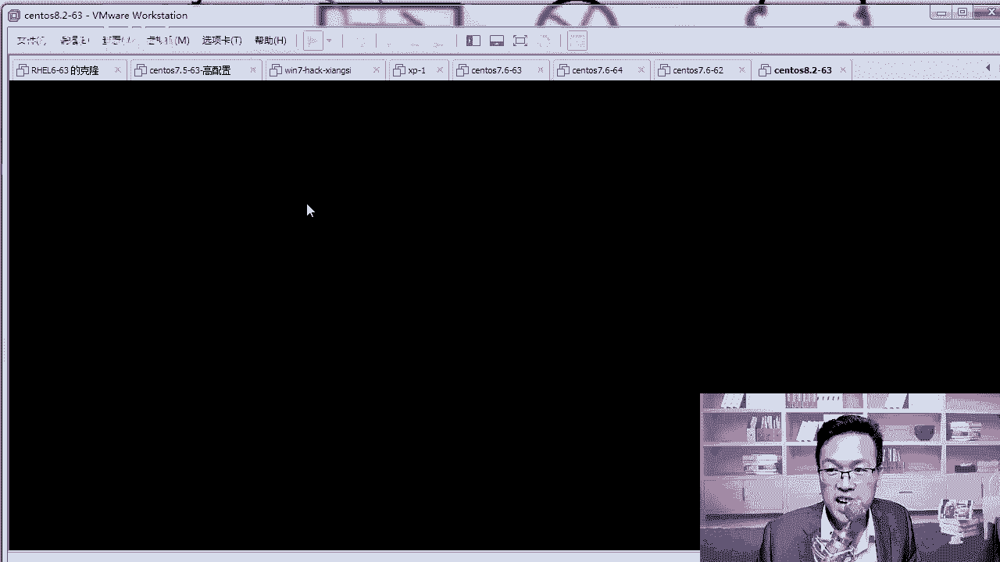

自动进bes啊，一般进这一块干嘛呢？我们摁光标啊，谈到这个bos下，从这里去调什么启动顺序啊，ok默认。比如说我想把H hardd drama调到hard drama就是。硬盘启动CD是光盘。

network是网络啊，网络引导remove。啊，就是可移动设备，就类似于U盘这样的啊，那我想把它调到上面，你可以按下shift加加号，它就调到上面了。😊，好，摁键后，他就往下走了。清楚了吧？

它会一项一项的引导。比如说第一项没有第一个没有数据是吧，它就跳过，然后CD里面没有数据，它就跳过。然后当然CD里面是有光盘的啊，所以我们这个地方肯定要给它调到第一个shift加加号。好，然后呢保存的话。

摁F10好光标弹进去，摁F10就行了。😊，啊，这个啊，他问你你要保存吗？你对你要回撤yes，它就可以正常启动了。

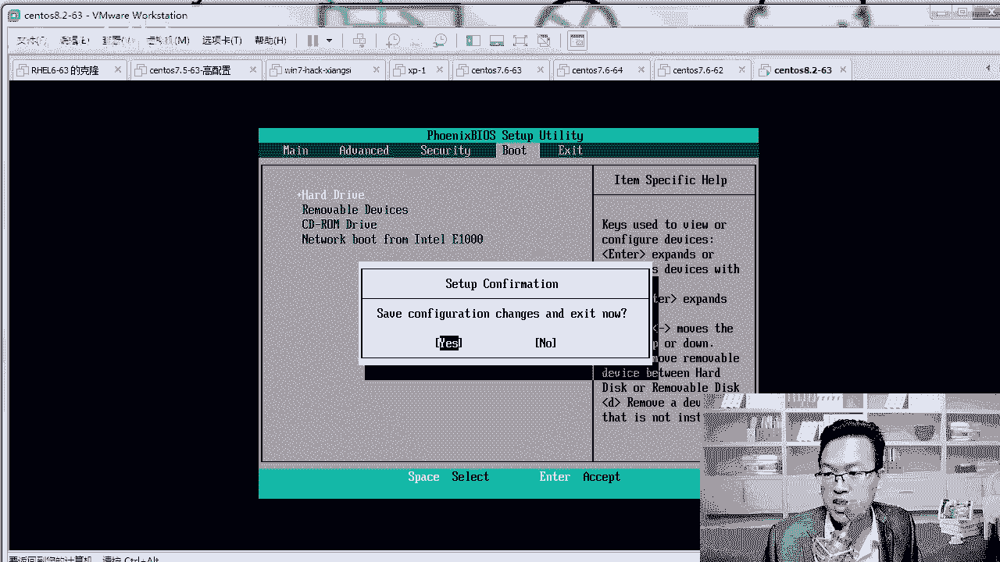

啊，他就可以正常启动了，我就先不启啊，先关了它。

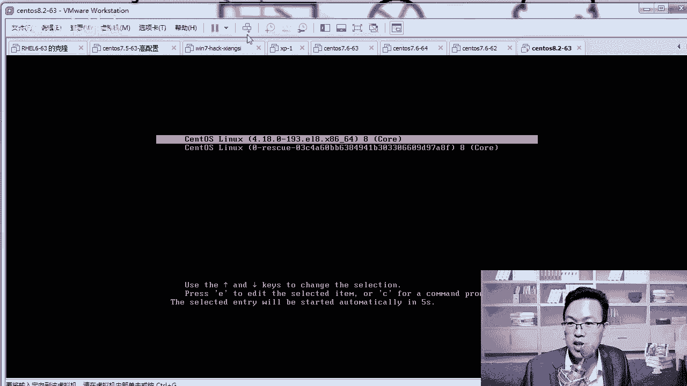

关完以后呢，这是bios，又学了一招啊。好，bios学完以后呢，再就是。😊，第九个技巧第九个技巧咱们说的是VM tos安装VM tos显示分辨率啊，从7以后系统装完以后，直接就有这个东西了啊。

所以我们也不需要再次再次去安装了。就是以前我们装完以后。大家可以看到我这边启动完了以后，这个屏幕挺大的，而且随着我这个窗口变大是吧？它里边的内容也能变大，为啥呢？

在这里有一个你看查看查看这里有一个什么自动适应客户机，好吧啊，自动适应客户机，我这个窗口变大，它就变大，变小它就变小O呃，以前你打完这个do勾也不管用，除非你把Vm two4给它装上好吧。

现在不用装了啊，默认你们就可以用了，已经挺好了。😊，好。这个外面光驱这个大家说过啊，编辑光驱选择选择完的时候，一定要把这个启动式连接打上对勾，这是第十个技巧。好吧，如果没有呢，如果没有的话，没关系啊。

你可以怎么样。可以调啊，就是启动完了以后我们可以调的。在启动完了以后，你看。😊。

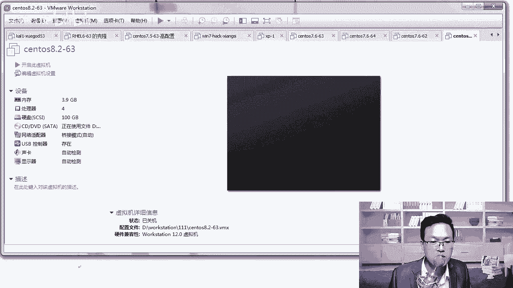

假如说我哎当时忘打对勾了，是吧？那起来以后还可以吗？不用关机，好吧，你可以点这儿。单击单击完以后点设置。好光区这个地方。

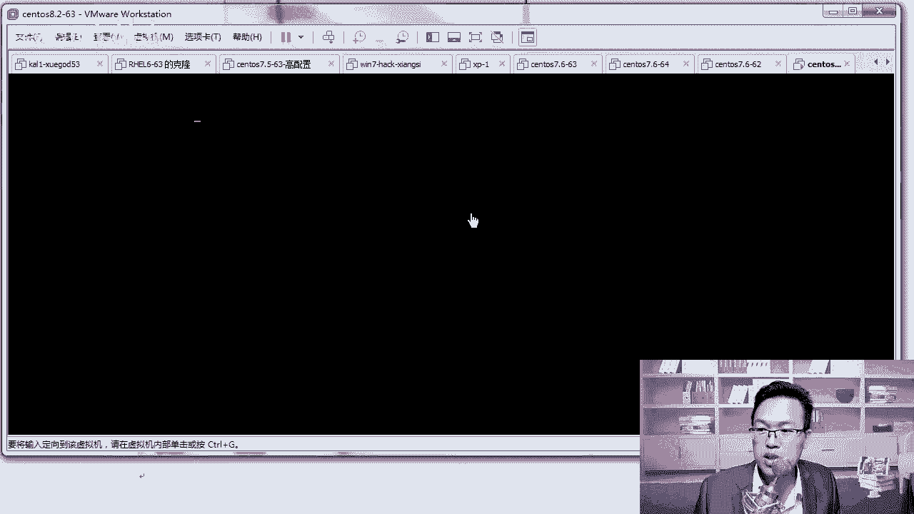

嗯，开机的情况下也可以打上对勾的啊，然后你给他把这两个对勾怎么样都给他打上，都打上以后点确定。

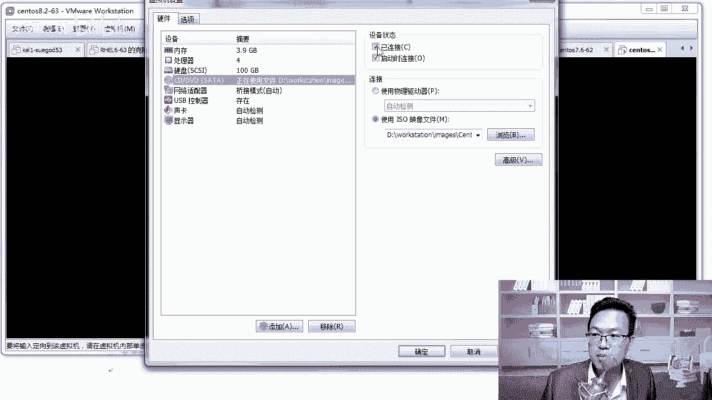

这样的话，你再次去呼期我们想mount挂脸数据的时候，各方面就都O了。

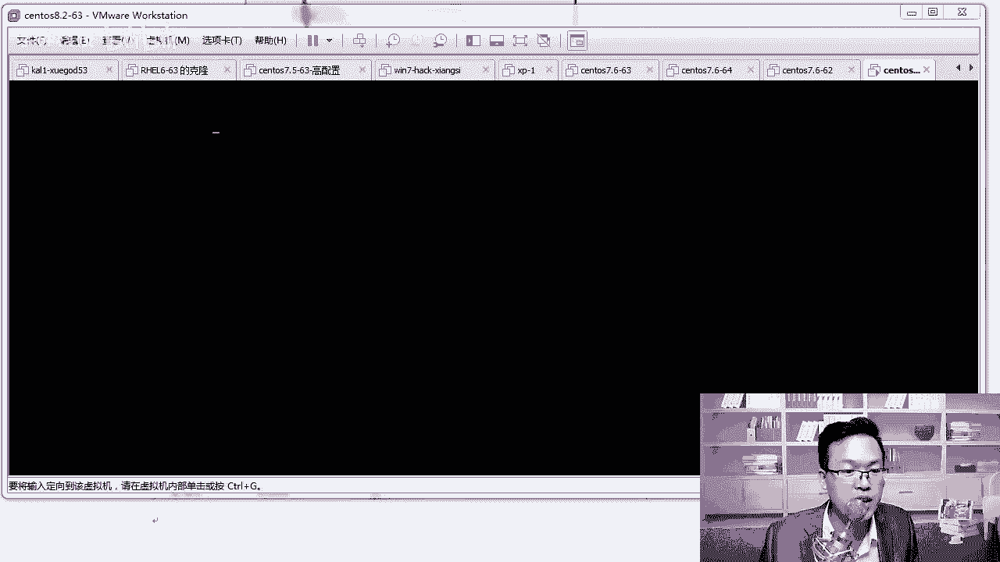

那我再关了它。好，那么再一个就是第11个技巧，就是我想删虚拟机，那我直接从这关了，它算删吗？这不算删除，你真正想要从删除，那你要点虚拟机，虚拟机完事以后点管理，从磁盘中删除，这算是真正的删掉它。啊。

这才叫真正的删它啊。所以你想删删的时候是这样。好吧好，点一下这里。那第12个技巧也是最重要的一个技巧，就是快照。你装完那个系统，我现在不是已经能上网了吗？你要拍一个快照，在这里点拍摄快照啊。

拍快照你自己随便起名字啊，比如说我这个地方安装好了。好吧，你就写安装好。啊，松头S8是吧，然后杠63可用实验环境，我一般会写的是可用实验环境啊。对我一般会起个这样的名字。啊，你可以给他家拍个快照啊。

对我希望在这里是要拍一个点。拍着拍照，这样的话，万一有一天你的系统坏了，系统坏了，你只要怎么样从这里点可用实验环境，它就能恢复。他问你看要不要恢复，你就点恢复就行了。再一个见快照的过程中。

不要开着机去创建开机也可以开机创建啊，那恢复的时候就恢复到你当时开机的时候，那个界面了，这样也挺好的。😊，啊，也挺好的，但是开机的时候。😊，会占用你额外的一些空间啊，磁盘空间，为什么呢？

因为它要把你开机时内存的那段数据保存到磁盘上啊，关机的时候就不用考虑这个的这个数据了啊，内存里的这些问题了。好吧，当然开机也有好处啊，你像我这边我就经常搞一个，你看我这边的快照啊。啊，虚拟机这个快照。

你看我这见了好多呢啊，如果这个地方显示的是个绿色，那说明什么我是什么呀？你看这还有图还大概有一个启动界面，这就是我当时开机的时候创建的快照啊，这个地方就是关机的时候创建的一些快照。😊，都行啊。

如果你经常用这个对因为我。你看这个快照可用时验环境，这个快照，这个我倒是经常用，我不希望每次点一下，还得等那么长时间开机，我直接点转到转到，你看我直接点转到。转完以后，它就是直接转到了什么。

启动后的这个界面啊，我觉得这样挺好的啊。

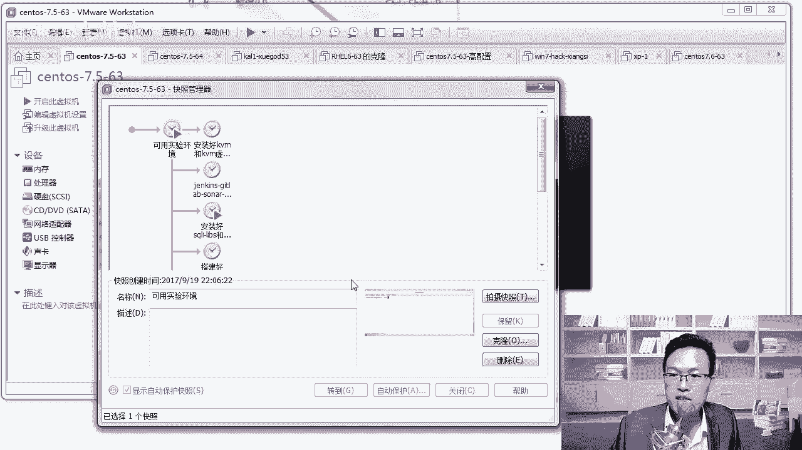

啊，只有快速的就恢复到。啊，已经启动成功的那个界面，它比你慢慢的等那个系统启动要好很多。行，这就是VMV的使用啊，12个使用技巧。那咱们下一节课接着来好不好？

也欢迎你把什么样MK老师的课程分享给你身边的朋友，好吧，让他们更多的人跟着我来学习，加油啊。😊。

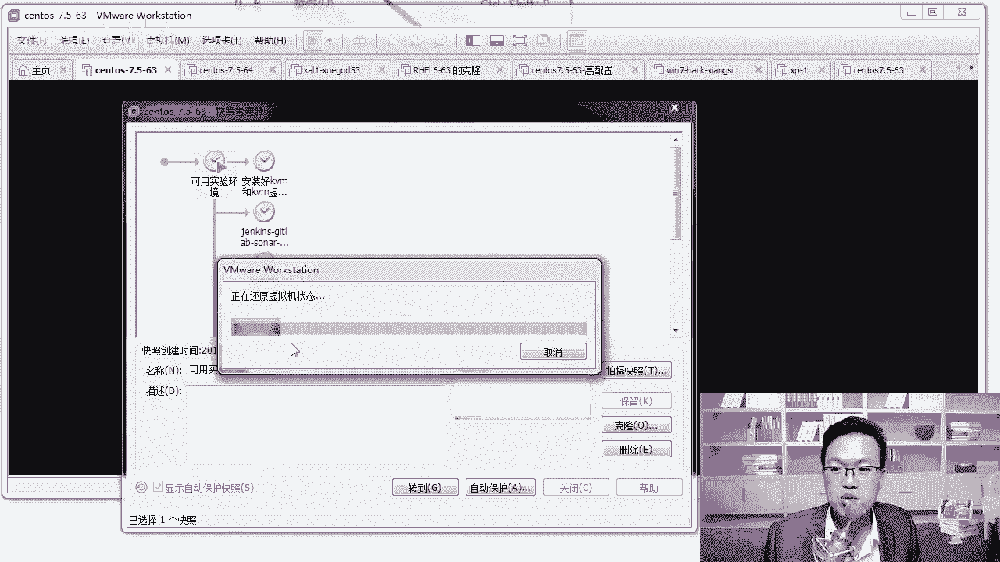

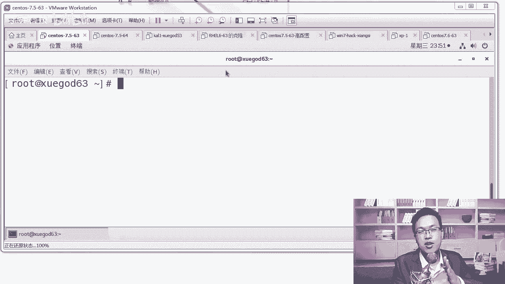