# Linux／RHCE／红帽认证／云计算／Linux资料／Linux教程／运维云计算／全国首家Centos8系列课程 - P7：1-Linux终端介绍 Shell提示符 Bash Shell基本语法 - 学神科技 - BV1BZ4y1g7TE

大家好，我是讲师MK，欢迎你来听我的课程。今天MK老师要给大家分享的是linux基本操作相关的内容啊，我们会介绍一下linux的终端，介绍一下shall啊，通过今天的内容。

我们就能够对linux有一个初步的认识了。而且在最后的时候，我会教你两个项目实战。那首先呢我们看第一个什么是linux终端。其实大家见过lininux终端是吧？

你比如说我们在这里呃登录上linux系统以后，点缀里就可以打开一个终端，对吧？那这个终端的话，我们把它稍微放大一下啊。😊。

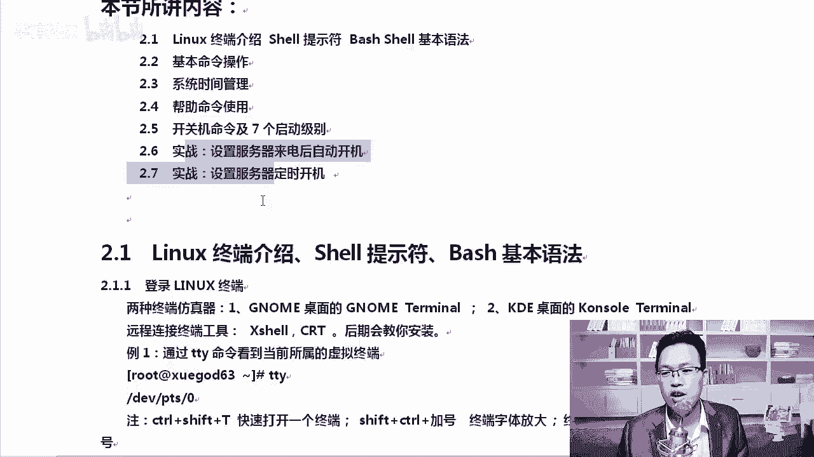

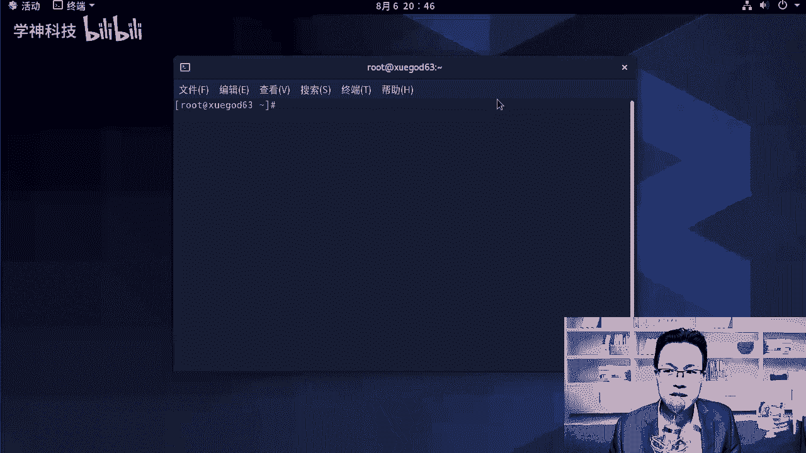

好，放大一下。那我们现在所用的这个终端叫什么？终端，好吧，包括我们图形界面这个地方，我们当前用的这个图形界面。

它叫genome图形界面的中的什么 genomeome terminalok还有一种桌面风格啊，叫KD就是不同的桌面风格啊，就像苹果的桌面是吧？下面啊是一种风格。😊。

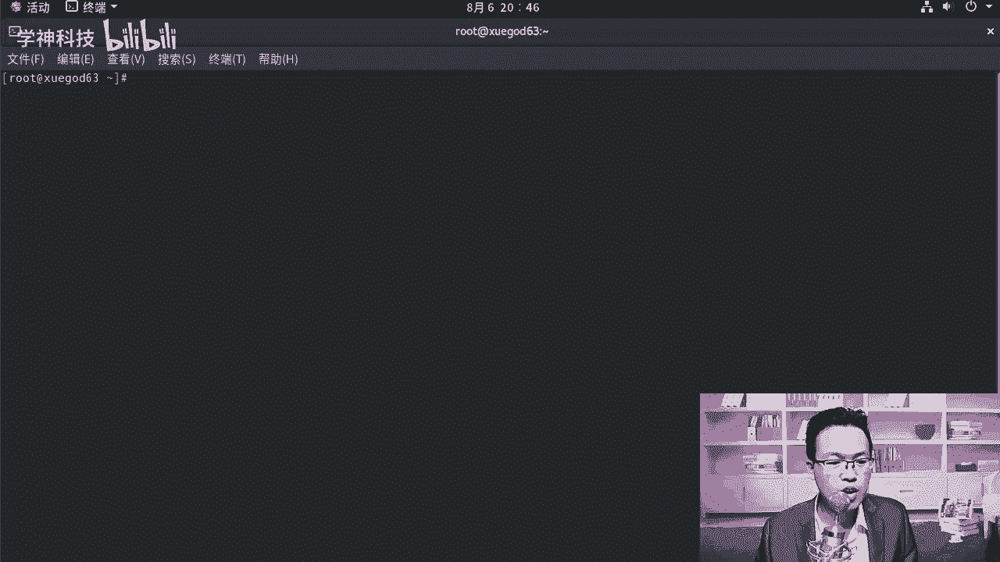

微软是一种风格，安卓又是一种风格。okK远程连接工具的话有叉 shellCRT那这些工具稍后我会去教你安装。首先呢我们打开了一个终端，你输入TTY这个命令，我们就能看到啊。😊。

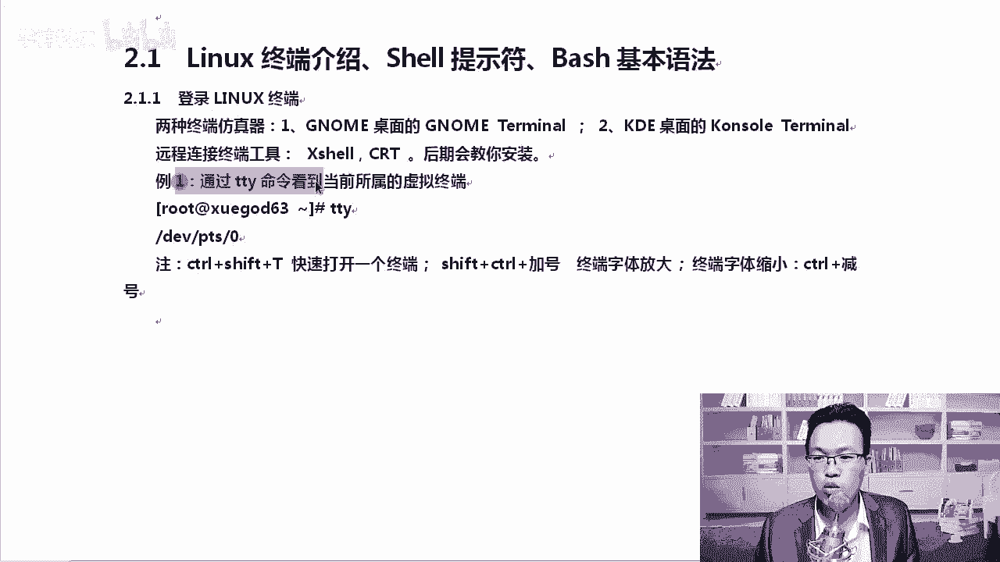

TTY你能查看一下类型。那当前我的TTY如果觉得字数比较太小，我想给它放大，那怎么办呢？control shift加加号啊，这样就可以。有同说control shift为什么要再要叫。😡。

我写的是control加什么shift的是吧？再加加号，其实是什么？其实就是conttrorl加加号。因为加号加号怎么样，你必须摁下shift，否则不摁shift能输出来加号吗？是等号好吧。

如果你觉得这个字体太大了，好吧，那我想缩小呢，缩小就是ctrorl加减号，它就可以缩小。😊，好，这些快捷方式呢大家一定要记得心里，因为后期用起很方便啊。那么再一个就是control怎么样。

我想再打打开一个终端control shift。😊，加什么加T加T就可以再打开一个终端。那这样的话，后期你就可以在两个终端上去同时敲命令了。

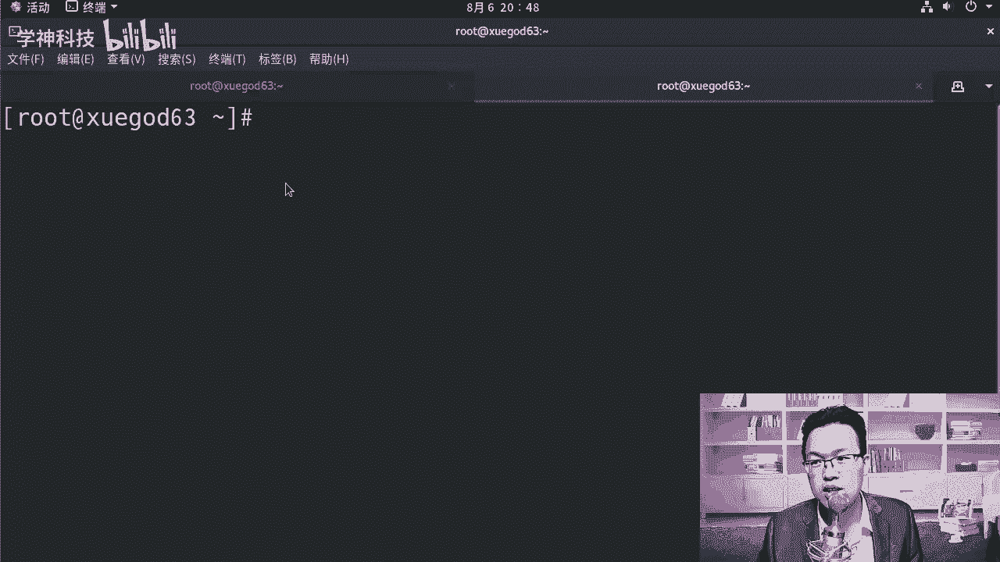

好不好？我把文快计方式是吧，给大家写到这儿，这个时候你应该准备好一个本，一个笔啊，自己记一下。虽然我会给大家发详细的电子版的笔记。但是呢你跟着我同时听什么呀？比如说我听两个小时，你绝对会走神。

为了避免你走神，听老师一句劝好不好？自己买一个本啊，整个笔，你把这些关键字记一下，这样的话，一节课下来，你的听课效率非常的高。听完课以后，照着的笔记快速敲一遍，你就能熟能生巧啊。😊。

因为第一阶段都是基本的命令，他没什么难的东西。😡，需要的就是你赶紧把它记下来，好不好？😡，啊，这些会计方式呢，大家自己找个本快速的记一下啊，我会给大家列到这里。那默认的话是这个黑底儿啊，黑底白字是吧？

我也挺喜欢这个风格的。呃，如果你有其他的风格是吧？那还有其他的风格吗？还有啊我们来看一下。😊。

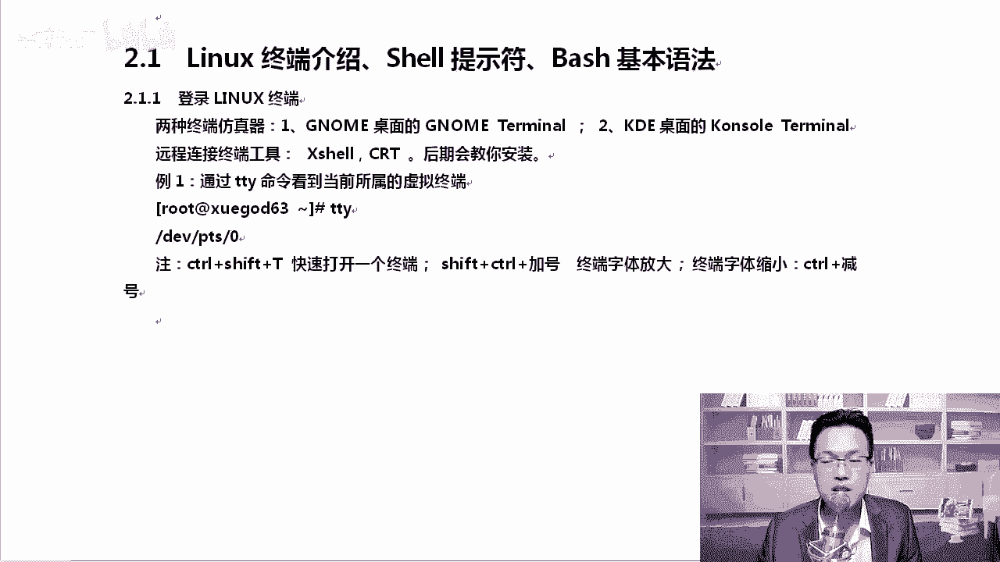

比如说呃我可能希望白底黑字，你可以点首选项，它可以调的啊。我们来调一下这个字体。呃，OK打到这个地方，比如说未命啊未命名在这里有一行，有一个叫什么颜色颜色这里你可以把这个你要把这个对勾打上是吧？

使用系统主体中的颜色，不用，就是它默认是tango暗暗色是吧？我们可以选。😊，好，我们内置方案里面有一个叫做白底黑字。这样会亮一下，我我更喜欢用这种方式，而且改完以后立即生效。

这里没有什么像微软经常微软的窗口上经常有确定按钮是吧？它是没有的。😊。

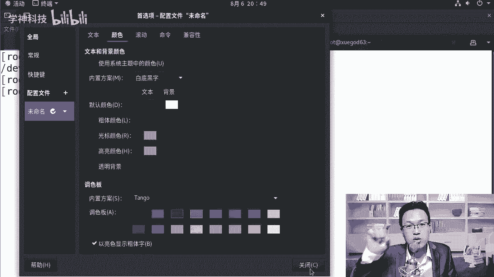

好，对，这样的话就是白色的啊，我挺喜欢这种风格的。根据你个人的习惯啊，我把这个截图也给大家总结到这里，怎么去修改的，改完后立即生效，没有保存按钮。😊。

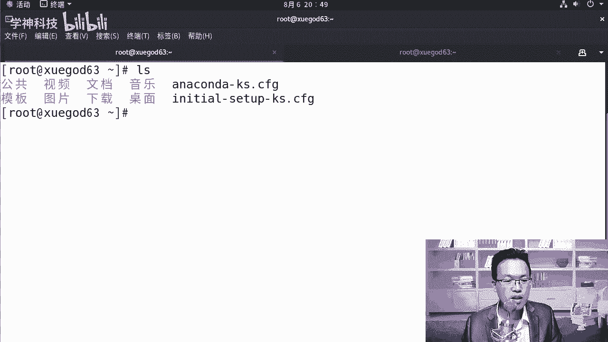

winwinin下经常是这样的啊，不像windows说，问你要不要保存。😡。

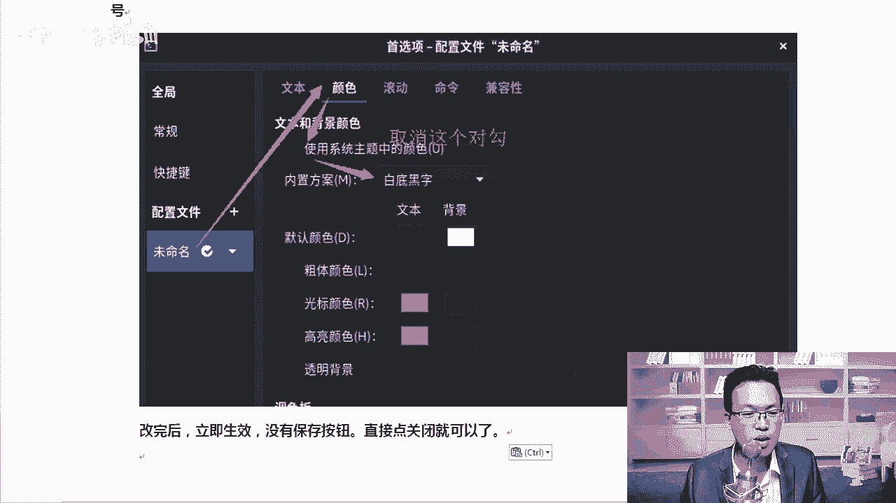

好，知道这个以后呢，就是有时候我们希望不同终端之间能够通个信是吧？比如说呃我们当前是TTY。😊，好吧，现在是零是吧？那这个呢TTY。😊，哎呦，再输一下，你看他叫。第V下PDSE这个东西大家了解一下啊。

linux下并不是所有东西都需要知道的。比如说ecle111，这是对屏幕上输出一个，就像print打印一样。okK它也可以通过间框，间括就是重定向，重定向给谁呢？比如说我们重建给PTSE。😊，好。

完事以后我们来看一下啊，你可以看到这里就显示了一有同学这有什么用啊？😊，跟我直接敲一下，111不是更爽吗？是这样的啊，就是。😊，这个东西大家了解一下就行。现在大家怎么样。

你的lininux可能更多的情况下，就你一个人用，或者说就咱们两个人在用，而且很少是吧？就是你也登上去操作，我也登上去操作，很少出现这种情况。但是在以前很早很早以前我们的lininux系统。

或者说我们的服务器是。😊，很珍贵的资源，不是谁都能随便摸啊，谁都能上手的。你懂我意思吧？那这个时候好多人可能你在上海，我在北京，咱俩共用一台机器，甚至一个研究所是吧，共用一台机器。

就像现在的大型机一样是吧？那不可能就你一个人用哈，很多机构都在用，那这个时候比如说你希望给对方是吧，通信说个话，那你就可以通过这种方式去说个话，比如说我给他说了个hello，我要关机或者怎么样。

现在咱们也不需要这种东西了啊。😊，好，比如说我爱口，那对方这个地方屏幕上就能出来哦，有人跟我说话了是吧？😊，现在我们直接微信过去一个电话过去就可以了。以前没有哪有什么微信，哪有什么QQ啊。

所以它有一个这样的功能。这个功能呢大家了解一下，也就是说不同的终端之间是吧，咱们是可以怎么样。😊。

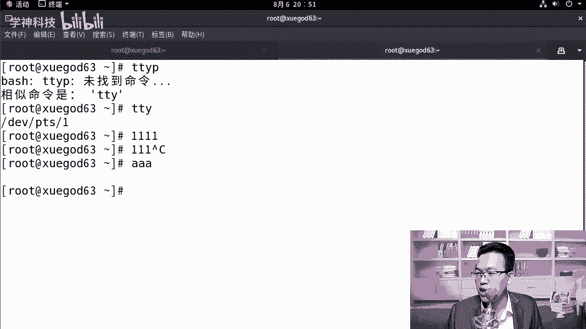

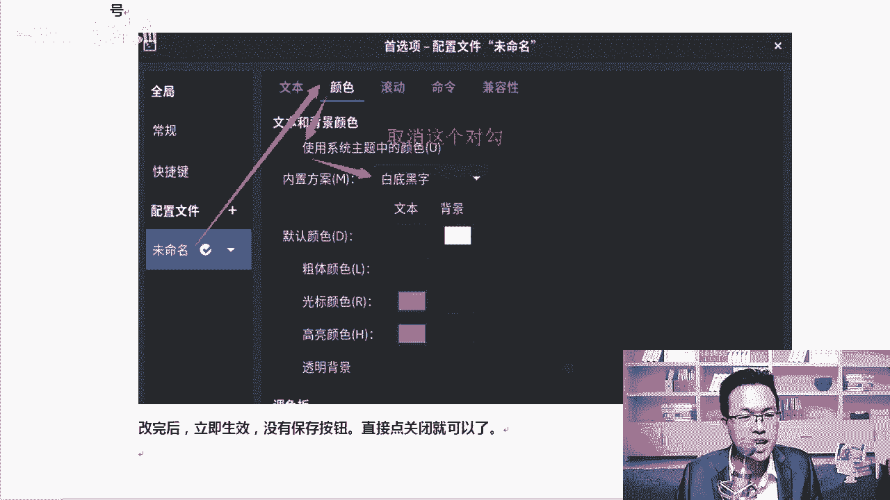

对，咱们之间是可以有一个这样的通信机制的啊。😊，啊，是可以有一个这样通讯机制的。比如说。其实这种现象经常是出现这种。比如我要对所有终端广播一个消息，就是系统10分钟后关机。啊，这个怎么实现呢？

这样方便你去这样理解。比如说是。上当好，上当加1。上当就关机这个命令。那么加完1以后，那它就会弹出相应的消息。当然这个地方这里不会弹出啊，如果你还有其他的远程的终端啊，也登上我的lininux啊。

那我执行这个命令，你也是一样可以收得到的。😊，好吧，那么在这里呢杀砂弹钢丝就可以了啊。😊，取消啊，这样就会取消这个关机，就像windows下这个一样。😊，好，除此以外，还有一个命令也可以实现。

就是w命令。这个大家了解一下啊，w命令也可以。比如说我们说我们广播一个消息啊，我们看一下。😊，这是不同终端之间的一个通信。让大家了解一下李啊，沃完了以后，我看一下这边有没有。哦，这边也没显示是吧。

这面没显示，没关系啊，那怎么才能显示出来呢？在这里。😊，我们打开这个终端给大家看一下，你打开叉cel终端就能看得到了。😊。

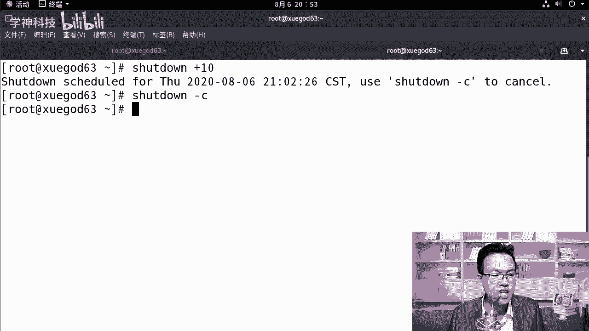

当然现在大家还不会插事啊，没关系，这个东西大家了解一下就行啊。你对它有一个简单的了解。😊，因为工作中这个命令其实用不到啊，举这个例子就想告诉大家什么呢？linux下有一些命令是的，我们用不到。😡。

你知道吧？比如说我们现在再次去执行这个杀当钢C。

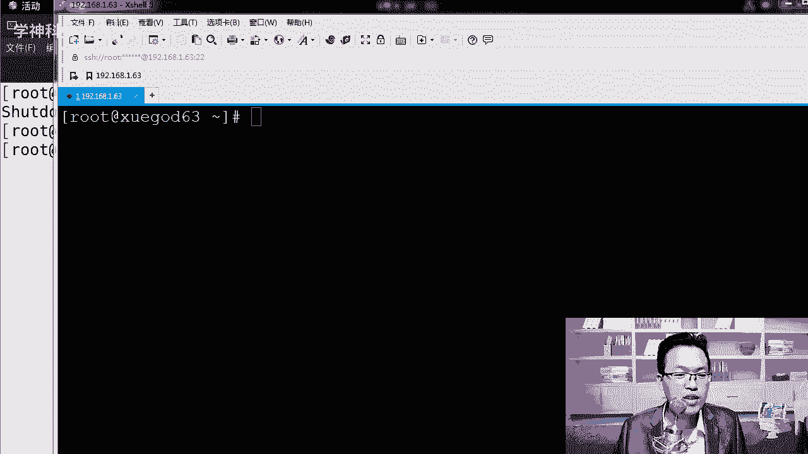

啊，那你可以看到这个。

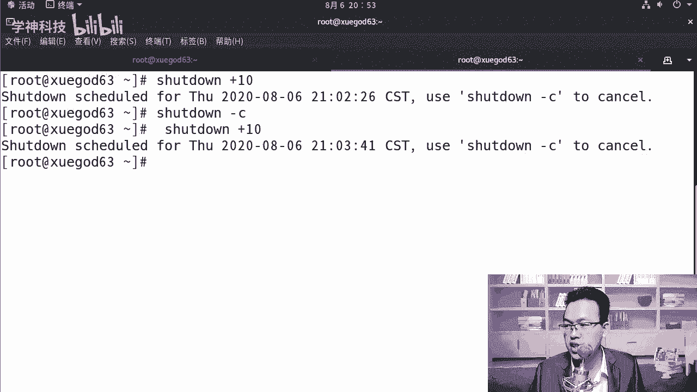

这里也会告诉你系统是吧，将在几分几秒是吧，将要关机。

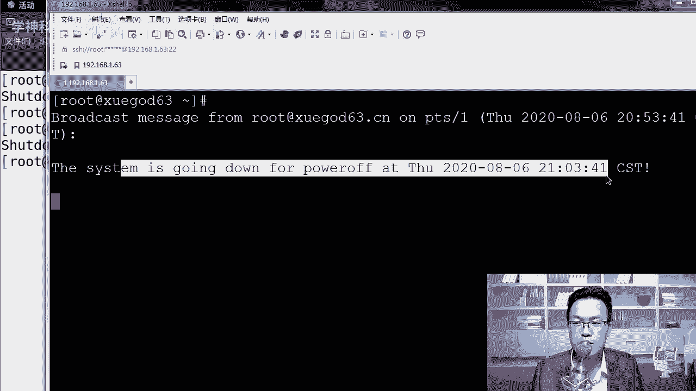

他也是能看到的那你想取消的话，沙狼刚飞完事以后呢，我们再次执行一下这个w命令。好，我把这个5命令粘一下啊。好，沃望完了以后呢，回车回完车以后呢，你可以看一下啊。

这里是不是就有了the system one B杀档，这次就广播就收到了。😊。

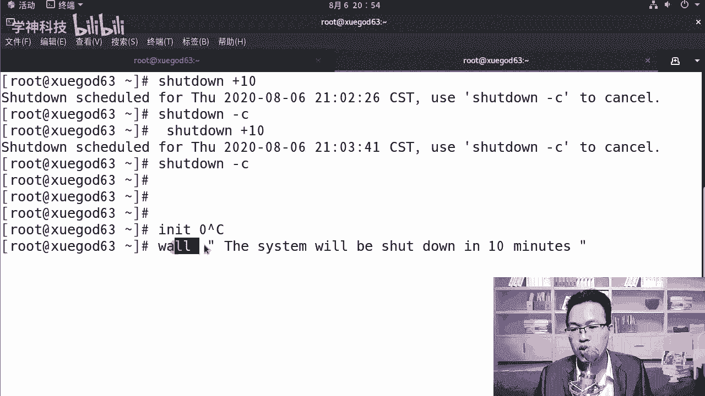

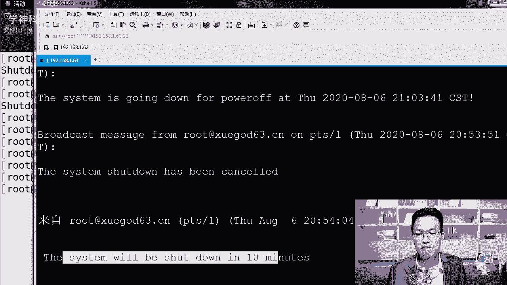

好不好？你通过这种叉远程终端连上去以后，就是不同终端之间，它们之间通信的时候是可以的。

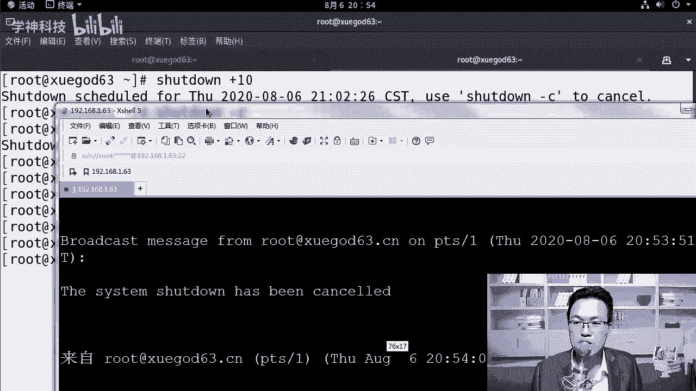

啊，大家知道一下，对它相当于是一个聊天工具啊，你也可以这样去理解。😊。

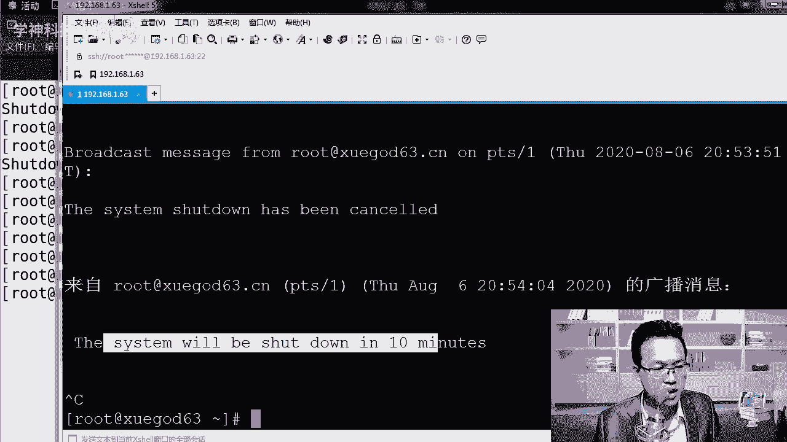

好，知道了这些以后呢，我们还是来踏踏实实的认识一下这个命令叫sll。sll俗称壳，它可以为用户怎么样提供了用户与内核进行交互的一种接口。他接受用户书的命令，并把它交给我们的内核去执行。

那shall实际上是个什么？天天说老师，我们学山尔脚本吗？学。什么是这样啊，我们来聊一聊。来大家看一下啊。上是一个壳是。shall在我们linux里面，其实它是一个命令解释器。

那它通过解释用户输入的命令，并把它交给内核去真正的执行。shall也有自己的编程规则啊，允许你去写啊，写一些循环语句啦，都可以。比如说写一些分支，我们来举一个例子。

画一张图给大家看一下shall的工作里流程。然后我们用户输入命令，命令会提交给shall。那比如说我们现在提交一个命令，就像我们刚才写的echo AAA命令，就是在屏幕上输出AAA。好吧，那这个命令呢。

😊，我们是吧？其实这个命令真正干活的一切所有需要干活的都是内核，内核帮你去完成所有的事情，对吧？那么在这里你总得交给内核去提交去执行。那么我用户输入一个命令提交给到sha里。

如果你的shall是我的内部命令，好吧？ok那么系统中的内核，如果是内部命令的话，那么系统中怎么样，系统内核中的功能就可以直接被调用。如果你是个外部命令。比如说我是个阿帕奇，我是个mysq狗数据库。

那么系统中怎么样，在系统中会查找该命令文件，并调入到内存里面再执行。也就是说在这里其实引入一个叫什么内部命令，一个叫shall的外部命令。啥叫shall内部命令。😊。

就是我摄下里面自身我就带了带了这些命令，好不好？那么内部命令在系统启动时就调入了内存是常驻的啊，所以执行效率比较高。外部命令呢是系统软件的，需要运行的时候才从磁盘里读出。😊，啊。

其实这个效率上也差不了多少。就比如说我我们要启动阿帕奇服务，这个阿帕奇服务肯定不是我们shall里面自带的。对不对？啊，那有同学我怎么知道我到底是内部还是外部呢？这个。😡，大家也了解一下就行。

因为我们用的过程中，谁管你内部和外部，我能执行就行了。是吧这是谁说的是吧，不管是白猫还是黑猫是吧，能把命啊，能挣到钱就是好的。😡，能抓到老鼠就是好的啊。😊，啊。

type啊type cat你你想知道它是不是，那你可以看一下啊，cat啊，ca是是是这样的一个命令。然后呢，我们type谁呢？😊，type什么PWD。你看PWD，它就是shall的内建命令。

所以有时候你想知道它是一个什么样命令，那我们可以通过这几个命令来给大家测一下，这是这些命令呢，大家。虽然什么呀？对，虽然可能大家很。就是在工作中很少这样去用这些命令。

但是你要知道lininux下是有个这样的概念的。😊，明白了吧？因为我们第一阶段主要就是学的lininux的基本操作。😡，啊，通过这些不常用的东西，让大家知道一下，哎，我们是有内部命令，外部命令的。

不至于有一天你蒙。好，知道一下这个我们来看一下，通过s，我们可以对linux实现哪些功能呢？其实通过s我们能实现很多用户的添加权限的管理，磁盘管理、软件管理、网络管理等等都可以。真的少。

那一会儿我们一步步来实现shall提示符。接下来shall提示符有个井号，有个doller。大家看到这个区别了吗？什么叫做shall提示符？整个这一串叫shall提示符。😊，好不好？对，整个这一串。

它叫shall提示符。这是一个提示符。那么SU比如说我们当时创建了MK的一个账号，我们切切到MK啊，那这个也叫好不好？它也叫闪耀提示服，两个都叫闪耀提示服。😊，我们来看一下它有什么区别呢？

你有注意到过吗？要学会观察好吧，我们先看一下井号和doller。井号的话，如果这里是井号，代表我是如的用户登录，我是超级管理员。如的就是linux下的最大的权限，最大的账号，权限最大的账号啊。

SU是切换的意思啊，SU是切换切换加一个根啊，加一个减号啊，这个减号是将环境变量还有加目录都切换一下，这样我彻底的切换成普通用户MK那么doller普通用户。😊，好吧。

这样的话你就能知道什么是超级管理员，什么是普通用户看sll的提示服务就可以了。除此以外呢。就刚才显示的这一块，每一段都是什么含义？MK来解释一下。第一个root好，方块，那就是方块括起来的啊。

root它代表你当前登录系统的用户名，我要切换成MK，那这里就变成MK了。😊，那么ar符作为一个分割符，然后后面这一段叫什么主机的名字。那波浪号是代表我当前所在的目录。

如果是波浪号代表当前的用户的加目录，代表我是在加目录里面啊，井号是root后面刀老是普通用户，你比如说我这个时候假如我切换到了ETC下，你看提示服就变了，就变成这个了。

那我再切呢ETC切换到s configurefi。

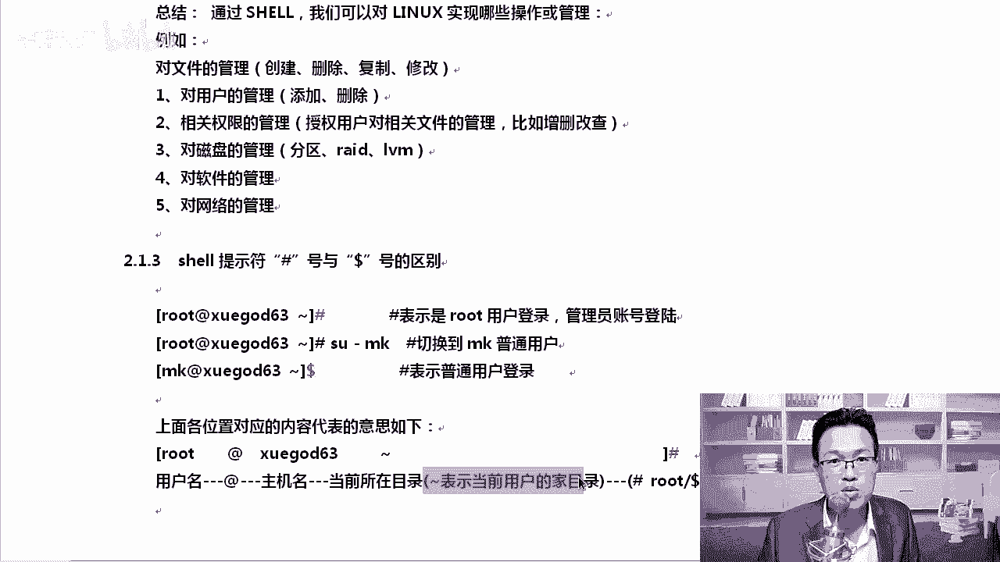

OK那代表我当前是在s configure这个路径下。😊，好吧，退出当前s入的话，用ESI就可以退出了。好。sll有几种？大叔叔。下这一种吗？现样不是只有一种啊。cut cat cat ETC下。

我们当前系统支持几种shall，你可以这样去看啊，我们ca ETC shares是吧？在这里我们能看到这些结果了吧，这就是我们当前shall的类型。😊。

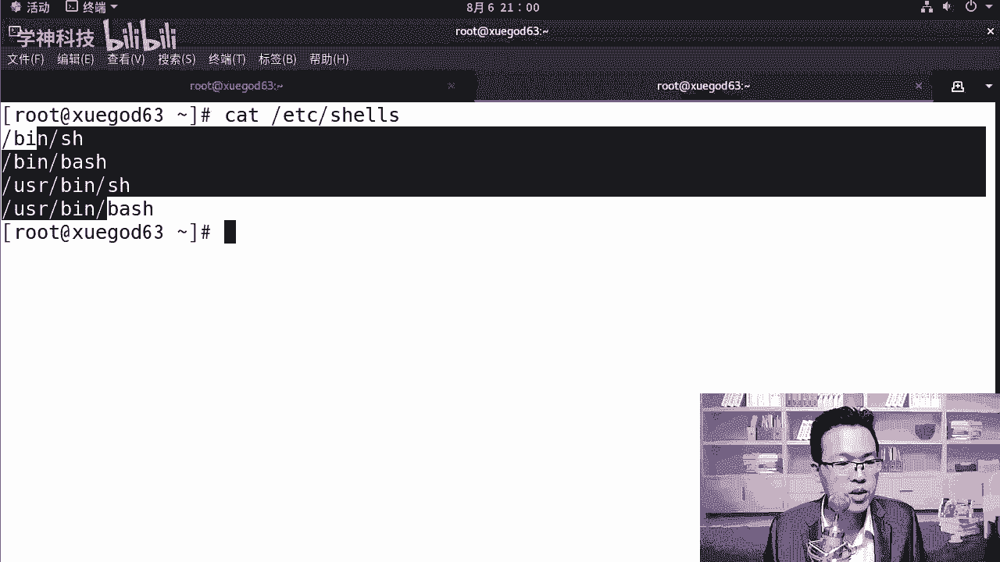

来。😔，看一下，我们去查看sll的类型，好吧，你具体使用哪一个取决于你的用户的配置。我们当前系统里就有这些还能有其他的吗？有，就像lininux内核一样，就像我们的操作系统内核一样。

它是有很多种lininux只是其中的一种。那我们来看一下，我怎么知道我当前用的是哪个呢？嗯那可以这样VM是个编辑器啊，或者你执行had命令也行。headETC下。😊，大家摁的时候是吧。

你可以按table补齐啊，比如说我敲完pasword以后，摁一下table，它就会补齐。但并不是说比如说那我只敲了一个这个呢，只敲了一个P吧，能补齐吗？摁一下补齐，摁两下。

它会将P开头的全都给你显示出来，这也是个快捷键，所以大家有时候敲命令的时候是吧，你要摁快捷键能让它自动补齐。因为很多同学敲的时候，哎，老师你看啊我敲完以后是吧？弹出的是这个界面。😊。

是吧很多同很多同学说，哎，老师，我唱完以后怎么没有呢？告诉我老师无法打开password。😊，对，因为你敲的时候敲错了。在第一阶段学习的过程中。你要报了错。

你就认真的对一下你敲的命令跟我敲的是不是一样的。😡，你敲的路径跟我敲的是不是一样的。比如说MK，我前面执行了ETCpaword，后面我们执行这个命令的时候，我写了一个什么？对我写了一个had啊。

password。结果呢结果有同学说老师我也执行一下had爬错的吧，反正你也执行这个我执行完了以后。😊，是有数据的，你执行完了以后是没有数据的那这个时候是哪的问题？告诉我那我的问题。嗯，想想。你在哪呢？

我在哪儿呢？😡，路径的问题。这样了吗？就是路径的问题啊。所以第一阶段大家学习的过程中，你报的错，或者说遇到坑了，就两种可能。第一种可能你把什么，你把命令的字母敲错了，我见过太多的同学了。😡。

OK因为你对他太不熟了。😡，第二种可能是什么？你所在的路径不对。就是这两种可能。主要是。对，剩下的几乎就没有了，因为剩下的都是基本命令，只要字母敲对了，绝对能出来结果。好。😡，我们来看一下啊。

headd password回原车以后呢，大家看到这个最后一列了吗？最后一列写的是什么，就代表你用户登录系统上执行的是什么shall。那我的rootro后面写的是并下的bsh。

那我执行的shall就是bsh。😊，是最常见的一种什么？啊，shall是最常但ash是最常见的一种shall。通过ETC passwordsword中每一行的最后一个字段。

我们可以确认用户使用的shall类型。head这个地方是默认查看这个文件，前十行只显示这个文件的前十行的内容。

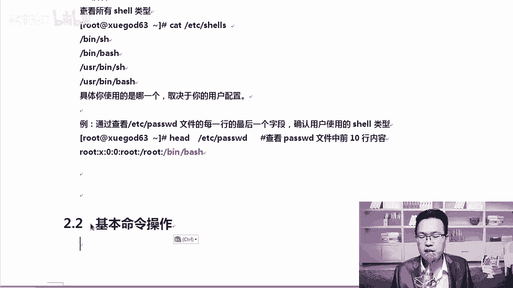

稍后我们看一下这个命令的基本操作。