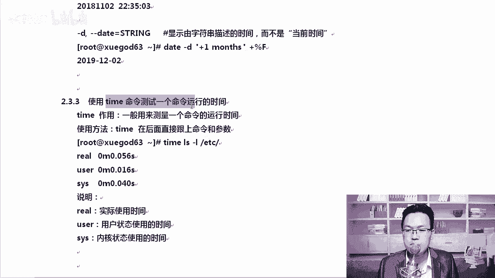

# Linux／RHCE／红帽认证／云计算／Linux资料／Linux教程／运维云计算／全国首家Centos8系列课程 - P9：3-系统时间管理 - 学神科技 - BV1BZ4y1g7TE

接着我们来聊一下lininux系统时间管理。那么在linux里有一个硬件时钟，还有一个叫做系统时钟两种。我们来了解一下怎么去查看硬件时钟。硬件时钟指的是主板上的那个时间，就boss上的时间。

系统指的是内核中的linux在启动的时候，系统会先去读取一下硬件时bis00。里边的时钟，然后呢再做怎么样，再做同步。我们来演示一下。

你比如说我们想执行的时候，可以执行HW clock，这个就是查看硬件时终。然后呢，be塔贝塔就是当前系统的时间。

好吧，正常情况下，我们这个时间是两个完全一样的啊，就是硬件时钟和当前这个系统时间是完全一样的。我这个不一样，是因为我在上课前做过调整，稍后我们可以给它调过来。😊。

好，我们来总结一下。😊，后面的CST是什么？你让大家知道一下啊。

在这里大家可以看到HW这个是硬件时间，data datata显示的时候，比如说刚才有个CST，它代表的是中国标准时间，还有GMT，还有我们的UTC世界标准时间。那如何去修改这个系统时间呢？来。

大家可以看一下，修改系用时间主要靠的就是。data这个命令啊，data后面一般会加一个杠S杠S后面是写什么，杠S后面写上这个字符串。对你要写一个字符串啊。那这个字符串是一个描述。

比如说我写data几几年的，我们我们这一次给他改正确，比如说这次给他改成20。20年那现在比如说我写个8月6号。对吧，10。07。好，那我们写完这个时间，我们来看一下。

回车。大家能看到这个时这样我就改成功了，时间就改了。改完以后，如果你想显示我们正常直接回车的话，它是年月日，然后星期，然后时间CST我们可能并不希望显示这么多的东西。比如我只想显示年月日可以吗？

可以datadata后面跟上双引号，双引号里面写个加号，加号后面跟上百分号F。😊。

回去这样的话，你只能直接显示的就是年月日，有同说这有什么好处呢？比如说我们要做一个备份，大家知道吗？我们要做一个备份系统，就是每一天都要做一次备份，那你总得取一下取什么取这个时间。😡，字符串。

那通过这一条命令，就可以把那个时间字符串给取出来。所以这个还是挺有用的。我来给你总结一下。

F代表的是完整的日期格式，相当于YMD就是前面里边是有减号的啊，相当于这么长的一个内容。他们所代表的都是什么含义？有同学怎么还要大写，怎么还有小写有。好吧，特殊符号啊，百分号Y的话代表是年份最后两位。

只显示最后两位大写的Y是整个四位数都显示。M代表的是月D的话是。按月啊记的日期啊，0再一个是把分号M是分钟，大写的M是分钟啊，小写的是代表月H是S大写的S是。Miao。那我们来写一下。

比如它都是这样去写的，你写的时候要写data，然后双引号或者单引号括起来括起来一般我们都用的是双引号啊，括起来以后加号要加要写这个加号，然后写百分号。😊。

Right。看一下，如果你觉得这样看起来不舒服，那你可以在它们之间加一个减号。😊，这样也是可以的。好不好？那我想显示什么，你也可以这样去显示啊。我把这种显示的日期大家尽量的去记住啊，记住它，你多敲两遍。

好，多敲两遍。空格后面跟上的是1分秒。对我带着大家看一下。你也可以以斜杠的方式啊，这个符号是可以替换的，看到了吗？对，这里是可以替换的，我们也可以以斜杠的方式来显示。或者我干脆什么也不显示。

这样也是可以的。啊，就是中间不加这个行，就是一个字符串，这样也是没有问题的。

好，我给你总结一下。常见的这个日期表达式就是这样表达的，大家自己多敲一瞧这个东西了解一下，后期它在哪里有用，它就在。修改系统时间其实很少我们去修改系统时间。因为我们可以通过网络进行时钟同步啊。

通过NTP网络。呃，时钟服务器是吧，进行同步。就像你的安卓手机一样，你现在很少很少是吧改时间了吧。我记得以前我们那些老式的手机扣了电池以后。😊，换电池，第一件事就赶紧把时间调一下。对吧现在不用了。

你插上以后，只要手机能联网，它能自动同步时间。那还有一个啊还有一个是这样的。你显示的时候，你可以这样。显示由字符串描述的时间，并不是当前时间。比如说我写data杠D杠D啊，之前杠D后面写上加一个月。

然后呢百分号F，那你可以这样去写。

百分F本身就是按照正常的年月日嘛，去显示加一个月是在当前系统上再加一个月，然后按照标准的时间去显示。如果不加这个这一个月的话是这样显示的。对吧不加的话，它就是正常年月日显示。

好，知道一下。好的。😔，再一个就是time好吧，time。另外我再跟大家说一下啊，就是现在这种系统是吧，我们一般情况下就是HW clock和我们的data时间是吧，都是一致的。😊。

好吧，就是都是一致的，什么时候是不一致的吗？我们以前在汕头S6的上是不一致的，stoS6上因为中国是加8。😊，就是你的系统时间要比你的bios时间是吧，快8个小时。清楚了吧。在s特S6的时候。

它是默认把什么对把bios时间作为一个标准时间。然后呢，因为我是东八区，所以我就再加上把。所以以前MK老师在物理机上装系统，装双系统，装一个windows，装一个linux。那个时间来回改总是改不对。

windows对了，winlinux就不对了。😡。

啊，不过现在好了，现在这些系统都有改进了，已经不存在这些问题了。😊，好，我们再聊一个time time是用来干嘛呢？time一般是用来测试一个命令的运行时间。那么time后面可以直接加命令和参数。

比如说time啊，正常我们LS杠L是查看这个文件夹的时，对吧？你可以这样去执行，那它能查看这一条命令耗时多长时间，干嘛使的，后期我们去做调优用。

在这里你可以看到re是我们真正在内核，比如说我为了展示啊展示这个目录像的内容所耗的时间。user是在用户态的s时代系统态的。😊。

什么意思呢？大家能理解吗？如是实际使用时间，比如说我们去中午了，该吃饭了。😡。

对吧。你排队的时间和回来的时间，对吧？你往过去走，走到那儿，真正吃饭的时候，你可能只用5分钟，但是我走过去是吧？轮到我能打上饭，我得等10分钟。然后呢，吃完饭以后往回走又得15分钟。😡。

再加上中间吃饭的5分钟，实际上真正的有效就能5分钟。啊，re要这个地方就是我们真正的什么真正这个程序在内核里占的时间啊。干什么呢？后面可以方便去计算一个命令啊，它占用CPU的时间。

好，这是关于时间这一块的描述。